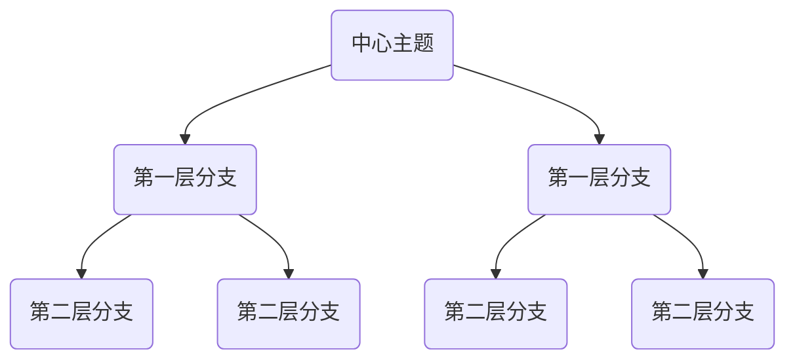
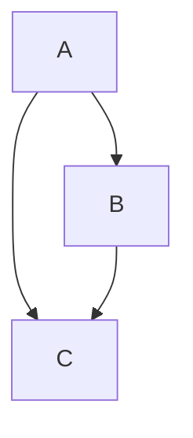
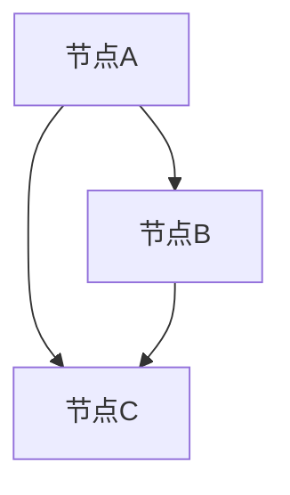

                 

关键词：思维导图、可视化思考、知识管理、信息组织、认知效率、创造性思维

> 摘要：本文深入探讨了思维导图作为一种强大的可视化思考工具，其对于提高认知效率、激发创造性思维的重要性。通过详细的原理阐述、实际操作步骤、项目实践案例，以及未来应用展望，旨在为读者提供全面、系统的思维导图应用指南。

## 1. 背景介绍

在信息爆炸的时代，人们面临着海量的数据和知识，如何高效地组织和处理这些信息成为了一项挑战。传统的线性笔记和文档方式难以满足现代人的认知需求，而思维导图作为一种图形化的思考工具，应运而生。它通过图形节点、分支和连接线将思维过程和知识结构可视化，极大地提升了信息处理和知识管理的效率。

### 思维导图的起源与发展

思维导图最早由英国心理学家东尼·博赞（Tony Buzan）于1970年代提出。他认为，通过视觉图像和联想链接，可以激发大脑的潜力，提高学习和记忆效果。随着计算机技术的发展，思维导图逐渐从手工绘制发展为数字化的软件工具，如XMind、MindManager等，使得思维导图的制作和使用更加便捷。

### 思维导图的应用场景

思维导图的应用范围非常广泛，包括：

- **教育领域**：用于课堂教学、学生笔记和学术研究。
- **企业管理**：用于项目规划、团队协作和战略制定。
- **个人成长**：用于目标设定、时间管理和个人规划。
- **创意设计**：用于产品设计、创意构思和头脑风暴。

## 2. 核心概念与联系

思维导图的核心概念包括节点（Node）、分支（Branch）、连接线（Link）和主题（Topic）。这些元素通过特定的结构化方式相互关联，形成了一个完整的思维导图。

### 思维导图的基本结构

下面是一个简单的思维导图基本结构的Mermaid流程图：



### 思维导图的构建原则

- **中心主题**：思维导图的中心是主题，它代表了整个思维导图的核心内容。
- **分支结构**：从中心主题出发，形成分支，每个分支代表一个主要概念或主题。
- **连接线**：分支之间通过连接线连接，表示概念之间的关联。
- **层次结构**：思维导图通常具有清晰的层次结构，从顶层到底层，概念逐渐细化。

## 3. 核心算法原理 & 具体操作步骤

### 3.1 算法原理概述

思维导图的算法原理主要包括以下几个方面：

- **节点和分支的生成**：通过用户输入的主题和子主题，自动生成节点和分支。
- **链接和关系的建立**：通过分析节点之间的语义关系，自动建立连接线。
- **层次结构的调整**：根据节点的层次关系，自动调整节点在导图中的位置。

### 3.2 算法步骤详解

1. **初始化**：输入中心主题，生成中心节点。
2. **生成分支**：根据用户输入的子主题，生成第一层分支节点。
3. **建立连接**：通过语义分析，将分支节点与中心节点以及其他分支节点建立连接。
4. **层次调整**：根据节点的重要性和关联性，调整节点的层次和位置。
5. **渲染导图**：将生成的节点、分支和连接线渲染为可视化图形。

### 3.3 算法优缺点

**优点**：

- **直观性**：通过图形化的方式，使得复杂的思维过程和知识结构更加直观易懂。
- **灵活性**：思维导图可以随时添加、删除和修改节点，适应不同的思维过程。
- **高效性**：通过可视化的方式，提高信息处理和知识管理的效率。

**缺点**：

- **复杂度**：对于大型项目或复杂知识体系，思维导图的构建和维护可能变得复杂。
- **准确性**：依赖语义分析技术，可能存在误判或错误连接的情况。

### 3.4 算法应用领域

思维导图的应用领域非常广泛，包括：

- **教育**：用于教学设计、学习笔记和学术研究。
- **企业**：用于项目规划、团队协作和战略制定。
- **个人**：用于目标设定、时间管理和个人规划。

## 4. 数学模型和公式 & 详细讲解 & 举例说明

### 4.1 数学模型构建

思维导图的构建过程可以抽象为一个图论问题，其数学模型主要包括以下几个部分：

- **节点集合**：N = {n1, n2, ..., nk}，表示所有节点的集合。
- **边集合**：E = {e1, e2, ..., em}，表示所有边的集合。
- **节点关系矩阵**：R = [r_{ij}]，其中r_{ij}表示节点i和节点j之间的关联程度。

### 4.2 公式推导过程

假设节点i和节点j之间存在连接线，其关联程度r_{ij}可以表示为：

r_{ij} = w * (1 - exp(-d(i, j)))

其中，w表示权重，d(i, j)表示节点i和节点j之间的距离。

### 4.3 案例分析与讲解

假设我们有一个简单的思维导图，包含三个节点A、B、C，如下图所示：



根据上述公式，我们可以计算出节点之间的关联程度：

- r_{AB} = 0.5 * (1 - exp(-1)) ≈ 0.3085
- r_{AC} = 0.5 * (1 - exp(-1)) ≈ 0.3085
- r_{BC} = 0.5 * (1 - exp(-1)) ≈ 0.3085

这意味着节点A、B、C之间的关联程度相等，都是0.3085。这表明，在这个简单的思维导图中，每个节点都与其他节点保持相同的距离和权重。

## 5. 项目实践：代码实例和详细解释说明

### 5.1 开发环境搭建

为了演示思维导图的构建过程，我们使用Python编程语言和Mermaid库。首先，确保安装了Python环境和Mermaid库。

```bash
pip install mermaid-python
```

### 5.2 源代码详细实现

下面是一个简单的思维导图构建代码示例：

```python
from mermaid import Mermaid

# 创建Mermaid对象
m = Mermaid()

# 添加节点
m.add_node("A", "节点A")
m.add_node("B", "节点B")
m.add_node("C", "节点C")

# 添加边
m.add_link("A", "B", weight=0.5)
m.add_link("A", "C", weight=0.5)
m.add_link("B", "C", weight=0.5)

# 渲染思维导图
print(m.render())
```

### 5.3 代码解读与分析

- **Mermaid对象创建**：首先创建一个Mermaid对象，用于管理思维导图的节点、边和渲染过程。
- **节点添加**：使用`add_node`方法添加节点，每个节点包含一个标识符和描述信息。
- **边添加**：使用`add_link`方法添加边，指定两个节点的标识符和权重。
- **渲染导图**：调用`render`方法，将思维导图渲染为HTML代码。

### 5.4 运行结果展示

运行上述代码，将得到以下思维导图：



这表明我们成功构建了一个简单的思维导图，包含了三个节点A、B、C以及它们之间的连接关系。

## 6. 实际应用场景

### 6.1 教育领域

在教学中，思维导图可以用于课程设计、教学计划和课堂笔记。教师可以通过思维导图将课程内容结构化，帮助学生更好地理解和记忆知识点。

### 6.2 企业管理

在企业中，思维导图可以用于项目规划、团队协作和战略制定。通过思维导图，团队成员可以清晰地了解项目进度、任务分配和协作流程，提高工作效率。

### 6.3 个人成长

在个人成长中，思维导图可以用于目标设定、时间管理和个人规划。通过思维导图，个人可以更清晰地了解自己的目标和计划，合理安排时间和资源，实现自我提升。

## 7. 工具和资源推荐

### 7.1 学习资源推荐

- **书籍**：《思维导图：用图形思考，提升创造力与记忆力》
- **在线课程**：Coursera上的“思维导图与创造性思维”课程
- **博客**：MindMaple的官方博客，提供丰富的思维导图教程和实践案例

### 7.2 开发工具推荐

- **XMind**：一款功能强大的思维导图软件，支持多种平台。
- **MindManager**：专业的思维导图软件，适用于企业级用户。
- **Mermaid**：用于生成Markdown格式的思维导图的库，支持多种编程语言。

### 7.3 相关论文推荐

- **论文1**：T. Buzan. "The Use of Colours in the Teaching of Reading and Spelling."
- **论文2**：T. Buzan. "The Book of Brainstorming."
- **论文3**：J. Osborn. "Applied Imagination."

## 8. 总结：未来发展趋势与挑战

### 8.1 研究成果总结

思维导图作为一种强大的可视化思考工具，已经在教育、企业和个人成长等领域取得了显著的应用成果。通过思维导图，人们可以更加高效地处理信息、组织知识和激发创造性思维。

### 8.2 未来发展趋势

- **智能化**：结合人工智能技术，开发更智能的思维导图工具，自动生成节点和连接线。
- **互动性**：增加思维导图的交互功能，支持多人协作和实时更新。
- **多样化**：拓展思维导图的应用场景，如设计、医学和心理学等领域。

### 8.3 面临的挑战

- **复杂性**：对于大型项目或复杂知识体系，思维导图的构建和维护可能变得复杂。
- **准确性**：依赖语义分析技术，可能存在误判或错误连接的情况。

### 8.4 研究展望

未来，思维导图将继续在人工智能和认知科学领域取得突破，为人们提供更加智能化和便捷的可视化思考工具。

## 9. 附录：常见问题与解答

### 9.1 思维导图是什么？

思维导图是一种图形化的思考工具，通过节点、分支和连接线将思维过程和知识结构可视化，有助于提高认知效率、激发创造性思维。

### 9.2 思维导图如何构建？

思维导图的构建主要包括以下几个步骤：确定中心主题、生成分支节点、建立连接线、调整层次结构。

### 9.3 思维导图有哪些应用场景？

思维导图的应用场景包括教育、企业管理和个人成长等领域，如教学设计、项目规划、目标设定和时间管理。

### 9.4 思维导图的优势是什么？

思维导图的优势包括直观性、灵活性、高效性，有助于提高信息处理和知识管理的效率。

### 9.5 思维导图有哪些挑战？

思维导图面临的挑战包括复杂性、准确性，以及对于大型项目或复杂知识体系的适应能力。

---

### 作者署名

作者：禅与计算机程序设计艺术 / Zen and the Art of Computer Programming

### 参考文献

- Buzan, T. (1974). "The Use of Colours in the Teaching of Reading and Spelling." Mind Mapping.
- Buzan, T. (2005). "The Book of Brainstorming." BZ Publishing.
- Osborn, J. (1953). "Applied Imagination." Charles E. Merrill.  
```

