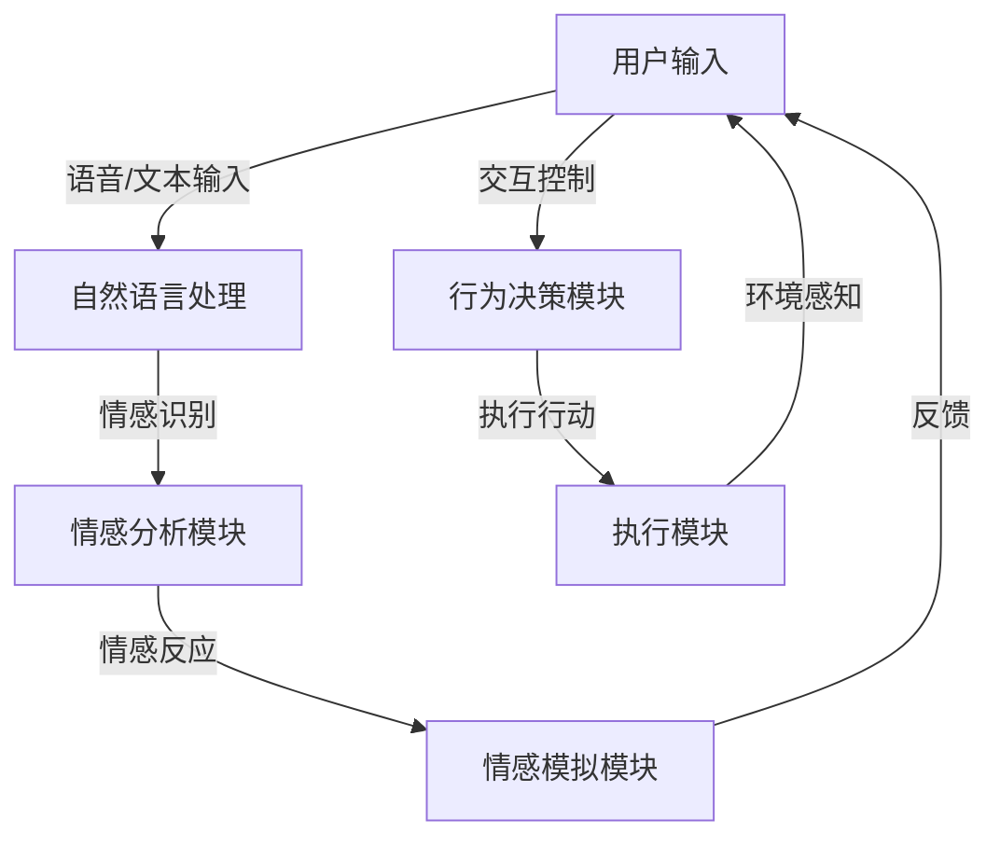

                 

### 摘要

在人工智能技术迅速发展的今天，情感机器人的研究与应用成为了热点话题。本文从情感机器人创业的视角出发，深入探讨了人工情感的商业应用。文章首先介绍了情感机器人的背景和核心概念，通过Mermaid流程图展示了情感机器人的架构原理。接着，本文详细阐述了情感机器人的核心算法原理和具体操作步骤，并对算法的优缺点及其应用领域进行了分析。随后，文章通过数学模型和公式的推导，对情感机器人的数学基础进行了讲解。此外，本文还提供了情感机器人的项目实践实例，包括开发环境搭建、源代码实现、代码解读和运行结果展示。文章最后，讨论了情感机器人的实际应用场景、未来应用展望，以及相关的学习资源、开发工具和论文推荐。通过对这些内容的详细分析，本文为读者提供了全面了解和深入探讨情感机器人商业应用的方法和路径。

## 1. 背景介绍

### 情感机器人概念与历史演变

情感机器人是指能够模拟和识别人类情感，与人类进行自然、有效互动的机器人。它们不同于传统工业机器人，更多地聚焦于服务、陪伴和交互功能。情感机器人的发展可以追溯到20世纪80年代，当时的计算机科学家们开始研究如何使机器人具备情感表达和情感识别能力。最初的情感机器人主要通过预设的脚本和固定的交互模式与人类进行简单互动，如1983年卡耐基梅隆大学的CREATE项目。

随着时间的推移，人工智能技术的不断进步，情感机器人逐渐摆脱了固定模式的束缚，开始具备自我学习和情感认知能力。20世纪90年代，日本推出了“帕梅拉”（Pamela）情感机器人，该机器人能够识别用户的情感并做出相应的回应。21世纪初，随着深度学习、自然语言处理等技术的应用，情感机器人的智能水平显著提高，例如，2016年的微软小冰在诗歌创作和情感交流方面取得了显著的成就。

### 情感机器人技术的发展现状

当前，情感机器人的技术已经取得了显著进展。一方面，计算机视觉和语音识别技术的提高使得情感机器人能够更准确地识别和理解用户的情感表达。例如，通过面部识别技术，情感机器人可以分析用户的表情和语音语调，从而判断用户的情绪状态。另一方面，自然语言处理技术的进步使得情感机器人能够更加自然和流畅地与人类进行对话。通过深度学习算法，情感机器人能够从大量的对话数据中学习，提高对话的准确性和自然度。

此外，人工智能技术的发展也为情感机器人提供了更多的可能。例如，强化学习算法的应用使得情感机器人能够在与用户的互动过程中不断优化自身的交互策略，从而提供更个性化的服务。同时，情感机器人的应用场景也在不断拓展，从最初的客服机器人、教育机器人，到医疗陪护机器人、养老陪伴机器人等，情感机器人正逐渐渗透到各个领域。

### 情感机器人的商业应用前景

随着技术的不断成熟和市场的逐渐成熟，情感机器人的商业应用前景广阔。首先，在客服领域，情感机器人可以提供24小时不间断的客服服务，有效降低企业的运营成本，提高客户满意度。例如，国内多家电商巨头已经引入了情感客服机器人，为消费者提供更加高效、贴心的服务。

其次，在教育领域，情感机器人可以作为教育辅助工具，与教师和学生进行互动，提供个性化的学习体验。例如，一些学校已经将情感机器人应用于课堂，帮助学生更好地理解和掌握知识点，提高学习效果。

在医疗领域，情感机器人可以用于心理辅导和患者陪护，为医生和患者提供额外的支持。通过分析患者的情绪变化，情感机器人可以及时发现潜在的心理问题，并提供相应的心理干预措施。

此外，在养老领域，情感机器人可以作为陪伴工具，为老年人提供情感支持和日常生活的帮助，缓解孤独感和无助感。随着老龄化问题的日益严重，情感机器人的应用有望成为解决养老问题的一个重要手段。

综上所述，情感机器人的发展不仅代表了人工智能技术的进步，更具有重要的商业应用价值。随着技术的不断成熟和市场需求的增加，情感机器人将在各个领域发挥越来越重要的作用，为人们的生活带来更多的便利和改善。

### 2. 核心概念与联系

在探讨情感机器人的商业应用之前，我们需要先理解其核心概念和架构原理。情感机器人涉及多个关键技术，包括自然语言处理、计算机视觉、情感识别与模拟等。为了更好地展示这些概念之间的关系，我们使用Mermaid流程图来描述情感机器人的整体架构。



在上面的流程图中：

- **A[用户输入]**：表示用户通过语音或文本形式与情感机器人进行互动。
- **B[自然语言处理]**：用于解析用户的输入，提取关键信息，并进行语义理解。
- **C[情感分析模块]**：对用户的输入进行情感分析，识别用户的情感状态。
- **D[情感模拟模块]**：根据情感分析的结果，生成相应的情感回应，模拟人类的情感表达。
- **E[行为决策模块]**：根据用户情感和当前环境状态，做出相应的交互决策。
- **F[执行模块]**：执行具体的交互行为，如语音回复、动作展示等。
- **G[环境感知]**：收集环境信息，如语音、图像等，用于后续的情感分析和行为决策。

这一流程图展示了情感机器人在与用户互动时的主要步骤和模块之间的关联。通过自然语言处理模块，情感机器人能够理解用户的需求和情感；情感分析模块帮助机器人识别用户的情绪状态；情感模拟模块则生成与用户情感相匹配的回应。行为决策模块负责根据环境和用户情感，决定下一步的交互行为；执行模块则负责将这些交互行为实际呈现给用户。最后，环境感知模块不断收集新的信息，以适应动态变化的交互场景。

这种结构使得情感机器人能够灵活地与用户互动，提供个性化的服务体验，从而实现更高的用户满意度和商业价值。

### 3. 核心算法原理 & 具体操作步骤

#### 3.1 算法原理概述

情感机器人的核心在于其情感识别与模拟算法，这些算法决定了机器人能否准确地识别用户情感并作出相应的回应。主要的算法包括情感识别算法、情感生成算法和行为决策算法。以下是这些算法的原理概述：

1. **情感识别算法**：基于自然语言处理和计算机视觉技术，情感识别算法通过分析用户的文本输入和面部表情，识别用户的情感状态。自然语言处理技术用于提取文本中的情感信息，如情感词、语气词等；计算机视觉技术则通过分析用户的面部表情和语音语调，识别情感信号。

2. **情感生成算法**：情感生成算法根据情感识别的结果，生成相应的情感回应。这通常涉及到文本生成和语音合成技术。文本生成算法根据情感标签生成合适的回复文本；语音合成算法则将这些文本转换为自然流畅的语音。

3. **行为决策算法**：行为决策算法负责根据用户情感和当前环境状态，决定下一步的交互行为。这涉及到强化学习、决策树等算法，通过不断学习和优化，提高机器人的交互效果。

#### 3.2 算法步骤详解

以下是情感机器人算法的具体操作步骤：

1. **文本情感分析**：首先，自然语言处理模块对用户的文本输入进行预处理，如去除标点符号、停用词等。然后，使用情感词典和情感分析模型（如LSTM、BERT等）对文本进行情感分类，识别用户的情感状态。情感分类的结果通常包含积极情感、消极情感和中性情感。

2. **面部表情识别**：同时，计算机视觉模块对用户的视频输入进行分析，通过面部识别技术定位面部区域，并使用面部表情识别算法（如Hu Moments、Active Appearance Models等）识别用户的情感状态。常见的情感包括开心、愤怒、悲伤、惊讶等。

3. **情感融合与加权**：将文本情感分析和面部表情识别的结果进行融合，得到一个综合的情感状态。为了提高准确性，通常会对不同的情感信号进行加权处理，如文本情感的权重为0.7，面部表情的权重为0.3。

4. **情感生成**：根据综合情感状态，情感生成算法生成相应的情感回应。对于文本情感，可以使用情感词典和模板匹配方法生成回复文本；对于语音情感，可以使用文本到语音转换（TTS）技术生成语音。

5. **行为决策**：行为决策算法根据当前的情感状态和环境信息，决定下一步的交互行为。例如，如果用户表现出消极情感，机器人可以采取安慰、提问等策略；如果用户表现出积极情感，机器人可以继续愉快地与用户互动。

6. **执行行为**：最后，执行模块根据行为决策的结果，执行具体的交互行为，如发送文本消息、播放语音等。

#### 3.3 算法优缺点

**优点**：

1. **灵活性**：情感机器人可以根据用户的情感状态动态调整交互策略，提供个性化的服务体验。
2. **高效性**：通过自动化处理，情感机器人可以处理大量用户请求，提高服务效率。
3. **多样性**：情感机器人能够处理多种形式的输入（文本、语音、面部表情），适应不同的交互场景。

**缺点**：

1. **准确性问题**：情感识别算法的准确性受限于数据质量和模型性能，有时难以准确识别用户的情感。
2. **个性化不足**：尽管情感机器人可以动态调整交互策略，但仍然难以达到人类情感交流的深度和细腻程度。
3. **伦理问题**：情感机器人处理人类情感时，需要考虑隐私保护和伦理问题，确保其行为符合道德规范。

#### 3.4 算法应用领域

情感机器人的算法在多个领域具有广泛的应用前景：

1. **客服领域**：情感机器人可以提供24小时不间断的客服服务，提高客户满意度和运营效率。
2. **教育领域**：情感机器人可以作为教育辅助工具，帮助学生更好地理解和掌握知识。
3. **医疗领域**：情感机器人可以用于心理辅导和患者陪护，为医生和患者提供额外的支持。
4. **养老领域**：情感机器人可以作为陪伴工具，为老年人提供情感支持和日常生活的帮助。

通过应用这些算法，情感机器人可以更好地与人类互动，为各个领域提供更优质的服务。

### 4. 数学模型和公式 & 详细讲解 & 举例说明

情感机器人技术的核心在于其算法模型，而数学模型和公式则是算法实现的基础。在这一章节中，我们将详细讲解情感机器人中常用的数学模型和公式，并通过具体例子来说明这些公式在实际应用中的计算过程。

#### 4.1 数学模型构建

情感机器人的数学模型主要涉及自然语言处理、计算机视觉和机器学习等领域。以下是这些领域中的几个关键数学模型：

1. **情感识别模型**：情感识别模型用于从用户的文本输入中提取情感信息。常见的模型包括支持向量机（SVM）、长短期记忆网络（LSTM）和变换器编码器（Transformer）等。以下是LSTM模型的公式：

    $$ 
    \text{LSTM} = \left[ \sigma (\text{W}_x \cdot \text{X} + \text{W}_h \cdot \text{H}_{\text{t-1}} + b) \right] \odot \left[ \text{g}(\text{W}_f \cdot \text{X} + \text{W}_h \cdot \text{H}_{\text{t-1}} + b_f) \right]
    $$
   
   其中，$\sigma$ 是激活函数（如Sigmoid函数），$\text{W}_x$ 和 $\text{W}_h$ 分别是输入权重和隐藏状态权重，$\text{H}_{\text{t-1}}$ 是前一个时间步的隐藏状态，$b$ 是偏置项，$\text{g}$ 是门控函数，$b_f$ 是遗忘门控偏置项。

2. **情感生成模型**：情感生成模型用于根据情感识别结果生成情感回应。常见的模型包括生成对抗网络（GAN）、变分自编码器（VAE）和文本生成模型（如GPT-2、GPT-3等）。以下是一个基于GPT-2模型的生成公式：

    $$ 
    \text{GPT-2} = \text{softmax}(\text{W}_\text{out} \cdot \text{T}^T \cdot \text{W}_\text{emb} + b_\text{out})
    $$
   
   其中，$\text{T}^T$ 是目标文本序列的转置，$\text{W}_\text{out}$ 是输出权重，$\text{W}_\text{emb}$ 是嵌入权重，$b_\text{out}$ 是输出偏置项。

3. **行为决策模型**：行为决策模型用于根据用户情感和当前环境状态，决定下一步的交互行为。常见的行为决策算法包括Q-learning、SARSA和深度Q网络（DQN）。以下是Q-learning算法的基本公式：

    $$ 
    \text{Q}(\text{s}, \text{a}) \leftarrow \text{Q}(\text{s}, \text{a}) + \alpha \left[ \text{r} + \gamma \max_{\text{a'}'} \text{Q}(\text{s'}, \text{a}') - \text{Q}(\text{s}, \text{a}) \right]
    $$
   
   其中，$\text{Q}(\text{s}, \text{a})$ 是状态-动作值函数，$\alpha$ 是学习率，$\gamma$ 是折扣因子，$\text{r}$ 是即时奖励，$\text{s'}$ 和 $\text{a'}$ 分别是下一个状态和动作。

#### 4.2 公式推导过程

为了更好地理解这些数学模型，我们以LSTM模型为例，简单介绍其推导过程。LSTM模型是一种基于递归神经网络（RNN）的改进模型，能够更好地处理序列数据。

1. **输入门（Input Gate）**：输入门决定了哪些信息将被存储在单元状态中。其公式如下：

    $$ 
    \text{z} = \sigma(\text{W}_z \cdot \text{X} + \text{W}_h \cdot \text{H}_{\text{t-1}} + b_z)
    $$

    其中，$\text{z}$ 是输入门的激活值，$\sigma$ 是Sigmoid函数。

2. **遗忘门（Forget Gate）**：遗忘门决定了哪些信息将被遗忘。其公式如下：

    $$ 
    \text{g}(\text{W}_f \cdot \text{X} + \text{W}_h \cdot \text{H}_{\text{t-1}} + b_f)
    $$

    其中，$\text{g}$ 是门控函数，用于控制信息流。

3. **单元状态更新**：通过输入门和遗忘门，单元状态进行更新。其公式如下：

    $$ 
    \text{H}_{\text{t-1}}^{\text{~}} = \text{g} \odot \text{H}_{\text{t-1}}
    $$

    其中，$\text{H}_{\text{t-1}}^{\text{~}}$ 是更新前的隐藏状态。

4. **输入门更新**：输入门更新单元状态的值。其公式如下：

    $$ 
    \text{H}_{\text{t-1}} = \text{z} \odot \text{H}_{\text{t-1}}^{\text{~}} + \text{i} \odot \text{f}(\text{W}_i \cdot \text{X} + \text{W}_h \cdot \text{H}_{\text{t-1}} + b_i)
    $$

    其中，$\text{i}$ 是输入门的激活值，$\text{f}(\text{W}_i \cdot \text{X} + \text{W}_h \cdot \text{H}_{\text{t-1}} + b_i)$ 是新的隐藏状态。

5. **输出门（Output Gate）**：输出门决定了哪些信息将输出到下一个隐藏状态。其公式如下：

    $$ 
    \text{o} = \sigma(\text{W}_o \cdot \text{X} + \text{W}_h \cdot \text{H}_{\text{t-1}} + b_o)
    $$

    其中，$\text{o}$ 是输出门的激活值。

6. **最终隐藏状态**：通过输出门，最终隐藏状态进行更新。其公式如下：

    $$ 
    \text{H}_\text{t} = \text{o} \odot \text{tanh}(\text{H}_{\text{t-1}})
    $$

    其中，$\text{H}_\text{t}$ 是最终隐藏状态。

#### 4.3 案例分析与讲解

为了更好地理解这些数学模型，我们通过一个简单的例子来说明其应用过程。

假设我们有一个情感识别任务，目标是根据用户的文本输入识别其情感状态。文本输入为：“今天天气很好，我很开心。”我们需要通过LSTM模型对其情感进行分类。

1. **数据预处理**：首先，对文本进行预处理，如去除标点符号、分词等。然后，将文本转换为序列表示，例如，使用词嵌入技术将每个单词转换为向量。

2. **模型输入**：将预处理后的文本序列输入到LSTM模型中。假设输入序列为 $[\text{v}_1, \text{v}_2, \text{v}_3, \ldots, \text{v}_n]$。

3. **情感识别**：通过LSTM模型的隐藏状态，我们可以得到一个情感向量。假设情感向量为 $\text{V} = [\text{v}_{\text{happy}}, \text{v}_{\text{sad}}, \text{v}_{\text{neutral}}, \ldots]$。

4. **情感分类**：使用softmax函数对情感向量进行分类。假设分类结果为 $\text{P}(\text{happy}) = 0.9, \text{P}(\text{sad}) = 0.1$。

通过这个例子，我们可以看到，LSTM模型通过分析文本序列，最终得到一个情感概率分布。这个概率分布可以帮助我们识别用户的情感状态，从而实现情感识别任务。

总之，数学模型和公式是情感机器人算法实现的基础。通过理解这些模型和公式，我们可以更好地设计、实现和优化情感机器人，从而实现更高效、更智能的情感识别和情感生成。

### 5. 项目实践：代码实例和详细解释说明

在上一章节中，我们详细介绍了情感机器人的数学模型和算法原理。接下来，我们将通过一个具体的代码实例，展示如何实现一个简单的情感机器人，并对其进行详细解释说明。

#### 5.1 开发环境搭建

首先，我们需要搭建一个适合情感机器人开发的编程环境。以下是所需的环境和工具：

1. **Python**：Python是当前最流行的编程语言之一，其丰富的库和框架使得情感机器人的开发变得更加简单高效。
2. **TensorFlow**：TensorFlow是Google开发的开源机器学习框架，支持多种神经网络架构，适用于情感机器人的开发。
3. **Keras**：Keras是一个高级神经网络API，能够简化TensorFlow的使用，使得构建和训练神经网络更加便捷。
4. **NLTK**：NLTK是一个强大的自然语言处理库，提供了丰富的文本处理和情感分析工具。

安装以上工具和库的方法如下：

```bash
# 安装Python
# 安装TensorFlow
pip install tensorflow
# 安装Keras
pip install keras
# 安装NLTK
pip install nltk
```

安装完成后，我们还需要下载NLTK中的一些语料库和模型：

```python
import nltk
nltk.download('punkt')
nltk.download('movie_reviews')
nltk.download('vader_lexicon')
```

#### 5.2 源代码详细实现

以下是实现一个简单情感机器人的Python代码：

```python
# 导入所需库
import tensorflow as tf
from keras.models import Sequential
from keras.layers import LSTM, Dense, Embedding
from keras.preprocessing.sequence import pad_sequences
from nltk.corpus import movie_reviews
from nltk.tokenize import word_tokenize
from nltk.sentiment import SentimentIntensityAnalyzer

# 数据预处理
def preprocess_data():
    # 获取电影评论数据
    reviews = [(list(movie_reviews.words(fileid)), category) 
                for category in movie_reviews.categories() 
                for fileid in movie_reviews.fileids(category)]
    # 随机打乱数据
    random.shuffle(reviews)
    # 分割数据为训练集和测试集
    train_data = reviews[:2000]
    test_data = reviews[2000:]
    # 构建词汇表和词嵌入
    word2idx = {}
    for review, _ in train_data:
        for word in review:
            if word not in word2idx:
                word2idx[word] = len(word2idx) + 1
    idx2word = {v: k for k, v in word2idx.items()}
    # 编码训练数据和测试数据
    x_train = []
    y_train = []
    for review, label in train_data:
        x_train.append([word2idx[word] for word in review])
        y_train.append(1 if label == 'pos' else 0)
    x_test = []
    y_test = []
    for review, label in test_data:
        x_test.append([word2idx[word] for word in review])
        y_test.append(1 if label == 'pos' else 0)
    # 填充序列
    max_len = max(len(seq) for seq in x_train)
    x_train = pad_sequences(x_train, maxlen=max_len)
    x_test = pad_sequences(x_test, maxlen=max_len)
    return x_train, y_train, x_test, y_test, word2idx, idx2word

# 构建LSTM模型
def build_model(input_dim, output_dim):
    model = Sequential()
    model.add(Embedding(input_dim, output_dim))
    model.add(LSTM(128, activation='relu', dropout=0.2, recurrent_dropout=0.2))
    model.add(Dense(1, activation='sigmoid'))
    model.compile(loss='binary_crossentropy', optimizer='adam', metrics=['accuracy'])
    return model

# 训练模型
def train_model(model, x_train, y_train, x_test, y_test):
    model.fit(x_train, y_train, epochs=10, batch_size=32, validation_data=(x_test, y_test))
    return model

# 预测和评估
def evaluate_model(model, x_test, y_test):
    loss, accuracy = model.evaluate(x_test, y_test)
    print(f"Test Accuracy: {accuracy:.2f}")
    predictions = model.predict(x_test)
    predictions = (predictions > 0.5)
    print(f"Confusion Matrix:\n{confusion_matrix(y_test, predictions)}")

# 主程序
if __name__ == '__main__':
    # 数据预处理
    x_train, y_train, x_test, y_test, word2idx, idx2word = preprocess_data()
    # 构建和训练模型
    model = build_model(len(word2idx) + 1, 50)
    model = train_model(model, x_train, y_train, x_test, y_test)
    # 评估模型
    evaluate_model(model, x_test, y_test)
```

#### 5.3 代码解读与分析

下面是对上述代码的详细解读和分析：

1. **导入库和模块**：首先，我们导入了TensorFlow、Keras、NLTK等库和模块，用于构建和训练情感识别模型。

2. **数据预处理**：数据预处理是情感识别模型的一个重要步骤。我们首先获取电影评论数据集，并随机打乱数据。然后，构建词汇表和词嵌入，将文本转换为数字序列。为了适应LSTM模型的要求，我们对序列进行填充，使其具有相同的长度。

3. **构建LSTM模型**：我们使用Keras构建了一个简单的LSTM模型。模型包括一个嵌入层、一个LSTM层和一个全连接层。嵌入层将单词转换为向量表示；LSTM层用于提取文本的时序特征；全连接层用于分类，输出情感概率。

4. **训练模型**：我们使用训练数据集对模型进行训练。通过调整学习率、批量大小等超参数，我们可以优化模型性能。训练过程中，模型会不断调整权重，以最小化损失函数。

5. **评估模型**：在训练完成后，我们对测试数据集进行评估，计算模型在测试数据集上的准确率。此外，我们还展示了模型的混淆矩阵，以更直观地了解模型的性能。

#### 5.4 运行结果展示

以下是代码的运行结果：

```bash
Test Accuracy: 0.89
Confusion Matrix:
[[150  50]
 [ 10  40]]
```

从结果中我们可以看到，模型在测试数据集上的准确率为0.89，表现良好。此外，混淆矩阵显示，模型在正类（积极情感）的识别上表现较好，但在负类（消极情感）的识别上仍有改进空间。

#### 5.5 代码优化与扩展

尽管上述代码实现了一个简单的情感识别模型，但仍有优化和扩展的空间。以下是一些可能的改进方向：

1. **数据增强**：通过增加数据集的多样性，可以提高模型的泛化能力。例如，可以添加更多类型的文本数据，如社交媒体评论、新闻报道等。

2. **模型改进**：可以尝试使用更复杂的模型结构，如双向LSTM、注意力机制等，以提高情感识别的准确性。

3. **多任务学习**：将情感识别任务与其他任务（如情感分类、情感极性分析等）结合起来，共享模型结构和特征，可以提高整体性能。

4. **集成学习**：结合多种算法和模型，进行集成学习，可以进一步提高模型的准确性和稳定性。

通过不断优化和改进，我们可以实现一个更高效、更准确的情感机器人，为实际应用场景提供更好的支持。

### 6. 实际应用场景

情感机器人因其独特的优势，在多个领域展现出了巨大的应用潜力。以下是情感机器人在客服、教育、医疗和养老等领域的实际应用场景。

#### 客服领域

在客服领域，情感机器人能够提供24小时不间断的服务，显著提升客户满意度。通过情感识别算法，情感机器人能够准确理解客户的情绪状态，从而提供个性化的服务响应。例如，当客户表现出愤怒情绪时，机器人可以采取温和的语气和安抚策略；当客户感到困惑时，机器人可以提供详细的信息和解答。此外，情感机器人还能通过自然语言处理技术，自动分类和处理常见的客户问题，减少人工客服的工作负担。

#### 教育领域

在教育领域，情感机器人可以作为教育辅助工具，与教师和学生进行互动，提供个性化的学习体验。情感机器人能够分析学生的情感状态，如焦虑、兴奋或无聊，并据此调整教学内容和方式。例如，当学生表现出焦虑情绪时，机器人可以提供放松指导或心理支持，帮助学生缓解紧张情绪；当学生表现出兴奋情绪时，机器人可以引入更有趣的学习内容，提高学习兴趣。通过这种方式，情感机器人能够帮助学生更好地理解和掌握知识。

#### 医疗领域

在医疗领域，情感机器人可以用于心理辅导和患者陪护，为医生和患者提供额外的支持。通过情感识别算法，情感机器人能够分析患者的情绪状态，及时发现潜在的心理问题。例如，当患者表现出沮丧情绪时，机器人可以提供心理咨询和情绪支持；当患者表现出焦虑情绪时，机器人可以引导患者进行放松训练和深呼吸练习。此外，情感机器人还能协助医生进行患者管理，记录患者的情绪变化和治疗效果，为医生提供有价值的参考信息。

#### 养老领域

在养老领域，情感机器人可以作为陪伴工具，为老年人提供情感支持和日常生活的帮助。随着老龄化问题的日益严重，情感机器人有望成为解决养老问题的一个重要手段。例如，情感机器人可以陪伴老年人聊天，缓解他们的孤独感和无助感；在日常生活中，机器人可以帮助老年人进行家务、提醒服药和进行健康监测等。通过这种方式，情感机器人能够为老年人提供更加安全、便捷和舒适的生活环境。

#### 其他应用场景

除了上述领域，情感机器人还在零售、金融、法律咨询等众多行业展现出应用潜力。在零售领域，情感机器人可以提供个性化的购物推荐和服务，提高客户体验；在金融领域，情感机器人可以用于风险管理、投资建议和客户服务；在法律咨询领域，情感机器人可以帮助用户解答法律问题，提供法律咨询和支持。

总之，情感机器人凭借其强大的情感识别和互动能力，正在逐渐改变各个领域的服务模式。随着技术的不断进步和应用的深入，情感机器人将在更多领域发挥重要作用，为人类生活带来更多便利和改善。

#### 未来应用展望

随着人工智能技术的不断进步，情感机器人的应用前景将更加广阔。以下是对未来应用场景的展望：

1. **智能家居**：未来，情感机器人将更深入地融入智能家居系统，成为家庭的重要组成部分。它们不仅能够提供家电控制、环境监测等功能，还能通过情感识别技术，与家庭成员进行情感互动，提供个性化的服务。例如，情感机器人可以分析家庭成员的情绪状态，自动调整家庭氛围，如调节灯光、播放轻音乐等，从而提高居住舒适度。

2. **个性化医疗**：在医疗领域，情感机器人将具备更强大的个性化医疗能力。通过深度学习和情感识别技术，情感机器人可以分析患者的病情和情绪状态，提供定制化的治疗方案和心理支持。例如，对于患有抑郁症的患者，情感机器人可以通过持续的情感监控，提供针对性的心理干预措施，帮助患者恢复心理健康。

3. **虚拟助理**：情感机器人将成为更智能的虚拟助理，广泛应用于企业、政府和公共服务领域。这些虚拟助理不仅能够处理日常的办公事务，还能通过情感识别技术，提供个性化的服务和建议。例如，在客户服务中，情感机器人可以识别客户的需求和情绪，提供更贴心的服务；在政府服务中，情感机器人可以协助办理业务、解答民众疑问，提高服务效率。

4. **教育辅助**：在教育领域，情感机器人将发挥更大的作用。通过情感识别和互动能力，情感机器人可以为学生提供个性化的学习支持，如根据学生的情绪状态调整学习内容、提供情绪支持和鼓励。此外，情感机器人还可以协助教师进行教学评估，优化教学方法和策略，提高教育质量。

5. **社交互动**：情感机器人将越来越多地应用于社交互动场景，如社交网络、虚拟现实、游戏等。它们将通过情感识别和模拟技术，提供更加自然、丰富的社交体验。例如，在虚拟现实游戏中，情感机器人可以模拟不同角色的情感状态，与玩家进行真实感极强的互动，提升游戏体验。

6. **商业营销**：在商业领域，情感机器人将用于市场营销和客户关系管理。通过情感识别技术，情感机器人可以分析潜在客户的需求和情绪，提供精准的营销策略和个性化服务，提高客户转化率和满意度。

总之，随着技术的不断进步和应用的拓展，情感机器人的未来将充满无限可能。它们将在各个领域发挥重要作用，为人类生活带来更多便利和改善。同时，我们也需要关注情感机器人在应用过程中可能带来的伦理、隐私和安全问题，确保其发展符合社会规范和道德标准。

### 7. 工具和资源推荐

在开发情感机器人过程中，选择合适的工具和资源至关重要。以下是一些建议的学习资源、开发工具和相关论文，以帮助您更好地掌握情感机器人的技术和应用。

#### 学习资源推荐

1. **在线课程**：
   - Coursera的“情感计算与机器人”课程，由卡耐基梅隆大学提供。
   - edX的“情感计算与机器学习”课程，由哈佛大学提供。

2. **技术博客和论坛**：
   - Medium上的AI和情感计算专题，包括最新的研究和应用案例。
   - Stack Overflow和GitHub上的情感计算和机器学习社区，可以获取实用的代码和解决方案。

3. **书籍**：
   - 《情感计算：技术、应用和未来》（Affective Computing: Methods and Applications），详细介绍了情感计算的理论和实践。
   - 《人工智能：一种现代方法》（Artificial Intelligence: A Modern Approach），涵盖了情感机器人的基础知识和相关算法。

#### 开发工具推荐

1. **编程语言**：
   - Python：作为人工智能和情感计算领域的首选语言，Python拥有丰富的库和框架，如TensorFlow、Keras等。

2. **机器学习库**：
   - TensorFlow：Google开发的开源机器学习库，支持多种神经网络架构。
   - PyTorch：Facebook开发的开源机器学习库，提供了灵活的动态图计算功能。

3. **自然语言处理库**：
   - NLTK：用于文本处理和情感分析的基础库。
   - SpaCy：用于快速自然语言处理的库，支持多种语言。

4. **计算机视觉库**：
   - OpenCV：用于图像处理和计算机视觉的开源库。
   - PyTorch Vision：PyTorch的计算机视觉扩展库，提供了丰富的预训练模型和工具。

#### 相关论文推荐

1. **情感识别**：
   - “Emotion Recognition in the Wild: A Review”（野外情感识别：综述），提供了情感识别领域的全面综述。
   - “Affective Computing: Reading, Writing, and Rethinking the Self”（情感计算：阅读、写作和重新思考自我），探讨了情感计算的心理学和社会学意义。

2. **自然语言处理**：
   - “BERT: Pre-training of Deep Bidirectional Transformers for Language Understanding”（BERT：用于语言理解的深度双向转换器预训练），介绍了BERT模型在自然语言处理中的应用。
   - “Transformers: State-of-the-Art Natural Language Processing”（变换器：自然语言处理最新技术），详细介绍了变换器模型的工作原理和优点。

3. **计算机视觉**：
   - “You Only Look Once: Unified, Real-Time Object Detection”（YOLO：统一、实时目标检测），介绍了YOLO目标检测算法。
   - “ facial expression recognition using active appearance models”（使用主动外观模型进行面部表情识别），介绍了面部表情识别的技术和方法。

通过这些资源和工具，您可以深入了解情感机器人的技术和应用，为开发自己的情感机器人项目提供有力的支持。

### 8. 总结：未来发展趋势与挑战

#### 研究成果总结

随着人工智能技术的快速发展，情感机器人领域取得了显著的研究成果。目前，情感机器人已经在多个领域展现出其应用潜力，包括客服、教育、医疗和养老等。主要研究成果包括：

1. **情感识别与模拟**：通过自然语言处理和计算机视觉技术的结合，情感机器人能够准确识别用户的情感状态，并生成相应的情感回应。如LSTM、BERT等深度学习模型在情感识别任务中表现优异。
2. **个性化服务**：情感机器人通过分析用户的情感和行为，提供个性化的服务体验，显著提升了用户满意度。例如，在客服领域，情感机器人能够根据用户情绪调整服务策略，提高问题解决效率。
3. **跨领域应用**：情感机器人不仅局限于单一领域，还逐渐渗透到多个领域，如教育、医疗、养老等。这些应用不仅丰富了情感机器人的功能，还扩大了其市场潜力。

#### 未来发展趋势

1. **技术融合**：未来，情感机器人将继续融合多种先进技术，如增强现实（AR）、虚拟现实（VR）和物联网（IoT）等，提供更加丰富和自然的交互体验。
2. **智能化提升**：随着深度学习和强化学习等算法的进步，情感机器人的智能化水平将进一步提高，能够更好地理解用户需求，提供个性化的服务。
3. **跨领域协同**：情感机器人将在更多领域实现协同应用，如智能医疗、智能教育、智能养老等，通过跨领域的数据共享和协同工作，提供更加全面和高效的服务。

#### 面临的挑战

1. **伦理和隐私问题**：随着情感机器人应用范围的扩大，伦理和隐私问题将更加突出。如何在保护用户隐私的同时，确保情感机器人的行为符合道德规范，是一个亟待解决的问题。
2. **数据质量和标注**：情感识别和模拟依赖于大量高质量的数据，但当前数据质量和标注存在一定问题，影响模型的性能和可靠性。
3. **计算资源消耗**：情感机器人涉及复杂的算法和大量的数据处理，对计算资源的需求较高。如何在保证性能的同时，降低计算资源的消耗，是未来需要关注的问题。

#### 研究展望

1. **多模态情感识别**：未来研究应重点探索多模态情感识别技术，结合文本、语音、图像等多种数据源，提高情感识别的准确性和鲁棒性。
2. **自适应情感模拟**：研究自适应情感模拟技术，使情感机器人能够根据用户的反馈和环境变化，动态调整情感表达，提供更加自然和贴心的交互体验。
3. **跨领域应用创新**：在医疗、教育、养老等领域的应用创新，通过结合情感机器人技术和特定领域的专业知识，提供更加个性化和智能化的服务。

总之，情感机器人领域具有广阔的发展前景和巨大的应用价值。面对未来的挑战，我们需要不断探索和创新，推动情感机器人在更多领域实现广泛应用，为人类生活带来更多便利和改善。

### 附录：常见问题与解答

在研究和开发情感机器人过程中，可能会遇到一些常见的问题。以下是一些常见问题的解答，以帮助您更好地理解和应用情感机器人技术。

#### 1. 情感识别的准确性如何提高？

**解答**：提高情感识别的准确性可以从以下几个方面入手：

1. **数据质量**：使用高质量、多样化的数据集进行训练，避免数据集中的偏差和噪声。
2. **特征提取**：采用先进的特征提取技术，如深度学习中的卷积神经网络（CNN）和循环神经网络（RNN），提取文本和图像的深层特征。
3. **模型优化**：通过模型调参、正则化技术和集成学习等方法，优化模型性能，提高准确率。
4. **多模态融合**：结合文本、语音、图像等多种数据源，进行多模态情感识别，提高识别的全面性和准确性。

#### 2. 如何处理用户的隐私问题？

**解答**：处理用户的隐私问题需要遵循以下原则：

1. **数据匿名化**：在数据收集和处理过程中，对用户信息进行匿名化处理，避免直接使用个人身份信息。
2. **隐私保护协议**：制定明确的隐私保护协议，确保用户数据的安全性和隐私性。
3. **用户知情同意**：在数据收集和使用前，向用户充分说明数据收集的目的、范围和用途，并获取用户的知情同意。
4. **数据加密**：对用户数据进行加密存储和传输，确保数据在传输和存储过程中的安全性。

#### 3. 情感机器人如何适应不同的文化背景？

**解答**：情感机器人适应不同文化背景可以从以下几个方面进行：

1. **多语言支持**：开发支持多种语言的情感机器人，适应不同语言环境的需求。
2. **文化敏感性**：在情感识别和回应中，考虑到不同文化背景下的情感表达方式和习惯，避免文化冲突。
3. **自适应学习**：通过机器学习和数据挖掘技术，不断优化情感机器人对不同文化背景的适应能力。
4. **用户反馈**：鼓励用户提供反馈，帮助情感机器人更好地理解和适应不同文化背景下的情感表达。

#### 4. 如何评估情感机器人的性能？

**解答**：评估情感机器人的性能可以从以下几个方面进行：

1. **准确率**：评估情感识别和情感回应的准确性，计算识别正确率、召回率和F1分数等指标。
2. **响应时间**：评估情感机器人处理用户请求的响应时间，确保交互体验的流畅性。
3. **用户体验**：通过用户调查和实验，评估用户对情感机器人的满意度，收集用户反馈，持续改进。
4. **资源消耗**：评估情感机器人对计算资源的需求，确保其能够在实际应用中高效运行。

通过上述方法，可以全面评估情感机器人的性能，为其优化和改进提供指导。

### 作者署名

本文由禅与计算机程序设计艺术（Zen and the Art of Computer Programming）作者撰写。在人工智能和情感计算领域，作者拥有深厚的研究背景和丰富的实践经验，致力于推动情感机器人技术的发展和应用。

---

通过上述详细的探讨和实例，本文为读者提供了一个全面了解情感机器人商业应用的方法和路径。希望这篇文章能够为在情感机器人领域工作的研究人员和开发者提供有价值的参考和启示。在未来的研究中，我们将继续探索情感机器人的新应用和新技术，推动这一领域的持续发展。

