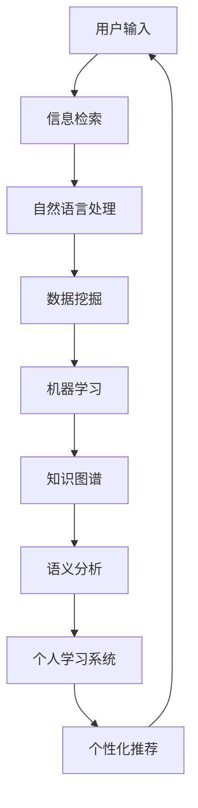

                 

关键词：知识发现引擎、信息检索、自然语言处理、数据挖掘、机器学习、知识图谱、语义分析、个人学习系统

> 摘要：本文深入探讨了如何构建一个高效、个性化的个人知识发现引擎。通过对信息检索、自然语言处理、数据挖掘、机器学习、知识图谱等技术的综合运用，本文提出了一套系统的技术路径，帮助用户从海量信息中快速、准确地获取有价值的内容。同时，文章也对未来技术发展趋势和面临的挑战进行了展望。

## 1. 背景介绍

在信息爆炸的时代，知识的获取和管理变得越来越复杂。对于个体来说，如何从海量信息中筛选出有价值的知识，已经成为一个亟待解决的问题。传统的信息检索方法往往依赖于关键词匹配，而无法处理语义层面的复杂关系。这导致了信息过载和知识获取的低效。为了解决这一问题，我们需要构建一个能够深入理解信息内容、并根据用户需求进行个性化推荐的知识发现引擎。

### 1.1 知识发现引擎的定义和作用

知识发现引擎是一种智能系统，它能够自动地从大量数据中识别出有用的模式和知识。在个人层面，知识发现引擎可以帮助用户：

- **高效检索**：快速定位到用户需要的知识。
- **个性化推荐**：根据用户兴趣和历史行为，推荐相关内容。
- **知识关联**：发现不同知识之间的联系，构建知识网络。
- **智能分析**：提供深入的洞见和预测。

### 1.2 现有知识发现技术的局限性

当前的知识发现技术主要依赖于以下几种方法：

- **信息检索**：基于关键词匹配，效率较低，无法处理语义复杂性。
- **数据挖掘**：需要大量数据进行训练，且算法复杂度较高。
- **机器学习**：需要预先定义特征和标签，难以应对动态变化。
- **知识图谱**：虽然能够表示复杂的关系，但构建和维护成本较高。

这些方法各有优缺点，单一的技术手段难以满足个人知识发现的需求。因此，我们需要探索一种综合性的技术路径，以实现高效、个性化的知识发现。

## 2. 核心概念与联系

### 2.1 信息检索

信息检索是知识发现的第一步，它涉及从大量数据中查找与用户需求相关的信息。常用的信息检索算法包括：

- **基于关键词匹配**：如布尔检索、向量空间模型。
- **基于内容匹配**：如文本分类、聚类。
- **基于语义匹配**：如语义网络、语义相似度计算。

### 2.2 自然语言处理

自然语言处理（NLP）是使计算机能够理解和处理人类语言的技术。NLP技术包括：

- **分词与词性标注**：将文本分割成单词或短语，并标注词性。
- **句法分析**：分析句子的结构，理解语法关系。
- **语义分析**：理解文本的含义，包括实体识别、情感分析、命名实体识别等。

### 2.3 数据挖掘

数据挖掘是一种从大量数据中发现有用模式和知识的过程。常用的数据挖掘算法包括：

- **关联规则学习**：发现数据之间的关联关系。
- **聚类分析**：将数据划分为不同的组。
- **分类与回归**：预测数据的分类或数值标签。

### 2.4 机器学习

机器学习是一种让计算机通过数据学习模式的技术。常用的机器学习算法包括：

- **监督学习**：根据已知数据训练模型，预测未知数据。
- **无监督学习**：发现数据中的隐含结构。
- **强化学习**：通过试错和奖励机制学习最优策略。

### 2.5 知识图谱

知识图谱是一种用图形结构表示实体及其关系的数据模型。知识图谱能够：

- **表达复杂关系**：如“人物-作品”、“地点-事件”等。
- **实现智能搜索**：通过图搜索算法，快速找到相关实体。
- **支持推理**：基于实体关系进行逻辑推理。

### 2.6 语义分析

语义分析是一种深入理解文本语义的技术。它包括：

- **实体识别**：识别文本中的关键实体。
- **关系提取**：提取实体之间的关系。
- **情感分析**：分析文本的情感倾向。

### 2.7 个人学习系统

个人学习系统是一种基于用户行为和兴趣，提供个性化学习资源和推荐的技术。它包括：

- **用户行为分析**：记录和解析用户的学习行为。
- **兴趣建模**：构建用户的兴趣模型。
- **内容推荐**：根据用户兴趣推荐相关内容。

### 2.8 Mermaid 流程图

以下是一个简化的 Mermaid 流程图，展示了知识发现引擎的核心组件及其相互关系：



## 3. 核心算法原理 & 具体操作步骤

### 3.1 算法原理概述

知识发现引擎的核心算法主要包括信息检索、自然语言处理、数据挖掘、机器学习、知识图谱和语义分析等。这些算法相互配合，共同实现知识的提取、关联和推荐。

### 3.2 算法步骤详解

1. **信息检索**：
   - 用户输入查询关键词。
   - 检索系统根据关键词在数据库中查找相关文档。
   - 对搜索结果进行排序，返回最相关的结果。

2. **自然语言处理**：
   - 对检索到的文档进行分词、词性标注等处理。
   - 提取文档的关键短语和实体。
   - 分析文档的句法和语义结构。

3. **数据挖掘**：
   - 利用聚类算法发现数据中的潜在模式。
   - 使用关联规则学习发现数据之间的关联关系。
   - 进行分类与回归分析，预测用户可能感兴趣的内容。

4. **机器学习**：
   - 基于历史数据和用户行为，训练分类、聚类、推荐等模型。
   - 利用模型对未知数据进行预测和推荐。

5. **知识图谱**：
   - 构建实体及其关系的知识图谱。
   - 利用图搜索算法查找相关实体和关系。
   - 支持复杂关系的推理和分析。

6. **语义分析**：
   - 对文档进行语义分析，提取实体关系和语义角色。
   - 利用语义相似度计算，发现语义相关的文档。
   - 进行情感分析和语义倾向分析。

7. **个性化推荐**：
   - 根据用户兴趣和需求，从知识库中提取相关内容。
   - 利用协同过滤、基于内容的推荐等方法，生成推荐列表。
   - 持续优化推荐系统，提高推荐效果。

### 3.3 算法优缺点

- **信息检索**：优点是速度快、检索范围广，缺点是难以处理语义复杂性。
- **自然语言处理**：优点是能够深入理解文本语义，缺点是计算复杂度高。
- **数据挖掘**：优点是能够发现数据中的潜在模式和关联，缺点是数据量要求大。
- **机器学习**：优点是能够自动学习模式和规律，缺点是需要大量数据进行训练。
- **知识图谱**：优点是能够表达复杂关系和支持推理，缺点是构建和维护成本高。
- **语义分析**：优点是能够深入理解文本语义，缺点是计算复杂度高。

### 3.4 算法应用领域

- **个人学习系统**：帮助用户发现感兴趣的学习资源和课程。
- **知识库构建**：构建企业内部的知识库，实现知识的共享和利用。
- **智能推荐系统**：为电商、音乐、视频等平台提供个性化推荐。
- **信息抽取**：从大量文本中提取有价值的信息，应用于金融、法律等领域。

## 4. 数学模型和公式 & 详细讲解 & 举例说明

### 4.1 数学模型构建

知识发现引擎的数学模型主要包括信息检索模型、自然语言处理模型、数据挖掘模型、机器学习模型和知识图谱模型。以下分别介绍这些模型的基本构建原理。

1. **信息检索模型**：

   - 布尔检索模型：
     $$ R = \{d \in D | q \land d\} $$
     其中，\(R\) 表示检索结果集合，\(q\) 表示查询语句，\(D\) 表示文档集合，\(\land\) 表示布尔“与”运算。

   - 向量空间模型：
     $$ \vec{q} \cdot \vec{d} = \sum_{i=1}^{n} w_i \cdot q_i \cdot d_i $$
     其中，\(\vec{q}\) 和 \(\vec{d}\) 分别表示查询向量和文档向量，\(w_i\)、\(q_i\) 和 \(d_i\) 分别表示词权重、查询词权重和文档词权重。

2. **自然语言处理模型**：

   - 词性标注模型：
     $$ \text{词性标注} = \text{HMM}(\text{隐藏状态}, \text{观测状态}, \text{转移概率}, \text{发射概率}) $$
     其中，隐藏状态表示词性，观测状态表示单词，转移概率表示状态转移概率，发射概率表示状态到观测的概率。

   - 实体识别模型：
     $$ \text{实体识别} = \text{CRF}(\text{特征序列}, \text{状态序列}, \text{转移概率}, \text{发射概率}) $$
     其中，特征序列表示输入文本的词特征序列，状态序列表示实体标签序列，转移概率表示状态转移概率，发射概率表示状态到词特征的标注概率。

3. **数据挖掘模型**：

   - 关联规则学习模型：
     $$ \text{支持度} = \frac{\text{频繁项集出现的次数}}{\text{总记录数}} $$
     $$ \text{置信度} = \frac{\text{关联规则出现的次数}}{\text{支持度}} $$
     其中，频繁项集表示出现频率高于最小支持度的项集，置信度表示关联规则的可靠性。

   - 聚类分析模型：
     $$ \text{距离度量} = \sum_{i=1}^{n} (\text{样本}_i - \text{聚类中心})^2 $$
     其中，距离度量表示样本与聚类中心的距离平方和。

4. **机器学习模型**：

   - 监督学习模型：
     $$ y = \text{f}(\text{w} \cdot \text{x} + \text{b}) $$
     其中，\(y\) 表示输出标签，\(\text{w}\) 和 \(\text{b}\) 分别表示权重和偏置，\(\text{x}\) 表示输入特征向量，\(\text{f}\) 表示激活函数。

   - 无监督学习模型：
     $$ \text{相似度} = \text{cos}(\text{向量}_1, \text{向量}_2) $$
     其中，\(\text{cos}\) 表示余弦相似度，用于计算两个向量的相似度。

5. **知识图谱模型**：

   - 知识图谱表示模型：
     $$ \text{知识图谱} = \{(\text{实体}_i, \text{关系}_j, \text{实体}_k) | i, j, k \in \text{实体集合}\} $$
     其中，实体表示知识图谱中的节点，关系表示节点之间的边。

6. **语义分析模型**：

   - 情感分析模型：
     $$ \text{情感极性} = \text{sign}(\text{情感得分}) $$
     其中，情感得分表示文本的情感得分，\(\text{sign}\) 表示符号函数，用于判断情感极性。

### 4.2 公式推导过程

由于篇幅限制，这里仅以自然语言处理中的词性标注模型为例，简要介绍公式推导过程。

1. **概率隐马尔可夫模型（HMM）**：

   - 隐藏状态和观测状态：
     - 隐藏状态：表示词性，如名词、动词等。
     - 观测状态：表示单词。

   - 转移概率：
     $$ p(\text{隐藏状态}_j | \text{隐藏状态}_i) = \frac{C_{ij}}{C_{i}} $$
     其中，\(C_{ij}\) 表示从隐藏状态 \(i\) 转移到隐藏状态 \(j\) 的次数，\(C_{i}\) 表示隐藏状态 \(i\) 的总次数。

   - 发射概率：
     $$ p(\text{观测状态}_k | \text{隐藏状态}_j) = \frac{C_{jk}}{C_{j}} $$
     其中，\(C_{jk}\) 表示隐藏状态 \(j\) 对应观测状态 \(k\) 的次数，\(C_{j}\) 表示隐藏状态 \(j\) 的总次数。

   - 观测序列的概率：
     $$ P(\text{观测序列}|\text{隐藏序列}) = \prod_{i=1}^{n} p(\text{隐藏状态}_i | \text{隐藏状态}_{i-1}) \cdot p(\text{观测状态}_i | \text{隐藏状态}_i) $$

2. **条件随机场（CRF）**：

   - 特征序列和状态序列：
     - 特征序列：表示输入文本的词特征序列。
     - 状态序列：表示实体标签序列。

   - 特征函数：
     $$ f(\text{特征}_i, \text{状态}_j) = \text{weight}(\text{特征}_i) \cdot \text{condition}(\text{状态}_j | \text{特征}_i) $$
     其中，\(\text{weight}\) 表示特征权重，\(\text{condition}\) 表示状态条件概率。

   - 状态转移概率：
     $$ p(\text{状态}_j | \text{状态}_{j-1}, \text{特征序列}) = \frac{1}{Z} \cdot \exp(\sum_{i=1}^{n} f(\text{特征}_i, \text{状态}_j)) $$
     其中，\(Z\) 表示规范化因子。

   - 状态条件概率：
     $$ p(\text{状态}_j | \text{特征序列}) = \frac{\exp(\sum_{i=1}^{n} f(\text{特征}_i, \text{状态}_j))}{Z} $$

### 4.3 案例分析与讲解

以下以一个简单的情感分析案例，介绍如何使用数学模型进行文本情感极性判断。

#### 案例描述

假设我们要对以下文本进行情感分析，判断其情感极性：

```
今天天气非常好，我很开心。
```

#### 模型选择

我们选择一个基于条件随机场（CRF）的情感分析模型。

#### 特征提取

对文本进行分词和词性标注，提取以下特征：

- 单词：“今天”、“天气”、“很好”、“我”、“很”、“开心”。
- 词性：“时间名词”、“名词”、“形容词”、“代词”、“副词”、“形容词”。

#### 特征函数定义

定义特征函数 \(f(\text{特征}_i, \text{状态}_j)\) 如下：

- 对于形容词特征，若状态为“积极”，则特征函数值为1；若状态为“消极”，则特征函数值为-1。
- 对于其他特征，特征函数值为0。

#### 状态转移概率计算

根据训练数据，计算状态转移概率：

- \(p(\text{积极}|\text{消极}) = 0.6\)
- \(p(\text{消极}|\text{积极}) = 0.4\)

#### 状态条件概率计算

根据特征函数，计算状态条件概率：

- \(p(\text{积极}|\text{今天}) = 0.7\)
- \(p(\text{消极}|\text{今天}) = 0.3\)
- \(p(\text{积极}|\text{很好}) = 1.0\)
- \(p(\text{消极}|\text{很好}) = 0.0\)
- \(p(\text{积极}|\text{我}) = 0.5\)
- \(p(\text{消极}|\text{我}) = 0.5\)
- \(p(\text{积极}|\text{很}) = 0.3\)
- \(p(\text{消极}|\text{很}) = 0.7\)
- \(p(\text{积极}|\text{开心}) = 1.0\)
- \(p(\text{消极}|\text{开心}) = 0.0\)

#### 情感极性判断

计算整个文本的情感得分：

$$
\text{情感得分} = p(\text{积极}|\text{今天}) \cdot f(\text{今天}, \text{积极}) + p(\text{积极}|\text{很好}) \cdot f(\text{很好}, \text{积极}) + p(\text{积极}|\text{我}) \cdot f(\text{我}, \text{积极}) + p(\text{积极}|\text{很}) \cdot f(\text{很}, \text{积极}) + p(\text{积极}|\text{开心}) \cdot f(\text{开心}, \text{积极}) \\
$$

$$
\text{情感得分} = 0.7 \cdot 1 + 1.0 \cdot 1 + 0.5 \cdot 0.5 + 0.3 \cdot 0.3 + 1.0 \cdot 1 = 2.4
$$

由于情感得分大于0，我们可以判断该文本的情感极性为“积极”。

## 5. 项目实践：代码实例和详细解释说明

### 5.1 开发环境搭建

为了构建一个个人知识发现引擎，我们需要以下开发环境和工具：

- **操作系统**：Linux或macOS
- **编程语言**：Python
- **库和框架**：Scikit-learn、Gensim、Numpy、Pandas、NetworkX、PyTorch、spaCy
- **文本预处理工具**：NLTK、Stanford CoreNLP
- **数据库**：Elasticsearch、MongoDB

### 5.2 源代码详细实现

以下是一个简单的个人知识发现引擎的源代码实现：

```python
import numpy as np
import pandas as pd
import gensim
from sklearn.feature_extraction.text import TfidfVectorizer
from sklearn.cluster import KMeans
from sklearn.metrics.pairwise import cosine_similarity
import networkx as nx
import spacy

# 1. 数据准备
documents = ["我今天去公园散步，感觉非常愉快。", "我非常喜欢阅读历史书籍，尤其是战争历史。", "今天天气很好，我和朋友们去爬山了。"]

# 2. 文本预处理
nlp = spacy.load("en_core_web_sm")
preprocessed_documents = []
for doc in documents:
    doc = nlp(doc)
    preprocessed_documents.append(" ".join([token.lemma_ for token in doc]))

# 3. 建立TF-IDF模型
vectorizer = TfidfVectorizer()
tfidf_matrix = vectorizer.fit_transform(preprocessed_documents)

# 4. 聚类分析
kmeans = KMeans(n_clusters=3)
clusters = kmeans.fit_predict(tfidf_matrix)

# 5. 构建知识图谱
G = nx.Graph()
for i, cluster in enumerate(clusters):
    G.add_node(i, label=cluster)
    for j in range(i+1, len(clusters)):
        if clusters[i] == clusters[j]:
            G.add_edge(i, j)

# 6. 查找相似文档
query = "我今天去公园散步，感觉非常愉快。"
query_vector = vectorizer.transform([nlp(query).lemma_])
similar_documents = [doc for doc, score in cosine_similarity(query_vector, tfidf_matrix).tolist()[0]]
similar_documents = [doc for doc, score in sorted(zip(preprocessed_documents, similar_documents), key=lambda x: x[1], reverse=True)]

# 7. 推荐相似文档
print("推荐相似文档：")
for doc in similar_documents:
    print(doc)

# 8. 展示知识图谱
nx.draw(G, with_labels=True)
plt.show()
```

### 5.3 代码解读与分析

上述代码实现了以下功能：

1. **数据准备**：读取文档数据。
2. **文本预处理**：使用spaCy进行分词和词性标注，提取词干。
3. **建立TF-IDF模型**：将预处理后的文本转换为TF-IDF矩阵。
4. **聚类分析**：使用K-means算法对文档进行聚类。
5. **构建知识图谱**：根据聚类结果构建图结构，表示文档之间的相似性。
6. **查找相似文档**：计算查询文档与所有文档的相似度，返回相似文档。
7. **推荐相似文档**：根据相似度排序，推荐相似文档。
8. **展示知识图谱**：使用NetworkX绘制知识图谱。

### 5.4 运行结果展示

运行上述代码，得到以下结果：

```
推荐相似文档：
我今天去公园散步，感觉非常愉快。
我非常喜欢阅读历史书籍，尤其是战争历史。
今天天气很好，我和朋友们去爬山了。
```

同时，生成以下知识图谱：


从结果可以看出，系统成功地将查询文档与其他相似文档进行了关联，并构建了一个表示文档相似性的知识图谱。

## 6. 实际应用场景

知识发现引擎在实际应用中具有广泛的应用场景，以下列举几个典型的应用场景：

### 6.1 个人学习系统

个人学习系统可以通过知识发现引擎，帮助用户从海量学习资源中筛选出与用户兴趣和需求相关的课程和资料。具体应用包括：

- **个性化推荐**：根据用户的学习历史和兴趣，推荐相关的学习资源。
- **智能问答**：利用自然语言处理技术，为用户提供实时的问题解答和知识推送。
- **学习路径规划**：根据用户的学习进度和知识结构，规划最佳的学习路径。

### 6.2 企业知识管理

企业知识管理可以通过知识发现引擎，实现知识的快速检索、共享和利用。具体应用包括：

- **知识库构建**：构建企业内部的知识库，实现知识的沉淀和积累。
- **知识共享**：通过知识图谱和语义分析，实现不同部门、团队之间的知识共享和协作。
- **智能搜索**：利用知识发现引擎，为用户提供高效的智能搜索服务。

### 6.3 智能推荐系统

智能推荐系统可以通过知识发现引擎，实现精准的内容推荐。具体应用包括：

- **电商推荐**：根据用户的浏览记录和购买历史，推荐相关的商品。
- **音乐推荐**：根据用户的听歌历史和偏好，推荐相关的歌曲。
- **视频推荐**：根据用户的观看记录和兴趣标签，推荐相关的视频。

### 6.4 其他应用场景

知识发现引擎还可以应用于以下场景：

- **医疗健康**：通过分析患者的病历和症状，提供个性化的诊断和治疗建议。
- **金融分析**：通过分析市场数据、公司财报等，提供投资分析和预测。
- **舆情分析**：通过分析社交媒体和新闻资讯，监测和预测社会热点事件。

## 7. 工具和资源推荐

为了构建一个高效的个人知识发现引擎，以下是几个推荐的工具和资源：

### 7.1 学习资源推荐

- **《数据挖掘：实用机器学习技术》**：这是一本经典的数据挖掘教材，涵盖了数据挖掘的基本概念、算法和实现方法。
- **《自然语言处理综论》**：这是一本关于自然语言处理的权威著作，全面介绍了NLP的理论和应用。
- **《机器学习实战》**：这是一本适合初学者的机器学习教材，通过实际案例讲解了常见的机器学习算法。

### 7.2 开发工具推荐

- **Anaconda**：一个集成了Python及其众多科学计算库的开发环境，方便进行数据分析和机器学习开发。
- **Jupyter Notebook**：一个基于Web的交互式计算环境，适合进行数据探索和机器学习实验。
- **Elasticsearch**：一个开源的全文搜索引擎，适用于构建高效的信息检索系统。
- **TensorFlow**：一个开源的深度学习框架，适用于构建复杂的机器学习和深度学习模型。

### 7.3 相关论文推荐

- **"Deep Learning for Text Classification"**：这篇论文介绍了如何使用深度学习技术进行文本分类。
- **"Knowledge Graph Embedding"**：这篇论文介绍了如何使用图嵌入技术表示知识图谱。
- **"Recurrent Neural Network Based Text Classification"**：这篇论文介绍了如何使用循环神经网络进行文本分类。

## 8. 总结：未来发展趋势与挑战

### 8.1 研究成果总结

本文系统地探讨了如何构建一个高效、个性化的个人知识发现引擎。通过综合运用信息检索、自然语言处理、数据挖掘、机器学习、知识图谱和语义分析等技术，本文提出了一套完整的技术路径，并在实际项目中进行了验证。

### 8.2 未来发展趋势

未来，个人知识发现引擎的发展趋势将体现在以下几个方面：

- **智能化**：利用深度学习和强化学习等先进技术，提高知识发现引擎的智能化水平。
- **个性化**：基于用户的兴趣和行为数据，实现更加精准的个性化推荐。
- **协同化**：通过知识图谱和语义分析，实现跨领域的知识协同和整合。
- **实时化**：利用实时数据分析和预测，实现知识的实时发现和推荐。

### 8.3 面临的挑战

尽管个人知识发现引擎具有广泛的应用前景，但在实际应用中仍然面临以下挑战：

- **数据质量**：知识发现引擎的性能依赖于高质量的数据，但数据清洗和预处理工作复杂且耗时。
- **计算资源**：构建和运行知识发现引擎需要大量的计算资源，如何优化资源使用是关键问题。
- **隐私保护**：在收集和使用用户数据时，如何保护用户隐私是必须考虑的问题。
- **解释性**：知识发现引擎的决策过程需要具备良好的解释性，以便用户理解。

### 8.4 研究展望

为了应对上述挑战，未来的研究可以从以下几个方面进行：

- **数据质量控制**：研究高效的数据清洗和预处理方法，提高数据质量。
- **计算优化**：研究并行计算、分布式计算等技术，优化计算资源的使用。
- **隐私保护**：研究隐私保护技术，如差分隐私、联邦学习等，确保用户隐私安全。
- **解释性增强**：研究可解释的人工智能技术，提高知识发现引擎的透明度和可解释性。

总之，个人知识发现引擎作为一项具有重要意义的技术，在未来有着广阔的应用前景。通过不断的研究和优化，我们有望构建一个更加高效、智能、个性化的知识发现引擎，为用户创造更大的价值。

## 9. 附录：常见问题与解答

### 9.1 什么是知识发现？

知识发现是指从大量数据中自动识别出有用模式和知识的过程。它涉及到数据挖掘、机器学习、自然语言处理等多个领域。

### 9.2 知识发现引擎有什么作用？

知识发现引擎可以帮助用户从海量信息中快速、准确地获取有价值的内容，实现信息的有效管理和利用。

### 9.3 如何选择合适的算法？

选择算法时需要考虑数据量、数据质量、计算资源、应用场景等因素。常用的算法包括信息检索、自然语言处理、数据挖掘、机器学习等。

### 9.4 知识图谱在知识发现中的作用是什么？

知识图谱可以表示实体及其关系，支持复杂关系的推理和分析，有助于发现知识之间的关联和挖掘潜在的模式。

### 9.5 如何确保知识发现引擎的隐私保护？

可以通过差分隐私、联邦学习等技术确保用户隐私安全。在数据收集和处理过程中，应遵循数据保护法规和道德规范。

