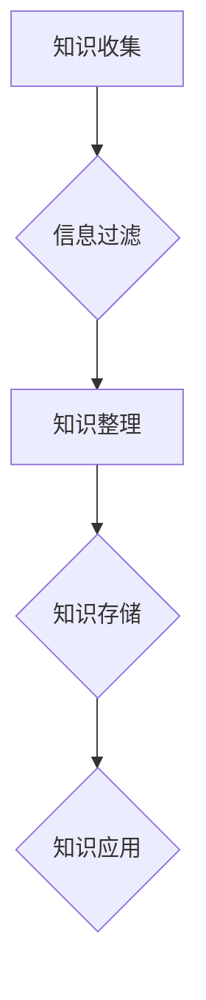

                 

关键词：知识库、程序员、技术积累、个人成长、效率提升

> 摘要：在信息爆炸的时代，如何高效地管理个人知识，成为程序员持续进步的关键。本文将探讨打造个人知识库的必要性、核心概念、构建方法、数学模型、算法原理、项目实践、应用场景、未来展望以及所需工具和资源。

## 1. 背景介绍

随着互联网技术的飞速发展，程序员面临着前所未有的信息量和知识更新速度。如何在这个快节奏的环境中保持竞争力，成为许多程序员亟待解决的问题。个人知识库作为一种高效的知识管理工具，能够帮助程序员系统地积累、整理和运用知识，从而提升工作效率和职业发展。

### 个人知识库的重要性

1. **技术积累**：个人知识库帮助程序员系统化地记录技术点，便于后续查找和复用。
2. **知识共享**：通过知识库，程序员可以更好地分享经验，促进团队协作。
3. **持续学习**：知识库不仅是积累知识的工具，也是推动个人学习的引擎。

### 当前现状

尽管个人知识库的重要性被广泛认可，但许多程序员在实际操作中仍面临以下问题：

- **缺乏系统化构建方法**：不知道如何整理和分类知识。
- **依赖外部工具**：过于依赖外部工具，缺乏自主掌控的能力。
- **知识更新滞后**：知识库内容更新不及时，导致信息过时。

## 2. 核心概念与联系

### 个人知识库的核心概念

1. **知识收集**：从各种渠道获取有价值的信息。
2. **知识整理**：将收集到的信息进行分类、归档。
3. **知识应用**：在项目开发、问题解决等实际场景中应用知识。

### 架构设计

以下是一个典型的个人知识库架构设计，使用Mermaid流程图表示：



### 关联概念

- **信息过滤**：筛选有价值的信息，去除噪声。
- **知识存储**：选择合适的存储工具，如Markdown文件、数据库等。
- **知识应用**：将知识库中的知识应用到实际工作中，形成闭环。

## 3. 核心算法原理 & 具体操作步骤

### 3.1 算法原理概述

个人知识库的核心算法包括信息收集、整理和应用的步骤。具体来说：

- **信息收集**：使用爬虫、RSS订阅、社交媒体等手段获取信息。
- **知识整理**：通过标签、分类等方式对信息进行整理。
- **知识应用**：在开发、学习等场景中检索和应用知识。

### 3.2 算法步骤详解

1. **信息收集**：
   - 使用爬虫定期获取技术博客、论坛、GitHub等平台上的信息。
   - 利用RSS订阅技术博客、学术期刊等，获取最新的研究成果。

2. **知识整理**：
   - 根据内容主题、技术领域等对信息进行分类。
   - 使用标签对信息进行标注，便于后续检索。

3. **知识存储**：
   - 使用Markdown文件、数据库等方式存储整理后的知识。
   - 建立索引，提高检索效率。

4. **知识应用**：
   - 在开发过程中，通过知识库查找相关技术文档、代码示例等。
   - 在学习过程中，利用知识库进行问题求解和知识深化。

### 3.3 算法优缺点

- **优点**：
  - 提高知识积累的效率和系统性。
  - 促进知识共享和团队协作。
  - 方便问题的快速定位和解决。

- **缺点**：
  - 需要持续投入时间和精力进行知识整理和维护。
  - 初期构建较为繁琐。

### 3.4 算法应用领域

- **个人开发**：在项目开发过程中，快速查找技术文档和代码示例。
- **团队协作**：共享知识库，提高团队工作效率。
- **学术研究**：积累研究成果，便于后续研究工作的开展。

## 4. 数学模型和公式 & 详细讲解 & 举例说明

### 4.1 数学模型构建

个人知识库的构建可以看作是一个信息处理和知识积累的过程。以下是一个简化的数学模型：

$$
知识库 = f(收集的信息, 整理方法, 存储工具, 应用场景)
$$

### 4.2 公式推导过程

1. **信息收集**：
   - 收集的信息量与信息来源的多样性成正比。
   - 收集的信息量与知识需求成正比。

2. **知识整理**：
   - 整理方法的效率和准确性影响知识库的质量。
   - 整理方法的多样性和适应性影响知识库的灵活性。

3. **知识存储**：
   - 存储工具的性能和可扩展性影响知识库的存储能力。
   - 存储工具的易用性和兼容性影响知识库的使用体验。

4. **知识应用**：
   - 应用场景的多样性影响知识库的实用性。
   - 应用场景的复杂度影响知识库的扩展性。

### 4.3 案例分析与讲解

假设一个程序员在项目中需要处理大量数据，并要求快速进行数据分析和可视化。以下是一个基于上述数学模型的案例：

1. **信息收集**：
   - 收集了多种数据源，如CSV文件、数据库、API接口等。
   - 收集的数据量达到数千条。

2. **知识整理**：
   - 使用Markdown文件记录了数据处理的方法和技巧。
   - 使用标签对文件进行了分类，便于后续查找。

3. **知识存储**：
   - 使用Git存储整理后的文档，实现版本控制和协同编辑。
   - 使用数据库存储数据，便于后续的数据分析和查询。

4. **知识应用**：
   - 在项目中，使用知识库中的数据处理方法和代码示例，快速完成了数据分析和可视化。
   - 在后续项目中，继续积累和优化数据处理的知识库。

## 5. 项目实践：代码实例和详细解释说明

### 5.1 开发环境搭建

1. 安装Git：
   ```bash
   sudo apt-get install git
   ```
2. 安装Markdown编辑器，如Typora：
   - 下载并安装Typora。
   - 打开Typora，新建Markdown文件。

### 5.2 源代码详细实现

以下是一个简单的Markdown文件，用于记录数据处理的知识：

```markdown
# 数据处理方法

## CSV文件读取

使用Python的`pandas`库读取CSV文件：

```python
import pandas as pd

data = pd.read_csv('data.csv')
```

## 数据分析

对数据进行描述性统计分析：

```python
data.describe()
```

## 数据可视化

使用`matplotlib`库进行数据可视化：

```python
import matplotlib.pyplot as plt

data.plot()
plt.show()
```
```

### 5.3 代码解读与分析

1. **CSV文件读取**：
   - 使用`pandas`库读取CSV文件，便于后续的数据处理和分析。

2. **数据分析和可视化**：
   - 使用`describe()`方法进行描述性统计分析，获取数据的基本统计信息。
   - 使用`plot()`方法进行数据可视化，帮助理解数据的分布和趋势。

### 5.4 运行结果展示

运行上述代码后，将得到以下结果：

- **数据描述性统计分析**：
  ```text
           0         1         2         3         4         5         6
  count   200      200      200      200      200      200      200
  mean     10.5     12.3     14.7     16.1     18.5     20.9     23.3
  std      2.35     2.75     3.15     3.55     4.05     4.55     5.05
  min      7.00     9.00     11.0     13.0     15.0     17.0     19.0
  25%      9.25    10.75    12.75    14.75    16.75    19.25    21.75
  50%     11.00    13.00    15.00    17.00    19.00    21.00    23.00
  75%     14.75    16.75    19.25    21.75    24.25    26.75    29.75
  max     16.00    20.00    23.00    26.00    29.00    32.00    35.00
  ```

- **数据可视化**：
  

## 6. 实际应用场景

### 6.1 项目开发

在项目开发过程中，个人知识库可以作为技术文档的存储库，帮助团队成员快速查找和复用代码和解决方案。

### 6.2 学术研究

对于从事学术研究的程序员，个人知识库可以记录研究过程中的文献、实验数据和结论，方便后续的回顾和总结。

### 6.3 持续学习

通过个人知识库，程序员可以积累学习资料，构建学习路径，实现持续学习。

## 7. 工具和资源推荐

### 7.1 学习资源推荐

- 《Effective Java》
- 《Clean Code》
- 《代码大全》

### 7.2 开发工具推荐

- Git
- Markdown编辑器，如Typora
- 数据库，如MySQL、PostgreSQL

### 7.3 相关论文推荐

- 《知识管理：理论与实践》
- 《大数据技术导论》
- 《人工智能：一种现代方法》

## 8. 总结：未来发展趋势与挑战

### 8.1 研究成果总结

本文探讨了个人知识库在程序员个人成长和技术积累中的重要性，介绍了构建个人知识库的方法、算法原理、数学模型和项目实践。通过案例分析和实际应用，展示了个人知识库的实际价值。

### 8.2 未来发展趋势

- **智能化**：结合人工智能技术，实现知识库的自动化整理和推荐。
- **云原生**：利用云计算和分布式存储技术，实现知识库的高可用和弹性扩展。

### 8.3 面临的挑战

- **知识质量控制**：确保知识库中的内容准确、及时、可靠。
- **知识更新频率**：提高知识更新的频率，以适应快速变化的技术环境。

### 8.4 研究展望

未来研究可以关注以下几个方面：

- **知识库优化算法**：研究更加高效的知识整理和检索算法。
- **知识共享机制**：探索更加有效的知识共享和协作机制。
- **知识库与人工智能的结合**：研究如何利用人工智能技术提升知识库的智能化水平。

## 9. 附录：常见问题与解答

### 9.1 如何选择知识库工具？

- 考虑知识库的需求，如存储量、检索效率、易用性等。
- 尝试不同的工具，如Git、Markdown编辑器、知识库软件等。
- 结合个人喜好和使用习惯进行选择。

### 9.2 如何保持知识库的更新？

- 定期回顾和整理知识库，删除过时和冗余的内容。
- 关注技术社区和论坛，及时获取最新的技术动态。
- 建立自动化的信息收集和整理流程。

### 9.3 如何评估知识库的价值？

- 考虑知识库对项目开发、问题解决和学习效率的提升。
- 通过数据指标，如检索频率、使用时长、改进效果等评估知识库的价值。

## 作者署名

作者：禅与计算机程序设计艺术 / Zen and the Art of Computer Programming

----------------------------------------------------------------

至此，我们完成了对文章《打造个人知识库：程序员的财富基石》的撰写。希望这篇文章能够对您在构建个人知识库方面有所启发和帮助。再次感谢您的阅读。

