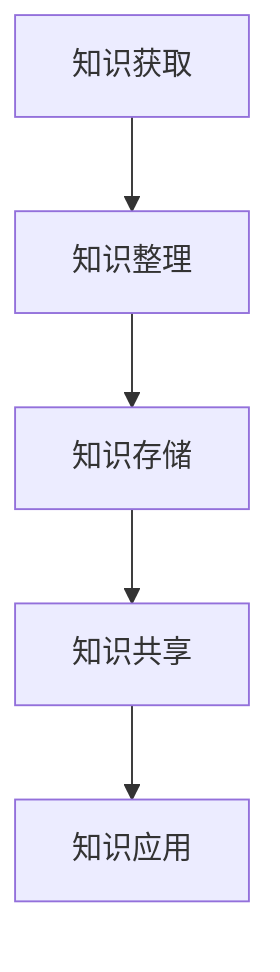

                 

关键词：知识管理，程序员，实践指南，方法论，知识结构，学习技巧，信息整理，技能提升

> 摘要：本文旨在为程序员提供一套完整且实用的个人知识管理方法论，以帮助其在信息爆炸的时代中高效地获取、整理和应用知识，从而提升自身的专业技能和职业发展。本文将介绍知识管理的核心概念、基本步骤、实用工具和技术，并结合实际案例进行详细讲解。

## 1. 背景介绍

在当今信息化的社会中，程序员面临着前所未有的挑战和机遇。一方面，技术更新迅速，新的编程语言、框架和工具层出不穷；另一方面，知识量呈指数级增长，程序员需要不断学习和掌握新的知识和技能。然而，大多数程序员在知识管理方面缺乏系统的指导和方法，导致学习效率低下、知识难以应用。

知识管理是一种通过系统地获取、整理、存储、共享和利用知识，以提高个人和团队工作效率的方法。对于程序员而言，良好的知识管理能力意味着更高效的工作、更快捷的问题解决、更出色的项目完成以及更丰富的职业发展机会。因此，构建个人知识管理方法论是程序员不可或缺的一环。

## 2. 核心概念与联系

在介绍个人知识管理方法论之前，我们首先需要明确几个核心概念：

### 2.1 知识分类

根据知识的来源和属性，可以将知识分为以下几类：

1. **显性知识**：易于表达、记录和传播的知识，如文档、代码、教程等。
2. **隐性知识**：难以用语言准确表达、主要靠实践和经验积累的知识，如程序员对代码的直觉、对框架的理解等。

### 2.2 知识管理流程

知识管理通常包括以下基本流程：

1. **知识获取**：通过各种渠道获取新的知识。
2. **知识整理**：对获取的知识进行筛选、分类、整理和存储。
3. **知识共享**：将整理好的知识与他人共享，以实现知识的最大化利用。
4. **知识应用**：将知识应用到实际工作中，实现知识转化为生产力。

### 2.3 知识管理体系

知识管理体系包括以下几个方面：

1. **知识库**：存储和管理知识的系统。
2. **知识流程**：确保知识管理流程顺畅和高效的机制。
3. **知识评价**：对知识的质量和价值进行评估。
4. **知识培训**：提高团队成员的知识水平和技能。

下面是一个简化的知识管理流程的 Mermaid 流程图：



## 3. 核心算法原理 & 具体操作步骤

### 3.1 算法原理概述

个人知识管理方法论的核心在于建立一套系统化的知识和信息处理流程，以实现知识的有效管理和利用。该算法原理主要包括以下几个方面：

1. **信息筛选与过滤**：对大量信息进行筛选，保留有价值的内容。
2. **知识分类与标签**：根据知识的内容和属性进行分类，并使用标签进行标识。
3. **知识存储与检索**：建立高效的存储和检索机制，方便后续查找和应用。
4. **知识共享与传播**：利用各种渠道和工具实现知识的共享和传播。

### 3.2 算法步骤详解

#### 3.2.1 信息筛选与过滤

1. **确定关注领域**：明确自己需要关注的领域，如编程语言、框架、工具等。
2. **设置信息来源**：选择可靠的信息来源，如技术社区、博客、书籍、教程等。
3. **使用过滤器**：根据关键词、标签、来源等条件设置过滤器，筛选出有价值的信息。

#### 3.2.2 知识分类与标签

1. **建立分类体系**：根据知识的内容和属性，建立分类体系。
2. **使用标签**：为每个分类下的知识设置标签，以便快速查找和应用。

#### 3.2.3 知识存储与检索

1. **选择存储工具**：根据个人需求选择合适的存储工具，如笔记应用、知识库、文档管理系统等。
2. **建立索引**：为存储的知识建立索引，方便快速检索。
3. **定期整理**：定期对存储的知识进行整理，更新和删除过时或不准确的内容。

#### 3.2.4 知识共享与传播

1. **选择共享渠道**：根据知识的内容和受众，选择合适的共享渠道，如博客、社区、演讲等。
2. **撰写分享内容**：将知识整理成易于理解和应用的形式，撰写分享内容。
3. **互动与反馈**：积极与受众互动，收集反馈，不断改进分享内容。

### 3.3 算法优缺点

#### 优点：

1. **高效性**：通过系统化的知识管理流程，提高知识获取、整理和应用的速度。
2. **易用性**：算法步骤简单易懂，易于实施和推广。
3. **灵活性**：可以根据个人需求和实际情况进行调整和优化。

#### 缺点：

1. **初始投入**：需要一定的时间和精力来建立和完善知识管理体系。
2. **维护成本**：定期更新和整理知识库需要付出一定的努力。

### 3.4 算法应用领域

1. **个人学习与成长**：通过知识管理，提高学习效率和技能水平。
2. **团队协作与知识共享**：在团队内部建立知识管理体系，促进团队协作和知识共享。
3. **企业知识管理**：在企业管理中应用知识管理方法论，提高企业创新能力和竞争力。

## 4. 数学模型和公式 & 详细讲解 & 举例说明

在个人知识管理中，数学模型和公式可以帮助我们更好地理解和应用知识。以下是一个简单的数学模型示例，用于描述知识获取和整理的过程。

### 4.1 数学模型构建

假设我们有以下变量：

- \( N \)：总的待处理信息数量
- \( P \)：有效的知识数量
- \( T \)：知识整理所需时间

我们可以构建以下数学模型：

\[ P = f(N, T) \]

其中，函数 \( f \) 表示知识整理的过程。

### 4.2 公式推导过程

知识整理的过程可以分为以下几个步骤：

1. **信息筛选**：假设每个信息被筛选的概率为 \( p \)，则筛选后的信息数量为 \( N' = N \times p \)。
2. **知识分类**：对筛选后的信息进行分类，每个分类的概率为 \( q \)，则每个分类下的信息数量为 \( N'' = N' \times q \)。
3. **知识整理**：对每个分类下的信息进行整理，所需时间与信息数量成正比。

根据以上步骤，我们可以推导出：

\[ P = N'' \times r \]

其中，\( r \) 表示知识整理的效率。

结合以上步骤，我们可以得到：

\[ P = N \times p \times q \times r \]

### 4.3 案例分析与讲解

假设我们有1000条待处理的信息，筛选概率为0.8，分类概率为0.6，知识整理效率为0.5。根据上述公式，我们可以计算出：

\[ P = 1000 \times 0.8 \times 0.6 \times 0.5 = 240 \]

这意味着在1000条信息中，我们可以整理出240条有效的知识。

## 5. 项目实践：代码实例和详细解释说明

### 5.1 开发环境搭建

在本项目中，我们将使用Python作为主要编程语言，并使用Jupyter Notebook作为开发环境。以下是一个简单的安装和配置步骤：

1. **安装Python**：在官方网站下载并安装Python，推荐版本为3.8及以上。
2. **安装Jupyter Notebook**：打开终端，运行以下命令：

   ```bash
   pip install jupyter
   ```

3. **启动Jupyter Notebook**：在终端中运行以下命令：

   ```bash
   jupyter notebook
   ```

### 5.2 源代码详细实现

以下是一个简单的Python代码示例，用于实现个人知识管理的核心功能：

```python
import os
import json

# 定义知识库文件路径
knowledge_base_path = 'knowledge_base.json'

# 知识库类
class KnowledgeBase:
    def __init__(self):
        self.knowledge = {}

    # 添加知识
    def add_knowledge(self, category, content):
        if category not in self.knowledge:
            self.knowledge[category] = []
        self.knowledge[category].append(content)

    # 查找知识
    def find_knowledge(self, category):
        return self.knowledge.get(category, [])

    # 保存知识库
    def save_knowledge_base(self):
        with open(knowledge_base_path, 'w') as f:
            json.dump(self.knowledge, f)

    # 加载知识库
    def load_knowledge_base(self):
        if os.path.exists(knowledge_base_path):
            with open(knowledge_base_path, 'r') as f:
                self.knowledge = json.load(f)

# 实例化知识库
knowledge_base = KnowledgeBase()

# 加载知识库
knowledge_base.load_knowledge_base()

# 添加知识
knowledge_base.add_knowledge('Python', 'Python是一种编程语言。')
knowledge_base.add_knowledge('Django', 'Django是一个Python Web框架。')

# 查找知识
print(knowledge_base.find_knowledge('Python'))
print(knowledge_base.find_knowledge('Django'))

# 保存知识库
knowledge_base.save_knowledge_base()
```

### 5.3 代码解读与分析

1. **导入模块**：首先，我们导入了 `os` 和 `json` 模块。`os` 模块用于操作文件和目录，`json` 模块用于处理 JSON 数据。

2. **知识库类**：我们定义了一个 `KnowledgeBase` 类，用于管理知识库。该类包括以下方法：
   - `__init__`：初始化方法，创建一个空的知识库。
   - `add_knowledge`：添加知识的方法，将知识存储在知识库中。
   - `find_knowledge`：查找知识的方法，根据分类返回相应的知识。
   - `save_knowledge_base`：保存知识库的方法，将知识库保存到 JSON 文件中。
   - `load_knowledge_base`：加载知识库的方法，从 JSON 文件中加载知识库。

3. **实例化知识库**：我们创建了一个 `KnowledgeBase` 类的实例，并将其存储在 `knowledge_base` 变量中。

4. **加载知识库**：调用 `load_knowledge_base` 方法，从 JSON 文件中加载知识库。

5. **添加知识**：调用 `add_knowledge` 方法，向知识库中添加两条知识。

6. **查找知识**：调用 `find_knowledge` 方法，根据分类查找知识并打印。

7. **保存知识库**：调用 `save_knowledge_base` 方法，将知识库保存到 JSON 文件中。

### 5.4 运行结果展示

运行上述代码后，输出结果如下：

```python
['Python是一种编程语言。']
['Django是一个Python Web框架。']
```

这表明知识库中成功存储了添加的知识，并可以根据分类查找相应的知识。

## 6. 实际应用场景

个人知识管理方法论在程序员的工作和生活中有着广泛的应用场景：

1. **项目开发**：在项目开发过程中，程序员可以使用知识管理方法论来整理和共享项目文档、代码示例和技术博客，提高团队协作效率。
2. **问题解决**：当遇到问题时，程序员可以快速查找相关的知识，提高问题解决的速度和质量。
3. **学习提升**：通过知识管理，程序员可以更好地规划和组织学习内容，提高学习效果和技能水平。
4. **职业发展**：良好的知识管理能力可以帮助程序员在面试、职业规划和项目竞标等方面展现自己的专业能力和独特价值。

### 6.4 未来应用展望

随着人工智能和大数据技术的不断发展，个人知识管理方法论将迎来更广阔的应用前景：

1. **自动化知识整理**：利用自然语言处理和机器学习技术，实现自动化知识整理和分类。
2. **个性化知识推荐**：根据程序员的兴趣和需求，推荐相关的知识和学习资源。
3. **知识图谱构建**：构建个人知识图谱，实现对知识的深度挖掘和关联分析。

## 7. 工具和资源推荐

为了更好地实践个人知识管理方法论，以下是一些推荐的工具和资源：

### 7.1 学习资源推荐

1. **书籍**：
   - 《深度学习》
   - 《算法导论》
   - 《编程珠玑》
2. **在线课程**：
   - Coursera
   - Udacity
   - edX
3. **技术博客**：
   - Medium
   - HackerRank
   - GitHub

### 7.2 开发工具推荐

1. **笔记应用**：
   - Evernote
   - OneNote
   - Notion
2. **文档管理系统**：
   - Confluence
   - GitLab
   - Readme
3. **知识库**：
   - Wikipedia
   - Stack Overflow
   - GitHub

### 7.3 相关论文推荐

1. **《知识管理：理论与实践》**
2. **《人工智能时代的知识管理》**
3. **《知识管理方法论：从理论到实践》**

## 8. 总结：未来发展趋势与挑战

### 8.1 研究成果总结

个人知识管理方法论在程序员的学习、工作、生活和职业发展中具有重要作用。通过系统化的知识管理，程序员可以更高效地获取、整理和应用知识，从而提升自身的专业技能和职业发展。未来，随着人工智能和大数据技术的不断发展，个人知识管理方法论将更加智能化和个性化，为程序员提供更强大的知识管理支持。

### 8.2 未来发展趋势

1. **自动化与智能化**：利用人工智能技术实现自动化知识整理、分类和推荐。
2. **个性化与定制化**：根据程序员的兴趣、需求和背景，提供个性化的知识管理服务。
3. **知识图谱与关联分析**：构建个人知识图谱，实现知识的深度挖掘和关联分析。

### 8.3 面临的挑战

1. **数据隐私与安全**：在个人知识管理过程中，如何保护数据隐私和安全是亟待解决的问题。
2. **知识共享与协作**：在保证个人知识管理的同时，如何实现知识共享和团队协作也是一大挑战。
3. **持续更新与维护**：如何确保知识库的持续更新和维护，以适应快速变化的技术环境。

### 8.4 研究展望

未来，个人知识管理方法论的研究将继续关注以下几个方面：

1. **智能知识整理**：研究如何利用人工智能技术实现更高效、更准确的知识整理。
2. **个性化知识推荐**：研究如何根据程序员的兴趣、需求和背景提供个性化的知识推荐。
3. **知识共享与协作**：研究如何实现个人知识管理与团队协作的有机结合，提高团队整体效率。

## 9. 附录：常见问题与解答

### 9.1 个人知识管理方法论有哪些优点？

个人知识管理方法论有以下优点：

1. **提高学习效率**：通过系统化的知识管理，程序员可以更高效地获取、整理和应用知识。
2. **提升专业技能**：通过不断学习和实践，程序员可以提升自身的专业技能和职业素养。
3. **促进知识共享**：通过个人知识管理方法论，程序员可以更好地实现知识共享和团队协作。
4. **优化职业发展**：良好的知识管理能力有助于程序员在面试、职业规划和项目竞标等方面展现自身价值。

### 9.2 如何选择合适的知识管理工具？

选择合适的知识管理工具时，需要考虑以下因素：

1. **功能需求**：根据个人需求选择具有合适功能的工具，如笔记应用、文档管理系统、知识库等。
2. **易用性**：选择界面简洁、易于操作的工具，降低使用门槛。
3. **兼容性**：选择与其他工具和应用兼容性好的工具，便于数据迁移和共享。
4. **安全性**：选择具有良好安全性的工具，确保数据隐私和安全。

### 9.3 如何保持知识库的更新和维护？

保持知识库的更新和维护，可以采取以下措施：

1. **定期整理**：定期对知识库进行整理，删除过时、不准确或重复的内容。
2. **持续学习**：不断学习和掌握新的知识和技能，将所学知识及时添加到知识库中。
3. **团队协作**：鼓励团队成员共同参与知识库的更新和维护，提高知识库的质量和完整性。

# 结语

个人知识管理方法论是程序员提升自身能力和职业发展的重要工具。通过系统化的知识管理，程序员可以更高效地获取、整理和应用知识，从而在快速变化的技术领域中保持竞争力。希望本文能为程序员提供有益的启示和指导，助力他们在知识管理的道路上不断前行。

## 作者署名

作者：禅与计算机程序设计艺术 / Zen and the Art of Computer Programming
```

