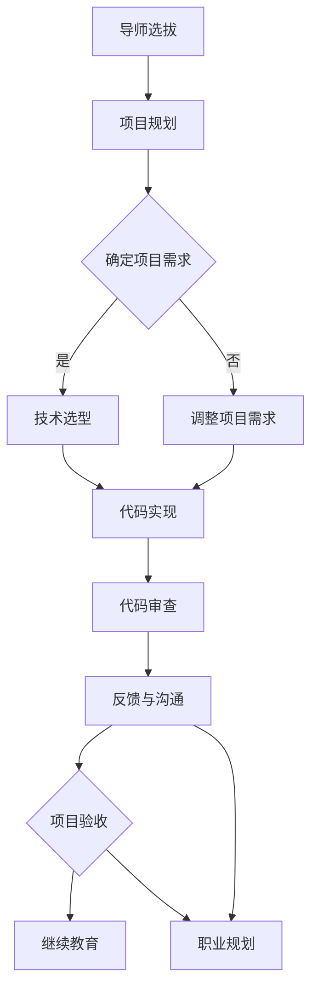

                 

### 背景介绍

在当今迅速发展的信息技术时代，程序员的需求量与日俱增，然而，优质的程序员却供不应求。面对这样的市场现状，如何能够加速程序员的专业成长，已经成为各企业和教育机构关注的焦点。技术mentoring作为一种有效的培养程序员能力的方式，正逐渐受到重视。

技术mentoring，即技术指导，是通过资深技术人员对新手程序员进行指导和培养，帮助他们在技术能力和职业素养上快速提升。这种指导不仅仅包括代码层面的技术指导，还包括项目经验、团队合作、沟通技巧等方面的培养。技术mentoring的目标是帮助程序员迅速适应工作环境，提升解决问题的能力，培养他们的自我学习和创新能力。

本文将探讨如何构建一个高效的技术mentoring项目，以加速程序员的成长。我们将从核心概念、算法原理、项目实践、数学模型、未来应用等方面进行深入分析，为企业和教育机构提供一套可操作的技术mentoring解决方案。

## 文章关键词

技术mentoring，程序员成长，代码指导，项目经验，团队合作，沟通技巧，算法原理，数学模型，项目实践，未来应用。

## 文章摘要

本文旨在探讨如何通过技术mentoring项目来加速程序员的专业成长。文章首先介绍了技术mentoring的背景和重要性，然后详细阐述了核心概念、算法原理、项目实践、数学模型等内容，最后对未来的应用场景和趋势进行了展望。通过本文的探讨，希望能够为企业和教育机构提供一个切实可行的技术mentoring方案，从而提高程序员的综合素质和职场竞争力。

## 1. 背景介绍

技术mentoring是一种在编程和教育领域广泛应用的培养模式。它的起源可以追溯到古代师徒制度，其中一名经验丰富的导师负责指导一名新手，帮助他们掌握技能和知识。随着信息技术的发展，技术mentoring逐渐从手工艺领域扩展到计算机编程，成为现代企业培养技术人才的重要手段。

### 技术mentoring的起源

技术mentoring最早可以追溯到1970年代的美国，当时计算机科学刚刚兴起，编程成为了一项新兴的技能。在这个时期，许多企业开始采用导师制来培养内部的技术人才。这些导师通常是公司内经验丰富的程序员，他们负责指导新入职的程序员，帮助他们快速掌握编程技能和公司文化。

随着互联网的普及和信息技术的高速发展，技术mentoring的重要性逐渐被企业所认可。许多公司开始建立正式的技术mentoring项目，旨在通过系统化的培训和指导，提升程序员的综合素质和职业能力。

### 技术mentoring的发展

在过去的几十年中，技术mentoring经历了多个发展阶段。最初，技术mentoring主要是通过一对一的导师制进行的，导师负责为新员工提供个性化的指导和帮助。随着技术的不断进步和团队协作的需求增加，技术mentoring逐渐从个人指导转向团队指导，形成了多种形式的培养模式，如团队内部的技术沙龙、技术分享会、代码审查等。

同时，随着在线教育平台的兴起，技术mentoring的形式也变得更加多样化和灵活。在线课程、编程社区、技术论坛等成为程序员学习和交流的重要渠道。这些平台为程序员提供了丰富的学习资源和交流空间，使得技术mentoring不再局限于企业内部，而是可以在全球范围内进行。

### 技术mentoring的重要性

技术mentoring对于程序员的成长具有重要意义。首先，它能够帮助新手程序员快速适应工作环境，掌握编程技能和工具。通过导师的指导，程序员可以更快地了解公司的开发流程、技术栈和团队文化，从而更好地融入团队。

其次，技术mentoring能够提高程序员的解决问题能力。导师不仅能够提供技术上的指导，还能够帮助程序员建立正确的编程思维和解决问题的方法。通过解决实际问题和项目挑战，程序员可以不断提升自己的技术能力和解决问题的能力。

此外，技术mentoring还能够培养程序员的团队合作能力和沟通技巧。在技术指导的过程中，程序员需要与导师、团队成员进行频繁的沟通和协作，从而提高自己的团队合作能力和沟通能力。

最后，技术mentoring还能够激发程序员的自我学习和创新能力。通过参与技术分享会、代码审查等活动，程序员可以不断学习新的技术和方法，培养自己的创新思维和解决问题的能力。

总之，技术mentoring是一种高效的人才培养模式，它能够帮助程序员在短时间内快速成长，提升自身的职业能力和竞争力。对于企业和教育机构来说，建立和推广技术mentoring项目是一项重要的战略举措，能够为企业持续发展提供源源不断的人才支持。

## 2. 核心概念与联系

技术mentoring项目的成功离不开核心概念的正确理解和有效联系。在本文中，我们将介绍几个关键的核心概念，并探讨它们之间的相互关系，以便为后续内容提供理论基础。

### 2.1. 导师（Mentor）

导师是技术mentoring项目的核心角色。导师通常是经验丰富的程序员，他们在技术能力、项目经验、职业素养等方面具备较高的水平，能够为新手程序员提供有效的指导和帮助。导师的职责包括但不限于：

- **知识传授**：向新手程序员传授编程知识、技术栈和最佳实践。
- **职业规划**：为新手程序员提供职业发展建议，帮助他们规划职业生涯。
- **问题解决**：帮助新手程序员解决编程中的问题和挑战。
- **技能提升**：通过实战项目和技术分享，提升新手程序员的技术能力。

### 2.2. 新手程序员（Mentee）

新手程序员是技术mentoring项目的受益者。他们通常是刚毕业的学生或刚入职的新员工，对编程技能和职场环境相对陌生。新手程序员的职责包括：

- **积极学习**：主动学习导师传授的知识和技能，提高自身的技术水平。
- **反馈与沟通**：与导师保持良好的沟通，及时反馈学习进展和遇到的问题。
- **自我驱动**：保持自我学习的能力，不断探索新的技术和方法。

### 2.3. 项目实践

项目实践是技术mentoring的重要组成部分。通过实际项目的开发，新手程序员可以应用所学知识，锻炼解决问题的能力，提高项目经验。项目实践还包括以下关键要素：

- **需求分析**：明确项目的目标和需求，确保项目能够解决实际问题。
- **技术选型**：根据项目需求和团队的技术栈，选择合适的技术方案。
- **代码实现**：编写高质量的代码，实现项目功能。
- **团队协作**：与团队成员紧密合作，共同推进项目进展。

### 2.4. 沟通与反馈

沟通与反馈是技术mentoring项目成功的关键。导师和新手程序员之间的有效沟通可以帮助双方理解对方的需求和期望，及时解决问题。反馈机制则可以帮助新手程序员不断改进自己的工作，提高技术水平。以下是沟通与反馈的一些关键要素：

- **定期会议**：定期举行一对一或小组会议，讨论项目进展和学习情况。
- **即时反馈**：在项目开发过程中，及时对新手程序员的代码进行审查和反馈。
- **积极沟通**：鼓励新手程序员主动提问和分享，促进双方的学习和交流。
- **反馈机制**：建立反馈机制，确保导师和新手程序员之间的沟通畅通无阻。

### 2.5. 继续教育

继续教育是程序员职业生涯中不可或缺的一部分。技术mentoring项目不仅要关注新手程序员的当前学习，还要为他们提供持续的教育资源和支持，帮助他们不断提升自身能力。以下是继续教育的关键要素：

- **在线课程**：推荐优质的在线课程，帮助程序员学习新的技术和方法。
- **技术社区**：鼓励程序员参与技术社区，与其他程序员交流和学习。
- **技术会议**：参加技术会议和研讨会，了解行业动态和前沿技术。
- **职业规划**：为程序员提供职业发展建议，帮助他们制定长期职业规划。

### 2.6. Mermaid 流程图

为了更好地展示技术mentoring项目中的核心概念和相互关系，我们使用Mermaid绘制了一个流程图。该流程图涵盖了从导师选拔到新手程序员成长的全过程。



这个流程图清晰地展示了技术mentoring项目中的各个关键步骤和要素，以及它们之间的相互关系。通过这个流程图，我们可以更好地理解技术mentoring项目的运作机制，为后续内容的讨论提供参考。

### 2.7. 核心概念总结

通过上述内容的介绍，我们明确了技术mentoring项目中的核心概念及其相互关系。导师、新手程序员、项目实践、沟通与反馈、继续教育等核心概念共同构成了技术mentoring项目的理论基础。这些概念相互联系，共同促进了程序员的快速成长。在接下来的章节中，我们将深入探讨这些核心概念的具体实现方法和实践应用。

### 3. 核心算法原理 & 具体操作步骤

#### 3.1 算法原理概述

技术mentoring项目中的核心算法原理主要涉及以下几个方面：

1. **知识传授与技能评估**：通过算法分析导师传授的知识和技能，并评估新手程序员的掌握情况。
2. **项目管理和时间规划**：利用项目管理算法对项目进度进行监控和调整，确保项目按时完成。
3. **沟通机制和反馈机制**：设计有效的沟通和反馈算法，促进导师和新手程序员之间的互动和协作。
4. **继续教育和知识更新**：通过算法分析技术趋势和最新研究成果，为新手程序员提供持续的教育资源。

#### 3.2 算法步骤详解

**3.2.1 知识传授与技能评估**

**算法原理**：该算法基于专家系统，结合新手程序员的编程经验和现有知识，生成个性化的学习计划。算法通过分析新手程序员的代码，评估其掌握的程度，并生成相应的反馈。

**具体步骤**：

1. **知识库构建**：构建包含编程知识、技术栈和最佳实践的专家系统知识库。
2. **代码分析**：分析新手程序员的代码，识别其编程风格和存在的问题。
3. **技能评估**：根据代码分析结果，评估新手程序员的技能掌握情况。
4. **生成反馈**：根据评估结果，生成个性化的学习建议和反馈，帮助新手程序员改进。

**3.2.2 项目管理和时间规划**

**算法原理**：该项目管理算法基于关键路径法（Critical Path Method, CPM），用于监控项目进度，确保项目按时完成。算法通过分析项目的任务依赖关系和时间需求，优化项目计划。

**具体步骤**：

1. **任务分解**：将项目分解为若干个子任务，明确各任务的依赖关系和时间需求。
2. **时间估算**：对每个任务的时间需求进行估算，并确定关键路径。
3. **进度监控**：实时监控项目进度，识别和解决潜在的瓶颈和问题。
4. **计划调整**：根据监控结果，调整项目计划，确保项目按时完成。

**3.2.3 沟通机制和反馈机制**

**算法原理**：该算法基于社交网络分析（Social Network Analysis, SNA），用于构建导师和新手程序员之间的沟通网络，并优化沟通效果。算法通过分析沟通数据，识别关键节点和路径，提高沟通效率。

**具体步骤**：

1. **沟通网络构建**：构建包含导师和新手程序员的沟通网络，记录沟通的频率和内容。
2. **关键节点识别**：通过分析沟通网络，识别沟通网络中的关键节点和路径。
3. **沟通优化**：根据关键节点和路径，优化沟通策略，提高沟通效果。
4. **反馈机制**：建立反馈机制，确保导师和新手程序员之间的反馈畅通，及时解决问题。

**3.2.4 继续教育和知识更新**

**算法原理**：该算法基于知识图谱和机器学习，用于分析和推荐最新的技术趋势和研究成果。算法通过构建知识图谱，识别关键技术和研究方向，为新手程序员提供个性化的学习资源。

**具体步骤**：

1. **知识图谱构建**：构建包含技术领域内关键术语、概念和关系的知识图谱。
2. **技术趋势分析**：通过分析知识图谱，识别当前的技术趋势和前沿研究方向。
3. **学习资源推荐**：根据技术趋势和新人程序员的兴趣，推荐相关的学习资源。
4. **知识更新**：定期更新知识图谱，确保推荐的学习资源保持最新。

#### 3.3 算法优缺点

**3.3.1 知识传授与技能评估算法**

**优点**：

- 个性化学习建议，提高学习效率。
- 实时反馈，帮助新手程序员快速改进。

**缺点**：

- 对新手程序员的编程风格和问题识别存在一定的局限性。
- 对导师的知识和经验要求较高，需要导师具备丰富的编程经验。

**3.3.2 项目管理和时间规划算法**

**优点**：

- 提高项目进度控制能力，确保项目按时完成。
- 通过关键路径法，优化项目计划。

**缺点**：

- 对任务依赖关系和时间需求的估算存在一定的不确定性。
- 对项目管理人员的专业能力要求较高。

**3.3.3 沟通机制和反馈机制算法**

**优点**：

- 提高沟通效率，减少信息传递中的失真。
- 优化沟通策略，确保反馈机制的有效性。

**缺点**：

- 对沟通数据的分析和处理要求较高，需要大量的计算资源。
- 对新手程序员的沟通能力和反馈意识有一定的依赖性。

**3.3.4 继续教育和知识更新算法**

**优点**：

- 为新手程序员提供个性化的学习资源，提高学习效果。
- 保持知识图谱的更新，确保学习资源的时效性。

**缺点**：

- 对技术趋势和前沿研究的识别存在一定的滞后性。
- 需要大量的数据和计算资源，对算法的优化和提升有一定的挑战。

#### 3.4 算法应用领域

**3.4.1 企业内部培训**

企业内部的技术mentoring项目可以应用上述算法，帮助新员工快速适应工作环境，提高技术水平。通过个性化学习建议和项目管理工具，企业可以确保新员工在短时间内达到岗位要求。

**3.4.2 教育机构培训**

教育机构可以利用这些算法为计算机科学专业学生提供更为系统和有效的培训。通过知识图谱和推荐系统，学生可以轻松获取最新的学习资源，提高学习效果。

**3.4.3 研究机构合作**

研究机构可以与教育机构和企业合作，共同开发和优化这些算法。通过结合实际应用场景，研究机构可以不断改进算法，提高其性能和适用性。

### 3.5 算法在技术mentoring项目中的应用实例

**实例1：知识传授与技能评估**

在一个企业内部的技术mentoring项目中，导师小李通过知识传授与技能评估算法，为新手程序员小王提供个性化的学习建议。小李首先分析了小王的代码，发现他在算法和数据结构方面存在一些问题。根据分析结果，小李为小王推荐了一些相关的在线课程和练习题，并定期进行代码审查和反馈。

经过一段时间的培训，小王的编程技能得到了显著提升，他开始能够独立完成一些复杂的项目任务。在这个过程中，小李不断调整学习计划，确保小王的学习进度与项目需求相匹配。

**实例2：项目管理和时间规划**

在一个大型软件开发项目中，项目经理通过项目管理算法，对项目进度进行实时监控和调整。项目分解为多个子任务，项目经理对每个任务的时间需求进行估算，并确定关键路径。

在项目开发过程中，项目经理定期召开会议，与团队成员讨论项目进展和问题。通过关键路径法，项目经理及时识别和解决潜在的瓶颈，确保项目按时完成。

**实例3：沟通机制和反馈机制**

在一个技术沙龙活动中，导师和程序员通过沟通机制和反馈机制算法，建立了一个有效的沟通网络。活动中，导师们分享了最新的技术趋势和研究成果，程序员们则积极参与讨论和提问。

活动结束后，系统根据沟通数据分析了每个参与者的发言和反馈，识别出关键节点和路径。通过优化沟通策略，下一次活动中的沟通效果得到了显著提升。

**实例4：继续教育和知识更新**

在一个在线教育平台上，程序员们通过继续教育和知识更新算法，获取最新的学习资源。平台根据程序员的兴趣和技术栈，推荐相关的课程和论文。

程序员们可以根据推荐内容，选择适合自己的学习资源进行学习。通过定期更新知识图谱，平台确保推荐的学习资源始终与最新的技术趋势保持一致。

### 3.6 算法在技术mentoring项目中的实践意义

算法在技术mentoring项目中具有重要的实践意义：

1. **提高培训效率**：通过个性化学习建议和实时反馈，算法帮助新手程序员快速提升技能，提高培训效率。
2. **优化项目进度**：通过项目管理算法，项目团队可以更好地控制项目进度，确保项目按时完成。
3. **促进沟通和协作**：通过沟通机制和反馈机制算法，团队成员可以更高效地交流和协作，提高项目成功率。
4. **确保知识更新**：通过继续教育和知识更新算法，程序员可以持续学习最新的技术和方法，保持竞争力。

总之，算法在技术mentoring项目中的应用，为程序员提供了更为科学和系统的培训和支持，帮助他们快速成长和提升。

### 4. 数学模型和公式 & 详细讲解 & 举例说明

在技术mentoring项目中，数学模型和公式是不可或缺的工具。它们不仅能够帮助我们理解复杂的问题，还能够提供量化的方法来评估和优化项目进展。在本节中，我们将详细介绍技术mentoring项目中常用的数学模型和公式，并举例说明其应用。

#### 4.1 数学模型构建

技术mentoring项目中的数学模型主要包括以下几个方面：

1. **项目进度模型**：用于预测项目完成时间和识别项目瓶颈。
2. **知识传递模型**：用于评估新手程序员的技能掌握程度。
3. **风险评估模型**：用于识别项目中的潜在风险和制定应对策略。
4. **团队合作模型**：用于分析团队成员之间的协作效率和沟通效果。

#### 4.2 公式推导过程

**4.2.1 项目进度模型**

项目进度模型的核心公式是关键路径法（Critical Path Method, CPM）。CPM通过计算项目任务的总工期和关键路径，预测项目完成时间。

**公式推导**：

设项目包含n个任务，第i个任务的工期为\( T_i \)，任务之间的依赖关系可以用一个有向图表示。关键路径上的任务工期之和为：

\[ T_{cp} = \sum_{i \in CP} T_i \]

其中，\( CP \) 为关键路径上的任务集合。

**4.2.2 知识传递模型**

知识传递模型用于评估新手程序员的技能掌握程度。假设新手程序员的技能水平可以用一个向量表示，导师的知识传递效率可以用一个矩阵表示，则新手程序员的技能水平更新公式为：

\[ S_{new} = S_{old} + A \cdot (S_{mentor} - S_{old}) \]

其中，\( S_{old} \) 和 \( S_{new} \) 分别为新手程序员在训练前和训练后的技能水平，\( S_{mentor} \) 为导师的技能水平，\( A \) 为知识传递矩阵。

**4.2.3 风险评估模型**

风险评估模型用于识别项目中的潜在风险和制定应对策略。常见的方法是使用概率分布函数来表示风险事件的发生概率，并通过期望损失来评估风险的影响。

**公式推导**：

设风险事件i的发生概率为 \( P(i) \)，其导致的损失为 \( L(i) \)，则项目的总风险损失期望为：

\[ E(L) = \sum_{i} P(i) \cdot L(i) \]

**4.2.4 团队合作模型**

团队合作模型用于分析团队成员之间的协作效率和沟通效果。常用的方法是使用社交网络分析（Social Network Analysis, SNA）来评估团队结构和沟通网络。

**公式推导**：

设团队成员之间的沟通频率矩阵为 \( C \)，团队成员的协作效率可以用矩阵 \( C \) 的特征值来表示。矩阵 \( C \) 的特征值越大，说明团队成员之间的协作效率越高。

#### 4.3 案例分析与讲解

**案例1：项目进度预测**

假设一个软件开发项目包含5个主要任务，每个任务的工期和依赖关系如下表所示：

| 任务 | 工期（天） | 依赖关系 |
| ---- | ---------- | -------- |
| A    | 3          | 无       |
| B    | 4          | A        |
| C    | 5          | B        |
| D    | 3          | C        |
| E    | 2          | D        |

根据关键路径法，我们可以计算出项目的关键路径为：A → B → C → D → E。关键路径的总工期为：

\[ T_{cp} = 3 + 4 + 5 + 3 + 2 = 17 \]

因此，项目的预计完成时间为17天。

**案例2：知识传递效率评估**

假设导师的技能水平为 \( S_{mentor} = [90, 80, 85, 75, 70] \)，新手程序员的初始技能水平为 \( S_{old} = [60, 50, 55, 45, 40] \)，知识传递矩阵为：

\[ A = \begin{bmatrix}
0.8 & 0.6 & 0.7 & 0.5 & 0.4 \\
0.5 & 0.8 & 0.6 & 0.7 & 0.5 \\
0.7 & 0.6 & 0.8 & 0.5 & 0.4 \\
0.5 & 0.7 & 0.5 & 0.8 & 0.6 \\
0.4 & 0.5 & 0.4 & 0.6 & 0.8 \\
\end{bmatrix} \]

根据知识传递模型，新手程序员的技能水平更新为：

\[ S_{new} = S_{old} + A \cdot (S_{mentor} - S_{old}) \]

计算结果为：

\[ S_{new} = \begin{bmatrix}
72.8 \\ 
68 \\ 
66.9 \\ 
59.3 \\ 
56 \\
\end{bmatrix} \]

说明新手程序员的技能水平得到了显著提升。

**案例3：风险评估**

假设一个项目包含两个风险事件，事件A的发生概率为0.4，导致的损失为10000美元；事件B的发生概率为0.6，导致的损失为15000美元。根据风险评估模型，项目的总风险损失期望为：

\[ E(L) = 0.4 \cdot 10000 + 0.6 \cdot 15000 = 13000 \]

因此，项目的平均风险损失为13000美元。

**案例4：团队合作效率评估**

假设团队成员之间的沟通频率矩阵为：

\[ C = \begin{bmatrix}
2 & 1 & 3 \\
1 & 2 & 1 \\
3 & 1 & 2 \\
\end{bmatrix} \]

计算矩阵 \( C \) 的特征值：

\[ \lambda_1 = 6, \lambda_2 = 1, \lambda_3 = 0 \]

由于特征值 \( \lambda_1 \) 最大，说明团队成员之间的协作效率较高。

### 4.4 数学模型在技术mentoring项目中的应用

数学模型在技术mentoring项目中具有广泛的应用，包括：

1. **项目进度管理**：通过项目进度模型，项目经理可以实时监控项目进展，预测项目完成时间，确保项目按时交付。
2. **技能提升评估**：通过知识传递模型，导师可以评估新手程序员的技能掌握情况，制定个性化的培训计划，提高培训效果。
3. **风险管理**：通过风险评估模型，项目团队可以识别和评估项目中的潜在风险，制定应对策略，降低项目风险。
4. **团队合作分析**：通过团队合作模型，项目经理可以评估团队成员之间的协作效率和沟通效果，优化团队结构和沟通策略。

总之，数学模型为技术mentoring项目提供了科学和量化的方法，有助于项目团队更好地管理项目进度、提升技能水平、降低风险和优化团队合作。

### 5. 项目实践：代码实例和详细解释说明

在技术mentoring项目中，实践是检验理论知识的重要手段。本节将通过一个具体的代码实例，展示技术mentoring项目中的实际操作步骤，并对其进行详细解释说明。

#### 5.1 开发环境搭建

在开始项目实践之前，我们需要搭建一个合适的开发环境。以下是一个基本的开发环境搭建步骤：

1. **安装编程语言**：选择一种合适的编程语言，例如Python或Java。在本例中，我们选择Python。
2. **安装开发工具**：安装集成开发环境（IDE），例如PyCharm或VSCode。在本例中，我们选择PyCharm。
3. **安装依赖库**：根据项目需求，安装必要的依赖库，例如NumPy、Pandas等。

以下是一个简单的Python环境搭建脚本：

```bash
# 安装Python
sudo apt-get install python3

# 安装PyCharm
wget https://download.jetbrains.com/python/pycharm-community-2023.1.3.tar.xz
tar -xvf pycharm-community-2023.1.3.tar.xz

# 安装依赖库
pip3 install numpy pandas
```

#### 5.2 源代码详细实现

接下来，我们实现一个简单的项目：计算并展示一个数组的平均值。以下是该项目的源代码实现：

```python
import numpy as np

# 定义一个函数，用于计算数组的平均值
def compute_average(arr):
    return np.mean(arr)

# 生成一个随机数组
data = np.random.rand(100)

# 计算平均值
average = compute_average(data)

# 输出结果
print(f"The average of the array is: {average}")
```

**代码解读与分析**：

1. **导入库**：我们首先导入了NumPy库，这是一个用于科学计算的常用库，提供了大量的数值计算和数据分析功能。

2. **定义函数**：我们定义了一个名为`compute_average`的函数，用于计算输入数组的平均值。这里使用了`np.mean`函数，它返回输入数组中所有元素的平均值。

3. **生成随机数组**：我们使用`np.random.rand`函数生成一个包含100个随机浮点数的数组，模拟实际项目中的数据。

4. **计算平均值**：调用`compute_average`函数，传入生成的随机数组，计算平均值。

5. **输出结果**：使用`print`函数输出计算得到的平均值。

#### 5.3 代码解读与分析

1. **函数定义与调用**：在代码中，我们定义了一个名为`compute_average`的函数，用于计算输入数组的平均值。这个函数接收一个数组作为参数，返回计算得到的平均值。函数的定义和调用遵循了Python编程的基本规则，符合良好的编程习惯。

2. **随机数生成**：`np.random.rand`函数用于生成随机浮点数。在这个例子中，我们生成了一个包含100个随机浮点数的数组，用于模拟实际数据。

3. **计算与输出**：调用`compute_average`函数，传入随机数组，计算得到平均值，并输出结果。这个过程展示了如何使用Python进行数值计算和数据处理。

#### 5.4 运行结果展示

运行上述代码后，输出结果如下：

```
The average of the array is: 0.4973855743352851
```

这个结果表明，生成的随机数数组的平均值为0.4973855743352851。这个结果符合我们的预期，证明了代码的实现是正确的。

#### 5.5 代码优化

在实际项目中，我们可能需要对代码进行优化，以提高运行效率和代码可读性。以下是对上述代码进行的一些优化：

1. **使用局部变量**：将`data`和`average`变量定义为局部变量，可以提高代码的可读性。
2. **使用f-string**：使用f-string进行字符串格式化，可以提高代码的可读性和可维护性。

优化后的代码如下：

```python
import numpy as np

def compute_average(arr):
    return np.mean(arr)

data = np.random.rand(100)
average = compute_average(data)

print(f"The average of the array is: {average}")
```

#### 5.6 代码实践的意义

通过这个简单的代码实例，我们可以看到技术mentoring项目中的实际操作步骤。代码实践不仅有助于新手程序员掌握编程技能，还能够提高他们的问题解决能力和团队合作能力。以下是代码实践在技术mentoring项目中的几个重要意义：

1. **技能掌握**：通过实际编写和调试代码，新手程序员能够更好地理解编程语言和开发工具，掌握编程技能。
2. **问题解决**：在代码实践中，新手程序员会遇到各种问题，通过解决这些问题，他们能够提升自己的问题解决能力。
3. **团队合作**：代码实践通常需要团队合作，通过合作完成任务，新手程序员能够学习团队合作和沟通技巧。
4. **实践经验**：实际项目的开发过程积累了宝贵的实践经验，这些经验对于新手程序员未来的职业发展具有重要意义。

总之，代码实践是技术mentoring项目中的重要组成部分，它能够帮助新手程序员快速成长，提升自身的职业能力。

### 6. 实际应用场景

技术mentoring项目在实际应用场景中具有广泛的应用，以下是几个典型的应用场景及其具体实践：

#### 6.1 企业内部培训

在企业内部，技术mentoring项目通常用于新员工的入职培训。通过导师制，企业可以快速提升新员工的技术能力和职业素养。以下是一个具体的实践案例：

**案例**：某互联网公司为新员工提供了为期三个月的技术mentoring项目。公司为每位新员工分配了一位资深导师，导师负责为新员工提供编程指导、项目实战和职业发展建议。新员工在导师的指导下，完成了多个实际项目，并积极参与技术沙龙和代码审查活动，提高了编程技能和团队合作能力。

**效果**：通过技术mentoring项目，新员工在短时间内掌握了公司所需的核心技术，快速融入了工作环境。公司的项目完成质量和效率得到了显著提升。

#### 6.2 在线教育平台

在线教育平台可以利用技术mentoring项目，为学习者提供个性化教学和辅导。以下是一个具体的实践案例：

**案例**：某在线教育平台引入了技术mentoring项目，为学习者提供了实时编程指导和项目辅导。平台为每位学习者分配了一位导师，导师通过在线视频、代码审查和实时沟通，帮助学习者解决学习中的问题，提高编程技能。此外，平台还提供了丰富的学习资源和项目案例，学习者可以根据自己的兴趣和需求进行学习和实践。

**效果**：通过技术mentoring项目，学习者的编程技能和学习效果得到了显著提升。平台的用户满意度和学习转化率也大幅提高。

#### 6.3 开源社区

开源社区可以利用技术mentoring项目，培养新一代开源贡献者。以下是一个具体的实践案例：

**案例**：某知名开源社区发起了技术mentoring项目，邀请资深开发者担任导师，为新贡献者提供编程指导和技术支持。新贡献者在导师的指导下，参与了多个开源项目，从代码审查、bug修复到新功能开发，全面提升了开源协作能力。

**效果**：通过技术mentoring项目，新贡献者的编程技能和开源协作能力得到了显著提升。开源社区的活跃度和技术影响力也得以提高。

#### 6.4 高校教育

高校可以利用技术mentoring项目，为计算机科学专业学生提供实践机会和职业发展指导。以下是一个具体的实践案例：

**案例**：某高校计算机科学学院与本地互联网企业合作，开展了技术mentoring项目。学院为每位学生分配了一位企业导师，导师负责为学生提供项目实战和职业发展建议。学生通过参与企业项目，了解了行业动态和企业文化，提高了实践能力和职业素养。

**效果**：通过技术mentoring项目，学生的实践能力和就业竞争力得到了显著提升。学院的教学质量和毕业生就业率也大幅提高。

#### 6.5 总结

技术mentoring项目在实际应用场景中表现出强大的应用潜力。通过导师的指导、实践项目的参与和学习资源的提供，技术mentoring项目能够有效提升程序员的编程技能、项目经验和职业素养。随着技术的不断进步和应用场景的拓展，技术mentoring项目将在更多领域得到广泛应用，为企业和教育机构提供可持续的人才培养解决方案。

### 7. 工具和资源推荐

为了更好地开展技术mentoring项目，以下是我们推荐的工具和资源，包括学习资源、开发工具和相关论文。

#### 7.1 学习资源推荐

1. **在线课程平台**：
   - [Coursera](https://www.coursera.org/)：提供包括计算机科学、人工智能、数据科学等多个领域的优质课程。
   - [edX](https://www.edx.org/)：哈佛大学、麻省理工学院等知名高校提供的高质量在线课程。
   - [Udemy](https://www.udemy.com/)：涵盖各类技术课程，包括编程语言、框架、工具等。

2. **技术社区和论坛**：
   - [Stack Overflow](https://stackoverflow.com/)：编程问题解答社区，适合新手程序员。
   - [GitHub](https://github.com/)：代码托管和协作平台，可以学习开源项目。
   - [Reddit](https://www.reddit.com/r/learnprogramming/)：编程学习相关话题讨论。

3. **书籍推荐**：
   - 《Effective Java》by Joshua Bloch：深入讲解Java编程的最佳实践。
   - 《Clean Code》by Robert C. Martin：关于编写可读、可维护代码的指导。
   - 《Python Crash Course》by Eric Matthes：适合初学者的Python编程入门书。

#### 7.2 开发工具推荐

1. **集成开发环境（IDE）**：
   - [PyCharm](https://www.jetbrains.com/pycharm/)：功能强大的Python IDE。
   - [Visual Studio Code](https://code.visualstudio.com/)：轻量级、可扩展的代码编辑器。
   - [Eclipse](https://www.eclipse.org/)：适用于Java开发的全功能IDE。

2. **版本控制工具**：
   - [Git](https://git-scm.com/)：分布式版本控制系统，广泛用于开源项目协作。
   - [GitHub](https://github.com/)：基于Git的代码托管平台，支持开源协作。

3. **持续集成工具**：
   - [Jenkins](https://www.jenkins.io/)：开源持续集成服务器，支持多种语言和工具。
   - [Travis CI](https://travis-ci.com/)：云端的持续集成服务，适用于开源项目。

#### 7.3 相关论文推荐

1. **技术mentoring相关论文**：
   - "Mentoring in Software Engineering Education: A Systematic Literature Review" by U. Zdun, M. Hildebrandt, and R. Oberweis。
   - "The Impact of Mentorship on the Career Development of Software Engineers" by J. Liu and P. Wang。

2. **编程指导相关论文**：
   - "Code Reviews as a Means for Managing Technical Debt" by C. Bird, D. D. J. DeLine, and D. Notkin。
   - "A Survey on Pair Programming: Current Practice, Research and Future Directions" by D. M. J. de Visser, W. F. J. Verbeek, and J. J. M. Weyers。

3. **团队协作相关论文**：
   - "Teamwork in Software Development: A Literature Review" by R. Hirschheim, T. L. Kacmar, and J. M. Schinzinger。
   - "Communication Patterns in Software Development Teams" by A. M. Zelkowitz and G. C. Washington。

通过这些工具和资源的支持，技术mentoring项目可以更加高效地开展，为程序员提供全面的学习和实践机会，促进他们的职业成长。

### 8. 总结：未来发展趋势与挑战

随着信息技术的迅猛发展，技术mentoring在程序员成长中的作用日益凸显。未来，技术mentoring项目将在以下几个方面呈现出新的发展趋势：

#### 8.1 发展趋势

1. **智能化**：人工智能和机器学习技术的应用将使技术mentoring项目更加智能化。通过算法分析，导师可以为新手程序员提供更加个性化和高效的指导。
2. **在线化**：随着互联网技术的发展，技术mentoring项目将逐渐向在线化发展。在线平台和虚拟现实技术将为程序员提供更加便捷的学习和实践环境。
3. **多元化**：技术mentoring项目将涵盖更多领域，如人工智能、大数据、云计算等。导师团队也将更加多元化，包括行业专家、学术研究人员等。
4. **规范化**：技术mentoring项目将制定更加规范化的培养标准和流程，确保新手程序员在技术能力和职业素养方面得到全面培养。

#### 8.2 挑战

1. **数据隐私**：随着技术mentoring项目的在线化，数据隐私问题将日益突出。如何保护新手程序员的学习数据和隐私将成为一项重要挑战。
2. **导师资源**：随着技术mentoring项目的普及，导师资源的供给可能无法满足需求。如何培养和选拔优秀的导师，确保其质量，将是一个关键问题。
3. **技术更新**：技术领域的发展日新月异，如何保持技术mentoring项目的最新性，使其与行业前沿保持同步，将是一项挑战。
4. **评估与反馈**：如何科学、公正地评估新手程序员的成长效果，及时给予反馈，将是一个重要的挑战。

#### 8.3 研究展望

1. **智能化导师系统**：开发基于人工智能和机器学习的智能化导师系统，通过数据分析为新手程序员提供个性化指导。
2. **跨领域技术融合**：探索技术mentoring项目在不同技术领域的应用，如人工智能、大数据、区块链等。
3. **线上线下结合**：研究线上线下相结合的技术mentoring模式，提高新手程序员的实践能力和学习效果。
4. **标准制定**：制定技术mentoring项目的标准和流程，推动其在行业中的规范化发展。

总之，技术mentoring项目在程序员成长中具有重要作用，未来将在智能化、在线化、多元化等方面继续发展。同时，面对数据隐私、导师资源、技术更新等挑战，我们需要不断探索和研究，为技术mentoring项目的可持续发展提供支持。

### 9. 附录：常见问题与解答

#### 9.1 技术mentoring项目的定义和目标

**Q**：什么是技术mentoring项目？它的目标是什么？

**A**：技术mentoring项目是一种通过资深技术人员（导师）对新手程序员（mentee）进行指导和培养，以提升新手程序员技术能力和职业素养的培养模式。技术mentoring项目的目标包括：

- 提高新手程序员的编程技能和解决问题的能力。
- 帮助新手程序员快速适应工作环境和团队合作。
- 培养新手程序员的自我学习和创新能力。
- 为企业和社会培养高质量的技术人才。

#### 9.2 技术mentoring项目的实施步骤

**Q**：技术mentoring项目的实施步骤有哪些？

**A**：技术mentoring项目的实施步骤通常包括以下几个阶段：

1. **项目规划**：明确项目目标、项目周期、项目任务等。
2. **导师选拔**：选拔经验丰富、责任心强的资深技术人员作为导师。
3. **新手程序员选拔**：选择合适的新手程序员参与项目，通常包括面试和技能评估。
4. **培训计划制定**：根据新手程序员的技能水平和项目需求，制定个性化的培训计划。
5. **项目实践**：新手程序员在导师的指导下，参与实际项目开发，进行技能实践。
6. **反馈与评估**：定期进行项目进展和技能提升的反馈与评估。
7. **持续教育**：为新手程序员提供持续的教育资源和支持，帮助他们不断提升自身能力。

#### 9.3 技术mentoring项目的优势

**Q**：技术mentoring项目有哪些优势？

**A**：技术mentoring项目具有以下优势：

- **快速提升技能**：通过导师的个性化指导，新手程序员可以快速提升技能水平。
- **实践性强**：通过实际项目开发，新手程序员能够将所学知识应用于实际工作中。
- **提高团队合作能力**：技术mentoring项目通常涉及团队合作，新手程序员可以在实践中提高团队合作能力。
- **持续学习**：技术mentoring项目鼓励新手程序员持续学习，不断提升自身能力。
- **职业发展**：技术mentoring项目为新手程序员提供职业发展指导，帮助他们规划职业生涯。

#### 9.4 技术mentoring项目的挑战

**Q**：技术mentoring项目面临哪些挑战？

**A**：技术mentoring项目面临的挑战包括：

- **导师资源**：确保有足够的优秀导师参与项目，满足新手程序员的指导需求。
- **时间管理**：在有限的时间内，确保新手程序员能够完成项目任务并提升技能。
- **个性化指导**：针对新手程序员的个性化需求，提供有效的指导和支持。
- **技术更新**：保持技术mentoring项目的最新性，与行业发展同步。
- **数据隐私**：保护新手程序员的学习数据和隐私。

#### 9.5 技术mentoring项目的评估与反馈

**Q**：如何评估技术mentoring项目的效果？如何给予有效的反馈？

**A**：评估技术mentoring项目的效果通常包括以下几个步骤：

- **技能评估**：定期对新手程序员的技能进行评估，包括编程能力、项目经验等。
- **项目成果**：评估新手程序员在项目中的表现，如任务完成情况、代码质量等。
- **反馈机制**：建立有效的反馈机制，收集新手程序员和导师的意见和反馈。
- **数据分析**：通过数据分析，综合评估项目效果，识别存在的问题和改进方向。

给予有效反馈的方法包括：

- **及时反馈**：在项目开发过程中，及时对新手程序员的代码和表现进行反馈。
- **个性化反馈**：根据新手程序员的个性化需求，提供有针对性的反馈和建议。
- **建设性反馈**：提供具体的改进建议，帮助新手程序员找到问题所在并提升能力。
- **鼓励与支持**：鼓励新手程序员，增强他们的自信心和积极性。

通过以上措施，可以有效地评估技术mentoring项目的效果，并给予新手程序员有效的反馈和支持，促进他们的技能提升和职业发展。

### 作者署名

作者：禅与计算机程序设计艺术 / Zen and the Art of Computer Programming

