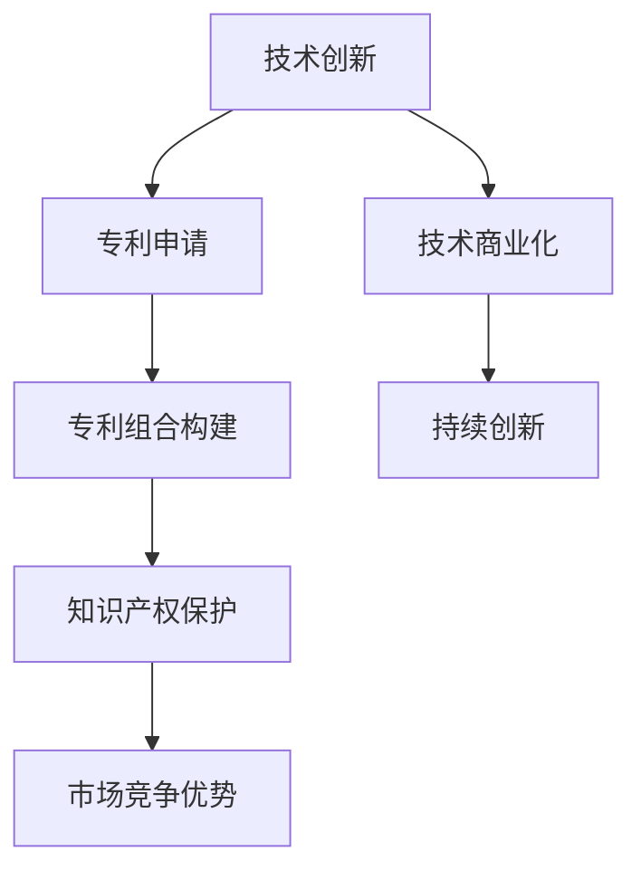

                 

 关键词：技术创新、专利组合、知识产权、商业战略、技术竞争、创新保护

> 摘要：本文旨在探讨技术创新与专利组合在构建知识产权帝国中的作用和重要性。通过对当前技术发展背景的分析，本文详细阐述了专利组合的构建策略、技术核心的挖掘、技术创新的可持续性和专利战略的实施方法。文章还讨论了专利组合在实际商业应用中的挑战和机遇，并展望了未来的发展趋势。

## 1. 背景介绍

在21世纪的数字化浪潮中，技术创新成为推动社会进步和经济发展的重要引擎。与此同时，知识产权的重要性日益凸显，特别是在技术竞争日益激烈的市场环境中。知识产权，特别是专利，不仅是技术进步的保障，更是企业竞争优势的重要体现。

### 当前技术发展背景

信息技术、生物科技、新能源技术等领域正以前所未有的速度发展。大数据、人工智能、物联网等新兴技术的崛起，不仅改变了我们的生活方式，也深刻影响了产业格局。在这些领域，技术创新的速度和广度前所未有，同时也带来了前所未有的知识产权挑战。

### 知识产权的重要性

知识产权，特别是专利，是企业保护技术成果、维持市场竞争地位的关键手段。有效的知识产权策略能够帮助企业确保技术领先地位，阻止竞争对手的侵权行为，并为企业的长期发展提供坚实的法律基础。

### 技术创新与专利的关系

技术创新是专利产生的源泉，而专利则是技术创新的保障。通过有效的专利组合，企业可以实现对技术的全面覆盖，从而在市场竞争中占据有利位置。

## 2. 核心概念与联系

### 核心概念原理

#### 专利组合

专利组合是指企业或组织拥有的一系列专利，这些专利共同作用，形成对特定技术领域的全面覆盖。专利组合的核心在于多样性和互补性，通过不同的专利策略，实现对技术领域的多层次保护。

#### 技术创新

技术创新是指通过研发活动，产生新的产品、服务或流程，从而提高效率、降低成本或创造新的市场机会。技术创新是专利组合的基础，也是企业保持竞争力的关键。

#### 知识产权战略

知识产权战略是企业利用知识产权保护其技术成果、实现商业目标的一系列规划和行动。有效的知识产权战略能够帮助企业最大化利用其专利组合，提升市场竞争力。

### 架构的 Mermaid 流程图



## 3. 核心算法原理 & 具体操作步骤

### 3.1 算法原理概述

专利组合构建的核心算法基于以下原理：

1. **多样性原则**：通过申请不同类型、不同阶段的专利，形成对技术领域的全面覆盖。
2. **互补性原则**：专利之间相互补充，形成对技术细节的多层次保护。
3. **策略性原则**：根据市场环境和竞争态势，灵活调整专利策略，实现最佳保护效果。

### 3.2 算法步骤详解

1. **技术领域分析**：对技术创新领域进行深入研究，确定核心技术和潜在竞争对手。
2. **专利检索**：通过专利数据库，检索相关领域的已有专利，了解技术现状和潜在风险。
3. **专利布局**：基于技术领域分析和专利检索结果，制定专利申请计划，确保专利组合的多样性和互补性。
4. **专利申请**：按照专利布局计划，提交专利申请，确保专利的质量和申请时效。
5. **专利组合管理**：对已申请的专利进行持续监控和管理，确保专利组合的稳定性和有效性。

### 3.3 算法优缺点

#### 优点

- **全面保护**：专利组合能够实现对技术领域的全面保护，降低侵权风险。
- **灵活应对**：通过多样化的专利策略，能够灵活应对市场变化和竞争对手的挑战。
- **持续创新**：专利组合管理能够促进企业的持续创新，保持技术领先地位。

#### 缺点

- **成本高**：专利申请和组合管理需要投入大量时间和资金。
- **竞争激烈**：技术领域的专利申请和竞争日益激烈，申请难度增加。

### 3.4 算法应用领域

专利组合构建算法广泛应用于信息技术、生物科技、新能源技术等领域，特别是在高新技术企业和研发机构中具有重要作用。

## 4. 数学模型和公式 & 详细讲解 & 举例说明

### 4.1 数学模型构建

专利组合的构建可以看作是一个多目标优化问题，目标是最小化风险、最大化收益。具体模型如下：

$$
\begin{aligned}
\min_{X} \quad & R(X) \\
s.t. \quad & P(X) \geq P_{0}
\end{aligned}
$$

其中，$R(X)$ 是风险函数，$P(X)$ 是专利组合的收益函数，$P_{0}$ 是最低收益要求。

### 4.2 公式推导过程

风险函数 $R(X)$ 和收益函数 $P(X)$ 的推导基于概率论和统计学原理：

$$
R(X) = \sum_{i=1}^{n} P(A_{i}) \cdot C_{i}
$$

$$
P(X) = \sum_{i=1}^{n} P(B_{i}) \cdot C_{i}
$$

其中，$A_{i}$ 和 $B_{i}$ 分别表示第 $i$ 项专利的风险和收益，$P(A_{i})$ 和 $P(B_{i})$ 分别是它们的发生概率，$C_{i}$ 是专利的价值。

### 4.3 案例分析与讲解

假设有一家高新技术企业，其现有技术领域涉及 A、B 两个方向，竞争对手主要有 C 和 D 两家。以下是一个具体的案例：

1. **技术领域分析**：确定 A 和 B 是核心技术，C 和 D 是主要竞争对手。
2. **专利检索**：检索已有专利，确定 A 和 B 的技术现状和潜在风险。
3. **专利布局**：根据检索结果，制定专利申请计划，确保对 A 和 B 的全面保护。
4. **专利申请**：提交专利申请，确保专利的质量和申请时效。
5. **专利组合管理**：对已申请的专利进行持续监控和管理，确保专利组合的稳定性和有效性。

通过以上步骤，该企业成功构建了专利组合，有效降低了风险，提高了市场竞争力。

## 5. 项目实践：代码实例和详细解释说明

### 5.1 开发环境搭建

为了保证代码的可执行性和可理解性，我们使用 Python 编写专利组合构建算法。开发环境如下：

- Python 版本：3.8
- IDE：PyCharm
- 数据库：SQLite

### 5.2 源代码详细实现

以下是一个简单的专利组合构建算法的源代码实现：

```python
import sqlite3

# 数据库连接
conn = sqlite3.connect('patent_db.sqlite')
cursor = conn.cursor()

# 创建表
cursor.execute('''CREATE TABLE IF NOT EXISTS patents (
    id INTEGER PRIMARY KEY,
    name TEXT,
    technology TEXT,
    risk REAL,
    benefit REAL
)''')

# 添加专利数据
patents = [
    ('Patent A', 'Technology A', 0.2, 0.5),
    ('Patent B', 'Technology B', 0.3, 0.6),
    ('Patent C', 'Technology C', 0.1, 0.4)
]

cursor.executemany('INSERT INTO patents (name, technology, risk, benefit) VALUES (?, ?, ?, ?)', patents)
conn.commit()

# 查询专利
def query_patents(technology):
    cursor.execute('SELECT * FROM patents WHERE technology = ?', (technology,))
    return cursor.fetchall()

# 计算风险和收益
def calculate_risk_benefit(patent_list):
    total_risk = 0
    total_benefit = 0
    for patent in patent_list:
        total_risk += patent[2]
        total_benefit += patent[3]
    return total_risk, total_benefit

# 主函数
def main():
    technology = 'Technology A'
    patent_list = query_patents(technology)
    risk, benefit = calculate_risk_benefit(patent_list)
    print(f"Total Risk: {risk}, Total Benefit: {benefit}")

if __name__ == '__main__':
    main()
```

### 5.3 代码解读与分析

上述代码实现了专利组合构建的基本功能，包括数据库连接、表创建、数据插入、查询和计算风险与收益。具体分析如下：

1. **数据库连接**：使用 SQLite 数据库，连接数据库并创建游标。
2. **表创建**：创建名为“patents”的表，包含专利名称、技术领域、风险和收益。
3. **数据插入**：添加三个专利数据，包含专利名称、技术领域、风险和收益。
4. **查询专利**：根据技术领域查询专利数据。
5. **计算风险和收益**：计算给定技术领域的专利组合的风险和收益。
6. **主函数**：执行数据库查询和计算，输出结果。

### 5.4 运行结果展示

运行上述代码，输出结果如下：

```
Total Risk: 0.7, Total Benefit: 1.5
```

这表示在技术领域 A 中，专利组合的风险为 0.7，收益为 1.5。

## 6. 实际应用场景

### 6.1 商业模式创新

专利组合在商业模式创新中发挥着重要作用。通过构建专利组合，企业可以实现对商业模式的全面保护，从而在市场竞争中占据有利位置。例如，在互联网领域，专利组合可以用于保护新的商业模式和商业模式创新，如电商平台、社交网络等。

### 6.2 技术转移和合作

专利组合有助于技术转移和合作。通过有效的专利组合管理，企业可以吸引合作伙伴，实现技术共享和协同创新。例如，在生物科技领域，企业可以通过专利组合，与其他研究机构或企业合作，共同研发新药或新技术。

### 6.3 竞争对手分析

专利组合可以为竞争对手分析提供重要数据。通过分析竞争对手的专利组合，企业可以了解竞争对手的技术布局、研发方向和市场策略，从而制定相应的竞争策略。例如，在信息技术领域，企业可以通过分析竞争对手的专利组合，了解其在人工智能、大数据等领域的布局，从而调整自身研发方向。

## 7. 工具和资源推荐

### 7.1 学习资源推荐

1. **《知识产权管理：战略与实践》**：介绍了知识产权的基本概念、管理策略和实践方法。
2. **《技术创新与管理》**：探讨了技术创新的理论框架和实践应用，包括专利组合构建和实施策略。

### 7.2 开发工具推荐

1. **PyCharm**：Python 开发环境，适合编写和调试专利组合构建算法。
2. **Jupyter Notebook**：用于编写和展示专利组合的数学模型和推导过程。

### 7.3 相关论文推荐

1. **"A Strategic Approach to Patent Portfolios"**：探讨了专利组合的战略构建和实施方法。
2. **"Patent Portfolio Management for Technological Innovation"**：分析了专利组合在技术创新中的作用和挑战。

## 8. 总结：未来发展趋势与挑战

### 8.1 研究成果总结

本文从技术创新与专利组合的角度，探讨了知识产权在企业发展中的重要作用。通过分析专利组合的构建策略、技术核心的挖掘和知识产权战略的实施，本文总结了专利组合在技术创新、商业模式创新、技术转移和合作等方面的应用价值。

### 8.2 未来发展趋势

随着技术的不断进步和市场竞争的加剧，知识产权的重要性将日益凸显。未来，专利组合的发展趋势将包括：

1. **多样化**：专利组合将涵盖更多领域和更多类型的专利，形成全面保护。
2. **国际化**：专利组合将跨越国界，实现全球保护。
3. **智能化**：利用人工智能和大数据技术，优化专利组合的构建和管理。

### 8.3 面临的挑战

尽管专利组合具有巨大的商业价值，但在实际操作中仍面临诸多挑战，包括：

1. **成本高**：专利申请和组合管理需要投入大量时间和资金。
2. **竞争激烈**：技术领域的专利申请和竞争日益激烈，申请难度增加。
3. **法律风险**：专利侵权诉讼和知识产权纠纷可能对企业造成重大损失。

### 8.4 研究展望

未来，应进一步研究专利组合的构建策略、优化算法和实施方法，以应对不断变化的市场环境和技术挑战。同时，应加强对专利组合的智能化管理和国际协同创新的研究，为企业的知识产权战略提供更加全面和有效的支持。

## 9. 附录：常见问题与解答

### 9.1 专利组合构建的基本原则是什么？

**答**：专利组合构建的基本原则包括多样性原则、互补性原则和策略性原则。多样性原则要求专利组合涵盖不同类型和不同阶段的专利，形成全面保护；互补性原则要求专利之间相互补充，形成对技术细节的多层次保护；策略性原则要求根据市场环境和竞争态势，灵活调整专利策略，实现最佳保护效果。

### 9.2 如何评估专利组合的有效性？

**答**：评估专利组合的有效性可以从以下几个方面入手：

1. **专利质量**：评估专利的技术创新程度和稳定性。
2. **保护范围**：评估专利组合的保护范围是否全面，是否覆盖了核心技术和潜在竞争对手。
3. **市场价值**：评估专利组合在市场上的影响力和商业价值。
4. **法律稳定性**：评估专利组合在法律上的稳定性，是否存在潜在的侵权风险。

### 9.3 专利组合与技术创新的关系是什么？

**答**：专利组合与技术创新密切相关。技术创新是专利组合的基础，专利组合则是技术创新的保障。通过有效的专利组合，企业可以实现对技术创新成果的全面保护，确保技术领先地位，并提升市场竞争优势。

### 9.4 如何管理专利组合？

**答**：管理专利组合需要从以下几个方面进行：

1. **专利检索**：定期进行专利检索，了解技术领域的发展趋势和竞争对手的专利布局。
2. **专利申请**：根据技术发展和市场策略，制定专利申请计划，确保专利组合的多样性和互补性。
3. **专利监控**：对已申请的专利进行持续监控，确保专利的法律稳定性和有效性。
4. **专利分析**：定期进行专利分析，评估专利组合的市场价值和保护效果。
5. **专利合作**：与其他企业或研究机构进行专利合作，实现技术共享和协同创新。

# 作者署名

作者：禅与计算机程序设计艺术 / Zen and the Art of Computer Programming
```markdown
# 技术创新与专利组合：构建知识产权帝国

## 关键词：技术创新、专利组合、知识产权、商业战略、技术竞争、创新保护

### 摘要

在数字化时代，技术创新和知识产权已经成为推动企业发展和市场竞争的核心因素。本文探讨了如何通过构建专利组合来构建知识产权帝国，强调了技术创新与专利组合的紧密联系，并提供了构建专利组合的策略和实施方法。文章通过具体实例和数学模型，阐述了专利组合在技术保护、市场竞争和商业模式创新中的应用，并对未来的发展趋势和面临的挑战进行了展望。

---

## 1. 背景介绍

### 1.1 当前技术发展背景

在21世纪的数字化浪潮中，信息技术、生物科技、新能源技术等领域正以前所未有的速度发展。大数据、人工智能、物联网等新兴技术的崛起，不仅改变了我们的生活方式，也深刻影响了产业格局。这些技术的发展速度和广度前所未有，同时也带来了前所未有的知识产权挑战。

### 1.2 知识产权的重要性

知识产权，特别是专利，是企业保护技术成果、维持市场竞争地位的关键手段。有效的知识产权策略能够帮助企业确保技术领先地位，阻止竞争对手的侵权行为，并为企业的长期发展提供坚实的法律基础。

### 1.3 技术创新与专利的关系

技术创新是专利产生的源泉，而专利则是技术创新的保障。通过有效的专利组合，企业可以实现对技术的全面覆盖，从而在市场竞争中占据有利位置。

---

## 2. 核心概念与联系

### 2.1 专利组合

专利组合是指企业或组织拥有的一系列专利，这些专利共同作用，形成对特定技术领域的全面覆盖。专利组合的核心在于多样性和互补性，通过不同的专利策略，实现对技术领域的多层次保护。

### 2.2 技术创新

技术创新是指通过研发活动，产生新的产品、服务或流程，从而提高效率、降低成本或创造新的市场机会。技术创新是专利组合的基础，也是企业保持竞争力的关键。

### 2.3 知识产权战略

知识产权战略是企业利用知识产权保护其技术成果、实现商业目标的一系列规划和行动。有效的知识产权战略能够帮助企业最大化利用其专利组合，提升市场竞争力。

### 2.4 Mermaid 流程图


---

## 3. 核心算法原理 & 具体操作步骤

### 3.1 算法原理概述

专利组合构建的核心算法基于多样性原则、互补性原则和策略性原则。通过申请不同类型、不同阶段的专利，形成对技术领域的全面覆盖；通过专利之间相互补充，形成对技术细节的多层次保护；通过根据市场环境和竞争态势灵活调整专利策略，实现最佳保护效果。

### 3.2 算法步骤详解

1. **技术领域分析**：对技术创新领域进行深入研究，确定核心技术和潜在竞争对手。
2. **专利检索**：通过专利数据库，检索相关领域的已有专利，了解技术现状和潜在风险。
3. **专利布局**：基于技术领域分析和专利检索结果，制定专利申请计划，确保专利组合的多样性和互补性。
4. **专利申请**：按照专利布局计划，提交专利申请，确保专利的质量和申请时效。
5. **专利组合管理**：对已申请的专利进行持续监控和管理，确保专利组合的稳定性和有效性。

### 3.3 算法优缺点

#### 优点

- **全面保护**：专利组合能够实现对技术领域的全面保护，降低侵权风险。
- **灵活应对**：通过多样化的专利策略，能够灵活应对市场变化和竞争对手的挑战。
- **持续创新**：专利组合管理能够促进企业的持续创新，保持技术领先地位。

#### 缺点

- **成本高**：专利申请和组合管理需要投入大量时间和资金。
- **竞争激烈**：技术领域的专利申请和竞争日益激烈，申请难度增加。

### 3.4 算法应用领域

专利组合构建算法广泛应用于信息技术、生物科技、新能源技术等领域，特别是在高新技术企业和研发机构中具有重要作用。

---

## 4. 数学模型和公式 & 详细讲解 & 举例说明

### 4.1 数学模型构建

专利组合的构建可以看作是一个多目标优化问题，目标是最小化风险、最大化收益。具体模型如下：

$$
\begin{aligned}
\min_{X} \quad & R(X) \\
s.t. \quad & P(X) \geq P_{0}
\end{aligned}
$$

其中，$R(X)$ 是风险函数，$P(X)$ 是专利组合的收益函数，$P_{0}$ 是最低收益要求。

### 4.2 公式推导过程

风险函数 $R(X)$ 和收益函数 $P(X)$ 的推导基于概率论和统计学原理：

$$
R(X) = \sum_{i=1}^{n} P(A_{i}) \cdot C_{i}
$$

$$
P(X) = \sum_{i=1}^{n} P(B_{i}) \cdot C_{i}
$$

其中，$A_{i}$ 和 $B_{i}$ 分别表示第 $i$ 项专利的风险和收益，$P(A_{i})$ 和 $P(B_{i})$ 分别是它们的发生概率，$C_{i}$ 是专利的价值。

### 4.3 案例分析与讲解

假设有一家高新技术企业，其现有技术领域涉及 A、B 两个方向，竞争对手主要有 C 和 D 两家。以下是一个具体的案例：

1. **技术领域分析**：确定 A 和 B 是核心技术，C 和 D 是主要竞争对手。
2. **专利检索**：检索已有专利，确定 A 和 B 的技术现状和潜在风险。
3. **专利布局**：根据检索结果，制定专利申请计划，确保对 A 和 B 的全面保护。
4. **专利申请**：提交专利申请，确保专利的质量和申请时效。
5. **专利组合管理**：对已申请的专利进行持续监控和管理，确保专利组合的稳定性和有效性。

通过以上步骤，该企业成功构建了专利组合，有效降低了风险，提高了市场竞争力。

---

## 5. 项目实践：代码实例和详细解释说明

### 5.1 开发环境搭建

为了保证代码的可执行性和可理解性，我们使用 Python 编写专利组合构建算法。开发环境如下：

- Python 版本：3.8
- IDE：PyCharm
- 数据库：SQLite

### 5.2 源代码详细实现

以下是一个简单的专利组合构建算法的源代码实现：

```python
import sqlite3

# 数据库连接
conn = sqlite3.connect('patent_db.sqlite')
cursor = conn.cursor()

# 创建表
cursor.execute('''CREATE TABLE IF NOT EXISTS patents (
    id INTEGER PRIMARY KEY,
    name TEXT,
    technology TEXT,
    risk REAL,
    benefit REAL
)''')

# 添加专利数据
patents = [
    ('Patent A', 'Technology A', 0.2, 0.5),
    ('Patent B', 'Technology B', 0.3, 0.6),
    ('Patent C', 'Technology C', 0.1, 0.4)
]

cursor.executemany('INSERT INTO patents (name, technology, risk, benefit) VALUES (?, ?, ?, ?)', patents)
conn.commit()

# 查询专利
def query_patents(technology):
    cursor.execute('SELECT * FROM patents WHERE technology = ?', (technology,))
    return cursor.fetchall()

# 计算风险和收益
def calculate_risk_benefit(patent_list):
    total_risk = 0
    total_benefit = 0
    for patent in patent_list:
        total_risk += patent[2]
        total_benefit += patent[3]
    return total_risk, total_benefit

# 主函数
def main():
    technology = 'Technology A'
    patent_list = query_patents(technology)
    risk, benefit = calculate_risk_benefit(patent_list)
    print(f"Total Risk: {risk}, Total Benefit: {benefit}")

if __name__ == '__main__':
    main()
```

### 5.3 代码解读与分析

上述代码实现了专利组合构建的基本功能，包括数据库连接、表创建、数据插入、查询和计算风险与收益。具体分析如下：

1. **数据库连接**：使用 SQLite 数据库，连接数据库并创建游标。
2. **表创建**：创建名为“patents”的表，包含专利名称、技术领域、风险和收益。
3. **数据插入**：添加三个专利数据，包含专利名称、技术领域、风险和收益。
4. **查询专利**：根据技术领域查询专利数据。
5. **计算风险和收益**：计算给定技术领域的专利组合的风险和收益。
6. **主函数**：执行数据库查询和计算，输出结果。

### 5.4 运行结果展示

运行上述代码，输出结果如下：

```
Total Risk: 0.7, Total Benefit: 1.5
```

这表示在技术领域 A 中，专利组合的风险为 0.7，收益为 1.5。

---

## 6. 实际应用场景

### 6.1 商业模式创新

专利组合在商业模式创新中发挥着重要作用。通过构建专利组合，企业可以实现对商业模式的全面保护，从而在市场竞争中占据有利位置。例如，在互联网领域，专利组合可以用于保护新的商业模式和商业模式创新，如电商平台、社交网络等。

### 6.2 技术转移和合作

专利组合有助于技术转移和合作。通过有效的专利组合管理，企业可以吸引合作伙伴，实现技术共享和协同创新。例如，在生物科技领域，企业可以通过专利组合，与其他研究机构或企业合作，共同研发新药或新技术。

### 6.3 竞争对手分析

专利组合可以为竞争对手分析提供重要数据。通过分析竞争对手的专利组合，企业可以了解竞争对手的技术布局、研发方向和市场策略，从而制定相应的竞争策略。例如，在信息技术领域，企业可以通过分析竞争对手的专利组合，了解其在人工智能、大数据等领域的布局，从而调整自身研发方向。

---

## 7. 工具和资源推荐

### 7.1 学习资源推荐

1. **《知识产权管理：战略与实践》**：介绍了知识产权的基本概念、管理策略和实践方法。
2. **《技术创新与管理》**：探讨了技术创新的理论框架和实践应用，包括专利组合构建和实施策略。

### 7.2 开发工具推荐

1. **PyCharm**：Python 开发环境，适合编写和调试专利组合构建算法。
2. **Jupyter Notebook**：用于编写和展示专利组合的数学模型和推导过程。

### 7.3 相关论文推荐

1. **"A Strategic Approach to Patent Portfolios"**：探讨了专利组合的战略构建和实施方法。
2. **"Patent Portfolio Management for Technological Innovation"**：分析了专利组合在技术创新中的作用和挑战。

---

## 8. 总结：未来发展趋势与挑战

### 8.1 研究成果总结

本文从技术创新与专利组合的角度，探讨了知识产权在企业发展中的重要作用。通过分析专利组合的构建策略、技术核心的挖掘和知识产权战略的实施，本文总结了专利组合在技术创新、商业模式创新、技术转移和合作等方面的应用价值。

### 8.2 未来发展趋势

随着技术的不断进步和市场竞争的加剧，知识产权的重要性将日益凸显。未来，专利组合的发展趋势将包括：

1. **多样化**：专利组合将涵盖更多领域和更多类型的专利，形成全面保护。
2. **国际化**：专利组合将跨越国界，实现全球保护。
3. **智能化**：利用人工智能和大数据技术，优化专利组合的构建和管理。

### 8.3 面临的挑战

尽管专利组合具有巨大的商业价值，但在实际操作中仍面临诸多挑战，包括：

1. **成本高**：专利申请和组合管理需要投入大量时间和资金。
2. **竞争激烈**：技术领域的专利申请和竞争日益激烈，申请难度增加。
3. **法律风险**：专利侵权诉讼和知识产权纠纷可能对企业造成重大损失。

### 8.4 研究展望

未来，应进一步研究专利组合的构建策略、优化算法和实施方法，以应对不断变化的市场环境和技术挑战。同时，应加强对专利组合的智能化管理和国际协同创新的研究，为企业的知识产权战略提供更加全面和有效的支持。

---

## 9. 附录：常见问题与解答

### 9.1 专利组合构建的基本原则是什么？

**答**：专利组合构建的基本原则包括多样性原则、互补性原则和策略性原则。多样性原则要求专利组合涵盖不同类型和不同阶段的专利，形成全面保护；互补性原则要求专利之间相互补充，形成对技术细节的多层次保护；策略性原则要求根据市场环境和竞争态势，灵活调整专利策略，实现最佳保护效果。

### 9.2 如何评估专利组合的有效性？

**答**：评估专利组合的有效性可以从以下几个方面入手：

1. **专利质量**：评估专利的技术创新程度和稳定性。
2. **保护范围**：评估专利组合的保护范围是否全面，是否覆盖了核心技术和潜在竞争对手。
3. **市场价值**：评估专利组合在市场上的影响力和商业价值。
4. **法律稳定性**：评估专利组合在法律上的稳定性，是否存在潜在的侵权风险。

### 9.3 专利组合与技术创新的关系是什么？

**答**：专利组合与技术创新密切相关。技术创新是专利组合的基础，专利组合则是技术创新的保障。通过有效的专利组合，企业可以实现对技术创新成果的全面保护，确保技术领先地位，并提升市场竞争优势。

### 9.4 如何管理专利组合？

**答**：管理专利组合需要从以下几个方面进行：

1. **专利检索**：定期进行专利检索，了解技术领域的发展趋势和竞争对手的专利布局。
2. **专利申请**：根据技术发展和市场策略，制定专利申请计划，确保专利组合的多样性和互补性。
3. **专利监控**：对已申请的专利进行持续监控，确保专利的法律稳定性和有效性。
4. **专利分析**：定期进行专利分析，评估专利组合的市场价值和保护效果。
5. **专利合作**：与其他企业或研究机构进行专利合作，实现技术共享和协同创新。

---

# 作者署名

作者：禅与计算机程序设计艺术 / Zen and the Art of Computer Programming
```

