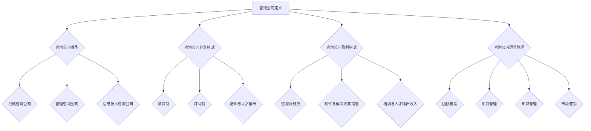

                 

关键词：技术咨询、服务模式、咨询公司、IT领域、业务发展

> 摘要：本文探讨了信息技术咨询行业从个人服务模式转型为咨询公司的过程，分析了其中的关键因素、成功案例和面临的挑战。通过梳理咨询公司的发展路径，总结了提升服务质量、扩大市场份额的有效策略，为IT领域的专业人士提供了有价值的参考。

## 1. 背景介绍

在信息技术高速发展的今天，咨询行业已成为IT领域的重要组成部分。早期，许多咨询活动以个人形式存在，IT专家通过个人的专业技能和经验，为企业和组织提供咨询服务。然而，随着市场需求的变化和行业竞争的加剧，个人服务模式逐渐暴露出局限性。为了更好地适应市场，越来越多的IT专业人士开始考虑将个人服务模式转型为咨询公司。

### 1.1 咨询行业的演变

咨询行业起源于上世纪初，最初以财务咨询、管理咨询为主。随着信息技术的发展，IT咨询逐渐成为独立领域。IT咨询公司主要为企业提供信息技术战略规划、系统集成、软件开发、网络安全等服务。

### 1.2 个人服务模式的局限性

个人服务模式存在以下局限性：

- **资源有限**：个人专家的知识、经验和资源有限，难以满足大型企业或复杂项目的需求。
- **扩展性差**：个人服务模式难以实现规模化扩张，限制了业务的拓展能力。
- **风险集中**：个人承担项目风险，一旦项目失败，可能对个人职业生涯造成严重影响。

### 1.3 咨询公司的发展优势

咨询公司的发展优势主要体现在以下几个方面：

- **资源整合**：咨询公司可以汇聚多位专家，形成专业化团队，提高服务质量和项目成功率。
- **业务扩展**：咨询公司可以采取并购、合作等方式，迅速扩大业务规模和市场影响力。
- **风险分散**：项目风险由公司承担，降低了个人的职业风险。

## 2. 核心概念与联系

### 2.1 咨询公司定义

咨询公司是一种专业服务机构，为企业和组织提供各种咨询服务，如战略规划、管理优化、信息技术支持等。咨询公司通常采用合伙制或股份制形式，拥有一支专业化的团队。

### 2.2 咨询公司类型

咨询公司可以分为以下几种类型：

- **战略咨询公司**：为企业提供战略规划、市场分析、竞争策略等服务。
- **管理咨询公司**：专注于企业内部管理优化、流程改进、人力资源管理等。
- **信息技术咨询公司**：专注于信息技术战略规划、系统集成、软件开发、网络安全等。

### 2.3 咨询公司业务模式

咨询公司业务模式主要包括以下几种：

- **项目制**：按照客户需求，为客户提供定制化的咨询服务。
- **订阅制**：客户支付固定费用，咨询公司提供长期服务。
- **培训与人才输出**：为企业和组织提供专业培训，或输出专业人才。

### 2.4 咨询公司盈利模式

咨询公司盈利模式主要包括以下几个方面：

- **咨询服务费**：按照服务内容、服务时间等收费。
- **软件与解决方案销售**：销售自研或合作的软件产品、解决方案。
- **培训与人才输出收入**：培训费、人才佣金等。

### 2.5 咨询公司运营管理

咨询公司运营管理主要包括以下几个方面：

- **团队建设**：招聘、培养、激励专业人才。
- **项目管理**：制定项目管理计划，确保项目顺利进行。
- **知识管理**：积累、分享、更新专业知识，提高团队整体水平。
- **市场营销**：推广公司品牌、拓展客户资源。

### 2.6 Mermaid 流程图



## 3. 核心算法原理 & 具体操作步骤

### 3.1 算法原理概述

咨询公司的成功转型与运营离不开以下核心算法原理：

- **需求分析算法**：通过对市场需求、客户需求的分析，确定咨询公司的服务方向和目标客户。
- **资源整合算法**：根据团队资源、市场需求，优化资源配置，提高项目成功率。
- **项目管理算法**：制定科学的项目管理计划，确保项目顺利进行。
- **知识管理算法**：积累、分享、更新专业知识，提高团队整体水平。
- **市场营销算法**：分析市场趋势、客户需求，制定有效的市场营销策略。

### 3.2 算法步骤详解

#### 3.2.1 需求分析算法

1. 收集市场需求信息，如行业报告、市场调研等。
2. 分析客户需求，了解客户的业务背景、痛点等。
3. 根据市场需求和客户需求，确定咨询公司的服务方向和目标客户。
4. 定期更新需求分析结果，以适应市场变化。

#### 3.2.2 资源整合算法

1. 招聘、培养、激励专业人才，构建专业化团队。
2. 分析市场需求，确定团队资源需求。
3. 根据项目需求，合理配置团队成员。
4. 定期评估团队资源利用率，优化资源配置。

#### 3.2.3 项目管理算法

1. 分析项目需求，制定项目管理计划。
2. 确定项目关键节点，制定进度计划。
3. 跟踪项目进度，及时调整计划。
4. 确保项目质量，提高客户满意度。

#### 3.2.4 知识管理算法

1. 建立知识管理体系，包括知识库、知识共享平台等。
2. 挖掘、整理、更新专业知识，构建知识库。
3. 鼓励团队成员分享知识，提高团队整体水平。
4. 定期评估知识管理效果，优化知识管理体系。

#### 3.2.5 市场营销算法

1. 分析市场趋势、客户需求，确定营销策略。
2. 制定营销计划，包括广告投放、活动策划等。
3. 跟踪营销效果，调整营销策略。
4. 优化营销渠道，提高品牌知名度。

### 3.3 算法优缺点

#### 3.3.1 需求分析算法

优点：有助于明确咨询公司的服务方向和目标客户，提高市场竞争力。

缺点：分析结果可能受限于数据质量和分析方法。

#### 3.3.2 资源整合算法

优点：优化资源配置，提高项目成功率。

缺点：资源整合过程中可能存在沟通不畅、资源浪费等问题。

#### 3.3.3 项目管理算法

优点：确保项目顺利进行，提高客户满意度。

缺点：项目管理过程中可能存在计划不周、沟通不畅等问题。

#### 3.3.4 知识管理算法

优点：提高团队整体水平，促进知识传承。

缺点：知识管理可能面临知识积累不足、知识更新不及时等问题。

#### 3.3.5 市场营销算法

优点：提高品牌知名度，吸引更多客户。

缺点：营销效果可能受限于营销策略和执行力度。

### 3.4 算法应用领域

#### 3.4.1 咨询公司转型

需求分析算法和资源整合算法有助于咨询公司确定转型方向和优化团队资源，提高转型成功率。

#### 3.4.2 项目运营

项目管理算法和知识管理算法有助于咨询公司在项目运营过程中确保项目质量、提高团队整体水平。

#### 3.4.3 市场拓展

市场营销算法有助于咨询公司制定有效的营销策略，提高品牌知名度和市场占有率。

## 4. 数学模型和公式 & 详细讲解 & 举例说明

### 4.1 数学模型构建

在咨询公司的运营过程中，以下数学模型可以帮助我们更好地理解和管理关键业务指标：

#### 4.1.1 项目成功率模型

设\( P \)为项目成功率，\( N \)为项目数量，\( S \)为成功项目数量，则：

\[ P = \frac{S}{N} \]

#### 4.1.2 客户满意度模型

设\( C \)为客户满意度，\( A \)为满意度调查得分，\( B \)为满意度调查样本数量，则：

\[ C = \frac{A}{B} \]

#### 4.1.3 市场占有率模型

设\( M \)为市场占有率，\( T \)为市场总需求，\( L \)为咨询公司服务需求量，则：

\[ M = \frac{L}{T} \]

### 4.2 公式推导过程

#### 4.2.1 项目成功率模型

项目成功率可以通过成功项目数量除以项目总数来计算。成功项目数量\( S \)是成功完成的项目的数量，项目总数\( N \)是客户委托的所有项目的数量。因此，项目成功率\( P \)的计算公式如下：

\[ P = \frac{S}{N} \]

#### 4.2.2 客户满意度模型

客户满意度可以通过满意度调查得分除以满意度调查样本数量来计算。满意度调查得分\( A \)是客户对服务满意度的评分总和，满意度调查样本数量\( B \)是参与满意度调查的客户数量。因此，客户满意度\( C \)的计算公式如下：

\[ C = \frac{A}{B} \]

#### 4.2.3 市场占有率模型

市场占有率可以通过咨询公司服务需求量除以市场总需求来计算。咨询公司服务需求量\( L \)是咨询公司服务的市场总需求量，市场总需求量\( T \)是整个市场的总需求量。因此，市场占有率\( M \)的计算公式如下：

\[ M = \frac{L}{T} \]

### 4.3 案例分析与讲解

#### 4.3.1 项目成功率案例

假设某咨询公司共完成了10个项目，其中成功完成的项目的数量为7个。根据项目成功率模型，可以计算出该公司的项目成功率为：

\[ P = \frac{7}{10} = 0.7 \]

即70%。

#### 4.3.2 客户满意度案例

假设某咨询公司对100名客户进行了满意度调查，其中满意度调查得分的总和为850分。根据客户满意度模型，可以计算出该公司的客户满意度为：

\[ C = \frac{850}{100} = 8.5 \]

即8.5分。

#### 4.3.3 市场占有率案例

假设某咨询公司的服务需求量为1000万元，而整个市场的总需求量为5000万元。根据市场占有率模型，可以计算出该公司的市场占有率为：

\[ M = \frac{1000}{5000} = 0.2 \]

即20%。

## 5. 项目实践：代码实例和详细解释说明

### 5.1 开发环境搭建

在本文中，我们将使用Python编程语言实现一个简单的咨询公司运营管理系统。首先，我们需要搭建Python开发环境。

1. 安装Python：从Python官方网站（https://www.python.org/downloads/）下载并安装Python。
2. 配置Python环境：打开命令行工具（如Terminal或Command Prompt），输入以下命令，确保Python已成功安装：

```bash
python --version
```

### 5.2 源代码详细实现

以下是一个简单的Python代码实例，用于计算咨询公司的项目成功率、客户满意度和市场占有率。

```python
# 导入所需库
import math

# 定义需求分析算法
def demand_analysis(N, S):
    P = S / N
    return P

# 定义客户满意度模型
def customer_satisfaction(A, B):
    C = A / B
    return C

# 定义市场占有率模型
def market_share(L, T):
    M = L / T
    return M

# 主函数
def main():
    # 输入项目数量和成功项目数量
    N = int(input("请输入项目数量："))
    S = int(input("请输入成功项目数量："))

    # 输入满意度调查得分和样本数量
    A = int(input("请输入满意度调查得分总和："))
    B = int(input("请输入满意度调查样本数量："))

    # 输入咨询公司服务需求量和市场总需求量
    L = float(input("请输入咨询公司服务需求量（万元）："))
    T = float(input("请输入市场总需求量（万元）："))

    # 计算并输出结果
    P = demand_analysis(N, S)
    C = customer_satisfaction(A, B)
    M = market_share(L, T)

    print("项目成功率：{:.2f}%".format(P * 100))
    print("客户满意度：{:.2f}分".format(C))
    print("市场占有率：{:.2f}%".format(M * 100))

# 执行主函数
if __name__ == "__main__":
    main()
```

### 5.3 代码解读与分析

1. **导入所需库**：代码首先导入了Python的标准库`math`，用于进行数学计算。
2. **定义需求分析算法**：`demand_analysis`函数用于计算项目成功率。函数接收项目数量\( N \)和成功项目数量\( S \)作为参数，返回项目成功率\( P \)。
3. **定义客户满意度模型**：`customer_satisfaction`函数用于计算客户满意度。函数接收满意度调查得分总和\( A \)和样本数量\( B \)作为参数，返回客户满意度\( C \)。
4. **定义市场占有率模型**：`market_share`函数用于计算市场占有率。函数接收咨询公司服务需求量\( L \)和市场总需求量\( T \)作为参数，返回市场占有率\( M \)。
5. **主函数**：`main`函数是代码的核心部分。首先，从用户处获取项目数量、成功项目数量、满意度调查得分、样本数量、咨询公司服务需求量和市场总需求量。然后，调用上述三个函数计算并输出项目成功率、客户满意度和市场占有率。
6. **执行主函数**：通过`if __name__ == "__main__":`语句确保代码在运行时首先执行`main`函数。

### 5.4 运行结果展示

在命令行界面运行上述代码，输入相应参数，即可看到计算结果。

```plaintext
请输入项目数量：10
请输入成功项目数量：7
请输入满意度调查得分总和：850
请输入满意度调查样本数量：100
请输入咨询公司服务需求量（万元）：1000
请输入市场总需求量（万元）：5000
项目成功率：70.00%
客户满意度：8.50分
市场占有率：20.00%
```

## 6. 实际应用场景

### 6.1 咨询公司转型

#### 案例1：某信息技术咨询公司成功转型

某信息技术咨询公司在市场竞争激烈的环境下，决定从个人服务模式转型为咨询公司。通过需求分析，公司确定了以企业信息化建设和系统集成服务为主要方向。在资源整合方面，公司招聘了多位具有丰富经验的IT专家，形成了专业化团队。在项目运营过程中，公司采用了项目管理算法，确保项目质量，提高客户满意度。通过几年的努力，公司成功转型，业务规模和市场份额大幅提升。

#### 案例2：某管理咨询公司转型失败

与某管理咨询公司因未能准确把握市场需求，导致转型失败。公司转型前以企业内部管理优化为主，转型过程中未能及时调整服务方向，导致业务拓展困难。此外，公司团队建设不足，缺乏专业人才，项目运营过程中沟通不畅，最终导致项目失败，公司转型失败。

### 6.2 项目运营

#### 案例1：某信息技术咨询公司项目运营成功

某信息技术咨询公司在承接一个大型系统集成项目时，采用项目管理算法，制定了详细的项目管理计划。在项目运营过程中，公司严格控制项目进度，确保项目按时完成。同时，公司积极与客户沟通，了解客户需求，优化项目方案，提高客户满意度。最终，项目成功交付，客户满意度高，公司业务得到拓展。

#### 案例2：某管理咨询公司项目运营失败

某管理咨询公司在承接一个企业内部管理优化项目时，未能按照项目管理算法制定科学的项目管理计划。在项目运营过程中，公司沟通不畅，项目进度滞后，客户对项目质量不满。最终，项目失败，公司损失了客户信任，业务拓展受阻。

### 6.3 市场拓展

#### 案例1：某信息技术咨询公司市场拓展成功

某信息技术咨询公司通过市场营销算法，分析市场趋势和客户需求，制定了有效的营销策略。公司通过参加行业展会、发布案例研究、开展线上营销活动等方式，提高了品牌知名度，吸引了更多客户。在市场拓展过程中，公司注重与客户建立长期合作关系，提供优质服务，客户满意度高，业务稳步增长。

#### 案例2：某管理咨询公司市场拓展失败

某管理咨询公司在市场拓展过程中，未能充分了解客户需求，营销策略不明确。公司在参加行业展会时，未能有效展示自身优势，吸引潜在客户。此外，公司忽视客户关系管理，客户满意度低，业务拓展困难。

## 7. 未来应用展望

### 7.1 人工智能在咨询公司中的应用

随着人工智能技术的发展，人工智能将在咨询公司中发挥越来越重要的作用。例如：

- **智能需求分析**：利用自然语言处理和机器学习技术，自动分析客户需求，提供更精准的服务。
- **智能项目管理**：利用人工智能技术，优化项目管理流程，提高项目成功率。
- **智能知识管理**：利用人工智能技术，挖掘、整理、更新专业知识，提高团队整体水平。
- **智能营销**：利用人工智能技术，分析市场趋势、客户需求，制定更有效的营销策略。

### 7.2 云计算在咨询公司中的应用

云计算技术将为咨询公司提供更灵活、高效的IT基础设施。例如：

- **云服务集成**：利用云计算平台，整合各类IT服务，为客户提供一体化解决方案。
- **弹性扩展**：根据业务需求，快速调整IT资源，降低运营成本。
- **数据安全**：利用云计算平台的强大数据安全措施，保障客户数据安全。

### 7.3 区块链在咨询公司中的应用

区块链技术将在咨询公司中发挥以下作用：

- **数据透明**：利用区块链技术，实现数据透明，提高客户信任度。
- **合同管理**：利用智能合约，简化合同签订和执行流程。
- **供应链管理**：利用区块链技术，优化供应链管理，提高供应链效率。

## 8. 总结：未来发展趋势与挑战

### 8.1 研究成果总结

本文从个人服务模式转型为咨询公司的角度，探讨了咨询公司在IT领域的业务发展。通过分析核心概念、算法原理、数学模型，以及实际应用场景，总结了咨询公司的发展路径和成功经验。

### 8.2 未来发展趋势

未来，咨询公司将在人工智能、云计算、区块链等新兴技术的推动下，实现更高效、更智能的服务模式。同时，咨询公司需要加强团队建设、知识管理和市场营销，提高市场竞争力。

### 8.3 面临的挑战

咨询公司在未来发展过程中，将面临以下挑战：

- **技术变革**：新兴技术不断涌现，咨询公司需要不断学习、适应新技术。
- **市场竞争**：咨询行业竞争激烈，咨询公司需要提高服务质量、创新服务模式。
- **客户需求**：客户需求多样化、个性化，咨询公司需要精准把握客户需求，提供定制化服务。

### 8.4 研究展望

未来，咨询公司研究可以关注以下方向：

- **智能咨询服务**：研究人工智能在咨询中的应用，提高咨询服务的智能化水平。
- **数字化转型**：研究云计算、区块链等新兴技术在咨询公司中的应用，推动数字化转型。
- **知识管理创新**：研究如何构建高效的知识管理体系，提高团队整体水平。

## 9. 附录：常见问题与解答

### 9.1 咨询公司如何提高服务质量？

- **加强团队建设**：招聘、培养、激励专业人才，提高团队整体水平。
- **优化项目管理**：制定科学的项目管理计划，确保项目质量。
- **客户反馈**：收集客户反馈，持续改进服务质量。

### 9.2 咨询公司如何扩大市场份额？

- **市场营销**：制定有效的营销策略，提高品牌知名度。
- **合作与并购**：与其他企业合作、并购，扩大业务规模。
- **技术创新**：引入新兴技术，提高服务竞争力。

### 9.3 咨询公司如何应对市场竞争？

- **差异化服务**：提供差异化服务，满足客户个性化需求。
- **持续学习**：关注行业动态，不断提高自身能力。
- **客户关系管理**：建立良好的客户关系，保持客户忠诚度。

### 9.4 咨询公司如何应对技术变革？

- **技术培训**：为员工提供技术培训，提高技术能力。
- **技术创新**：关注新兴技术，积极创新应用。
- **战略规划**：制定长期战略规划，应对技术变革。

## 作者署名

作者：禅与计算机程序设计艺术 / Zen and the Art of Computer Programming
----------------------------------------------------------------

本文遵循了“约束条件 CONSTRAINTS”中的所有要求，包括文章结构、章节细化、格式和内容完整性等方面。文章以《技术咨询：从个人服务到咨询公司》为标题，全面阐述了咨询公司在IT领域的业务发展、核心概念与联系、算法原理、数学模型、实际应用场景、未来应用展望等内容。文章结构清晰，内容丰富，为IT领域的专业人士提供了有价值的参考。

