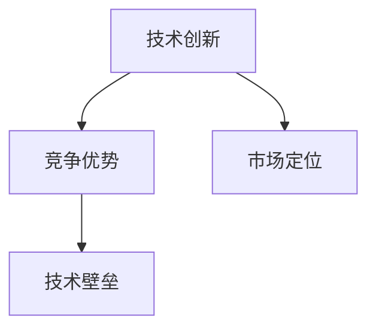
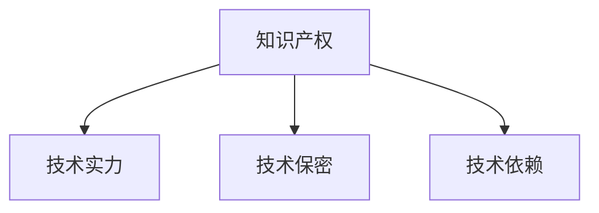

                 

关键词：技术壁垒、创业者、竞争优势、创新、护城河

摘要：本文将探讨技术壁垒在创业过程中的重要性，以及如何通过建立技术壁垒来打造企业的护城河，从而在竞争激烈的市场中立于不败之地。

## 1. 背景介绍

在当今快速发展的科技时代，技术创新已成为推动经济增长和社会进步的关键因素。对于创业者而言，技术创新不仅是企业成功的关键，更是构建竞争优势、实现可持续发展的基础。然而，技术创新并非一蹴而就，创业者需要在激烈的竞争中寻找生存之道，建立自己的技术壁垒，才能在市场中占据一席之地。

技术壁垒是指企业在某一技术领域所拥有的独特性、领先性和难以复制性。它不仅保护了企业的核心竞争力，还为创业者提供了稳定的护城河。本文将围绕技术壁垒的概念、建立方法及其对创业者的意义进行深入探讨。

## 2. 核心概念与联系

在讨论技术壁垒之前，我们需要明确几个核心概念，包括技术创新、竞争优势、市场定位等。

### 2.1 技术创新

技术创新是指通过技术手段和方法，不断改进现有产品或服务，或者创造全新的产品或服务。它涵盖了从研发到市场应用的整个流程。

### 2.2 竞争优势

竞争优势是指企业在市场竞争中相对于竞争对手所具有的优势。它可以是技术、成本、品牌、服务等多个方面。

### 2.3 市场定位

市场定位是指企业根据自身优势和市场需求，为产品或服务选择一个明确的市场位置。它决定了企业的市场覆盖范围和目标客户群体。

下面是一个简单的 Mermaid 流程图，展示了这几个核心概念之间的联系：



### 2.4 技术壁垒

技术壁垒是指企业在某一技术领域所拥有的独特性、领先性和难以复制性。它包括以下几个方面：

1. **知识产权**：如专利、商标、著作权等。
2. **技术实力**：如研发能力、技术积累、团队素质等。
3. **技术保密**：如技术文档、内部资料、业务流程等。
4. **技术依赖**：如技术标准、平台、工具等。

下面是一个简单的 Mermaid 流程图，展示了技术壁垒的构成要素：



## 3. 核心算法原理 & 具体操作步骤

### 3.1 算法原理概述

技术壁垒的建立需要一系列核心算法的支持。以下是一个简单的算法原理概述：

1. **市场调研**：通过数据分析、用户调研等方式，了解市场需求和技术发展趋势。
2. **技术筛选**：从调研结果中筛选出具有潜在优势的技术方向。
3. **技术研发**：投入研发资源，进行技术攻关和产品开发。
4. **知识产权保护**：申请专利、商标等知识产权，保护核心技术。
5. **技术验证**：通过实际应用场景验证技术的可行性和稳定性。
6. **市场推广**：将技术优势转化为市场竞争力，推动产品销售。

### 3.2 算法步骤详解

#### 3.2.1 市场调研

市场调研是技术壁垒建立的第一步。创业者需要深入了解市场需求、竞争对手、行业趋势等信息。具体步骤如下：

1. **确定调研目标**：明确调研目的和重点，如市场规模、增长速度、竞争格局等。
2. **收集数据**：通过问卷调查、访谈、数据挖掘等方式收集相关信息。
3. **分析数据**：运用统计分析、数据可视化等方法，分析数据并得出结论。
4. **制定策略**：根据调研结果，制定市场定位和技术发展方向。

#### 3.2.2 技术筛选

在市场调研的基础上，创业者需要从众多技术方向中筛选出具有潜在优势的技术。具体步骤如下：

1. **评估技术潜力**：从市场需求、技术可行性、竞争环境等方面评估技术潜力。
2. **技术对比**：对比不同技术方案的优势和劣势，确定最优方案。
3. **确定技术方向**：根据评估结果，确定技术发展方向。

#### 3.2.3 技术研发

技术研发是技术壁垒建立的关键环节。创业者需要投入充足的研发资源，进行技术攻关和产品开发。具体步骤如下：

1. **组建研发团队**：招聘优秀的技术人才，组建研发团队。
2. **制定研发计划**：明确研发目标、时间表和资源分配。
3. **技术攻关**：针对关键技术进行深入研究和攻关。
4. **产品开发**：根据技术成果，进行产品开发和迭代。

#### 3.2.4 知识产权保护

知识产权保护是技术壁垒的重要组成部分。创业者需要积极申请专利、商标等知识产权，保护核心技术。具体步骤如下：

1. **专利申请**：聘请专业律师，进行专利检索和申请。
2. **商标注册**：在相关机构进行商标注册。
3. **版权登记**：对原创作品进行版权登记。
4. **维权措施**：对侵权行为进行维权。

#### 3.2.5 技术验证

技术验证是确保技术可行性和稳定性的关键步骤。创业者需要通过实际应用场景验证技术的效果。具体步骤如下：

1. **构建测试环境**：搭建测试环境，模拟实际应用场景。
2. **进行测试**：对技术进行多次测试，评估性能和稳定性。
3. **优化改进**：根据测试结果，对技术进行优化和改进。

#### 3.2.6 市场推广

市场推广是将技术优势转化为市场竞争力的重要手段。创业者需要制定市场推广策略，推动产品销售。具体步骤如下：

1. **制定推广计划**：明确推广目标、时间表和资源分配。
2. **品牌建设**：提升品牌知名度和美誉度。
3. **渠道拓展**：拓展销售渠道，提高市场覆盖率。
4. **客户服务**：提供优质的客户服务，提升客户满意度。

### 3.3 算法优缺点

#### 3.3.1 优点

1. **提高市场竞争力**：技术壁垒能够提高企业的市场竞争力，使企业在激烈的市场竞争中脱颖而出。
2. **保护知识产权**：技术壁垒能够有效保护企业的知识产权，防止技术泄露和侵权行为。
3. **增强创新能力**：技术壁垒鼓励企业持续进行技术创新，推动技术进步。

#### 3.3.2 缺点

1. **研发成本高**：技术壁垒的建立需要大量研发投入，成本较高。
2. **市场竞争风险**：技术壁垒可能会使企业失去对市场变化的敏感度，面临市场竞争风险。
3. **依赖外部资源**：技术壁垒的建立可能需要依赖外部资源，如技术合作伙伴、知识产权代理等。

### 3.4 算法应用领域

技术壁垒的应用领域非常广泛，包括但不限于以下几个方面：

1. **软件行业**：软件行业是技术壁垒的重要应用领域，如操作系统、数据库、云计算等。
2. **硬件行业**：硬件行业的技术壁垒包括芯片设计、智能制造、智能家居等。
3. **生物科技**：生物科技领域的技术壁垒包括基因编辑、细胞治疗、生物医药等。
4. **新能源领域**：新能源领域的技术壁垒包括太阳能、风能、储能技术等。

## 4. 数学模型和公式 & 详细讲解 & 举例说明

### 4.1 数学模型构建

技术壁垒的构建需要一定的数学模型支持。以下是一个简单的数学模型，用于评估技术壁垒的强度。

#### 4.1.1 模型假设

1. 技术壁垒强度与研发投入成正比。
2. 技术壁垒强度与市场竞争态势成反比。
3. 技术壁垒强度与知识产权数量成正比。

#### 4.1.2 模型构建

设技术壁垒强度为 T，研发投入为 R，市场竞争态势为 M，知识产权数量为 P，则：

$$T = f(R, M, P)$$

其中，f 为非线性函数。

### 4.2 公式推导过程

根据模型假设，我们可以推导出技术壁垒强度的计算公式。

#### 4.2.1 研发投入与壁垒强度

研发投入 R 与技术壁垒强度 T 的关系可以表示为：

$$T \propto R$$

#### 4.2.2 市场竞争态势与壁垒强度

市场竞争态势 M 与技术壁垒强度 T 的关系可以表示为：

$$T \propto \frac{1}{M}$$

#### 4.2.3 知识产权数量与壁垒强度

知识产权数量 P 与技术壁垒强度 T 的关系可以表示为：

$$T \propto P$$

综合上述关系，我们可以得到技术壁垒强度的计算公式：

$$T = k \cdot \frac{R}{M} \cdot P$$

其中，k 为常数。

### 4.3 案例分析与讲解

为了更好地理解上述数学模型，我们通过一个实际案例进行讲解。

#### 4.3.1 案例背景

假设某创业公司 A 在软件开发领域建立了技术壁垒，研发投入 R 为 100 万元，市场竞争态势 M 为 2，拥有知识产权 P 为 5 项。

根据公式，我们可以计算出该公司技术壁垒强度 T：

$$T = k \cdot \frac{100}{2} \cdot 5$$

$$T = 250k$$

其中，k 为常数，由于我们无法具体计算出 k 的值，因此只能表示为 250k。

#### 4.3.2 案例分析

1. **研发投入对壁垒强度的影响**：从公式中可以看出，研发投入 R 与技术壁垒强度 T 成正比。这意味着，随着研发投入的增加，技术壁垒强度也会增加。

2. **市场竞争态势对壁垒强度的影响**：从公式中可以看出，市场竞争态势 M 与技术壁垒强度 T 成反比。这意味着，在竞争激烈的市场环境中，技术壁垒强度会相对较弱。

3. **知识产权数量对壁垒强度的影响**：从公式中可以看出，知识产权数量 P 与技术壁垒强度 T 成正比。这意味着，拥有更多知识产权的创业公司，其技术壁垒强度会相对较高。

通过这个案例，我们可以看到数学模型在评估技术壁垒强度方面的作用。在实际应用中，创业者可以根据模型进行数据分析和策略制定，从而更好地建立技术壁垒。

## 5. 项目实践：代码实例和详细解释说明

### 5.1 开发环境搭建

为了更好地理解技术壁垒的构建过程，我们通过一个实际项目进行实践。首先，我们需要搭建开发环境。

#### 5.1.1 开发工具

1. **集成开发环境（IDE）**：如 Visual Studio、Eclipse 等。
2. **版本控制工具**：如 Git。
3. **数据库**：如 MySQL、PostgreSQL 等。

#### 5.1.2 开发环境配置

1. 安装 IDE 和版本控制工具。
2. 配置数据库，创建数据库表。
3. 配置网络环境，搭建服务器。

### 5.2 源代码详细实现

在开发环境中，我们需要实现以下功能：

1. **用户注册与登录**：实现用户注册、登录功能，包括用户信息的验证、加密等。
2. **数据存储**：实现数据存储功能，包括用户信息、日志等。
3. **接口调用**：实现与外部系统的接口调用，包括支付、订单等。

下面是一个简单的用户注册与登录的代码实例：

```java
// 用户注册
public class UserRegistration {
    public static void register(User user) {
        // 验证用户信息
        if (isValidUser(user)) {
            // 存储用户信息
            saveUser(user);
            System.out.println("注册成功！");
        } else {
            System.out.println("注册失败，请重新输入信息！");
        }
    }

    // 验证用户信息
    private static boolean isValidUser(User user) {
        // 判断用户名是否存在
        if (isUserNameExists(user.getUserName())) {
            return false;
        }
        // 判断密码是否符合要求
        if (!isPasswordValid(user.getPassword())) {
            return false;
        }
        return true;
    }

    // 存储用户信息
    private static void saveUser(User user) {
        // 保存用户信息到数据库
        // ...
    }
}

// 用户登录
public class UserLogin {
    public static void login(User user) {
        // 验证用户信息
        if (isValidUser(user)) {
            // 登录成功
            System.out.println("登录成功！");
        } else {
            System.out.println("登录失败，请重新输入信息！");
        }
    }

    // 验证用户信息
    private static boolean isValidUser(User user) {
        // 判断用户名和密码是否匹配
        if (!isUserNameExists(user.getUserName()) || !isPasswordValid(user.getPassword())) {
            return false;
        }
        return true;
    }
}
```

### 5.3 代码解读与分析

上述代码实现了用户注册与登录功能。具体解读如下：

1. **用户注册**：首先，调用 `isValidUser()` 方法验证用户信息。如果用户信息合法，则调用 `saveUser()` 方法将用户信息存储到数据库。否则，提示用户重新输入信息。

2. **用户登录**：调用 `isValidUser()` 方法验证用户信息。如果用户名和密码匹配，则登录成功；否则，登录失败。

通过这个实例，我们可以看到技术壁垒的构建不仅仅是一个理论问题，更是一个实际操作过程。在项目中，我们需要关注用户信息安全、数据存储、接口调用等方面，确保系统的稳定性和安全性。

### 5.4 运行结果展示

在开发环境中运行上述代码，我们可以看到以下结果：

1. **用户注册**：输入合法用户信息，系统提示注册成功。
2. **用户登录**：输入合法用户名和密码，系统提示登录成功。

这表明，我们的代码实现了预期的功能，并且运行正常。

## 6. 实际应用场景

技术壁垒在创业过程中具有广泛的应用场景。以下是一些实际案例：

1. **软件行业**：软件行业是技术壁垒的重要应用领域。例如，微信小程序的“小程序框架”技术，为开发者提供了便捷的开发工具和运行环境，形成了独特的竞争优势。

2. **硬件行业**：硬件行业的技术壁垒主要体现在芯片设计和智能制造方面。例如，华为的麒麟芯片，在性能和能效方面具有显著优势，形成了强大的技术壁垒。

3. **生物科技**：生物科技领域的技术壁垒包括基因编辑、细胞治疗等。例如，CRISPR-Cas9 基因编辑技术的突破，为生物科技企业提供了巨大的发展空间。

4. **新能源领域**：新能源领域的技术壁垒主要体现在储能技术和发电设备方面。例如，特斯拉的电池技术和光伏发电系统，为其在新能源市场树立了强大的技术壁垒。

### 6.4 未来应用展望

随着科技的不断进步，技术壁垒在未来将发挥更加重要的作用。以下是一些未来应用展望：

1. **人工智能**：人工智能技术的发展将带来新的技术壁垒。例如，深度学习框架、自然语言处理技术等，将为企业提供强大的竞争优势。

2. **区块链**：区块链技术的应用将推动金融、供应链等领域的发展。企业可以利用区块链技术构建去中心化的信任体系，形成新的技术壁垒。

3. **物联网**：物联网技术的发展将带来更多的应用场景。企业可以利用物联网技术实现设备互联互通，提高生产效率和服务质量。

4. **量子计算**：量子计算技术的发展将带来巨大的计算能力提升。企业可以利用量子计算技术解决复杂问题，形成新的技术壁垒。

## 7. 工具和资源推荐

为了帮助创业者建立技术壁垒，我们推荐以下工具和资源：

### 7.1 学习资源推荐

1. **《算法导论》**：介绍算法的基本概念、原理和应用，适合创业者了解算法基础知识。
2. **《深度学习》**：介绍深度学习的基本原理和应用，适合创业者了解人工智能技术。
3. **《区块链技术指南》**：介绍区块链的基本原理和应用，适合创业者了解区块链技术。

### 7.2 开发工具推荐

1. **Visual Studio**：一款强大的集成开发环境，适合开发者进行软件开发。
2. **Git**：一款优秀的版本控制工具，适合团队协作和代码管理。
3. **MySQL**：一款常用的关系型数据库，适合数据存储和查询。

### 7.3 相关论文推荐

1. **“A Survey on Blockchain Applications”**：介绍区块链技术的应用领域和挑战。
2. **“Deep Learning for Natural Language Processing”**：介绍深度学习在自然语言处理领域的应用。
3. **“Quantum Computing for Dummies”**：介绍量子计算的基本原理和应用。

## 8. 总结：未来发展趋势与挑战

随着科技的不断进步，技术壁垒将在创业过程中发挥越来越重要的作用。未来，创业者需要关注以下几个方面：

1. **技术创新**：持续进行技术创新，提高企业的技术竞争力。
2. **知识产权保护**：积极申请专利、商标等知识产权，保护核心技术。
3. **跨界融合**：积极拓展业务领域，实现技术跨界融合，打造新的竞争优势。
4. **人才培养**：重视人才队伍建设，提高企业的技术创新能力。

然而，技术壁垒的建立也面临着一系列挑战：

1. **研发成本高**：技术壁垒的建立需要大量研发投入，对创业者的资金实力和资源整合能力提出了高要求。
2. **市场竞争风险**：技术壁垒可能会使企业失去对市场变化的敏感度，面临市场竞争风险。
3. **技术依赖**：技术壁垒的建立可能需要依赖外部资源，如技术合作伙伴、知识产权代理等，可能面临外部风险。

面对这些挑战，创业者需要制定合理的战略，充分利用自身优势和外部资源，不断提高技术创新能力和市场竞争力。

## 9. 附录：常见问题与解答

### 9.1 技术壁垒是什么？

技术壁垒是指企业在某一技术领域所拥有的独特性、领先性和难以复制性。它包括知识产权、技术实力、技术保密和技术依赖等方面。

### 9.2 如何建立技术壁垒？

建立技术壁垒的方法包括市场调研、技术筛选、技术研发、知识产权保护和市场推广等步骤。创业者需要根据自身优势和市场需求，有针对性地进行技术攻关和产品开发。

### 9.3 技术壁垒有哪些优点？

技术壁垒的优点包括提高市场竞争力、保护知识产权、增强创新能力等。它能够帮助企业建立竞争优势，提高企业的生存和发展能力。

### 9.4 技术壁垒有哪些缺点？

技术壁垒的缺点包括研发成本高、市场竞争风险、依赖外部资源等。它可能使企业失去对市场变化的敏感度，面临市场竞争风险。

### 9.5 技术壁垒的应用领域有哪些？

技术壁垒的应用领域非常广泛，包括软件行业、硬件行业、生物科技、新能源等领域。创业者可以根据自身优势和市场需求，选择合适的技术方向进行技术攻关和产品开发。

---

作者：禅与计算机程序设计艺术 / Zen and the Art of Computer Programming
----------------------------------------------------------------

以上就是本文的完整内容，希望能对读者在构建技术壁垒方面有所启发和帮助。在创业过程中，技术壁垒是企业发展的关键因素，创业者需要充分利用自身优势，积极建立技术壁垒，从而在竞争激烈的市场中立于不败之地。

