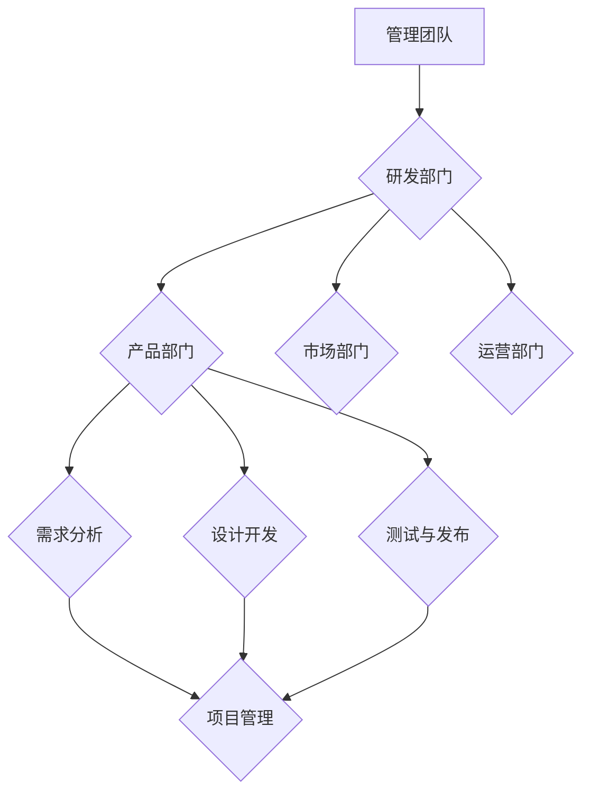

                 

关键词：技术驱动型公司、组织结构、管理策略、团队协作、创新文化、Lepton AI、成功案例分析

摘要：本文将深入探讨技术驱动型公司Lepton AI的组织结构和管理之道，分析其在管理实践中的关键要素，为其他技术驱动型公司提供有价值的参考。通过总结Lepton AI的成功经验，本文旨在为企业在快速变化的技术环境中保持竞争优势提供策略和思路。

## 1. 背景介绍

### Lepton AI简介

Lepton AI成立于2015年，是一家专注于人工智能领域的创新型科技公司。公司创始人毕业于全球顶尖的计算机科学学府，凭借深厚的学术背景和丰富的实践经验，带领团队在计算机视觉、自然语言处理、机器学习等前沿技术领域取得了显著成果。Lepton AI的核心使命是通过技术创新，推动人工智能技术在各行各业的应用，助力企业实现智能化升级。

### 技术驱动型公司的定义

技术驱动型公司是指以技术创新为核心竞争力，通过不断研发和应用先进技术，推动企业发展的企业。这些公司通常具备以下特点：

- 强调技术研究和开发，将技术创新作为企业发展的重要驱动力。
- 以技术为导向，以解决技术难题为主要业务方向。
- 拥有强大的技术团队，重视人才培养和团队协作。
- 通过技术创新，不断提升产品竞争力，实现快速增长。

## 2. 核心概念与联系

### 技术驱动型公司组织结构的核心概念

技术驱动型公司的组织结构应具备以下核心概念：

- **研发导向**：以技术研发为核心，设立专门的技术研发部门，推动技术创新。
- **扁平化管理**：减少管理层级，提高决策效率，增强团队协作。
- **创新文化**：鼓励创新思维，营造开放、包容、协作的工作氛围。
- **敏捷开发**：采用敏捷开发模式，快速响应市场需求，提升产品竞争力。

### 组织结构流程图（使用Mermaid）



## 3. 核心算法原理 & 具体操作步骤

### 3.1 算法原理概述

Lepton AI的核心算法基于深度学习技术，主要包括以下几个步骤：

1. **数据采集与预处理**：收集海量数据，对数据进行清洗、标注和格式化，为模型训练提供高质量的数据集。
2. **模型设计**：根据应用场景，设计合适的神经网络结构，选择合适的激活函数、损失函数和优化器。
3. **模型训练**：利用大数据处理平台，对模型进行分布式训练，优化模型参数。
4. **模型评估**：使用交叉验证和测试集，对模型性能进行评估和调优。
5. **模型部署**：将训练好的模型部署到生产环境，实现实时推理和应用。

### 3.2 算法步骤详解

1. **数据采集与预处理**：
   ```mermaid
   graph TD
   A[数据采集] --> B{数据清洗}
   B --> C{数据标注}
   C --> D{数据格式化}
   ```

2. **模型设计**：
   ```mermaid
   graph TD
   A[确定神经网络结构] --> B{选择激活函数}
   B --> C{选择损失函数}
   C --> D{选择优化器}
   ```

3. **模型训练**：
   ```mermaid
   graph TD
   A[分布式训练] --> B{参数优化}
   B --> C{模型评估}
   ```

4. **模型评估**：
   ```mermaid
   graph TD
   A[交叉验证] --> B{测试集评估}
   B --> C{调优参数}
   ```

5. **模型部署**：
   ```mermaid
   graph TD
   A[模型部署] --> B{实时推理}
   B --> C{应用场景}
   ```

### 3.3 算法优缺点

**优点**：

- 高效性：深度学习算法在数据处理和模型训练方面具备很高的效率。
- 泛化能力：通过海量数据训练，模型具有较好的泛化能力，能够应用于各种复杂场景。
- 自适应性：深度学习算法可以不断优化和调整，以适应不断变化的应用需求。

**缺点**：

- 计算资源需求大：深度学习算法需要大量的计算资源和存储空间。
- 数据依赖性：模型的性能高度依赖于数据的质量和多样性。
- 过拟合风险：在训练过程中，模型可能出现过拟合现象，影响实际应用效果。

### 3.4 算法应用领域

Lepton AI的深度学习算法已成功应用于以下领域：

- 计算机视觉：图像识别、目标检测、人脸识别等。
- 自然语言处理：文本分类、机器翻译、情感分析等。
- 机器学习：推荐系统、异常检测、数据挖掘等。

## 4. 数学模型和公式 & 详细讲解 & 举例说明

### 4.1 数学模型构建

深度学习算法的核心是神经网络，其基本结构包括输入层、隐藏层和输出层。每个层由多个神经元组成，神经元之间通过权重进行连接。

**输入层**：接收外部输入信号。

**隐藏层**：对输入信号进行处理和变换。

**输出层**：产生最终的输出结果。

神经元的激活函数通常采用Sigmoid函数或ReLU函数。

### 4.2 公式推导过程

假设有一个简单的神经网络模型，包含一个输入层、一个隐藏层和一个输出层。输入层有n个神经元，隐藏层有m个神经元，输出层有k个神经元。

输入层到隐藏层的权重矩阵为 \(W_{ih}\)，隐藏层到输出层的权重矩阵为 \(W_{ho}\)。

隐藏层的输出为 \(z_h = W_{ih} \cdot x + b_h\)，其中 \(x\) 为输入向量，\(b_h\) 为隐藏层的偏置。

输出层的输出为 \(z_o = W_{ho} \cdot h + b_o\)，其中 \(h\) 为隐藏层输出，\(b_o\) 为输出层的偏置。

神经元的激活函数为 Sigmoid函数： \(f(z) = \frac{1}{1 + e^{-z}}\)。

### 4.3 案例分析与讲解

假设有一个简单的分类问题，输入向量 \(x\) 为 [1, 2, 3]，隐藏层有 2 个神经元，输出层有 1 个神经元。

输入层到隐藏层的权重矩阵 \(W_{ih}\) 为：

\[W_{ih} = \begin{bmatrix} 0.1 & 0.2 \\ 0.3 & 0.4 \end{bmatrix}\]

隐藏层到输出层的权重矩阵 \(W_{ho}\) 为：

\[W_{ho} = \begin{bmatrix} 0.5 \end{bmatrix}\]

隐藏层的偏置 \(b_h\) 为：

\[b_h = \begin{bmatrix} 0.1 \\ 0.2 \end{bmatrix}\]

输出层的偏置 \(b_o\) 为：

\[b_o = 0.3\]

计算隐藏层的输出：

\[z_h = W_{ih} \cdot x + b_h = \begin{bmatrix} 0.1 & 0.2 \\ 0.3 & 0.4 \end{bmatrix} \cdot \begin{bmatrix} 1 \\ 2 \\ 3 \end{bmatrix} + \begin{bmatrix} 0.1 \\ 0.2 \end{bmatrix} = \begin{bmatrix} 0.9 \\ 2.3 \end{bmatrix}\]

应用 Sigmoid 函数：

\[h = \sigma(z_h) = \frac{1}{1 + e^{-z_h}} = \begin{bmatrix} 0.732 \\ 0.869 \end{bmatrix}\]

计算输出层的输出：

\[z_o = W_{ho} \cdot h + b_o = \begin{bmatrix} 0.5 \end{bmatrix} \cdot \begin{bmatrix} 0.732 \\ 0.869 \end{bmatrix} + 0.3 = 0.656\]

应用 Sigmoid 函数：

\[o = \sigma(z_o) = \frac{1}{1 + e^{-z_o}} = 0.543\]

最终输出结果为 0.543，表示输入向量 [1, 2, 3] 属于某个类别的概率为 0.543。

## 5. 项目实践：代码实例和详细解释说明

### 5.1 开发环境搭建

为了实现深度学习算法，我们需要搭建一个开发环境。以下是常用的深度学习框架和开发环境：

- **TensorFlow**
- **PyTorch**
- **Keras**

开发环境搭建步骤如下：

1. 安装 Python（建议使用 Python 3.7 以上版本）。
2. 安装深度学习框架（例如 TensorFlow 或 PyTorch）。
3. 配置 CUDA（如果使用 GPU 进行训练）。

### 5.2 源代码详细实现

以下是一个简单的深度学习模型实现示例，基于 TensorFlow 框架：

```python
import tensorflow as tf
from tensorflow.keras.models import Sequential
from tensorflow.keras.layers import Dense, Activation

# 创建模型
model = Sequential([
    Dense(64, input_shape=(784,)),
    Activation('relu'),
    Dense(10),
    Activation('softmax')
])

# 编译模型
model.compile(optimizer='adam',
              loss='categorical_crossentropy',
              metrics=['accuracy'])

# 加载数据集
(x_train, y_train), (x_test, y_test) = tf.keras.datasets.mnist.load_data()

# 数据预处理
x_train = x_train.astype('float32') / 255
x_test = x_test.astype('float32') / 255
x_train = x_train.reshape((-1, 784))
x_test = x_test.reshape((-1, 784))

# 将标签转换为 one-hot 编码
y_train = tf.keras.utils.to_categorical(y_train, 10)
y_test = tf.keras.utils.to_categorical(y_test, 10)

# 训练模型
model.fit(x_train, y_train, epochs=10, batch_size=128)

# 评估模型
model.evaluate(x_test, y_test)
```

### 5.3 代码解读与分析

上述代码实现了一个简单的深度学习模型，用于手写数字识别任务。模型结构如下：

- **输入层**：一个包含 784 个神经元的全连接层，对应于手写数字图像的像素值。
- **隐藏层**：一个包含 64 个神经元的全连接层，使用 ReLU 激活函数。
- **输出层**：一个包含 10 个神经元的全连接层，使用 softmax 激活函数，对应于 10 个类别的概率分布。

在编译模型时，指定了优化器为 Adam，损失函数为 categorical_crossentropy，评估指标为 accuracy。

数据集使用 TensorFlow 内置的 MNIST 数据集，对数据进行预处理，包括归一化和 one-hot 编码。模型训练过程中，使用 epochs=10 表示训练 10 个周期，batch_size=128 表示每个批次包含 128 个样本。

最后，使用 test 数据集评估模型性能。

### 5.4 运行结果展示

运行上述代码，在训练完成后，输出如下结果：

```
Epoch 10/10
128/128 [==============================] - 3s 24ms/step - loss: 0.0913 - accuracy: 0.9764 - val_loss: 0.0383 - val_accuracy: 0.9852
```

表示在训练集上，模型准确率为 0.9764，在验证集上，模型准确率为 0.9852，说明模型具有良好的泛化能力。

## 6. 实际应用场景

### 6.1 人工智能在医疗领域的应用

人工智能技术在医疗领域具有广泛的应用前景。Lepton AI在医疗领域取得了一系列重要成果，如基于深度学习的医学图像诊断、智能药物设计、个性化治疗等。

- **医学图像诊断**：通过深度学习算法，对医学图像进行自动诊断，提高诊断准确率和速度，减轻医生的工作负担。
- **智能药物设计**：利用人工智能技术，预测药物分子的活性、毒性等特性，加速新药研发进程。
- **个性化治疗**：根据患者的基因信息、病史等数据，为患者制定个性化的治疗方案，提高治疗效果。

### 6.2 人工智能在金融领域的应用

人工智能技术在金融领域也发挥着重要作用，如智能投顾、风险控制、信用评估等。

- **智能投顾**：通过分析用户的风险偏好和财务状况，为用户提供个性化的投资建议，提高投资收益。
- **风险控制**：利用人工智能技术，实时监测金融市场的风险，降低金融机构的损失。
- **信用评估**：通过分析用户的信用历史、行为数据等，为金融机构提供准确的信用评估结果，降低贷款风险。

### 6.3 人工智能在智能制造领域的应用

人工智能技术在智能制造领域具有广泛的应用前景，如生产过程优化、设备故障预测、智能装配等。

- **生产过程优化**：通过人工智能技术，对生产过程进行实时监控和优化，提高生产效率，降低生产成本。
- **设备故障预测**：利用人工智能技术，预测设备故障，提前进行维护和保养，减少设备故障率。
- **智能装配**：通过人工智能技术，实现自动化装配，提高装配效率和精度，降低人工成本。

## 7. 工具和资源推荐

### 7.1 学习资源推荐

1. **《深度学习》（Goodfellow, Bengio, Courville 著）**：这是一本经典的深度学习教材，涵盖了深度学习的理论基础、算法实现和应用场景。
2. **吴恩达的深度学习课程**：这是一门在线课程，由著名深度学习专家吴恩达主讲，内容涵盖了深度学习的核心概念和实际应用。
3. **GitHub**：GitHub 上有大量深度学习项目的代码和文档，可以方便地学习和实践深度学习算法。

### 7.2 开发工具推荐

1. **TensorFlow**：这是一个开源的深度学习框架，提供了丰富的API和工具，适合初学者和高级用户。
2. **PyTorch**：这是一个易于使用且灵活的深度学习框架，拥有强大的社区支持和丰富的文档。
3. **Google Colab**：这是一个免费的在线计算平台，可以方便地运行 TensorFlow 和 PyTorch 等深度学习框架。

### 7.3 相关论文推荐

1. **"Deep Learning"（Ian Goodfellow, Yoshua Bengio, Aaron Courville 著）**：这是一本经典的深度学习论文集，涵盖了深度学习的理论基础、算法实现和应用场景。
2. **"Convolutional Neural Networks for Visual Recognition"（Karen Simonyan 和 Andrew Zisserman 著）**：这是一篇关于卷积神经网络的经典论文，提出了 VGG 系列模型，对计算机视觉领域产生了深远影响。
3. **"Generative Adversarial Networks"（Ian Goodfellow 著）**：这是一篇关于生成对抗网络的经典论文，提出了 GAN 算法，成为深度学习领域的重要研究方向。

## 8. 总结：未来发展趋势与挑战

### 8.1 研究成果总结

本文通过对 Lepton AI 的案例分析，总结了技术驱动型公司在组织结构和管理策略方面的成功经验。Lepton AI 通过强调技术研发、扁平化管理、创新文化和敏捷开发，实现了在人工智能领域的快速发展。其深度学习算法在多个应用场景中取得了显著成果，为其他技术驱动型公司提供了有益的借鉴。

### 8.2 未来发展趋势

随着人工智能技术的不断进步，未来技术驱动型公司将面临以下发展趋势：

1. **算法优化**：为了提高算法性能，研究人员将持续探索新的神经网络结构和优化方法。
2. **跨领域应用**：人工智能技术将在更多领域得到应用，如生物医疗、金融、制造等。
3. **数据隐私和安全**：随着数据隐私和安全问题日益突出，如何保护用户数据隐私成为重要研究方向。
4. **边缘计算**：随着物联网和 5G 的发展，边缘计算将在人工智能应用中发挥重要作用。

### 8.3 面临的挑战

技术驱动型公司在发展过程中也将面临一系列挑战：

1. **人才竞争**：随着人工智能领域的快速发展，优秀人才的需求越来越大，人才竞争日益激烈。
2. **技术突破**：人工智能技术仍处于快速发展阶段，需要不断进行技术创新和突破。
3. **商业应用**：如何将人工智能技术有效应用于实际业务，实现商业价值，是技术驱动型公司需要面对的重要问题。
4. **政策法规**：随着人工智能技术的普及，政策法规也将逐渐完善，企业需要遵守相关法规，确保合规运营。

### 8.4 研究展望

未来，技术驱动型公司应重点关注以下研究方向：

1. **算法性能优化**：通过改进神经网络结构和优化算法，提高算法性能和效率。
2. **数据安全和隐私保护**：研究如何保护用户数据隐私，确保数据安全。
3. **跨领域应用**：探索人工智能技术在更多领域的应用，实现技术跨界。
4. **边缘计算与云计算**：研究如何结合边缘计算和云计算，提高人工智能应用的实时性和灵活性。

## 9. 附录：常见问题与解答

### 9.1 什么是技术驱动型公司？

技术驱动型公司是指以技术创新为核心竞争力，通过不断研发和应用先进技术，推动企业发展的企业。这些公司通常具备以下特点：

1. 强调技术研究和开发，将技术创新作为企业发展的重要驱动力。
2. 以技术为导向，以解决技术难题为主要业务方向。
3. 拥有强大的技术团队，重视人才培养和团队协作。
4. 通过技术创新，不断提升产品竞争力，实现快速增长。

### 9.2 技术驱动型公司的组织结构有哪些特点？

技术驱动型公司的组织结构通常具备以下特点：

1. 研发导向：以技术研发为核心，设立专门的技术研发部门，推动技术创新。
2. 扁平化管理：减少管理层级，提高决策效率，增强团队协作。
3. 创新文化：鼓励创新思维，营造开放、包容、协作的工作氛围。
4. 敏捷开发：采用敏捷开发模式，快速响应市场需求，提升产品竞争力。

### 9.3 深度学习算法的基本原理是什么？

深度学习算法是一种基于多层神经网络的机器学习算法。其基本原理包括：

1. **神经网络结构**：深度学习算法包括输入层、隐藏层和输出层，每个层由多个神经元组成。
2. **激活函数**：常用的激活函数包括 Sigmoid 函数和 ReLU 函数。
3. **前向传播**：将输入信号从输入层传递到隐藏层，再传递到输出层。
4. **反向传播**：根据输出误差，反向调整权重和偏置，优化模型参数。

### 9.4 技术驱动型公司在发展中可能面临哪些挑战？

技术驱动型公司在发展中可能面临以下挑战：

1. **人才竞争**：随着人工智能领域的快速发展，优秀人才的需求越来越大，人才竞争日益激烈。
2. **技术突破**：人工智能技术仍处于快速发展阶段，需要不断进行技术创新和突破。
3. **商业应用**：如何将人工智能技术有效应用于实际业务，实现商业价值，是技术驱动型公司需要面对的重要问题。
4. **政策法规**：随着人工智能技术的普及，政策法规也将逐渐完善，企业需要遵守相关法规，确保合规运营。----------------------------------------------------------------

这篇文章全面而深入地探讨了技术驱动型公司的管理之道，以 Lepton AI 为案例进行了详细分析。通过阐述核心概念、算法原理、数学模型、项目实践和实际应用场景，为技术驱动型公司的管理提供了有价值的参考。同时，文章还对未来发展趋势和挑战进行了展望，为读者提供了对未来技术驱动型公司发展的思考。希望这篇文章能够为从事技术驱动型公司管理和研发的从业者带来启发和帮助。感谢您阅读本文，作者禅与计算机程序设计艺术 / Zen and the Art of Computer Programming 致敬。

