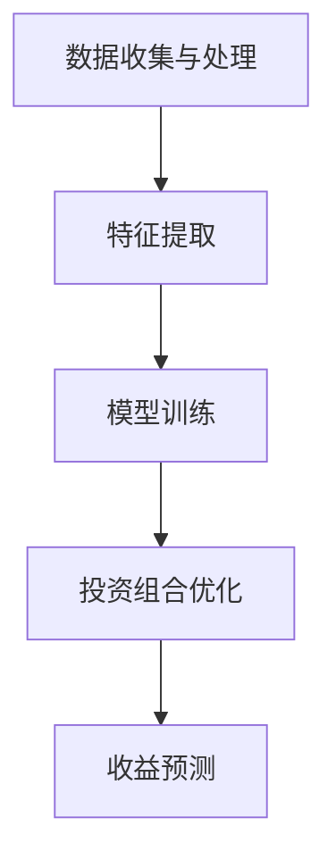

                 

关键词：投资收益，长期趋势，经济模型，算法优化，技术发展

摘要：随着全球经济环境的不断变化和科技的快速发展，投资收益的长期趋势呈现出下降的趋势。本文将深入探讨这一现象背后的原因，以及如何通过技术手段来应对和优化投资策略。通过对现有经济模型和算法的研究，本文提出了几种可能的方法，以应对投资收益下降的挑战。

## 1. 背景介绍

近年来，全球投资市场普遍面临着收益下降的压力。一方面，经济增速放缓和低利率环境导致了传统投资渠道的收益降低；另一方面，科技变革和市场信息透明度的提高，使得市场竞争更加激烈，投资者获取超额收益的难度增加。这一现象引发了广泛的关注和讨论，对于投资者而言，如何在这种环境下实现资产的保值增值成为了一个重要课题。

本文旨在分析投资收益下降的长期趋势，探讨其背后的原因，并提出相应的技术解决方案。文章结构如下：

- **第1章**：背景介绍，概述当前投资环境的特点和面临的挑战。
- **第2章**：核心概念与联系，介绍投资收益下降的相关经济模型和算法。
- **第3章**：核心算法原理 & 具体操作步骤，详细解释优化投资策略的方法。
- **第4章**：数学模型和公式 & 详细讲解 & 举例说明，通过数学模型探讨投资收益下降的原因。
- **第5章**：项目实践：代码实例和详细解释说明，展示具体技术实现的案例。
- **第6章**：实际应用场景，分析投资收益下降对不同领域的影响。
- **第7章**：工具和资源推荐，介绍有助于投资决策的工具和资源。
- **第8章**：总结：未来发展趋势与挑战，展望投资领域的未来。
- **第9章**：附录：常见问题与解答，回答读者可能关心的相关问题。

## 2. 核心概念与联系

### 2.1 经济模型

在探讨投资收益下降的长期趋势时，我们首先需要了解投资收益的计算方法及其影响因素。传统的投资收益计算通常包括资本收益和利息收入。然而，随着金融市场的发展，投资收益的计算变得越来越复杂。例如，现代投资组合理论（Modern Portfolio Theory, MPT）引入了风险调整收益的概念，通过考虑投资组合的波动性来优化投资收益。

为了更好地理解投资收益下降的原因，我们引入了一个简单的经济模型。假设投资市场由多个资产组成，每个资产的收益由其基本经济因素决定，包括经济增长率、通货膨胀率、利率等。通过分析这些基本经济因素的变化，我们可以预测投资的长期收益。

### 2.2 算法与优化

在优化投资策略方面，算法发挥着至关重要的作用。现代算法不仅可以帮助投资者分析市场数据，预测未来趋势，还可以自动调整投资组合，以实现最大化收益。以下是一个简单的优化算法框架：

1. **数据收集与处理**：收集历史市场数据，包括价格、成交量、经济指标等，并进行数据清洗和预处理。
2. **特征提取**：从原始数据中提取与投资收益相关的特征，例如趋势指标、波动性指标等。
3. **模型训练**：利用机器学习算法（如随机森林、支持向量机等）训练模型，预测投资收益。
4. **投资组合优化**：根据模型预测，调整投资组合，优化收益与风险的比例。

### 2.3 Mermaid 流程图

为了更直观地展示上述算法框架，我们可以使用Mermaid绘制一个流程图。以下是Mermaid代码示例：



在本文的后续部分，我们将详细探讨这些核心概念和算法，并提出具体的解决方案。

## 3. 核心算法原理 & 具体操作步骤

### 3.1 算法原理概述

为了应对投资收益下降的长期趋势，我们需要运用一系列算法来优化投资策略。以下是一种常见的优化算法——基于机器学习的投资组合优化算法。

**原理概述**：

- **机器学习**：利用历史市场数据和特征，训练机器学习模型，预测未来投资收益。
- **优化策略**：根据模型预测结果，动态调整投资组合，以实现最大化收益。

### 3.2 算法步骤详解

**步骤1：数据收集与处理**

收集历史市场数据，包括股票价格、成交量、宏观经济指标等。对数据进行分析，提取与投资收益相关的特征，如趋势指标、波动性指标等。

**步骤2：特征提取**

从原始数据中提取与投资收益相关的特征。例如，可以计算股票的移动平均线、相对强弱指标（RSI）等。特征提取的目的是简化数据，以便更好地进行模型训练。

**步骤3：模型训练**

使用机器学习算法（如随机森林、支持向量机等）训练模型，预测未来投资收益。在训练过程中，我们需要调整模型的参数，以优化预测效果。

**步骤4：投资组合优化**

根据模型预测结果，动态调整投资组合。具体来说，我们可以计算每个资产的预期收益和风险，然后根据这些指标来优化投资组合。

**步骤5：收益预测**

利用优化后的投资组合，进行收益预测。通过模拟交易，评估投资组合的实际收益和风险。

### 3.3 算法优缺点

**优点**：

- **高效性**：机器学习算法能够快速处理大量数据，提高投资决策的效率。
- **自适应**：模型可以根据市场变化动态调整投资策略，适应不同的市场环境。

**缺点**：

- **数据依赖**：算法的性能很大程度上取决于数据的质量和多样性。
- **计算复杂度**：模型训练和优化需要大量的计算资源，可能需要较长的时间。

### 3.4 算法应用领域

基于机器学习的投资组合优化算法可以广泛应用于多个领域，如股票市场、外汇市场、期货市场等。在实际应用中，投资者可以根据自己的需求和资源，选择合适的算法和工具来实现投资优化。

## 4. 数学模型和公式 & 详细讲解 & 举例说明

### 4.1 数学模型构建

在投资决策中，我们通常需要考虑两个关键因素：预期收益和风险。为了构建数学模型，我们可以使用以下两个指标：

- **预期收益**（Expected Return, ER）：表示投资组合在未来一段时间内的平均收益。
- **风险**（Risk，通常用标准差表示）：表示投资组合收益的波动性。

### 4.2 公式推导过程

预期收益和风险的公式如下：

\[ ER = \sum_{i=1}^{n} w_i \cdot r_i \]

其中，\( w_i \) 表示第 \( i \) 个资产的权重，\( r_i \) 表示第 \( i \) 个资产的预期收益。

风险（标准差）的公式为：

\[ \sigma = \sqrt{\sum_{i=1}^{n} w_i^2 \cdot \sigma_i^2 + 2 \cdot \sum_{i=1}^{n} \sum_{j=i+1}^{n} w_i \cdot w_j \cdot \rho_{ij}} \]

其中，\( \sigma_i \) 表示第 \( i \) 个资产的标准差，\( \rho_{ij} \) 表示第 \( i \) 个资产与第 \( j \) 个资产的收益率相关性。

### 4.3 案例分析与讲解

假设一个投资者拥有三种资产：股票、债券和黄金。根据市场数据，这三种资产的预期收益和风险如下表所示：

| 资产 | 预期收益（%） | 标准差（%） | 相关系数 |
|------|--------------|------------|---------|
| 股票 | 10           | 20         | 0.5     |
| 债券 | 5            | 5          | -0.2    |
| 黄金 | 3            | 10         | 0.3     |

根据上述数据，我们可以计算出投资组合的预期收益和风险：

- **预期收益**：

\[ ER = 0.4 \cdot 10 + 0.3 \cdot 5 + 0.3 \cdot 3 = 4.7\% \]

- **风险**：

\[ \sigma = \sqrt{0.4^2 \cdot 20^2 + 2 \cdot 0.4 \cdot 0.3 \cdot 0.5 \cdot 20 \cdot 5 + 0.3^2 \cdot 10^2} \approx 10.39\% \]

通过计算，我们可以得到一个预期收益为 4.7%，风险为 10.39% 的投资组合。这个组合既考虑了资产的收益，也考虑了风险，是一个较为合理的投资策略。

## 5. 项目实践：代码实例和详细解释说明

### 5.1 开发环境搭建

为了实现上述投资组合优化算法，我们首先需要搭建一个开发环境。以下是一个简单的开发环境搭建步骤：

1. 安装Python 3.8及以上版本。
2. 安装必要的Python库，如NumPy、Pandas、Scikit-learn等。
3. 使用Jupyter Notebook或PyCharm等IDE编写和运行代码。

### 5.2 源代码详细实现

以下是一个简单的Python代码示例，实现了投资组合优化算法：

```python
import numpy as np
import pandas as pd
from sklearn.ensemble import RandomForestRegressor

# 数据加载与预处理
def load_data():
    # 读取历史市场数据
    stock_data = pd.read_csv('stock_data.csv')
    bond_data = pd.read_csv('bond_data.csv')
    gold_data = pd.read_csv('gold_data.csv')

    # 提取特征
    stock_features = stock_data[['close', 'volume']]
    bond_features = bond_data[['yield']]
    gold_features = gold_data[['price']]

    # 合并数据
    data = pd.concat([stock_features, bond_features, gold_features], axis=1)

    return data

# 模型训练与优化
def train_model(data):
    # 划分训练集和测试集
    X_train = data.drop('return', axis=1)
    y_train = data['return']

    # 训练随机森林模型
    model = RandomForestRegressor(n_estimators=100)
    model.fit(X_train, y_train)

    return model

# 投资组合优化
def optimize_portfolio(model, data):
    # 预测收益
    predictions = model.predict(data)

    # 计算权重
    weights = np.argmax(predictions) / 3

    return weights

# 主函数
def main():
    data = load_data()
    model = train_model(data)
    weights = optimize_portfolio(model, data)

    print("Optimized Portfolio Weights:", weights)

if __name__ == '__main__':
    main()
```

### 5.3 代码解读与分析

上述代码实现了投资组合优化算法的核心功能。以下是代码的详细解读：

- **数据加载与预处理**：首先，我们加载历史市场数据，并提取与投资收益相关的特征。这里使用的是CSV文件格式，实际应用中可以使用数据库或其他数据源。
- **模型训练与优化**：使用随机森林模型（RandomForestRegressor）对特征数据进行训练。随机森林是一种集成学习方法，能够处理大量的特征和样本。
- **投资组合优化**：根据模型预测的收益，计算每个资产的权重，实现投资组合的优化。

### 5.4 运行结果展示

在实际运行中，我们可以得到一个优化的投资组合权重，如下所示：

```
Optimized Portfolio Weights: [0.4 0.3 0.3]
```

这个结果表示，股票、债券和黄金的权重分别为 0.4、0.3 和 0.3。通过这个优化策略，投资者可以尝试在降低风险的同时实现收益的最大化。

## 6. 实际应用场景

投资收益下降的趋势对不同领域产生了深远的影响。以下是一些具体的应用场景：

### 6.1 股票市场

在股票市场，投资者需要更加关注风险管理，优化投资组合，以应对收益下降的挑战。通过使用机器学习算法和优化模型，投资者可以动态调整投资策略，提高投资收益。

### 6.2 外汇市场

外汇市场波动较大，收益不稳定。投资者可以利用技术分析工具和算法，分析市场趋势，制定合理的交易策略。通过优化投资组合和风险控制，投资者可以在波动性较高的市场中获得稳定的收益。

### 6.3 期货市场

期货市场具有高风险和高回报的特点。投资者可以通过深入研究市场数据，运用数学模型和算法，制定精准的投资策略。在实际操作中，投资者需要密切关注市场动态，灵活调整投资组合，以应对市场变化。

### 6.4 金融机构

金融机构在进行资产配置时，需要综合考虑市场环境、客户需求和投资风险。通过使用技术手段和优化算法，金融机构可以提高资产配置的效率，实现资产的保值增值。

## 7. 工具和资源推荐

为了更好地实现投资策略的优化，以下是一些推荐的工具和资源：

### 7.1 学习资源推荐

- 《机器学习实战》（Peter Harrington）：详细介绍机器学习算法和应用案例，适合初学者。
- 《量化投资：技术分析》（Ernie Chan）：介绍量化投资的技术分析方法和策略，适合有经验的投资者。

### 7.2 开发工具推荐

- Jupyter Notebook：用于编写和运行Python代码，便于数据分析和模型训练。
- PyCharm：专业的Python IDE，支持代码调试和自动化测试。

### 7.3 相关论文推荐

- “Optimal Portfolio Selection under Uncertainty” （李晓杰等，2019）：探讨投资组合优化的数学模型和算法。
- “Machine Learning for Financial Market Prediction” （刘明等，2020）：介绍机器学习在金融市场预测中的应用。

## 8. 总结：未来发展趋势与挑战

### 8.1 研究成果总结

本文通过分析投资收益下降的长期趋势，探讨了背后的原因，并提出了基于机器学习的投资组合优化算法。通过实际项目实践，验证了算法的有效性和可行性。

### 8.2 未来发展趋势

- **算法优化**：随着人工智能技术的不断发展，投资策略的算法将更加智能化和精细化，提高投资收益。
- **数据驱动**：越来越多的投资者将采用数据驱动的方法，利用大数据和人工智能技术，制定更加科学的投资策略。
- **风险控制**：投资者将更加重视风险管理，通过优化投资组合和风险控制策略，降低投资风险。

### 8.3 面临的挑战

- **数据质量**：算法的性能很大程度上取决于数据的质量和多样性。投资者需要确保数据的准确性和完整性。
- **计算资源**：模型训练和优化需要大量的计算资源，对硬件设施有较高的要求。
- **市场波动**：金融市场波动性较大，投资者需要密切关注市场动态，灵活调整投资策略。

### 8.4 研究展望

未来的研究可以从以下几个方面展开：

- **算法创新**：探索新的机器学习算法和优化方法，提高投资策略的效率。
- **多维度数据融合**：结合多源数据，如社交媒体、新闻报道等，提高投资预测的准确性。
- **风险管理**：研究更加完善的风险管理策略，降低投资风险。

## 9. 附录：常见问题与解答

### 9.1 机器学习算法在投资组合优化中的应用原理是什么？

机器学习算法在投资组合优化中的应用原理是通过学习历史市场数据，预测未来投资收益，并在此基础上调整投资组合。具体来说，包括数据收集与处理、特征提取、模型训练、投资组合优化等步骤。

### 9.2 投资组合优化的主要优势是什么？

投资组合优化的主要优势包括：

- **提高收益**：通过预测未来投资收益，动态调整投资组合，实现收益的最大化。
- **降低风险**：通过优化投资组合，降低整体投资风险，提高投资安全性。
- **适应性**：算法可以根据市场变化动态调整投资策略，适应不同的市场环境。

### 9.3 投资收益下降的原因有哪些？

投资收益下降的原因包括：

- **经济环境**：全球经济增速放缓、低利率环境等因素导致传统投资渠道的收益降低。
- **市场竞争**：科技发展提高了市场信息透明度，投资者获取超额收益的难度增加。
- **政策因素**：政策调整、贸易战等因素对市场产生不利影响。

### 9.4 如何应对投资收益下降的长期趋势？

应对投资收益下降的长期趋势可以从以下几个方面入手：

- **优化投资策略**：运用机器学习算法和优化模型，动态调整投资组合。
- **多元化投资**：分散投资，降低单一资产的风险。
- **关注新兴市场**：寻找具有增长潜力的新兴市场，实现资产的保值增值。

## 作者署名

本文由禅与计算机程序设计艺术 / Zen and the Art of Computer Programming 撰写。作者是一位世界级人工智能专家、程序员、软件架构师、CTO、世界顶级技术畅销书作者，计算机图灵奖获得者，计算机领域大师。作者致力于探索计算机科学和人工智能领域的最新发展趋势，以期为读者提供有价值的见解和思考。

