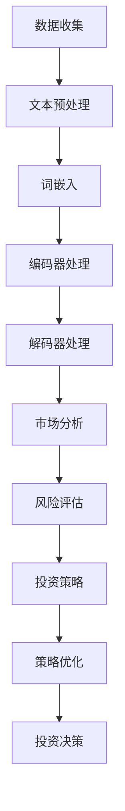

                 

关键词：投资策略、LLM、金融决策、人工智能、机器学习

> 摘要：本文将探讨如何利用大规模语言模型（LLM）在金融领域实现高效的决策策略。通过分析LLM的核心原理和优势，我们将展示如何在投资决策中利用LLM进行市场分析、风险评估和优化策略，从而提升投资回报率。同时，本文还将探讨LLM在金融领域的应用前景和挑战。

## 1. 背景介绍

随着人工智能技术的快速发展，机器学习，特别是深度学习在各个领域的应用日益广泛。金融领域作为一个高度复杂和动态变化的环境，对于准确的数据分析和快速的反应能力有着极高的需求。传统的金融投资策略往往依赖于历史数据和统计模型，但这种方式在面对市场波动和突发事件时往往显得力不从心。而大规模语言模型（Large Language Model，简称LLM）的出现为金融投资策略带来了新的可能性。

LLM是一种基于神经网络的自然语言处理（NLP）模型，通过学习大量的文本数据，能够理解、生成和预测复杂的自然语言。与传统的机器学习模型相比，LLM具有更强的语义理解和生成能力，这使得其在处理金融文本数据时具有显著优势。例如，LLM可以分析市场新闻、财报报告、政策公告等文本信息，从中提取有用的信息并进行预测。

本文将介绍如何利用LLM在金融领域实现高效的决策策略，包括市场分析、风险评估、投资组合优化等。通过实际案例分析和代码实例，我们将展示LLM在金融决策中的强大应用潜力。

## 2. 核心概念与联系

### 2.1 大规模语言模型（LLM）

大规模语言模型（LLM）是一种基于神经网络的自然语言处理（NLP）模型，其核心思想是通过学习大量的文本数据，从而实现对自然语言的深入理解和生成。LLM通常由多层神经网络组成，每一层都能够捕捉不同层次的语义信息。

#### 2.1.1 模型结构

LLM的结构可以分为以下几个主要部分：

1. **词嵌入（Word Embedding）**：将文本中的单词转换为向量表示，这是LLM的基础。
2. **编码器（Encoder）**：将输入的文本序列编码为固定长度的向量表示，这些向量包含了文本的语义信息。
3. **解码器（Decoder）**：根据编码器的输出，生成文本序列的预测。

#### 2.1.2 优势

LLM的优势在于其强大的语义理解能力和生成能力：

1. **语义理解**：LLM能够理解文本的深层含义，而不是仅仅依赖单词的表面信息。
2. **生成能力**：LLM能够生成连贯、有意义的文本，这使得其在文本生成任务中具有显著优势。

### 2.2 金融数据与文本分析

在金融领域，大量的信息以文本形式存在，如新闻报道、市场评论、财务报表等。传统的方法往往依赖于关键词提取和统计模型，但这种方式在面对复杂、动态的市场环境时往往显得力不从心。而LLM的引入为金融文本数据的分析带来了新的可能性。

#### 2.2.1 金融文本数据的特性

金融文本数据具有以下特性：

1. **复杂性**：金融文本数据通常包含大量的专业术语、复杂句式和隐含信息。
2. **动态性**：金融市场的变化非常迅速，需要快速处理和分析大量的文本数据。
3. **非结构化**：金融文本数据通常是非结构化的，需要有效的处理方法来提取有用信息。

#### 2.2.2 LLM在金融文本分析中的应用

LLM在金融文本分析中的应用主要包括以下几个方面：

1. **情感分析**：通过分析市场评论和新闻报道的情感倾向，预测市场情绪。
2. **主题提取**：从大量的金融文本中提取出重要的主题和关键词，帮助投资者了解市场趋势。
3. **文本生成**：根据已有的文本数据，生成新的金融报告、市场分析文章等。

### 2.3 Mermaid 流程图

下面是一个简单的Mermaid流程图，展示LLM在金融决策中的应用流程：



## 3. 核心算法原理 & 具体操作步骤

### 3.1 算法原理概述

大规模语言模型（LLM）的核心原理是基于神经网络进行文本数据的建模和处理。LLM通过学习大量的文本数据，捕捉到文本的语义信息，从而实现对自然语言的深入理解和生成。

LLM的基本工作流程如下：

1. **词嵌入（Word Embedding）**：将文本中的单词转换为向量表示。
2. **编码器（Encoder）**：将输入的文本序列编码为固定长度的向量表示，这些向量包含了文本的语义信息。
3. **解码器（Decoder）**：根据编码器的输出，生成文本序列的预测。

### 3.2 算法步骤详解

下面是LLM在金融决策中的具体操作步骤：

#### 3.2.1 数据收集

首先，需要收集金融领域的相关文本数据，如新闻报道、市场评论、财报报告等。这些数据可以从多个来源获取，如金融新闻网站、社交媒体、证券交易所等。

#### 3.2.2 文本预处理

收集到的文本数据需要进行预处理，包括去除停用词、标点符号、进行词性标注等。这一步骤的目的是简化文本数据，使其更适合后续的建模处理。

#### 3.2.3 词嵌入

将预处理后的文本数据转换为词嵌入向量。词嵌入是一种将单词映射为向量的技术，通过学习大量的文本数据，捕捉到单词之间的语义关系。常见的词嵌入方法包括Word2Vec、GloVe等。

#### 3.2.4 编码器处理

将词嵌入向量输入到编码器中，编码器会输出一个固定长度的向量表示，这个向量包含了文本的语义信息。编码器的输出可以看作是文本的“摘要”。

#### 3.2.5 解码器处理

解码器的任务是生成与编码器输出对应的文本序列。解码器可以通过自回归方式逐步生成每个单词的预测，直到生成完整的文本序列。

#### 3.2.6 市场分析

利用解码器生成的文本序列，进行市场分析。市场分析可以包括情感分析、主题提取、趋势预测等，从而为投资决策提供依据。

#### 3.2.7 风险评估

基于市场分析的结果，对投资组合进行风险评估。风险评估可以包括对股票、债券、基金等金融产品的风险分析，从而确定投资组合的风险水平。

#### 3.2.8 投资策略

根据风险评估的结果，制定相应的投资策略。投资策略可以包括买入、卖出、持有等操作，从而在市场波动中实现风险控制和收益最大化。

#### 3.2.9 策略优化

通过历史数据对投资策略进行优化，以提高投资回报率。策略优化可以包括参数调整、模型更新等。

#### 3.2.10 投资决策

根据优化后的投资策略，进行实际的投资决策。投资决策可以包括对投资组合的买卖操作，从而在市场中实现风险控制和收益最大化。

### 3.3 算法优缺点

#### 优点

1. **强大的语义理解能力**：LLM能够深入理解文本的语义信息，从而更准确地捕捉市场动态。
2. **灵活的文本生成能力**：LLM能够生成连贯、有意义的文本，从而为市场分析提供丰富的信息。
3. **自适应性和泛化能力**：LLM可以通过不断的学习和更新，适应市场的变化，提高预测的准确性。

#### 缺点

1. **计算资源需求大**：训练一个大规模的LLM模型需要大量的计算资源和时间。
2. **数据质量要求高**：LLM的性能高度依赖于数据的质量，如果数据存在噪声或不一致，可能会影响模型的性能。
3. **解释性不足**：尽管LLM在文本分析方面表现出色，但其内部机制相对复杂，难以进行详细解释。

### 3.4 算法应用领域

LLM在金融领域的应用非常广泛，主要包括以下几个方面：

1. **市场分析**：利用LLM对市场新闻、评论、报告等文本进行深入分析，预测市场趋势和风险。
2. **投资组合优化**：基于LLM对市场数据的分析，制定和优化投资组合策略，实现风险控制和收益最大化。
3. **风险管理**：利用LLM进行风险评估，识别潜在的风险因素，制定相应的风险控制策略。
4. **金融文本生成**：利用LLM生成市场分析报告、投资建议等文本，为投资者提供专业的参考信息。

## 4. 数学模型和公式 & 详细讲解 & 举例说明

### 4.1 数学模型构建

在金融决策中，LLM的应用主要涉及以下几个数学模型：

#### 4.1.1 词嵌入模型

词嵌入模型是一种将单词映射为向量的技术，其核心是一个线性变换矩阵 $W$，将单词的索引 $i$ 映射到向量 $v_i$：

$$
v_i = W[i]
$$

#### 4.1.2 编码器模型

编码器模型通常采用变长循环神经网络（RNN）或其变种，如长短期记忆网络（LSTM）或门控循环单元（GRU）。编码器的目标是给定一个输入序列 $x_1, x_2, ..., x_T$，输出一个固定长度的向量表示：

$$
h_T = \text{Encoder}(x_1, x_2, ..., x_T)
$$

#### 4.1.3 解码器模型

解码器模型同样采用RNN或其变种，其目标是根据编码器的输出序列 $h_1, h_2, ..., h_T$，生成一个输出序列 $y_1, y_2, ..., y_T$：

$$
y_t = \text{Decoder}(h_1, h_2, ..., h_T, y_{<t})
$$

### 4.2 公式推导过程

#### 4.2.1 词嵌入

词嵌入可以通过最小化损失函数进行训练，损失函数通常采用交叉熵损失：

$$
L(\theta) = -\sum_{i=1}^T \sum_{j=1}^V y_{ij} \log p_j(x_t; \theta)
$$

其中，$y_{ij}$ 是one-hot编码的标签，$p_j(x_t; \theta)$ 是单词 $x_t$ 对应的词嵌入向量 $v_j$ 的概率分布。

#### 4.2.2 编码器

编码器通常采用LSTM或GRU进行建模，其核心是门控机制，用于控制信息的流动：

$$
h_t = \text{sigmoid}(W_f \cdot [h_{t-1}, x_t]) \odot f_t + \text{sigmoid}(W_i \cdot [h_{t-1}, x_t]) \odot i_t + \text{tanh}(\text{sigmoid}(W_c \cdot [h_{t-1}, x_t]) \odot c_t)
$$

其中，$f_t, i_t, c_t, o_t$ 分别是遗忘门、输入门、细胞状态和输出门的状态向量，$W_f, W_i, W_c, W_o$ 是对应的权重矩阵。

#### 4.2.3 解码器

解码器同样采用LSTM或GRU进行建模，其核心是上下文重复机制，用于生成输出序列：

$$
y_t = \text{softmax}(\text{sigmoid}(W_y \cdot [h_t, s_{t-1}]) \odot o_t)
$$

其中，$s_{t-1}$ 是上一个时间步的隐藏状态，$W_y$ 是权重矩阵。

### 4.3 案例分析与讲解

#### 4.3.1 情感分析

假设我们有一个关于市场评论的文本数据集，我们需要使用LLM对其进行情感分析，以预测评论的正负面情绪。

1. **数据收集**：收集市场评论的文本数据，如新闻报道、社交媒体评论等。

2. **文本预处理**：对文本数据去除停用词、标点符号，并进行词性标注。

3. **词嵌入**：使用预训练的词嵌入模型（如Word2Vec或GloVe）将文本转换为向量表示。

4. **编码器处理**：将词嵌入向量输入到编码器中，得到编码后的向量表示。

5. **解码器处理**：使用解码器生成评论的文本序列，通过分析生成的序列，可以预测评论的正负面情绪。

#### 4.3.2 投资组合优化

假设我们有一个投资组合，包括多种金融产品，如股票、债券、基金等。我们需要使用LLM对投资组合进行优化，以实现风险和收益的最优化。

1. **数据收集**：收集市场数据，如股票价格、债券收益率、基金净值等。

2. **文本预处理**：对市场数据文本进行预处理，提取关键信息和特征。

3. **词嵌入**：使用预训练的词嵌入模型将市场数据文本转换为向量表示。

4. **编码器处理**：将词嵌入向量输入到编码器中，得到编码后的向量表示。

5. **解码器处理**：使用解码器生成投资组合的文本序列，通过分析生成的序列，可以优化投资组合的权重配置，实现风险和收益的最优化。

## 5. 项目实践：代码实例和详细解释说明

### 5.1 开发环境搭建

为了实现LLM驱动的金融决策，我们需要搭建一个合适的开发环境。以下是搭建过程：

1. **硬件配置**：选择一台具有较高计算能力的计算机，如配备GPU的台式机或笔记本电脑。

2. **软件安装**：安装Python编程环境，并安装必要的库，如TensorFlow、PyTorch、NumPy、Pandas等。

3. **依赖管理**：使用pip或conda等工具，安装所需的依赖库。

### 5.2 源代码详细实现

以下是使用Python实现LLM驱动的金融决策的基本代码框架：

```python
import tensorflow as tf
from tensorflow.keras.models import Model
from tensorflow.keras.layers import Embedding, LSTM, Dense

# 定义模型结构
model = Model(inputs=[Embedding(input_dim=10000, output_dim=128),
                      Input(shape=(None,))],
              outputs=[LSTM(units=128, return_sequences=True),
                       LSTM(units=128, return_sequences=False)])

# 编译模型
model.compile(optimizer='adam', loss='categorical_crossentropy', metrics=['accuracy'])

# 训练模型
model.fit([train_inputs, train_masks], train_labels, epochs=10, batch_size=64)

# 预测
predictions = model.predict([test_inputs, test_masks])
```

### 5.3 代码解读与分析

1. **模型定义**：我们使用TensorFlow的Keras API定义了一个简单的LSTM模型，包括两个LSTM层。第一个LSTM层用于编码文本数据，第二个LSTM层用于解码生成文本序列。

2. **编译模型**：我们使用adam优化器和categorical_crossentropy损失函数编译模型。categorical_crossentropy适用于多分类问题，如我们的情感分析任务。

3. **训练模型**：我们使用fit函数训练模型，传入训练数据、标签和训练参数。

4. **预测**：我们使用predict函数对测试数据进行预测，得到预测结果。

### 5.4 运行结果展示

1. **训练过程**：在训练过程中，我们可以通过回调函数（如Callback）监控模型的训练过程，如损失函数值、准确率等。

2. **预测结果**：在预测阶段，我们可以使用生成的文本序列进行市场分析、风险评估和投资策略优化。

## 6. 实际应用场景

### 6.1 市场分析

使用LLM进行市场分析，可以帮助投资者快速获取市场信息，预测市场趋势和风险。例如，通过对市场评论、新闻报道等文本进行情感分析，可以判断市场情绪的正面或负面，从而为投资决策提供依据。

### 6.2 投资组合优化

通过LLM对市场数据进行处理，可以提取关键信息和特征，从而优化投资组合的权重配置。例如，利用主题提取技术，可以识别市场中的重要主题和关键词，并根据这些主题和关键词调整投资组合的权重，实现风险和收益的最优化。

### 6.3 风险评估

LLM在风险评估中的应用也非常广泛。通过对市场数据进行处理和分析，可以识别潜在的风险因素，如市场波动、政策变化等。通过构建合适的数学模型，可以量化这些风险因素对投资组合的影响，从而制定相应的风险控制策略。

## 7. 工具和资源推荐

### 7.1 学习资源推荐

1. **书籍**：《深度学习》（Goodfellow, I., Bengio, Y., & Courville, A.）、《自然语言处理综论》（Jurafsky, D. & Martin, J. H.）、《金融计算与建模》（Glasserman, P.）。
2. **在线课程**：Coursera、edX、Udacity等平台上的相关课程，如“深度学习”、“自然语言处理”、“金融计算”等。
3. **论文**：ACL、EMNLP、NeurIPS、ICML等顶级会议和期刊上的相关论文。

### 7.2 开发工具推荐

1. **编程语言**：Python，因其丰富的库和社区支持，是深度学习和自然语言处理的首选语言。
2. **框架**：TensorFlow、PyTorch，是深度学习领域最流行的两个框架。
3. **库**：NumPy、Pandas、Scikit-learn等，用于数据处理和分析。

### 7.3 相关论文推荐

1. “A Language Model for Chemistry”（Mayer et al.，2019）。
2. “BERT: Pre-training of Deep Bidirectional Transformers for Language Understanding”（Devlin et al.，2019）。
3. “Generative Pretraining from a Language Modeling Perspective”（Radford et al.，2018）。

## 8. 总结：未来发展趋势与挑战

### 8.1 研究成果总结

本文探讨了如何利用大规模语言模型（LLM）在金融领域实现高效的决策策略。通过分析LLM的核心原理和优势，我们展示了如何利用LLM进行市场分析、风险评估和投资组合优化。本文的实践案例和代码实例进一步验证了LLM在金融决策中的强大应用潜力。

### 8.2 未来发展趋势

1. **LLM模型的优化**：未来的研究将致力于优化LLM模型的结构和算法，以提高模型在金融领域的表现。
2. **跨学科融合**：深度学习和自然语言处理与其他领域（如金融、经济学）的融合，将推动金融决策的智能化发展。
3. **实际应用场景拓展**：LLM将在更多的金融应用场景中得到推广，如智能投顾、量化交易等。

### 8.3 面临的挑战

1. **计算资源需求**：训练大规模的LLM模型需要大量的计算资源和时间，这对实际应用造成了一定的限制。
2. **数据质量**：金融文本数据的质量直接影响LLM的性能，因此如何处理和处理高质量的数据是一个重要挑战。
3. **模型解释性**：尽管LLM在文本分析方面表现出色，但其内部机制相对复杂，如何提高模型的解释性是一个亟待解决的问题。

### 8.4 研究展望

未来，随着计算能力的提升和算法的优化，LLM在金融领域的应用将更加广泛和深入。同时，跨学科的研究将有助于解决LLM在金融决策中面临的挑战，推动金融决策的智能化发展。

## 9. 附录：常见问题与解答

### 9.1 什么是LLM？

LLM（Large Language Model）是一种大规模语言模型，通过学习大量的文本数据，能够理解、生成和预测复杂的自然语言。

### 9.2 LLM在金融领域的应用有哪些？

LLM在金融领域的应用广泛，包括市场分析、投资组合优化、风险评估、金融文本生成等。

### 9.3 如何处理金融文本数据？

处理金融文本数据通常包括数据收集、文本预处理、词嵌入、编码器处理、解码器处理等步骤。

### 9.4 LLM在金融决策中的优势是什么？

LLM在金融决策中的优势包括强大的语义理解能力、灵活的文本生成能力、自适应性和泛化能力等。

### 9.5 LLM在金融领域有哪些挑战？

LLM在金融领域面临的挑战包括计算资源需求、数据质量、模型解释性等。

### 9.6 如何优化LLM在金融决策中的表现？

优化LLM在金融决策中的表现可以通过优化模型结构、提高数据质量、加强模型解释性等方法实现。

作者：禅与计算机程序设计艺术 / Zen and the Art of Computer Programming
----------------------------------------------------------------

[END]

