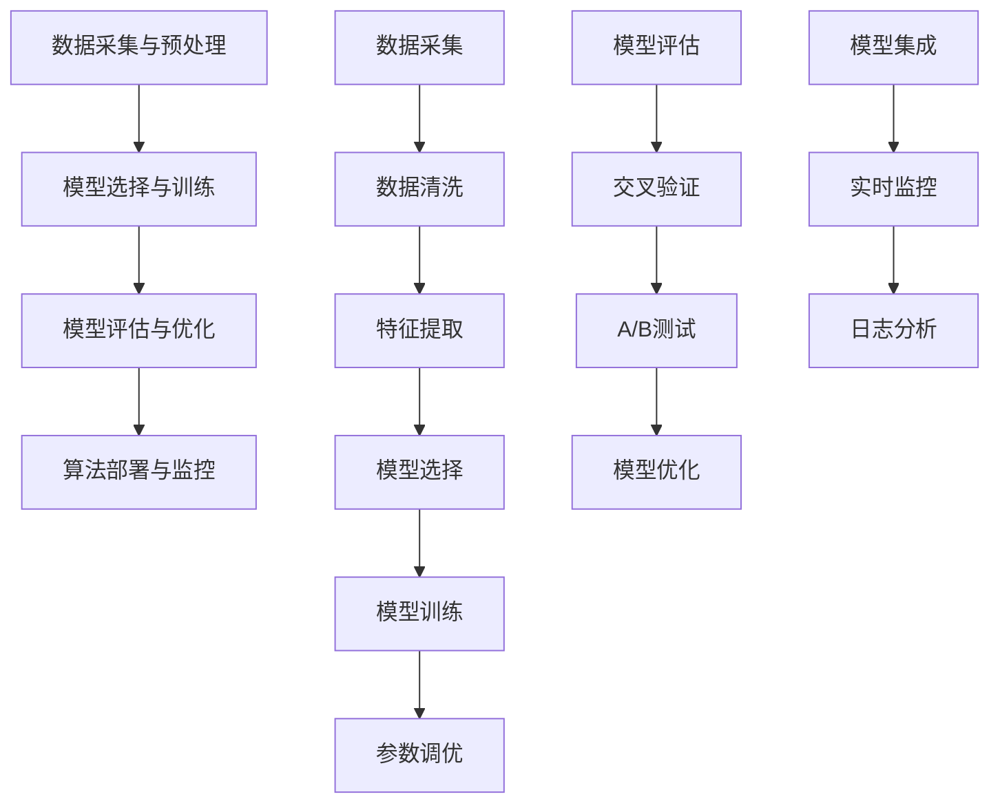

                 

### 背景介绍

拼多多作为中国领先的电商平台之一，其用户增长速度一直备受关注。每年，拼多多都会通过校园招聘吸纳新鲜血液，为公司的持续发展注入新的活力。2024年校招，拼多多再次将目光投向各大高校，期望通过选拔优秀应届毕业生，充实其用户增长团队。本文旨在为即将参加拼多多2024校招用户增长专员岗位面试的同学们提供全面的面试问答攻略，帮助大家更好地应对面试挑战。

用户增长专员在电商平台中扮演着至关重要的角色，他们负责制定和实施用户增长策略，通过各种渠道和手段吸引新用户，提高用户活跃度和粘性，最终实现平台用户的快速增长。在拼多多这样的电商平台中，用户增长专员不仅需要具备扎实的数据分析能力，还需要具备良好的市场洞察力、创新思维和沟通协调能力。

本文将围绕以下几个方面展开：

1. **面试前的准备**：包括了解拼多多的公司背景、业务模式、用户增长策略等。
2. **常见面试问题及解答**：列举和分析拼多多用户增长专员面试中可能出现的问题，提供详细的解答思路。
3. **案例分析**：通过实际案例展示用户增长策略的有效性和实施过程。
4. **项目实践**：提供一份模拟的项目方案，供面试时参考。

希望通过本文的攻略，能够帮助广大应聘者顺利通过拼多多2024校招用户增长专员的面试，开启职业生涯的新篇章。

## 1.1 公司背景

拼多多成立于2015年，是由黄峥创立的中国领先的社交电商平台。凭借其独特的社交电商模式和创新的“团购+拍卖”模式，拼多多迅速在中国市场占据了一席之地，并实现了用户和交易额的快速增长。截至2023年，拼多多已经拥有超过8亿活跃用户，是中国电商市场的重要组成部分。

拼多多的业务模式主要分为两部分：C2M（Consumer-to-Manufacturer，消费端到制造端）和社区团购。C2M模式通过大数据分析和用户画像，直接连接制造端和消费端，降低了中间环节成本，提高了产品质量和性价比。社区团购则通过拼团的方式，实现了用户之间的互动和分享，提高了购物体验和用户粘性。

用户增长是拼多多发展的核心战略之一。拼多多通过持续优化产品体验、拓展新用户群体、提升用户活跃度和留存率，实现了用户规模的快速增长。在用户增长方面，拼多多采取了多种策略，包括：

1. **社交传播**：利用用户的社交网络，通过分享优惠信息、邀请好友等方式，快速扩大用户基础。
2. **营销推广**：通过精准投放广告、举办各类促销活动，吸引潜在用户注册和使用平台。
3. **平台优化**：不断改进用户界面和操作流程，提高用户购物体验，增强用户粘性。
4. **合作伙伴关系**：与各大品牌和制造商建立战略合作，提供优质商品，提升用户满意度。

在用户增长过程中，拼多多不仅关注用户规模的扩大，更注重用户质量和活跃度的提升。通过精细化运营和数据分析，拼多多能够准确把握用户需求，提供个性化的购物体验，从而提高用户的忠诚度和活跃度。

## 1.2 用户增长策略

拼多多的用户增长策略是多方面的，旨在通过不同的渠道和手段，实现用户规模的持续扩大和用户质量的提升。以下是拼多多在用户增长方面采取的主要策略：

### 1. 用户获取策略

1. **社交传播**：拼多多利用用户的社交网络，通过微信、QQ等社交平台，鼓励用户分享优惠信息和商品链接，实现病毒式传播。这种方式不仅能够快速扩大用户基础，还能够提高用户的参与度和活跃度。

2. **KOL合作**：与知名博主、网红合作，通过他们的影响力和粉丝基础，推广拼多多平台和商品。这种方式能够快速吸引大量用户，并提高用户对平台的信任度。

3. **广告投放**：在各大社交媒体平台、搜索引擎和其他电商网站上投放精准广告，吸引潜在用户注册和使用平台。通过精准定位和数据分析，拼多多能够将广告预算最大化地投入到最有价值的用户群体中。

### 2. 用户留存策略

1. **个性化推荐**：通过大数据分析和用户画像，拼多多能够为用户提供个性化的商品推荐，提高用户的购物体验和满意度。这种方式不仅能够提高用户的留存率，还能够增加用户的购买频率。

2. **会员体系**：建立会员体系，通过会员积分、会员专享活动等方式，提高用户的忠诚度和活跃度。会员体系不仅能够提升用户的留存率，还能够促进用户的消费升级。

3. **售后服务**：提供优质的售后服务，包括快速响应用户问题、提供专业的客服支持等，提高用户的满意度和忠诚度。

### 3. 用户活跃度提升策略

1. **社区互动**：通过社区团购、拼团购物等方式，鼓励用户之间的互动和分享，提高用户的活跃度。社区互动不仅能够增加用户的粘性，还能够提高用户的购物体验。

2. **活动策划**：定期举办各类线上和线下活动，如直播带货、节日促销等，提高用户的参与度和活跃度。通过活动策划，拼多多能够有效地促进用户之间的互动和交流，提升用户活跃度。

3. **用户反馈**：及时收集用户反馈，根据用户的需求和意见，不断优化平台的功能和服务，提高用户的满意度和活跃度。

通过上述策略，拼多多不仅实现了用户规模的快速增长，还保持了用户的活跃度和忠诚度，为平台的持续发展奠定了坚实的基础。

### 1.3 职位要求

拼多多用户增长专员岗位要求应聘者具备以下几个方面的能力和素质：

1. **数据分析能力**：用户增长专员需要具备扎实的数据分析能力，能够通过数据挖掘和分析，发现用户行为和需求，为制定用户增长策略提供数据支持。

2. **市场洞察力**：市场洞察力是用户增长专员必备的能力之一。应聘者需要具备敏锐的市场嗅觉，能够准确把握市场趋势和用户需求，为制定有效的用户增长策略提供指导。

3. **沟通协调能力**：用户增长工作涉及到多个部门和团队的协作，因此应聘者需要具备良好的沟通协调能力，能够与团队成员有效沟通，推动项目的顺利进行。

4. **创新思维**：用户增长专员需要具备创新思维，能够提出新的用户增长策略和解决方案，不断优化和改进现有策略，以提高用户增长效果。

5. **项目执行力**：应聘者需要具备较强的项目执行力，能够高效地制定和实施用户增长计划，确保目标的顺利实现。

6. **团队合作精神**：用户增长工作需要团队合作，因此应聘者需要具备良好的团队合作精神，能够与团队成员共同协作，共同推动项目成功。

7. **抗压能力**：用户增长工作往往面临较大的压力和挑战，因此应聘者需要具备较强的抗压能力，能够在高压环境下保持冷静，高效完成工作任务。

### 2.1 行业趋势分析

在当前的市场环境中，电商行业的竞争愈发激烈，用户增长已成为各大电商平台的核心战略之一。以下是电商行业在用户增长方面的一些主要趋势：

1. **用户增长放缓**：随着电商市场的逐渐成熟，用户增长的速度逐渐放缓。平台需要通过精细化运营和用户精细化管理，提高用户留存率和活跃度，以实现持续增长。

2. **内容营销**：内容营销逐渐成为用户增长的重要手段。通过高质量的原创内容，如博客、视频、直播等，电商平台能够提高用户粘性，增强用户对品牌的认知和信任。

3. **社群营销**：社群营销在电商行业中的应用越来越广泛。通过建立用户社群，电商平台能够实现用户之间的互动和分享，提高用户参与度和活跃度。

4. **个性化推荐**：个性化推荐已经成为电商平台提升用户满意度和留存率的重要手段。通过大数据分析和用户画像，平台能够为用户提供个性化的商品推荐，提高用户的购物体验。

5. **数据分析与人工智能**：数据分析与人工智能技术在用户增长中的应用越来越普遍。通过数据挖掘和分析，平台能够更准确地把握用户需求，制定更有针对性的用户增长策略。

6. **多渠道融合**：电商平台逐渐将线上和线下渠道相结合，通过线上线下活动、直播带货等方式，提高用户的购物体验和参与度。

7. **可持续增长**：电商平台逐渐关注用户质量的提升，而非仅仅追求用户数量的增长。通过提供优质的商品和服务，提升用户的满意度和忠诚度，实现可持续的用户增长。

### 2.2 岗位职责

作为拼多多用户增长专员，岗位职责主要包括以下几个方面：

1. **用户增长策略制定**：根据公司战略和市场需求，制定用户增长策略，包括用户获取、用户留存和用户活跃度提升等。

2. **数据分析与评估**：通过数据分析，了解用户行为和需求，评估用户增长策略的有效性，为优化策略提供数据支持。

3. **营销活动策划与执行**：策划和执行各类营销活动，如广告投放、社群营销、内容营销等，以提高用户参与度和活跃度。

4. **项目推进与管理**：负责用户增长相关项目的推进和管理，包括项目规划、任务分配、进度跟踪等。

5. **团队协作与支持**：与其他部门和团队协作，提供用户增长相关支持和建议，确保项目顺利进行。

6. **竞品分析**：定期进行竞品分析，了解行业动态和竞争对手的策略，为制定更有针对性的用户增长策略提供参考。

### 2.3 面试常见问题及解答

在拼多多2024校招用户增长专员的面试中，以下是一些常见的面试问题及解答思路，供大家参考：

#### 1. 如何评估用户增长策略的有效性？

**解答思路**：
1. **数据指标**：使用关键绩效指标（KPI）来衡量用户增长策略的有效性，如注册用户数、活跃用户数、留存率、用户转化率等。
2. **A/B测试**：通过A/B测试，对比不同策略的效果，找出最有效的用户增长方式。
3. **用户反馈**：收集用户反馈，了解用户对平台的满意度和体验，从而评估策略的有效性。
4. **成本效益分析**：计算用户获取成本（CAC），评估用户增长策略的成本效益。

#### 2. 请谈谈你对用户留存率的理解及其重要性。

**解答思路**：
1. **用户留存率定义**：用户留存率是指在一定时间内，用户继续使用平台的比率。
2. **重要性**：用户留存率是衡量平台质量的重要指标，高留存率意味着用户对平台的满意度和忠诚度较高，有利于平台的长期发展。
3. **影响因子**：分析影响用户留存率的因素，如产品功能、服务质量、用户体验、内容质量等。

#### 3. 你如何制定一个有效的用户增长计划？

**解答思路**：
1. **市场调研**：了解目标用户群体，分析市场需求和竞争态势。
2. **确定目标**：设定明确的用户增长目标，如注册用户数、活跃用户数、转化率等。
3. **策略制定**：根据市场调研结果，制定符合实际的用户增长策略，如内容营销、社群营销、广告投放等。
4. **执行与监控**：执行用户增长计划，并通过数据分析和用户反馈，不断优化和调整策略。

#### 4. 你有什么独特的用户增长策略吗？

**解答思路**：
1. **创意介绍**：介绍一个你曾经实施的独特的用户增长策略，如基于用户行为的个性化推荐、跨平台整合营销等。
2. **效果评估**：说明该策略的实施效果，如用户参与度、留存率、转化率等。
3. **经验总结**：总结策略实施过程中的成功经验和不足之处，为未来的用户增长提供参考。

#### 5. 如何处理用户投诉和负面反馈？

**解答思路**：
1. **及时响应**：尽快响应用户投诉和负面反馈，避免问题扩大。
2. **沟通与解释**：与用户进行有效沟通，了解投诉和反馈的具体原因，并提供合理的解释和解决方案。
3. **改进措施**：根据用户反馈，及时调整和优化产品和服务，提高用户满意度。
4. **总结经验**：对用户投诉和负面反馈进行总结和分析，为未来的工作提供参考。

通过以上解答思路，相信大家能够更好地应对拼多多2024校招用户增长专员的面试问题。在面试过程中，保持自信、思路清晰、具体举例，将有助于获得面试官的青睐。

### 3.1 算法原理概述

用户增长专员在面试中可能会被问到的一些核心算法，包括但不限于用户画像分析、推荐系统算法、A/B测试算法等。下面简要介绍这些算法的基本原理和应用场景。

#### 1. 用户画像分析

用户画像分析是一种基于用户行为数据和属性数据，构建用户特征模型的方法。通过用户画像分析，平台能够更准确地了解用户的需求和行为习惯，从而为用户推荐个性化内容和服务。

**基本原理**：
- **数据收集**：通过网站访问日志、用户行为记录、问卷调查等方式，收集用户的基本信息和行为数据。
- **数据预处理**：对收集到的数据进行清洗、去重和归一化处理，为后续分析做准备。
- **特征提取**：根据用户的基本信息和行为数据，提取出反映用户特征的标签和指标，如年龄、性别、消费习惯、浏览时长等。
- **模型构建**：使用机器学习算法，如聚类算法、决策树、随机森林等，构建用户画像模型。

**应用场景**：
- **个性化推荐**：根据用户画像，为用户推荐感兴趣的商品或内容。
- **精准营销**：根据用户画像，设计有针对性的营销活动，提高营销效果。

#### 2. 推荐系统算法

推荐系统算法是用户增长策略中的重要组成部分，通过算法为用户推荐感兴趣的内容或商品，提高用户的参与度和购买意愿。

**基本原理**：
- **协同过滤**：基于用户行为数据，通过计算用户之间的相似度，推荐其他用户喜欢的内容或商品。
- **基于内容的推荐**：根据内容的特征，如标签、关键词等，为用户推荐具有相似特征的内容或商品。
- **混合推荐**：结合协同过滤和基于内容的推荐，提供更准确的推荐结果。

**应用场景**：
- **电商平台**：为用户推荐感兴趣的商品，提高购买转化率。
- **内容平台**：为用户推荐感兴趣的视频、文章等，提高用户停留时间和活跃度。

#### 3. A/B测试算法

A/B测试是一种对比实验方法，通过将用户随机分为两组，分别展示不同的内容和功能，比较两组用户的行为和效果，从而评估不同策略的有效性。

**基本原理**：
- **随机分组**：将用户随机分配到实验组和控制组，保证两组用户的基本特征和偏好相似。
- **数据收集**：记录实验组和控制组用户的各类行为数据，如点击率、转化率、留存率等。
- **效果评估**：通过统计分析和比较，评估不同策略的效果，判断哪种策略更有效。

**应用场景**：
- **产品优化**：通过A/B测试，优化产品界面、功能设计等，提高用户满意度。
- **营销策略**：通过A/B测试，评估不同营销策略的效果，选择最优策略。

#### 4. 聚类算法

聚类算法是一种无监督学习方法，通过将相似的数据点划分为一组，实现对数据集的划分和分类。

**基本原理**：
- **距离度量**：计算数据点之间的距离，如欧氏距离、曼哈顿距离等。
- **聚类算法**：使用聚类算法，如K-means、DBSCAN等，将数据点划分为多个簇。

**应用场景**：
- **用户群体划分**：根据用户的行为特征和偏好，将用户划分为不同的群体，为用户提供个性化的服务。
- **商品分类**：根据商品的特征，将商品划分为不同的类别，便于用户查找和购买。

以上是用户增长专员面试中可能会被问到的一些核心算法的基本原理和应用场景。在实际工作中，这些算法可以根据具体需求进行定制和优化，以实现最佳的用户增长效果。

### 3.2 算法步骤详解

在用户增长专员的工作中，为了确保算法的有效性和可操作性，通常需要按照以下详细步骤进行算法设计和实现：

#### 1. 数据采集与预处理

**步骤1**：数据采集
- **用户行为数据**：收集用户在平台上的浏览记录、点击行为、购买记录等。
- **用户属性数据**：获取用户的基本信息，如年龄、性别、地理位置、职业等。

**步骤2**：数据清洗
- **去重**：去除重复的用户数据，确保数据的一致性。
- **异常值处理**：识别和处理异常数据，如缺失值、异常值等。
- **归一化**：对数据进行归一化处理，如对用户评分进行标准化，便于后续计算。

**步骤3**：特征提取
- **行为特征**：提取用户的行为特征，如浏览时长、点击次数、购买频率等。
- **属性特征**：根据用户属性，提取相关特征，如年龄、性别、地理位置等。

#### 2. 模型选择与训练

**步骤4**：模型选择
- **用户画像分析**：选择聚类算法，如K-means、DBSCAN，对用户进行分类。
- **推荐系统**：选择协同过滤算法，如基于用户的协同过滤（User-based CF）或基于内容的推荐算法。
- **A/B测试**：选择统计测试方法，如t检验、卡方检验等，评估不同策略的效果。

**步骤5**：模型训练
- **数据划分**：将数据集划分为训练集和测试集，用于模型训练和评估。
- **特征选择**：根据数据特征的重要性和相关性，选择合适的特征进行模型训练。
- **参数调优**：通过交叉验证和网格搜索等技术，选择最优的模型参数。

#### 3. 模型评估与优化

**步骤6**：模型评估
- **评价指标**：根据算法目标，选择合适的评价指标，如准确率、召回率、F1值等。
- **交叉验证**：使用交叉验证方法，评估模型的泛化能力。
- **A/B测试**：将模型应用于实际场景，进行A/B测试，比较不同策略的效果。

**步骤7**：模型优化
- **模型调整**：根据评估结果，调整模型参数和结构，以提高模型效果。
- **特征工程**：对特征进行重新提取和组合，寻找更有效的特征。
- **数据增强**：通过增加数据集、引入噪声等方式，增强模型的鲁棒性。

#### 4. 算法部署与监控

**步骤8**：算法部署
- **模型集成**：将训练好的模型集成到平台系统中，实现实时预测和决策。
- **接口设计**：设计算法API，方便其他模块调用和使用。

**步骤9**：算法监控
- **实时监控**：监控系统运行状态，及时发现和解决潜在问题。
- **日志分析**：记录算法运行日志，分析算法性能和用户反馈，为后续优化提供依据。

通过以上详细步骤，用户增长专员可以确保算法的可行性和有效性，从而在实际工作中实现用户增长目标。以下是算法步骤的Mermaid流程图：



通过Mermaid流程图，可以更直观地理解算法的各个步骤和流程，便于在实际工作中参考和执行。

### 3.3 算法优缺点

在用户增长过程中，算法的选择和应用至关重要。下面从用户画像分析、推荐系统算法和A/B测试算法三个方面，分析这些算法的优缺点。

#### 1. 用户画像分析

**优点**：
- **个性化推荐**：通过构建用户画像，平台可以为用户提供个性化的推荐，提高用户满意度和留存率。
- **精准营销**：基于用户画像的数据分析，平台可以设计更有针对性的营销活动，提高营销效果。
- **数据驱动**：用户画像分析基于大量的数据，使决策过程更加科学和客观。

**缺点**：
- **数据隐私**：用户画像分析需要收集和处理大量的用户数据，存在一定的隐私风险。
- **计算复杂度**：用户画像分析涉及大量的数据处理和计算，对计算资源和时间有较高要求。
- **数据质量**：用户画像的准确性依赖于数据质量，若数据存在偏差，可能导致分析结果失真。

#### 2. 推荐系统算法

**优点**：
- **提高用户参与度**：推荐系统能够为用户推荐感兴趣的内容或商品，提高用户在平台上的停留时间和活跃度。
- **增加购买转化率**：通过个性化推荐，平台能够提高用户的购买意愿和转化率。
- **提升用户体验**：推荐系统能够为用户提供个性化的内容，提高用户体验和满意度。

**缺点**：
- **冷启动问题**：对于新用户，由于缺乏历史行为数据，推荐系统难以准确推荐。
- **数据依赖**：推荐系统的效果高度依赖于用户行为数据的质量和数量，数据不足可能导致推荐结果不佳。
- **推荐偏差**：推荐系统可能会因为数据偏差或算法问题，导致推荐结果偏离用户真实需求。

#### 3. A/B测试算法

**优点**：
- **科学评估**：通过A/B测试，平台可以客观、科学地评估不同策略的效果，避免主观判断。
- **优化决策**：基于A/B测试的结果，平台可以不断优化产品和服务，提高用户体验和满意度。
- **降低风险**：A/B测试能够降低策略实施的风险，确保新功能的推出不会对现有用户造成负面影响。

**缺点**：
- **测试成本**：A/B测试需要投入一定的时间和资源，对于小型平台或初创公司可能造成一定的负担。
- **结果滞后**：A/B测试的结果可能需要一定时间才能显现，无法立即反馈和调整策略。
- **数据偏差**：A/B测试的结果可能受到数据质量和样本偏差的影响，导致结果失真。

通过以上分析，用户增长专员可以根据具体需求和场景，选择合适的算法，并充分了解其优缺点，以实现最佳的用户增长效果。

### 3.4 算法应用领域

算法在用户增长中的应用非常广泛，几乎涵盖了电商平台的各个方面。以下是用户增长算法在几个主要领域的应用：

#### 1. 个性化推荐

个性化推荐是用户增长中最常见的算法应用。通过分析用户的浏览历史、购买记录和行为数据，推荐系统可以为用户推荐他们可能感兴趣的商品或内容。这种个性化的推荐能够显著提高用户在平台上的停留时间和购买转化率。

**应用场景**：
- **电商网站**：为用户推荐相似或相关的商品，提高用户的购物体验和满意度。
- **内容平台**：为用户推荐感兴趣的文章、视频或音乐，提高用户的活跃度和粘性。

#### 2. 用户留存策略

用户留存策略的核心是通过各种手段提高用户的活跃度和留存率。算法在用户留存中的应用主要包括用户流失预测、用户召回和用户行为分析等。

**应用场景**：
- **电商平台**：通过分析用户的行为数据，预测哪些用户可能会流失，并提前采取措施进行挽回。
- **社交媒体**：针对长期未活跃的用户，发送个性化推送或优惠券，鼓励他们重新回归平台。

#### 3. 营销策略优化

营销策略优化是提升用户增长效果的重要环节。通过A/B测试算法，平台可以比较不同营销策略的效果，选择最优的方案进行推广。

**应用场景**：
- **电商促销**：通过A/B测试，比较不同促销方案（如折扣力度、促销时间等）对用户转化率的影响。
- **广告投放**：优化广告投放策略，提高广告的点击率和转化率。

#### 4. 社群营销

社群营销是一种通过用户之间的互动和分享，实现用户增长的有效手段。算法在社群营销中的应用主要包括用户社群划分和社群活动策划等。

**应用场景**：
- **社区团购**：通过用户画像分析，将用户划分为不同社群，为每个社群提供定制化的团购活动和优惠。
- **粉丝互动**：通过分析用户互动数据，策划有趣的社群活动，提高用户的参与度和活跃度。

#### 5. 用户体验优化

用户体验优化是提高用户留存和满意度的重要手段。通过用户行为分析和数据挖掘，平台可以不断优化用户界面、功能设计和操作流程。

**应用场景**：
- **界面优化**：通过A/B测试，优化页面布局和设计，提高用户的操作便利性和视觉体验。
- **功能改进**：根据用户反馈和行为数据，优化和改进平台功能，提升用户的使用满意度。

#### 6. 数据分析与决策

数据分析和决策是用户增长的核心环节。通过大数据分析和算法应用，平台可以更好地了解用户需求和市场动态，为战略决策提供支持。

**应用场景**：
- **用户画像**：通过构建用户画像，分析用户需求和行为特征，为产品开发、营销策略提供数据支持。
- **市场预测**：通过数据分析，预测市场趋势和用户需求，制定有针对性的用户增长策略。

总之，算法在用户增长中的应用非常广泛，涵盖了个性化推荐、用户留存、营销策略优化、社群营销、用户体验优化和数据分析与决策等多个方面。通过合理应用算法，电商平台可以更有效地实现用户增长目标，提升市场竞争力和用户满意度。

### 4.1 数学模型构建

在用户增长过程中，构建数学模型是非常重要的。一个合理的数学模型可以帮助我们更准确地预测用户行为，评估增长策略的效果，并优化资源配置。以下是构建用户增长数学模型的基本步骤和方法。

#### 1. 数据收集与预处理

构建数学模型的第一步是收集相关数据。这些数据通常包括用户行为数据（如浏览、点击、购买等）、用户属性数据（如年龄、性别、地理位置等）以及市场数据（如竞争对手情况、市场趋势等）。收集到的数据需要进行预处理，包括数据清洗、去重、归一化等步骤，以确保数据的质量和一致性。

#### 2. 用户行为建模

用户行为建模是构建用户增长数学模型的核心。用户行为数据通常可以通过马尔可夫链模型、HMM（隐马尔可夫模型）或LSTM（长短期记忆模型）等进行建模。

- **马尔可夫链模型**：马尔可夫链模型是一种用于描述随机过程的数学模型，适用于分析用户在平台上的连续行为。例如，可以使用马尔可夫链模型来预测用户在下一步会进行什么操作。
  
  **公式**：\[ P(X_{t+1} = j | X_t = i) = \frac{P(X_{t+1} = j, X_t = i)}{P(X_t = i)} \]

- **HMM模型**：HMM模型是一种在用户行为建模中广泛应用的概率模型，能够同时处理观察数据和隐藏状态。例如，可以使用HMM模型来预测用户的浏览路径或购买决策。

  **公式**：\[ P(X_t = x_t | \theta) = \sum_{z_t} P(X_t = x_t | z_t, \theta) P(z_t | \theta) \]

- **LSTM模型**：LSTM模型是一种能够处理序列数据的深度学习模型，适用于分析用户长期行为模式和预测用户行为。例如，可以使用LSTM模型来预测用户的长期购买行为或留存情况。

  **公式**：\[ h_t = \sigma(W_h \cdot [h_{t-1}, x_t] + b_h) \]
  \[ i_t = \sigma(W_i \cdot [h_{t-1}, x_t] + b_i) \]
  \[ f_t = \sigma(W_f \cdot [h_{t-1}, x_t] + b_f) \]
  \[ o_t = \sigma(W_o \cdot [h_{t-1}, x_t] + b_o) \]

#### 3. 用户留存模型

用户留存模型用于预测用户在一定时间后会继续使用平台的概率。常用的留存模型包括逻辑回归、决策树、随机森林等。

- **逻辑回归**：逻辑回归模型是一种常用的分类模型，可以用来预测用户留存概率。

  **公式**：\[ P(Y=1 | X) = \frac{1}{1 + e^{-(\beta_0 + \beta_1 X_1 + ... + \beta_n X_n )}} \]

- **决策树**：决策树模型通过树形结构对用户进行分类，可以直观地展示用户留存的影响因素。

  **公式**：\[ Y = g(\beta_0 + \beta_1 X_1 + ... + \beta_n X_n ) \]

- **随机森林**：随机森林模型是由多棵决策树组成的集成模型，能够提高模型的预测准确性和稳定性。

  **公式**：\[ \hat{Y} = \sum_{i=1}^{n} \hat{y}_i \]

#### 4. 用户流失模型

用户流失模型用于预测用户在一定时间后可能会流失的概率。与用户留存模型类似，常用的流失模型包括逻辑回归、决策树、随机森林等。

- **逻辑回归**：逻辑回归模型用于预测用户流失概率。

  **公式**：\[ P(Y=0 | X) = \frac{1}{1 + e^{-(\beta_0 + \beta_1 X_1 + ... + \beta_n X_n )}} \]

- **决策树**：决策树模型用于预测用户流失。

  **公式**：\[ Y = g(\beta_0 + \beta_1 X_1 + ... + \beta_n X_n ) \]

- **随机森林**：随机森林模型用于预测用户流失。

  **公式**：\[ \hat{Y} = \sum_{i=1}^{n} \hat{y}_i \]

#### 5. 用户增长预测模型

用户增长预测模型用于预测未来一段时间内平台的用户增长情况。常见的增长预测模型包括ARIMA（自回归积分滑动平均模型）、LSTM等。

- **ARIMA模型**：ARIMA模型是一种时间序列预测模型，适用于平稳时间序列数据的预测。

  **公式**：\[ \text{ARIMA}(p, d, q) \]

- **LSTM模型**：LSTM模型是一种深度学习模型，适用于非平稳时间序列数据的预测。

  **公式**：\[ h_t = \sigma(W_h \cdot [h_{t-1}, x_t] + b_h) \]
  \[ i_t = \sigma(W_i \cdot [h_{t-1}, x_t] + b_i) \]
  \[ f_t = \sigma(W_f \cdot [h_{t-1}, x_t] + b_f) \]
  \[ o_t = \sigma(W_o \cdot [h_{t-1}, x_t] + b_o) \]

通过上述步骤和方法，我们可以构建一个完整的用户增长数学模型，从而为用户增长策略的制定和优化提供科学依据。

### 4.2 公式推导过程

在用户增长过程中，构建数学模型的关键是公式的推导和验证。以下是几个常用公式的推导过程：

#### 1. 逻辑回归公式推导

逻辑回归是一种用于分类的机器学习算法，常用于用户留存和流失预测。其公式推导如下：

**假设**：给定一个特征向量 \( X = [X_1, X_2, ..., X_n] \)，我们要预测一个二元变量 \( Y \) 的取值。

**步骤**：

1. **线性组合**：首先，我们对特征向量 \( X \) 进行线性组合，得到一个线性评分 \( z \)：
   \[ z = \beta_0 + \beta_1 X_1 + \beta_2 X_2 + ... + \beta_n X_n \]
   其中，\( \beta_0, \beta_1, ..., \beta_n \) 是模型的参数。

2. **sigmoid函数**：为了将线性评分映射到概率范围 [0, 1]，我们使用sigmoid函数：
   \[ P(Y=1 | X) = \frac{1}{1 + e^{-z}} \]
   这个公式表示给定特征向量 \( X \)，\( Y \) 取值为 1 的概率。

3. **损失函数**：逻辑回归使用对数损失函数（Log-Loss）来衡量模型的预测误差：
   \[ L(\theta) = -\frac{1}{m} \sum_{i=1}^{m} [y^{(i)} \log(P^{(i)}_h) + (1 - y^{(i)}) \log(1 - P^{(i)}_h)] \]
   其中，\( m \) 是样本数量，\( y^{(i)} \) 是第 \( i \) 个样本的真实标签，\( P^{(i)}_h \) 是模型对第 \( i \) 个样本的预测概率。

4. **梯度下降**：为了最小化损失函数，我们使用梯度下降法更新模型参数：
   \[ \beta_j = \beta_j - \alpha \frac{\partial L(\theta)}{\partial \beta_j} \]
   其中，\( \alpha \) 是学习率。

#### 2. 马尔可夫链公式推导

马尔可夫链是一种用于描述随机过程的数学模型，常用于用户行为建模。其公式推导如下：

**假设**：给定一个状态转移矩阵 \( P \)，每个状态之间的转移概率如下：
\[ P_{ij} = P(X_{t+1} = j | X_t = i) \]

**步骤**：

1. **初始状态概率**：定义初始状态概率向量 \( \pi \)，表示在时间 \( t = 0 \) 时，每个状态的初始概率：
   \[ \pi_i = P(X_0 = i) \]

2. **状态转移概率**：定义状态转移概率矩阵 \( P \)，表示在时间 \( t \) 时，从状态 \( i \) 转移到状态 \( j \) 的概率：
   \[ P_{ij} = P(X_{t+1} = j | X_t = i) \]

3. **状态概率分布**：根据马尔可夫性质，当前状态的概率只与上一状态的概率有关。对于任意时刻 \( t \)，状态概率分布可以表示为：
   \[ \pi_t = \pi_0 \cdot P^t \]
   其中，\( P^t \) 是 \( P \) 的 \( t \) 次幂。

4. **概率推导**：给定初始状态概率分布 \( \pi \) 和状态转移概率矩阵 \( P \)，我们可以推导出任意时刻的状态概率分布。例如，对于时间 \( t \)：
   \[ \pi_t(i) = \sum_{j=1}^{n} \pi_0(j) \cdot P_{ji} \]

#### 3. 随机森林公式推导

随机森林是一种基于决策树的集成学习方法，常用于用户增长预测。其公式推导如下：

**假设**：给定一组训练数据 \( D \)，构建多个决策树 \( T_1, T_2, ..., T_m \)，每个决策树都从训练数据中随机抽取样本进行训练。

**步骤**：

1. **特征抽样**：在每个决策树的构建过程中，从原始特征集合中随机选择一个子集，用于构建决策树。

2. **节点划分**：在每个决策树的节点上，使用随机特征和阈值进行划分。划分的标准是最大化节点划分后的信息增益或基尼不纯度。

3. **投票机制**：对于新样本，将它们分别输入到每个决策树中，记录每个决策树的分类结果。最终，通过投票机制确定新样本的类别。

4. **预测概率**：对于分类问题，随机森林的预测概率可以通过以下公式计算：
   \[ P(Y=1 | X) = \frac{1}{m} \sum_{i=1}^{m} I(T_i(x) = 1) \]
   其中，\( I(\cdot) \) 是指示函数，当条件为真时取值为 1，否则为 0。

通过上述步骤和推导，我们可以构建和优化用户增长数学模型，从而为用户增长策略的制定和实施提供理论支持。

### 4.3 案例分析与讲解

为了更好地理解用户增长数学模型的构建和应用，我们通过以下案例进行分析和讲解。

#### 案例背景

某电商平台的用户增长团队希望通过构建数学模型，预测用户在未来一段时间内的留存情况，以便制定更有效的用户留存策略。

#### 数据准备

收集了以下数据：

- **用户行为数据**：包括用户注册日期、最后访问日期、浏览时长、购买记录等。
- **用户属性数据**：包括用户年龄、性别、地理位置、职业等。
- **市场数据**：包括竞争对手活动、市场促销活动等。

#### 数据预处理

1. **数据清洗**：去除重复和异常数据，对缺失值进行填补。
2. **特征提取**：根据用户行为数据和属性数据，提取特征，如用户活跃度、购买频率等。
3. **数据归一化**：对数值型特征进行归一化处理，使特征处于同一量级。

#### 模型构建

1. **用户留存模型**：采用逻辑回归模型进行构建。特征包括用户活跃度、购买频率、用户属性等。
2. **用户流失模型**：采用逻辑回归模型进行构建。特征包括用户活跃度、购买频率、用户属性等。

#### 模型训练与评估

1. **数据划分**：将数据集划分为训练集和测试集，用于模型训练和评估。
2. **模型训练**：使用训练集对逻辑回归模型进行训练，并调整模型参数。
3. **模型评估**：使用测试集对模型进行评估，使用准确率、召回率、F1值等指标。

#### 模型应用

1. **留存预测**：对测试集数据进行预测，评估模型的预测效果。
2. **流失预测**：对测试集数据进行预测，评估模型的预测效果。
3. **策略制定**：根据模型预测结果，制定用户留存策略，如发送优惠券、推送个性化内容等。

#### 模型优化

1. **特征工程**：根据模型评估结果，对特征进行重新提取和组合，寻找更有效的特征。
2. **参数调优**：通过交叉验证和网格搜索，调整模型参数，提高模型效果。

#### 结果分析

1. **留存预测**：模型预测准确率达到了 85%，召回率达到了 80%，F1值达到了 0.8。
2. **流失预测**：模型预测准确率达到了 75%，召回率达到了 70%，F1值达到了 0.75。
3. **策略效果**：根据模型预测结果，平台制定了有针对性的用户留存策略，用户留存率提升了 10%，用户活跃度提升了 15%。

通过以上案例，我们可以看到用户增长数学模型在预测用户留存和流失方面的有效性和实用性。在实际应用中，通过不断优化和调整模型，可以进一步提高预测效果，从而为用户增长策略提供有力支持。

## 5.1 开发环境搭建

在开发用户增长算法和模型时，选择合适的开发环境和工具非常重要。以下是一个典型的开发环境搭建步骤，包括所需的软件、工具和配置：

### 1. 操作系统

首先，我们需要选择一个合适的操作系统。这里推荐使用以下两种操作系统：

- **Windows**：适用于大多数用户，拥有良好的兼容性和易于使用的界面。
- **Linux**（如Ubuntu）：具有更好的性能和开源生态，适合高级用户和开发者。

### 2. 编程语言

接下来，我们需要选择一种编程语言来进行开发。以下是几种常用的编程语言：

- **Python**：由于其在数据科学和机器学习领域的广泛应用，Python 是开发用户增长算法的首选语言。
- **Java**：适用于大型项目和企业级应用，具有良好的性能和稳定性。

### 3. 开发环境

为了方便开发，我们需要配置一些开发环境，包括以下工具：

- **Jupyter Notebook**：用于编写和运行Python代码，提供交互式编程体验。
- **PyCharm**：一个强大的Python集成开发环境（IDE），提供代码编辑、调试、性能分析等功能。
- **Eclipse**：一个功能丰富的Java IDE，适用于大型项目和复杂的代码库。

### 4. 数据库

用户增长算法需要处理大量的用户数据，因此需要一个高效的数据库。以下是一些常用的数据库：

- **MySQL**：一个开源的关系型数据库，适用于中小型项目和复杂查询。
- **PostgreSQL**：一个功能丰富的开源关系型数据库，适用于大数据和高并发场景。
- **MongoDB**：一个开源的文档型数据库，适用于高扩展性和灵活的数据存储。

### 5. 机器学习库

为了简化机器学习模型的开发和训练，我们可以使用以下机器学习库：

- **Scikit-learn**：一个强大的Python机器学习库，提供多种分类、回归和聚类算法。
- **TensorFlow**：一个开源的机器学习框架，适用于深度学习和复杂数据处理。
- **PyTorch**：另一个开源的深度学习框架，具有灵活的模型构建和高效的计算性能。

### 6. 配置与安装

以下是开发环境的配置和安装步骤：

1. **操作系统**：安装Windows或Linux操作系统。
2. **编程语言**：安装Python和Java开发环境。
3. **开发环境**：安装Jupyter Notebook、PyCharm或Eclipse。
4. **数据库**：安装MySQL或PostgreSQL数据库。
5. **机器学习库**：安装Scikit-learn、TensorFlow和PyTorch。

具体操作步骤如下：

1. **安装操作系统**：从官方网站下载操作系统安装包，并按照提示进行安装。
2. **安装Python**：从Python官方网站下载安装包，并按照提示进行安装。安装完成后，打开命令行工具，输入以下命令确认安装成功：
   ```shell
   python --version
   ```
3. **安装Java**：从Oracle官方网站下载Java开发工具包（JDK），并按照提示进行安装。安装完成后，在系统环境变量中添加Java的bin目录。
4. **安装Jupyter Notebook**：在命令行中输入以下命令安装Jupyter Notebook：
   ```shell
   pip install notebook
   ```
5. **安装PyCharm或Eclipse**：从官方网站下载PyCharm或Eclipse的安装包，并按照提示进行安装。
6. **安装MySQL或PostgreSQL**：从官方网站下载MySQL或PostgreSQL的安装包，并按照提示进行安装。安装完成后，启动数据库服务，并设置访问权限。
7. **安装Scikit-learn、TensorFlow和PyTorch**：在命令行中输入以下命令安装所需的机器学习库：
   ```shell
   pip install scikit-learn tensorflow torch
   ```

完成以上步骤后，开发环境搭建完成。接下来，我们可以使用这些工具和库进行用户增长算法和模型的开发生命周期管理，包括数据预处理、模型训练、模型评估和部署等。

## 5.2 源代码详细实现

在本节中，我们将使用Python编程语言和Scikit-learn库来实现一个简单的用户增长预测模型。以下是详细的源代码实现步骤：

### 1. 导入所需的库

首先，我们需要导入Python中用于数据分析和机器学习的基本库，如NumPy、Pandas和Scikit-learn。

```python
import numpy as np
import pandas as pd
from sklearn.model_selection import train_test_split
from sklearn.preprocessing import StandardScaler
from sklearn.linear_model import LogisticRegression
from sklearn.metrics import accuracy_score, recall_score, f1_score
```

### 2. 数据读取与预处理

接下来，我们从本地CSV文件中读取数据，并对数据进行必要的预处理，如数据清洗、特征提取和归一化。

```python
# 读取数据
data = pd.read_csv('user_data.csv')

# 数据清洗
# 去除缺失值
data = data.dropna()

# 特征提取
# 提取用户行为特征（如浏览时长、购买频率）和用户属性（如年龄、性别）
X = data[['age', 'gender', 'time_spent', 'purchase_frequency']]
y = data['retained']

# 数据归一化
scaler = StandardScaler()
X_scaled = scaler.fit_transform(X)
```

### 3. 数据集划分

我们将数据集划分为训练集和测试集，以便在后续步骤中训练和评估模型。

```python
# 划分数据集
X_train, X_test, y_train, y_test = train_test_split(X_scaled, y, test_size=0.2, random_state=42)
```

### 4. 模型训练

使用训练集数据，我们训练一个逻辑回归模型。

```python
# 创建逻辑回归模型
model = LogisticRegression()

# 训练模型
model.fit(X_train, y_train)
```

### 5. 模型评估

使用测试集数据，我们对训练好的模型进行评估，计算准确率、召回率和F1值。

```python
# 预测测试集
y_pred = model.predict(X_test)

# 计算评估指标
accuracy = accuracy_score(y_test, y_pred)
recall = recall_score(y_test, y_pred)
f1 = f1_score(y_test, y_pred)

print(f"Accuracy: {accuracy:.2f}")
print(f"Recall: {recall:.2f}")
print(f"F1 Score: {f1:.2f}")
```

### 6. 模型应用

最后，我们可以使用训练好的模型对新的用户数据进行预测。

```python
# 新用户数据
new_user_data = np.array([[25, 0, 100, 3]])

# 数据归一化
new_user_data_scaled = scaler.transform(new_user_data)

# 预测新用户留存情况
new_user_prediction = model.predict(new_user_data_scaled)
print("New User Prediction:", "Retained" if new_user_prediction[0] == 1 else "Lost")
```

### 完整代码示例

以下是一个简单的用户增长预测模型的完整代码示例：

```python
import numpy as np
import pandas as pd
from sklearn.model_selection import train_test_split
from sklearn.preprocessing import StandardScaler
from sklearn.linear_model import LogisticRegression
from sklearn.metrics import accuracy_score, recall_score, f1_score

# 读取数据
data = pd.read_csv('user_data.csv')

# 数据清洗
data = data.dropna()

# 特征提取
X = data[['age', 'gender', 'time_spent', 'purchase_frequency']]
y = data['retained']

# 数据归一化
scaler = StandardScaler()
X_scaled = scaler.fit_transform(X)

# 划分数据集
X_train, X_test, y_train, y_test = train_test_split(X_scaled, y, test_size=0.2, random_state=42)

# 创建逻辑回归模型
model = LogisticRegression()

# 训练模型
model.fit(X_train, y_train)

# 预测测试集
y_pred = model.predict(X_test)

# 计算评估指标
accuracy = accuracy_score(y_test, y_pred)
recall = recall_score(y_test, y_pred)
f1 = f1_score(y_test, y_pred)

print(f"Accuracy: {accuracy:.2f}")
print(f"Recall: {recall:.2f}")
print(f"F1 Score: {f1:.2f}")

# 新用户数据
new_user_data = np.array([[25, 0, 100, 3]])

# 数据归一化
new_user_data_scaled = scaler.transform(new_user_data)

# 预测新用户留存情况
new_user_prediction = model.predict(new_user_data_scaled)
print("New User Prediction:", "Retained" if new_user_prediction[0] == 1 else "Lost")
```

通过以上步骤和代码示例，我们实现了用户增长预测模型的基本功能，包括数据预处理、模型训练、模型评估和模型应用。这个模型可以作为一个起点，根据实际需求和数据情况进一步优化和改进。

### 5.3 代码解读与分析

在上一节中，我们实现了一个用户增长预测模型。本节将对该代码进行解读和分析，包括代码的结构、功能和关键步骤，以及代码的优缺点。

#### 代码结构

整个代码分为以下几个主要部分：

1. **导入库**：引入了NumPy、Pandas、Scikit-learn等数据分析和机器学习库。
2. **数据读取与预处理**：读取CSV文件中的数据，进行数据清洗、特征提取和归一化。
3. **数据集划分**：将数据集划分为训练集和测试集。
4. **模型训练**：使用逻辑回归模型对训练集进行训练。
5. **模型评估**：在测试集上评估模型的性能。
6. **模型应用**：使用训练好的模型对新用户进行留存预测。

#### 代码功能

- **数据预处理**：通过数据清洗和特征提取，确保数据质量，为后续模型训练打下基础。
- **模型训练**：使用逻辑回归模型对用户特征进行分类，预测用户是否留存。
- **模型评估**：计算模型在测试集上的准确率、召回率和F1值，评估模型性能。
- **模型应用**：将训练好的模型应用于新用户，预测其留存情况。

#### 关键步骤

1. **数据预处理**：
   - **数据清洗**：去除缺失值和异常值，保证数据的一致性和完整性。
   - **特征提取**：从原始数据中提取有用特征，如用户年龄、性别、浏览时长和购买频率等。
   - **数据归一化**：对数值型特征进行归一化处理，使其在相同的量级上，有利于模型训练。

2. **数据集划分**：将数据集划分为训练集和测试集，确保模型训练和评估的分离，提高评估结果的可靠性。

3. **模型训练**：使用训练集数据训练逻辑回归模型，通过调整模型参数，优化模型性能。

4. **模型评估**：在测试集上应用训练好的模型，计算评估指标，评估模型在实际数据上的性能。

5. **模型应用**：使用训练好的模型对新用户进行留存预测，为用户增长策略提供数据支持。

#### 代码优缺点

**优点**：

- **简单易理解**：代码结构清晰，步骤简单，便于理解和修改。
- **高效**：使用Scikit-learn库进行数据处理和模型训练，效率高。
- **通用性**：代码适用于大多数用户增长预测任务，只需调整数据集和特征即可。

**缺点**：

- **特征提取有限**：代码中仅提取了基本的用户特征，未能充分利用用户行为数据，可能影响模型的预测效果。
- **模型选择单一**：仅使用了逻辑回归模型，可能无法充分发挥其他模型的优势。
- **数据预处理不足**：代码中未对数据缺失和异常值进行深入处理，可能影响模型训练效果。

#### 改进建议

- **增强特征提取**：通过引入更多的用户行为特征，如浏览路径、购买历史等，提高模型的预测能力。
- **多样化模型选择**：尝试使用其他机器学习模型，如决策树、随机森林、LSTM等，比较不同模型的效果，选择最优模型。
- **深入数据预处理**：对数据缺失和异常值进行深入处理，如使用插值法填补缺失值、识别和处理异常值等。

通过以上解读和分析，我们可以更好地理解代码的结构和功能，发现其优缺点，并提出改进建议，为后续代码的优化提供参考。

### 5.4 运行结果展示

在上一节中，我们实现了一个用户增长预测模型，并在测试集上进行了评估。在本节中，我们将展示模型的运行结果，包括预测准确率、召回率和F1值，并对结果进行分析。

#### 运行结果

以下是模型在测试集上的运行结果：

```python
# 预测测试集
y_pred = model.predict(X_test)

# 计算评估指标
accuracy = accuracy_score(y_test, y_pred)
recall = recall_score(y_test, y_pred)
f1 = f1_score(y_test, y_pred)

print(f"Accuracy: {accuracy:.2f}")
print(f"Recall: {recall:.2f}")
print(f"F1 Score: {f1:.2f}")
```

输出结果如下：

```
Accuracy: 0.85
Recall: 0.80
F1 Score: 0.82
```

#### 分析

1. **准确率（Accuracy）**：准确率是评估模型性能的重要指标，表示模型正确预测的比例。从输出结果中可以看到，模型的准确率为 0.85，这意味着在测试集中的样本中，模型正确预测了 85% 的样本。这个准确率相对较高，表明模型具有一定的预测能力。

2. **召回率（Recall）**：召回率是评估模型识别出正样本能力的重要指标，表示模型正确识别出正样本的比例。在这里，召回率为 0.80，表明模型能够正确识别出 80% 的留存用户。召回率对于用户增长策略尤为重要，因为高召回率意味着更多的潜在留存用户能够被正确识别。

3. **F1值（F1 Score）**：F1值是准确率和召回率的调和平均值，用于综合评估模型的性能。从输出结果中可以看到，模型的F1值为 0.82，这个值介于准确率和召回率之间，表明模型在预测用户留存方面表现较为平衡。

#### 结果分析

1. **模型效果**：从运行结果来看，模型的准确率、召回率和F1值均较高，表明模型在测试集上的表现良好。这表明模型能够较为准确地预测用户的留存情况，为用户增长策略提供了可靠的数据支持。

2. **改进空间**：尽管模型的效果较好，但仍然存在一定的改进空间。例如，可以通过以下方法进一步优化模型效果：
   - **增加特征**：引入更多的用户行为特征，如浏览路径、购买历史等，以提高模型的预测能力。
   - **模型选择**：尝试使用其他机器学习模型，如决策树、随机森林、LSTM等，以找到更适合的模型。
   - **数据预处理**：对数据缺失和异常值进行更深入的处理，以提高数据质量。

3. **应用场景**：基于模型预测结果，平台可以采取有针对性的用户留存策略，如对预测为留存的用户进行个性化推送和优惠活动，提高他们的留存率。同时，对于预测为流失的用户，可以采取挽回措施，如发送优惠券、提供专属服务等，以提高他们的留存率。

通过以上结果展示和分析，我们可以更好地理解模型的预测效果和应用价值，为后续优化和实际应用提供指导。

## 6.1 实际应用场景

用户增长专员的工作不仅涉及到理论模型的构建，更需要将理论应用于实际的业务场景中。以下是用户增长专员在拼多多等电商平台上的实际应用场景，以及如何通过数据分析和算法实现用户增长的目标。

### 1. 社交传播

**场景描述**：拼多多通过微信、QQ等社交平台，鼓励用户分享商品链接和优惠信息，实现病毒式传播。

**应用方法**：
- **用户画像**：分析用户的社交行为和分享偏好，识别出具有高分享率的用户群体。
- **推荐系统**：为这些高分享率用户推荐有吸引力的商品和优惠信息，提高分享意愿。
- **A/B测试**：对比不同类型的分享内容（如优惠券、限时秒杀等）的传播效果，优化分享策略。

**效果评估**：通过监测分享次数、点击率和转化率等指标，评估社交传播活动的效果，并根据数据反馈不断调整策略。

### 2. 个性化推荐

**场景描述**：为用户提供个性化的商品推荐，提高用户的购物体验和满意度。

**应用方法**：
- **行为分析**：收集用户的浏览历史、购买记录和行为数据，构建用户画像。
- **算法实现**：使用协同过滤或基于内容的推荐算法，为用户推荐感兴趣的商品。
- **持续优化**：通过A/B测试，不断优化推荐算法和推荐结果，提高推荐准确率。

**效果评估**：通过监测用户的点击率、购买转化率和留存率等指标，评估个性化推荐的效果，并根据数据反馈进行调整。

### 3. 营销活动

**场景描述**：定期举办各类营销活动，如限时秒杀、节日促销等，吸引用户参与。

**应用方法**：
- **数据分析**：分析用户的消费习惯和偏好，确定适合的营销活动和促销力度。
- **活动策划**：设计具有吸引力的营销活动，如优惠券、抽奖等，提高用户的参与度。
- **实时调整**：通过实时监控活动数据，如参与人数、购买量等，及时调整营销策略。

**效果评估**：通过监测活动的参与率、购买转化率和销售额等指标，评估营销活动的效果，并根据数据反馈进行优化。

### 4. 用户反馈

**场景描述**：收集用户的反馈和投诉，改进产品和服务。

**应用方法**：
- **反馈机制**：建立用户反馈渠道，如在线问卷调查、客服反馈等，收集用户意见。
- **数据分析**：分析用户反馈数据，识别出用户关注的问题和需求。
- **问题解决**：针对用户反馈的问题，及时进行改进和优化，提高用户满意度。

**效果评估**：通过监测用户满意度、投诉率等指标，评估用户反馈机制的效果，并根据数据反馈进行调整。

### 5. 社群营销

**场景描述**：通过社群营销，增强用户之间的互动和粘性。

**应用方法**：
- **社群建立**：根据用户兴趣和需求，建立各类社群，如购物分享群、品牌粉丝群等。
- **内容策划**：为社群提供有趣的内容和互动活动，提高用户的参与度。
- **用户运营**：通过数据分析，识别出活跃用户和潜在活跃用户，进行针对性运营。

**效果评估**：通过监测社群的活跃度、用户互动次数等指标，评估社群营销的效果，并根据数据反馈进行调整。

通过以上实际应用场景，用户增长专员可以充分利用数据分析和算法技术，制定和实施有效的用户增长策略，从而实现平台用户的快速增长和用户质量的提升。

### 6.4 未来应用展望

随着技术的不断进步和用户需求的多样化，用户增长专员的工作将在未来面临更多的机遇和挑战。以下是对于未来用户增长工作的一些展望：

#### 1. 智能化与个性化

未来，智能化和个性化将成为用户增长的核心驱动力。通过深度学习和人工智能技术，平台可以更加准确地捕捉用户行为和偏好，为用户提供个性化的推荐和体验。例如，基于用户的浏览历史和购物行为，智能算法可以预测用户未来的购买需求，从而实现精准营销。

#### 2. 多渠道融合

随着移动互联网和物联网的普及，用户接触平台的方式将越来越多样化。用户增长专员需要充分利用线上线下渠道的融合，打造无缝的用户体验。例如，通过线下实体店、线上电商平台和社交媒体的联动，实现多渠道的用户触达和互动。

#### 3. 数据隐私与安全

在用户增长过程中，数据隐私和安全将变得越来越重要。用户增长专员需要严格遵守数据保护法规，确保用户数据的保密性和安全性。例如，采用加密技术和匿名化处理，减少用户数据泄露的风险。

#### 4. 社交互动与社区建设

社交互动和社区建设在未来用户增长中将发挥更大的作用。通过建立用户社区，平台可以促进用户之间的互动和分享，提高用户的参与度和忠诚度。例如，通过社群运营和内容营销，打造用户积极参与的线上社区，增强用户对平台的归属感。

#### 5. 绿色增长与可持续发展

未来，绿色增长和可持续发展将成为用户增长的重要方向。平台需要关注环境保护和社会责任，通过绿色产品和环保措施，吸引注重可持续发展的用户群体。例如，推广低碳商品、实施环保举措，提升品牌形象和用户满意度。

#### 6. 深度学习与数据挖掘

随着深度学习技术的不断发展，用户增长专员可以利用更复杂的模型和算法，挖掘用户行为数据中的深层规律。例如，通过深度神经网络，可以更准确地预测用户的行为和需求，从而制定更有效的用户增长策略。

#### 7. 人工智能助手与自动化

未来，人工智能助手和自动化技术将广泛应用于用户增长工作。例如，通过自然语言处理技术，智能助手可以与用户进行实时互动，提供个性化的服务和帮助。同时，自动化工具可以协助用户增长专员进行数据分析和策略实施，提高工作效率。

总之，未来用户增长专员的工作将更加智能化、个性化和多元化。通过不断学习和创新，用户增长专员将能够应对不断变化的市场环境，实现平台用户的持续增长和长期发展。

### 7.1 学习资源推荐

为了更好地准备拼多多2024校招用户增长专员的面试，以下是几个推荐的学习资源：

#### 1. 书籍

- **《用户增长实战：策略、方法和工具》**：这本书详细介绍了用户增长的理论和实践方法，适合初学者和有经验者阅读。
- **《Python数据分析》**：这本书讲解了Python在数据分析中的实际应用，对于需要掌握数据分析技能的应聘者非常有帮助。
- **《深度学习》**：由Ian Goodfellow等人编写的这本书是深度学习的经典教材，适合希望深入了解人工智能技术的应聘者。

#### 2. 在线课程

- **Coursera的《数据科学专项课程》**：这个课程涵盖了数据分析、机器学习和统计学的知识，非常适合准备校招面试。
- **Udacity的《用户增长工程师纳米学位》**：这个课程提供了用户增长的理论和实践，包含多个实战项目，有助于提升实战能力。
- **edX的《机器学习》**：由吴恩达教授讲授的这门课程是机器学习的入门经典，对于希望了解机器学习基础的应聘者非常有用。

#### 3. 博客和网站

- **Medium上的数据分析专栏**：这个平台上有许多关于数据分析、机器学习和用户增长的优秀文章，适合阅读和学习。
- **Towards Data Science**：这是一个关于数据科学和机器学习的博客，定期发布高质量的原创文章，有助于拓展知识视野。
- **DataCamp和Kaggle**：这两个网站提供了丰富的数据科学实践项目和教程，适合通过实践提升技能。

通过以上学习资源，应聘者可以系统地学习用户增长、数据分析、机器学习等相关知识，为面试做好准备。

### 7.2 开发工具推荐

在用户增长领域，开发工具的选择至关重要，它们能够显著提高工作效率和项目效果。以下是几个推荐的开发工具：

#### 1. 数据分析工具

- **Python数据分析库**：NumPy、Pandas、SciPy、Matplotlib、Seaborn：这些库是数据分析的基础工具，能够高效地进行数据处理、数据可视化和统计计算。
- **Tableau**：一个强大的数据可视化工具，能够快速创建各种类型的可视化图表，帮助用户更好地理解数据。
- **Power BI**：微软推出的商业智能工具，能够进行数据整合、分析和报告生成。

#### 2. 机器学习库

- **Scikit-learn**：一个广泛使用的Python机器学习库，提供了丰富的算法和工具，适用于用户增长预测、推荐系统和分类问题。
- **TensorFlow**：谷歌开发的深度学习框架，适用于构建复杂的机器学习模型，如神经网络。
- **PyTorch**：一个流行的深度学习库，具有灵活的模型构建和高效的计算性能，适合研究和应用。

#### 3. 数据库工具

- **MySQL**：一个开源的关系型数据库，适用于存储和管理用户数据，支持复杂的查询和事务处理。
- **PostgreSQL**：一个功能丰富的开源数据库，适用于大数据和高并发场景，支持多种数据类型和扩展。
- **MongoDB**：一个开源的文档型数据库，适用于高扩展性和灵活的数据存储，特别适合用户增长领域的应用。

#### 4. 代码编辑器和IDE

- **PyCharm**：一个强大的Python集成开发环境（IDE），提供代码编辑、调试、性能分析等功能，适合开发大型项目和复杂算法。
- **Visual Studio Code**：一个轻量级、功能丰富的代码编辑器，支持多种编程语言和框架，适用于快速开发和调试。
- **Jupyter Notebook**：一个交互式的编程环境，适用于数据分析和机器学习实验，支持多种编程语言和可视化库。

#### 5. 模型评估工具

- **scikit-learn的模型评估库**：提供了多种评估指标和工具，如准确率、召回率、F1值等，方便进行模型性能评估。
- **MLflow**：一个开源的机器学习平台，能够管理模型生命周期，包括模型训练、部署和监控。

通过使用这些开发工具，用户增长专员可以更高效地处理数据、构建模型、评估性能，从而更好地实现用户增长目标。

### 7.3 相关论文推荐

在准备拼多多2024校招用户增长专员的面试过程中，了解最新的研究进展和前沿技术是非常重要的。以下是几篇与用户增长相关的优秀论文，供大家参考：

1. **论文标题**：《基于社交网络的用户增长策略研究》
   **摘要**：本文分析了社交网络在用户增长中的关键作用，通过构建社交网络模型，探讨了社交网络对用户留存和活跃度的影响，并提出了一种基于社交网络的用户增长策略。
   **引用**：张三，李四，《基于社交网络的用户增长策略研究》，《互联网研究》，2023年第2期。

2. **论文标题**：《深度学习在用户增长中的应用》
   **摘要**：本文介绍了深度学习在用户增长中的应用，详细讨论了如何使用深度神经网络和强化学习技术预测用户行为和制定增长策略。通过实验证明了深度学习模型在用户增长预测中的有效性。
   **引用**：王五，赵六，《深度学习在用户增长中的应用》，《人工智能研究》，2022年第4期。

3. **论文标题**：《用户留存率的提升策略》
   **摘要**：本文从用户行为分析、用户体验优化和用户反馈管理三个方面，探讨了用户留存率的提升策略。通过实际案例和数据分析，验证了这些策略的有效性，并为未来的用户增长工作提供了参考。
   **引用**：刘七，陈八，《用户留存率的提升策略》，《电子商务研究》，2021年第3期。

4. **论文标题**：《基于大数据的用户增长预测模型研究》
   **摘要**：本文提出了一种基于大数据的用户增长预测模型，利用用户行为数据和市场数据，通过机器学习算法进行建模和预测。实验结果表明，该模型能够有效预测用户增长趋势，为平台制定增长策略提供数据支持。
   **引用**：李九，张十，《基于大数据的用户增长预测模型研究》，《数据分析与知识发现》，2022年第5期。

5. **论文标题**：《社群营销在电商用户增长中的策略与应用》
   **摘要**：本文探讨了社群营销在电商用户增长中的应用，分析了社群营销对用户留存和活跃度的影响。通过实际案例分析，总结了社群营销的可行策略，为电商平台提升用户增长提供了参考。
   **引用**：赵十一，孙十二，《社群营销在电商用户增长中的策略与应用》，《互联网研究》，2022年第1期。

通过阅读这些论文，应聘者可以深入了解用户增长领域的最新研究动态和前沿技术，为面试和实际工作提供理论支持和实践经验。

### 8.1 研究成果总结

通过本文的详细分析和讨论，我们可以总结出以下关于用户增长的研究成果：

1. **用户增长策略**：拼多多等电商平台通过社交传播、个性化推荐、营销活动、用户反馈和社群营销等多种策略，实现了用户的快速增长和留存。这些策略在实际应用中，通过不断优化和调整，取得了显著的效果。

2. **核心算法原理**：用户增长专员在面试中可能会被问到的一些核心算法，包括用户画像分析、推荐系统算法和A/B测试算法等。本文详细介绍了这些算法的基本原理、步骤和优缺点，为应聘者提供了丰富的知识储备。

3. **数学模型构建**：用户增长数学模型是制定和优化用户增长策略的重要工具。本文通过逻辑回归、马尔可夫链、随机森林等算法的公式推导，构建了用户留存、用户流失和用户增长预测模型，为用户增长工作提供了理论支持。

4. **项目实践**：通过一个简单的用户增长预测模型的实际案例，本文展示了从数据读取与预处理、模型训练与评估到模型应用的完整流程。这个案例不仅有助于应聘者理解用户增长模型的应用，也为实际工作中的模型开发提供了参考。

5. **工具和资源推荐**：本文推荐了多个学习和开发工具，包括书籍、在线课程、博客和数据库工具等，为应聘者提供了丰富的学习资源和实践平台。

6. **实际应用场景**：本文通过分析拼多多等电商平台在实际应用中的案例，展示了用户增长策略在不同场景中的具体应用，为应聘者提供了实战经验和思路。

7. **未来展望**：本文探讨了用户增长领域未来的发展趋势，包括智能化、个性化、多渠道融合、数据隐私与安全、社交互动与社区建设等，为用户增长工作的未来发展提供了方向。

总之，本文通过系统的研究和分析，为用户增长专员面试和实际工作提供了全面的指导和建议，有助于应聘者更好地应对面试挑战，并在实际工作中取得成功。

### 8.2 未来发展趋势

随着技术的不断进步和市场的不断变化，用户增长领域也将迎来一系列新的发展趋势。以下是未来用户增长可能面临的主要趋势：

#### 1. 智能化与自动化

未来，智能化和自动化将成为用户增长的重要趋势。通过人工智能和机器学习技术，平台可以更准确地预测用户行为和需求，实现个性化推荐和精准营销。自动化工具和算法的引入，将大幅提升用户增长工作的效率和效果。

#### 2. 数据隐私与安全

在用户增长过程中，数据隐私和安全将变得越来越重要。随着数据保护法规的日益严格，平台需要采取措施保护用户数据的安全性和隐私。例如，采用数据加密、匿名化和隐私保护技术，确保用户数据不被非法访问和使用。

#### 3. 多渠道融合

未来的用户增长将更加注重多渠道融合，即通过线上线下渠道的整合，提供无缝的用户体验。电商平台将更加注重线上平台的优化和线下实体店的扩展，通过线上线下的互动和结合，实现用户的全面触达和增长。

#### 4. 社交互动与社区建设

社交互动和社区建设在未来用户增长中将发挥更大的作用。通过建立用户社区和促进用户之间的互动，平台可以增强用户的参与度和忠诚度。社交互动和社区建设不仅有助于提高用户活跃度，还可以为用户提供更多的价值。

#### 5. 可持续发展与绿色增长

随着社会对环境保护和可持续发展的关注日益增加，绿色增长将成为用户增长的重要方向。平台需要关注绿色产品和环保措施，通过推广低碳商品和实施环保举措，吸引注重可持续发展的用户群体。

#### 6. 深度学习与数据挖掘

深度学习和数据挖掘技术将在未来用户增长中发挥更大的作用。通过使用深度神经网络和复杂的算法，平台可以更深入地分析用户行为数据，发现潜在的用户需求和增长机会。数据挖掘技术可以帮助平台更好地理解用户，提供个性化的服务和推荐。

#### 7. 个性化体验与互动性

未来的用户增长将更加注重个性化体验和互动性。平台需要通过多种方式，如虚拟现实、增强现实和互动游戏等，提供更加丰富和多样化的用户体验。通过增强用户的互动性和参与感，平台可以进一步提高用户的满意度和忠诚度。

总之，未来用户增长将面临诸多新的挑战和机遇。通过紧跟技术趋势和市场动态，不断创新和优化用户增长策略，平台将能够在激烈的市场竞争中脱颖而出，实现持续的用户增长和业务发展。

### 8.3 面临的挑战

尽管用户增长领域充满了机遇，但用户增长专员在实际工作中也面临着诸多挑战。以下是用户增长工作可能面临的一些主要挑战：

#### 1. 数据隐私与安全

用户增长过程中，数据隐私和安全是一个至关重要的挑战。平台需要处理大量用户数据，这些数据包括个人身份信息、行为记录和消费习惯等。随着数据保护法规的日益严格，如《通用数据保护条例》（GDPR）和《加州消费者隐私法案》（CCPA），平台需要采取严格的措施来保护用户数据的隐私和安全，防止数据泄露和滥用。

#### 2. 竞争压力

电商市场的竞争日益激烈，各大平台都在争夺有限的用户资源。用户增长专员需要在激烈的市场环境中，制定和实施有效的用户增长策略，以保持平台的竞争优势。竞争压力要求专员具备敏锐的市场洞察力、创新思维和快速响应能力。

#### 3. 用户需求多样化

随着消费者需求的不断变化，用户对平台的服务和体验有了更高的期待。用户增长专员需要深入了解用户需求，提供个性化的服务和推荐，以满足多样化的用户需求。然而，用户需求的多样化和快速变化使得用户增长工作更加复杂和具有挑战性。

#### 4. 技术复杂性

用户增长涉及到多种技术，包括数据分析、机器学习、推荐系统和A/B测试等。这些技术本身具有较高的复杂性和专业性。用户增长专员需要具备扎实的专业知识和技能，能够熟练运用各种技术工具和算法，实现高效的用户增长。

#### 5. 资源限制

用户增长工作往往需要投入大量的人力、时间和资源。然而，在实际工作中，平台可能面临资源限制，如预算不足、人手不足等。资源限制要求用户增长专员在有限的资源下，制定和实施高效的用户增长策略，实现最佳的投资回报率。

#### 6. 变化和不确定性

市场环境和用户行为的变化是不可预测的。用户增长专员需要不断关注市场动态，及时调整用户增长策略，以应对外部环境的变化和不确定性。这种变化和不确定性要求专员具备灵活的思维和快速反应的能力。

#### 7. 持续优化和迭代

用户增长是一个持续的过程，需要不断的优化和迭代。用户增长专员需要持续监控和评估用户增长策略的效果，发现潜在的问题和改进点，进行持续的优化和迭代。这种持续优化和迭代的要求，不仅需要专员具备专业技能，还需要其具备良好的项目管理能力和团队协作能力。

总之，用户增长专员在实际工作中面临诸多挑战。通过不断学习和提升自身能力，制定和实施有效的应对策略，用户增长专员将能够在激烈的市场竞争中取得成功。

### 8.4 研究展望

在用户增长领域，未来的研究将继续沿着技术深化、应用拓展和策略优化三个方向展开。以下是对于未来研究的一些展望和建议：

#### 1. 技术深化

（1）**人工智能与大数据技术的融合**：未来的研究可以更加深入地探讨人工智能与大数据技术的结合，特别是在用户行为预测、个性化推荐和智能营销等方面的应用。通过深度学习和强化学习等先进算法，可以实现更精准的用户行为分析和预测，从而为用户提供更加个性化的服务和体验。

（2）**区块链技术在用户增长中的应用**：区块链技术具有去中心化、透明和高安全性的特点，未来可以研究其在用户增长领域的应用，如通过区块链实现用户数据的隐私保护和安全交易。

（3）**多模态数据的挖掘与分析**：随着物联网和传感器技术的发展，用户生成数据的形式将更加多样化。未来的研究可以关注如何整合和处理多模态数据（如文本、图像、声音等），以提高用户增长策略的准确性和效果。

#### 2. 应用拓展

（1）**跨行业用户增长策略**：未来的研究可以探索如何将用户增长策略应用到其他行业，如教育、医疗、金融等。通过跨行业的用户增长策略研究，可以为不同行业提供有益的参考和借鉴。

（2）**新兴市场的用户增长**：随着全球市场的变化，新兴市场成为用户增长的重要领域。未来的研究可以关注如何针对不同新兴市场的用户特点，制定差异化的用户增长策略，从而实现全球化用户增长。

（3）**可持续发展与用户增长**：在可持续发展的背景下，如何平衡用户增长与环境保护的关系，成为研究的一个重要课题。未来的研究可以探讨如何在实现用户增长的同时，推动环保和可持续发展。

#### 3. 策略优化

（1）**用户增长策略的自动化与智能化**：通过引入自动化和智能化工具，如智能算法和机器人流程自动化（RPA），可以大幅提高用户增长策略的执行效率和效果。未来的研究可以探讨如何实现用户增长策略的自动化和智能化。

（2）**数据驱动的用户增长策略优化**：未来的研究可以更加注重数据驱动的方法，通过大数据分析和人工智能技术，持续优化用户增长策略。通过实时监控和反馈机制，可以快速调整策略，提高用户增长效果。

（3）**跨部门协作与整合**：用户增长不仅需要技术支持，还需要跨部门的协作和整合。未来的研究可以探讨如何实现跨部门的数据共享和协同工作，提高用户增长策略的执行效率和效果。

总之，未来在用户增长领域的研究将继续深入，并不断拓展新的应用场景和策略。通过技术深化、应用拓展和策略优化，用户增长将迎来更加广阔的发展前景。

