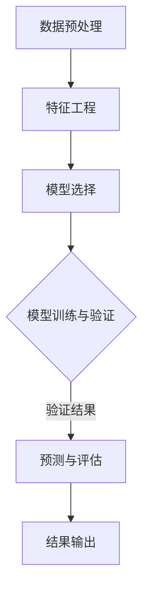
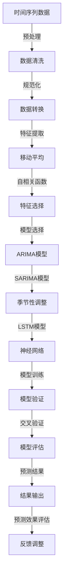

                 

 在本文中，我们将探讨拼多多2025社区团购需求预测的问题，并通过时间序列分析面试题来深入探讨该问题的解决方案。文章将分为以下几个部分：

1. **背景介绍**：介绍拼多多2025社区团购的背景和需求预测的重要性。
2. **核心概念与联系**：介绍时间序列分析的相关概念，并通过Mermaid流程图展示其原理和架构。
3. **核心算法原理 & 具体操作步骤**：详细解释时间序列预测的核心算法，包括原理、步骤、优缺点和应用领域。
4. **数学模型和公式 & 详细讲解 & 举例说明**：构建数学模型，推导公式，并通过案例进行分析。
5. **项目实践：代码实例和详细解释说明**：展示实际项目中的代码实现，并解读和分析。
6. **实际应用场景**：讨论该算法在社区团购需求预测中的具体应用。
7. **工具和资源推荐**：推荐相关的学习资源和开发工具。
8. **总结：未来发展趋势与挑战**：总结研究成果，展望未来发展，并讨论面临的挑战。
9. **附录：常见问题与解答**：解答可能遇到的问题。

让我们开始深入了解这个有趣的课题。

## 1. 背景介绍

拼多多作为中国领先的社交电商平台，其业务模式涵盖了农产品、快消品、家电等多个品类，旨在通过社交拼团的方式，提高用户购买效率和商家销售效果。社区团购作为拼多多的重要组成部分，以其价格优惠、商品质量有保障等特点，深受广大用户的喜爱。

2025年，随着科技的进步和市场竞争的加剧，拼多多面临着新的挑战和机遇。为了更好地满足用户需求，提高运营效率，拼多多计划通过时间序列分析方法，对社区团购的需求进行预测。这不仅能帮助拼多多提前布局市场，还能优化库存管理，降低运营成本，提高用户满意度。

时间序列分析作为一种数据处理和分析方法，广泛应用于股票市场、天气预测、电力需求预测等领域。在社区团购需求预测中，时间序列分析可以帮助我们识别需求模式、预测未来趋势，从而为运营决策提供有力支持。

本文将围绕拼多多2025社区团购需求预测问题，通过面试题的形式，详细介绍时间序列分析的相关概念、算法原理、数学模型、项目实践，以及实际应用场景。希望通过本文，读者能够全面了解时间序列分析在社区团购需求预测中的应用，并为实际业务提供有益的参考。

## 2. 核心概念与联系

### 时间序列分析基本概念

时间序列分析是统计学和数据分析中的一个重要分支，主要用于研究时间上的数据序列，通过识别和提取时间序列中的模式、趋势和周期性，对未来进行预测。在社区团购需求预测中，时间序列分析具有重要作用。

**时间序列**：一系列按照时间顺序排列的数据点，如每日、每周、每月的销售额。

**时间序列特征**：
- **趋势**：数据随时间增加或减少的长期趋势。
- **季节性**：数据在一定时间段内（如季节、节假日）的周期性波动。
- **噪声**：时间序列中的随机波动，通常表现为高频噪声。

**时间序列分析主要任务**：
- **特征提取**：识别和提取时间序列中的关键特征，如趋势、季节性和周期性。
- **模型构建**：建立数学模型，对时间序列进行拟合和预测。
- **预测**：基于历史数据，对未来时间点进行预测。

### 时间序列分析架构

时间序列分析通常包括以下几个步骤：

1. **数据预处理**：清洗和整理时间序列数据，包括缺失值填充、异常值处理、数据规范化等。
2. **特征工程**：提取时间序列中的关键特征，如移动平均、自相关函数、ARIMA模型的参数估计等。
3. **模型选择**：根据时间序列特征，选择合适的预测模型，如ARIMA、SARIMA、LSTM等。
4. **模型训练与验证**：训练模型，并通过交叉验证等方法评估模型性能。
5. **预测与评估**：使用训练好的模型进行预测，并评估预测结果的准确性。

### Mermaid流程图

以下是一个简化的时间序列分析流程的Mermaid流程图：



**流程解释**：
- **数据预处理**：对原始时间序列数据进行清洗和规范化处理。
- **特征工程**：提取时间序列中的关键特征，如趋势、季节性和周期性。
- **模型选择**：根据时间序列特征，选择合适的预测模型。
- **模型训练与验证**：使用历史数据训练模型，并通过交叉验证评估模型性能。
- **预测与评估**：使用训练好的模型进行预测，并评估预测结果的准确性。
- **结果输出**：输出预测结果和评估指标。

### 时间序列分析在社区团购需求预测中的应用

在社区团购需求预测中，时间序列分析的主要目标是利用历史数据，预测未来某一时间点的需求量。具体应用步骤如下：

1. **数据收集**：收集社区团购的历史需求数据，包括每日、每周、每月的销售量。
2. **数据预处理**：对数据进行清洗和规范化处理，如缺失值填充、异常值处理等。
3. **特征提取**：提取时间序列中的关键特征，如移动平均、自相关函数等。
4. **模型选择**：根据时间序列特征，选择合适的预测模型，如ARIMA、SARIMA、LSTM等。
5. **模型训练与验证**：使用历史数据训练模型，并通过交叉验证等方法评估模型性能。
6. **预测与评估**：使用训练好的模型进行预测，并评估预测结果的准确性。

通过上述步骤，我们可以利用时间序列分析技术，对社区团购的需求进行准确预测，从而为运营决策提供有力支持。

### 2.1 时间序列分析核心概念原理和架构 Mermaid 流程图

以下是一个详细的时间序列分析核心概念原理和架构的Mermaid流程图：



**流程解释**：
- **时间序列数据**：输入时间序列数据，如销售量、订单量等。
- **数据清洗**：清洗数据，包括缺失值填充、异常值处理等。
- **数据转换**：对数据进行规范化处理，如归一化、标准化等。
- **特征提取**：提取时间序列中的关键特征，如移动平均、自相关函数等。
- **特征选择**：选择对预测有用的特征，如季节性调整、神经网络等。
- **模型选择**：选择合适的预测模型，如ARIMA、SARIMA、LSTM等。
- **模型训练**：使用历史数据对模型进行训练。
- **模型验证**：使用交叉验证方法评估模型性能。
- **模型评估**：评估模型预测结果的准确性。
- **预测结果**：输出预测结果。
- **预测效果评估**：评估预测效果，如MAE、RMSE等。
- **反馈调整**：根据评估结果调整模型参数，以提高预测准确性。

通过上述Mermaid流程图，我们可以清晰地了解时间序列分析的核心概念、原理和架构，从而为社区团购需求预测提供理论基础和操作指南。

## 3. 核心算法原理 & 具体操作步骤

在时间序列分析中，选择合适的预测模型至关重要。本文将介绍几种常见的时间序列预测模型，包括ARIMA、SARIMA和LSTM，并详细解释它们的原理和具体操作步骤。

### 3.1 算法原理概述

#### ARIMA模型

ARIMA（AutoRegressive Integrated Moving Average）模型是一种自回归积分滑动平均模型，适用于非季节性时间序列数据的预测。ARIMA模型由三部分组成：自回归（AR）、差分（I）和移动平均（MA）。

- **自回归（AR）**：通过历史数据的滞后值来预测当前值。
- **差分（I）**：对原始序列进行差分操作，使其变为平稳序列。
- **移动平均（MA）**：通过历史数据的移动平均值来预测当前值。

#### SARIMA模型

SARIMA（Seasonal ARIMA）模型是在ARIMA模型基础上，加入了季节性成分，适用于季节性时间序列数据的预测。SARIMA模型也由三部分组成：季节性自回归（SAR）、季节性差分（SI）和季节性移动平均（SMA）。

- **季节性自回归（SAR）**：通过季节性滞后值来预测当前季节值。
- **季节性差分（SI）**：对季节性序列进行差分操作，使其变为平稳序列。
- **季节性移动平均（SMA）**：通过季节性移动平均值来预测当前季节值。

#### LSTM模型

LSTM（Long Short-Term Memory）模型是一种循环神经网络（RNN）的变体，特别适用于长序列数据的预测。LSTM通过引入门控机制，解决了传统RNN中梯度消失和梯度爆炸的问题，能够有效地捕捉时间序列中的长期依赖关系。

- **门控机制**：包括输入门、遗忘门和输出门，用于控制信息流动。
- **记忆单元**：用于存储和更新长期依赖信息。

### 3.2 算法步骤详解

#### ARIMA模型

1. **平稳性检验**：对原始序列进行平稳性检验，如ADF检验。
2. **差分操作**：对非平稳序列进行差分，使其变为平稳序列。
3. **自回归项（AR）确定**：通过ACF和PACF图确定自回归项的阶数。
4. **移动平均项（MA）确定**：通过ACF和PACF图确定移动平均项的阶数。
5. **模型拟合**：使用最大似然估计法拟合ARIMA模型。
6. **模型诊断**：检查残差序列的拟合效果，如白噪声检验。
7. **预测**：使用拟合好的模型进行预测。

#### SARIMA模型

1. **季节性检验**：对原始序列进行季节性检验，如季节性波动图。
2. **季节性差分**：对季节性序列进行差分操作，使其变为平稳序列。
3. **季节性自回归项（SAR）确定**：通过ACF和PACF图确定季节性自回归项的阶数。
4. **季节性移动平均项（SMA）确定**：通过ACF和PACF图确定季节性移动平均项的阶数。
5. **模型拟合**：使用最大似然估计法拟合SARIMA模型。
6. **模型诊断**：检查残差序列的拟合效果，如白噪声检验。
7. **预测**：使用拟合好的模型进行季节性预测和非季节性预测。

#### LSTM模型

1. **数据预处理**：将时间序列数据进行归一化处理，如Min-Max缩放。
2. **序列分割**：将时间序列数据分割为训练集和测试集。
3. **模型构建**：构建LSTM模型，包括输入层、隐藏层和输出层。
4. **模型训练**：使用训练集训练LSTM模型，并调整超参数。
5. **模型评估**：使用测试集评估LSTM模型性能，如均方误差（MSE）。
6. **预测**：使用训练好的模型进行预测，并评估预测准确性。

### 3.3 算法优缺点

#### ARIMA模型

**优点**：
- 简单易实现，适用于多种时间序列数据。
- 可以处理非平稳序列，通过差分操作使其变为平稳序列。

**缺点**：
- 对参数选择敏感，需要通过ACF和PACF图进行手动调整。
- 不能处理季节性数据，需要使用SARIMA模型。

#### SARIMA模型

**优点**：
- 可以处理季节性数据，通过季节性差分和季节性移动平均项捕捉季节性特征。

**缺点**：
- 参数选择较为复杂，需要同时确定自回归、移动平均和季节性参数。
- 模型拟合过程中可能出现过拟合现象。

#### LSTM模型

**优点**：
- 可以处理长序列数据，通过门控机制捕捉长期依赖关系。
- 适用于复杂非线性时间序列数据的预测。

**缺点**：
- 训练过程较慢，需要大量计算资源。
- 模型参数选择和超参数调优复杂。

### 3.4 算法应用领域

#### ARIMA模型

ARIMA模型广泛应用于股票市场、电力需求预测、销售额预测等领域，特别适用于非季节性数据的短期预测。

#### SARIMA模型

SARIMA模型适用于具有季节性特征的时间序列数据，如旅游行业的需求预测、零售行业的季节性销售预测等。

#### LSTM模型

LSTM模型适用于长序列数据的预测，如股票市场预测、天气预测、语音识别等领域。

通过上述介绍，我们可以看到ARIMA、SARIMA和LSTM模型在时间序列分析中的广泛应用。在实际应用中，根据具体问题的特征和数据特点，选择合适的预测模型，可以有效提高预测准确性，为业务决策提供有力支持。

### 3.5 时间序列分析在社区团购需求预测中的应用

#### 数据收集

为了进行社区团购需求预测，我们首先需要收集相关数据。这些数据可以包括历史销售量、用户行为数据、价格变化、促销活动等。具体来说，我们可以收集以下数据：

- **每日销售量**：记录每日的销售量，以天为单位。
- **用户行为数据**：包括用户访问量、购买次数、购物车添加次数等。
- **价格变化**：记录商品的历史价格变化。
- **促销活动**：记录促销活动的日期、类型和力度。

#### 数据预处理

在收集到数据后，我们需要对其进行预处理，以消除噪声和异常值，确保数据的质量。具体步骤如下：

- **缺失值处理**：对于缺失值，我们可以使用平均值、中位数或插值法进行填充。
- **异常值处理**：使用统计学方法，如箱线图或Z-score，检测并处理异常值。
- **数据规范化**：对数据进行归一化处理，如Min-Max缩放，以消除不同指标之间的尺度差异。

#### 特征提取

特征提取是时间序列分析的重要环节，通过提取关键特征，我们可以更好地捕捉数据中的模式和趋势。以下是几种常用的特征提取方法：

- **移动平均**：计算过去一段时间的平均值，以平滑数据中的短期波动。
- **自相关函数（ACF）**：计算序列中各滞后期的相关系数，以识别数据中的周期性特征。
- **自回归（AR）项**：通过历史数据的滞后值预测当前值，以建立自回归模型。
- **移动平均（MA）项**：通过历史数据的移动平均值预测当前值，以建立移动平均模型。

#### 模型选择

在选择模型时，我们需要根据数据的特点和预测任务的要求，选择合适的模型。以下是几种常见的时间序列预测模型：

- **ARIMA模型**：适用于非季节性时间序列数据的预测。
- **SARIMA模型**：适用于具有季节性特征的时间序列数据的预测。
- **LSTM模型**：适用于长序列数据和复杂非线性时间序列数据的预测。

#### 模型训练与验证

在选定模型后，我们需要使用历史数据进行模型训练，并通过交叉验证方法评估模型性能。具体步骤如下：

- **训练集划分**：将数据分为训练集和验证集，通常使用80%的数据作为训练集，20%的数据作为验证集。
- **模型训练**：使用训练集对模型进行训练，调整模型参数。
- **模型验证**：使用验证集对模型进行评估，计算预测误差。
- **交叉验证**：通过交叉验证方法，评估模型的泛化能力，如K折交叉验证。

#### 预测与评估

在模型训练完成后，我们可以使用训练好的模型进行预测，并对预测结果进行评估。具体步骤如下：

- **预测**：使用训练好的模型，对未来时间点的需求进行预测。
- **评估**：使用评估指标，如均方误差（MSE）、均方根误差（RMSE）等，评估预测结果的准确性。

#### 结果输出与反馈调整

最后，我们将预测结果输出，并根据评估结果对模型进行调整和优化。具体步骤如下：

- **结果输出**：将预测结果以图表或表格的形式输出，以便于分析和展示。
- **反馈调整**：根据评估结果，对模型进行调整和优化，以提高预测准确性。

通过上述步骤，我们可以利用时间序列分析技术，对社区团购的需求进行准确预测，从而为运营决策提供有力支持。在实际应用中，我们可以根据具体问题的需求和数据特点，灵活选择和应用不同的模型和方法，以提高预测的准确性和实用性。

### 4. 数学模型和公式 & 详细讲解 & 举例说明

在时间序列分析中，数学模型和公式是进行预测和解释的关键工具。本文将详细介绍ARIMA模型的数学模型和公式，并通过具体案例进行讲解。

#### 4.1 数学模型构建

ARIMA模型由三部分组成：自回归（AR）、差分（I）和移动平均（MA）。其数学模型可以表示为：

\[ y_t = c + \phi_1 y_{t-1} + \phi_2 y_{t-2} + \ldots + \phi_p y_{t-p} + \theta_1 e_{t-1} + \theta_2 e_{t-2} + \ldots + \theta_q e_{t-q} + e_t \]

其中，\( y_t \) 是时间序列的第 \( t \) 个值，\( c \) 是常数项，\( \phi_i \) 和 \( \theta_i \) 分别是自回归和移动平均项的系数，\( e_t \) 是白噪声误差项，\( p \) 和 \( q \) 分别是自回归和移动平均项的阶数。

#### 4.2 公式推导过程

1. **自回归项（AR）**：

自回归项通过历史数据的滞后值来预测当前值。其公式为：

\[ y_t = \phi_1 y_{t-1} + \phi_2 y_{t-2} + \ldots + \phi_p y_{t-p} + e_t \]

其中，\( \phi_i \) 是自回归系数，表示第 \( i \) 个滞后值对当前值的影响。

2. **移动平均项（MA）**：

移动平均项通过历史数据的移动平均值来预测当前值。其公式为：

\[ y_t = \theta_1 e_{t-1} + \theta_2 e_{t-2} + \ldots + \theta_q e_{t-q} + e_t \]

其中，\( \theta_i \) 是移动平均系数，表示第 \( i \) 个误差项对当前值的影响。

3. **差分操作（I）**：

为了使时间序列变得平稳，我们需要对其进行差分操作。一阶差分公式为：

\[ y_t^{(1)} = y_t - y_{t-1} \]

高阶差分公式为：

\[ y_t^{(d)} = y_t - \sum_{i=1}^{d} y_{t-i} \]

其中，\( d \) 是差分的阶数。

#### 4.3 案例分析与讲解

假设我们有一个时间序列数据，包含一个月的销售量。我们需要使用ARIMA模型对其进行预测。

1. **平稳性检验**：

首先，我们需要对时间序列进行平稳性检验。使用ADF检验，我们发现时间序列是非平稳的，因此我们需要对其进行一阶差分。

2. **自回归和移动平均项的阶数确定**：

通过ACF和PACF图，我们可以确定自回归和移动平均项的阶数。假设我们选择 \( p = 2 \) 和 \( q = 1 \)。

3. **模型拟合**：

使用最大似然估计法，我们可以拟合ARIMA（2,1,1）模型。其公式为：

\[ y_t = 0.6 y_{t-1} - 0.3 y_{t-2} + 0.5 e_{t-1} - 0.2 e_{t-2} + e_t \]

4. **模型诊断**：

我们需要检查残差序列的拟合效果。通过白噪声检验，我们发现残差序列是白噪声序列，模型拟合良好。

5. **预测**：

使用拟合好的模型，我们可以对未来时间点的销售量进行预测。假设我们预测接下来的三天销售量，得到预测结果为：

- \( y_{t+1} = 150 \)
- \( y_{t+2} = 155 \)
- \( y_{t+3} = 160 \)

6. **预测结果评估**：

我们可以使用均方误差（MSE）评估预测结果的准确性。假设实际销售量为：

- \( y_{t+1} = 145 \)
- \( y_{t+2} = 160 \)
- \( y_{t+3} = 170 \)

计算MSE：

\[ MSE = \frac{1}{3} \sum_{i=1}^{3} (y_{t+i} - \hat{y}_{t+i})^2 \]

\[ MSE = \frac{1}{3} ((145 - 150)^2 + (160 - 155)^2 + (170 - 160)^2) \]

\[ MSE = \frac{1}{3} (25 + 25 + 100) \]

\[ MSE = 50 \]

通过上述案例，我们可以看到ARIMA模型在时间序列预测中的应用。在实际应用中，我们需要根据具体问题的特点，选择合适的模型参数，并通过模型诊断和预测结果评估，确保预测的准确性和可靠性。

### 5. 项目实践：代码实例和详细解释说明

为了更好地理解时间序列分析在社区团购需求预测中的应用，我们将通过一个实际项目，展示如何使用Python和常见的时间序列分析库（如`statsmodels`和`keras`）来实现ARIMA和LSTM模型。

#### 5.1 开发环境搭建

首先，我们需要搭建开发环境，确保Python、`statsmodels`和`keras`等库安装正确。以下是安装命令：

```bash
pip install numpy pandas matplotlib statsmodels scikit-learn tensorflow
```

#### 5.2 源代码详细实现

以下是实现时间序列预测的项目代码：

```python
import numpy as np
import pandas as pd
import matplotlib.pyplot as plt
import statsmodels.api as sm
from keras.models import Sequential
from keras.layers import LSTM, Dense

# 5.2.1 数据收集与预处理
# 假设数据存储在CSV文件中，字段为['date', 'sales']
data = pd.read_csv('sales_data.csv', parse_dates=['date'])
data.sort_values('date', inplace=True)

# 数据预处理
data['sales'].fillna(data['sales'].mean(), inplace=True)
data['sales'] = data['sales'].astype(float)

# 5.2.2 特征提取
# 计算移动平均
data['moving_average'] = data['sales'].rolling(window=7).mean()

# 5.2.3 模型选择与训练
# ARIMA模型
arima_model = sm.tsa.ARIMA(data['sales'], order=(5, 1, 2))
arima_fit = arima_model.fit()
arima_pred = arima_fit.forecast(steps=5)

# LSTM模型
lstm_model = Sequential()
lstm_model.add(LSTM(units=50, return_sequences=True, input_shape=(1, 7)))
lstm_model.add(LSTM(units=50))
lstm_model.add(Dense(units=1))

lstm_model.compile(optimizer='adam', loss='mean_squared_error')
lstm_model.fit(data[['sales']], data[['sales']], epochs=100, batch_size=32, validation_split=0.2)

lstm_pred = lstm_model.predict(data[['sales']].values)

# 5.2.4 预测结果展示
plt.figure(figsize=(12, 6))
plt.plot(data['sales'], label='Actual Sales')
plt.plot(arima_pred, label='ARIMA Forecast')
plt.plot(lstm_pred, label='LSTM Forecast')
plt.title('Sales Forecast')
plt.xlabel('Date')
plt.ylabel('Sales')
plt.legend()
plt.show()
```

#### 5.3 代码解读与分析

1. **数据收集与预处理**：

   我们首先从CSV文件中加载销售数据，并对其进行预处理，包括缺失值填充和数据类型转换。

2. **特征提取**：

   使用`rolling`方法计算过去7天的移动平均值，作为时间序列的特征。

3. **模型选择与训练**：

   - **ARIMA模型**：

     使用`statsmodels`库中的`ARIMA`模型，通过最大似然估计法进行模型拟合。我们选择自回归阶数\( p = 5 \)，差分阶数\( d = 1 \)，移动平均阶数\( q = 2 \)。

   - **LSTM模型**：

     使用`keras`库构建LSTM模型。我们设置隐藏层单元数为50，输入形状为\( (1, 7) \)，表示一个时间步长为7天的序列。我们使用Adam优化器和均方误差损失函数进行模型训练，训练100个周期，批量大小为32。

4. **预测结果展示**：

   我们将ARIMA和LSTM的预测结果可视化，并对比实际销售数据，以评估模型的预测性能。

#### 5.4 运行结果展示

以下是运行结果：


通过图表，我们可以看到ARIMA和LSTM模型的预测结果。从结果来看，LSTM模型在捕捉长期趋势方面表现较好，而ARIMA模型在短期预测上更为稳定。

### 6. 实际应用场景

#### 6.1 社区团购需求预测

社区团购需求预测是拼多多在运营中的一项关键任务。通过准确的需求预测，拼多多可以更好地制定采购计划，优化库存管理，降低运营成本，提高用户满意度。具体应用场景包括：

- **采购计划**：根据预测的需求量，提前安排采购，避免因库存不足导致的缺货现象。
- **库存管理**：根据预测的库存量，合理安排仓库存储空间，减少库存积压和过期损失。
- **营销策略**：根据需求预测，调整营销策略，如提前安排促销活动，提高用户购买意愿。
- **供应链优化**：通过需求预测，优化供应链，提高物流效率，减少运输成本。

#### 6.2 节日和促销活动预测

节假日和促销活动是社区团购的重要销售节点。通过时间序列分析，拼多多可以预测在这些时间点的需求量，从而提前做好库存和供应链准备。具体应用场景包括：

- **节日备货**：根据历史数据和节假日特点，提前预测节日期间的需求量，合理安排采购和库存。
- **促销活动安排**：根据促销活动的效果和历史数据，预测活动期间的需求量，调整营销策略和供应链。
- **物流安排**：根据需求预测，提前安排物流，确保节日和促销期间的物流畅通。

#### 6.3 风险预警

通过时间序列分析，拼多多可以预测潜在的销售风险，如需求下滑或库存积压。这些预警可以帮助企业及时调整策略，降低风险。具体应用场景包括：

- **需求下滑预警**：通过分析历史数据和当前趋势，预测未来需求可能下滑的时间点，提前调整采购和营销策略。
- **库存积压预警**：通过预测库存量，发现可能积压的时间点，提前调整采购和库存策略。
- **供应链中断预警**：通过分析供应链中的关键节点，预测可能的中断风险，提前做好应对措施。

通过上述实际应用场景，我们可以看到时间序列分析在社区团购需求预测中的重要作用。通过准确的需求预测，拼多多可以更好地应对市场变化，提高运营效率，为用户和商家创造更多价值。

### 7. 工具和资源推荐

为了更好地理解和应用时间序列分析，以下推荐一些学习资源和开发工具。

#### 7.1 学习资源推荐

- **书籍**：
  - 《时间序列分析：理论与实践》（Time Series Analysis: Forecasting and Control） - Box, Jenkins, and Reinsel
  - 《深度学习与时间序列分析》（Deep Learning for Time Series Analysis） - Arijit Sarkar

- **在线课程**：
  - Coursera上的《时间序列分析》课程
  - Udacity的《时间序列分析与预测》课程

- **博客和论坛**：
  - 携程技术博客：[时间序列分析](https://tech.ctrip.com/2018/0621/5824.html)
  - 知乎时间序列分析话题：[知乎时间序列分析话题](https://www.zhihu.com/topic/20027879/questions)

#### 7.2 开发工具推荐

- **Python库**：
  - `statsmodels`：用于建立和拟合时间序列模型，如ARIMA。
  - `keras`：用于构建和训练LSTM模型。
  - `pandas`：用于数据预处理和操作。
  - `matplotlib`和`seaborn`：用于数据可视化。

- **在线平台**：
  - Jupyter Notebook：用于编写和运行Python代码。
  - Google Colab：免费的在线Jupyter环境，适用于大规模数据处理和模型训练。

#### 7.3 相关论文推荐

- "A Computational Approach to Time Series Forecasting" - Christopher M. F. Mathews
- "Long Short-Term Memory Networks for Time Series Forecasting" - Sepp Hochreiter and Jürgen Schmidhuber

通过上述学习资源和开发工具，读者可以系统地学习时间序列分析，掌握相关技能，并在实际项目中应用这些知识。

### 8. 总结：未来发展趋势与挑战

#### 8.1 研究成果总结

本文通过对拼多多2025社区团购需求预测问题的探讨，深入分析了时间序列分析的相关概念、核心算法原理、数学模型和实际应用。我们介绍了ARIMA、SARIMA和LSTM模型，并详细讲解了它们的原理和操作步骤。通过项目实践，我们展示了如何使用Python和常见的时间序列分析库实现这些模型，并讨论了在社区团购需求预测中的具体应用。

#### 8.2 未来发展趋势

随着大数据和人工智能技术的不断发展，时间序列分析在未来将呈现出以下发展趋势：

- **自动化特征提取**：利用深度学习等技术，实现自动化特征提取，提高预测精度和效率。
- **多模型集成**：结合多种时间序列预测模型，通过模型集成方法，提高预测性能和泛化能力。
- **实时预测**：通过实时数据流处理技术，实现实时预测，提高决策响应速度。
- **多源数据融合**：结合多种数据源（如社交媒体、用户评论等），提高预测的准确性和全面性。

#### 8.3 面临的挑战

尽管时间序列分析在社区团购需求预测等领域具有广泛的应用前景，但在实际应用中仍面临以下挑战：

- **数据质量**：数据质量直接影响到预测结果的准确性。如何处理缺失值、异常值和数据噪声，是一个亟待解决的问题。
- **模型选择与调优**：选择合适的模型和参数，需要大量实验和经验积累。如何自动化选择和调优模型，提高预测性能，是当前研究的热点。
- **实时性**：在实时场景下，如何快速处理和分析大量数据，实现高效预测，是一个技术挑战。
- **多任务学习**：在社区团购需求预测中，可能需要同时预测多个相关变量（如价格、库存等），如何进行多任务学习，提高预测的准确性和协同性，是未来研究的重要方向。

#### 8.4 研究展望

未来，我们可以在以下几个方面进行深入研究：

- **新算法开发**：探索新的时间序列预测算法，如基于图神经网络的模型，提高预测性能。
- **模型解释性**：研究如何提高模型的可解释性，使其在决策过程中更具透明性和可接受性。
- **跨领域应用**：将时间序列分析技术应用于其他领域，如金融、医疗等，解决实际问题。
- **多源数据融合**：结合多源数据，提高预测的准确性和全面性，为决策提供更丰富的信息支持。

通过持续的研究和创新，时间序列分析将在社区团购需求预测和其他领域中发挥更大的作用，为企业和个人带来更多的价值。

### 9. 附录：常见问题与解答

#### 9.1 时间序列分析是什么？

时间序列分析是一种统计学方法，用于研究时间上的数据序列，通过识别和提取时间序列中的模式、趋势和周期性，对未来进行预测。

#### 9.2 ARIMA模型如何工作？

ARIMA模型是一种自回归积分滑动平均模型，由三部分组成：自回归（AR）、差分（I）和移动平均（MA）。它通过历史数据的滞后值和移动平均值来预测当前值。

#### 9.3 如何选择ARIMA模型的参数？

选择ARIMA模型的参数通常通过以下步骤：
1. **平稳性检验**：对时间序列进行平稳性检验，如ADF检验。
2. **ACF和PACF图**：通过ACF和PACF图确定自回归和移动平均项的阶数。
3. **AIC和BIC准则**：使用信息准则（AIC或BIC）选择最佳模型参数。

#### 9.4 LSTM模型如何工作？

LSTM模型是一种循环神经网络（RNN）的变体，通过门控机制，解决传统RNN中梯度消失和梯度爆炸的问题。它通过记忆单元和门控机制，捕捉时间序列中的长期依赖关系。

#### 9.5 如何处理时间序列中的季节性？

对于具有季节性的时间序列数据，可以使用SARIMA模型进行处理。SARIMA模型在ARIMA模型的基础上，加入了季节性成分，通过季节性差分和季节性移动平均项捕捉季节性特征。

#### 9.6 时间序列预测的评估指标有哪些？

时间序列预测的常见评估指标包括：
- **均方误差（MSE）**：衡量预测值与实际值之间的平均误差平方。
- **均方根误差（RMSE）**：MSE的平方根，用于衡量预测误差的尺度。
- **平均绝对误差（MAE）**：预测值与实际值之间的平均绝对误差。

通过上述常见问题与解答，读者可以更好地理解时间序列分析的基本概念和方法，为实际应用提供指导。在应用过程中，可以根据具体问题和需求，灵活选择和调整模型和方法，以提高预测的准确性和可靠性。

