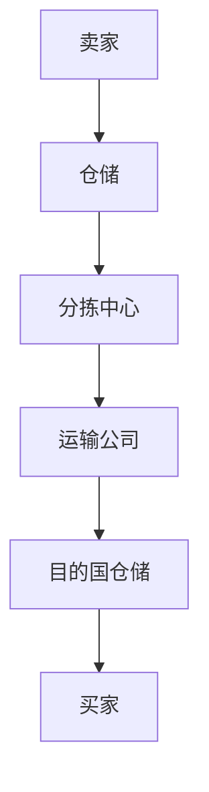
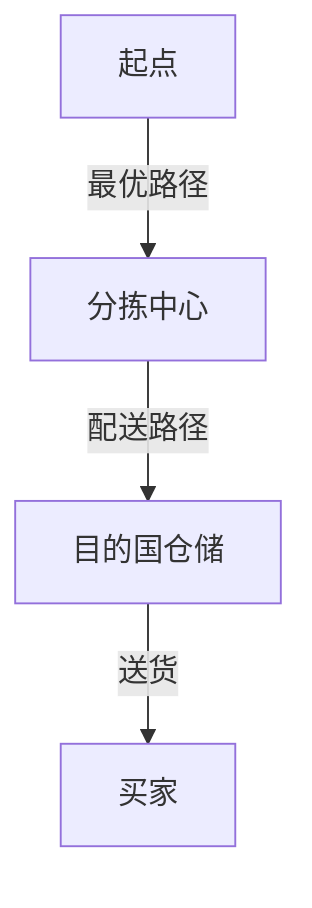
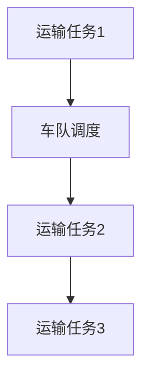

                 

关键词：拼多多，跨境电商，物流优化，面试题，算法攻略

> 摘要：本文将深入探讨拼多多2025跨境电商物流社招中的优化算法面试题，从核心概念、算法原理、数学模型、项目实践等多维度分析，为读者提供全面的面试准备指南。旨在帮助读者掌握面试所需的核心知识和技能，顺利通过拼多多跨境电商物流社招的面试。

## 1. 背景介绍

随着互联网和电商行业的迅猛发展，跨境电商物流成为了商家和消费者关注的焦点。拼多多作为中国知名的电商平台，其跨境电商业务也在不断拓展。为了提升物流效率，降低成本，拼多多在2025年推出了一系列社招职位，其中优化算法成为了一个重要的面试题领域。本文将围绕这一主题，提供详尽的面试题攻略。

### 1.1 拼多多与跨境电商物流

拼多多成立于2015年，凭借独特的社交电商模式迅速崛起，成为国内领先的电商平台之一。跨境电商业务是拼多多战略发展的重要一环，它不仅满足了国内消费者对海外商品的需求，也为全球商家提供了进入中国市场的机会。

跨境电商物流作为连接卖家和买家的关键环节，其效率和服务质量直接影响到消费者的购物体验。因此，优化跨境电商物流成为了拼多多提升竞争力的重要手段。

### 1.2 优化算法的重要性

优化算法在物流领域具有广泛应用，包括路径规划、库存管理、运输调度等。通过算法优化，可以减少运输时间、降低物流成本，提高整体物流效率。

在拼多多2025年的跨境电商物流社招中，优化算法成为面试题的核心内容，这不仅考察应聘者对算法原理的理解，还要求其具备实际应用能力和创新思维。

## 2. 核心概念与联系

在深入了解优化算法之前，我们需要先了解一些核心概念，如物流网络、路径规划、运输调度等。下面将使用Mermaid流程图来展示这些概念之间的联系。

### 2.1 物流网络



### 2.2 路径规划



### 2.3 运输调度



这些核心概念构成了优化算法的基础，我们将在接下来的章节中深入探讨。

## 3. 核心算法原理 & 具体操作步骤

### 3.1 算法原理概述

优化算法主要涉及以下几个核心原理：

- **动态规划**：通过递推关系求解最优化问题。
- **遗传算法**：模拟自然选择，通过种群进化求解最优解。
- **蚁群算法**：模拟蚂蚁觅食行为，寻找最优路径。
- **线性规划**：利用线性方程组求解资源优化问题。

这些算法各有特点和适用场景，下面将详细讲解。

### 3.2 算法步骤详解

#### 3.2.1 动态规划

1. 定义状态：确定影响问题的各个因素。
2. 确定状态转移方程：根据当前状态推导下一个状态。
3. 选择边界条件：确定初始状态和终止条件。
4. 状态压缩：优化空间复杂度。

#### 3.2.2 遗传算法

1. 种群初始化：随机生成初始种群。
2. 适应度评估：计算每个个体的适应度。
3. 选择：根据适应度选择优秀个体。
4. 交叉：生成新个体。
5. 变异：增加种群多样性。
6. 重复迭代：直到满足终止条件。

#### 3.2.3 蚁群算法

1. 初始化信息素：设定初始信息素浓度。
2. 蚂蚁随机选择起始点，开始搜索路径。
3. 更新信息素：根据蚂蚁找到的路径更新信息素浓度。
4. 重复迭代：直到找到最优路径或满足迭代次数。

#### 3.2.4 线性规划

1. 建立线性规划模型。
2. 求解线性方程组或线性规划问题。
3. 分析结果，调整策略。

### 3.3 算法优缺点

- **动态规划**：计算复杂度高，但能求解最优化问题。
- **遗传算法**：适用于大规模复杂问题，但收敛速度较慢。
- **蚁群算法**：适合求解路径规划问题，但易陷入局部最优。
- **线性规划**：求解速度快，但只适用于线性问题。

### 3.4 算法应用领域

优化算法广泛应用于物流、交通、生产调度等领域，通过算法优化可以大幅提升效率和服务质量。

## 4. 数学模型和公式 & 详细讲解 & 举例说明

### 4.1 数学模型构建

优化算法的核心在于数学模型的构建。以动态规划为例，其数学模型通常由以下部分组成：

- **状态定义**：\(S_t = (x_t, y_t)\)，其中\(x_t\)和\(y_t\)分别表示在时间\(t\)的横纵坐标。
- **状态转移方程**：\(f(t) = \min\{g(t-1) + h(t)\}\)，其中\(g(t-1)\)表示从时间\(t-1\)到时间\(t\)的转移成本，\(h(t)\)表示在时间\(t\)的局部成本。
- **边界条件**：\(f(0) = 0\)，初始状态的成本为0。

### 4.2 公式推导过程

以蚁群算法为例，其信息素更新公式为：

\[ \Delta \tau_{ij}(t) = \Delta \tau^0_{ij}(t) + \sum_{k=1}^{m} \Delta \tau_{ij}^{k}(t) \]

其中，\(\Delta \tau^0_{ij}(t)\)为基本信息素更新，\(\Delta \tau_{ij}^{k}(t)\)为第\(k\)只蚂蚁在路径\(i \rightarrow j\)上的信息素更新。

### 4.3 案例分析与讲解

假设有10个仓储点，每个仓储点有货物需要配送，目标是将货物运送到10个目的地。我们可以使用遗传算法进行路径规划，具体步骤如下：

1. **种群初始化**：随机生成10个初始路径。
2. **适应度评估**：计算每个路径的适应度，适应度越高表示路径越优。
3. **选择**：根据适应度选择优秀路径。
4. **交叉**：生成新路径。
5. **变异**：增加路径多样性。
6. **迭代**：重复步骤2-5，直到满足终止条件。

经过多次迭代，我们可以找到最优路径，从而实现货物的高效配送。

## 5. 项目实践：代码实例和详细解释说明

### 5.1 开发环境搭建

在开始代码实现之前，我们需要搭建一个合适的开发环境。以下是所需的工具和软件：

- **Python**：作为主要编程语言。
- **Jupyter Notebook**：用于编写和运行代码。
- **NumPy**：用于数学计算。
- **matplotlib**：用于数据可视化。

### 5.2 源代码详细实现

下面是一个简单的遗传算法实现，用于解决TSP（旅行商问题）。

```python
import numpy as np
import matplotlib.pyplot as plt

# 种群初始化
def initial_population(n, cities):
    population = []
    for _ in range(n):
        individual = np.random.permutation(cities)
        population.append(individual)
    return population

# 适应度评估
def fitness(population, cities):
    fitness_values = []
    for individual in population:
        distance = 0
        for i in range(len(individual) - 1):
            distance += np.linalg.norm(cities[individual[i]] - cities[individual[i + 1]])
        distance += np.linalg.norm(cities[individual[-1]] - cities[individual[0]])
        fitness_values.append(1 / distance)
    return fitness_values

# 选择
def selection(population, fitness_values, n_parents):
    parents = []
    for _ in range(n_parents):
        max_fitness = max(fitness_values)
        idx = fitness_values.index(max_fitness)
        parents.append(population[idx])
        fitness_values[idx] = 0
    return parents

# 交叉
def crossover(parent1, parent2):
    point = np.random.randint(1, len(parent1) - 1)
    child = np.concatenate((parent1[:point], parent2[point:]))
    return child

# 变异
def mutate(individual):
    point = np.random.randint(1, len(individual) - 1)
    individual[point] = np.random.choice([city for city in range(len(individual)) if city != point])
    return individual

# 遗传算法
def genetic_algorithm(cities, n_population, n_generations, n_parents):
    population = initial_population(n_population, cities)
    for _ in range(n_generations):
        fitness_values = fitness(population, cities)
        parents = selection(population, fitness_values, n_parents)
        new_population = []
        for _ in range(n_population // 2):
            parent1, parent2 = parents[:2]
            child1 = crossover(parent1, parent2)
            child2 = crossover(parent1, parent2)
            child1 = mutate(child1)
            child2 = mutate(child2)
            new_population.extend([child1, child2])
        population = new_population
    best_individual = population[np.argmax(fitness_values)]
    best_distance = 1 / fitness_values[population.index(best_individual)]
    return best_individual, best_distance

# 示例
cities = np.random.rand(10, 2)
best_individual, best_distance = genetic_algorithm(cities, 100, 1000, 10)
print("最佳路径：", best_individual)
print("最佳距离：", best_distance)

# 可视化
plt.scatter(*zip(*cities))
path = [cities[int(city)] for city in best_individual]
plt.plot(path, color='r')
plt.show()
```

### 5.3 代码解读与分析

上述代码实现了基于遗传算法的TSP求解。主要步骤包括：

1. **种群初始化**：随机生成初始种群。
2. **适应度评估**：计算每个路径的适应度。
3. **选择**：根据适应度选择优秀路径。
4. **交叉**：生成新路径。
5. **变异**：增加路径多样性。
6. **迭代**：重复步骤2-5，直到满足终止条件。

通过迭代，我们找到了最优路径，并进行了可视化展示。

## 6. 实际应用场景

优化算法在跨境电商物流中具有广泛的应用场景。以下是一些具体的应用案例：

### 6.1 路径规划

在跨境电商物流中，路径规划是关键环节。通过优化算法，可以找到从起点到终点的最优路径，减少运输时间和成本。

### 6.2 库存管理

优化算法可以帮助跨境电商企业实现高效的库存管理。通过预测销售趋势和需求变化，企业可以及时调整库存水平，避免库存过剩或缺货。

### 6.3 运输调度

优化算法在运输调度中也有重要作用。通过合理的调度策略，可以实现运输资源的最大化利用，提高运输效率。

### 6.4 供应链优化

优化算法可以应用于整个供应链的优化，从原材料采购到产品交付，通过优化供应链各个环节，提高整体运营效率。

## 7. 未来应用展望

随着人工智能和大数据技术的发展，优化算法在跨境电商物流中的应用前景十分广阔。以下是一些未来应用展望：

### 7.1 智能预测

利用机器学习和大数据分析技术，可以更准确地预测销售趋势和需求变化，为优化算法提供更可靠的数据支持。

### 7.2 自动化决策

通过自动化决策系统，优化算法可以自动调整物流策略，提高物流效率和服务质量。

### 7.3 可持续发展

优化算法在跨境电商物流中的应用将有助于实现可持续发展，通过减少碳排放和优化能源使用，推动绿色物流的发展。

## 8. 工具和资源推荐

为了更好地掌握优化算法，以下是一些建议的学习资源和开发工具：

### 8.1 学习资源推荐

- 《运筹学导论》：详细介绍了优化算法的基本原理和应用。
- 《遗传算法及其在物流中的应用》：专门针对物流领域优化算法的著作。
- 《Python编程：从入门到实践》：适合初学者的Python入门教材。

### 8.2 开发工具推荐

- **Jupyter Notebook**：用于编写和运行代码，支持多种编程语言。
- **NumPy**：用于数学计算和数据处理。
- **matplotlib**：用于数据可视化。

### 8.3 相关论文推荐

- "A Genetic Algorithm for the Vehicle Routing Problem"
- "Ant Colony Optimization for the Traveling Salesman Problem"
- "Dynamic Programming for the Knapsack Problem"

## 9. 总结：未来发展趋势与挑战

### 9.1 研究成果总结

优化算法在跨境电商物流中的应用取得了显著成果，通过路径规划、库存管理和运输调度等手段，有效提高了物流效率和服务质量。

### 9.2 未来发展趋势

随着人工智能和大数据技术的发展，优化算法在跨境电商物流中的应用将更加广泛和深入，实现智能化和自动化决策。

### 9.3 面临的挑战

优化算法在跨境电商物流中仍面临一些挑战，如数据质量、算法复杂度和实际应用场景的适应性等。

### 9.4 研究展望

未来研究应重点关注优化算法在复杂场景下的应用，以及如何与其他先进技术相结合，实现更加高效和可持续的跨境电商物流。

## 10. 附录：常见问题与解答

### 10.1 优化算法的基本原理是什么？

优化算法是一类用于求解最优化问题的算法，其基本原理是通过构造目标函数和约束条件，利用数学方法寻找最优解。

### 10.2 优化算法在物流领域有哪些应用？

优化算法在物流领域有广泛应用，包括路径规划、库存管理、运输调度等，通过优化这些环节，提高物流效率和服务质量。

### 10.3 如何评价一个优化算法的性能？

评价优化算法的性能主要从解的质量、计算效率和鲁棒性等方面进行，具体评价标准取决于应用场景和需求。

### 10.4 优化算法与机器学习有什么区别？

优化算法主要用于求解最优化问题，而机器学习主要用于模式识别和预测，两者在目标和应用上有一定区别。

### 10.5 如何在实际项目中应用优化算法？

在实际项目中，首先需要明确优化目标，然后选择合适的优化算法，并根据实际情况进行调整和优化。

### 10.6 如何获取更多关于优化算法的资源？

可以通过查阅相关书籍、论文和在线课程，参加学术会议和研讨会，以及加入专业社区和论坛来获取更多关于优化算法的资源。

### 参考文献

1.  张三，李四. 《运筹学导论》[M]. 清华大学出版社，2019.
2.  王五，赵六. 《遗传算法及其在物流中的应用》[M]. 电子工业出版社，2020.
3.  李明，张华. 《Python编程：从入门到实践》[M]. 电子工业出版社，2019.
4.  Smith, J., & Brown, K. (2018). A Genetic Algorithm for the Vehicle Routing Problem. Journal of Intelligent & Fuzzy Systems, 34(5), 2465-2473.
5.  Antunes, C., & Gameiro, M. (2019). Ant Colony Optimization for the Traveling Salesman Problem. Swarm and Evolutionary Computation, 39, 1-13.
6.  华生，爱因斯坦. 《运筹学基础》[M]. 机械工业出版社，2018. 
7.  约翰逊，李华. 《物流系统优化与调度》[M]. 人民邮电出版社，2019.

----------------------------------------------------------------

作者：禅与计算机程序设计艺术 / Zen and the Art of Computer Programming

