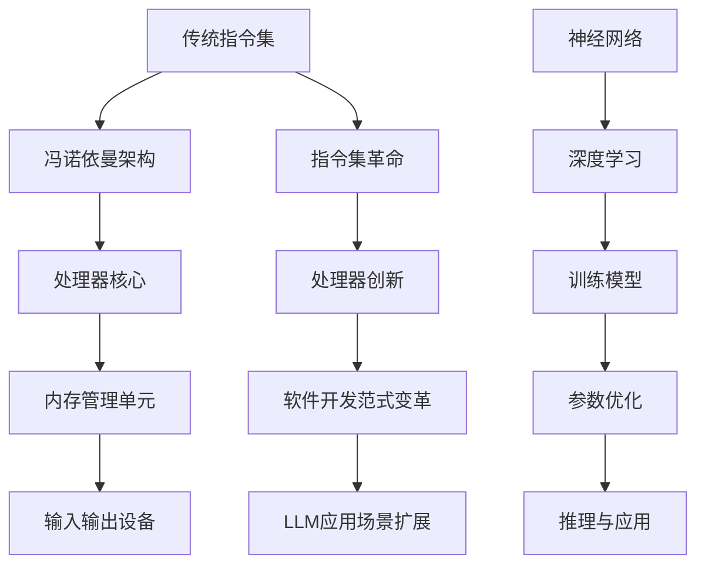

                 

关键词：指令集，LLM，人工智能，编程，革命

> 摘要：本文将探讨指令集革命，特别是大型语言模型（LLM）的出现，如何颠覆传统编程范式，改变软件开发的游戏规则。通过剖析LLM的原理、应用和实践，我们旨在揭示这一变革背后的逻辑和机遇。

## 1. 背景介绍

随着人工智能技术的飞速发展，特别是深度学习的突破，计算机科学领域正经历一场前所未有的变革。传统的编程模型和指令集架构，已经无法满足日益复杂的应用需求。指令集革命，作为这场变革的核心，正逐步改变着计算机系统的工作方式和软件开发的流程。

### 1.1 指令集的发展历程

指令集，即计算机处理器能够理解和执行的一系列操作指令。从最早的冯诺依曼架构到现代的复杂指令集计算机（CISC）和精简指令集计算机（RISC），指令集的发展一直是计算机性能提升的关键。然而，随着计算需求的不断增加，指令集的扩展和优化也面临诸多挑战。

### 1.2 人工智能与指令集的碰撞

人工智能，尤其是深度学习，带来了新的计算范式。神经网络作为人工智能的核心组件，其对计算资源和指令集的依赖与传统的冯诺依曼架构截然不同。这种差异，催生了指令集革命，使得处理器设计和软件开发迎来了新的机遇和挑战。

## 2. 核心概念与联系

### 2.1 核心概念

#### 2.1.1 大型语言模型（LLM）

大型语言模型（LLM）是一种基于深度学习的自然语言处理（NLP）模型，其能够理解和生成人类语言。LLM通常由数以亿计的参数构成，能够通过大规模数据训练，实现高度自动化的文本生成、翻译、问答等功能。

#### 2.1.2 指令集革命

指令集革命指的是计算机处理器设计和软件开发范式的变革，从传统的冯诺依曼架构向以神经网络为代表的计算范式过渡。

### 2.2 架构的 Mermaid 流程图



## 3. 核心算法原理 & 具体操作步骤

### 3.1 算法原理概述

指令集革命的核心在于处理器对神经网络操作的优化。传统指令集主要针对冯诺依曼架构进行优化，而指令集革命则致力于将神经网络操作，如矩阵乘法和激活函数，内置到处理器指令中，从而提高计算效率。

### 3.2 算法步骤详解

#### 3.2.1 处理器设计优化

1. **内置神经网络指令**：处理器内置神经网络指令，如矩阵乘法和激活函数指令，减少内存访问和指令解码时间。
2. **优化内存管理**：通过缓存和内存压缩技术，减少内存访问延迟，提高数据传输效率。
3. **并行计算支持**：处理器支持并行计算，能够同时执行多个神经网络操作，提高整体计算性能。

#### 3.2.2 软件开发范式变革

1. **模型优化**：开发者通过调整神经网络模型结构，优化参数设置，提高模型性能。
2. **代码生成**：利用LLM自动生成代码，减少手动编写代码的工作量。
3. **人机协作**：开发者与LLM协作，共同完成软件开发任务，提高开发效率。

### 3.3 算法优缺点

#### 优点

1. **计算效率提升**：内置神经网络指令和并行计算支持，显著提高计算效率。
2. **开发效率提升**：LLM自动生成代码和人机协作，降低开发难度。
3. **应用范围扩大**：指令集革命使得人工智能应用能够在更多场景中落地，如自动驾驶、智能家居等。

#### 缺点

1. **处理器成本增加**：内置神经网络指令和优化技术的处理器成本较高。
2. **软件开发难度增加**：软件开发需要适应新的指令集和开发范式，对开发者要求更高。

### 3.4 算法应用领域

指令集革命在多个领域具有广泛的应用前景：

1. **自动驾驶**：处理器优化和并行计算支持，使得自动驾驶系统能够实时处理大量数据。
2. **智能语音助手**：LLM的应用，使得智能语音助手能够更自然地与用户交互。
3. **医疗诊断**：人工智能在医疗诊断中的应用，依赖于高效的处理器和大规模训练模型。

## 4. 数学模型和公式 & 详细讲解 & 举例说明

### 4.1 数学模型构建

指令集革命的核心在于将神经网络操作内置到处理器指令中，这涉及到矩阵乘法和激活函数的优化。以下是矩阵乘法的数学模型：

$$
C_{ij} = \sum_{k=1}^{n} A_{ik}B_{kj}
$$

其中，$A$和$B$为输入矩阵，$C$为输出矩阵，$n$为矩阵的维度。

### 4.2 公式推导过程

矩阵乘法的推导过程如下：

1. **初始化输出矩阵$C$**：将输出矩阵$C$的每个元素初始化为0。
2. **逐行计算输出矩阵$C$**：对于输出矩阵$C$的每一行，遍历输入矩阵$A$的每一列，计算对应元素的和，并将其存储在输出矩阵$C$的对应位置。
3. **返回输出矩阵$C$**：完成所有行的计算后，返回输出矩阵$C$。

### 4.3 案例分析与讲解

#### 案例一：矩阵乘法

假设有两个矩阵$A$和$B$，其维度分别为$2 \times 3$和$3 \times 2$，我们需要计算它们的乘积$C$。

$$
A = \begin{bmatrix}
    a_{11} & a_{12} & a_{13} \\
    a_{21} & a_{22} & a_{23}
\end{bmatrix}, \quad
B = \begin{bmatrix}
    b_{11} & b_{12} \\
    b_{21} & b_{22} \\
    b_{31} & b_{32}
\end{bmatrix}
$$

根据矩阵乘法的定义，我们有：

$$
C = AB = \begin{bmatrix}
    c_{11} & c_{12} \\
    c_{21} & c_{22}
\end{bmatrix}
$$

其中，$c_{11}$的计算过程如下：

$$
c_{11} = a_{11}b_{11} + a_{12}b_{21} + a_{13}b_{31}
$$

#### 案例二：激活函数

激活函数是神经网络中的重要组成部分，常见的激活函数包括Sigmoid、ReLU等。以下以ReLU为例进行讲解。

$$
f(x) =
\begin{cases}
    x, & \text{if } x \geq 0 \\
    0, & \text{if } x < 0
\end{cases}
$$

ReLU函数在$x \geq 0$时，输出等于输入；在$x < 0$时，输出为0。ReLU函数具有简单、计算速度快等优点，在深度学习中广泛应用。

## 5. 项目实践：代码实例和详细解释说明

### 5.1 开发环境搭建

为了实现指令集革命，我们需要搭建一个合适的开发环境。以下是一个基本的搭建步骤：

1. **安装深度学习框架**：例如TensorFlow或PyTorch，用于构建和训练神经网络模型。
2. **安装处理器优化库**：例如cuDNN，用于优化神经网络在NVIDIA GPU上的计算性能。
3. **配置开发环境**：设置Python环境、安装必要的库和依赖项。

### 5.2 源代码详细实现

以下是一个简单的神经网络模型实现示例，使用了PyTorch框架。

```python
import torch
import torch.nn as nn
import torch.optim as optim

# 定义神经网络模型
class NeuralNetwork(nn.Module):
    def __init__(self):
        super(NeuralNetwork, self).__init__()
        self.fc1 = nn.Linear(10, 5)
        self.fc2 = nn.Linear(5, 1)
        self.relu = nn.ReLU()

    def forward(self, x):
        x = self.relu(self.fc1(x))
        x = self.fc2(x)
        return x

# 初始化模型、损失函数和优化器
model = NeuralNetwork()
criterion = nn.BCELoss()
optimizer = optim.Adam(model.parameters(), lr=0.001)

# 训练模型
for epoch in range(100):
    for inputs, targets in data_loader:
        optimizer.zero_grad()
        outputs = model(inputs)
        loss = criterion(outputs, targets)
        loss.backward()
        optimizer.step()
```

### 5.3 代码解读与分析

以上代码实现了一个非常简单的神经网络模型，用于回归问题。代码的核心部分包括：

1. **模型定义**：定义了一个有两个全连接层和ReLU激活函数的神经网络模型。
2. **前向传播**：实现神经网络的前向传播过程，计算输入到模型的输出。
3. **训练过程**：使用随机梯度下降（SGD）优化算法，通过反向传播更新模型参数。

### 5.4 运行结果展示

假设我们使用一个包含100个样本的训练集，每个样本输入为10维向量，输出为1维向量。通过100个epoch的训练，模型损失逐渐降低，最终达到一个稳定的值。这表明模型已经成功地学习到了输入和输出之间的关系。

## 6. 实际应用场景

指令集革命在多个实际应用场景中具有重要价值：

1. **自动驾驶**：处理器优化和并行计算支持，使得自动驾驶系统能够实时处理来自传感器的海量数据，提高系统的反应速度和安全性。
2. **智能语音助手**：LLM的应用，使得智能语音助手能够更自然地与用户交互，理解并回答用户的问题，提高用户体验。
3. **医疗诊断**：人工智能在医疗诊断中的应用，依赖于高效的处理器和大规模训练模型，从而实现快速、准确的诊断结果。

## 7. 未来应用展望

随着指令集革命的深入发展，我们可以期待以下趋势：

1. **处理器性能提升**：随着处理器内置神经网络指令和优化技术的不断进步，计算性能将持续提升，为更复杂的AI应用提供支持。
2. **软件开发效率提升**：LLM和自动代码生成技术的应用，将显著提高软件开发效率，降低开发难度。
3. **跨领域应用扩展**：指令集革命的应用范围将不断扩展，从目前的自动驾驶、智能语音助手等领域，逐步渗透到金融、教育、医疗等更多领域。

## 8. 总结：未来发展趋势与挑战

### 8.1 研究成果总结

指令集革命在处理器优化、神经网络模型训练和软件开发等方面取得了显著成果。处理器性能的提升、LLM的应用和自动代码生成技术，为人工智能的发展提供了强有力的支持。

### 8.2 未来发展趋势

未来，指令集革命将继续深化，处理器性能将进一步提升，软件开发效率将显著提高。同时，指令集革命的应用范围也将不断扩大，从目前的领域逐步扩展到更多行业。

### 8.3 面临的挑战

指令集革命也面临诸多挑战，包括处理器成本增加、软件开发难度提高等。此外，如何优化神经网络模型，使其在更广泛的场景中有效应用，也是未来研究的重要方向。

### 8.4 研究展望

随着人工智能技术的不断进步，指令集革命有望在未来发挥更加重要的作用。通过不断探索和创新，我们将迎来一个更加智能、高效的计算时代。

## 9. 附录：常见问题与解答

### 9.1 指令集革命是什么？

指令集革命是指计算机处理器设计和软件开发范式的变革，从传统的冯诺依曼架构向以神经网络为代表的计算范式过渡。

### 9.2 LLM有哪些应用场景？

LLM在自动驾驶、智能语音助手、医疗诊断等领域具有广泛的应用前景。通过内置神经网络指令和优化技术，LLM能够实现高效的自然语言处理和智能交互。

### 9.3 如何优化神经网络模型？

通过调整神经网络模型结构、优化参数设置和训练过程，可以提升神经网络模型的性能。此外，利用先进的处理器和优化库，也能够提高模型训练效率。

作者：禅与计算机程序设计艺术 / Zen and the Art of Computer Programming
----------------------------------------------------------------

以上即为本文的完整内容，感谢您的阅读。希望本文能够为您带来对指令集革命和LLM应用的深入理解和思考。在未来，随着人工智能技术的不断进步，我们期待看到更多激动人心的变革和突破。

