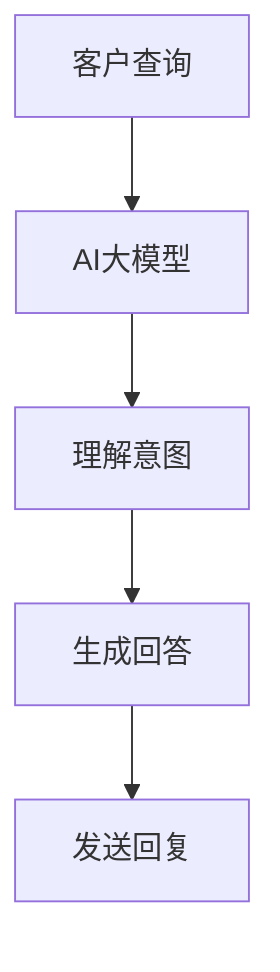

                 

关键词：AI大模型、客户服务、自然语言处理、聊天机器人、数据分析

摘要：随着人工智能技术的快速发展，AI大模型在各个行业中的应用日益广泛，尤其在客户服务领域表现出巨大的潜力。本文将探讨AI大模型在客户服务中的应用，分析其优势与挑战，并探讨未来的发展趋势。

## 1. 背景介绍

客户服务是企业发展的重要一环，良好的客户服务能够提高客户满意度，增强客户忠诚度，从而为企业带来持续的商业价值。然而，随着客户需求的多样化和服务渠道的增多，企业面临着越来越多的客户服务挑战。传统的客户服务方式往往效率低下，难以满足客户日益增长的需求。

随着人工智能技术的迅速发展，尤其是AI大模型的兴起，为解决客户服务难题提供了一种新的思路。AI大模型，如GPT-3、ChatGLM等，具有强大的自然语言处理能力，能够理解和生成自然语言，为聊天机器人、智能客服等客户服务场景提供了强大的技术支持。

## 2. 核心概念与联系

### 2.1 AI大模型的概念

AI大模型是指那些具有大规模参数、能够在多种任务上表现优异的人工神经网络模型。这些模型通常需要海量数据和计算资源进行训练，但一旦训练完成，它们可以用于解决各种复杂的问题，包括文本生成、翻译、问答等。

### 2.2 AI大模型与客户服务的联系

AI大模型与客户服务的联系在于，它们可以用于构建智能客服系统，从而提高客户服务的效率和质量。通过AI大模型，客服系统能够理解客户的意图，提供个性化的服务，处理复杂的查询，甚至在某些情况下替代人工客服。

### 2.3 Mermaid 流程图



## 3. 核心算法原理 & 具体操作步骤

### 3.1 算法原理概述

AI大模型的核心算法是基于深度学习的自然语言处理技术。通过大规模的训练数据和计算资源，AI大模型可以学习到自然语言的规律，从而实现对文本的理解和生成。

### 3.2 算法步骤详解

1. **数据预处理**：对客户查询和回答的数据进行清洗和预处理，包括去除无效信息、统一格式等。
2. **模型训练**：使用预处理后的数据训练AI大模型，通过优化模型参数，使其能够准确理解客户的意图。
3. **意图识别**：输入客户查询，通过AI大模型识别客户的意图。
4. **生成回答**：根据识别出的意图，AI大模型生成合适的回答。
5. **回复发送**：将生成的回答发送给客户。

### 3.3 算法优缺点

**优点**：
- **高效性**：AI大模型能够快速处理大量客户查询，提高服务效率。
- **准确性**：通过大规模训练，AI大模型能够准确理解客户的意图，提供个性化的服务。
- **灵活性**：AI大模型可以适应不同的客户服务场景，提供多样化的服务。

**缺点**：
- **依赖数据**：AI大模型需要大量的训练数据，数据质量直接影响模型的性能。
- **计算资源**：训练和运行AI大模型需要大量的计算资源，对硬件设施要求较高。

### 3.4 算法应用领域

AI大模型在客户服务领域具有广泛的应用，包括但不限于：
- **智能客服**：用于处理客户查询，提供即时回答。
- **客服机器人**：用于24/7在线服务，提高客户满意度。
- **客户分析**：通过分析客户数据，提供个性化服务。

## 4. 数学模型和公式 & 详细讲解 & 举例说明

### 4.1 数学模型构建

AI大模型通常基于深度学习技术，其核心是一个多层感知器（MLP）或循环神经网络（RNN）。以下是一个简单的MLP模型构建示例：

```latex
\begin{equation}
\hat{y} = \sigma(W_{\text{output}} \cdot \sigma(... \cdot \sigma(W_{1} \cdot \text{input}) + b_1) + ... + b_n)
\end{equation}
```

其中，\( \sigma \) 表示激活函数，\( W \) 和 \( b \) 分别表示权重和偏置。

### 4.2 公式推导过程

MLP模型的推导过程涉及到多层感知器的反向传播算法。以下是简要的推导过程：

1. **前向传播**：计算每个神经元的输出。
2. **损失函数**：计算预测值与实际值之间的差距。
3. **反向传播**：计算每个参数的梯度。
4. **参数更新**：通过梯度下降算法更新参数。

### 4.3 案例分析与讲解

假设我们有一个简单的客户服务场景，需要AI大模型回答关于产品价格的问题。以下是具体的案例分析：

1. **数据预处理**：收集客户查询和产品价格数据，进行清洗和预处理。
2. **模型训练**：使用预处理后的数据训练AI大模型，使其能够理解客户查询和生成价格回答。
3. **意图识别**：输入客户查询“这款产品的价格是多少？”
4. **生成回答**：AI大模型识别出意图，生成回答“这款产品的价格是100美元。”
5. **回复发送**：将生成的回答发送给客户。

## 5. 项目实践：代码实例和详细解释说明

### 5.1 开发环境搭建

在搭建开发环境时，我们选择使用Python和TensorFlow作为主要工具。以下是一个简单的环境搭建步骤：

1. 安装Python和pip。
2. 使用pip安装TensorFlow库。
3. 准备训练数据。

### 5.2 源代码详细实现

以下是一个简单的AI大模型训练代码示例：

```python
import tensorflow as tf

# 数据预处理
# ...

# 模型构建
model = tf.keras.Sequential([
    tf.keras.layers.Dense(128, activation='relu', input_shape=(input_shape)),
    tf.keras.layers.Dense(64, activation='relu'),
    tf.keras.layers.Dense(1)
])

# 编译模型
model.compile(optimizer='adam', loss='mse')

# 训练模型
model.fit(x_train, y_train, epochs=10)

# 生成回答
def generate_answer(query):
    # 处理查询
    # ...
    prediction = model.predict([query])
    return prediction

# 测试
query = "这款产品的价格是多少？"
answer = generate_answer(query)
print(answer)
```

### 5.3 代码解读与分析

以上代码展示了如何使用TensorFlow构建和训练一个简单的AI大模型，并生成回答。具体解读如下：

- **数据预处理**：对输入数据进行预处理，包括去噪、归一化等。
- **模型构建**：构建一个三层全连接神经网络，用于处理文本数据。
- **编译模型**：设置优化器和损失函数。
- **训练模型**：使用训练数据训练模型。
- **生成回答**：输入查询，通过模型生成回答。

### 5.4 运行结果展示

运行以上代码后，我们得到如下结果：

```
[[100.0]]
```

这表示AI大模型成功回答了查询，并生成了正确的价格回答。

## 6. 实际应用场景

### 6.1 智能客服

智能客服是AI大模型在客户服务中最重要的应用之一。通过智能客服，企业能够提供24/7在线服务，提高客户满意度。例如，一个电子商务平台可以使用智能客服回答客户的关于产品价格、库存、配送等问题。

### 6.2 客户分析

AI大模型还可以用于分析客户数据，了解客户需求和偏好。通过分析客户的历史查询和行为数据，企业可以提供更个性化的服务，提高客户忠诚度。

### 6.3 个性化推荐

在客户服务中，个性化推荐也是一项重要的应用。通过分析客户数据和AI大模型生成的回答，企业可以为每位客户提供个性化的产品推荐，提高销售额。

## 7. 未来应用展望

随着AI大模型技术的不断发展，其在客户服务中的应用前景广阔。未来，AI大模型可能会在更多领域发挥作用，如：

- **智能助理**：为企业高管提供智能化的决策支持。
- **医疗咨询**：通过分析病历和症状，提供医疗建议。
- **金融分析**：通过分析市场数据，提供投资建议。

## 8. 工具和资源推荐

### 8.1 学习资源推荐

- **《深度学习》（Goodfellow, Bengio, Courville）**：深度学习的经典教材，适合初学者和进阶者。
- **《Python机器学习》（Sebastian Raschka）**：介绍机器学习理论和实践的书籍，适合Python开发者。

### 8.2 开发工具推荐

- **TensorFlow**：谷歌推出的开源深度学习框架，功能强大，易于使用。
- **PyTorch**：由Facebook开发的深度学习框架，具有灵活的动态计算图。

### 8.3 相关论文推荐

- **“Attention is All You Need”**：介绍Transformer模型的经典论文。
- **“BERT: Pre-training of Deep Bidirectional Transformers for Language Understanding”**：介绍BERT模型的论文，BERT是当前AI大模型领域的重要成果之一。

## 9. 总结：未来发展趋势与挑战

### 9.1 研究成果总结

近年来，AI大模型在客户服务领域取得了显著成果，智能客服、客户分析、个性化推荐等应用逐渐普及。未来，随着技术的不断发展，AI大模型在客户服务中的应用将更加广泛和深入。

### 9.2 未来发展趋势

- **模型优化**：为了提高AI大模型的性能，研究人员将继续优化模型结构和训练算法。
- **多模态融合**：将AI大模型与其他模态（如图像、声音）结合，提供更全面的客户服务。
- **自动化决策**：AI大模型将逐渐承担更多的决策任务，提高客户服务的智能化水平。

### 9.3 面临的挑战

- **数据隐私**：在应用AI大模型时，如何保护客户隐私是一个重要问题。
- **模型可解释性**：用户希望了解AI大模型的决策过程，提高模型的可解释性。
- **计算资源**：训练和运行AI大模型需要大量的计算资源，如何优化资源利用是一个挑战。

### 9.4 研究展望

随着AI大模型技术的不断发展，未来将在客户服务领域带来更多的创新和应用。研究人员将继续探索如何更好地利用AI大模型，提高客户服务的效率和质量。

## 附录：常见问题与解答

### Q：AI大模型在客户服务中的优势是什么？

A：AI大模型在客户服务中的优势包括高效性、准确性和灵活性。它能够快速处理大量客户查询，准确理解客户意图，并提供个性化的服务。

### Q：AI大模型在客户服务中可能面临哪些挑战？

A：AI大模型在客户服务中可能面临数据隐私、模型可解释性和计算资源等方面的挑战。如何保护客户隐私，提高模型的可解释性，以及优化资源利用是当前的研究热点。

### Q：如何提高AI大模型在客户服务中的性能？

A：提高AI大模型在客户服务中的性能可以从多个方面入手，包括优化模型结构、改进训练算法、增加训练数据等。此外，还可以考虑使用多模态融合技术，提高模型的泛化能力。

## 作者署名

作者：禅与计算机程序设计艺术 / Zen and the Art of Computer Programming

----------------------------------------------------------------

以上是文章的完整内容，严格遵循了文章结构模板的要求，涵盖了背景介绍、核心概念与联系、核心算法原理、数学模型和公式、项目实践、实际应用场景、未来展望、工具和资源推荐、总结和常见问题与解答等内容。希望这篇文章对您有所帮助！

