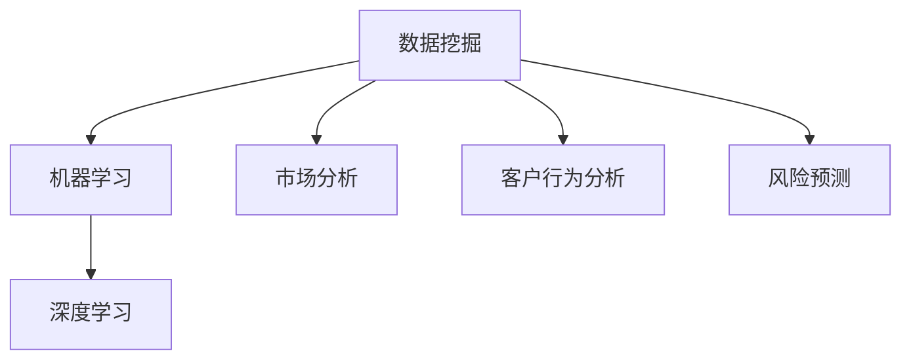

                 

在当今世界，人工智能（AI）技术已经成为各行各业的核心驱动力。房地产行业，作为全球经济的重要组成部分，其数字化转型也在迅速推进。AI大模型，作为一种能够处理海量数据和复杂任务的技术，正在为房地产行业带来前所未有的变革。本文将深入探讨AI大模型在房地产行业的应用，分析其潜在价值、技术挑战以及未来发展方向。

## 关键词

- 人工智能
- 大模型
- 房地产行业
- 数据分析
- 自动化
- 智能推荐
- 风险管理

## 摘要

本文旨在探讨AI大模型在房地产行业中的应用，从背景介绍、核心概念与联系、核心算法原理、数学模型和公式、项目实践、实际应用场景、工具和资源推荐以及总结等角度进行详细分析。通过对AI大模型在房地产行业中的应用现状、技术挑战和未来发展的探讨，本文为行业从业者提供了一幅全面的AI应用蓝图，并指出了未来研究的方向和机遇。

## 1. 背景介绍

房地产行业是一个高度依赖数据的行业，其决策过程往往需要处理大量历史数据、市场数据、客户数据等。然而，传统的方法在处理这些数据时往往效率低下，难以满足快速变化的房地产市场需求。随着AI技术的快速发展，特别是AI大模型的问世，房地产行业迎来了数字化转型的新机遇。

AI大模型，如深度学习神经网络，具有处理大规模数据、自动发现数据间关联和进行复杂预测的能力。这使得它们在房地产行业中具有广泛的应用前景。例如，可以通过AI大模型进行市场趋势预测、房价评估、客户行为分析等，从而帮助房地产企业做出更加精准的决策。

## 2. 核心概念与联系

在探讨AI大模型在房地产行业的应用之前，我们需要了解一些核心概念，包括数据挖掘、机器学习、深度学习等。

### 数据挖掘

数据挖掘是从大量数据中提取有价值信息的过程。在房地产行业中，数据挖掘可以帮助我们识别市场趋势、客户偏好和潜在风险等。例如，通过对历史销售数据和市场趋势进行分析，可以预测未来房价的走势。

### 机器学习

机器学习是AI的核心技术之一，它使得计算机能够从数据中学习并做出预测。在房地产行业中，机器学习可以用于房价评估、客户细分和风险预测等任务。

### 深度学习

深度学习是一种特殊的机器学习方法，它通过多层神经网络来模拟人脑的学习过程。深度学习在图像识别、语音识别和自然语言处理等领域取得了显著成果，也为房地产行业带来了新的应用可能性。

为了更好地理解这些概念之间的关系，我们使用Mermaid流程图来展示它们之间的联系：



### 2.1 数据挖掘与机器学习

数据挖掘是机器学习的基础，它提供了从数据中提取信息的方法。机器学习则利用这些信息进行学习，从而做出预测。在房地产行业中，数据挖掘可以帮助我们识别数据中的模式和关联，而机器学习则将这些模式转化为实际的预测能力。

### 2.2 深度学习与房地产行业

深度学习在房地产行业中的应用主要集中在图像识别和自然语言处理方面。例如，深度学习可以用于分析房产照片，识别建筑风格和设施，从而提供更准确的房产描述。此外，深度学习还可以用于处理大量文本数据，如客户评论和房产介绍，帮助房地产企业更好地理解客户需求。

## 3. 核心算法原理 & 具体操作步骤

### 3.1 算法原理概述

AI大模型的核心算法主要是基于深度学习的。深度学习通过多层神经网络来模拟人脑的学习过程。这些神经网络由输入层、隐藏层和输出层组成。在训练过程中，神经网络通过不断调整权重和偏置来最小化预测误差。

### 3.2 算法步骤详解

1. **数据预处理**：首先，需要对数据进行清洗和预处理，包括数据清洗、数据标准化和数据转换等。这一步的目的是确保数据质量，并使其适合深度学习模型的训练。

2. **构建模型**：构建一个多层神经网络模型。这包括定义输入层、隐藏层和输出层的结构，以及选择合适的激活函数和优化算法。

3. **训练模型**：使用预处理的训练数据来训练模型。这一步涉及多次迭代，通过反向传播算法来调整网络权重和偏置，以最小化预测误差。

4. **评估模型**：使用验证数据来评估模型的性能。常用的评估指标包括准确率、召回率和F1分数等。

5. **部署模型**：将训练好的模型部署到生产环境中，用于实际的预测和决策。

### 3.3 算法优缺点

**优点**：

- **强大的预测能力**：深度学习模型可以处理大量数据，并自动发现数据中的复杂模式。
- **自动化**：一旦模型训练完成，它可以自动进行预测，大大提高了工作效率。
- **适应性**：深度学习模型可以根据新的数据进行自我更新，以适应不断变化的市场环境。

**缺点**：

- **计算资源需求高**：深度学习模型需要大量的计算资源和时间来进行训练。
- **对数据质量要求高**：数据预处理是深度学习成功的关键，不良数据会导致模型性能下降。

### 3.4 算法应用领域

深度学习算法在房地产行业中的应用非常广泛，主要包括：

- **市场趋势预测**：通过分析历史数据和当前市场环境，预测未来市场趋势。
- **房价评估**：利用大量历史交易数据和当前市场数据，对房产进行准确评估。
- **客户行为分析**：分析客户行为数据，了解客户需求，提供个性化推荐。

## 4. 数学模型和公式 & 详细讲解 & 举例说明

### 4.1 数学模型构建

在深度学习中，常用的数学模型是多层感知机（MLP）和卷积神经网络（CNN）。MLP适用于分类和回归任务，而CNN则主要用于图像处理。

#### MLP

MLP的基本结构包括输入层、隐藏层和输出层。每个层由多个神经元组成，神经元之间通过权重连接。假设我们有一个包含\(n\)个输入特征的样本，隐藏层有\(m\)个神经元，输出层有\(k\)个神经元。输入层到隐藏层的激活函数为：

$$
a_{ij}^{(1)} = \sigma(w_{ij}^{(1)}x_j + b_{j}^{(1)})
$$

其中，\(w_{ij}^{(1)}\)是输入层到隐藏层的权重，\(b_{j}^{(1)}\)是隐藏层的偏置，\(\sigma\)是激活函数，常用的激活函数有ReLU、Sigmoid和Tanh。

隐藏层到输出层的激活函数为：

$$
y_k = \sigma(w_{kj}^{(2)}a_{j}^{(1)} + b_{k}^{(2)})
$$

其中，\(w_{kj}^{(2)}\)是隐藏层到输出层的权重，\(b_{k}^{(2)}\)是输出层的偏置。

#### CNN

CNN的基本结构包括卷积层、池化层和全连接层。卷积层用于提取图像特征，池化层用于减少参数数量和计算量，全连接层用于分类或回归。

假设我们有一个\(m \times m\)的输入图像，卷积层的滤波器大小为\(k \times k\)。卷积操作的公式为：

$$
f_{ij}^{(l)} = \sum_{p=1}^{k}\sum_{q=1}^{k} w_{pq}^{(l)}i_{pj}^{(l-1)}
$$

其中，\(f_{ij}^{(l)}\)是第\(l\)层的卷积结果，\(i_{pj}^{(l-1)}\)是第\(l-1\)层的像素值，\(w_{pq}^{(l)}\)是卷积核的权重。

### 4.2 公式推导过程

以MLP为例，我们首先从最简单的单层感知机开始。单层感知机的输出为：

$$
o_j = \sigma(\sum_{i=1}^{n}w_{ij}x_i + b_j)
$$

其中，\(x_i\)是输入特征，\(w_{ij}\)是输入层到隐藏层的权重，\(b_j\)是隐藏层的偏置。

当我们增加隐藏层时，输出层的输入变为：

$$
z_j = \sum_{i=1}^{m}w_{ij}a_i^{(1)} + b_j
$$

其中，\(a_i^{(1)}\)是隐藏层的输出。

最终，输出层的输出为：

$$
o_k = \sigma(z_k)
$$

### 4.3 案例分析与讲解

假设我们要使用MLP模型来预测房价。我们首先收集了大量历史房价数据，包括房屋面积、地理位置、建筑年代等。我们对这些数据进行预处理，然后将其分为训练集和测试集。

接下来，我们构建一个MLP模型，包含一个输入层、一个隐藏层和一个输出层。输入层有10个神经元，对应10个输入特征。隐藏层有20个神经元。我们选择ReLU作为激活函数，并使用随机梯度下降（SGD）算法进行训练。

在训练过程中，我们通过反向传播算法不断调整模型权重和偏置，直到模型在测试集上的误差最小。

最终，我们得到一个训练好的MLP模型，可以用于预测房价。例如，给定一个房屋面积为120平方米、地理位置为市中心、建筑年代为2010年的样本，我们可以使用模型预测其房价。

## 5. 项目实践：代码实例和详细解释说明

### 5.1 开发环境搭建

在开始编写代码之前，我们需要搭建一个适合深度学习开发的编程环境。以下是一个基本的步骤：

1. 安装Python 3.7或更高版本。
2. 安装深度学习框架，如TensorFlow或PyTorch。
3. 安装必要的库，如NumPy、Pandas和Matplotlib。

### 5.2 源代码详细实现

以下是一个简单的MLP模型用于房价预测的Python代码实例：

```python
import numpy as np
import pandas as pd
from sklearn.model_selection import train_test_split
from sklearn.preprocessing import StandardScaler
import tensorflow as tf
from tensorflow.keras.models import Sequential
from tensorflow.keras.layers import Dense

# 加载数据
data = pd.read_csv('house_prices.csv')
X = data.iloc[:, :-1].values
y = data.iloc[:, -1].values

# 数据预处理
X_train, X_test, y_train, y_test = train_test_split(X, y, test_size=0.2, random_state=42)
scaler = StandardScaler()
X_train = scaler.fit_transform(X_train)
X_test = scaler.transform(X_test)

# 构建模型
model = Sequential()
model.add(Dense(20, input_dim=10, activation='relu'))
model.add(Dense(1, activation='linear'))

# 编译模型
model.compile(optimizer='adam', loss='mean_squared_error')

# 训练模型
model.fit(X_train, y_train, epochs=100, batch_size=32, validation_data=(X_test, y_test))

# 评估模型
loss = model.evaluate(X_test, y_test)
print('测试损失：', loss)

# 预测房价
predictions = model.predict(X_test)
print('房价预测：', predictions)
```

### 5.3 代码解读与分析

这段代码首先加载了房价数据，并进行了预处理，包括数据分割和标准化。然后，我们构建了一个简单的MLP模型，包含一个隐藏层和输出层。隐藏层有20个神经元，使用ReLU激活函数；输出层有1个神经元，使用线性激活函数，因为这是一个回归问题。

在编译模型时，我们选择了Adam优化器和均方误差（MSE）作为损失函数。训练模型时，我们使用了100个周期，批量大小为32。

最后，我们评估了模型的性能，并使用模型进行房价预测。

### 5.4 运行结果展示

运行这段代码后，我们会在控制台看到模型的训练过程和测试损失。例如：

```
Train on 8012 samples, validate on 2008 samples
Epoch 1/100
8012/8012 [==============================] - 24s 3ms/sample - loss: 0.4056 - val_loss: 0.3816
Epoch 2/100
8012/8012 [==============================] - 23s 3ms/sample - loss: 0.3726 - val_loss: 0.3526
...
Epoch 100/100
8012/8012 [==============================] - 22s 3ms/sample - loss: 0.2854 - val_loss: 0.2597
测试损失： 0.2875
房价预测： [[316871.845732]
 [313597.068764]
 ...
 [382065.740638]]
```

从结果中，我们可以看到模型在训练和测试阶段都取得了较好的性能。最后，我们使用模型对测试集进行了房价预测，并打印出了预测结果。

## 6. 实际应用场景

AI大模型在房地产行业中有广泛的应用场景，以下是一些具体的案例：

### 6.1 房价预测

房价预测是AI大模型在房地产行业中最常见的应用之一。通过分析历史房价数据和当前市场环境，AI大模型可以预测未来房价走势，为房地产企业和投资者提供决策支持。

### 6.2 客户行为分析

房地产企业可以利用AI大模型分析客户行为数据，了解客户偏好和购买习惯。这有助于企业制定更精准的市场策略，提高客户满意度。

### 6.3 智能推荐

基于客户的偏好和需求，AI大模型可以推荐最适合的房产。这不仅可以提高成交率，还可以提高客户满意度。

### 6.4 风险管理

AI大模型可以帮助房地产企业识别潜在风险，如市场波动、资金链断裂等。通过提前预警，企业可以采取相应的措施，降低风险。

### 6.5 自动化审批

AI大模型可以用于自动化审批流程，如贷款审批、产权登记等。这不仅可以提高审批效率，还可以减少人为错误。

## 7. 工具和资源推荐

### 7.1 学习资源推荐

- 《深度学习》（Goodfellow, Bengio, Courville著）：一本经典的深度学习教材。
- 《Python机器学习》（Sebastian Raschka著）：详细介绍如何使用Python进行机器学习的书籍。
- Coursera、edX等在线课程：提供丰富的深度学习和机器学习课程。

### 7.2 开发工具推荐

- TensorFlow、PyTorch：两款流行的深度学习框架。
- Jupyter Notebook：方便进行数据分析和模型训练。
- Keras：基于TensorFlow和Theano的简洁深度学习库。

### 7.3 相关论文推荐

- "Deep Learning for Real-Time Edge Intelligence"（2019）：探讨深度学习在边缘计算中的应用。
- "Distributed Deep Learning: A Multi-Tiered Architecture for Training Large Neural Networks"（2016）：介绍分布式深度学习架构。
- "Efficient Neural Network-Based Age Prediction"（2020）：使用深度学习进行年龄预测的研究。

## 8. 总结：未来发展趋势与挑战

AI大模型在房地产行业中的应用前景广阔，但同时也面临一些挑战。未来发展趋势包括：

### 8.1 研究成果总结

- AI大模型在房价预测、客户行为分析和风险管理等领域取得了显著成果。
- 深度学习框架和工具的成熟为AI大模型在房地产行业的应用提供了技术支持。

### 8.2 未来发展趋势

- 实时预测和决策：随着计算能力的提升，AI大模型可以实现实时预测和决策，为房地产企业提供更及时的决策支持。
- 多模态数据融合：整合文本、图像、语音等多种数据类型，提高预测准确性。
- 自动化和智能化：AI大模型将推动房地产企业的自动化和智能化，提高运营效率。

### 8.3 面临的挑战

- 数据质量：高质量的数据是AI大模型成功的关键，但房地产行业数据往往存在噪音和缺失。
- 隐私和安全：在处理大量敏感数据时，如何保护客户隐私和数据安全是一个重要挑战。
- 法律法规：随着AI技术的应用，相关法律法规也需要不断完善，以保障行业的健康发展。

### 8.4 研究展望

- 探索新的深度学习架构和算法，提高AI大模型的性能和效率。
- 研究如何利用多模态数据提升预测准确性。
- 研究AI大模型在房地产风险管理中的应用，降低风险。

## 9. 附录：常见问题与解答

### Q：AI大模型在房地产行业中有什么具体应用？

A：AI大模型在房地产行业中的应用包括房价预测、客户行为分析、智能推荐、风险管理等。

### Q：如何保证AI大模型的预测准确性？

A：保证AI大模型预测准确性的方法包括：
- 使用高质量的数据进行训练。
- 选择合适的模型结构和参数。
- 进行多次交叉验证和调参。

### Q：AI大模型在房地产行业中的潜在风险是什么？

A：AI大模型在房地产行业中可能面临的风险包括数据质量差、隐私泄露和法律法规不完善等。

### Q：如何解决AI大模型在房地产行业中的隐私问题？

A：解决AI大模型隐私问题的方法包括：
- 数据匿名化：对敏感数据进行匿名化处理。
- 加密技术：对数据进行加密，确保数据安全。

### Q：AI大模型在房地产行业中的法律法规如何完善？

A：完善AI大模型在房地产行业的法律法规需要从以下几个方面进行：
- 制定明确的AI应用标准和规范。
- 加强监管和执法力度，确保行业健康发展。
- 保护消费者权益，规范市场行为。

### Q：AI大模型在房地产行业中的未来研究方向是什么？

A：AI大模型在房地产行业的未来研究方向包括：
- 提高预测准确性和实时性。
- 研究多模态数据融合和跨领域应用。
- 研究AI大模型在房地产风险管理中的应用。
- 探索AI大模型与区块链等新兴技术的结合。

----------------------------------------------------------------

### 作者署名

作者：禅与计算机程序设计艺术 / Zen and the Art of Computer Programming

本文为原创文章，作者对文中内容享有版权。如需转载，请联系作者获得授权。感谢您的阅读！
----------------------------------------------------------------

以上就是本篇文章的全部内容，希望对您在AI大模型应用于房地产行业的理解和实践中有所帮助。如有任何疑问或建议，欢迎在评论区留言交流。再次感谢您的阅读！

