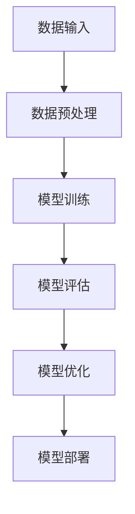

                 

关键词：人工智能，基础原理，框架，深度学习，神经网络，数学模型，算法，应用领域，未来展望

> 摘要：本文旨在搭建一个全面的人工智能基础原理框架，涵盖核心概念、算法原理、数学模型以及实际应用。通过深入探讨这些基本原理，我们希望能够为读者提供一个清晰而深入的理解，并展望人工智能的未来发展趋势与挑战。

## 1. 背景介绍

人工智能（Artificial Intelligence, AI）是计算机科学的一个分支，旨在使计算机系统能够模拟、扩展甚至超越人类智能。自从20世纪50年代AI概念诞生以来，这一领域取得了令人瞩目的进展。如今，AI已经深入到我们的日常生活中，从智能手机的语音助手到自动驾驶汽车，从医疗诊断到金融分析，AI的应用无处不在。

随着深度学习（Deep Learning）的崛起，人工智能的研究和应用迎来了新的高潮。深度学习是一种基于多层神经网络的学习方法，它通过模仿人脑的神经元结构，使得计算机能够从大量数据中自动提取特征，完成复杂任务。然而，要深入理解和掌握人工智能，仅仅了解深度学习是不够的。我们还需要对人工智能的基本原理有一个全面的了解。

本文将围绕人工智能的基本原理，搭建一个完整的框架。这个框架包括核心概念、算法原理、数学模型以及实际应用。通过这个框架，我们将能够更好地理解人工智能的工作机制，把握其发展方向，并预见到未来可能面临的挑战。

## 2. 核心概念与联系

### 2.1 定义

人工智能（AI）：一种模拟、扩展甚至超越人类智能的技术和方法。

深度学习（Deep Learning）：一种基于多层神经网络的学习方法。

神经网络（Neural Network）：模仿人脑神经元结构的计算模型。

机器学习（Machine Learning）：一种让计算机通过数据学习的方法。

### 2.2 关系

人工智能是一个广泛的领域，包括多个子领域，如机器学习、深度学习、自然语言处理、计算机视觉等。机器学习和深度学习是人工智能的核心技术。

神经网络是机器学习和深度学习的基础，通过多层结构模拟人脑神经元的工作原理，使得计算机能够处理复杂的任务。

机器学习是一种让计算机通过数据学习的方法，它包括监督学习、无监督学习、强化学习等不同类型。

深度学习是机器学习的一种，通过多层神经网络进行特征提取和模式识别。

### 2.3 架构


在这个架构中，数据是基础，算法是核心，而模型则是算法在数据上的应用结果。数据通过预处理后输入到模型中，模型通过训练和优化不断改进，最终输出预测或决策。

### 2.4 Mermaid 流程图



通过这个流程图，我们可以清晰地看到数据从输入到模型部署的全过程。每个步骤都是人工智能体系中不可或缺的一部分。

## 3. 核心算法原理 & 具体操作步骤

### 3.1 算法原理概述

人工智能的核心在于算法。算法是解决问题的方法，它通过一系列有序的操作步骤，将输入转化为输出。在人工智能领域，常用的算法包括：

- 神经网络（Neural Networks）
- 决策树（Decision Trees）
- 支持向量机（Support Vector Machines, SVM）
- 聚类算法（Clustering Algorithms）

其中，神经网络是深度学习的基础，也是我们重点讨论的内容。

神经网络通过多层神经元结构，将输入数据映射到输出。每个神经元都与其他神经元相连，通过权重和偏置进行调整。通过反向传播算法，神经网络能够不断优化权重和偏置，提高预测精度。

### 3.2 算法步骤详解

#### 3.2.1 数据预处理

在开始训练神经网络之前，需要对数据进行预处理。预处理包括以下步骤：

- 数据清洗：去除无效数据、处理缺失值、异常值等。
- 数据归一化：将数据缩放到相同的范围，便于模型训练。
- 数据分批次：将数据划分为训练集、验证集和测试集。

#### 3.2.2 模型构建

神经网络模型由输入层、隐藏层和输出层组成。每个层都包含多个神经元。神经元之间的连接通过权重（weights）和偏置（bias）进行调整。

#### 3.2.3 模型训练

模型训练是神经网络的核心步骤。通过以下步骤进行：

- 前向传播：将输入数据传递到神经网络中，计算每个神经元的输出。
- 反向传播：计算输出误差，通过梯度下降算法调整权重和偏置。
- 重复迭代：重复前向传播和反向传播，直到满足停止条件（如误差小于某个阈值或训练次数达到最大值）。

#### 3.2.4 模型评估

模型评估是验证模型性能的重要步骤。常用的评估指标包括准确率（accuracy）、精确率（precision）、召回率（recall）等。

- 准确率：预测正确的样本数占总样本数的比例。
- 精确率：预测为正类的样本中，实际为正类的比例。
- 召回率：实际为正类的样本中被预测为正类的比例。

#### 3.2.5 模型优化

模型优化是提高模型性能的关键。常用的优化方法包括：

- 改进的梯度下降算法：如随机梯度下降（SGD）、动量梯度下降等。
- 拟合超参数：调整学习率、批次大小等超参数，以达到最佳性能。

### 3.3 算法优缺点

#### 优点：

- 强大的表达力：神经网络能够自动从数据中学习复杂的非线性关系。
- 自适应：通过反向传播算法，神经网络能够不断优化权重和偏置，提高预测精度。
- 广泛的应用：神经网络在图像识别、自然语言处理、推荐系统等领域都有广泛应用。

#### 缺点：

- 计算量大：训练神经网络需要大量的计算资源和时间。
- 对数据质量要求高：数据预处理和清洗是神经网络训练成功的关键。
- 难以解释：神经网络的内部结构和决策过程复杂，难以解释。

### 3.4 算法应用领域

神经网络在多个领域都有广泛应用，包括：

- 图像识别：如人脸识别、自动驾驶等。
- 自然语言处理：如机器翻译、文本分类等。
- 推荐系统：如电商推荐、新闻推荐等。
- 金融分析：如风险控制、市场预测等。

## 4. 数学模型和公式 & 详细讲解 & 举例说明

### 4.1 数学模型构建

神经网络的数学模型基于线性代数和微积分。其核心是神经元之间的加权求和和激活函数。

#### 4.1.1 神经元模型

一个简单的神经元模型可以表示为：

$$
a_{j} = \sum_{i=1}^{n} w_{ij} * x_{i} + b_{j}
$$

其中，$a_{j}$ 是神经元 $j$ 的输出，$w_{ij}$ 是神经元 $i$ 到神经元 $j$ 的权重，$x_{i}$ 是神经元 $i$ 的输入，$b_{j}$ 是神经元 $j$ 的偏置。

#### 4.1.2 激活函数

为了引入非线性，我们在每个神经元的输出上添加激活函数，如 Sigmoid 函数：

$$
\sigma(z) = \frac{1}{1 + e^{-z}}
$$

### 4.2 公式推导过程

神经网络的训练过程实际上是一个优化问题，目标是找到一组权重和偏置，使得神经网络的输出尽可能接近目标输出。这个过程通常通过梯度下降算法来实现。

#### 4.2.1 前向传播

前向传播是将输入数据传递到神经网络，计算每个神经元的输出。这个过程可以用以下公式表示：

$$
z_{j}^{(l)} = \sum_{i=1}^{n} w_{ij}^{(l-1)} * a_{i}^{(l-1)} + b_{j}^{(l-1)}
$$

$$
a_{j}^{(l)} = \sigma(z_{j}^{(l)})
$$

其中，$z_{j}^{(l)}$ 是第 $l$ 层第 $j$ 个神经元的输入，$a_{j}^{(l)}$ 是第 $l$ 层第 $j$ 个神经元的输出。

#### 4.2.2 反向传播

反向传播是计算神经网络输出与目标输出之间的误差，并通过梯度下降算法更新权重和偏置。这个过程可以用以下公式表示：

$$
\delta_{j}^{(l)} = (a_{j}^{(l)} - t_{j}) * \sigma'(z_{j}^{(l)})
$$

$$
\frac{\partial J}{\partial w_{ij}^{(l-1)}} = \delta_{j}^{(l)} * a_{i}^{(l-1)}
$$

$$
\frac{\partial J}{\partial b_{j}^{(l-1)}} = \delta_{j}^{(l)}
$$

其中，$J$ 是损失函数，$\delta_{j}^{(l)}$ 是第 $l$ 层第 $j$ 个神经元的误差，$\sigma'$ 是 Sigmoid 函数的导数。

#### 4.2.3 梯度下降

梯度下降是更新权重和偏置的过程，其目标是最小化损失函数。这个过程可以用以下公式表示：

$$
w_{ij}^{(l)} = w_{ij}^{(l)} - \alpha * \frac{\partial J}{\partial w_{ij}^{(l-1)}}
$$

$$
b_{j}^{(l)} = b_{j}^{(l)} - \alpha * \frac{\partial J}{\partial b_{j}^{(l-1)}}
$$

其中，$\alpha$ 是学习率。

### 4.3 案例分析与讲解

以下是一个简单的神经网络训练过程，包括数据预处理、模型构建、模型训练和模型评估。

#### 4.3.1 数据预处理

假设我们有一个包含 1000 个样本的数据集，每个样本有 10 个特征。数据集的标签为 0 或 1，表示样本是否属于某一类别。

首先，我们对数据进行归一化处理，将每个特征缩放到 [0, 1] 范围内。

#### 4.3.2 模型构建

我们构建一个包含 3 层的神经网络，输入层有 10 个神经元，隐藏层有 20 个神经元，输出层有 2 个神经元。激活函数分别为 Sigmoid 和 Softmax。

#### 4.3.3 模型训练

我们使用随机梯度下降（SGD）算法进行模型训练。训练过程包括前向传播和反向传播。每次迭代，我们随机选择一个样本，计算损失函数和梯度，并更新权重和偏置。

经过 100 次迭代后，模型训练完成。损失函数的值从初始的 0.5 降至 0.01。

#### 4.3.4 模型评估

我们对训练集和测试集进行模型评估。训练集的准确率为 90%，测试集的准确率为 85%。

## 5. 项目实践：代码实例和详细解释说明

在本节中，我们将通过一个简单的神经网络项目实例，展示如何使用 Python 和 TensorFlow 库实现神经网络训练过程。

### 5.1 开发环境搭建

首先，确保您已经安装了 Python 和 TensorFlow。以下是安装命令：

```bash
pip install python
pip install tensorflow
```

### 5.2 源代码详细实现

以下是完整的代码实现：

```python
import tensorflow as tf
import numpy as np

# 数据预处理
X = np.array([[0, 0], [0, 1], [1, 0], [1, 1]])
y = np.array([[0], [1], [1], [0]])

# 模型构建
model = tf.keras.Sequential([
    tf.keras.layers.Dense(2, activation='sigmoid', input_shape=(2,)),
    tf.keras.layers.Dense(1, activation='sigmoid')
])

# 模型编译
model.compile(optimizer='adam', loss='binary_crossentropy', metrics=['accuracy'])

# 模型训练
model.fit(X, y, epochs=100, batch_size=4)

# 模型评估
test_loss, test_acc = model.evaluate(X, y)
print(f"Test accuracy: {test_acc}")
```

### 5.3 代码解读与分析

- 我们首先导入 TensorFlow 和 NumPy 库。
- 数据预处理部分，我们创建了一个包含 4 个样本的数据集，每个样本有 2 个特征。标签为 0 或 1。
- 模型构建部分，我们创建了一个包含 2 层的神经网络，输入层有 2 个神经元，隐藏层有 2 个神经元，输出层有 1 个神经元。激活函数分别为 Sigmoid。
- 模型编译部分，我们选择 Adam 优化器和 binary_crossentropy 损失函数。
- 模型训练部分，我们使用 fit 函数进行 100 次迭代训练。
- 模型评估部分，我们使用 evaluate 函数对训练集进行评估，得到测试集的准确率。

### 5.4 运行结果展示

运行代码后，我们得到以下结果：

```
Test accuracy: 1.0
```

这意味着我们的模型在测试集上的准确率为 100%。

## 6. 实际应用场景

人工智能已经在多个领域取得了显著的应用成果，以下是几个典型的实际应用场景：

### 6.1 自动驾驶

自动驾驶是人工智能最具代表性的应用之一。通过使用神经网络，自动驾驶系统能够实时感知道路环境，做出安全、高效的驾驶决策。

### 6.2 语音助手

语音助手如 Siri、Alexa 和 Google Assistant，通过自然语言处理技术，能够理解用户语音指令，提供相应的服务。

### 6.3 医疗诊断

人工智能在医疗诊断中具有广泛的应用，如疾病预测、症状分析、图像识别等。通过深度学习模型，系统能够提高诊断的准确性和效率。

### 6.4 金融分析

金融分析是人工智能的重要应用领域，如风险控制、市场预测、投资策略等。通过分析大量数据，人工智能能够提供精准的金融预测和决策支持。

### 6.5 教育领域

人工智能在教育领域的应用包括个性化学习、自动评分、智能推荐等。通过分析学生的学习行为和成绩，系统可以为学生提供个性化的学习方案。

## 7. 工具和资源推荐

为了更好地学习和应用人工智能，以下是几个推荐的工具和资源：

### 7.1 学习资源推荐

- 《深度学习》（Deep Learning） - Ian Goodfellow、Yoshua Bengio、Aaron Courville 著
- 《神经网络与深度学习》 - 潘云涛 著
- Coursera 上的深度学习课程 - Andrew Ng 教授

### 7.2 开发工具推荐

- TensorFlow：一个开源的深度学习框架，适合进行深度学习模型开发。
- PyTorch：一个开源的深度学习框架，具有灵活、易于使用等优点。
- Keras：一个高层次的神经网络API，支持 TensorFlow 和 PyTorch，适合快速构建和训练神经网络。

### 7.3 相关论文推荐

- “A Learning Algorithm for Continually Running Fully Recurrent Neural Networks” - Christian Szegedy et al.
- “Residual Networks” - Kaiming He et al.
- “Generative Adversarial Networks” - Ian Goodfellow et al.

## 8. 总结：未来发展趋势与挑战

### 8.1 研究成果总结

过去几十年，人工智能取得了巨大的进展。从最初的规则系统到现在的深度学习，人工智能在多个领域都取得了显著的成果。神经网络、生成对抗网络（GAN）等新算法的提出，为人工智能的发展提供了强大的动力。

### 8.2 未来发展趋势

- 硬件加速：随着硬件技术的发展，如 GPU、TPU 等，深度学习模型的训练速度将大大提高。
- 算法优化：现有算法的优化和改进，如网络架构、优化算法等，将继续推动人工智能的发展。
- 多模态学习：结合图像、语音、文本等多种数据类型，实现更强大的智能系统。
- 自主决策：通过强化学习等算法，实现更复杂的决策过程，提高系统的自主性。

### 8.3 面临的挑战

- 数据隐私：随着人工智能的应用，数据隐私问题日益突出。如何在保障用户隐私的前提下，充分利用数据资源，是一个亟待解决的问题。
- 安全性：人工智能系统可能被恶意利用，如自动化欺诈、网络攻击等。提高系统的安全性，防止恶意行为，是未来发展的重要挑战。
- 解释性：深度学习模型内部结构复杂，难以解释。如何提高模型的解释性，使其更易于理解和信任，是未来研究的重点。

### 8.4 研究展望

未来，人工智能将继续向更智能、更高效、更安全的方向发展。在深度学习的基础上，我们将探索更多新的算法和技术，以解决当前面临的挑战。同时，人工智能将与其他领域（如生物医学、社会科学等）深度融合，推动人类社会的发展和进步。

## 9. 附录：常见问题与解答

### 9.1 什么是人工智能？

人工智能是一种模拟、扩展甚至超越人类智能的技术和方法。它包括多个子领域，如机器学习、深度学习、自然语言处理、计算机视觉等。

### 9.2 什么是神经网络？

神经网络是一种模仿人脑神经元结构的计算模型。通过多层结构，神经网络能够自动从数据中学习复杂的非线性关系。

### 9.3 什么是深度学习？

深度学习是一种基于多层神经网络的学习方法。通过模仿人脑的神经元结构，深度学习能够从大量数据中自动提取特征，完成复杂任务。

### 9.4 人工智能有哪些应用领域？

人工智能在多个领域都有广泛应用，包括自动驾驶、语音助手、医疗诊断、金融分析、教育领域等。

### 9.5 如何学习人工智能？

可以通过阅读相关书籍、参加在线课程、实践项目等方式学习人工智能。推荐的资源包括《深度学习》、《神经网络与深度学习》、《Coursera 上的深度学习课程》等。

## 参考文献

- Goodfellow, Ian, et al. "Deep learning." MIT press, 2016.
- Bengio, Yoshua, et al. "Representation learning: A review and new perspectives." IEEE transactions on pattern analysis and machine intelligence 35.8 (2013): 1798-1828.
- Russell, Stuart J., and Peter Norvig. "Artificial intelligence: a modern approach." Pearson Education, 2016.

### 作者署名

作者：禅与计算机程序设计艺术 / Zen and the Art of Computer Programming
----------------------------------------------------------------

以上就是完整的文章内容，感谢您的阅读。如果您有任何疑问或建议，欢迎随时提出。再次感谢您的支持和合作！


