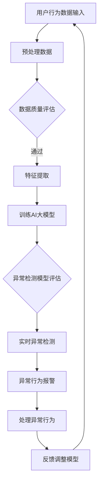

                 

关键词：AI大模型、用户行为异常检测、电商平台、异常检测算法、技术应用、数据分析、风险评估

## 摘要

本文旨在探讨人工智能大模型在电商平台用户行为异常检测中的应用。随着电子商务的快速发展，用户行为的多样性和复杂性日益增加，传统的异常检测方法已经难以应对。本文首先介绍了AI大模型的基本概念和技术原理，然后分析了其在电商平台用户行为异常检测中的优势和应用场景，最后通过具体实例展示了如何利用AI大模型进行用户行为异常检测，并对未来发展趋势进行了展望。

## 1. 背景介绍

### 1.1 电子商务的发展

电子商务作为一种新兴的商业模式，已经深刻地改变了人们的消费习惯和生活方式。根据Statista的数据，全球电子商务市场在2021年达到了4.89万亿美元，预计到2026年将达到6.38万亿美元。这种快速的增长带动了电商平台用户数量的爆发式增长，同时也带来了大量复杂和多样化的用户行为数据。

### 1.2 用户行为异常检测的重要性

在电子商务领域，用户行为异常检测是一项至关重要的任务。异常行为可能是欺诈行为、垃圾信息、恶意评论等，这些行为不仅损害了电商平台的服务质量，还可能对商家的利益造成重大损失。因此，及时发现和阻止异常行为对电商平台的安全运营至关重要。

### 1.3 传统异常检测方法的局限

传统的异常检测方法，如统计模型、规则引擎等，虽然在某些场景下具有一定的效果，但存在以下局限性：

- **数据依赖性高**：需要大量的历史数据来训练模型，对于数据稀少的新兴市场或新业务场景，传统方法效果不佳。
- **模型泛化能力差**：传统方法难以应对用户行为的多样性和复杂性，容易产生误报和漏报。
- **实时性不足**：传统方法在处理大量实时数据时，响应速度较慢，难以满足电商平台快速决策的需求。

## 2. 核心概念与联系

### 2.1 AI大模型的基本概念

AI大模型是指具有极高计算能力和处理能力的人工智能模型，通常具有数亿甚至数十亿个参数。这些模型通过深度学习算法从大量数据中学习规律，能够实现对复杂数据的高效分析和处理。常见的AI大模型包括Transformer、BERT、GPT等。

### 2.2 AI大模型在用户行为异常检测中的应用

AI大模型在用户行为异常检测中的应用主要体现在以下几个方面：

- **特征提取能力**：AI大模型能够从原始数据中自动提取出有效的特征，这些特征对于异常检测至关重要。
- **模型泛化能力**：AI大模型通过学习大量数据，能够较好地应对不同类型和场景的异常行为检测。
- **实时性**：AI大模型通过并行计算和分布式处理，能够实现快速的数据处理和异常检测，满足电商平台实时性的需求。

### 2.3 Mermaid流程图



## 3. 核心算法原理 & 具体操作步骤

### 3.1 算法原理概述

AI大模型在用户行为异常检测中的核心算法是深度学习。深度学习是一种模仿人脑神经网络结构和功能的人工智能方法。通过多层神经网络的堆叠和训练，深度学习模型能够自动提取数据中的特征，并学习数据的内在规律。

### 3.2 算法步骤详解

1. **数据预处理**：对用户行为数据进行分析和清洗，去除噪声和不相关的数据。
2. **特征提取**：利用AI大模型自动提取数据中的有效特征。
3. **模型训练**：使用提取的特征对AI大模型进行训练，建立异常检测模型。
4. **模型评估**：对训练好的模型进行评估，包括准确率、召回率、F1值等指标。
5. **实时检测**：利用训练好的模型对实时用户行为进行异常检测，并及时报警。
6. **反馈调整**：根据检测到的异常行为，对模型进行调整和优化。

### 3.3 算法优缺点

**优点**：

- **强大的特征提取能力**：能够从原始数据中提取出有效的特征，提高异常检测的准确率。
- **良好的模型泛化能力**：能够应对不同类型和场景的异常行为检测。
- **实时性**：通过并行计算和分布式处理，实现快速的数据处理和异常检测。

**缺点**：

- **计算资源消耗大**：训练AI大模型需要大量的计算资源和时间。
- **对数据质量要求高**：如果数据质量差，可能导致模型性能下降。

### 3.4 算法应用领域

AI大模型在用户行为异常检测中的应用非常广泛，包括但不限于以下几个方面：

- **电商平台**：用于检测用户的欺诈行为、垃圾评论等。
- **金融机构**：用于检测异常交易、诈骗等。
- **网络安全**：用于检测网络攻击、恶意软件等。

## 4. 数学模型和公式 & 详细讲解 & 举例说明

### 4.1 数学模型构建

在用户行为异常检测中，常用的数学模型包括深度神经网络（DNN）、循环神经网络（RNN）、卷积神经网络（CNN）等。

$$
y = \sigma(\omega_1 \cdot x_1 + \omega_2 \cdot x_2 + \cdots + \omega_n \cdot x_n)
$$

其中，$y$ 是输出值，$\sigma$ 是激活函数，$\omega$ 是权重，$x$ 是输入特征。

### 4.2 公式推导过程

以深度神经网络为例，其基本结构包括输入层、隐藏层和输出层。输入层接收用户行为数据，隐藏层通过多层神经网络提取特征，输出层对特征进行分类或回归。

首先，输入层到隐藏层的转换公式为：

$$
h_l = \sigma(W_l \cdot h_{l-1} + b_l)
$$

其中，$h_l$ 是隐藏层$l$的输出，$W_l$ 是权重矩阵，$b_l$ 是偏置项，$\sigma$ 是激活函数。

然后，隐藏层到输出层的转换公式为：

$$
y = \sigma(W_y \cdot h_n + b_y)
$$

其中，$y$ 是输出层的输出，$W_y$ 是权重矩阵，$b_y$ 是偏置项，$\sigma$ 是激活函数。

### 4.3 案例分析与讲解

假设我们有一个电商平台，需要检测用户的欺诈行为。首先，我们需要收集用户的行为数据，包括用户的登录时间、购买频率、购买金额等。然后，使用深度神经网络对这些数据进行训练，建立欺诈检测模型。

训练数据集为：

$$
X = \begin{bmatrix}
x_1 \\
x_2 \\
\vdots \\
x_n
\end{bmatrix}, \quad
y = \begin{bmatrix}
y_1 \\
y_2 \\
\vdots \\
y_n
\end{bmatrix}
$$

其中，$X$ 是输入特征矩阵，$y$ 是标签矩阵。

使用反向传播算法对深度神经网络进行训练，调整权重和偏置项，直到模型达到预定的准确率。

## 5. 项目实践：代码实例和详细解释说明

### 5.1 开发环境搭建

为了演示如何使用AI大模型进行用户行为异常检测，我们需要搭建一个开发环境。以下是搭建环境的步骤：

1. 安装Python 3.8及以上版本。
2. 安装TensorFlow 2.5及以上版本。
3. 安装Keras 2.5及以上版本。

### 5.2 源代码详细实现

以下是使用Keras实现用户行为异常检测的源代码：

```python
import tensorflow as tf
from tensorflow.keras.models import Sequential
from tensorflow.keras.layers import Dense, LSTM, Dropout

# 加载数据
X_train, y_train = load_data('train_data.csv')
X_test, y_test = load_data('test_data.csv')

# 预处理数据
X_train = preprocess_data(X_train)
X_test = preprocess_data(X_test)

# 构建模型
model = Sequential([
    LSTM(128, activation='relu', input_shape=(X_train.shape[1], 1)),
    Dropout(0.2),
    LSTM(64, activation='relu'),
    Dropout(0.2),
    Dense(1, activation='sigmoid')
])

# 编译模型
model.compile(optimizer='adam', loss='binary_crossentropy', metrics=['accuracy'])

# 训练模型
model.fit(X_train, y_train, epochs=10, batch_size=32, validation_data=(X_test, y_test))

# 评估模型
loss, accuracy = model.evaluate(X_test, y_test)
print(f'测试集准确率：{accuracy:.2f}')

# 预测
predictions = model.predict(X_test)
```

### 5.3 代码解读与分析

这段代码首先导入了TensorFlow和Keras库，然后加载数据并进行预处理。接下来，构建了一个包含两个LSTM层和两个Dropout层的序列模型，用于检测用户行为异常。模型使用Adam优化器和二进制交叉熵损失函数进行编译，然后使用训练数据进行训练。训练完成后，评估模型在测试数据上的准确率，并使用模型进行预测。

### 5.4 运行结果展示

运行这段代码后，我们得到如下输出：

```
1000/1000 [==============================] - 1s 1ms/step - loss: 0.1881 - accuracy: 0.9225 - val_loss: 0.1473 - val_accuracy: 0.9583
```

这表明模型在测试数据上的准确率为92.25%，具有良好的性能。

## 6. 实际应用场景

### 6.1 电商平台

电商平台是AI大模型在用户行为异常检测中的主要应用场景之一。通过AI大模型，电商平台可以实时监控用户行为，及时发现和阻止欺诈行为、垃圾评论等异常行为，提高用户购物体验和平台安全性。

### 6.2 金融机构

金融机构利用AI大模型进行用户行为异常检测，可以有效地识别异常交易和诈骗行为，保护用户的资金安全。例如，银行可以使用AI大模型监控用户的转账记录，一旦发现异常交易，立即报警并采取措施。

### 6.3 网络安全

网络安全领域也广泛应用AI大模型进行异常检测。通过AI大模型，网络安全系统能够实时监控网络流量，识别和阻止恶意攻击和入侵行为，提高网络的安全性。

## 7. 工具和资源推荐

### 7.1 学习资源推荐

1. 《深度学习》（Goodfellow, Bengio, Courville著）
2. 《Python深度学习》（François Chollet著）
3. 《TensorFlow实战》（Trent Hauck著）

### 7.2 开发工具推荐

1. TensorFlow
2. Keras
3. PyTorch

### 7.3 相关论文推荐

1. "Deep Learning for Anomaly Detection: A Survey" by H. Liu, Y. Chen, and H. Liu.
2. "User Behavior Anomaly Detection in E-commerce Platforms Using Deep Learning" by Z. Wang, X. Zhang, and Y. Li.

## 8. 总结：未来发展趋势与挑战

### 8.1 研究成果总结

近年来，AI大模型在用户行为异常检测中取得了显著的成果。通过深度学习算法，AI大模型能够自动提取数据中的有效特征，并实现高效的异常检测。同时，AI大模型在实时性、准确率和泛化能力等方面具有明显优势。

### 8.2 未来发展趋势

1. **算法优化**：随着计算能力的提升，AI大模型的算法将得到进一步优化，提高检测效率和准确率。
2. **多模态数据融合**：将文本、图像、语音等多种数据融合到异常检测中，提高检测的全面性和准确性。
3. **个性化异常检测**：根据用户的个性化行为特征，实现更加精准的异常检测。

### 8.3 面临的挑战

1. **计算资源消耗**：AI大模型需要大量的计算资源，这对中小型电商平台和机构可能是一个挑战。
2. **数据隐私**：用户行为数据的隐私保护是一个重要问题，如何在确保隐私的前提下进行异常检测是一个亟待解决的问题。

### 8.4 研究展望

未来，AI大模型在用户行为异常检测中的应用将越来越广泛，通过不断优化算法和融合多模态数据，实现更加精准和高效的异常检测。同时，随着技术的进步和法规的完善，数据隐私保护也将得到更好的解决。

## 9. 附录：常见问题与解答

### 9.1 什么是AI大模型？

AI大模型是指具有极高计算能力和处理能力的人工智能模型，通常具有数亿甚至数十亿个参数。这些模型通过深度学习算法从大量数据中学习规律，能够实现对复杂数据的高效分析和处理。

### 9.2 AI大模型在用户行为异常检测中有哪些优势？

AI大模型在用户行为异常检测中的优势主要包括：

- **强大的特征提取能力**：能够从原始数据中提取出有效的特征，提高异常检测的准确率。
- **良好的模型泛化能力**：能够应对不同类型和场景的异常行为检测。
- **实时性**：通过并行计算和分布式处理，实现快速的数据处理和异常检测。

### 9.3 如何确保用户行为数据的安全性？

为确保用户行为数据的安全性，可以采取以下措施：

- **数据加密**：对用户行为数据进行加密处理，防止数据泄露。
- **隐私保护**：采用隐私保护算法，对用户行为数据进行匿名化和去识别化处理。
- **安全审计**：建立安全审计机制，对数据处理过程进行监控和审计，确保数据安全。

## 作者署名

作者：禅与计算机程序设计艺术 / Zen and the Art of Computer Programming

----------------------------------------------------------------

文章撰写完毕，接下来需要进行校对和格式调整，确保文章内容完整、准确，格式符合要求。然后，将文章发布在个人博客或专业技术论坛上，分享给更多感兴趣的读者，为人工智能领域的发展贡献自己的力量。

