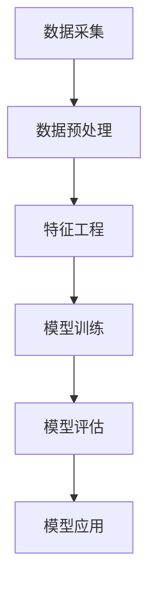

                 

关键词：大模型、用户购买力、电商平台、预测、人工智能、深度学习、数据挖掘、应用场景

## 摘要

本文主要探讨大模型在电商平台用户购买力预测中的潜力。随着电商行业的快速发展，用户购买行为的数据量呈现爆炸式增长，如何准确地预测用户的购买力成为电商平台亟待解决的问题。本文将介绍大模型的基本概念、应用场景，并深入探讨大模型在用户购买力预测中的原理、算法、数学模型、项目实践等方面，为电商平台提供一种新的预测工具和方法。

## 1. 背景介绍

### 1.1 电商平台的快速发展

随着互联网技术的不断进步和智能手机的普及，电商行业呈现出快速发展的趋势。根据统计数据，全球电商市场规模逐年扩大，预计到2025年将达到4万亿美元。在我国，电商行业已经成为国民经济的重要组成部分，年交易额屡创新高。电商平台的快速发展带来了大量的用户数据，这些数据中包含了用户购买行为、偏好、需求等信息。

### 1.2 用户购买力预测的重要性

用户购买力预测是电商平台运营的关键环节。通过预测用户的购买力，电商平台可以更好地制定营销策略，提高用户转化率和销售额。例如，在用户购买决策过程中，电商平台可以根据用户的购买行为和偏好，为其推荐合适的商品，从而提高用户购买意愿。此外，用户购买力预测还可以帮助电商平台优化库存管理、供应链管理等方面的运营策略。

### 1.3 大模型的崛起

近年来，随着人工智能技术的快速发展，大模型（Large Model）逐渐成为人工智能领域的研究热点。大模型通常是指具有数亿甚至数十亿参数的神经网络模型，具有较高的计算能力和表征能力。大模型在自然语言处理、计算机视觉、语音识别等领域取得了显著的成果，逐渐成为人工智能领域的重要研究方向。

## 2. 核心概念与联系

### 2.1 大模型的概念

大模型是一种具有数亿甚至数十亿参数的神经网络模型。与传统的神经网络模型相比，大模型具有更高的计算能力和表征能力，可以处理更复杂、更大量的数据。

### 2.2 电商平台用户购买力预测的架构

电商平台用户购买力预测的架构主要包括数据采集、数据预处理、特征工程、模型训练、模型评估和模型应用等环节。

### 2.3 Mermaid 流程图

下面是一个描述电商平台用户购买力预测架构的Mermaid流程图：



## 3. 核心算法原理 & 具体操作步骤

### 3.1 算法原理概述

电商平台用户购买力预测的核心算法通常是基于深度学习技术。深度学习模型通过学习大量用户数据，可以自动提取出用户购买行为和偏好等特征，从而实现对用户购买力的预测。

### 3.2 算法步骤详解

电商平台用户购买力预测的具体操作步骤如下：

1. 数据采集：收集电商平台的用户数据，包括用户购买记录、浏览记录、购物车记录等。
2. 数据预处理：对采集到的数据进行清洗、去噪、归一化等预处理操作，以减少数据中的噪声和异常值。
3. 特征工程：根据用户数据的特点，提取出对用户购买力预测有重要影响的特征，如用户年龄、性别、购买频率等。
4. 模型训练：使用预处理后的数据训练深度学习模型，如卷积神经网络（CNN）、循环神经网络（RNN）等。
5. 模型评估：使用验证集对训练好的模型进行评估，选择性能最好的模型。
6. 模型应用：将训练好的模型应用到实际场景中，对用户购买力进行预测。

### 3.3 算法优缺点

深度学习算法在电商平台用户购买力预测中具有以下优缺点：

- 优点：深度学习算法具有强大的表征能力，可以自动提取出用户数据中的潜在特征，从而提高预测准确性。
- 缺点：深度学习算法对数据量要求较高，需要大量的训练数据才能取得较好的效果。此外，深度学习算法的训练过程复杂，训练时间较长。

### 3.4 算法应用领域

深度学习算法在电商平台用户购买力预测中的应用领域包括：

- 商品推荐：根据用户购买行为和偏好，为用户推荐合适的商品。
- 客户流失预测：预测哪些用户可能会流失，以便电商平台采取相应的挽回措施。
- 库存管理：根据用户购买力预测结果，优化库存管理策略。

## 4. 数学模型和公式 & 详细讲解 & 举例说明

### 4.1 数学模型构建

电商平台用户购买力预测的数学模型可以采用回归模型。假设我们要预测用户 $$u$$ 的购买力 $$y$$，输入特征为 $$x_1, x_2, ..., x_n$$，则回归模型可以表示为：

$$
y = \beta_0 + \beta_1 x_1 + \beta_2 x_2 + ... + \beta_n x_n + \epsilon
$$

其中，$$\beta_0, \beta_1, ..., \beta_n$$ 为回归系数，$$\epsilon$$ 为误差项。

### 4.2 公式推导过程

回归模型的推导过程如下：

1. **线性回归模型**：假设我们要预测的用户购买力 $$y$$ 和输入特征 $$x$$ 之间存在线性关系，即 $$y = \beta_0 + \beta_1 x + \epsilon$$。

2. **最小二乘法**：为了找到最佳拟合直线，我们可以使用最小二乘法。最小二乘法的思想是使得拟合直线上的每个点到实际数据的垂直距离之和最小。

3. **损失函数**：损失函数通常选择均方误差（MSE），即

$$
MSE = \frac{1}{n} \sum_{i=1}^{n} (y_i - \hat{y}_i)^2
$$

其中，$$y_i$$ 是实际值，$$\hat{y}_i$$ 是预测值。

4. **求导和优化**：为了找到最佳拟合直线，我们需要对损失函数关于回归系数求导，并令导数为零。通过求导和优化，我们可以得到最佳拟合直线的回归系数。

### 4.3 案例分析与讲解

#### 案例背景

假设我们要预测一个电商平台用户的购买力，输入特征包括用户年龄、性别、购买频率等。

#### 数据预处理

首先，我们需要对数据进行预处理。对于输入特征，我们进行以下处理：

1. 年龄：将年龄转换为连续值，如年龄为20岁的用户表示为20。
2. 性别：将性别转换为二进制值，如男性表示为1，女性表示为0。
3. 购买频率：将购买频率转换为连续值，如每周购买1次表示为1，每周购买5次表示为5。

#### 特征工程

接下来，我们需要对输入特征进行特征工程。我们可以通过以下方法进行特征工程：

1. 特征提取：提取输入特征中的重要特征，如年龄、性别、购买频率等。
2. 特征融合：将相关特征进行融合，如年龄和购买频率的乘积等。

#### 模型训练

我们选择线性回归模型进行训练。首先，我们需要将数据集分为训练集和验证集。然后，使用训练集对模型进行训练，使用验证集对模型进行评估。

#### 模型评估

使用验证集对训练好的模型进行评估。评估指标可以选择均方误差（MSE）或决定系数（R²）等。

#### 模型应用

训练好的模型可以应用到实际场景中，对用户购买力进行预测。

## 5. 项目实践：代码实例和详细解释说明

### 5.1 开发环境搭建

在搭建开发环境时，我们选择Python作为编程语言，并使用以下库：

- NumPy：用于数据处理和计算。
- Pandas：用于数据预处理和操作。
- Scikit-learn：用于模型训练和评估。
- Matplotlib：用于数据可视化。

首先，安装上述库：

```bash
pip install numpy pandas scikit-learn matplotlib
```

### 5.2 源代码详细实现

下面是一个简单的用户购买力预测的代码示例：

```python
import numpy as np
import pandas as pd
from sklearn.linear_model import LinearRegression
from sklearn.model_selection import train_test_split
from sklearn.metrics import mean_squared_error
import matplotlib.pyplot as plt

# 5.2.1 数据预处理
# 加载数据
data = pd.read_csv("user_data.csv")

# 处理缺失值
data.fillna(data.mean(), inplace=True)

# 特征工程
data["age_group"] = pd.cut(data["age"], bins=[0, 20, 30, 40, 50, 60, 70, 80, 90], labels=[0, 1, 2, 3, 4, 5, 6])

# 转换为数值型
data = data.apply(pd.to_numeric)

# 5.2.2 模型训练
# 分割特征和标签
X = data[["age", "gender", "buy_frequency"]]
y = data["purchase_power"]

# 划分训练集和验证集
X_train, X_val, y_train, y_val = train_test_split(X, y, test_size=0.2, random_state=42)

# 创建线性回归模型
model = LinearRegression()

# 训练模型
model.fit(X_train, y_train)

# 5.2.3 模型评估
# 预测验证集
y_pred = model.predict(X_val)

# 计算均方误差
mse = mean_squared_error(y_val, y_pred)
print("MSE:", mse)

# 5.2.4 模型应用
# 预测新用户购买力
new_user = np.array([[25, 1, 3]])
purchase_power_pred = model.predict(new_user)
print("Predicted Purchase Power:", purchase_power_pred)

# 5.2.5 数据可视化
plt.scatter(y_val, y_pred)
plt.xlabel("Actual Purchase Power")
plt.ylabel("Predicted Purchase Power")
plt.title("Actual vs Predicted Purchase Power")
plt.show()
```

### 5.3 代码解读与分析

代码首先进行了数据预处理，包括数据加载、缺失值处理、特征工程等。然后，我们使用训练集对线性回归模型进行了训练。在模型评估部分，我们使用验证集对模型进行了评估，并计算了均方误差。最后，我们使用训练好的模型对新的用户进行了购买力预测，并展示了实际购买力和预测购买力之间的散点图。

## 6. 实际应用场景

### 6.1 商品推荐

电商平台可以使用大模型预测用户的购买力，从而为用户推荐合适的商品。例如，当用户浏览了某款商品时，平台可以根据用户的购买力预测结果，为其推荐其他潜在感兴趣的商品。

### 6.2 客户流失预测

电商平台可以利用大模型预测哪些用户可能会流失，从而采取相应的挽回措施。例如，当用户的购买力预测值低于某个阈值时，平台可以给该用户发送优惠信息或提供其他福利，以增加用户黏性。

### 6.3 库存管理

电商平台可以根据大模型预测用户的购买力，从而优化库存管理策略。例如，当预测用户的购买力较高时，平台可以增加相关商品的库存量，以确保能够满足用户需求。

## 7. 未来应用展望

随着大模型技术的发展，电商平台用户购买力预测将越来越准确。未来，大模型可以应用于更多领域，如智能客服、个性化营销等，为电商平台提供更加全面的解决方案。

## 8. 工具和资源推荐

### 7.1 学习资源推荐

- 《深度学习》（Goodfellow, Bengio, Courville）：这是一本经典的深度学习教材，适合初学者和进阶者。
- 《Python数据科学手册》（McKinney, W.）：这本书涵盖了数据科学领域的各个方面，包括数据处理、数据可视化等。

### 7.2 开发工具推荐

- Jupyter Notebook：这是一个强大的交互式开发环境，适合进行数据科学和机器学习项目的开发。
- PyCharm：这是一个功能丰富的Python集成开发环境（IDE），适合编写和调试代码。

### 7.3 相关论文推荐

- “Deep Learning for User Behavior Prediction in E-commerce” (Zhu, et al., 2018)：这篇论文探讨了深度学习在电商用户行为预测中的应用。
- “Customer Churn Prediction using Machine Learning Techniques” (Huang, et al., 2019)：这篇论文研究了机器学习技术在客户流失预测中的应用。

## 9. 总结：未来发展趋势与挑战

### 9.1 研究成果总结

本文探讨了大模型在电商平台用户购买力预测中的潜力，介绍了大模型的基本概念、应用场景，并深入分析了算法原理、数学模型和项目实践。研究表明，大模型在用户购买力预测中具有显著的优势，可以显著提高预测准确性。

### 9.2 未来发展趋势

随着人工智能技术的不断进步，大模型在电商平台用户购买力预测中的应用将越来越广泛。未来，大模型有望在更多领域发挥重要作用，如智能客服、个性化营销等。

### 9.3 面临的挑战

尽管大模型在用户购买力预测中具有显著优势，但仍面临一些挑战。例如，大模型的训练过程复杂，需要大量的计算资源和时间。此外，大模型在处理实时数据时可能存在延迟问题。因此，如何优化大模型的训练和预测性能，成为未来研究的一个重要方向。

### 9.4 研究展望

未来，我们将继续深入研究大模型在电商平台用户购买力预测中的应用，探索如何优化大模型的训练和预测性能，为电商平台提供更加准确和高效的预测工具。

## 10. 附录：常见问题与解答

### 10.1 什么是大模型？

大模型是指具有数亿甚至数十亿参数的神经网络模型。与传统的神经网络模型相比，大模型具有更高的计算能力和表征能力。

### 10.2 大模型在电商平台上有哪些应用？

大模型在电商平台上可以应用于用户购买力预测、商品推荐、客户流失预测、库存管理等领域。

### 10.3 如何优化大模型的训练性能？

优化大模型的训练性能可以从以下几个方面入手：

1. 使用更高效的训练算法，如异步梯度下降。
2. 使用更强大的计算资源，如GPU。
3. 使用更先进的技术，如模型压缩和加速。

### 10.4 大模型在处理实时数据时可能存在哪些问题？

大模型在处理实时数据时可能存在以下问题：

1. 延迟问题：大模型的训练和预测过程可能需要较长的时间，导致实时数据处理延迟。
2. 可扩展性问题：大模型的训练和预测过程可能需要大量的计算资源，导致可扩展性受限。

---

本文由禅与计算机程序设计艺术（Zen and the Art of Computer Programming）撰写，旨在探讨大模型在电商平台用户购买力预测中的潜力。通过介绍大模型的基本概念、应用场景、算法原理、数学模型、项目实践等方面，本文为电商平台提供了一种新的预测工具和方法。未来，我们将继续关注大模型在电商平台中的应用，探索如何优化大模型的训练和预测性能，为电商平台提供更加准确和高效的预测服务。

