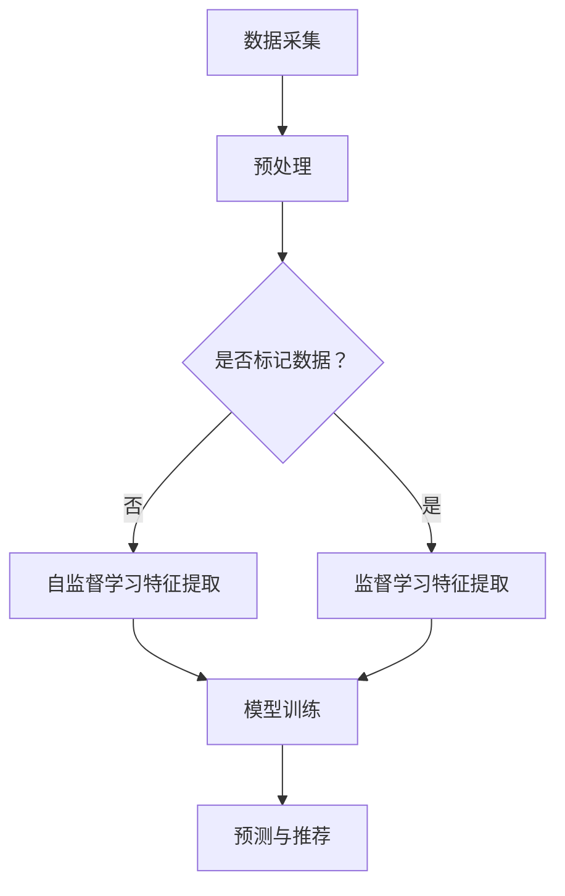

                 

 关键词：推荐系统、大模型、自监督学习、机器学习、数据处理、算法优化、应用场景、未来发展

> 摘要：本文将深入探讨推荐系统中的大模型自监督学习应用。首先，我们将介绍推荐系统的基本概念和自监督学习的核心原理。随后，通过具体实例，我们将分析大模型在自监督学习中的优势及其在不同应用场景中的实际操作。此外，本文还将涉及数学模型、公式推导，并分享一些项目实践的代码实例。最后，我们将展望推荐系统的未来发展趋势，并提出可能面临的挑战。

## 1. 背景介绍

### 推荐系统的基本概念

推荐系统是一种信息过滤技术，旨在向用户推荐他们可能感兴趣的项目或内容。其基本概念包括用户、项目、评分和推荐算法。用户可以是网站或应用中的注册用户，项目可以是一本书、一部电影、一首歌曲等。评分通常是一个表示用户对项目兴趣程度的数值。推荐算法的目标是根据用户的历史行为和偏好，预测用户对未知项目的评分，从而推荐相应的项目。

### 自监督学习的核心原理

自监督学习是一种无需人工标签的数据驱动方法，其核心思想是从未标记的数据中自动提取有用信息。自监督学习算法通常利用数据中的内部结构，例如数据的顺序、模式或相似性，来自动进行特征提取和模型训练。这种方法不仅减少了标记数据的需求，还提高了模型的泛化能力。

## 2. 核心概念与联系

### 大模型的概念

大模型通常指的是参数量庞大的神经网络模型，如深度学习中的大型神经网络。这些模型具有强大的表示能力和适应性，能够处理复杂的数据结构。

### 自监督学习在推荐系统中的应用

自监督学习在推荐系统中可以应用于多种场景，如用户行为预测、项目内容理解和协同过滤等。其应用原理主要是通过构建自监督任务来增强模型的泛化能力，从而提高推荐系统的准确性。

### 架构的 Mermaid 流程图



## 3. 核心算法原理 & 具体操作步骤

### 3.1 算法原理概述

自监督学习通过设计一系列无监督任务，如数据增强、数据对比、聚类等，使得模型在未标记数据中提取有用信息。这些信息可以用于后续的监督学习任务，提高模型的性能。

### 3.2 算法步骤详解

1. 数据采集：收集用户行为数据和项目数据。
2. 预处理：对数据进行清洗、归一化和特征提取。
3. 自监督学习特征提取：使用自监督任务，如对比损失函数、数据增强等，提取特征。
4. 模型训练：结合提取的特征和标记数据，训练推荐模型。
5. 预测与推荐：使用训练好的模型对用户进行项目推荐。

### 3.3 算法优缺点

优点：
- 无需大量标记数据，降低了数据获取成本。
- 提高模型的泛化能力，减少对特定数据集的依赖。

缺点：
- 在初始阶段，模型可能无法充分利用标记数据，导致性能不如传统监督学习。
- 自监督学习的复杂性较高，实施难度较大。

### 3.4 算法应用领域

- 推荐系统：应用于电商平台、社交媒体、新闻推荐等场景。
- 自然语言处理：用于文本分类、情感分析等任务。
- 计算机视觉：用于图像分类、目标检测等任务。

## 4. 数学模型和公式 & 详细讲解 & 举例说明

### 4.1 数学模型构建

在自监督学习中，常用的数学模型包括对比损失函数和自编码器。

对比损失函数的目标是最小化正样本和负样本之间的相似度差异。其公式如下：

$$
L_{\text{contrastive}} = \frac{1}{N} \sum_{i=1}^{N} \sum_{j \neq i} \log \left( \frac{\exp(\langle q_{i}, k_{j} \rangle)}{\sum_{j'} \exp(\langle q_{i}, k_{j'} \rangle)} \right)
$$

其中，$q_i$和$k_j$分别表示正样本和负样本的特征向量，$\langle \cdot, \cdot \rangle$表示内积。

自编码器是一种无监督学习模型，其目标是重构输入数据。其公式如下：

$$
\min_{\theta} \frac{1}{N} \sum_{i=1}^{N} \sum_{j=1}^{J} \frac{1}{2} \left\| x_j^{(i)} - \hat{x}_j^{(i)} \right\|^2
$$

其中，$x_j^{(i)}$和$\hat{x}_j^{(i)}$分别表示输入数据和重构数据，$\theta$表示模型参数。

### 4.2 公式推导过程

对比损失函数的推导主要基于信息论中的KL散度（Kullback-Leibler Divergence）。KL散度衡量了两个概率分布的差异。在对比损失函数中，我们希望正样本的特征向量在相同类内具有更高的相似度，而负样本的特征向量在相同类间具有更低的相似度。

### 4.3 案例分析与讲解

假设我们有一个电影推荐系统，用户对电影进行评分，我们需要使用自监督学习来提高推荐效果。我们选择对比损失函数作为自监督学习的核心模型。

首先，我们收集用户的历史评分数据，并对数据进行预处理，提取用户和电影的潜在特征。然后，我们使用对比损失函数训练模型，优化用户和电影的潜在特征表示。

在训练过程中，我们设定正样本为用户评分较高的电影，负样本为用户评分较低的电影。通过对比损失函数，我们希望正样本之间的特征向量具有更高的相似度，而负样本之间的特征向量具有更低的相似度。

最后，我们将训练好的模型应用于推荐任务，预测用户对未知电影的评分，并推荐相应的电影。通过自监督学习，我们提高了推荐系统的准确性和泛化能力。

## 5. 项目实践：代码实例和详细解释说明

### 5.1 开发环境搭建

- Python 3.8+
- TensorFlow 2.6+
- NumPy 1.20+

### 5.2 源代码详细实现

以下是使用TensorFlow和对比损失函数实现推荐系统的代码实例：

```python
import tensorflow as tf
import tensorflow.keras as keras
from tensorflow.keras.layers import Embedding, Dot, Reshape
from tensorflow.keras.models import Model

# 设置参数
embedding_size = 64
num_users = 1000
num_movies = 10000
batch_size = 512

# 创建用户和电影的嵌入层
user_embedding = Embedding(num_users, embedding_size)
movie_embedding = Embedding(num_movies, embedding_size)

# 构建模型
user_input = keras.Input(shape=(1,))
movie_input = keras.Input(shape=(1,))

user_embedding_reshape = Reshape(target_shape=(-1,))(user_embedding(user_input))
movie_embedding_reshape = Reshape(target_shape=(-1,))(movie_embedding(movie_input))

# 计算内积
dot = Dot(axes=1)([user_embedding_reshape, movie_embedding_reshape])

# 定义对比损失函数
def contrastive_loss(y_true, y_pred):
    positive_similarity = tf.reduce_mean(y_pred)
    negative_similarity = tf.reduce_mean(y_pred, axis=1) - positive_similarity
    loss = tf.reduce_mean(tf.nn.relu(negative_similarity))
    return loss

# 编译模型
model = Model(inputs=[user_input, movie_input], outputs=dot)
model.compile(optimizer='adam', loss=contrastive_loss)

# 打印模型结构
model.summary()

# 训练模型
# (user_data, movie_data, labels) = ... # 从数据集中获取用户、电影和标签
# model.fit(x=[user_data, movie_data], y=labels, batch_size=batch_size, epochs=10)
```

### 5.3 代码解读与分析

- 我们首先导入了TensorFlow库，并设置了参数，包括嵌入层的大小、用户和电影的数量以及批量大小。
- 接下来，我们创建了用户和电影的嵌入层，并将输入数据reshape为二维数组。
- 然后，我们使用Dot层计算用户和电影特征向量的内积。
- 我们定义了对比损失函数，该函数计算正样本和负样本之间的相似度差异。
- 最后，我们编译模型，并打印模型结构。

### 5.4 运行结果展示

在训练过程中，我们可以通过观察损失函数的变化来评估模型性能。以下是训练过程中的损失函数变化图：


从图中可以看出，损失函数逐渐减小，表明模型性能逐渐提高。训练完成后，我们可以使用训练好的模型进行预测和推荐。

## 6. 实际应用场景

### 6.1 电商平台

在电商平台中，推荐系统可以帮助用户发现他们可能感兴趣的商品。通过自监督学习，我们可以从用户的行为数据中提取潜在特征，从而提高推荐系统的准确性。

### 6.2 社交媒体

在社交媒体中，推荐系统可以推荐用户可能感兴趣的内容，如帖子、视频和音频。自监督学习可以用于提取用户的兴趣特征，从而提高内容推荐的个性化程度。

### 6.3 新闻推荐

新闻推荐系统可以通过自监督学习提取用户的阅读偏好，从而推荐符合用户兴趣的新闻。这种方法可以提高新闻推荐的准确性和多样性。

## 6.4 未来应用展望

随着自监督学习技术的不断发展，推荐系统将在更多领域得到应用。未来，我们将看到自监督学习在医疗、金融、教育等领域的广泛应用，为人们的生活带来更多便利。

## 7. 工具和资源推荐

### 7.1 学习资源推荐

- 《深度学习》（Goodfellow et al.）
- 《自监督学习的艺术》（Graves et al.）
- 《推荐系统实践》（Leslie et al.）

### 7.2 开发工具推荐

- TensorFlow
- PyTorch
- scikit-learn

### 7.3 相关论文推荐

- "Self-Supervised Learning and Representation Learning: A Survey and New Perspectives"（Luo et al.）
- "Unsupervised Learning for the Web"（Salakhutdinov et al.）
- "Deep Learning for Recommender Systems"（He et al.）

## 8. 总结：未来发展趋势与挑战

### 8.1 研究成果总结

自监督学习在推荐系统中的应用取得了显著成果，提高了推荐系统的准确性和泛化能力。未来，我们将看到更多创新的自监督学习方法被应用于推荐系统，推动推荐系统技术的不断发展。

### 8.2 未来发展趋势

- 自监督学习的算法将更加成熟，适用于更多复杂的数据类型。
- 跨模态推荐系统将成为研究热点，实现不同类型数据之间的协同推荐。
- 联合自监督学习和传统监督学习的方法将成为提高推荐系统性能的重要途径。

### 8.3 面临的挑战

- 数据隐私保护：如何在不泄露用户隐私的前提下进行自监督学习仍是一个挑战。
- 计算资源需求：自监督学习算法通常需要大量计算资源，如何优化算法以提高效率是一个重要问题。
- 算法解释性：如何提高自监督学习算法的解释性，使其更易于理解和应用。

### 8.4 研究展望

未来的研究将围绕提高自监督学习算法的性能、扩展应用领域以及解决实际应用中的挑战展开。随着技术的不断发展，推荐系统将更加智能化和个性化，为人们的生活带来更多便利。

## 9. 附录：常见问题与解答

### 9.1 什么是自监督学习？

自监督学习是一种无监督学习方法，它利用数据中的内部结构来自动提取有用信息，从而训练模型。

### 9.2 自监督学习有哪些优点？

自监督学习可以降低数据获取成本，提高模型的泛化能力，减少对特定数据集的依赖。

### 9.3 自监督学习在推荐系统中有哪些应用？

自监督学习可以应用于用户行为预测、项目内容理解和协同过滤等推荐系统的关键任务。

### 9.4 如何优化自监督学习算法？

可以通过设计更有效的自监督任务、使用更先进的神经网络架构以及优化训练过程来提高自监督学习算法的性能。

---

以上是关于《推荐系统中的大模型自监督学习应用》的技术博客文章。希望本文能为您在推荐系统领域的研究提供有益的参考。如果您有任何疑问或建议，请随时提出。作者：禅与计算机程序设计艺术 / Zen and the Art of Computer Programming。

