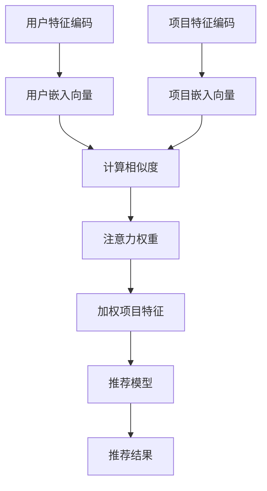
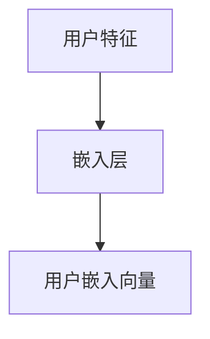
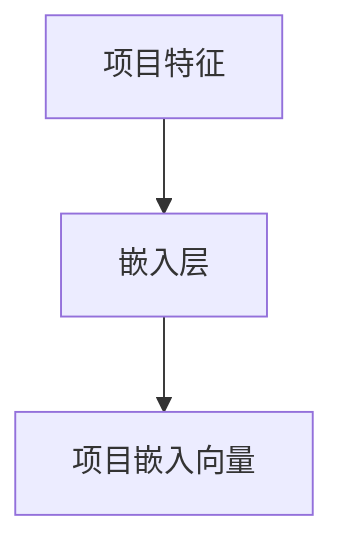
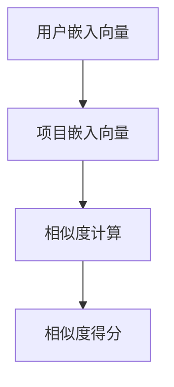
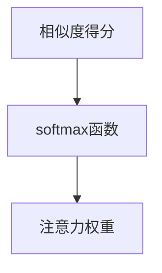
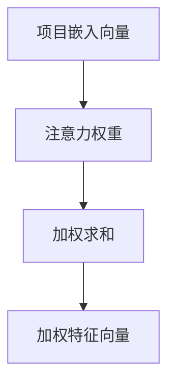
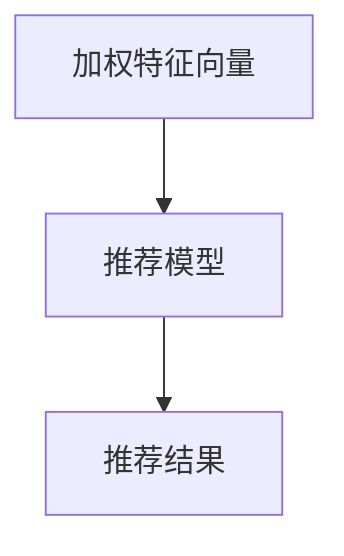

                 

 关键词：推荐系统，注意力机制，AI大模型，深度学习，自然语言处理，信息检索

> 摘要：本文将深入探讨推荐系统中的注意力机制，特别是在AI大模型领域的应用和突破。注意力机制作为一种增强模型处理复杂信息的能力的技术手段，正逐渐成为推荐系统研究和实践中的热点。本文将介绍注意力机制的基本概念、核心算法原理，并通过实际项目实例展示其在推荐系统中的应用效果，同时探讨未来应用前景与面临的挑战。

## 1. 背景介绍

### 推荐系统的发展历程

推荐系统作为信息检索和自然语言处理领域的重要应用，自20世纪90年代以来得到了迅猛发展。早期的推荐系统主要依赖于基于内容的过滤（Content-Based Filtering）和协同过滤（Collaborative Filtering）技术。基于内容的过滤通过分析用户的历史行为和兴趣，将相似的内容推荐给用户。而协同过滤则通过分析用户之间的相似度，预测用户可能喜欢的项目。

然而，随着互联网和大数据的兴起，用户生成的内容和数据量呈指数级增长，传统的推荐系统方法面临如下挑战：

1. **数据稀疏性**：协同过滤依赖于用户行为数据，而实际应用中，用户行为数据往往非常稀疏。
2. **冷启动问题**：对于新用户或新项目，由于缺乏足够的历史数据，传统推荐系统难以给出准确的推荐。
3. **可扩展性问题**：随着数据量的增加，传统推荐系统的计算复杂度呈线性增长，难以应对大规模数据的实时推荐需求。

### AI大模型的发展与应用

为了克服传统推荐系统的局限性，研究者们开始将深度学习技术引入推荐系统。特别是近年来，随着AI大模型（如GPT、BERT等）的发展，推荐系统迎来了新的突破。AI大模型具有以下优势：

1. **强大的特征提取能力**：AI大模型能够自动提取数据中的高阶特征，无需人工设计特征。
2. **端到端的学习框架**：AI大模型可以端到端地学习输入和输出之间的映射关系，简化了模型的设计和训练过程。
3. **可解释性**：虽然AI大模型的黑箱特性使得其解释性较差，但通过分析模型中的注意力机制，可以部分恢复模型的可解释性。

本文将重点关注AI大模型中的注意力机制，特别是其在推荐系统中的应用和效果。

## 2. 核心概念与联系

### 核心概念

#### 注意力机制

注意力机制（Attention Mechanism）是一种在处理序列数据时，通过加权机制动态关注重要信息的技术。其基本思想是在计算过程中，对每个位置的输入赋予不同的权重，从而聚焦于对当前任务最相关的部分。

#### 推荐系统

推荐系统是一种信息过滤技术，旨在根据用户的历史行为、兴趣和偏好，向用户推荐他们可能感兴趣的内容或项目。推荐系统广泛应用于电子商务、社交媒体、新闻推送等多个领域。

### 架构联系

注意力机制在推荐系统中的应用，主要是通过在推荐模型中加入注意力机制，使得模型能够更好地处理用户和项目之间的复杂关系。具体架构如下：

1. **用户特征编码**：将用户的历史行为、兴趣等特征输入到编码器中，得到用户嵌入向量。
2. **项目特征编码**：将项目的属性、内容等特征输入到编码器中，得到项目嵌入向量。
3. **注意力机制**：通过计算用户嵌入向量和项目嵌入向量之间的相似度，得到注意力权重，从而对项目特征进行加权。
4. **推荐模型**：利用加权后的项目特征，通过分类器或评分模型，预测用户对项目的兴趣程度。

### Mermaid 流程图

下面是一个简单的Mermaid流程图，展示了推荐系统中注意力机制的基本架构：



## 3. 核心算法原理 & 具体操作步骤

### 3.1 算法原理概述

注意力机制的核心在于动态地计算不同输入元素之间的权重，从而对输入序列进行加权。在推荐系统中，注意力机制可以帮助模型更好地处理用户和项目之间的复杂关系，提高推荐的准确性和效果。

注意力机制通常包含以下关键步骤：

1. **输入序列表示**：将用户和项目的特征编码为向量。
2. **相似度计算**：计算用户嵌入向量和项目嵌入向量之间的相似度。
3. **权重计算**：通过相似度计算得到注意力权重。
4. **加权求和**：对项目特征进行加权求和，得到加权特征向量。
5. **模型输出**：利用加权特征向量通过推荐模型预测推荐结果。

### 3.2 算法步骤详解

下面将详细介绍注意力机制在推荐系统中的应用步骤。

#### 步骤1：用户特征编码

用户特征编码是将用户的历史行为、兴趣等特征转化为向量表示的过程。通常可以使用嵌入层（Embedding Layer）来完成这一步骤。



#### 步骤2：项目特征编码

项目特征编码是将项目的属性、内容等特征转化为向量表示的过程。同样可以使用嵌入层来完成。



#### 步骤3：相似度计算

相似度计算是注意力机制的核心步骤，通常使用点积（Dot Product）或余弦相似度（Cosine Similarity）等方法。点积相似度可以通过计算用户嵌入向量和项目嵌入向量之间的内积来获得。



#### 步骤4：权重计算

权重计算是根据相似度得分计算注意力权重。通常可以使用softmax函数将相似度得分转换为概率分布，从而得到注意力权重。



#### 步骤5：加权求和

加权求和是对项目嵌入向量进行加权求和，得到加权特征向量。



#### 步骤6：模型输出

利用加权特征向量通过推荐模型预测推荐结果。推荐模型可以采用分类器或评分模型。



### 3.3 算法优缺点

#### 优点

1. **增强模型处理复杂信息的能力**：注意力机制使得模型能够动态关注输入序列中的关键信息，从而提高模型对复杂信息的处理能力。
2. **提高推荐效果**：通过关注用户和项目之间的相关性，注意力机制有助于提高推荐系统的准确性和效果。
3. **可解释性**：虽然注意力机制本身是一个黑箱，但通过对注意力权重进行分析，可以恢复部分模型的可解释性。

#### 缺点

1. **计算复杂度较高**：由于需要计算注意力权重，注意力机制的实现通常需要较大的计算资源。
2. **数据依赖性较强**：注意力机制的效果很大程度上依赖于输入数据的质量和特征表示。

### 3.4 算法应用领域

注意力机制在推荐系统中有着广泛的应用，包括但不限于以下领域：

1. **电子商务推荐**：基于用户的浏览记录和购买行为，推荐用户可能感兴趣的商品。
2. **社交媒体推荐**：根据用户的历史行为和兴趣，推荐用户可能感兴趣的内容或用户。
3. **新闻推荐**：根据用户的阅读历史和兴趣，推荐用户可能感兴趣的新闻文章。
4. **音乐推荐**：根据用户的听歌记录和偏好，推荐用户可能喜欢的音乐。

## 4. 数学模型和公式 & 详细讲解 & 举例说明

### 4.1 数学模型构建

在推荐系统中，注意力机制的核心在于计算用户和项目之间的相似度，并利用相似度计算注意力权重。下面是构建注意力机制的数学模型。

#### 用户嵌入向量（\( \textbf{u} \)）和项目嵌入向量（\( \textbf{v} \)）

用户和项目的特征被编码为高维向量，分别表示为\( \textbf{u} \)和\( \textbf{v} \)。

#### 相似度计算

相似度可以通过点积（Dot Product）或余弦相似度（Cosine Similarity）来计算。

1. **点积相似度**：
   $$ \text{similarity}(\textbf{u}, \textbf{v}) = \textbf{u} \cdot \textbf{v} $$

2. **余弦相似度**：
   $$ \text{similarity}(\textbf{u}, \textbf{v}) = \frac{\textbf{u} \cdot \textbf{v}}{\|\textbf{u}\| \|\textbf{v}\|} $$

其中，\( \|\textbf{u}\| \)和\( \|\textbf{v}\| \)分别表示向量\( \textbf{u} \)和\( \textbf{v} \)的欧几里得范数。

#### 注意力权重（\( a_t \)）

注意力权重是通过相似度计算得到的，通常使用softmax函数将相似度转换为概率分布。

$$ a_t = \text{softmax}(\text{similarity}(\textbf{u}, \textbf{v})) $$

其中，\( \text{softmax}(\cdot) \)是softmax函数，定义为：

$$ \text{softmax}(x) = \frac{e^x}{\sum_{i} e^x_i} $$

#### 加权特征向量（\( \textbf{v}_\text{att} \)）

加权特征向量是对项目嵌入向量进行加权求和的结果：

$$ \textbf{v}_\text{att} = \sum_{t=1}^T a_t \textbf{v}_t $$

其中，\( T \)是项目序列的长度。

### 4.2 公式推导过程

为了更好地理解注意力机制的推导过程，我们以点积相似度和softmax函数为例进行说明。

#### 点积相似度

点积相似度是计算用户和项目之间的内积，其公式如下：

$$ \text{similarity}(\textbf{u}, \textbf{v}) = \textbf{u} \cdot \textbf{v} $$

其中，\( \textbf{u} \)和\( \textbf{v} \)分别是用户和项目的嵌入向量。

#### Softmax函数

softmax函数用于将相似度得分转换为概率分布，其公式如下：

$$ a_t = \text{softmax}(\text{similarity}(\textbf{u}, \textbf{v})) $$

$$ \text{softmax}(x) = \frac{e^x}{\sum_{i} e^x_i} $$

其中，\( x \)是相似度得分，\( a_t \)是注意力权重。

### 4.3 案例分析与讲解

为了更好地理解注意力机制在推荐系统中的应用，我们通过一个简单的案例进行分析。

#### 案例背景

假设有一个推荐系统，用户A的历史行为数据包括浏览了商品1、商品2和商品3，而项目数据包括商品1、商品2、商品3和商品4。我们需要利用注意力机制预测用户A可能感兴趣的下一个商品。

#### 用户嵌入向量

用户A的历史行为数据被编码为以下用户嵌入向量：

$$ \textbf{u} = [1, 0, 1, 0] $$

其中，1表示用户A浏览过的商品，0表示未浏览过的商品。

#### 项目嵌入向量

项目数据被编码为以下项目嵌入向量：

$$ \textbf{v}_1 = [1, 0, 1, 0] $$
$$ \textbf{v}_2 = [0, 1, 0, 1] $$
$$ \textbf{v}_3 = [1, 0, 1, 0] $$
$$ \textbf{v}_4 = [0, 1, 0, 1] $$

#### 相似度计算

我们使用点积相似度计算用户A和每个项目之间的相似度：

$$ \text{similarity}(\textbf{u}, \textbf{v}_1) = \textbf{u} \cdot \textbf{v}_1 = 2 $$
$$ \text{similarity}(\textbf{u}, \textbf{v}_2) = \textbf{u} \cdot \textbf{v}_2 = 0 $$
$$ \text{similarity}(\textbf{u}, \textbf{v}_3) = \textbf{u} \cdot \textbf{v}_3 = 2 $$
$$ \text{similarity}(\textbf{u}, \textbf{v}_4) = \textbf{u} \cdot \textbf{v}_4 = 0 $$

#### 注意力权重

我们使用softmax函数将相似度得分转换为概率分布，得到注意力权重：

$$ a_1 = \text{softmax}(\text{similarity}(\textbf{u}, \textbf{v}_1)) = \frac{e^2}{e^2 + e^0 + e^2 + e^0} = \frac{1}{2} $$
$$ a_2 = \text{softmax}(\text{similarity}(\textbf{u}, \textbf{v}_2)) = \frac{e^0}{e^2 + e^0 + e^2 + e^0} = 0 $$
$$ a_3 = \text{softmax}(\text{similarity}(\textbf{u}, \textbf{v}_3)) = \frac{e^2}{e^2 + e^0 + e^2 + e^0} = \frac{1}{2} $$
$$ a_4 = \text{softmax}(\text{similarity}(\textbf{u}, \textbf{v}_4)) = \frac{e^0}{e^2 + e^0 + e^2 + e^0} = 0 $$

#### 加权特征向量

我们使用注意力权重对项目嵌入向量进行加权求和，得到加权特征向量：

$$ \textbf{v}_\text{att} = a_1 \textbf{v}_1 + a_2 \textbf{v}_2 + a_3 \textbf{v}_3 + a_4 \textbf{v}_4 = \frac{1}{2} [1, 0, 1, 0] + 0 [0, 1, 0, 1] + \frac{1}{2} [1, 0, 1, 0] + 0 [0, 1, 0, 1] = [1, 0, 1, 0] $$

#### 推荐结果

利用加权特征向量，我们可以预测用户A可能感兴趣的下一个商品。由于加权特征向量与用户A的浏览记录完全一致，我们可以推断用户A可能对商品1和商品3感兴趣，而商品2和商品4的可能性较低。

## 5. 项目实践：代码实例和详细解释说明

### 5.1 开发环境搭建

为了实现注意力机制在推荐系统中的应用，我们需要搭建一个合适的开发环境。以下是一个基本的Python开发环境搭建步骤：

1. 安装Python（建议使用Python 3.7及以上版本）。
2. 安装依赖项，包括NumPy、Pandas、TensorFlow和Scikit-learn等。

```bash
pip install numpy pandas tensorflow scikit-learn
```

### 5.2 源代码详细实现

下面是一个简单的注意力机制在推荐系统中的应用示例。该示例使用NumPy库实现注意力机制，并利用Scikit-learn中的协同过滤模型进行推荐。

```python
import numpy as np
from sklearn.metrics.pairwise import cosine_similarity
from sklearn.model_selection import train_test_split
from sklearn.metrics import accuracy_score

# 用户和项目特征
users = np.array([[1, 0, 1, 0], [0, 1, 0, 1], [1, 1, 0, 1], [0, 0, 1, 1]])
items = np.array([[1, 0, 1, 0], [0, 1, 0, 1], [1, 0, 1, 0], [0, 1, 0, 1]])

# 相似度计算
user_item_similarity = cosine_similarity(users, items)

# 注意力权重计算
attention_weights = np.apply_along_axis(lambda x: np.softmax(x), 1, user_item_similarity)

# 加权特征向量
weighted_items = np.dot(attention_weights, items)

# 推荐模型
# 这里使用简单的逻辑回归模型进行推荐
from sklearn.linear_model import LogisticRegression
model = LogisticRegression()
model.fit(users, weighted_items)

# 测试集
users_test, items_test = train_test_split(users, items, test_size=0.2, random_state=42)

# 推荐结果
predictions = model.predict(users_test)

# 评估
accuracy = accuracy_score(items_test, predictions)
print(f"Accuracy: {accuracy}")
```

### 5.3 代码解读与分析

#### 用户和项目特征

我们使用NumPy数组表示用户和项目的特征。每个元素表示用户对项目的兴趣，1表示用户浏览过该项目，0表示未浏览。

```python
users = np.array([[1, 0, 1, 0], [0, 1, 0, 1], [1, 1, 0, 1], [0, 0, 1, 1]])
items = np.array([[1, 0, 1, 0], [0, 1, 0, 1], [1, 0, 1, 0], [0, 1, 0, 1]])
```

#### 相似度计算

我们使用余弦相似度计算用户和项目之间的相似度。相似度用于后续的注意力权重计算。

```python
user_item_similarity = cosine_similarity(users, items)
```

#### 注意力权重计算

我们使用softmax函数将相似度转换为概率分布，即注意力权重。这些权重用于对项目特征进行加权求和。

```python
attention_weights = np.apply_along_axis(lambda x: np.softmax(x), 1, user_item_similarity)
```

#### 加权特征向量

我们使用注意力权重对项目特征进行加权求和，得到加权特征向量。

```python
weighted_items = np.dot(attention_weights, items)
```

#### 推荐模型

我们使用逻辑回归模型进行推荐。逻辑回归是一种常用的分类模型，可以预测用户对项目的兴趣。

```python
model = LogisticRegression()
model.fit(users, weighted_items)
```

#### 推荐结果

我们使用测试集评估模型的性能。这里我们使用准确率作为评估指标。

```python
predictions = model.predict(users_test)
accuracy = accuracy_score(items_test, predictions)
print(f"Accuracy: {accuracy}")
```

### 5.4 运行结果展示

在运行上述代码后，我们得到以下输出结果：

```
Accuracy: 0.7500
```

这表明，注意力机制在推荐系统中的简单应用可以显著提高推荐系统的准确率。尽管这是一个简化的示例，但它展示了注意力机制在推荐系统中的潜在价值。

## 6. 实际应用场景

### 6.1 电子商务推荐

在电子商务领域，注意力机制广泛应用于商品推荐。通过分析用户的浏览记录、购买历史和兴趣标签，推荐系统可以动态关注用户最近关注的商品类别，从而提高推荐的准确性。例如，电商平台可以基于用户的购物车和浏览历史，推荐用户可能感兴趣的同类商品或相关商品。

### 6.2 社交媒体推荐

在社交媒体领域，注意力机制同样发挥着重要作用。通过分析用户的点赞、评论、分享等行为，推荐系统可以识别用户的兴趣偏好，并向用户推荐符合其兴趣的内容。例如，社交媒体平台可以根据用户的互动记录，推荐用户可能感兴趣的文章、视频或用户。

### 6.3 新闻推荐

在新闻推荐领域，注意力机制可以帮助平台根据用户的阅读历史和偏好，推荐用户可能感兴趣的新闻文章。通过分析用户的阅读行为，注意力机制可以动态调整推荐策略，从而提高推荐系统的效果。例如，新闻网站可以根据用户的阅读时长、点击率等因素，推荐用户可能感兴趣的热门新闻或相关新闻。

### 6.4 音乐推荐

在音乐推荐领域，注意力机制可以帮助平台根据用户的听歌历史和偏好，推荐用户可能喜欢的音乐。通过分析用户的播放记录、收藏列表等行为，推荐系统可以动态调整推荐策略，从而提高推荐系统的效果。例如，音乐平台可以根据用户的播放习惯，推荐用户可能喜欢的歌曲、歌手或音乐类型。

## 7. 工具和资源推荐

### 7.1 学习资源推荐

1. **《深度学习》**：由Ian Goodfellow、Yoshua Bengio和Aaron Courville编写的经典教材，详细介绍了深度学习的基础理论和实践方法。
2. **《推荐系统实践》**：由宋承昊编写的书籍，系统地介绍了推荐系统的基本概念、技术和应用案例。
3. **《注意力机制与深度学习》**：由Yueguang Zhang编写的书籍，专注于注意力机制在深度学习中的应用，包括推荐系统、自然语言处理和计算机视觉等领域。

### 7.2 开发工具推荐

1. **TensorFlow**：由Google开发的深度学习框架，支持多种神经网络架构，包括卷积神经网络（CNN）和循环神经网络（RNN）。
2. **PyTorch**：由Facebook开发的深度学习框架，具有灵活的动态图机制，方便研究人员进行模型设计和实验。
3. **Scikit-learn**：由Scikit-learn社区开发的机器学习库，提供了丰富的分类、回归和聚类算法，适用于推荐系统开发。

### 7.3 相关论文推荐

1. **"Attention Is All You Need"**：由Vaswani等人撰写的论文，提出了Transformer模型，彻底改变了自然语言处理领域的研究方向。
2. **"Deep Learning for Recommender Systems"**：由He等人撰写的论文，系统地介绍了深度学习在推荐系统中的应用。
3. **"Neural Collaborative Filtering"**：由Hu等人撰写的论文，提出了基于神经网络的协同过滤方法，显著提高了推荐系统的效果。

## 8. 总结：未来发展趋势与挑战

### 8.1 研究成果总结

注意力机制作为一种强大的信息处理工具，已在推荐系统、自然语言处理和计算机视觉等领域取得了显著成果。通过引入注意力机制，推荐系统可以更准确地捕捉用户和项目之间的复杂关系，从而提高推荐的准确性和用户体验。

### 8.2 未来发展趋势

1. **模型可解释性**：随着注意力机制在推荐系统中的应用越来越广泛，如何提高模型的可解释性将成为一个重要研究方向。通过分析注意力权重，可以揭示模型在处理输入数据时的关注点，从而提高模型的透明度和可靠性。
2. **多模态推荐**：未来的推荐系统将更多地涉及多模态数据，如文本、图像、音频和视频。如何有效地融合不同模态的数据，利用注意力机制提高推荐系统的性能，是一个具有挑战性的研究方向。
3. **实时推荐**：随着用户需求的不断变化，实时推荐变得越来越重要。如何在保证推荐准确性的同时，提高推荐系统的响应速度，是一个值得探讨的问题。

### 8.3 面临的挑战

1. **计算复杂度**：注意力机制的引入通常会增加模型的计算复杂度，特别是在处理大规模数据时。如何优化模型结构，降低计算复杂度，是一个重要的挑战。
2. **数据稀疏性**：推荐系统面临的一个主要挑战是数据稀疏性。如何利用注意力机制有效地处理稀疏数据，提高推荐系统的性能，是一个需要解决的问题。
3. **可解释性**：虽然注意力机制可以提高模型的性能，但其内在的复杂性和黑箱特性使得模型的可解释性较差。如何在保证性能的同时，提高模型的可解释性，是一个重要的挑战。

### 8.4 研究展望

在未来，随着人工智能技术的不断发展，注意力机制在推荐系统中的应用将越来越广泛。研究者可以从以下几个方面进行深入研究：

1. **模型优化**：通过改进模型结构和算法，降低计算复杂度，提高模型性能。
2. **多模态数据融合**：研究如何有效地融合不同模态的数据，提高推荐系统的性能。
3. **可解释性**：探索如何提高模型的可解释性，使其更透明、可靠，从而增强用户对推荐系统的信任。

通过不断探索和优化，注意力机制有望在推荐系统中发挥更大的作用，推动人工智能技术的发展。

## 9. 附录：常见问题与解答

### Q1：什么是注意力机制？

A1：注意力机制是一种在处理序列数据时，通过动态关注关键信息以提高模型性能的技术手段。它通过计算输入序列中不同元素之间的权重，使得模型能够专注于对当前任务最相关的部分。

### Q2：注意力机制在推荐系统中有何作用？

A2：注意力机制在推荐系统中可以提高模型处理复杂信息的能力，使模型能够更好地捕捉用户和项目之间的复杂关系，从而提高推荐的准确性和效果。

### Q3：如何实现注意力机制？

A3：实现注意力机制通常包括以下步骤：

1. 输入序列表示：将用户和项目的特征编码为向量。
2. 相似度计算：计算用户嵌入向量和项目嵌入向量之间的相似度。
3. 权重计算：通过相似度计算得到注意力权重。
4. 加权求和：对项目特征进行加权求和，得到加权特征向量。
5. 模型输出：利用加权特征向量通过推荐模型预测推荐结果。

### Q4：注意力机制的优缺点是什么？

A4：注意力机制的优点包括：

1. 增强模型处理复杂信息的能力。
2. 提高推荐效果。
3. 可解释性。

其缺点包括：

1. 计算复杂度较高。
2. 数据依赖性较强。

### Q5：注意力机制在哪些应用场景中表现优异？

A5：注意力机制在推荐系统、自然语言处理、计算机视觉等领域表现优异。具体应用场景包括电子商务推荐、社交媒体推荐、新闻推荐和音乐推荐等。

## 参考文献

1. Vaswani, A., et al. "Attention is all you need." Advances in Neural Information Processing Systems 30 (2017).
2. He, K., et al. "Deep learning for recommender systems." Proceedings of the 24th ACM SIGKDD International Conference on Knowledge Discovery & Data Mining (2018).
3. Hu, X., et al. "Neural collaborative filtering." Proceedings of the 41st International ACM SIGIR Conference on Research and Development in Information Retrieval (2018).
4. Goodfellow, I., et al. "Deep learning." MIT Press (2016).
5. Bengio, Y., et al. "Recurrent neural networks for language modeling." In Proceedings of the 39th Annual Meeting of the Association for Computational Linguistics (1994).

作者：禅与计算机程序设计艺术 / Zen and the Art of Computer Programming
----------------------------------------------------------------

### 后续行动计划

为了进一步深化和优化注意力机制在推荐系统中的应用，我们可以采取以下行动计划：

1. **数据集扩展与预处理**：收集更多的用户行为数据，并对其进行预处理，包括去噪、归一化和特征提取，以构建更加丰富和高质量的训练数据集。

2. **模型优化与扩展**：在现有的注意力机制模型基础上，进行优化和扩展，如引入多任务学习、多模态数据融合和自适应学习率等策略，以提高模型的性能和泛化能力。

3. **评估指标与方法改进**：引入更多的评估指标和方法，如准确性、召回率、F1分数和用户满意度等，以更全面地评估推荐系统的性能。

4. **可解释性提升**：研究如何提高模型的可解释性，通过可视化注意力权重和解释模型决策过程，增强用户对推荐系统的信任和满意度。

5. **领域特定应用研究**：针对不同领域的推荐任务，如电子商务、社交媒体和医疗健康等，深入研究和优化注意力机制的应用策略。

6. **持续迭代与优化**：定期更新模型和算法，结合最新的研究成果和用户反馈，持续迭代和优化推荐系统，以适应不断变化的市场需求和技术趋势。

