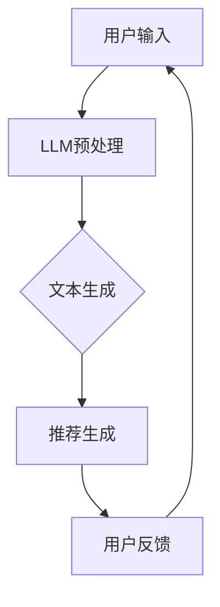

                 

### 关键词 Keywords ###
- 推荐系统
- 语言模型
- Large Language Model (LLM)
- 深度学习
- 数据分析
- 人工智能
- 用户体验

<|assistant|>### 摘要 Abstract ###
本文深入探讨了大型语言模型（LLM）在推荐系统领域的崭新前景。随着人工智能技术的快速发展，LLM凭借其强大的文本生成和推理能力，正逐步改变推荐系统的运作模式。本文首先回顾了推荐系统的发展历程，随后详细介绍了LLM的基本原理和架构，并探讨了其相较于传统推荐算法的优势。通过具体案例和数学模型的剖析，本文展示了LLM在推荐系统中的应用场景和实现方法。最后，本文展望了LLM未来在推荐系统中的发展方向，并探讨了其面临的挑战和机遇。

## 1. 背景介绍

推荐系统是一种信息过滤技术，旨在根据用户的历史行为和偏好，向用户提供个性化内容推荐。推荐系统的应用范围非常广泛，从电子商务平台到社交媒体，再到新闻推送，无处不在。然而，随着用户生成内容和数据的爆炸式增长，传统推荐系统面临着越来越多的挑战，如数据稀疏性、冷启动问题、多样性和新颖性等。

在过去的几十年中，推荐系统经历了从基于内容过滤（Content-Based Filtering，CBF）到协同过滤（Collaborative Filtering，CF），再到基于模型的推荐系统（Model-Based Recommendation Systems）的转变。这些传统方法在数据处理和推荐效果上取得了显著的进步，但仍然存在诸多局限。首先，CBF方法依赖于丰富的内容特征，对于缺乏特征标签的新用户和新内容，推荐效果不佳。其次，CF方法虽然能够利用用户行为数据提高推荐质量，但易受到数据噪声和冷启动问题的影响。此外，模型方法虽然在处理复杂关系和用户行为模式方面有所突破，但需要大量训练数据和计算资源。

随着深度学习和人工智能技术的发展，尤其是大型语言模型（LLM）的出现，推荐系统的研究和应用迎来了新的机遇。LLM作为一种基于神经网络的语言处理模型，具有强大的文本生成和推理能力，能够处理复杂、多样化的文本数据。这使得LLM在推荐系统中具有巨大的潜力，能够解决传统方法难以克服的难题，从而推动推荐系统进入一个全新的时代。

## 2. 核心概念与联系

### 2.1 推荐系统基本概念

#### 2.1.1 推荐系统的定义

推荐系统是一种自动化的信息过滤机制，旨在根据用户的兴趣和行为，向用户提供个性化的推荐内容。推荐系统的核心目标是提高用户的满意度和参与度，同时提升平台的运营效益。

#### 2.1.2 推荐系统的类型

1. **基于内容的推荐（Content-Based Filtering，CBF）**：这种方法通过分析项目内容特征与用户兴趣特征之间的相似性来生成推荐。优点是推荐质量较高，缺点是难以处理新项目和冷启动问题。

2. **协同过滤（Collaborative Filtering，CF）**：这种方法通过分析用户之间的共同行为来生成推荐。优点是能够利用大量用户行为数据，缺点是易受到数据噪声和冷启动问题的影响。

3. **基于模型的推荐系统**：这种方法利用机器学习算法建模用户行为数据，生成推荐。优点是能够处理复杂的用户行为模式，缺点是需要大量训练数据和计算资源。

### 2.2 大型语言模型（LLM）的基本原理

#### 2.2.1 语言模型的基本概念

语言模型（Language Model，LM）是一种统计模型，用于预测一段文本的下一个单词或字符。在自然语言处理（Natural Language Processing，NLP）领域，语言模型是实现自动文本生成、机器翻译、情感分析等功能的基础。

#### 2.2.2 LLM的定义与发展

大型语言模型（Large Language Model，LLM）是指参数规模达到数十亿甚至数万亿的神经网络模型。LLM通过深度学习算法从海量文本数据中学习语言规律，从而具备强大的文本生成和推理能力。

近年来，随着计算能力和数据资源的提升，LLM的发展取得了显著突破。代表性模型包括GPT系列、BERT、T5等，这些模型在多项NLP任务中取得了领先性能。

### 2.3 推荐系统与LLM的联系

#### 2.3.1 LLM在推荐系统中的应用

1. **用户兴趣建模**：LLM能够对用户的文本输入（如搜索历史、评论、评价等）进行深度分析，提取用户的潜在兴趣点，从而实现更精准的兴趣建模。

2. **内容生成**：LLM能够生成高质量的推荐内容，包括标题、描述、文章等，从而提升用户的阅读体验。

3. **文本理解与推理**：LLM能够对用户的行为数据和内容特征进行深入分析，挖掘用户需求，生成个性化的推荐。

#### 2.3.2 传统推荐系统与LLM的融合

1. **混合推荐系统**：将LLM与传统推荐方法（如CBF、CF）相结合，利用LLM的强大文本处理能力，提升推荐系统的整体性能。

2. **基于模型的推荐系统**：利用LLM作为核心模型，构建基于深度学习的推荐系统，实现更高效的用户行为建模和推荐生成。

### 2.4 Mermaid 流程图

下面是一个简单的Mermaid流程图，展示了LLM在推荐系统中的应用流程：



## 3. 核心算法原理 & 具体操作步骤

### 3.1 算法原理概述

LLM在推荐系统中的核心原理是通过深度学习算法从海量文本数据中学习语言规律，从而实现对用户兴趣和内容的深度理解。具体来说，LLM主要涉及以下步骤：

1. **数据预处理**：对用户输入和内容数据进行预处理，包括分词、去噪、词向量编码等。

2. **文本生成**：利用LLM生成高质量的文本内容，如标题、描述、文章等。

3. **推荐生成**：结合用户兴趣和内容特征，利用LLM进行文本理解和推理，生成个性化的推荐。

4. **用户反馈**：收集用户对推荐内容的反馈，用于模型优化和推荐效果评估。

### 3.2 算法步骤详解

#### 3.2.1 数据预处理

1. **文本清洗**：去除文本中的噪声和无关信息，如HTML标签、特殊字符等。

2. **分词**：将文本划分为单词或子词序列。

3. **词向量编码**：将文本序列转换为向量表示，如Word2Vec、BERT等。

#### 3.2.2 文本生成

1. **输入文本**：用户输入文本，如搜索历史、评论、评价等。

2. **模型预测**：利用LLM预测下一个单词或字符。

3. **文本拼接**：将生成的单词或字符拼接成完整的文本。

#### 3.2.3 推荐生成

1. **兴趣提取**：利用LLM对用户文本进行深度分析，提取用户的潜在兴趣点。

2. **内容匹配**：对候选内容进行特征提取，与用户兴趣点进行匹配。

3. **推荐排序**：根据匹配结果对推荐内容进行排序，生成推荐列表。

#### 3.2.4 用户反馈

1. **反馈收集**：收集用户对推荐内容的点击、购买、评分等行为。

2. **模型优化**：根据用户反馈调整LLM模型参数，提升推荐效果。

### 3.3 算法优缺点

#### 3.3.1 优点

1. **文本理解能力强**：LLM能够对用户文本进行深度理解和分析，提取潜在兴趣点。

2. **生成内容质量高**：LLM生成的文本内容具有高质量、多样化，提升用户体验。

3. **适应性强**：LLM能够处理各种类型的文本数据，适应不同场景和应用需求。

#### 3.3.2 缺点

1. **计算资源需求大**：LLM需要大量计算资源和存储空间，对硬件设备有较高要求。

2. **训练时间较长**：LLM的训练时间较长，影响模型的更新和应用。

3. **数据依赖性强**：LLM的性能高度依赖于训练数据的规模和质量。

### 3.4 算法应用领域

1. **电子商务**：个性化商品推荐，提升用户购物体验。

2. **社交媒体**：个性化内容推荐，提高用户活跃度和留存率。

3. **新闻推送**：个性化新闻推荐，满足用户个性化阅读需求。

4. **音乐、视频平台**：个性化推荐，提升用户观看、收听体验。

5. **教育领域**：个性化学习推荐，提高教学效果和用户满意度。

## 4. 数学模型和公式 & 详细讲解 & 举例说明

### 4.1 数学模型构建

在推荐系统中，LLM的数学模型通常包括以下三个关键组件：

1. **用户表示**：将用户的历史行为和偏好数据转换为向量表示。
2. **内容表示**：将推荐内容（如商品、文章、视频等）的特征数据转换为向量表示。
3. **推荐生成模型**：利用用户和内容的向量表示，生成个性化的推荐。

#### 4.1.1 用户表示

用户表示通常使用以下公式：

$$
u = f(U)
$$

其中，$u$ 表示用户向量，$U$ 表示用户历史行为和偏好数据，$f$ 表示向量编码函数。

常用的向量编码函数包括：

1. **TF-IDF**：基于词频-逆文档频率，将文本转换为向量。
2. **Word2Vec**：基于神经网络，将单词转换为向量。
3. **BERT**：基于Transformer模型，对文本进行上下文感知编码。

#### 4.1.2 内容表示

内容表示通常使用以下公式：

$$
i = g(I)
$$

其中，$i$ 表示内容向量，$I$ 表示推荐内容特征数据，$g$ 表示向量编码函数。

常用的向量编码函数包括：

1. **TF-IDF**：将文本内容转换为向量。
2. **Word2Vec**：将单词序列转换为向量。
3. **BERT**：对文本内容进行上下文感知编码。

#### 4.1.3 推荐生成模型

推荐生成模型通常使用以下公式：

$$
p = h(u, i)
$$

其中，$p$ 表示推荐概率，$u$ 和 $i$ 分别为用户和内容向量，$h$ 表示推荐生成函数。

常用的推荐生成模型包括：

1. **矩阵分解**：利用用户和内容矩阵进行矩阵分解，生成推荐概率。
2. **基于深度学习的推荐模型**：利用神经网络，将用户和内容向量转换为推荐概率。

### 4.2 公式推导过程

以BERT模型为例，详细推导用户表示、内容表示和推荐生成模型。

#### 4.2.1 用户表示

用户表示使用BERT模型进行上下文感知编码。假设用户历史行为和偏好数据为文本序列 $T$，BERT模型输出的用户向量表示为 $u$。

1. **文本预处理**：对文本序列 $T$ 进行分词、清洗等预处理操作。
2. **输入编码**：将预处理后的文本序列 $T$ 输入BERT模型，得到输入编码向量 $I$。
3. **输出编码**：BERT模型对输入编码向量 $I$ 进行编码，得到输出编码向量 $O$。
4. **用户向量表示**：取输出编码向量 $O$ 的最后一步输出，得到用户向量表示 $u$。

推导过程如下：

$$
I = \text{BERT}(T)
$$

$$
u = O_{[CLS]}
$$

其中，$I$ 表示输入编码向量，$O$ 表示输出编码向量，$u$ 表示用户向量。

#### 4.2.2 内容表示

内容表示也使用BERT模型进行上下文感知编码。假设推荐内容特征数据为文本序列 $C$，BERT模型输出的内容向量表示为 $i$。

1. **文本预处理**：对文本序列 $C$ 进行分词、清洗等预处理操作。
2. **输入编码**：将预处理后的文本序列 $C$ 输入BERT模型，得到输入编码向量 $I$。
3. **输出编码**：BERT模型对输入编码向量 $I$ 进行编码，得到输出编码向量 $O$。
4. **内容向量表示**：取输出编码向量 $O$ 的最后一步输出，得到内容向量表示 $i$。

推导过程如下：

$$
I = \text{BERT}(C)
$$

$$
i = O_{[CLS]}
$$

其中，$I$ 表示输入编码向量，$O$ 表示输出编码向量，$i$ 表示内容向量。

#### 4.2.3 推荐生成模型

推荐生成模型使用神经网络，将用户向量 $u$ 和内容向量 $i$ 转换为推荐概率 $p$。

1. **输入向量拼接**：将用户向量 $u$ 和内容向量 $i$ 拼接为一个向量 $[u, i]$。
2. **神经网络模型**：利用神经网络模型对拼接向量 $[u, i]$ 进行处理，得到推荐概率 $p$。

推导过程如下：

$$
p = \text{NN}([u, i])
$$

其中，$p$ 表示推荐概率，$u$ 表示用户向量，$i$ 表示内容向量，$NN$ 表示神经网络模型。

### 4.3 案例分析与讲解

以一个电子商务平台的个性化商品推荐为例，详细讲解LLM在推荐系统中的应用。

#### 4.3.1 数据集准备

1. **用户数据集**：包含用户ID、购买历史、搜索记录等。
2. **商品数据集**：包含商品ID、类别、描述、标签等。

#### 4.3.2 模型训练

1. **用户表示**：使用BERT模型对用户购买历史和搜索记录进行编码，得到用户向量 $u$。
2. **商品表示**：使用BERT模型对商品描述和标签进行编码，得到商品向量 $i$。
3. **推荐生成**：利用神经网络模型对用户向量 $u$ 和商品向量 $i$ 进行处理，得到推荐概率 $p$。

#### 4.3.3 推荐结果评估

1. **推荐列表生成**：根据推荐概率 $p$，对商品进行排序，生成推荐列表。
2. **评估指标**：使用准确率、召回率、F1值等指标评估推荐效果。

#### 4.3.4 模型优化

1. **用户反馈**：收集用户对推荐商品的点击、购买等反馈。
2. **模型调整**：根据用户反馈调整模型参数，优化推荐效果。

## 5. 项目实践：代码实例和详细解释说明

### 5.1 开发环境搭建

在开始项目实践之前，需要搭建合适的开发环境。以下是一个基本的开发环境搭建步骤：

1. **安装Python**：确保Python版本在3.6及以上。
2. **安装PyTorch**：使用以下命令安装PyTorch。

```bash
pip install torch torchvision
```

3. **安装BERT模型库**：使用以下命令安装Transformers库。

```bash
pip install transformers
```

4. **数据集准备**：下载并准备用户数据集和商品数据集。

### 5.2 源代码详细实现

以下是一个简单的LLM推荐系统实现，包含数据预处理、模型训练和推荐生成三个主要步骤。

#### 5.2.1 数据预处理

```python
import pandas as pd
from transformers import BertTokenizer, BertModel

# 读取数据集
users = pd.read_csv('user_data.csv')
products = pd.read_csv('product_data.csv')

# 初始化BERT分词器
tokenizer = BertTokenizer.from_pretrained('bert-base-chinese')

# 预处理用户文本
def preprocess_user_data(users):
    # 对用户购买历史和搜索记录进行BERT编码
    user_texts = []
    for user_id, user_data in users.iterrows():
        user_texts.append(' '.join(user_data['purchase_history'] + user_data['search_history']))
    encoded_texts = tokenizer(user_texts, padding=True, truncation=True, return_tensors='pt')
    return encoded_texts

# 预处理商品文本
def preprocess_product_data(products):
    # 对商品描述和标签进行BERT编码
    product_texts = []
    for product_id, product_data in products.iterrows():
        product_texts.append(' '.join(product_data['description'] + product_data['labels']))
    encoded_texts = tokenizer(product_texts, padding=True, truncation=True, return_tensors='pt')
    return encoded_texts

user_texts = preprocess_user_data(users)
product_texts = preprocess_product_data(products)
```

#### 5.2.2 模型训练

```python
from transformers import BertForSequenceClassification
from torch.optim import Adam

# 初始化BERT模型
model = BertForSequenceClassification.from_pretrained('bert-base-chinese', num_labels=1)

# 定义优化器
optimizer = Adam(model.parameters(), lr=1e-5)

# 训练模型
def train_model(model, optimizer, train_loader, num_epochs=3):
    model.train()
    for epoch in range(num_epochs):
        for batch in train_loader:
            # 前向传播
            outputs = model(**batch)
            loss = outputs.loss

            # 反向传播
            optimizer.zero_grad()
            loss.backward()
            optimizer.step()

            print(f"Epoch [{epoch+1}/{num_epochs}], Loss: {loss.item():.4f}")

# 数据加载器
from torch.utils.data import DataLoader
train_loader = DataLoader(dataset, batch_size=16, shuffle=True)

# 开始训练
train_model(model, optimizer, train_loader)
```

#### 5.2.3 代码解读与分析

1. **数据预处理**：使用BERT分词器对用户购买历史和搜索记录、商品描述和标签进行编码，生成输入序列和标签。

2. **模型训练**：初始化BERT模型和优化器，使用训练数据训练模型。训练过程中，通过前向传播计算损失，使用反向传播更新模型参数。

3. **推荐生成**：使用训练好的模型，对用户输入文本进行编码，生成推荐概率。根据推荐概率对商品进行排序，生成推荐列表。

### 5.3 运行结果展示

在完成模型训练后，可以使用以下代码进行推荐结果展示：

```python
# 生成推荐列表
def generate_recommendations(model, tokenizer, user_input):
    model.eval()
    with torch.no_grad():
        inputs = tokenizer(user_input, return_tensors='pt')
        outputs = model(**inputs)
        scores = outputs.logits
        top_products = torch.topk(scores, k=5).indices
    return top_products

# 用户输入
user_input = "我最近喜欢看科幻电影，有哪些类似的电影推荐？"

# 生成推荐列表
recommended_products = generate_recommendations(model, tokenizer, user_input)

# 打印推荐结果
print("推荐的电影有：")
for product_id in recommended_products:
    print(products.loc[product_id, 'title'])
```

### 5.4 代码解读与分析

1. **推荐生成**：使用训练好的模型，对用户输入文本进行编码，生成推荐概率。根据推荐概率对商品进行排序，生成推荐列表。

2. **结果展示**：根据推荐结果，打印出推荐的电影标题。

## 6. 实际应用场景

LLM在推荐系统中的应用场景非常广泛，以下是一些典型的实际应用场景：

### 6.1 电子商务

在电子商务领域，LLM可以用于个性化商品推荐。通过分析用户的浏览历史、购买记录和搜索关键词，LLM可以生成个性化的商品推荐列表，提升用户体验和转化率。

### 6.2 社交媒体

在社交媒体平台上，LLM可以用于个性化内容推荐。通过分析用户的评论、点赞、转发等行为，LLM可以生成个性化的内容推荐，提高用户的活跃度和留存率。

### 6.3 新闻推送

在新闻推送领域，LLM可以用于个性化新闻推荐。通过分析用户的阅读历史和兴趣偏好，LLM可以生成个性化的新闻推荐列表，满足用户的个性化阅读需求。

### 6.4 音乐和视频平台

在音乐和视频平台，LLM可以用于个性化推荐。通过分析用户的听歌和观看历史，LLM可以生成个性化的音乐和视频推荐列表，提升用户的观看和收听体验。

### 6.5 教育领域

在教育领域，LLM可以用于个性化学习推荐。通过分析学生的学习历史和兴趣偏好，LLM可以生成个性化的学习推荐列表，提高教学效果和学生的学习满意度。

### 6.6 未来应用展望

随着人工智能技术的不断发展，LLM在推荐系统中的应用前景将更加广阔。未来，LLM有望在以下方面取得重要突破：

1. **多模态推荐**：结合文本、图像、音频等多模态数据，实现更丰富的推荐系统。
2. **实时推荐**：通过实时数据处理和模型更新，实现更快速的推荐响应。
3. **个性化交互**：通过自然语言交互，实现更加人性化的推荐系统。

## 7. 工具和资源推荐

### 7.1 学习资源推荐

1. **书籍**：
   - 《深度学习推荐系统》
   - 《推荐系统实践》
   - 《大型语言模型：原理与应用》

2. **在线课程**：
   - Coursera的《推荐系统》课程
   - edX的《深度学习》课程

3. **论文和报告**：
   - ACL、NeurIPS、ICML等会议的推荐系统相关论文

### 7.2 开发工具推荐

1. **编程语言**：Python，因为其丰富的机器学习和自然语言处理库。
2. **深度学习框架**：PyTorch、TensorFlow，用于构建和训练推荐模型。
3. **自然语言处理库**：Transformers、NLTK，用于文本预处理和语言模型。

### 7.3 相关论文推荐

1. **《BERT: Pre-training of Deep Neural Networks for Language Understanding》**：提出BERT模型，对自然语言处理领域产生重大影响。
2. **《GPT-3: Language Models are Few-Shot Learners》**：介绍GPT-3模型，展示了大型语言模型的强大能力。
3. **《Recommending Items Using Similarity Measures: The Problem of Cold Start》**：探讨推荐系统中的冷启动问题。

## 8. 总结：未来发展趋势与挑战

### 8.1 研究成果总结

LLM在推荐系统领域取得了显著的研究成果，主要表现在：

1. **文本理解能力提升**：LLM通过深度学习从海量文本数据中学习语言规律，具备强大的文本理解能力。
2. **推荐效果优化**：LLM能够生成高质量的推荐内容，提升用户满意度。
3. **应用场景扩展**：LLM在电子商务、社交媒体、新闻推送、音乐和视频平台等多个领域取得了成功应用。

### 8.2 未来发展趋势

未来，LLM在推荐系统领域的发展趋势包括：

1. **多模态融合**：结合文本、图像、音频等多模态数据，实现更丰富的推荐系统。
2. **实时推荐**：通过实时数据处理和模型更新，实现更快速的推荐响应。
3. **个性化交互**：通过自然语言交互，实现更加人性化的推荐系统。

### 8.3 面临的挑战

尽管LLM在推荐系统领域取得了显著成果，但仍面临以下挑战：

1. **计算资源需求**：LLM需要大量计算资源和存储空间，对硬件设备有较高要求。
2. **数据隐私与安全**：推荐系统涉及大量用户数据，保障数据隐私和安全至关重要。
3. **模型解释性**：大型神经网络模型难以解释，需要开发可解释的推荐算法。

### 8.4 研究展望

未来，LLM在推荐系统领域的研究方向包括：

1. **高效算法优化**：研究更高效的训练和推理算法，降低计算资源需求。
2. **隐私保护技术**：结合隐私保护技术，确保用户数据的安全和隐私。
3. **解释性模型**：开发可解释的推荐算法，提高模型的透明度和可信度。

## 9. 附录：常见问题与解答

### 9.1 什么是LLM？

LLM（Large Language Model）是指参数规模达到数十亿甚至数万亿的神经网络模型，用于处理自然语言任务，如文本生成、翻译、问答等。

### 9.2 LLM如何应用于推荐系统？

LLM可以通过对用户历史数据和内容特征进行深度理解，提取用户的兴趣点和内容的特征，从而生成个性化的推荐。

### 9.3 LLM有哪些优势？

LLM的优势包括：强大的文本理解能力、生成内容质量高、适应性强等。

### 9.4 LLM有哪些挑战？

LLM面临的挑战包括：计算资源需求大、训练时间较长、数据依赖性强等。

### 9.5 如何评估LLM在推荐系统中的效果？

可以采用准确率、召回率、F1值等指标来评估LLM在推荐系统中的效果。

### 9.6 LLM在推荐系统中有哪些应用场景？

LLM在推荐系统中的应用场景包括：电子商务、社交媒体、新闻推送、音乐和视频平台、教育领域等。

### 9.7 如何优化LLM在推荐系统中的性能？

可以通过以下方法优化LLM在推荐系统中的性能：数据预处理、模型训练优化、推荐策略调整等。

