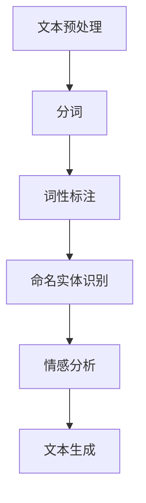

                 

关键词：搜狗，NLP，面试题，详解，技术博客，人工智能

摘要：本文将针对搜狗2025社招NLP工程师的面试题进行详细解答，包括背景介绍、核心概念与联系、核心算法原理、数学模型与公式、项目实践以及实际应用场景等内容。旨在帮助读者深入理解NLP领域的关键技术和应用，为准备相关面试的工程师提供有力支持。

## 1. 背景介绍

自然语言处理（NLP）是人工智能领域的一个重要分支，旨在使计算机能够理解、生成和处理人类语言。随着互联网和大数据的迅猛发展，NLP技术在各行各业得到广泛应用，如搜索引擎、智能客服、机器翻译、文本分类等。搜狗公司作为国内领先的互联网技术公司，在NLP领域有着丰富的实践经验和研究成果。本文将结合搜狗2025社招NLP工程师的面试题，对NLP技术进行详细解读。

### 1.1 NLP的发展历程

NLP技术起源于20世纪50年代，当时人们开始探索如何使计算机理解和处理自然语言。早期的研究主要集中在规则方法和统计方法上。20世纪80年代，机器学习技术的发展为NLP带来了新的突破，特别是基于统计的方法在文本分类、信息检索等领域取得了显著成果。近年来，深度学习技术在NLP领域的应用取得了巨大成功，使得计算机在自然语言理解、生成等方面取得了前所未有的进展。

### 1.2 NLP的应用领域

NLP技术已广泛应用于多个领域，包括：

1. **搜索引擎**：通过自然语言理解，搜索引擎可以更好地理解用户查询意图，提供更准确的搜索结果。
2. **智能客服**：利用自然语言处理技术，智能客服可以理解和解答用户的问题，提高客户满意度。
3. **机器翻译**：通过将一种自然语言翻译成另一种自然语言，机器翻译技术使得跨语言交流变得更加便捷。
4. **文本分类**：将文本数据按照一定的标准进行分类，为信息检索、舆情分析等提供支持。
5. **文本生成**：根据输入的文本或关键词，生成新的文本，如文章、新闻、对话等。

## 2. 核心概念与联系

### 2.1 语言模型

语言模型是NLP中的基础模型，用于预测文本中的下一个单词或字符。常用的语言模型包括n-gram模型、神经网络语言模型等。

### 2.2 词嵌入

词嵌入是将单词映射到高维空间中的向量表示，用于表示单词之间的语义关系。常见的词嵌入方法包括Word2Vec、GloVe等。

### 2.3 序列标注

序列标注是将文本序列中的每个词或字符标注为不同的标签，如词性标注、命名实体识别等。

### 2.4 文本分类

文本分类是将文本数据按照一定的标准进行分类，如情感分类、主题分类等。常用的文本分类方法包括朴素贝叶斯、支持向量机、深度学习等。

### 2.5 数学模型与算法

NLP中的数学模型和算法主要包括：

- **概率模型**：如朴素贝叶斯、隐马尔可夫模型等。
- **神经网络模型**：如卷积神经网络、循环神经网络、长短时记忆网络等。
- **优化算法**：如梯度下降、随机梯度下降、Adam等。

### 2.6 Mermaid流程图

以下是一个NLP系统的Mermaid流程图：



## 3. 核心算法原理 & 具体操作步骤

### 3.1 算法原理概述

NLP中的核心算法主要包括：

- **词嵌入**：通过将单词映射到高维空间中的向量表示，实现语义关系的表示。
- **语言模型**：用于预测文本中的下一个单词或字符，是生成和识别文本的基础。
- **序列标注**：用于将文本序列中的每个词或字符标注为不同的标签，实现文本分类、命名实体识别等任务。
- **文本分类**：通过将文本数据按照一定的标准进行分类，实现对文本内容的理解和分析。

### 3.2 算法步骤详解

#### 3.2.1 词嵌入

1. **数据准备**：收集大量的文本数据，进行预处理，如去除标点、停用词等。
2. **构建词表**：将所有文本中的单词构建成一个词表，并为每个单词分配一个唯一的索引。
3. **词嵌入训练**：使用Word2Vec或GloVe算法训练词嵌入模型，将单词映射到高维空间中的向量表示。

#### 3.2.2 语言模型

1. **数据准备**：收集大量的文本数据，进行预处理，如去除标点、停用词等。
2. **构建语料库**：将所有文本数据构建成一个语料库，用于训练语言模型。
3. **训练语言模型**：使用n-gram模型或神经网络模型训练语言模型，用于预测文本中的下一个单词或字符。

#### 3.2.3 序列标注

1. **数据准备**：收集大量的标注数据，用于训练序列标注模型。
2. **构建词表**：为每个标签构建一个词表，并为每个标签分配一个唯一的索引。
3. **训练序列标注模型**：使用朴素贝叶斯、支持向量机、循环神经网络等算法训练序列标注模型。

#### 3.2.4 文本分类

1. **数据准备**：收集大量的标注数据，用于训练文本分类模型。
2. **特征提取**：将文本数据转换为特征向量，如TF-IDF、词袋模型等。
3. **训练文本分类模型**：使用朴素贝叶斯、支持向量机、神经网络等算法训练文本分类模型。

### 3.3 算法优缺点

- **词嵌入**：优点在于能够有效地表示语义关系，但缺点是难以捕捉长期依赖关系。
- **语言模型**：优点在于能够预测文本中的下一个单词或字符，但缺点是模型复杂度较高，计算开销大。
- **序列标注**：优点在于能够实现文本分类、命名实体识别等任务，但缺点是模型训练时间较长。
- **文本分类**：优点在于能够快速对文本进行分类，但缺点是模型准确率受特征提取方法影响较大。

### 3.4 算法应用领域

NLP算法在多个领域有着广泛的应用，如：

- **搜索引擎**：使用语言模型预测用户查询意图，提供更准确的搜索结果。
- **智能客服**：使用序列标注和文本分类技术实现自然语言理解和文本生成，提高客服效率。
- **机器翻译**：使用神经网络模型实现文本翻译，提高翻译质量。
- **文本分类**：实现舆情分析、情感分析等任务，为企业和政府提供决策支持。

## 4. 数学模型和公式 & 详细讲解 & 举例说明

### 4.1 数学模型构建

NLP中的数学模型主要包括概率模型和神经网络模型。以下是两个典型的数学模型：

#### 4.1.1 朴素贝叶斯模型

朴素贝叶斯模型是一种基于概率论的分类模型，其公式如下：

$$
P(C_k|X) = \frac{P(X|C_k)P(C_k)}{P(X)}
$$

其中，$C_k$表示第$k$个类别，$X$表示特征向量，$P(X|C_k)$表示在类别$C_k$下的特征向量概率，$P(C_k)$表示类别$C_k$的概率，$P(X)$表示特征向量的总概率。

#### 4.1.2 循环神经网络（RNN）

循环神经网络是一种用于处理序列数据的神经网络模型，其公式如下：

$$
h_t = \sigma(W_h h_{t-1} + W_x x_t + b_h)
$$

其中，$h_t$表示第$t$个时间步的隐藏状态，$x_t$表示第$t$个时间步的输入特征，$W_h$和$W_x$分别表示隐藏状态和输入特征的权重矩阵，$b_h$表示隐藏状态的偏置，$\sigma$表示激活函数。

### 4.2 公式推导过程

#### 4.2.1 朴素贝叶斯模型推导

以文本分类为例，假设有一个文本数据集$D = \{x_1, x_2, ..., x_n\}$，其中$x_i$表示第$i$个文本样本，$y_i$表示$x_i$的类别标签，类别标签集合为$Y = \{y_1, y_2, ..., y_m\}$。

1. **特征提取**：将每个文本样本$x_i$转换为特征向量$v_i$，如TF-IDF向量。
2. **训练朴素贝叶斯模型**：计算每个类别$y_k$下的特征向量概率$P(v_i|y_k)$和类别概率$P(y_k)$。
3. **分类**：对于一个新的文本样本$x_j$，计算其在每个类别下的概率$P(y_k|x_j)$，并选取概率最大的类别作为预测结果。

#### 4.2.2 循环神经网络推导

以序列标注为例，假设有一个标注数据集$D = \{x_1, y_1; x_2, y_2; ...; x_n, y_n\}$，其中$x_i$表示第$i$个序列样本，$y_i$表示$x_i$的标注序列，标注集合为$Y = \{y_1, y_2, ..., y_m\}$。

1. **特征提取**：将每个序列样本$x_i$转换为特征向量$v_i$，如词嵌入向量。
2. **训练循环神经网络**：计算隐藏状态$h_t$和输出概率$P(y_t|h_t)$。
3. **标注**：对于一个新的序列样本$x_j$，计算其在每个标注下的概率$P(y_t|h_t)$，并选取概率最大的标注作为预测结果。

### 4.3 案例分析与讲解

#### 4.3.1 朴素贝叶斯模型应用

以情感分类为例，假设有一个文本数据集，包含正面和负面两类情感：

```
正面：我喜欢这本书。
负面：这本书太无聊了。
```

1. **特征提取**：将每个文本样本转换为TF-IDF向量。
2. **训练朴素贝叶斯模型**：计算每个类别下的特征向量概率和类别概率。
3. **分类**：对于一个新的文本样本，计算其在正面和负面类别下的概率，并选取概率最大的类别作为预测结果。

#### 4.3.2 循环神经网络应用

以命名实体识别为例，假设有一个标注数据集，包含人名、地名等命名实体：

```
人名：张三是中国人。
地名：北京是中国的首都。
```

1. **特征提取**：将每个序列样本转换为词嵌入向量。
2. **训练循环神经网络**：计算隐藏状态和输出概率。
3. **标注**：对于一个新的序列样本，计算其在每个命名实体下的概率，并选取概率最大的命名实体作为预测结果。

## 5. 项目实践：代码实例和详细解释说明

### 5.1 开发环境搭建

1. **Python环境**：安装Python 3.7及以上版本。
2. **库安装**：安装Numpy、Pandas、Scikit-learn、TensorFlow等库。

### 5.2 源代码详细实现

以下是一个基于朴素贝叶斯模型的情感分类项目实例：

```python
import numpy as np
from sklearn.feature_extraction.text import TfidfVectorizer
from sklearn.naive_bayes import MultinomialNB
from sklearn.model_selection import train_test_split
from sklearn.metrics import accuracy_score

# 数据集
data = [
    ("我喜欢这本书", "正面"),
    ("这本书太无聊了", "负面"),
    ("我非常喜欢这本书", "正面"),
    ("这本书真的很差", "负面"),
]

# 特征提取
vectorizer = TfidfVectorizer()
X = vectorizer.fit_transform([text for text, _ in data])
y = np.array([label for _, label in data])

# 划分训练集和测试集
X_train, X_test, y_train, y_test = train_test_split(X, y, test_size=0.2, random_state=42)

# 训练朴素贝叶斯模型
model = MultinomialNB()
model.fit(X_train, y_train)

# 预测
predictions = model.predict(X_test)

# 评估
accuracy = accuracy_score(y_test, predictions)
print(f"准确率：{accuracy}")
```

### 5.3 代码解读与分析

1. **数据准备**：使用一个简单的数据集，包含正面和负面两类情感。
2. **特征提取**：使用TF-IDF向量表示文本，将文本转换为特征矩阵。
3. **模型训练**：使用朴素贝叶斯模型训练分类模型。
4. **预测与评估**：对测试集进行预测，并计算准确率。

## 6. 实际应用场景

### 6.1 搜索引擎

NLP技术在搜索引擎中有着广泛的应用，如：

- **查询意图理解**：通过自然语言处理技术，理解用户的查询意图，提供更准确的搜索结果。
- **关键词提取**：从用户查询中提取关键信息，用于索引构建和搜索结果排序。

### 6.2 智能客服

智能客服是NLP技术的典型应用场景，如：

- **自然语言理解**：通过自然语言处理技术，理解用户的问题，提供准确的答案。
- **文本生成**：根据用户问题和历史对话，生成个性化的回答。

### 6.3 机器翻译

机器翻译是NLP技术的重要应用领域，如：

- **跨语言交流**：将一种自然语言翻译成另一种自然语言，促进跨文化交流。
- **内容分发**：将不同语言的内容翻译成多种语言，扩大内容的传播范围。

### 6.4 未来的应用场景

随着NLP技术的不断发展，未来的应用场景将更加广泛，如：

- **智能语音助手**：通过自然语言处理技术，实现语音识别、语音合成等功能。
- **情感分析**：对大量文本进行情感分析，为企业决策提供支持。
- **知识图谱**：构建大规模知识图谱，为人工智能系统提供知识支持。

## 7. 工具和资源推荐

### 7.1 学习资源推荐

- **书籍**：
  - 《自然语言处理综合教程》
  - 《深度学习与自然语言处理》
  - 《自然语言处理入门》
- **在线课程**：
  - Coursera的《自然语言处理》
  - Udacity的《自然语言处理工程师》
  - edX的《深度学习与自然语言处理》

### 7.2 开发工具推荐

- **框架**：
  - TensorFlow
  - PyTorch
  - Keras
- **库**：
  - NLTK
  - spaCy
  - gensim

### 7.3 相关论文推荐

- **语言模型**：
  - "A Neural Probabilistic Language Model"
  - "Word2Vec: Word Embeddings for Sentiment Analysis and Information Retrieval"
- **文本分类**：
  - "Text Classification with Convolutional Neural Networks"
  - "Recurrent Neural Network Based Text Classification"
- **序列标注**：
  - "Neural Networks for Named Entity Recognition"
  - "A Simple End-to-End Latent-Dynamic Model for Information Extraction"

## 8. 总结：未来发展趋势与挑战

### 8.1 研究成果总结

NLP技术在近年来取得了显著的成果，特别是在深度学习技术的推动下，计算机在自然语言理解、生成等方面取得了前所未有的进展。未来，NLP技术将继续在多个领域发挥重要作用，如智能客服、机器翻译、文本生成等。

### 8.2 未来发展趋势

- **多模态融合**：结合文本、图像、语音等多种模态，实现更智能的自然语言处理。
- **预训练模型**：预训练模型将逐步取代传统的任务驱动模型，成为NLP领域的主流方向。
- **知识图谱**：构建大规模知识图谱，为人工智能系统提供知识支持。

### 8.3 面临的挑战

- **数据质量**：高质量的数据是NLP技术发展的基础，未来需要更多高质量数据的支持。
- **计算资源**：深度学习模型的训练需要大量计算资源，如何高效利用计算资源是当前的一大挑战。
- **跨语言处理**：跨语言处理是NLP技术的一个重要方向，但仍然存在很多难题。

### 8.4 研究展望

未来，NLP技术将在人工智能领域发挥更加重要的作用，为实现智能客服、智能语音助手、知识图谱等应用提供技术支持。同时，NLP技术也将与其他领域相结合，推动人工智能技术的全面发展。

## 9. 附录：常见问题与解答

### 9.1 NLP的基本概念是什么？

NLP（自然语言处理）是人工智能的一个分支，旨在使计算机能够理解、生成和处理人类语言。它涉及语音识别、语音合成、机器翻译、情感分析、文本分类等多个子领域。

### 9.2 语言模型有哪些类型？

常见的语言模型包括n-gram模型、统计语言模型、神经网络语言模型等。n-gram模型基于词的历史序列进行预测，统计语言模型使用概率模型进行预测，神经网络语言模型则使用深度学习技术进行预测。

### 9.3 词嵌入有哪些常见方法？

常见的词嵌入方法包括Word2Vec、GloVe、FastText等。Word2Vec使用神经网络进行训练，GloVe使用词频信息和词义相似性进行训练，FastText使用词袋模型和神经网络进行训练。

### 9.4 NLP技术在实际应用中有哪些场景？

NLP技术在实际应用中包括搜索引擎、智能客服、机器翻译、文本分类、文本生成等多个场景。例如，搜索引擎使用NLP技术理解用户查询意图，智能客服使用NLP技术进行自然语言理解和文本生成，机器翻译实现跨语言交流，文本分类用于舆情分析等。

### 9.5 未来NLP技术的发展方向是什么？

未来NLP技术的发展方向包括多模态融合、预训练模型、知识图谱等。多模态融合将结合文本、图像、语音等多种模态，实现更智能的自然语言处理；预训练模型将逐步取代传统的任务驱动模型，成为NLP领域的主流方向；知识图谱将构建大规模知识图谱，为人工智能系统提供知识支持。

作者：禅与计算机程序设计艺术 / Zen and the Art of Computer Programming
----------------------------------------------------------------

**文章完成，感谢您的耐心阅读。希望本文对您在NLP领域的知识积累和面试准备有所帮助。如有任何问题或建议，欢迎在评论区留言，期待与您交流。**

