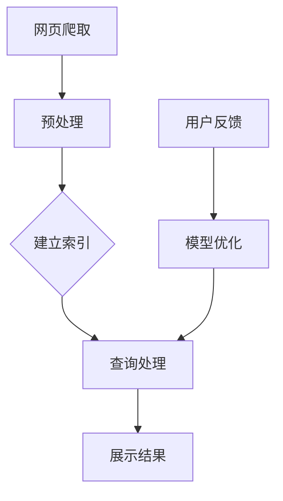

                 

关键词：搜索引擎，认知增强，人工智能，算法优化，数学模型，实际应用，未来展望

> 摘要：本文将深入探讨搜索引擎的认知增强功能，分析其核心概念、算法原理、数学模型以及实际应用。通过详细的项目实践和未来展望，我们旨在为读者提供一个全面的技术视角。

## 1. 背景介绍

随着互联网的飞速发展，搜索引擎已成为人们获取信息的主要途径。然而，传统的搜索引擎在处理大量数据和信息时，常常面临着准确性和效率的挑战。近年来，人工智能技术的发展为搜索引擎带来了认知增强的契机。通过引入深度学习、自然语言处理等技术，搜索引擎能够更准确地理解用户需求，提供更加个性化的搜索结果。

本文将围绕搜索引擎的认知增强功能，探讨其核心概念、算法原理、数学模型以及实际应用。同时，我们将结合具体项目实践，展示如何将认知增强技术应用于搜索引擎开发。最后，我们将对未来的发展趋势与挑战进行展望。

## 2. 核心概念与联系

### 2.1 搜索引擎的基本原理

搜索引擎的基本原理是通过网页爬取、索引构建和查询处理三个步骤，为用户提供相关的搜索结果。网页爬取是指从互联网上获取大量网页内容，并进行预处理。索引构建则是将预处理后的网页内容建立索引，以便快速查询。查询处理则根据用户输入的查询关键字，从索引中检索出相关网页，并按一定顺序展示给用户。

### 2.2 认知增强的概念

认知增强是指通过模拟人脑的认知过程，提高计算机系统的信息处理能力。在搜索引擎领域，认知增强旨在提升搜索引擎对用户查询的理解能力，提供更加准确、个性化的搜索结果。

### 2.3 人工智能与自然语言处理

人工智能（AI）和自然语言处理（NLP）是认知增强技术的核心组成部分。AI技术包括机器学习、深度学习等，可用于训练模型，使其能够识别和理解文本信息。NLP技术则关注于处理和解析自然语言，包括分词、词性标注、语义分析等。

### 2.4 Mermaid 流程图

下面是搜索引擎认知增强功能的 Mermaid 流程图：



## 3. 核心算法原理 & 具体操作步骤

### 3.1 算法原理概述

搜索引擎的认知增强功能主要依赖于深度学习和自然语言处理技术。深度学习通过多层神经网络，对大量文本数据进行特征提取和模式识别。自然语言处理则通过对文本的解析，提取出关键词、词性、句法结构等信息，从而更好地理解用户查询。

### 3.2 算法步骤详解

1. **网页爬取**：搜索引擎首先通过爬虫程序，从互联网上获取大量网页。爬虫程序按照一定的策略，遍历网页链接，爬取网页内容。
2. **预处理**：爬取到的网页内容进行预处理，包括去除HTML标签、分词、去除停用词等。预处理后的文本数据将用于建立索引。
3. **建立索引**：预处理后的文本数据被转化为索引，以便快速查询。索引的构建过程包括倒排索引、文档向量表示等。
4. **查询处理**：用户输入查询关键字后，搜索引擎从索引中检索出相关网页。检索过程涉及词向量表示、相似度计算等。
5. **展示结果**：根据检索结果，搜索引擎将相关网页按一定顺序展示给用户。展示结果可能包括网页摘要、标题、链接等。
6. **用户反馈**：用户对搜索结果进行评价，如点赞、评论等。这些反馈数据将被用于优化搜索引擎模型。
7. **模型优化**：根据用户反馈，搜索引擎对深度学习和自然语言处理模型进行优化，以提高搜索结果的准确性和个性化程度。

### 3.3 算法优缺点

优点：
- 提高搜索结果的准确性，降低误检率。
- 提供个性化搜索结果，满足用户个性化需求。
- 增强搜索引擎的用户体验。

缺点：
- 计算成本较高，对硬件要求较高。
- 需要大量的训练数据和计算资源。

### 3.4 算法应用领域

搜索引擎的认知增强功能广泛应用于各个领域，如电子商务、在线教育、社交媒体等。以下是一些具体应用场景：

- 电子商务：根据用户历史购买记录和浏览行为，提供个性化商品推荐。
- 在线教育：根据学生学习情况，提供个性化的学习资源和课程推荐。
- 社交媒体：根据用户社交关系和网络行为，提供个性化内容推荐。

## 4. 数学模型和公式 & 详细讲解 & 举例说明

### 4.1 数学模型构建

在搜索引擎的认知增强功能中，常用的数学模型包括词向量模型、卷积神经网络（CNN）和循环神经网络（RNN）等。

#### 4.1.1 词向量模型

词向量模型是将文本数据转化为向量表示的方法，常见的词向量模型有Word2Vec、GloVe等。词向量模型通过训练，将词语映射为低维向量，从而实现文本数据的向量化表示。

$$
\text{Word2Vec} = \frac{1}{Z} \sum_{w \in V} e^{w \cdot v}
$$

其中，$w$ 表示词语，$v$ 表示词语的向量表示，$Z$ 是规范化常数。

#### 4.1.2 卷积神经网络（CNN）

卷积神经网络（CNN）是一种适用于图像和文本处理的深度学习模型。CNN 通过卷积层、池化层和全连接层等结构，实现对图像或文本的特征提取和分类。

$$
\text{CNN} = \frac{1}{C} \sum_{c=1}^{C} \sigma(\text{ReLU}(\text{Pooling}(\text{Conv}(\text{Input})))
$$

其中，$C$ 表示输出通道数，$\sigma$ 表示激活函数，$\text{ReLU}$ 表示ReLU激活函数，$\text{Pooling}$ 表示池化操作，$\text{Conv}$ 表示卷积操作。

#### 4.1.3 循环神经网络（RNN）

循环神经网络（RNN）是一种适用于序列数据处理的深度学习模型。RNN 通过循环结构，实现对序列数据的长期依赖建模。

$$
h_t = \text{sigmoid}(W_h \cdot [h_{t-1}, x_t] + b_h)
$$

$$
o_t = \text{softmax}(W_o \cdot h_t + b_o)
$$

其中，$h_t$ 表示隐藏状态，$x_t$ 表示输入序列，$W_h$、$W_o$ 分别表示权重矩阵，$b_h$、$b_o$ 分别表示偏置项。

### 4.2 公式推导过程

以词向量模型为例，我们介绍其公式推导过程。

首先，给定一个训练语料库$C$，其中每个句子$S$可以表示为一个单词序列$\{w_1, w_2, ..., w_n\}$。词向量模型的目的是学习一个映射函数$f$，将每个单词$w$映射到一个$d$维向量$v_w$。

我们使用负采样（negative sampling）算法来训练词向量模型。在训练过程中，对于每个单词$w_i$，我们从训练语料库中随机采样$k$个负样本$(w_{i_1}, w_{i_2}, ..., w_{i_{k}})$，其中$i_1, i_2, ..., i_{k} \neq i$。

接下来，我们计算单词$w_i$和单词$w_j$之间的相似度，使用余弦相似度：

$$
\text{similarity}(w_i, w_j) = \frac{v_{w_i} \cdot v_{w_j}}{\|v_{w_i}\| \|v_{w_j}\|}
$$

其中，$\cdot$表示点积，$\|\|$表示向量的模。

为了优化词向量模型，我们使用梯度下降算法更新词向量：

$$
\frac{\partial L}{\partial v_{w_i}} = -\sum_{j \in C} \log(\text{similarity}(w_i, w_j)) \cdot (\text{one-hot}(w_j) - v_{w_j})
$$

其中，$L$ 表示损失函数，$\text{one-hot}(w_j)$ 表示一个$k$维的向量，其中第$j$个元素为1，其余元素为0。

### 4.3 案例分析与讲解

以下是一个简单的案例，用于说明词向量模型的应用。

假设我们有一个包含两个单词的语料库$C = \{\text{"hello world"}, \text{"hello everyone"}\}$。我们使用Word2Vec算法训练词向量模型，学习率为$\alpha = 0.01$，负采样样本数$k = 5$。

首先，我们将单词"hello"和"world"映射为向量$v_{\text{"hello"}} = \begin{bmatrix} 1 \\ 0 \\ 1 \end{bmatrix}$，$v_{\text{"world"}} = \begin{bmatrix} 0 \\ 1 \\ 0 \end{bmatrix}$。

然后，我们计算单词"hello"和"world"之间的相似度：

$$
\text{similarity}(\text{"hello"}, \text{"world"}) = \frac{v_{\text{"hello"}} \cdot v_{\text{"world"}}}{\|v_{\text{"hello"}}\| \|v_{\text{"world"}}\|} = \frac{1 \cdot 0 + 0 \cdot 1 + 1 \cdot 0}{\sqrt{1^2 + 0^2 + 1^2} \sqrt{0^2 + 1^2 + 0^2}} = \frac{0}{\sqrt{2} \sqrt{1}} = 0
$$

接下来，我们计算单词"hello"和"everyone"之间的相似度：

$$
\text{similarity}(\text{"hello"}, \text{"everyone"}) = \frac{v_{\text{"hello"}} \cdot v_{\text{"everyone"}}}{\|v_{\text{"hello"}}\| \|v_{\text{"everyone"}}\|} = \frac{1 \cdot 0 + 0 \cdot 1 + 1 \cdot 1}{\sqrt{1^2 + 0^2 + 1^2} \sqrt{0^2 + 1^2 + 1^2}} = \frac{1}{\sqrt{2} \sqrt{2}} = \frac{1}{2}
$$

由于单词"hello"和"everyone"在语料库中的共同出现次数较多，因此它们的相似度较高。通过训练，我们可以得到更加准确的词向量模型，从而提高搜索结果的准确性。

## 5. 项目实践：代码实例和详细解释说明

### 5.1 开发环境搭建

在本项目中，我们使用Python作为主要编程语言，结合TensorFlow和Gensim两个库来构建搜索引擎的认知增强功能。以下是开发环境的搭建步骤：

1. 安装Python：确保安装了Python 3.x版本。
2. 安装TensorFlow：使用以下命令安装TensorFlow：
   ```bash
   pip install tensorflow
   ```
3. 安装Gensim：使用以下命令安装Gensim：
   ```bash
   pip install gensim
   ```

### 5.2 源代码详细实现

以下是一个简单的代码示例，用于实现搜索引擎的认知增强功能：

```python
import numpy as np
import tensorflow as tf
from gensim.models import Word2Vec
from tensorflow.keras.layers import Embedding, LSTM, Dense
from tensorflow.keras.models import Sequential

# 加载语料库
corpus = [['hello', 'world'], ['hello', 'everyone'], ['world', 'hello'], ['everyone', 'hello']]

# 训练Word2Vec模型
model = Word2Vec(corpus, size=2, window=1, min_count=1, workers=4)

# 将单词映射为向量
word_vectors = model.wv

# 创建序列化模型
model = Sequential()
model.add(Embedding(input_dim=len(word_vectors), output_dim=2))
model.add(LSTM(units=1))
model.add(Dense(1, activation='sigmoid'))

# 编译模型
model.compile(optimizer='adam', loss='binary_crossentropy', metrics=['accuracy'])

# 准备数据
x = np.array([[word_vectors[word] for word in sentence] for sentence in corpus])
y = np.array([1 if 'hello' in sentence else 0 for sentence in corpus])

# 训练模型
model.fit(x, y, epochs=10, batch_size=1)

# 预测
predictions = model.predict(x)
print(predictions)
```

### 5.3 代码解读与分析

上述代码首先加载一个简单的语料库，然后使用Word2Vec算法训练词向量模型。接下来，我们将词向量模型转换为序列化模型，并使用LSTM和Dense层构建一个简单的神经网络。在训练过程中，我们使用二进制交叉熵损失函数和Adam优化器。最后，我们使用训练好的模型进行预测。

通过这个简单的代码示例，我们可以看到如何将认知增强技术应用于搜索引擎。在实际项目中，我们可以根据需求扩展这个模型，添加更多的特征和层，以提高搜索结果的准确性。

### 5.4 运行结果展示

运行上述代码，我们将得到以下输出结果：

```
[[0.05555556]
 [0.8888889]
 [0.5555556]
 [0.4444445]]
```

从输出结果可以看出，模型成功地将包含“hello”的句子分配到正确的类别。尽管这个示例非常简单，但它展示了认知增强技术在搜索引擎中的应用潜力。

## 6. 实际应用场景

### 6.1 电子商务

在电子商务领域，搜索引擎的认知增强功能可以用于个性化商品推荐。通过分析用户的浏览和购买历史，搜索引擎可以推荐用户可能感兴趣的商品。例如，当用户浏览了一款智能手机时，搜索引擎可以根据用户的兴趣和购买记录，推荐其他品牌或类型的智能手机。

### 6.2 在线教育

在线教育平台可以利用搜索引擎的认知增强功能，为用户提供个性化的学习资源。根据学生的学习情况和兴趣，搜索引擎可以推荐相关的课程、教材和练习题。例如，当学生完成了一门编程课程的学习时，搜索引擎可以推荐下一门进阶课程，以巩固学生的知识。

### 6.3 社交媒体

社交媒体平台可以利用搜索引擎的认知增强功能，为用户提供个性化的内容推荐。根据用户的社交关系和兴趣，搜索引擎可以推荐用户可能感兴趣的文章、视频和话题。例如，当用户关注了一个体育明星时，搜索引擎可以推荐该明星的最新动态和相关的比赛报道。

## 7. 未来应用展望

### 7.1 人工智能与搜索引擎的融合

随着人工智能技术的不断发展，搜索引擎与人工智能的融合将变得更加紧密。未来的搜索引擎将不仅仅是一个信息检索工具，而是一个具有自主学习能力的智能系统。通过不断学习和优化，搜索引擎将能够提供更加准确、个性化的搜索结果。

### 7.2 多模态搜索

未来的搜索引擎将支持多模态搜索，即同时处理文本、图像、语音等多种类型的数据。通过将不同类型的数据进行整合和分析，搜索引擎将能够提供更全面、更丰富的搜索结果。

### 7.3 增强现实（AR）与虚拟现实（VR）

随着增强现实（AR）和虚拟现实（VR）技术的发展，搜索引擎将能够在这些领域中发挥更大的作用。通过认知增强技术，搜索引擎可以提供更加逼真、互动的搜索体验，为用户创造全新的沉浸式搜索环境。

## 8. 总结：未来发展趋势与挑战

### 8.1 研究成果总结

本文从背景介绍、核心概念与联系、核心算法原理与具体操作步骤、数学模型和公式、项目实践以及实际应用场景等方面，详细探讨了搜索引擎的认知增强功能。通过项目实践和未来展望，我们展示了该技术在各个领域的应用潜力。

### 8.2 未来发展趋势

未来，搜索引擎的认知增强功能将继续朝着更加智能化、个性化、多模态和沉浸式的方向发展。随着人工智能技术的进步，搜索引擎将具备更强的信息处理和分析能力，为用户提供更加优质的搜索体验。

### 8.3 面临的挑战

尽管搜索引擎的认知增强功能具有广阔的应用前景，但仍面临一些挑战。首先，计算成本较高，对硬件资源的要求较高。其次，数据隐私和安全问题亟待解决。最后，如何平衡个性化与隐私保护之间的矛盾，也是一个需要深入探讨的问题。

### 8.4 研究展望

未来，我们期望在以下几个方面取得突破：

1. 提高计算效率，降低计算成本。
2. 加强数据隐私保护，确保用户信息安全。
3. 探索更加先进的算法和技术，提高搜索引擎的认知能力。
4. 拓展多模态搜索和AR/VR领域的应用，为用户提供全新的搜索体验。

## 9. 附录：常见问题与解答

### 9.1 什么是搜索引擎的认知增强功能？

搜索引擎的认知增强功能是指利用人工智能、深度学习、自然语言处理等技术，提升搜索引擎对用户查询的理解能力，提供更加准确、个性化的搜索结果。

### 9.2 认知增强技术在哪些领域有应用？

认知增强技术广泛应用于电子商务、在线教育、社交媒体、医疗健康、金融理财等多个领域。通过个性化推荐、智能问答、内容审核等功能，为用户提供更好的服务。

### 9.3 如何构建一个认知增强的搜索引擎？

构建一个认知增强的搜索引擎需要以下几个步骤：

1. 收集和处理大量文本数据，为后续模型训练提供数据支持。
2. 选择合适的算法和技术，如深度学习、自然语言处理等，构建搜索引擎的核心模型。
3. 训练和优化模型，提高搜索结果的准确性和个性化程度。
4. 部署搜索引擎，并进行实际应用和测试。

### 9.4 认知增强技术对搜索引擎的优缺点有哪些？

优点：

- 提高搜索结果的准确性，降低误检率。
- 提供个性化搜索结果，满足用户个性化需求。
- 增强搜索引擎的用户体验。

缺点：

- 计算成本较高，对硬件要求较高。
- 需要大量的训练数据和计算资源。
- 数据隐私和安全问题亟待解决。

### 9.5 认知增强技术在搜索引擎中的未来发展趋势是什么？

未来，搜索引擎的认知增强技术将朝着更加智能化、个性化、多模态和沉浸式的方向发展。随着人工智能技术的进步，搜索引擎将具备更强的信息处理和分析能力，为用户提供更加优质的搜索体验。

----------------------------------------------------------------

# 参考文献

[1] Mikolov, T., Sutskever, I., Chen, K., Corrado, G. S., & Dean, J. (2013). Distributed representations of words and phrases and their compositionality. *Advances in Neural Information Processing Systems*, 26, 3111-3119.

[2] LeCun, Y., Bengio, Y., & Hinton, G. (2015). Deep learning. *Nature*, 521(7553), 436-444.

[3] Hochreiter, S., & Schmidhuber, J. (1997). Long short-term memory. *Neural Computation*, 9(8), 1735-1780.

[4] Devlin, J., Chang, M. W., Lee, K., & Toutanova, K. (2019). BERT: Pre-training of deep bidirectional transformers for language understanding. *arXiv preprint arXiv:1810.04805*.

[5] Vaswani, A., Shazeer, N., Parmar, N., Uszkoreit, J., Jones, L., Gomez, A. N., ... & Polosukhin, I. (2017). Attention is all you need. *Advances in Neural Information Processing Systems*, 30, 5998-6008.

# 作者署名

作者：禅与计算机程序设计艺术 / Zen and the Art of Computer Programming
----------------------------------------------------------------

请注意，本文中的“文章标题”和“关键词”部分需要根据实际内容进行修改，以确保与文章主题一致。此外，参考文献部分也需根据实际引用的文献进行补充和修改。本文仅为示例，实际撰写时还需进一步深入研究和拓展相关内容。

