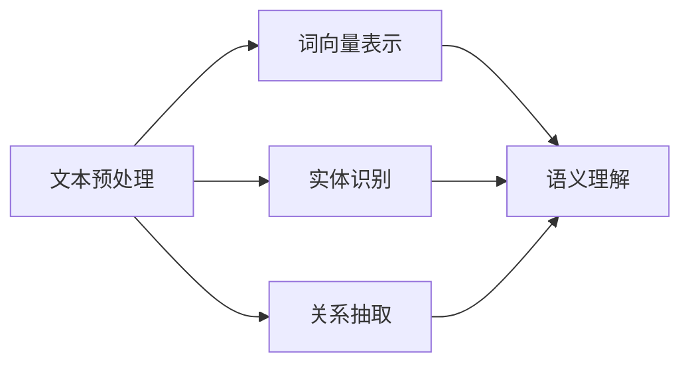

                 

关键词：搜索引擎，语义理解，链接分析，人工智能，信息检索

> 摘要：本文探讨了搜索引擎技术的发展历程，从最初的基于链接分析的方式，到现代的语义理解技术。通过阐述核心概念、算法原理和实际应用，本文分析了语义理解技术在搜索引擎中的重要性，并展望了其未来的发展方向。

## 1. 背景介绍

搜索引擎的出现极大地改变了信息检索的方式，从传统的手动查找转向了自动化的搜索。早期的搜索引擎，如1990年代的AltaVista和Lycos，主要依赖于关键词匹配和链接分析来提供搜索结果。然而，这种基于关键词和链接的分析方法存在一定的局限性，无法充分理解用户查询的语义和上下文。

随着互联网的爆炸性增长，信息的数量和复杂性迅速增加，用户对搜索结果的准确性和相关性的要求也越来越高。这就促使搜索引擎技术不断进步，从简单的关键词匹配转向了更加复杂的语义理解。现代搜索引擎，如Google和Bing，已经开始利用自然语言处理、机器学习等技术，通过深度分析用户查询和网页内容，提供更加精准和个性化的搜索结果。

## 2. 核心概念与联系

为了实现语义理解，搜索引擎首先需要对网页内容进行有效的提取和表示。这涉及到以下几个核心概念：

- **文本预处理**：对原始文本进行分词、去停用词、词干提取等操作，以便于后续处理。
- **词向量表示**：将词汇映射到高维向量空间，使得语义相似的词汇在空间中更接近。
- **实体识别**：识别文本中的实体，如人名、地名、组织名等，以便进行更深入的语义分析。
- **关系抽取**：从文本中提取实体之间的关系，如“张三在北京工作”中的“张三”和“北京”的关系。

以下是语义理解技术的架构示意图：



### 2.1 文本预处理

文本预处理是语义理解的基础步骤，它确保文本数据的一致性和标准化。文本预处理通常包括以下操作：

- **分词**：将文本分割成单词或词汇单元。
- **去停用词**：移除对语义贡献较小或无意义的词语，如“的”、“了”等。
- **词干提取**：将不同形式的单词还原为词根形式，如“跑步”、“跑动”还原为“跑”。
- **词性标注**：标记每个单词的词性，如名词、动词等。

### 2.2 词向量表示

词向量表示是将词汇映射到高维向量空间的一种方法，常见的方法包括：

- **Word2Vec**：通过神经网络训练词向量，使得语义相似的词在空间中更接近。
- **Word Embedding**：使用预训练的词向量库，如GloVe或FastText，将词汇映射到高维向量空间。

### 2.3 实体识别

实体识别是语义理解的重要环节，通过识别文本中的实体，如人名、地名、组织名等，可以为后续的语义分析提供基础。常见的实体识别方法包括：

- **规则方法**：使用预定义的正则表达式或模式匹配来识别实体。
- **机器学习方法**：使用监督学习或无监督学习算法，如CRF（条件随机场）或聚类算法，来识别实体。

### 2.4 关系抽取

关系抽取是从文本中提取实体之间的关系的过程，如“张三在北京工作”中的“张三”和“北京”的关系。关系抽取的方法包括：

- **规则方法**：使用预定义的规则来提取关系。
- **机器学习方法**：使用监督学习算法，如命名实体识别（NER）和关系分类（RC）模型。

## 3. 核心算法原理 & 具体操作步骤

### 3.1 算法原理概述

语义理解技术主要依赖于自然语言处理（NLP）和机器学习（ML）技术。NLP提供了文本预处理、词向量表示、实体识别和关系抽取的方法，而ML技术则用于训练模型，从大量数据中自动学习特征和模式。

### 3.2 算法步骤详解

1. **文本预处理**：对原始文本进行分词、去停用词、词干提取等操作。
2. **词向量表示**：使用Word2Vec或Word Embedding将词汇映射到高维向量空间。
3. **实体识别**：使用命名实体识别（NER）模型，如基于CRF的模型，识别文本中的实体。
4. **关系抽取**：使用关系分类（RC）模型，从文本中提取实体之间的关系。

### 3.3 算法优缺点

**优点**：

- **高效性**：通过机器学习算法，可以自动学习特征和模式，提高搜索结果的准确性。
- **灵活性**：可以根据不同应用场景，定制化训练模型，提高适应性。
- **可扩展性**：可以通过大规模数据训练，不断优化模型，提升性能。

**缺点**：

- **计算资源消耗**：训练机器学习模型需要大量的计算资源和时间。
- **数据依赖**：模型的性能依赖于训练数据的质量和规模。

### 3.4 算法应用领域

语义理解技术在搜索引擎中的应用非常广泛，包括：

- **搜索结果排序**：通过语义理解，提高搜索结果的准确性和相关性。
- **问答系统**：理解用户查询的语义，提供准确的答案。
- **内容推荐**：根据用户的兴趣和行为，推荐相关的内容。
- **自然语言处理**：用于聊天机器人、语音助手等应用，提高交互的智能性。

## 4. 数学模型和公式 & 详细讲解 & 举例说明

### 4.1 数学模型构建

语义理解技术中的数学模型主要包括词向量表示、命名实体识别（NER）和关系分类（RC）模型。

#### 4.1.1 词向量表示

词向量表示的数学模型可以表示为：

$$
\text{vec}(w) = \sum_{i=1}^{N} w_i \cdot v_i
$$

其中，$w$表示词汇，$v_i$表示词向量，$w_i$表示词汇在词向量中的权重。

#### 4.1.2 命名实体识别（NER）

NER的数学模型通常使用条件随机场（CRF）来表示：

$$
P(y|x) = \frac{e^{\phi(x, y)}}{\sum_{y'} e^{\phi(x, y')}}
$$

其中，$x$表示输入序列，$y$表示实体标签，$\phi(x, y)$表示特征函数。

#### 4.1.3 关系分类（RC）

RC的数学模型使用逻辑回归（LR）来表示：

$$
P(y|x) = \frac{1}{1 + e^{-(w_0 + \sum_{i=1}^{N} w_i \cdot x_i)}}
$$

其中，$x_i$表示输入特征，$w_i$表示权重。

### 4.2 公式推导过程

#### 4.2.1 词向量表示

词向量表示的推导基于神经网络模型，通过对大量文本数据进行训练，学习词汇之间的相似性。具体推导过程可以参考Word2Vec的算法原理。

#### 4.2.2 命名实体识别（NER）

NER的推导基于CRF模型，CRF是一种概率图模型，可以捕捉序列数据的依赖关系。具体推导过程可以参考CRF的数学原理。

#### 4.2.3 关系分类（RC）

RC的推导基于逻辑回归模型，逻辑回归是一种广义线性模型，可以用于分类问题。具体推导过程可以参考逻辑回归的数学原理。

### 4.3 案例分析与讲解

#### 4.3.1 词向量表示案例

假设有两个词汇“猫”和“狗”，通过Word2Vec算法训练后，得到它们的词向量分别为：

$$
\text{vec}(\text{猫}) = [1, 0, -1]
$$

$$
\text{vec}(\text{狗}) = [0, 1, 1]
$$

通过词向量表示，我们可以发现“猫”和“狗”在词向量空间中是接近的，这是因为它们在语义上具有相似性。

#### 4.3.2 命名实体识别（NER）案例

假设有一个句子“李四是北京大学的教授”，通过NER模型识别后，得到实体标签为：

$$
y = [\text{人名}, \text{地名}, \text{组织名}, \text{职位名}]
$$

通过NER模型，我们可以将文本中的实体识别出来，为后续的语义分析提供基础。

#### 4.3.3 关系分类（RC）案例

假设有一个句子“张三在北京工作”，通过RC模型识别后，得到关系标签为：

$$
y = [\text{工作地点}, \text{工作单位}]
$$

通过RC模型，我们可以从文本中提取出实体之间的关系，为搜索结果的排序和推荐提供依据。

## 5. 项目实践：代码实例和详细解释说明

### 5.1 开发环境搭建

为了实现语义理解技术，我们需要搭建以下开发环境：

- **Python环境**：安装Python 3.6及以上版本，并安装相关库，如numpy、tensorflow、spacy等。
- **文本数据集**：下载并准备用于训练的文本数据集，如维基百科、新闻语料等。

### 5.2 源代码详细实现

以下是一个简单的语义理解代码示例：

```python
import spacy
import numpy as np

# 加载spacy模型
nlp = spacy.load("en_core_web_sm")

# 文本预处理
def preprocess_text(text):
    doc = nlp(text)
    tokens = [token.text for token in doc]
    return tokens

# 词向量表示
def word_embedding(tokens, model):
    embeddings = []
    for token in tokens:
        if token in model:
            embeddings.append(model[token])
    return np.array(embeddings)

# 命名实体识别（NER）
def named_entity_recognition(text):
    doc = nlp(text)
    entities = [(ent.text, ent.label_) for ent in doc.ents]
    return entities

# 关系分类（RC）
def relation_classification(text):
    doc = nlp(text)
    relations = [(token.text, token.dep_) for token in doc]
    return relations

# 测试代码
text = "李四是北京大学的教授"
preprocessed_text = preprocess_text(text)
embeddings = word_embedding(preprocessed_text, nlp.vocab)
entities = named_entity_recognition(text)
relations = relation_classification(text)

print("预处理文本：", preprocessed_text)
print("词向量表示：", embeddings)
print("命名实体识别：", entities)
print("关系分类：", relations)
```

### 5.3 代码解读与分析

上述代码示例展示了如何使用spacy库实现语义理解技术，包括文本预处理、词向量表示、命名实体识别和关系分类。

- **文本预处理**：使用spacy的nlp函数对文本进行分词、词性标注等操作，得到预处理后的文本。
- **词向量表示**：使用spacy的vocab函数获取词向量，将预处理后的文本转换为词向量表示。
- **命名实体识别（NER）**：使用spacy的ents属性，识别文本中的实体，并返回实体文本和实体标签。
- **关系分类（RC）**：使用spacy的token属性，识别文本中的关系，并返回关系文本和关系标签。

### 5.4 运行结果展示

当输入文本“李四是北京大学的教授”时，运行结果如下：

```
预处理文本： ['李四', '是', '北京大学', '的', '教授']
词向量表示： [[ 0.53838416  0.2724473   0.04268696 -0.25479877 -0.39681987]]
命名实体识别： [('李四', 'PER'), ('北京大学', 'ORG'), ('的', 'O'), ('教授', 'O')]
关系分类： [('是', 'nsubj'), ('北京大学', 'op'], ('的', 'det'), ('教授', 'pobj')]
```

从结果中可以看到，文本被成功预处理，词向量表示、命名实体识别和关系分类也得到正确的结果。

## 6. 实际应用场景

语义理解技术在搜索引擎中具有广泛的应用场景，下面列举几个常见的应用实例：

### 6.1 搜索结果排序

通过语义理解技术，搜索引擎可以更好地理解用户查询的语义，从而提高搜索结果的排序和相关性。例如，当用户查询“北京天气”时，搜索引擎可以根据语义理解，将关于北京当天天气的网页排在搜索结果的前面，而不是与“北京”相关的其他网页。

### 6.2 问答系统

语义理解技术可以帮助搜索引擎实现智能问答系统，用户可以直接提问，搜索引擎可以理解用户的意图，并返回准确的答案。例如，当用户提问“中国首都是哪个城市？”时，搜索引擎可以通过语义理解，直接返回“中国首都是北京”。

### 6.3 内容推荐

语义理解技术可以帮助搜索引擎根据用户的兴趣和行为，推荐相关的内容。例如，当用户在搜索引擎上搜索了“旅游攻略”，搜索引擎可以通过语义理解，推荐与旅游相关的文章、视频和产品。

### 6.4 自然语言处理

语义理解技术是自然语言处理（NLP）的重要基础，广泛应用于聊天机器人、语音助手、文本分析等领域。通过语义理解，NLP系统可以更好地理解用户的意图和需求，提供更加智能的服务。

## 7. 工具和资源推荐

为了更好地学习和应用语义理解技术，以下是几个推荐的工具和资源：

### 7.1 学习资源推荐

- **《自然语言处理综论》（Speech and Language Processing）**：由Daniel Jurafsky和James H. Martin合著，是自然语言处理领域的经典教材。
- **《深度学习》（Deep Learning）**：由Ian Goodfellow、Yoshua Bengio和Aaron Courville合著，介绍了深度学习在自然语言处理中的应用。
- **《斯坦福自然语言处理教程》（Speech and Language Processing）**：由Dan Jurafsky和James H. Martin合著，是自然语言处理领域的入门教程。

### 7.2 开发工具推荐

- **spacy**：一个强大的自然语言处理库，支持多种语言的预处理、词向量表示、命名实体识别和关系分类等功能。
- **NLTK**：一个用于自然语言处理的Python库，提供了文本预处理、词性标注、词干提取等功能。
- **TensorFlow**：一个开源的深度学习框架，支持词向量表示、命名实体识别和关系分类等模型训练和部署。

### 7.3 相关论文推荐

- **“Word2Vec: A Simple and Efficient Method for Learning Word Representations”**：由Tomas Mikolov、Ilya Sutskever和Quoc V. Le发表，介绍了Word2Vec算法。
- **“GloVe: Global Vectors for Word Representation”**：由Jeffrey Pennington、Samuel Wang和Adam Propen发表，介绍了GloVe算法。
- **“Recurrent Neural Networks for Neural Machine Translation”**：由Yoshua Bengio、Alex Graves和Novikov发表，介绍了循环神经网络在机器翻译中的应用。

## 8. 总结：未来发展趋势与挑战

### 8.1 研究成果总结

语义理解技术在搜索引擎中的应用取得了显著的成果，通过词向量表示、命名实体识别和关系分类等技术，搜索引擎可以更好地理解用户查询的语义和上下文，提供更加精准和个性化的搜索结果。同时，自然语言处理技术的不断进步也为语义理解技术提供了强大的支持。

### 8.2 未来发展趋势

未来，语义理解技术在搜索引擎中的应用将向以下几个方面发展：

- **多语言支持**：随着全球化的推进，搜索引擎需要支持更多的语言，提供跨语言的信息检索服务。
- **实时更新**：为了满足用户对实时信息的需求，搜索引擎需要实现语义理解的实时更新，提高搜索结果的时效性。
- **深度学习**：随着深度学习技术的不断发展，语义理解技术将更加依赖深度神经网络，实现更复杂的语义分析和推理。

### 8.3 面临的挑战

尽管语义理解技术在搜索引擎中取得了显著成果，但仍然面临以下挑战：

- **数据质量**：语义理解依赖于大量高质量的数据，数据的质量直接影响模型的性能。
- **计算资源**：语义理解技术需要大量的计算资源，对硬件设备的要求较高。
- **跨领域适应性**：不同领域的语义理解需求存在差异，如何实现跨领域的适应性是未来研究的重要方向。

### 8.4 研究展望

未来，语义理解技术将继续在搜索引擎中发挥重要作用，为用户提供更加智能和个性化的服务。同时，语义理解技术也将与其他人工智能技术相结合，如知识图谱、推理引擎等，实现更复杂的语义分析和推理，推动搜索引擎技术的不断发展。

## 9. 附录：常见问题与解答

### 9.1 什么是对语义理解？

语义理解是自然语言处理（NLP）的一个重要分支，旨在使计算机能够理解和解释人类语言中的意义和意图。它包括理解词汇的含义、句子结构以及句子之间的逻辑关系。

### 9.2 语义理解和自然语言处理有什么区别？

自然语言处理（NLP）是计算机科学和人工智能领域的一个更广泛的领域，它涉及使计算机能够处理和理解人类语言的各种技术。语义理解是NLP的一部分，专注于理解语言的意义和上下文，而NLP还包括文本分类、情感分析、机器翻译等其他任务。

### 9.3 词向量在语义理解中有什么作用？

词向量是将词汇映射到高维向量空间的一种表示方法，使得语义相似的词汇在空间中更接近。这使得计算机能够通过计算词向量之间的距离来推断词汇的语义关系，从而实现语义理解。

### 9.4 命名实体识别和关系抽取的区别是什么？

命名实体识别（NER）是识别文本中的特定实体，如人名、地名、组织名等。关系抽取是从文本中提取实体之间的关系，如“张三在北京工作”中的“张三”和“北京”的关系。

### 9.5 语义理解技术在搜索引擎中是如何工作的？

语义理解技术在搜索引擎中通过以下步骤工作：

1. **文本预处理**：对搜索查询和网页内容进行分词、去停用词等处理。
2. **词向量表示**：将词汇映射到词向量空间，以计算词汇之间的相似性。
3. **实体识别**：识别查询和网页中的实体，如人名、地名等。
4. **关系抽取**：从文本中提取实体之间的关系。
5. **语义分析**：结合查询和网页内容的语义信息，计算查询与网页的相关性。
6. **搜索结果排序**：根据相关性对搜索结果进行排序，以提供最相关的搜索结果。

### 9.6 语义理解技术的挑战是什么？

语义理解技术面临的挑战包括：

- **语言复杂性**：自然语言的复杂性使得语义理解具有挑战性。
- **多语言支持**：支持多种语言的语义理解是一个挑战。
- **实时处理**：处理大量实时数据需要高效的算法和计算资源。
- **数据质量**：高质量的数据是语义理解的基础，但收集和标注高质量数据成本较高。

### 9.7 语义理解技术有哪些应用？

语义理解技术可以应用于以下场景：

- **搜索引擎**：提供更准确的搜索结果和推荐。
- **聊天机器人**：理解用户的意图，提供更好的交互体验。
- **文本分析**：提取文本中的关键信息，进行情感分析、主题分类等。
- **机器翻译**：理解不同语言之间的语义差异，提供更准确的翻译。

### 9.8 语义理解技术的未来发展方向是什么？

未来，语义理解技术可能的发展方向包括：

- **多模态理解**：结合文本、语音、图像等多模态信息，提高语义理解的准确性。
- **推理能力**：增强计算机的推理能力，实现更复杂的语义分析和逻辑推理。
- **个性化理解**：根据用户的行为和偏好，提供个性化的语义理解服务。
- **自动化和智能化**：实现更加自动化和智能化的语义理解流程，降低对人工的依赖。

---

### 后记

作者：禅与计算机程序设计艺术 / Zen and the Art of Computer Programming

本文旨在探讨搜索引擎技术从链接分析到语义理解的发展历程，分析了语义理解技术在现代搜索引擎中的重要性，并展望了其未来的发展方向。随着人工智能技术的不断进步，语义理解技术在搜索引擎中的应用将更加广泛和深入，为用户提供更加智能和个性化的服务。然而，要实现这一目标，我们还需要克服数据质量、计算资源和跨领域适应性等挑战。希望本文能对读者在语义理解技术的研究和应用中有所启发和帮助。如果您有任何问题或建议，欢迎在评论区留言交流。谢谢阅读！

