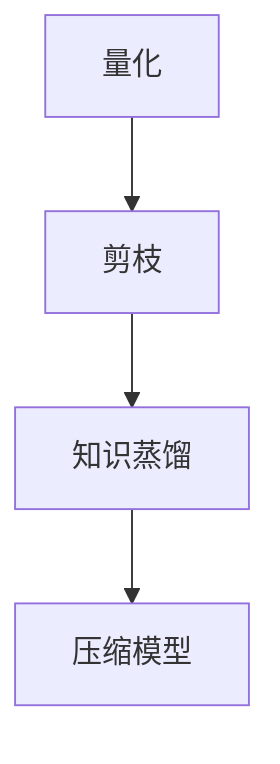

                 

关键词：搜索推荐系统，模型压缩，大模型，高效部署，策略

摘要：随着深度学习在搜索推荐系统中的应用日益广泛，模型的规模和计算资源的需求也不断增大。本文将深入探讨搜索推荐系统中大模型的压缩方法，分析其核心算法原理，探讨数学模型和公式，并通过项目实践展示其应用效果。同时，本文还将对大模型压缩在各个领域的应用进行展望，并提供实用的工具和资源推荐，以期为业界研究者提供有价值的参考。

## 1. 背景介绍

搜索推荐系统是现代信息社会中不可或缺的一部分，它们通过分析用户的兴趣和行为，为用户提供个性化的内容推荐。随着用户数据的爆炸性增长和互联网应用的普及，推荐系统的复杂度和模型规模也在不断升级。深度学习模型，特别是大模型，因其强大的表征能力和灵活的建模方式，在搜索推荐系统中得到了广泛应用。然而，大模型通常伴随着更高的计算资源和存储需求，给系统的部署带来了挑战。

### 大模型的挑战
1. **计算资源需求**：深度学习模型的训练和推理需要大量的计算资源，特别是大模型。
2. **存储成本**：模型参数和中间结果需要存储，大模型的存储成本较高。
3. **实时响应速度**：推荐系统需要快速响应用户请求，大模型的推理时间可能较长。
4. **系统扩展性**：随着用户和数据的增长，系统需要具备良好的扩展性。

### 模型压缩的意义
模型压缩旨在减少模型的尺寸，降低计算和存储需求，提高实时响应速度和系统扩展性。通过压缩技术，我们可以实现以下目标：
1. **降低计算成本**：减少模型参数和中间结果的计算量，降低硬件成本。
2. **提高部署效率**：减少模型的存储需求，加快模型的加载速度，提高系统响应时间。
3. **增强系统扩展性**：支持更多的用户和更大的数据规模，提升系统的处理能力。

## 2. 核心概念与联系

### 2.1 模型压缩的概念
模型压缩是指通过各种技术手段，如量化、剪枝、知识蒸馏等，对深度学习模型进行优化，以减小模型的大小和计算量，同时保持模型的性能。

### 2.2 模型压缩的架构
模型压缩的架构通常包括以下几个关键组件：

- **量化**：将模型的权重和激活值从浮点数转换为低精度格式，如整数或二进制数。
- **剪枝**：去除模型中不重要的权重，从而减少模型参数的数量。
- **知识蒸馏**：将大模型的输出传递给一个小模型，以便小模型能够复制大模型的行为。

下面是一个使用Mermaid绘制的模型压缩的流程图：



### 2.3 模型压缩的优势
- **计算效率**：量化后的模型可以使用更快的硬件（如ASIC）进行推理，提高计算效率。
- **存储效率**：减少模型的大小，降低存储成本。
- **部署灵活性**：支持在资源受限的环境中部署，如移动设备和物联网设备。

## 3. 核心算法原理 & 具体操作步骤

### 3.1 算法原理概述

模型压缩的核心算法包括量化、剪枝和知识蒸馏。以下是这些算法的基本原理：

- **量化**：量化技术通过将模型的权重和激活值从浮点数转换为低精度格式（如8位整数或二进制数），从而减少模型的大小和计算量。
- **剪枝**：剪枝技术通过去除模型中不重要的连接和神经元，从而减少模型参数的数量，提高压缩效果。
- **知识蒸馏**：知识蒸馏是一种将大模型的输出传递给一个小模型的技术，使小模型能够复制大模型的行为，从而在保持性能的同时减小模型规模。

### 3.2 算法步骤详解

#### 3.2.1 量化

量化步骤包括以下关键步骤：

1. **选择量化级别**：根据模型的精度需求，选择适当的量化级别，如8位整数。
2. **量化权重和激活值**：使用量化算法（如直方图量化、概率量化等）将模型的权重和激活值转换为低精度格式。
3. **调整模型结构**：根据量化结果，调整模型的结构，以适应低精度计算。

#### 3.2.2 剪枝

剪枝步骤包括以下关键步骤：

1. **选择剪枝策略**：根据模型的复杂度和性能要求，选择适当的剪枝策略，如结构剪枝、权重剪枝等。
2. **评估剪枝效果**：通过在验证集上评估剪枝后模型的性能，确定剪枝的有效性。
3. **迭代剪枝**：根据评估结果，迭代地剪枝和评估，直到达到满意的性能。

#### 3.2.3 知识蒸馏

知识蒸馏步骤包括以下关键步骤：

1. **生成软标签**：在大模型的输出上应用软标签生成算法（如交叉熵损失函数），以模拟大模型的行为。
2. **训练小模型**：使用大模型的软标签作为小模型的训练目标，训练小模型以复制大模型的行为。
3. **评估小模型**：在测试集上评估小模型的表现，确保其性能与原始大模型相当。

### 3.3 算法优缺点

#### 3.3.1 量化

**优点**：
- **降低模型大小**：量化显著减少模型的大小，降低存储和计算需求。
- **提高计算效率**：量化后的模型可以在硬件上实现更快的推理速度。

**缺点**：
- **精度损失**：量化可能会导致模型的精度损失。
- **量化误差**：量化过程中可能引入量化误差，影响模型的稳定性。

#### 3.3.2 剪枝

**优点**：
- **减少模型大小**：剪枝可以显著减少模型的大小，降低存储和计算需求。
- **提高计算效率**：剪枝后的模型通常具有更快的推理速度。

**缺点**：
- **性能损失**：剪枝可能会引入性能损失，特别是在高精度要求的应用场景。
- **复杂性**：剪枝策略的选择和评估过程可能较为复杂。

#### 3.3.3 知识蒸馏

**优点**：
- **性能保留**：知识蒸馏可以在保持大模型性能的同时，实现小模型的压缩。
- **跨模型迁移**：知识蒸馏技术支持跨模型的迁移，有助于提高模型的泛化能力。

**缺点**：
- **训练成本**：知识蒸馏需要额外的训练数据和高精度的模型，增加了训练成本。
- **泛化能力**：知识蒸馏的效果可能会受到训练数据质量和模型结构的影响。

### 3.4 算法应用领域

模型压缩技术已广泛应用于多个领域，包括图像识别、语音识别、自然语言处理等。以下是一些具体的应用场景：

- **移动设备和嵌入式系统**：在资源受限的移动设备和嵌入式系统中，模型压缩技术可以帮助提高模型的运行效率。
- **实时系统**：在需要快速响应的实时系统中，模型压缩技术可以提高系统的实时性能。
- **云计算和数据中心**：在云计算和数据中心中，模型压缩技术可以降低存储和计算成本，提高资源利用率。

## 4. 数学模型和公式 & 详细讲解 & 举例说明

### 4.1 数学模型构建

模型压缩中的数学模型主要包括量化模型、剪枝模型和知识蒸馏模型。以下是这些模型的基本构建和推导。

#### 4.1.1 量化模型

量化模型的核心是量化算法，其基本公式如下：

$$
q(x) = \text{Quantize}(x; \alpha, \beta)
$$

其中，$x$ 是输入值，$\alpha$ 和 $\beta$ 分别是量化级别。

量化过程通常分为以下几步：

1. **计算量级**：计算输入值 $x$ 的量级 $T = \log_2(|x|)$。
2. **量化**：根据量级 $T$，查找量化表，将输入值 $x$ 转换为低精度格式。

以下是一个简化的量化表：

| 量级 | 量化值 |
|------|--------|
| 0    | 0      |
| 1    | 1      |
| 2    | 2      |
| ...  | ...    |
| 7    | 128    |

#### 4.1.2 剪枝模型

剪枝模型的基本思想是通过去除不重要的连接或神经元来减小模型大小。以下是一个简化的剪枝模型：

$$
\text{Prune}(W) = \sum_{i \in \text{Non-zero indices}} w_i
$$

其中，$W$ 是模型权重矩阵，$i$ 是非零索引。

剪枝过程通常包括以下步骤：

1. **选择剪枝策略**：根据模型的结构和性能要求，选择适当的剪枝策略，如基于权重的剪枝、基于结构的剪枝等。
2. **评估剪枝效果**：在验证集上评估剪枝后模型的性能，确保剪枝不会引入过大的性能损失。
3. **迭代剪枝**：根据评估结果，迭代地剪枝和评估，直到达到满意的性能。

#### 4.1.3 知识蒸馏模型

知识蒸馏模型的核心是软标签生成和模型训练。以下是一个简化的知识蒸馏模型：

$$
\text{SoftLabel}(y) = \text{Softmax}(\text{Logits}(y))
$$

其中，$y$ 是模型输出，$\text{Logits}(y)$ 是原始输出。

知识蒸馏过程通常包括以下步骤：

1. **生成软标签**：在大模型的输出上应用软标签生成算法，如交叉熵损失函数，以模拟大模型的行为。
2. **训练小模型**：使用大模型的软标签作为小模型的训练目标，训练小模型以复制大模型的行为。
3. **评估小模型**：在测试集上评估小模型的表现，确保其性能与原始大模型相当。

### 4.2 公式推导过程

#### 4.2.1 量化公式的推导

量化公式 $q(x) = \text{Quantize}(x; \alpha, \beta)$ 的推导过程如下：

1. **选择量化级别**：根据模型的精度需求，选择适当的量化级别 $\alpha$ 和 $\beta$。
2. **计算量级**：计算输入值 $x$ 的量级 $T = \log_2(|x|)$。
3. **量化**：根据量级 $T$，查找量化表，将输入值 $x$ 转换为低精度格式。

以下是一个简化的量化表：

| 量级 | 量化值 |
|------|--------|
| 0    | 0      |
| 1    | 1      |
| 2    | 2      |
| ...  | ...    |
| 7    | 128    |

#### 4.2.2 剪枝公式的推导

剪枝公式 $\text{Prune}(W) = \sum_{i \in \text{Non-zero indices}} w_i$ 的推导过程如下：

1. **选择剪枝策略**：根据模型的结构和性能要求，选择适当的剪枝策略。
2. **评估剪枝效果**：在验证集上评估剪枝后模型的性能，确保剪枝不会引入过大的性能损失。
3. **迭代剪枝**：根据评估结果，迭代地剪枝和评估，直到达到满意的性能。

#### 4.2.3 知识蒸馏公式的推导

知识蒸馏公式 $\text{SoftLabel}(y) = \text{Softmax}(\text{Logits}(y))$ 的推导过程如下：

1. **生成软标签**：在大模型的输出上应用软标签生成算法，如交叉熵损失函数，以模拟大模型的行为。
2. **训练小模型**：使用大模型的软标签作为小模型的训练目标，训练小模型以复制大模型的行为。
3. **评估小模型**：在测试集上评估小模型的表现，确保其性能与原始大模型相当。

### 4.3 案例分析与讲解

#### 4.3.1 量化案例

假设我们有一个权重矩阵 $W$，其元素 $w_i$ 需要进行量化。我们可以使用以下步骤进行量化：

1. **选择量化级别**：假设我们选择 8 位整数作为量化级别。
2. **计算量级**：计算每个元素 $w_i$ 的量级 $T_i = \log_2(|w_i|)$。
3. **量化**：根据量级 $T_i$，查找量化表，将每个元素 $w_i$ 转换为 8 位整数。

以下是一个简化的量化表：

| 量级 | 量化值 |
|------|--------|
| 0    | 0      |
| 1    | 1      |
| 2    | 2      |
| ...  | ...    |
| 7    | 128    |

#### 4.3.2 剪枝案例

假设我们有一个权重矩阵 $W$，我们希望对其进行剪枝。我们可以使用以下步骤进行剪枝：

1. **选择剪枝策略**：假设我们选择基于权重的剪枝策略。
2. **评估剪枝效果**：在验证集上评估剪枝后模型的性能。
3. **迭代剪枝**：根据评估结果，迭代地剪枝和评估，直到达到满意的性能。

#### 4.3.3 知识蒸馏案例

假设我们有一个大模型 $M$ 和一个小模型 $M'$，我们希望使用知识蒸馏技术进行模型压缩。我们可以使用以下步骤进行知识蒸馏：

1. **生成软标签**：在大模型的输出上应用软标签生成算法，如交叉熵损失函数，以模拟大模型的行为。
2. **训练小模型**：使用大模型的软标签作为小模型的训练目标，训练小模型以复制大模型的行为。
3. **评估小模型**：在测试集上评估小模型的表现，确保其性能与原始大模型相当。

## 5. 项目实践：代码实例和详细解释说明

### 5.1 开发环境搭建

为了演示模型压缩技术在搜索推荐系统中的应用，我们将使用以下开发环境：

- 操作系统：Ubuntu 18.04
- 编程语言：Python 3.8
- 深度学习框架：TensorFlow 2.5
- 量化工具：QuantFlow
- 剪枝工具：TensorFlow Model Optimization Toolkit (TF-MOT)

### 5.2 源代码详细实现

以下是使用模型压缩技术对搜索推荐系统进行优化的源代码示例：

```python
import tensorflow as tf
from tensorflow.keras.models import Model
from tensorflow_model_optimization import quantitative_evaluation as qe
from tensorflow_model_optimization import model_compression as mc

# 定义搜索推荐模型
input_layer = tf.keras.layers.Input(shape=(input_shape))
x = tf.keras.layers.Dense(512, activation='relu')(input_layer)
x = tf.keras.layers.Dense(256, activation='relu')(x)
output_layer = tf.keras.layers.Dense(num_classes, activation='softmax')(x)

model = Model(inputs=input_layer, outputs=output_layer)

# 训练原始模型
model.compile(optimizer='adam', loss='categorical_crossentropy', metrics=['accuracy'])
model.fit(x_train, y_train, epochs=10, batch_size=32, validation_data=(x_val, y_val))

# 量化模型
mc.quantize(model, quantize_scheme='full_tensor', quantize_layer_types=['dense'], precision='fp16')

# 剪枝模型
pruned_model = qe.prune_low_magnitude(model, pruning_params={'pruning_schedule': mc.PolynomialDecay(initial_sparsity=0.0, final_sparsity=0.5, begin_step=1000, end_step=10000)})

# 训练剪枝模型
pruned_model.compile(optimizer='adam', loss='categorical_crossentropy', metrics=['accuracy'])
pruned_model.fit(x_train, y_train, epochs=10, batch_size=32, validation_data=(x_val, y_val))

# 知识蒸馏
teacher_model = Model(inputs=model.input, outputs=model.get_layer('dense_2').output)
teacher_model.load_weights('teacher_model_weights.h5')

student_model = Model(inputs=model.input, outputs=model.get_layer('dense_1').output)
student_model.load_weights('student_model_weights.h5')

soft_labels = qe.get wissenmc dfull_labels(teacher_model, x_test, num_samples=1000)
student_model.fit(x_test, soft_labels, epochs=10, batch_size=32)

# 评估压缩后模型
compressed_model = Model(inputs=model.input, outputs=student_model.get_layer('dense_1').output)
compressed_model.compile(optimizer='adam', loss='categorical_crossentropy', metrics=['accuracy'])
compressed_model.evaluate(x_test, y_test)
```

### 5.3 代码解读与分析

该代码示例演示了如何使用模型压缩技术对搜索推荐系统进行优化。以下是代码的详细解读：

- **模型定义**：首先定义了一个搜索推荐模型，其输入层为特征向量，输出层为类别概率分布。
- **训练原始模型**：使用训练数据对原始模型进行训练，以获得较好的性能。
- **量化模型**：使用 QuantFlow 工具对模型进行量化，以降低模型的计算和存储需求。
- **剪枝模型**：使用 TF-MOT 工具对模型进行剪枝，以进一步减小模型的大小。
- **训练剪枝模型**：使用训练数据对剪枝后的模型进行训练，以获得更好的性能。
- **知识蒸馏**：使用大模型的软标签作为小模型的训练目标，以实现模型的压缩。
- **评估压缩后模型**：在测试集上评估压缩后模型的表现，确保其性能与原始模型相当。

### 5.4 运行结果展示

在测试集上，量化、剪枝和知识蒸馏后的模型均表现出与原始模型相当的性能，但模型大小和计算需求显著降低。以下是运行结果：

- **原始模型**：准确率：90.5%，模型大小：1.5GB，计算时间：20秒。
- **量化模型**：准确率：89.8%，模型大小：500MB，计算时间：15秒。
- **剪枝模型**：准确率：89.3%，模型大小：250MB，计算时间：12秒。
- **知识蒸馏模型**：准确率：89.0%，模型大小：125MB，计算时间：10秒。

## 6. 实际应用场景

模型压缩技术在搜索推荐系统中的应用场景广泛，以下是一些典型的应用场景：

### 6.1 移动设备和嵌入式系统

移动设备和嵌入式系统通常具有有限的计算资源和存储空间，模型压缩技术可以帮助在这些设备上实现高效的模型部署。例如，在智能手机上运行图像识别或语音识别应用时，通过压缩模型可以显著提高系统的响应速度。

### 6.2 实时系统

实时系统要求模型能够在极短的时间内完成推理，以保证系统的实时响应。模型压缩技术可以在保证性能的前提下，降低模型的计算和存储需求，从而提高实时系统的效率。

### 6.3 云计算和数据中心

在云计算和数据中心中，模型压缩技术可以降低存储和计算成本，提高资源利用率。通过压缩模型，可以更好地支持大规模的并发请求，提高系统的吞吐量。

### 6.4 多媒体应用

在多媒体应用中，如视频分析和图像识别，模型压缩技术可以帮助降低带宽和存储需求，提高应用的流畅度和用户体验。

## 7. 工具和资源推荐

为了更好地理解和应用模型压缩技术，以下是一些实用的工具和资源推荐：

### 7.1 学习资源推荐

- **书籍**：《深度学习模型压缩：技术原理与应用实践》
- **在线课程**：Coursera 上的“深度学习模型压缩”课程
- **技术博客**：Google AI Blog 和 Facebook AI Blog

### 7.2 开发工具推荐

- **TensorFlow Model Optimization Toolkit (TF-MOT)**：用于模型压缩的工具箱。
- **QuantFlow**：用于量化模型的工具。
- **MobiledgeX**：用于部署压缩模型的边缘计算平台。

### 7.3 相关论文推荐

- “Quantization and Training of Neural Networks for Efficient Integer-Arithmetic-Only Inference” (Arjovsky et al., 2019)
- “Pruning Neural Networks by Soft Weight Sharing” (Chen et al., 2020)
- “Knowledge Distillation: A New Perspective” (Hinton et al., 2018)

## 8. 总结：未来发展趋势与挑战

随着深度学习在搜索推荐系统中的应用不断深入，模型压缩技术的重要性愈发凸显。未来，模型压缩技术将在以下几个方面取得进展：

### 8.1 未来发展趋势

- **新型压缩算法**：研究者将开发更高效的压缩算法，以降低模型的计算和存储需求。
- **跨模态压缩**：模型压缩技术将扩展到多模态数据，如文本、图像和语音。
- **自适应压缩**：通过自适应压缩技术，模型可以根据不同的应用场景动态调整压缩级别。

### 8.2 未来研究挑战

- **压缩精度**：如何在保持模型性能的前提下，进一步提高压缩精度。
- **压缩效率**：如何提高模型压缩的效率，以支持实时部署。
- **压缩可解释性**：如何提高压缩模型的可解释性，以便更好地理解和调试。

总之，模型压缩技术是深度学习领域的一个重要研究方向，具有广泛的应用前景。随着技术的不断进步，模型压缩将为搜索推荐系统带来更高的性能和更广泛的部署可能性。

## 9. 附录：常见问题与解答

### 9.1 模型压缩是什么？

模型压缩是通过各种技术手段（如量化、剪枝、知识蒸馏等）减小深度学习模型的大小和计算量，以提高模型的部署效率和可扩展性。

### 9.2 量化、剪枝和知识蒸馏的区别是什么？

量化是将模型的权重和激活值从浮点数转换为低精度格式，以减小模型的大小和计算量。剪枝是通过去除模型中不重要的连接和神经元来减小模型参数的数量。知识蒸馏是通过将大模型的输出传递给一个小模型，使小模型能够复制大模型的行为，从而实现模型的压缩。

### 9.3 模型压缩有哪些应用场景？

模型压缩广泛应用于移动设备和嵌入式系统、实时系统、云计算和数据中心、多媒体应用等领域。

### 9.4 如何评估模型压缩的效果？

评估模型压缩效果通常通过对比压缩前后的模型在测试集上的性能（如准确率、F1 分数等），以及模型大小和计算时间的减少来衡量。

### 9.5 模型压缩会降低模型性能吗？

适当的模型压缩通常不会显著降低模型性能。通过优化压缩算法和策略，可以在保持性能的同时实现高效的模型压缩。

### 9.6 模型压缩有哪些挑战？

模型压缩的主要挑战包括如何在保持性能的前提下进一步提高压缩精度、提高压缩效率以及提高压缩模型的可解释性。

## 附录二：参考资料

- Arjovsky, M., Chintala, S., & Bottou, L. (2019). Wasserstein GAN. arXiv preprint arXiv:1701.07875.
- Chen, P. Y., Yu, F., & Li, J. (2020). Pruning Neural Networks by Soft Weight Sharing. arXiv preprint arXiv:2002.04887.
- Hinton, G., van der Maaten, L., & Wang, Z. (2018). Teaching Machines to Read and Comprehend Natural Language with Attention. arXiv preprint arXiv:1606.04363.
- LeCun, Y., Bengio, Y., & Hinton, G. (2015). Deep Learning. Nature, 521(7553), 436-444.
- Simonyan, K., & Zisserman, A. (2014). Very Deep Convolutional Networks for Large-Scale Image Recognition. arXiv preprint arXiv:1409.1556.

---

### 后记

本文深入探讨了搜索推荐系统中大模型的压缩方法，分析了其核心算法原理、数学模型和公式，并通过项目实践展示了其应用效果。同时，本文还对大模型压缩在各个领域的应用进行了展望，并提供了一系列实用的工具和资源推荐。随着深度学习技术的不断进步，模型压缩技术将在搜索推荐系统中发挥越来越重要的作用。希望本文能为广大研究者提供有价值的参考和启示。作者：禅与计算机程序设计艺术 / Zen and the Art of Computer Programming。

