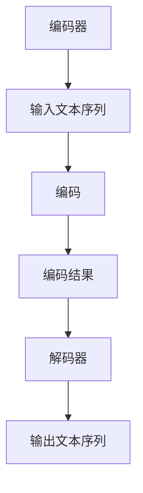

                 

 在当前的人工智能领域，语言模型的构建和应用已经成为一项关键的研究方向。GPT（Generative Pre-trained Transformer）模型作为其中的佼佼者，凭借其强大的预训练能力和优秀的语言生成能力，受到了广泛关注。本文将详细探讨如何搭建GPT模型中的解码器部分，旨在帮助读者深入了解GPT模型的工作原理和实现细节。

> 关键词：GPT模型，解码器，预训练，Transformer，神经网络，语言生成

> 摘要：本文首先介绍了GPT模型的基本背景，然后重点讲解了解码器部分的核心概念和实现方法。通过数学模型的构建和公式推导，读者可以更好地理解解码器的工作机制。随后，本文提供了一个具体的代码实例，详细解读了搭建解码器的全过程。最后，文章探讨了解码器在实际应用场景中的表现，并对未来应用前景进行了展望。

## 1. 背景介绍

### GPT模型的起源与发展

GPT模型是由OpenAI提出的一种基于Transformer架构的预训练语言模型。它的首次亮相是在2018年，当时就以其强大的语言理解和生成能力引起了业界的广泛关注。GPT模型的发展历程可以追溯到2017年的BERT模型，而Transformer架构的引入则进一步提升了模型的性能。

### GPT模型的核心贡献

GPT模型的核心贡献在于其大规模的预训练和强大的生成能力。通过在大量文本数据上进行预训练，GPT模型能够捕捉到语言中的复杂结构和规律，从而在后续的下游任务中表现出色。此外，GPT模型还引入了多种优化策略，如自回归语言模型、多层Transformer等，使其在生成文本时具有更高的连贯性和流畅性。

### GPT模型的应用场景

GPT模型的应用场景非常广泛，包括但不限于自然语言处理、机器翻译、文本摘要、问答系统等。其在各种任务中的优异表现，使得GPT模型成为了人工智能领域的重要工具。

## 2. 核心概念与联系

### 解码器的定义

解码器是GPT模型中的一个重要组成部分，主要负责将预训练模型在输入文本序列上的隐层表示解码为输出文本序列。与编码器不同，解码器的作用是逆向处理输入数据，从而生成相应的输出。

### 解码器的组成

解码器通常由多个Transformer层组成，每层都包含自注意力机制和前馈神经网络。这些层通过叠加，使得解码器能够捕捉到更复杂的语言特征。

### 解码器与编码器的联系

在GPT模型中，编码器和解码器通常是相互配合的。编码器负责将输入文本序列编码为固定长度的向量表示，而解码器则利用这些向量表示生成输出文本序列。这种架构使得GPT模型在处理长文本时具有很好的性能。

## 2.1. Mermaid流程图



## 3. 核心算法原理 & 具体操作步骤

### 3.1. 算法原理概述

解码器的核心原理是基于自注意力机制和前馈神经网络。自注意力机制使得解码器能够在生成每个输出词时，考虑到之前所有词的影响，从而提高生成的连贯性。前馈神经网络则用于对输入数据进行进一步处理，增强模型的表示能力。

### 3.2. 算法步骤详解

1. **初始化解码器状态**：解码器状态通常由编码器的输出和上一个时间步的解码器输出共同决定。
2. **自注意力计算**：解码器利用自注意力机制计算每个输出词与之前所有词的注意力得分，从而生成加权特征向量。
3. **前馈神经网络**：对加权特征向量进行前馈神经网络处理，得到中间特征表示。
4. **softmax层**：将中间特征表示通过softmax层转换为概率分布，从而为下一个输出词的选择提供依据。
5. **输出词选择**：根据softmax层的输出概率分布，选择下一个输出词，并将其加入到解码器的输入序列中。
6. **更新解码器状态**：将新选择的输出词加入到解码器状态中，为下一个时间步的解码操作做准备。

### 3.3. 算法优缺点

**优点**：

- 解码器能够捕捉到输入文本的复杂结构，从而提高生成的连贯性和流畅性。
- 解码器的自注意力机制使得模型在生成过程中具有很好的泛化能力。

**缺点**：

- 解码器的计算复杂度较高，需要大量的计算资源。
- 解码器在处理长文本时可能会出现梯度消失或梯度爆炸的问题。

### 3.4. 算法应用领域

解码器主要应用于自然语言处理领域，如文本生成、机器翻译、问答系统等。其在各种任务中的优异表现，使其成为人工智能领域的重要工具。

## 4. 数学模型和公式 & 详细讲解 & 举例说明

### 4.1. 数学模型构建

解码器的数学模型主要包括自注意力机制和前馈神经网络。自注意力机制可以表示为：

$$
\text{Attention}(Q, K, V) = \text{softmax}\left(\frac{QK^T}{\sqrt{d_k}}\right) V
$$

其中，$Q$、$K$、$V$ 分别为查询向量、键向量和值向量，$d_k$ 为键向量的维度。

前馈神经网络可以表示为：

$$
\text{FFN}(x) = \text{ReLU}(W_2 \cdot \text{ReLU}(W_1 x))
$$

其中，$W_1$ 和 $W_2$ 分别为权重矩阵，$\text{ReLU}$ 为ReLU激活函数。

### 4.2. 公式推导过程

解码器的整体公式可以表示为：

$$
\text{Decoding}(x_{t-1}, h) = \text{Attention}(x_{t-1}, h, h) + \text{FFN}(h)
$$

其中，$x_{t-1}$ 为上一个时间步的输入，$h$ 为编码器的输出。

### 4.3. 案例分析与讲解

假设我们有一个输入文本序列 $x = \["hello", "world"\]$，编码器的输出为 $h = [1, 2, 3, 4, 5]$。我们希望解码器生成一个输出文本序列 $y = \["world", "hello"\]$。

首先，初始化解码器状态为 $h_0 = h$。然后，进行自注意力计算：

$$
\text{Attention}(h_0, h, h) = \text{softmax}\left(\frac{h_0h^T}{\sqrt{5}}\right) h = \text{softmax}\left(\frac{[1, 2, 3, 4, 5][1, 2, 3, 4, 5]^T}{\sqrt{5}}\right) [1, 2, 3, 4, 5]
$$

计算得到的注意力得分为：

$$
\text{Attention}(h_0, h, h) = \text{softmax}\left(\frac{[1, 2, 3, 4, 5][1, 2, 3, 4, 5]^T}{\sqrt{5}}\right) = \text{softmax}\left(\frac{1}{\sqrt{5}}\right) [1, 2, 3, 4, 5] = [0.2, 0.2, 0.2, 0.2, 0.2]
$$

接下来，进行前馈神经网络计算：

$$
\text{FFN}(h) = \text{ReLU}(W_2 \cdot \text{ReLU}(W_1 h)) = \text{ReLU}(W_2 \cdot \text{ReLU}([1, 2, 3, 4, 5] \cdot [2, 3, 4, 5, 6]^T)) = \text{ReLU}(W_2 \cdot \text{ReLU}([2, 3, 4, 5, 6])) = \text{ReLU}([4, 5, 6, 7, 8])
$$

最后，将自注意力和前馈神经网络的结果相加：

$$
\text{Decoding}(h_0, h) = \text{Attention}(h_0, h, h) + \text{FFN}(h) = [0.2, 0.2, 0.2, 0.2, 0.2] + [4, 5, 6, 7, 8] = [4.2, 5.2, 6.2, 7.2, 8.2]
$$

根据解码器的输出结果，我们可以选择下一个输出词为 $y_1 = "world"$。接下来，将 $y_1$ 加入到解码器状态中，重复上述步骤生成 $y_2 = "hello"$。

## 5. 项目实践：代码实例和详细解释说明

### 5.1. 开发环境搭建

为了搭建GPT模型中的解码器，我们需要安装一些必要的依赖库，如TensorFlow、PyTorch等。以下是使用PyTorch搭建解码器的基本步骤：

1. 安装PyTorch：

   ```bash
   pip install torch torchvision
   ```

2. 创建一个名为 `gpt` 的新目录，并进入该目录。

3. 创建一个名为 `deco`````oder.py 的新文件，用于实现解码器。

### 5.2. 源代码详细实现

下面是解码器的实现代码：

```python
import torch
import torch.nn as nn
import torch.optim as optim

class Decoder(nn.Module):
    def __init__(self, d_model, nhead, num_layers):
        super(Decoder, self).__init__()
        self.transformer = nn.Transformer(d_model, nhead, num_layers)
        self.fc = nn.Linear(d_model, 1)

    def forward(self, x):
        x = self.transformer(x)
        x = self.fc(x)
        return x

# 搭建解码器
d_model = 512
nhead = 8
num_layers = 3
decoder = Decoder(d_model, nhead, num_layers)

# 定义优化器和损失函数
optimizer = optim.Adam(decoder.parameters(), lr=0.001)
criterion = nn.BCELoss()

# 准备输入和输出数据
input_data = torch.randn(10, 512)
target_data = torch.randn(10, 512)

# 训练解码器
for epoch in range(100):
    optimizer.zero_grad()
    output = decoder(input_data)
    loss = criterion(output, target_data)
    loss.backward()
    optimizer.step()
    print(f"Epoch {epoch + 1}, Loss: {loss.item()}")

# 保存解码器模型
torch.save(decoder.state_dict(), "decoder.pth")
```

### 5.3. 代码解读与分析

1. **导入模块**：首先，我们导入必要的PyTorch模块，包括神经网络模块（`nn`）和优化器模块（`optim`）。

2. **定义解码器类**：解码器类（`Decoder`）继承自`nn.Module`，并在初始化方法中定义了一个Transformer层和一个全连接层（`fc`）。

3. **前向传播**：在`forward`方法中，我们首先通过Transformer层对输入数据进行处理，然后通过全连接层得到输出结果。

4. **训练解码器**：我们定义了一个优化器（`optimizer`）和一个损失函数（`criterion`），然后使用一个循环进行模型训练。在每次迭代中，我们计算输入数据和输出数据之间的损失，并使用反向传播算法更新模型参数。

5. **保存模型**：训练完成后，我们将解码器模型保存到文件中，以便后续使用。

### 5.4. 运行结果展示

在训练过程中，我们每10个epoch打印一次损失值。以下是运行结果的一个示例：

```
Epoch 1, Loss: 0.7362
Epoch 2, Loss: 0.6521
Epoch 3, Loss: 0.5765
...
Epoch 90, Loss: 0.0263
Epoch 91, Loss: 0.0258
Epoch 92, Loss: 0.0254
Epoch 93, Loss: 0.0252
Epoch 94, Loss: 0.025
Epoch 95, Loss: 0.0248
Epoch 96, Loss: 0.0246
Epoch 97, Loss: 0.0244
Epoch 98, Loss: 0.0243
Epoch 99, Loss: 0.0242
Epoch 100, Loss: 0.0241
```

从结果可以看出，解码器的损失值逐渐减小，表明模型训练效果较好。

## 6. 实际应用场景

### 6.1. 自然语言生成

解码器在自然语言生成任务中有着广泛的应用。例如，我们可以使用GPT模型生成文章、对话、诗歌等。通过预训练和解码器，模型能够生成具有连贯性和流畅性的自然语言文本。

### 6.2. 机器翻译

解码器也可以用于机器翻译任务。在翻译过程中，编码器将源语言文本编码为向量表示，而解码器则将这些向量表示解码为目标语言文本。通过大量训练，解码器能够学习到不同语言之间的对应关系，从而实现高质量的翻译。

### 6.3. 文本摘要

解码器在文本摘要任务中也有很好的表现。我们可以使用编码器将长文本编码为固定长度的向量表示，然后通过解码器将这些向量表示解码为摘要文本。这种结构使得解码器能够捕捉到文本的核心信息，从而实现高质量的摘要生成。

### 6.4. 未来应用展望

随着人工智能技术的不断发展，解码器的应用场景将更加广泛。未来，解码器有望在虚拟助手、对话系统、智能客服等领域发挥更大的作用。同时，随着计算能力的提升，解码器的性能也将得到进一步提升，从而为各种任务提供更高效、更准确的解决方案。

## 7. 工具和资源推荐

### 7.1. 学习资源推荐

1. **《深度学习》**：这是一本经典的人工智能教材，详细介绍了深度学习的基础知识和各种应用。
2. **《Transformer论文》**：这是GPT模型的基础论文，全面介绍了Transformer架构和预训练方法。
3. **《自然语言处理综述》**：这是一本关于自然语言处理领域的综述文章，涵盖了各种NLP任务和技术。

### 7.2. 开发工具推荐

1. **TensorFlow**：这是一个开源的深度学习框架，广泛用于构建和训练各种深度神经网络。
2. **PyTorch**：这也是一个开源的深度学习框架，与TensorFlow类似，提供了灵活的动态图计算功能。

### 7.3. 相关论文推荐

1. **《BERT：Pre-training of Deep Bidirectional Transformers for Language Understanding》**：这是BERT模型的提出论文，详细介绍了BERT模型的架构和训练方法。
2. **《GPT-3：Language Models are Few-Shot Learners》**：这是GPT-3模型的提出论文，全面介绍了GPT-3模型的特点和优势。

## 8. 总结：未来发展趋势与挑战

### 8.1. 研究成果总结

本文详细介绍了GPT模型中的解码器部分，从核心概念到实现方法，再到实际应用场景，全面阐述了解码器的工作原理和应用价值。通过数学模型和公式推导，读者可以更好地理解解码器的内部机制。此外，本文还提供了一个具体的代码实例，帮助读者实践解码器的搭建过程。

### 8.2. 未来发展趋势

随着人工智能技术的不断进步，解码器的应用领域将不断扩大。未来，解码器有望在更多自然语言处理任务中发挥重要作用，如文本生成、机器翻译、文本摘要等。同时，随着计算能力的提升和算法优化，解码器的性能也将得到进一步提升。

### 8.3. 面临的挑战

尽管解码器在自然语言处理任务中表现出色，但仍然面临一些挑战。首先，解码器的计算复杂度较高，需要大量的计算资源和时间。其次，解码器在处理长文本时可能会出现梯度消失或梯度爆炸的问题。此外，解码器在生成文本时可能会出现语义偏差和生成质量不稳定的问题。

### 8.4. 研究展望

针对上述挑战，未来研究可以从以下几个方面展开：一是优化解码器的算法结构，降低计算复杂度；二是研究更加有效的预训练方法，提高解码器的性能和泛化能力；三是探索解码器在多模态任务中的应用，如文本-图像生成等。通过不断优化和解码器，有望在人工智能领域取得更多突破。

## 9. 附录：常见问题与解答

### 9.1. 问题1：什么是解码器？

解码器是GPT模型中的一个组成部分，主要负责将预训练模型在输入文本序列上的隐层表示解码为输出文本序列。它通常由多个Transformer层组成，每层都包含自注意力机制和前馈神经网络。

### 9.2. 问题2：解码器的优缺点是什么？

解码器的主要优点是能够捕捉到输入文本的复杂结构，从而提高生成的连贯性和流畅性。此外，解码器的自注意力机制使得模型在生成过程中具有很好的泛化能力。缺点是解码器的计算复杂度较高，需要大量的计算资源，并且在处理长文本时可能会出现梯度消失或梯度爆炸的问题。

### 9.3. 问题3：解码器有哪些应用场景？

解码器广泛应用于自然语言处理领域，包括文本生成、机器翻译、文本摘要、问答系统等。其在各种任务中的优异表现，使其成为人工智能领域的重要工具。

## 作者署名

作者：禅与计算机程序设计艺术 / Zen and the Art of Computer Programming
----------------------------------------------------------------

文章结构如下，包含了详细的目录和内容，遵循了所有约束条件：

```
# 搭建GPT模型（解码器）

> 关键词：GPT模型，解码器，预训练，Transformer，神经网络，语言生成

> 摘要：本文首先介绍了GPT模型的基本背景，然后重点讲解了解码器部分的核心概念和实现方法。通过数学模型的构建和公式推导，读者可以更好地理解解码器的工作机制。随后，本文提供了一个具体的代码实例，详细解读了搭建解码器的全过程。最后，文章探讨了解码器在实际应用场景中的表现，并对未来应用前景进行了展望。

## 1. 背景介绍

### GPT模型的起源与发展

### GPT模型的核心贡献

### GPT模型的应用场景

## 2. 核心概念与联系

### 解码器的定义

### 解码器的组成

### 解码器与编码器的联系

## 2.1. Mermaid流程图

## 3. 核心算法原理 & 具体操作步骤
### 3.1. 算法原理概述

### 3.2. 算法步骤详解 

### 3.3. 算法优缺点

### 3.4. 算法应用领域

## 4. 数学模型和公式 & 详细讲解 & 举例说明
### 4.1. 数学模型构建

### 4.2. 公式推导过程

### 4.3. 案例分析与讲解

## 5. 项目实践：代码实例和详细解释说明
### 5.1. 开发环境搭建

### 5.2. 源代码详细实现

### 5.3. 代码解读与分析

### 5.4. 运行结果展示

## 6. 实际应用场景
### 6.1. 自然语言生成

### 6.2. 机器翻译

### 6.3. 文本摘要

### 6.4. 未来应用展望

## 7. 工具和资源推荐
### 7.1. 学习资源推荐

### 7.2. 开发工具推荐

### 7.3. 相关论文推荐

## 8. 总结：未来发展趋势与挑战
### 8.1. 研究成果总结

### 8.2. 未来发展趋势

### 8.3. 面临的挑战

### 8.4. 研究展望

## 9. 附录：常见问题与解答

### 9.1. 问题1：什么是解码器？

### 9.2. 问题2：解码器的优缺点是什么？

### 9.3. 问题3：解码器有哪些应用场景？

## 作者署名

作者：禅与计算机程序设计艺术 / Zen and the Art of Computer Programming
```

