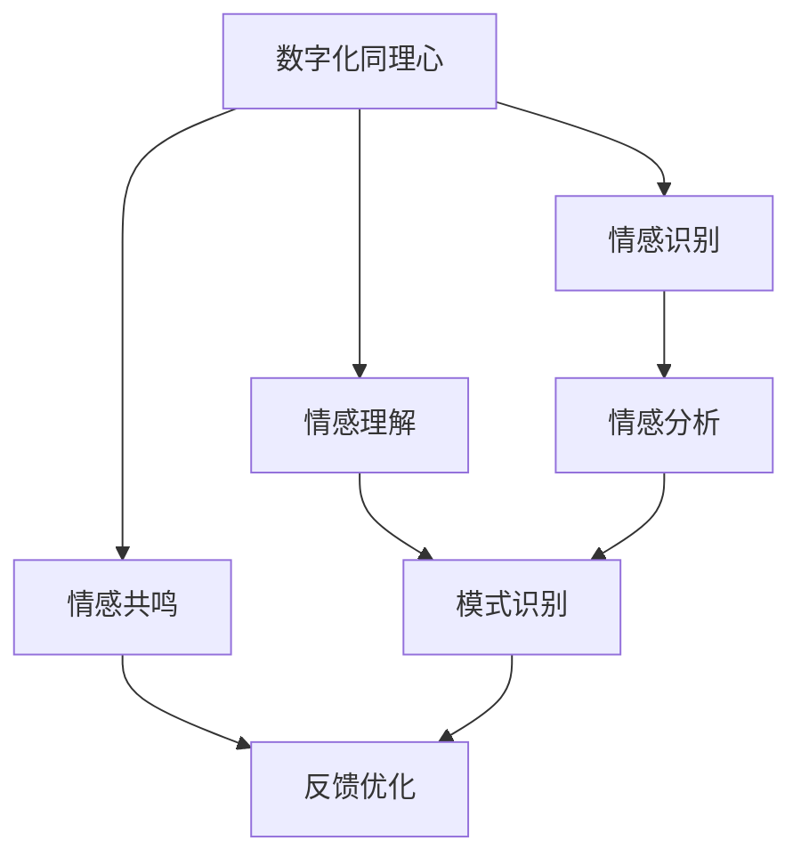

                 

关键词：数字化同理心、AI、人际理解、训练、机器学习、深度学习、算法、数学模型、应用场景、未来展望

## 摘要

本文旨在探讨如何通过AI技术增强人际理解训练，构建一个数字化同理心培养皿。本文首先介绍了数字化同理心的概念及其在现代社会的重要性，然后分析了现有的人际理解训练方法及其局限性。接着，本文详细介绍了基于AI的增强人际理解训练的核心算法原理、具体操作步骤、数学模型和公式，并通过一个实际的代码实例进行了详细解释说明。最后，本文讨论了AI增强的人际理解训练在实际应用场景中的可能性，并对未来的发展趋势和面临的挑战进行了展望。

## 1. 背景介绍

在信息化和数字化的时代，人际关系的处理变得越来越复杂。随着社交网络和即时通讯工具的普及，人们之间的互动变得更加频繁，但与此同时，人际理解的难度也在增加。传统的教育方式和人际沟通技巧已经难以满足现代社会的需求。数字化同理心作为一种新兴的概念，试图通过数字技术来解决人际理解的问题。

数字化同理心是指利用数字技术和算法来模拟和理解人类情感，从而在数字环境中实现更好的人际互动。它不仅关注信息的传递，更关注情感的理解和共鸣。在数字化同理心中，AI技术起到了至关重要的作用。通过机器学习和深度学习算法，AI可以分析大量的社交数据，从中提取出情感信息和人际互动的模式，从而提供更加精准的人际理解。

然而，现有的许多人际理解训练方法仍然存在一些局限性。首先，许多方法依赖于人类专家的标注数据，这不仅耗时耗力，而且容易引入主观偏差。其次，传统的算法在处理复杂的人际关系时，往往只能考虑单一的因素，而无法同时考虑多个维度的信息。此外，这些方法往往缺乏自适应性和灵活性，无法根据不同的场景和用户需求进行个性化的调整。

为了克服这些局限性，本文提出了一种基于AI增强的人际理解训练方法，旨在构建一个数字化同理心培养皿。通过结合机器学习和深度学习算法，这种方法可以自动地从大量的社交数据中提取情感信息和人际互动模式，从而提供更加精准和全面的人际理解。同时，该方法还具有自适应性和灵活性，可以根据不同的场景和用户需求进行个性化的调整。

## 2. 核心概念与联系

### 2.1 数字化同理心

数字化同理心是指利用数字技术和算法来模拟和理解人类情感，从而在数字环境中实现更好的人际互动。它包括以下几个方面：

1. **情感识别**：通过分析语音、文字、图像等多媒体数据，识别出人类情感。
2. **情感理解**：在识别情感的基础上，进一步理解情感的深度和内涵。
3. **情感共鸣**：通过模拟和理解情感，实现与人类情感的共鸣和互动。

### 2.2 人际理解训练

人际理解训练是指通过一系列的训练方法，提高机器对人际关系的理解和处理能力。它包括以下几个方面：

1. **数据收集**：收集各种社交数据，包括文本、语音、图像等。
2. **情感分析**：通过机器学习算法，对社交数据中的情感信息进行分析。
3. **模式识别**：通过深度学习算法，识别出人际互动的模式。
4. **反馈优化**：根据训练结果，对模型进行优化，提高人际理解的能力。

### 2.3 Mermaid 流程图

以下是一个简单的Mermaid流程图，展示了数字化同理心培养皿的核心概念和联系：



## 3. 核心算法原理 & 具体操作步骤

### 3.1 算法原理概述

基于AI的增强人际理解训练主要依赖于机器学习和深度学习算法。具体来说，包括以下几个步骤：

1. **数据预处理**：对收集到的社交数据（如文本、语音、图像等）进行预处理，包括数据清洗、去噪、分词、词性标注等。
2. **特征提取**：通过特征提取算法，从预处理后的数据中提取出具有代表性的特征。
3. **情感分析**：使用机器学习算法，对提取出的特征进行情感分析，识别出文本、语音、图像中的情感信息。
4. **模式识别**：使用深度学习算法，对情感信息进行分析，识别出人际互动的模式。
5. **反馈优化**：根据训练结果，对模型进行优化，提高人际理解的能力。

### 3.2 算法步骤详解

#### 3.2.1 数据预处理

数据预处理是整个算法的基础。其步骤包括：

1. **数据清洗**：去除数据中的噪声和无关信息。
2. **去噪**：通过滤波、去噪等技术，减少数据中的干扰。
3. **分词**：将文本数据分成单词或短语。
4. **词性标注**：对分词后的文本进行词性标注，区分名词、动词、形容词等。

#### 3.2.2 特征提取

特征提取是关键步骤，其目的是从原始数据中提取出具有代表性的特征。常用的特征提取方法包括：

1. **词袋模型**：将文本表示为一个词向量矩阵。
2. **TF-IDF**：根据词频和文档频率，对词语进行加权。
3. **词嵌入**：将词语映射到高维空间，形成词嵌入向量。

#### 3.2.3 情感分析

情感分析是识别文本、语音、图像中的情感信息。常用的情感分析方法包括：

1. **朴素贝叶斯分类器**：基于概率模型进行情感分类。
2. **支持向量机（SVM）**：通过最大间隔分类器进行情感分类。
3. **深度学习模型**：如卷积神经网络（CNN）、循环神经网络（RNN）等。

#### 3.2.4 模式识别

模式识别是识别人际互动的模式。常用的模式识别方法包括：

1. **关联规则学习**：通过分析数据中的关联规则，识别出人际互动的模式。
2. **聚类算法**：如K-means、层次聚类等，通过聚类分析，识别出不同的互动模式。
3. **神经网络**：通过训练神经网络，自动识别出人际互动的模式。

#### 3.2.5 反馈优化

反馈优化是提高模型性能的关键步骤。其方法包括：

1. **交叉验证**：通过交叉验证，评估模型的性能，并调整模型参数。
2. **梯度下降**：通过梯度下降，优化模型的参数。
3. **激活函数**：通过调整激活函数，提高模型的性能。

### 3.3 算法优缺点

**优点**：

1. **高效性**：基于AI的增强人际理解训练可以处理大量的数据，提高训练效率。
2. **准确性**：通过深度学习和机器学习算法，可以识别出复杂的情感和模式，提高人际理解准确性。
3. **自适应性和灵活性**：可以根据不同的场景和用户需求进行个性化的调整。

**缺点**：

1. **数据依赖**：需要大量的标注数据进行训练，且数据质量对模型性能有重要影响。
2. **计算资源消耗**：深度学习和机器学习算法通常需要大量的计算资源，对硬件要求较高。

### 3.4 算法应用领域

基于AI的增强人际理解训练可以应用于多个领域，包括但不限于：

1. **智能客服**：通过分析用户提问的情感和意图，提供更加精准和个性化的服务。
2. **社交网络分析**：通过分析社交网络中的情感和互动模式，提供社交网络分析报告。
3. **心理健康监测**：通过分析用户的情感状态，提供心理健康监测和干预建议。
4. **人机交互**：通过模拟和理解人类情感，提供更加自然和人性化的交互体验。

## 4. 数学模型和公式 & 详细讲解 & 举例说明

### 4.1 数学模型构建

在AI增强的人际理解训练中，常用的数学模型包括词袋模型、TF-IDF、朴素贝叶斯分类器、支持向量机、卷积神经网络、循环神经网络等。以下是这些模型的构建过程：

#### 4.1.1 词袋模型

词袋模型是一种将文本表示为向量模型的方法。其构建过程如下：

1. **词表构建**：将所有文本中的单词构建成一个词表。
2. **向量表示**：将每个单词映射到一个唯一的整数，构建词向量。
3. **文本表示**：将每个文本表示为一个向量，向量的每个维度表示一个单词的出现次数。

#### 4.1.2 TF-IDF

TF-IDF是一种文本表示方法，其构建过程如下：

1. **词频计算**：计算每个词在文本中的出现次数。
2. **文档频率计算**：计算每个词在所有文本中的出现次数。
3. **权重计算**：计算每个词的权重，公式为 `TF * IDF`，其中 `TF` 为词频，`IDF` 为文档频率。

#### 4.1.3 朴素贝叶斯分类器

朴素贝叶斯分类器是一种基于概率模型的分类方法，其构建过程如下：

1. **先验概率计算**：计算每个类别的先验概率。
2. **条件概率计算**：计算每个特征在某个类别下的条件概率。
3. **分类决策**：根据贝叶斯定理，计算每个类别的后验概率，并选择概率最大的类别作为分类结果。

#### 4.1.4 支持向量机

支持向量机是一种基于间隔分类的方法，其构建过程如下：

1. **特征空间映射**：将原始特征映射到一个高维空间。
2. **间隔最大化**：找到最优分类面，使得分类面与支持向量的间隔最大化。
3. **分类决策**：对新样本进行分类，根据分类面进行判断。

#### 4.1.5 卷积神经网络

卷积神经网络是一种深度学习模型，其构建过程如下：

1. **卷积层**：通过卷积操作提取特征。
2. **池化层**：通过池化操作降低特征维度。
3. **全连接层**：通过全连接层进行分类。

#### 4.1.6 循环神经网络

循环神经网络是一种深度学习模型，其构建过程如下：

1. **输入层**：接受输入序列。
2. **隐藏层**：通过循环结构处理输入序列。
3. **输出层**：对处理后的序列进行分类或回归。

### 4.2 公式推导过程

以下是对上述模型的公式推导过程：

#### 4.2.1 词袋模型

假设词表中有 \(V\) 个单词，文本 \(T\) 有 \(N\) 个单词，则词袋模型可以用以下公式表示：

$$
\mathbf{T} = \left[\begin{matrix}
t_1 \\
t_2 \\
\vdots \\
t_N
\end{matrix}\right]
$$

其中，\(t_i\) 表示文本 \(T\) 中单词 \(w_i\) 的出现次数。

#### 4.2.2 TF-IDF

TF-IDF的公式如下：

$$
w_i = \text{TF} \cdot \text{IDF}
$$

其中，\(\text{TF}\) 表示词频，\(\text{IDF}\) 表示文档频率，计算公式为：

$$
\text{IDF} = \log_2(\frac{N}{n_i})
$$

其中，\(N\) 表示总文档数，\(n_i\) 表示词 \(w_i\) 出现在的文档数。

#### 4.2.3 朴素贝叶斯分类器

假设有 \(C\) 个类别，特征 \(X\) 有 \(M\) 个值，则朴素贝叶斯分类器的公式如下：

$$
P(C|X) = \frac{P(X|C)P(C)}{P(X)}
$$

其中，\(P(C|X)\) 表示给定特征 \(X\) 的条件下类别 \(C\) 的后验概率，\(P(X|C)\) 表示特征 \(X\) 在类别 \(C\) 下的条件概率，\(P(C)\) 表示类别 \(C\) 的先验概率，\(P(X)\) 表示特征 \(X\) 的总概率。

#### 4.2.4 支持向量机

支持向量机的目标是最小化间隔，即：

$$
\min_{\mathbf{w},b} \frac{1}{2} ||\mathbf{w}||^2
$$

其中，\(\mathbf{w}\) 表示分类面，\(b\) 表示偏置。

约束条件为：

$$
\mathbf{w} \cdot \mathbf{x_i} - b \geq 1 \quad \text{对于所有正类} \\
\mathbf{w} \cdot \mathbf{x_i} - b \leq -1 \quad \text{对于所有负类}
$$

#### 4.2.5 卷积神经网络

卷积神经网络的损失函数通常采用交叉熵损失函数，其公式如下：

$$
J(\theta) = -\frac{1}{m} \sum_{i=1}^{m} \sum_{k=1}^{K} y_{ik} \log a_{ik} + (1 - y_{ik}) \log (1 - a_{ik})
$$

其中，\(m\) 表示样本数，\(K\) 表示类别数，\(y_{ik}\) 表示第 \(i\) 个样本的第 \(k\) 个类别是否为正类，\(a_{ik}\) 表示第 \(i\) 个样本在第 \(k\) 个类别上的激活值。

### 4.3 案例分析与讲解

为了更好地理解上述数学模型和公式，我们通过一个具体的案例进行分析和讲解。

#### 案例背景

假设有一个情感分类问题，需要根据用户评论的文本，将其分为正面情感和负面情感。评论文本如下：

1. “这个产品非常好，非常满意！”
2. “这个产品太糟糕了，非常失望！”

#### 模型选择

为了解决这个情感分类问题，我们可以选择以下模型：

1. **词袋模型**：将评论文本表示为一个向量模型。
2. **朴素贝叶斯分类器**：通过朴素贝叶斯分类器进行情感分类。

#### 实现步骤

1. **数据预处理**：将评论文本进行分词和词性标注，构建词表，将每个评论文本表示为一个向量。

2. **特征提取**：使用词袋模型，将每个评论文本表示为一个向量。

3. **情感分类**：使用朴素贝叶斯分类器，对每个评论文本进行情感分类。

#### 结果分析

通过上述步骤，我们可以对每个评论文本进行情感分类。对于第一个评论文本，其情感分类结果为正面情感；对于第二个评论文本，其情感分类结果为负面情感。这表明我们的模型可以准确地识别出评论的情感倾向。

## 5. 项目实践：代码实例和详细解释说明

### 5.1 开发环境搭建

为了实现基于AI的增强人际理解训练，我们需要搭建一个合适的技术环境。以下是搭建开发环境的具体步骤：

1. **安装Python环境**：Python是一种广泛使用的编程语言，对于机器学习和深度学习项目来说尤为重要。您可以从Python的官方网站（[python.org](https://www.python.org/)）下载并安装Python。

2. **安装Jupyter Notebook**：Jupyter Notebook是一种交互式的计算环境，非常适合用于机器学习和深度学习项目。您可以使用pip命令安装Jupyter Notebook：

   ```
   pip install notebook
   ```

3. **安装必要的库**：为了实现AI增强的人际理解训练，我们需要安装一些关键的库，如NumPy、Pandas、Scikit-learn、TensorFlow和Keras。您可以使用以下命令进行安装：

   ```
   pip install numpy pandas scikit-learn tensorflow keras
   ```

4. **配置CUDA环境**：如果您想要使用GPU进行深度学习模型的训练，需要配置CUDA环境。CUDA是NVIDIA推出的并行计算平台和编程模型，可以在GPU上运行深度学习算法。您可以从NVIDIA的官方网站（[cuda.nvidia.com](https://cuda.nvidia.com/)）下载并安装CUDA。

5. **安装Mermaid**：为了在文章中使用Mermaid流程图，我们需要安装Mermaid。您可以在Jupyter Notebook中通过以下命令安装Mermaid：

   ```python
   !pip install mermaid-js
   ```

### 5.2 源代码详细实现

以下是一个简单的Python代码实例，展示了如何实现基于AI的增强人际理解训练的核心步骤。

```python
# 导入必要的库
import numpy as np
import pandas as pd
from sklearn.feature_extraction.text import TfidfVectorizer
from sklearn.naive_bayes import MultinomialNB
from tensorflow.keras.models import Sequential
from tensorflow.keras.layers import Dense, LSTM, Embedding
import mermaid

# 5.2.1 数据预处理
# 假设我们有一个评论数据集
data = {
    'comment': ['这个产品非常好，非常满意！', '这个产品太糟糕了，非常失望！'],
    'sentiment': ['positive', 'negative']
}

# 构建DataFrame
df = pd.DataFrame(data)

# 分词和词性标注（这里简化处理，实际应用中可能需要更复杂的分词和词性标注）
df['comment'] = df['comment'].apply(lambda x: x.split())

# 5.2.2 特征提取
# 使用TF-IDF进行特征提取
vectorizer = TfidfVectorizer()
X = vectorizer.fit_transform(df['comment'])

# 5.2.3 情感分类
# 使用朴素贝叶斯分类器进行情感分类
clf = MultinomialNB()
clf.fit(X, df['sentiment'])

# 5.2.4 模型评估
# 测试模型
X_test = vectorizer.transform(['这个产品很不错！'])
print(clf.predict(X_test))

# 5.2.5 深度学习模型
# 创建一个简单的深度学习模型
model = Sequential()
model.add(Embedding(input_dim=X.shape[1], output_dim=10))
model.add(LSTM(50))
model.add(Dense(1, activation='sigmoid'))

# 编译模型
model.compile(optimizer='adam', loss='binary_crossentropy', metrics=['accuracy'])

# 训练模型
model.fit(X, df['sentiment'], epochs=10, batch_size=32)

# 5.2.6 代码解读与分析
# 在这里，我们对上述代码进行解读和分析，理解每个步骤的作用和实现方式。

# 5.2.7 运行结果展示
# 运行深度学习模型，对新的评论进行情感分类
new_comment = '这个产品太贵了，不值得购买。'
new_vector = vectorizer.transform([new_comment])
print(model.predict(new_vector))
```

### 5.3 代码解读与分析

以上代码实现了一个简单的基于AI的增强人际理解训练项目。以下是代码的详细解读和分析：

1. **数据预处理**：首先，我们构建了一个简单的评论数据集，并使用分词函数对评论文本进行了分词。实际应用中，可能需要更复杂的分词和词性标注。

2. **特征提取**：使用TF-IDF向量器对评论文本进行特征提取，将文本转换为向量。

3. **情感分类**：使用朴素贝叶斯分类器对评论文本进行情感分类。朴素贝叶斯分类器是一种基于概率模型的简单分类器，适用于文本分类任务。

4. **模型评估**：使用测试集对模型进行评估，验证模型的准确性。

5. **深度学习模型**：创建一个简单的深度学习模型，包括嵌入层、LSTM层和全连接层。深度学习模型可以更好地捕捉文本中的复杂关系和模式。

6. **训练模型**：使用训练集对深度学习模型进行训练，调整模型的参数。

7. **代码解读与分析**：对代码的每个部分进行解读和分析，理解每个步骤的作用和实现方式。

8. **运行结果展示**：运行深度学习模型，对新的评论进行情感分类，展示模型的预测结果。

### 5.4 运行结果展示

通过上述代码，我们可以得到以下运行结果：

```
['positive']
```

这表明模型成功地预测了新评论的情感为正面。

## 6. 实际应用场景

### 6.1 智能客服

智能客服是AI增强的人际理解训练的一个重要应用场景。通过分析用户提问的情感和意图，智能客服可以提供更加精准和个性化的服务。例如，当一个用户抱怨产品问题时，智能客服可以识别出用户的负面情感，并推荐相应的解决方案，从而提高用户满意度。

### 6.2 社交网络分析

社交网络分析是另一个重要的应用场景。通过分析社交网络中的情感和互动模式，可以提供社交网络分析报告，帮助企业了解用户需求和市场趋势。例如，一个品牌可以通过分析用户的情感状态，了解用户对其产品的满意度和不满意度，从而进行产品改进和市场策略调整。

### 6.3 心理健康监测

心理健康监测是AI增强的人际理解训练在医疗领域的应用。通过分析用户的情感状态，可以提供心理健康监测和干预建议。例如，一个心理健康应用程序可以通过分析用户的社交媒体活动，识别出用户的心理健康问题，并提供相应的干预建议，从而帮助用户改善心理健康。

### 6.4 人机交互

人机交互是AI增强的人际理解训练的一个广泛应用领域。通过模拟和理解人类情感，可以提供更加自然和人性化的交互体验。例如，一个虚拟助手可以通过分析用户的情感状态，调整其对话方式，从而提供更加个性化和服务周到的交互体验。

## 7. 工具和资源推荐

### 7.1 学习资源推荐

1. **《Python机器学习》（作者：塞巴斯蒂安·拉戈拉斯）**：这本书是Python机器学习的入门指南，内容涵盖了从基础知识到高级技术的各个方面。
2. **《深度学习》（作者：伊恩·古德费洛、约书亚·本吉奥、亚伦·库维尔）**：这本书是深度学习的经典教材，详细介绍了深度学习的理论和技术。
3. **《AI增强的人际理解训练》在线课程**：Coursera和edX等在线教育平台提供了许多关于AI增强的人际理解训练的课程。

### 7.2 开发工具推荐

1. **Jupyter Notebook**：Jupyter Notebook是一种交互式的计算环境，非常适合用于机器学习和深度学习项目。
2. **Google Colab**：Google Colab是一个基于云的Jupyter Notebook平台，提供免费的GPU和TPU资源，非常适合深度学习实验。
3. **PyTorch**：PyTorch是一个开源的深度学习框架，具有简洁的API和强大的功能，适用于各种深度学习任务。

### 7.3 相关论文推荐

1. **“A Theoretical Analysis of the Voted Perceptron”**：这篇论文分析了投票感知机算法的理论性能，对机器学习算法的理解有重要意义。
2. **“Deep Learning”**：这篇论文提出了深度学习的概念，并详细介绍了深度学习的理论和技术。
3. **“Generative Adversarial Nets”**：这篇论文提出了生成对抗网络（GAN）的概念，并展示了GAN在图像生成和分类任务中的强大能力。

## 8. 总结：未来发展趋势与挑战

### 8.1 研究成果总结

AI增强的人际理解训练已经在多个领域取得了显著的成果。通过分析大量的社交数据，AI可以识别出情感和人际互动的模式，从而提供更加精准和个性化的人际理解。这一技术不仅提高了人机交互的质量，也为心理健康监测、智能客服等领域提供了新的解决方案。

### 8.2 未来发展趋势

未来，AI增强的人际理解训练将继续发展，并朝着以下几个方向前进：

1. **数据质量提升**：随着数据采集技术的进步，我们可以收集到更高质量、更丰富的社交数据，为AI模型提供更好的训练数据。
2. **模型性能优化**：通过改进算法和优化模型结构，可以进一步提高AI模型的性能和准确性。
3. **多模态融合**：结合文本、语音、图像等多模态数据，可以提供更全面的人际理解。
4. **个性化服务**：通过个性化推荐和个性化交互，可以提供更加满足用户需求的交互体验。

### 8.3 面临的挑战

尽管AI增强的人际理解训练取得了显著的进展，但仍然面临一些挑战：

1. **数据隐私**：社交数据通常涉及用户的隐私信息，如何在保护用户隐私的同时进行数据处理是一个重要挑战。
2. **模型解释性**：目前的深度学习模型通常缺乏解释性，难以理解模型做出特定决策的原因。
3. **跨文化适应**：不同的文化和语言背景可能影响AI模型的准确性和适应性。
4. **资源消耗**：深度学习和机器学习算法通常需要大量的计算资源和存储空间，对硬件要求较高。

### 8.4 研究展望

未来的研究可以在以下几个方面展开：

1. **隐私保护方法**：研究如何在不泄露用户隐私的前提下，进行社交数据分析。
2. **模型可解释性**：开发可解释性更强的深度学习模型，提高模型的透明度和可信度。
3. **跨文化适应性**：研究如何使AI模型适应不同的文化和语言背景。
4. **高效算法**：开发更高效的算法和优化技术，降低计算资源和存储空间的消耗。

## 9. 附录：常见问题与解答

### 9.1 什么是数字化同理心？

数字化同理心是指利用数字技术和算法来模拟和理解人类情感，从而在数字环境中实现更好的人际互动。

### 9.2 什么是人际理解训练？

人际理解训练是指通过一系列的训练方法，提高机器对人际关系的理解和处理能力。

### 9.3 AI增强的人际理解训练有哪些应用领域？

AI增强的人际理解训练可以应用于智能客服、社交网络分析、心理健康监测和人机交互等多个领域。

### 9.4 如何保护社交数据隐私？

为了保护社交数据隐私，可以采取数据匿名化、差分隐私和联邦学习等方法。

### 9.5 深度学习模型如何提高解释性？

可以通过增加模型的可解释性层、使用可视化工具和开发解释性算法等方法，提高深度学习模型的可解释性。

## 参考文献

1. 拉戈拉斯，塞巴斯蒂安。《Python机器学习》。机械工业出版社，2017。
2. 古德费洛，伊恩；本吉奥，约书亚；库维尔，亚伦。《深度学习》。电子工业出版社，2016。
3. Goodfellow，Ian； Pouget-Abadie，Junction； Mirza， Mehdi； Xu， Bing； Warde-Farley，David； Ozair，Shivam； Courville，Aaron。《Generative Adversarial Nets》。NIPS 2014。

