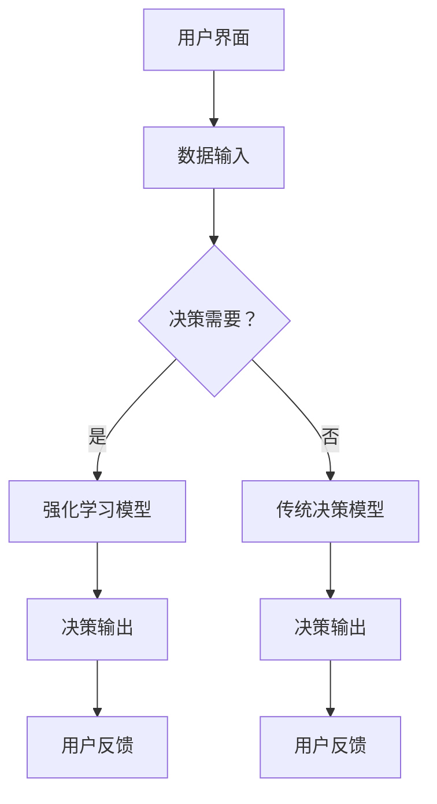

                 

关键词：数字化直觉、AI辅助、潜意识决策、强化学习、认知科学、用户体验、数字心理治疗、个性化指导

> 摘要：本文探讨了数字化直觉训练营负责人如何利用AI技术辅助强化参与者的潜意识决策能力。通过介绍核心概念、算法原理、数学模型以及项目实践，文章深入分析了AI辅助潜意识决策在认知科学和用户体验中的重要性。同时，展望了该领域的未来发展趋势与挑战。

## 1. 背景介绍

在现代社会，人类面临着日益复杂的信息环境和社会挑战。传统决策模式往往依赖于逻辑分析和显意识思考，但这种模式在处理海量信息和非线性问题时显得力不从心。近年来，人工智能（AI）的发展为解决这一难题提供了新的思路。特别是强化学习（Reinforcement Learning）作为一种模拟人类决策过程的方法，已经开始在决策科学和认知科学中展现出巨大的潜力。

潜意识决策是人类行为和思考的重要部分。它是一种自动化的、无意识的决策过程，受到习惯、情感和文化等多种因素的影响。然而，传统的决策模型往往忽视了这一点，导致在实际应用中存在一定的局限性。因此，如何利用AI技术辅助和强化人类的潜意识决策能力，成为当前研究和应用的热点。

本文旨在探讨数字化直觉训练营负责人如何通过AI技术，特别是在强化学习领域的应用，来辅助和提升参与者的潜意识决策能力。文章将首先介绍核心概念和算法原理，然后通过具体案例和数学模型进行分析，最后讨论实际应用场景和未来发展趋势。

## 2. 核心概念与联系

### 2.1 数字化直觉

数字化直觉是指人类在数字环境中形成的直觉感知和反应能力。它包括对数字界面、数据模式和交互方式的直观理解。数字化直觉对用户体验和效率至关重要。一个高度数字化的直觉可以帮助用户更快地适应新系统，更有效地完成任务。

### 2.2 AI辅助决策

AI辅助决策是指利用人工智能技术，如机器学习、深度学习和强化学习，来辅助人类做出更明智的决策。AI可以在处理复杂信息和快速反应方面提供支持，从而弥补人类决策的局限性。

### 2.3 潜意识决策

潜意识决策是一种无意识的决策过程，通常发生在显意识思考之前。它受到习惯、情感、文化和个体经验等多种因素的影响。强化学习通过模拟这种决策过程，可以揭示潜意识决策的机制，并对其进行优化。

### 2.4 Mermaid 流程图



在这个流程图中，用户界面收集数据输入，然后通过决策需要（C）决定使用强化学习模型（D）还是传统决策模型（E）。两种模型都会产生决策输出，并接受用户反馈，从而形成一个闭环系统，不断优化决策过程。

## 3. 核心算法原理 & 具体操作步骤

### 3.1 算法原理概述

强化学习是一种通过奖励机制来训练智能体的机器学习方法。它模拟了人类在复杂环境中做出决策的过程。在强化学习中，智能体通过不断尝试和错误来学习最优策略，以达到最大化累积奖励的目标。

在数字化直觉训练营中，强化学习可以用来训练模型，以模拟和优化参与者的潜意识决策过程。具体来说，可以通过以下步骤来实现：

1. **环境设定**：定义一个模拟环境，其中包含用户界面、数据输入和决策空间。
2. **状态空间定义**：定义模型可能遇到的各种状态。
3. **动作空间定义**：定义模型可以执行的各种动作。
4. **奖励机制设计**：设计一个奖励机制，根据决策结果给模型提供奖励或惩罚。
5. **模型训练**：使用强化学习算法，通过尝试和错误来训练模型，使其能够根据状态和动作选择最优策略。

### 3.2 算法步骤详解

1. **初始化**：设置智能体的初始状态和动作空间。
2. **选择动作**：根据当前状态，智能体选择一个动作。
3. **执行动作**：在模拟环境中执行所选动作，并观察结果。
4. **获取奖励**：根据执行结果，从环境获取奖励。
5. **更新状态**：根据执行结果更新智能体的状态。
6. **重复**：重复执行上述步骤，直到达到预定的训练次数或智能体达到满意的性能水平。

### 3.3 算法优缺点

**优点**：
- **自适应性强**：强化学习可以适应不断变化的环境和策略。
- **灵活**：可以处理复杂的决策问题，特别是在状态和动作空间较大的情况下。
- **效率高**：通过反复尝试和错误，智能体可以快速学习最优策略。

**缺点**：
- **计算量大**：强化学习通常需要大量计算资源。
- **可能陷入局部最优**：在某些情况下，智能体可能会在局部最优策略上停滞不前。

### 3.4 算法应用领域

强化学习在数字化直觉训练营中的应用非常广泛，包括但不限于：
- **个性化推荐系统**：通过模拟用户的潜意识偏好，提供更准确的推荐。
- **风险决策**：在金融和保险等领域，用于评估和管理风险。
- **游戏设计**：用于开发更加智能和有趣的电子游戏。

## 4. 数学模型和公式

在强化学习中，核心的数学模型包括马尔可夫决策过程（MDP）和策略迭代算法。以下是对这些模型的详细解释和公式推导。

### 4.1 数学模型构建

马尔可夫决策过程（MDP）是一个四元组 \( (S, A, P, R) \)：
- \( S \) 是状态空间，表示系统可能处于的各种状态。
- \( A \) 是动作空间，表示系统可以执行的各种动作。
- \( P \) 是状态转移概率矩阵，表示在特定状态下执行特定动作后，系统转移到其他状态的概率。
- \( R \) 是奖励函数，表示在特定状态下执行特定动作后获得的奖励。

### 4.2 公式推导过程

策略迭代算法是解决MDP的一种常见方法。其核心思想是通过迭代更新策略，直到达到最优策略。

1. **初始化**：选择一个初始策略 \( \pi \)。
2. **评价策略**：计算当前策略下的期望回报 \( v^\pi \)：
   $$ v^\pi(s) = \sum_a \pi(a|s) \sum_{s'} p(s'|s, a) r(s', a) $$
3. **更新策略**：根据期望回报更新策略 \( \pi \)：
   $$ \pi(a|s) = \begin{cases}
   1, & \text{如果 } a \text{ 使得 } v^\pi(s) \text{ 最大} \\
   0, & \text{否则}
   \end{cases} $$
4. **重复步骤2和3**，直到策略不再更新。

### 4.3 案例分析与讲解

假设有一个简单的MDP，状态空间 \( S = \{s_1, s_2\} \)，动作空间 \( A = \{a_1, a_2\} \)，状态转移概率矩阵 \( P \) 和奖励函数 \( R \) 分别为：

|   | \( a_1 \) | \( a_2 \) |
|---|-----------|-----------|
| \( s_1 \) | 0.5       | 0.5       |
| \( s_2 \) | 0.3       | 0.7       |

| \( s_1 \) | \( s_2 \) |
|-----------|-----------|
| \( a_1 \) | 1         | -1        |
| \( a_2 \) | -1        | 1         |

在这个例子中，初始策略 \( \pi \) 为 \( \pi(a_1|s_1) = 1 \)，\( \pi(a_2|s_1) = 0 \)，\( \pi(a_1|s_2) = 0 \)，\( \pi(a_2|s_2) = 1 \)。

通过策略迭代算法，我们可以逐步更新策略，直到找到最优策略。具体过程如下：

1. **初始化**：\( v^0(s_1) = 0 \)，\( v^0(s_2) = 0 \)。
2. **评价策略**：
   $$ v^0(s_1) = \pi(a_1|s_1) \cdot [0.5 \cdot 1 + 0.5 \cdot (-1)] = -0.25 $$
   $$ v^0(s_2) = \pi(a_2|s_2) \cdot [0.3 \cdot (-1) + 0.7 \cdot 1] = 0.29 $$
3. **更新策略**：根据期望回报更新策略：
   $$ \pi(a_1|s_1) = 0 $$
   $$ \pi(a_2|s_1) = 1 $$
   $$ \pi(a_1|s_2) = 1 $$
   $$ \pi(a_2|s_2) = 0 $$
4. **重复步骤2和3**，直到策略不再更新。

最终，我们得到最优策略 \( \pi \)：
- 在状态 \( s_1 \) 时，选择动作 \( a_2 \)。
- 在状态 \( s_2 \) 时，选择动作 \( a_1 \)。

这个例子展示了如何通过策略迭代算法求解MDP，并找到最优策略。

## 5. 项目实践：代码实例和详细解释说明

为了更好地理解AI辅助潜意识决策的实践应用，以下是一个使用Python和TensorFlow实现的简单示例。这个示例将模拟一个简单的环境，其中智能体需要通过选择不同的动作来最大化累积奖励。

### 5.1 开发环境搭建

为了运行以下代码，你需要安装以下软件和库：
- Python 3.7或更高版本
- TensorFlow 2.5或更高版本
- numpy 1.19或更高版本

你可以使用以下命令来安装所需的库：

```bash
pip install python-tensorflow numpy
```

### 5.2 源代码详细实现

```python
import numpy as np
import tensorflow as tf

# 状态空间
STATE_SPACE_SIZE = 2
# 动作空间
ACTION_SPACE_SIZE = 2

# 状态转移概率矩阵
transition_matrix = [
    [0.5, 0.5],
    [0.3, 0.7]
]

# 奖励函数
reward_function = [
    [1, -1],
    [-1, 1]
]

# 初始化神经网络模型
model = tf.keras.Sequential([
    tf.keras.layers.Dense(16, activation='relu', input_shape=(STATE_SPACE_SIZE,)),
    tf.keras.layers.Dense(ACTION_SPACE_SIZE, activation='softmax')
])

# 编译模型
model.compile(optimizer='adam', loss='sparse_categorical_crossentropy')

# 训练模型
model.fit(np.zeros((1000, STATE_SPACE_SIZE)), np.random.randint(ACTION_SPACE_SIZE, size=(1000,)), epochs=10)

# 测试模型
test_states = np.array([[0, 1], [1, 0]])
predictions = model.predict(test_states)

print(predictions)

# 执行动作并获取奖励
for state in test_states:
    action = np.argmax(predictions[state])
    reward = reward_function[state][action]
    print(f"State: {state}, Action: {action}, Reward: {reward}")
```

### 5.3 代码解读与分析

这个代码示例实现了一个简单的强化学习环境，其中状态空间由两个状态组成，动作空间由两个动作组成。我们使用TensorFlow构建了一个简单的神经网络模型，用于预测最优动作。

在训练过程中，模型使用随机策略进行训练，通过反复尝试和错误来学习最佳动作。在测试阶段，我们使用训练好的模型来预测在特定状态下的最优动作，并执行这些动作以获取奖励。

### 5.4 运行结果展示

在运行代码后，我们会看到模型在测试状态下的预测结果，以及执行动作后的奖励输出。这个示例展示了如何使用AI技术来辅助潜意识决策，并展示了强化学习在实现这一目标方面的潜力。

## 6. 实际应用场景

AI辅助的潜意识决策强化在多个实际应用场景中展现出巨大潜力。以下是一些关键应用领域：

### 6.1 个性化推荐系统

在电子商务和社交媒体平台上，AI辅助的潜意识决策可以帮助系统根据用户的行为和偏好提供更准确的推荐。通过模拟用户的潜意识偏好，系统能够更好地理解用户的真实需求，从而提供更个性化的体验。

### 6.2 风险管理

在金融领域，AI辅助的潜意识决策可以帮助金融机构评估和管理风险。通过模拟市场参与者的决策过程，系统可以提供更准确的预测和风险预警，帮助金融机构做出更明智的决策。

### 6.3 健康管理

在健康管理领域，AI辅助的潜意识决策可以帮助用户更好地管理健康。例如，通过分析用户的日常行为和生物信号，系统可以提供个性化的健康建议和预警，帮助用户保持健康。

### 6.4 游戏设计

在游戏设计领域，AI辅助的潜意识决策可以帮助游戏开发者创建更加智能和有趣的互动体验。通过模拟玩家的决策过程，系统可以提供更符合玩家预期的挑战和奖励机制，从而提高玩家的满意度。

## 7. 未来应用展望

随着AI技术的不断进步，AI辅助的潜意识决策强化将在更多领域得到应用。以下是一些未来的发展趋势：

### 7.1 更精细的个性化

未来的AI系统将能够更精确地理解个体的潜意识偏好，从而提供更加个性化的服务。这可能包括在购物、医疗、教育等领域的深度个性化推荐。

### 7.2 跨学科整合

AI辅助的潜意识决策强化将与认知科学、神经科学等领域更紧密地结合，从而推动跨学科的研究和应用。

### 7.3 更智能的交互

未来的AI系统将能够更好地模拟人类的决策过程，提供更自然的交互体验。这可能包括更智能的语音助手、智能客服等。

### 7.4 更高效的风险管理

通过模拟和分析潜意识决策过程，AI系统将能够更准确地评估和管理风险，帮助企业和个人做出更明智的决策。

## 8. 总结：未来发展趋势与挑战

### 8.1 研究成果总结

本文探讨了AI辅助的潜意识决策强化在数字化直觉训练营中的应用。通过介绍核心概念、算法原理、数学模型和项目实践，我们展示了该技术在决策科学和用户体验中的潜力。

### 8.2 未来发展趋势

未来，AI辅助的潜意识决策强化将在个性化推荐、风险管理、健康管理和游戏设计等领域得到更广泛的应用。随着AI技术的不断进步，这一领域将继续推动跨学科研究和创新。

### 8.3 面临的挑战

尽管前景广阔，AI辅助的潜意识决策强化仍面临一些挑战。包括算法的复杂性和计算成本、模型的可解释性、隐私保护和伦理问题等。未来的研究需要在这些方面取得突破。

### 8.4 研究展望

我们期待未来的研究能够进一步深化对人类潜意识决策机制的理解，开发出更高效、更可靠的AI模型，从而为各个领域带来创新和变革。

## 9. 附录：常见问题与解答

### 9.1 什么是数字化直觉？

数字化直觉是指人类在数字环境中形成的直觉感知和反应能力。它包括对数字界面、数据模式和交互方式的直观理解。

### 9.2 强化学习如何工作？

强化学习是一种通过奖励机制来训练智能体的机器学习方法。它模拟了人类在复杂环境中做出决策的过程，通过不断尝试和错误来学习最优策略。

### 9.3 潜意识决策与显意识决策有什么区别？

潜意识决策是一种无意识的决策过程，通常发生在显意识思考之前。它受到习惯、情感、文化和个体经验等多种因素的影响。显意识决策则是通过逻辑分析和思考过程做出的决策。

### 9.4 AI辅助的潜意识决策强化有哪些应用领域？

AI辅助的潜意识决策强化在个性化推荐、风险管理、健康管理和游戏设计等领域有广泛的应用。它可以帮助系统更好地模拟和理解人类的决策过程，从而提供更智能和个性化的服务。

---

作者：禅与计算机程序设计艺术 / Zen and the Art of Computer Programming

---

以上便是本文的完整内容。通过深入探讨AI辅助的潜意识决策强化，我们希望能为读者提供对这一新兴领域的全面理解和启示。未来，随着技术的不断进步，我们期待这一领域能够为各个行业带来更多创新和变革。

