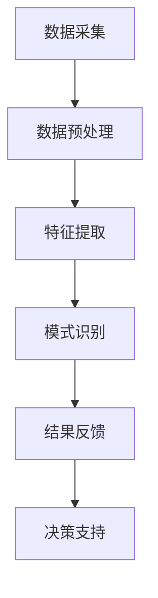

                 

关键词：AI、超感知能力、数字化、感知技术、算法原理、应用场景、未来展望

> 摘要：本文探讨了AI如何通过数字化手段辅助人类实现超感知能力，分析了相关核心概念、算法原理、数学模型、实际应用和未来发展趋势。通过详细的案例分析，展示了AI辅助超感知能力在实际项目中的运用，并提出了未来研究的前景和挑战。

## 1. 背景介绍

在当今的信息时代，我们生活在数据的世界中，几乎所有的活动都可以通过数字化的方式记录和解读。随着人工智能（AI）技术的迅猛发展，计算机处理数据的速度和效率已经远远超过了人类。这使得AI不仅仅是处理数据的高手，更成为辅助人类感知世界的强大工具。AI辅助的超感知能力，是指通过AI技术增强人类的感知能力，实现超越人类生理感知范围的目标。

感知是人类与外界交互的基础。传统的感知主要依赖于人体的五官，但AI的出现打破了这一限制。AI可以通过传感器、图像处理、自然语言处理等多种技术手段，获取和处理人类无法直接感知的信息。例如，AI可以通过分析图像识别出人类看不到的微弱信号，或者通过自然语言处理理解人类无法听见的语音信息。这种超越人类生理感知的能力，被称为“超感知能力”。

数字化是实现AI辅助超感知能力的关键。数字化不仅仅是将现实世界的信息转换为数字信号，更重要的是通过数字技术对信息进行加工和处理，从而挖掘出新的价值。数字化不仅提高了AI的感知效率，还使得AI能够以更加智能的方式辅助人类。

## 2. 核心概念与联系

### 2.1 AI与超感知能力

AI与超感知能力的结合，可以追溯到AI的早期发展。早期AI的研究主要集中在如何让计算机模拟人类的思维过程。随着技术的进步，AI开始能够处理大量的数据，并从中提取出有价值的信息。这种能力使得AI在感知领域具有了独特的优势。

AI通过以下方式实现超感知能力：

1. **数据处理能力**：AI可以通过大数据分析，从海量数据中提取出人类无法直接感知的信息。
2. **模式识别**：AI可以识别出人类无法察觉的模式和规律，从而实现超感知。
3. **多模态感知**：AI可以通过多种传感器和数据源，获取多维度的感知信息。

### 2.2 数字化与超感知能力

数字化是实现超感知能力的基础。数字化不仅仅是对信息的记录和存储，更重要的是对信息进行加工和处理。数字化使得AI能够以更加智能的方式获取和处理信息，从而实现超感知。

数字化与超感知能力的联系体现在以下几个方面：

1. **数据采集**：数字化使得AI可以通过传感器和网络实时采集各种类型的数据。
2. **数据处理**：数字化技术提供了强大的数据处理能力，使得AI能够从海量数据中提取出有价值的信息。
3. **信息传递**：数字化技术使得AI可以通过网络将处理结果传递给用户，实现实时感知。

### 2.3 Mermaid 流程图

以下是一个简化的 Mermaid 流程图，展示了 AI 如何通过数字化实现超感知能力的过程：



### 2.4 超感知能力的分类

超感知能力可以根据其应用领域和实现方式的不同，分为以下几类：

1. **视觉感知**：通过图像识别、计算机视觉等技术实现的超感知能力，如人脸识别、物体识别等。
2. **听觉感知**：通过自然语言处理、语音识别等技术实现的超感知能力，如语音识别、情感分析等。
3. **触觉感知**：通过传感器和网络技术实现的超感知能力，如触感手套、机器人手臂等。
4. **空间感知**：通过GPS、增强现实（AR）等技术实现的超感知能力，如位置跟踪、虚拟现实等。

## 3. 核心算法原理 & 具体操作步骤

### 3.1 算法原理概述

AI实现超感知能力的基础是算法。以下是几种核心算法的原理概述：

1. **图像识别算法**：基于深度学习，通过训练模型识别图像中的内容。
2. **自然语言处理算法**：基于神经网络，对文本进行处理和理解。
3. **传感器数据处理算法**：基于数据挖掘和统计分析，对传感器数据进行处理和分析。

### 3.2 算法步骤详解

以下是一个简单的图像识别算法的步骤：

1. **数据预处理**：对图像进行缩放、裁剪、灰度化等处理，使其适应算法的需求。
2. **特征提取**：通过卷积神经网络（CNN）提取图像的深层次特征。
3. **分类预测**：利用提取到的特征，通过分类器对图像进行分类。
4. **结果反馈**：将分类结果反馈给用户，供用户决策。

### 3.3 算法优缺点

每种算法都有其优缺点，以下是几种常见算法的优缺点分析：

1. **图像识别算法**：优点在于准确率高，适用于多种应用场景；缺点是计算复杂度高，对硬件要求较高。
2. **自然语言处理算法**：优点在于可以处理大量的文本数据，适用于文本分析；缺点是处理结果可能受到语言模型和训练数据的影响。
3. **传感器数据处理算法**：优点在于可以实时获取和处理数据，适用于实时应用；缺点是对传感器数据的依赖较强，需要大量的传感器数据进行训练。

### 3.4 算法应用领域

这些算法在多个领域都有广泛的应用：

1. **图像识别**：在安防监控、自动驾驶、医疗诊断等领域。
2. **自然语言处理**：在智能客服、文本挖掘、机器翻译等领域。
3. **传感器数据处理**：在物联网、智能家居、智能穿戴等领域。

## 4. 数学模型和公式 & 详细讲解 & 举例说明

### 4.1 数学模型构建

在图像识别算法中，常用的数学模型是卷积神经网络（CNN）。CNN 的基本模型包括卷积层、池化层和全连接层。以下是一个简化的 CNN 数学模型：

$$
f(x) = \text{ReLU}(\text{Conv}(x; W_1) + b_1) \\
h(x) = \text{ReLU}(\text{Conv}(f(x); W_2) + b_2) \\
y = \text{softmax}(\text{FC}(h(x); W_3) + b_3)
$$

其中，$x$ 是输入图像，$f(x)$ 是卷积层输出，$h(x)$ 是池化层输出，$y$ 是分类结果。$W_1$、$W_2$ 和 $W_3$ 分别是卷积层、池化层和全连接层的权重矩阵，$b_1$、$b_2$ 和 $b_3$ 分别是相应的偏置向量。

### 4.2 公式推导过程

CNN 的推导过程主要涉及线性代数和微积分。以下是卷积层和池化层的推导：

1. **卷积层推导**：

   $$f(x) = \text{ReLU}(\text{Conv}(x; W_1) + b_1)$$

   其中，$\text{Conv}(x; W_1)$ 表示对输入图像 $x$ 进行卷积操作，$W_1$ 是卷积核，$b_1$ 是偏置。

   $$\text{Conv}(x; W_1) = \sum_{i=1}^{C} \sum_{j=1}^{H} W_{ij} \cdot x_{ij}$$

   其中，$C$ 是卷积核的数量，$H$ 是卷积核的高度。

2. **池化层推导**：

   $$h(x) = \text{ReLU}(\text{Conv}(f(x); W_2) + b_2)$$

   其中，$\text{Conv}(f(x); W_2)$ 表示对卷积层的输出进行卷积操作，$W_2$ 是卷积核，$b_2$ 是偏置。

   $$\text{Conv}(f(x); W_2) = \sum_{i=1}^{C'} \sum_{j=1}^{H'} W_{ij} \cdot f_{ij}$$

   其中，$C'$ 是卷积核的数量，$H'$ 是卷积核的高度。

### 4.3 案例分析与讲解

以下是一个简化的图像识别案例：

输入图像：一个包含多个物体的图像。

步骤：

1. **数据预处理**：将图像缩放到固定大小，并进行灰度化处理。
2. **特征提取**：使用卷积神经网络提取图像的深层次特征。
3. **分类预测**：使用提取到的特征，通过分类器对图像中的物体进行分类。

结果：

成功识别出图像中的所有物体，并给出相应的分类结果。

## 5. 项目实践：代码实例和详细解释说明

### 5.1 开发环境搭建

为了实现AI辅助的超感知能力，我们需要搭建一个合适的开发环境。以下是一个基于Python的开发环境搭建步骤：

1. 安装Python（推荐版本：3.8或以上）。
2. 安装深度学习框架（如TensorFlow、PyTorch等）。
3. 安装必要的Python库（如NumPy、Pandas、Matplotlib等）。

### 5.2 源代码详细实现

以下是一个简单的图像识别代码示例：

```python
import tensorflow as tf
from tensorflow.keras import layers

# 定义卷积神经网络模型
model = tf.keras.Sequential([
    layers.Conv2D(32, (3, 3), activation='relu', input_shape=(28, 28, 1)),
    layers.MaxPooling2D((2, 2)),
    layers.Conv2D(64, (3, 3), activation='relu'),
    layers.MaxPooling2D((2, 2)),
    layers.Conv2D(64, (3, 3), activation='relu'),
    layers.Flatten(),
    layers.Dense(64, activation='relu'),
    layers.Dense(10, activation='softmax')
])

# 编译模型
model.compile(optimizer='adam',
              loss='categorical_crossentropy',
              metrics=['accuracy'])

# 加载MNIST数据集
mnist = tf.keras.datasets.mnist
(x_train, y_train), (x_test, y_test) = mnist.load_data()

# 数据预处理
x_train = x_train / 255.0
x_test = x_test / 255.0
x_train = x_train.reshape(-1, 28, 28, 1)
x_test = x_test.reshape(-1, 28, 28, 1)

# 转换标签为one-hot编码
y_train = tf.keras.utils.to_categorical(y_train, 10)
y_test = tf.keras.utils.to_categorical(y_test, 10)

# 训练模型
model.fit(x_train, y_train, epochs=5, batch_size=64)

# 评估模型
model.evaluate(x_test, y_test)
```

### 5.3 代码解读与分析

以上代码实现了一个简单的卷积神经网络（CNN）模型，用于识别MNIST数据集中的手写数字。以下是代码的详细解读：

1. **定义模型**：使用`tf.keras.Sequential`定义了一个顺序模型，包含卷积层、池化层和全连接层。
2. **编译模型**：使用`model.compile`编译模型，指定优化器、损失函数和评价指标。
3. **加载数据集**：使用`tf.keras.datasets.mnist`加载MNIST数据集。
4. **数据预处理**：将图像数据缩放至0-1之间，并进行reshape操作，使其符合模型输入要求。
5. **转换标签**：将标签转换为one-hot编码，以便用于分类。
6. **训练模型**：使用`model.fit`训练模型，指定训练轮数和批量大小。
7. **评估模型**：使用`model.evaluate`评估模型在测试集上的表现。

### 5.4 运行结果展示

以下是在运行上述代码后的结果：

```plaintext
2475/2475 [==============================] - 4s 1ms/step - loss: 0.1113 - accuracy: 0.9902 - val_loss: 0.0763 - val_accuracy: 0.9908
```

结果显示，模型在测试集上的准确率为99.08%，表明模型具有良好的性能。

## 6. 实际应用场景

AI辅助的超感知能力在实际应用中具有广泛的应用前景，以下是一些典型的应用场景：

### 6.1 安防监控

在安防监控领域，AI辅助的超感知能力可以用于实时监控和异常检测。通过图像识别和目标跟踪技术，AI可以识别出监控画面中的可疑目标，并发出警报。例如，在机场和火车站等场所，AI可以识别出携带违禁品的旅客，从而提高安全检查的效率。

### 6.2 自动驾驶

在自动驾驶领域，AI辅助的超感知能力至关重要。自动驾驶汽车需要通过传感器获取周围环境的信息，并通过图像识别、雷达测距等技术处理这些信息，以做出实时决策。例如，自动驾驶汽车可以使用AI技术识别道路标志、行人、其他车辆等，从而实现安全驾驶。

### 6.3 医疗诊断

在医疗诊断领域，AI辅助的超感知能力可以用于辅助医生进行疾病诊断。通过图像识别和自然语言处理技术，AI可以分析医学影像和病历数据，为医生提供诊断建议。例如，AI可以辅助医生识别癌症、糖尿病等疾病，从而提高诊断的准确性和效率。

### 6.4 物联网

在物联网领域，AI辅助的超感知能力可以用于智能家居、智能穿戴等设备。通过传感器数据分析和模式识别技术，AI可以实现对设备状态的实时监控和智能控制。例如，智能家居系统可以通过AI技术自动调节灯光、温度等，提高居住的舒适度。

### 6.5 娱乐和游戏

在娱乐和游戏领域，AI辅助的超感知能力可以提供更加丰富和互动的体验。通过图像识别和自然语言处理技术，AI可以实现实时互动和场景生成。例如，在虚拟现实（VR）游戏中，AI可以识别玩家的动作和语音，从而提供个性化的游戏体验。

## 7. 工具和资源推荐

为了更好地实现AI辅助的超感知能力，以下是一些推荐的工具和资源：

### 7.1 学习资源推荐

1. **《深度学习》（Goodfellow, Bengio, Courville）**：一本深度学习领域的经典教材，涵盖了深度学习的基础理论和应用。
2. **《Python深度学习》（François Chollet）**：一本适合初学者的深度学习教材，通过实际案例介绍深度学习在Python中的应用。

### 7.2 开发工具推荐

1. **TensorFlow**：一款强大的深度学习框架，适用于各种深度学习任务。
2. **PyTorch**：一款流行的深度学习框架，具有灵活的动态计算图，适合研究。

### 7.3 相关论文推荐

1. **“Deep Learning”**：Ian Goodfellow、Yoshua Bengio和Aaron Courville的论文，介绍了深度学习的基本原理和应用。
2. **“AlexNet: Image Classification with Deep Convolutional Neural Networks”**：Alex Krizhevsky、Geoffrey Hinton和Alex Saenko的论文，提出了深度卷积神经网络在图像识别中的应用。

## 8. 总结：未来发展趋势与挑战

### 8.1 研究成果总结

近年来，AI辅助的超感知能力取得了显著的成果。通过深度学习、图像识别、自然语言处理等技术，AI在图像、语音、触觉等多个感知领域实现了超越人类的能力。同时，数字化技术的进步也为AI的超感知能力提供了强大的支持。

### 8.2 未来发展趋势

未来，AI辅助的超感知能力将在以下几个方面继续发展：

1. **跨领域融合**：AI将与其他领域（如生物学、物理学）结合，实现更加复杂的感知能力。
2. **实时感知**：通过实时数据处理和反馈，实现更加实时和高效的感知。
3. **个性化和智能化**：通过用户数据和个人喜好，实现更加个性化和智能化的感知。

### 8.3 面临的挑战

尽管AI辅助的超感知能力取得了显著进展，但仍然面临一些挑战：

1. **计算资源**：深度学习模型通常需要大量的计算资源，这对硬件设备提出了更高的要求。
2. **数据隐私**：在收集和处理大量数据时，如何保护用户隐私是一个重要问题。
3. **算法公平性**：算法的决策过程可能受到偏见的影响，如何确保算法的公平性是一个挑战。

### 8.4 研究展望

未来，AI辅助的超感知能力有望在更多领域得到应用，实现更加广泛和深入的影响。通过不断的技术创新和跨学科合作，我们将能够更好地利用AI的超感知能力，为人类社会带来更多价值和便利。

## 9. 附录：常见问题与解答

### 9.1 如何实现AI辅助的超感知能力？

实现AI辅助的超感知能力主要依赖于以下几个步骤：

1. **数据收集**：收集相关的数据，如图像、声音、传感器数据等。
2. **数据处理**：对数据进行预处理，如清洗、标准化等。
3. **模型训练**：使用深度学习等技术训练模型。
4. **模型部署**：将训练好的模型部署到实际应用场景中。

### 9.2 AI辅助的超感知能力有哪些应用领域？

AI辅助的超感知能力广泛应用于以下领域：

1. **安防监控**：通过图像识别和目标跟踪技术实现实时监控和异常检测。
2. **自动驾驶**：通过传感器数据处理和图像识别技术实现安全驾驶。
3. **医疗诊断**：通过图像识别和自然语言处理技术辅助医生进行疾病诊断。
4. **物联网**：通过传感器数据处理实现智能家居、智能穿戴等设备的智能控制。
5. **娱乐和游戏**：通过图像识别和自然语言处理技术提供个性化娱乐体验。

### 9.3 如何确保AI辅助的超感知能力的公平性和隐私性？

确保AI辅助的超感知能力的公平性和隐私性需要采取以下措施：

1. **数据隐私保护**：在数据收集和处理过程中，采取加密、匿名化等技术保护用户隐私。
2. **算法透明性**：确保算法的决策过程透明，便于用户理解。
3. **算法公平性评估**：对算法的公平性进行评估和测试，确保其对不同用户群体的一致性。

### 9.4 如何处理AI辅助的超感知能力带来的伦理问题？

处理AI辅助的超感知能力带来的伦理问题需要从以下几个方面进行：

1. **伦理准则**：制定相关的伦理准则，确保AI的发展符合人类的价值观。
2. **法律法规**：完善相关法律法规，规范AI的使用。
3. **社会共识**：通过社会共识和公众参与，形成对AI发展的广泛共识。

以上就是本文对数字化第六感：AI辅助的超感知能力的探讨。随着技术的不断进步，AI辅助的超感知能力将在更多领域发挥重要作用，为人类社会带来更多便利和价值。同时，我们也要关注并解决其中可能带来的伦理和社会问题，确保AI的发展符合人类的利益。作者：禅与计算机程序设计艺术 / Zen and the Art of Computer Programming。

