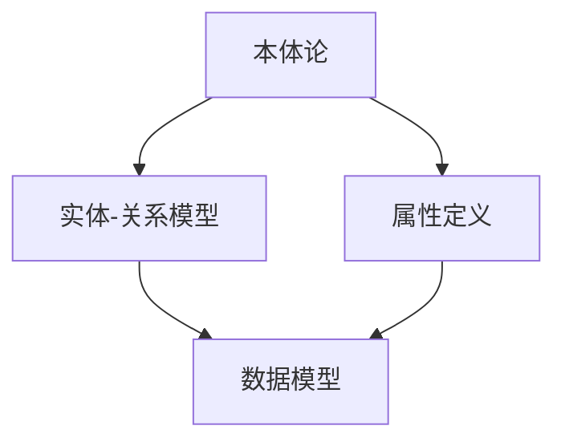
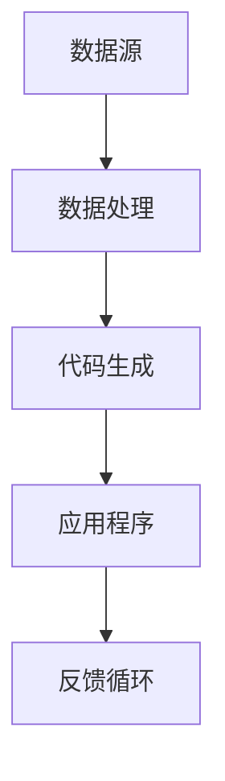
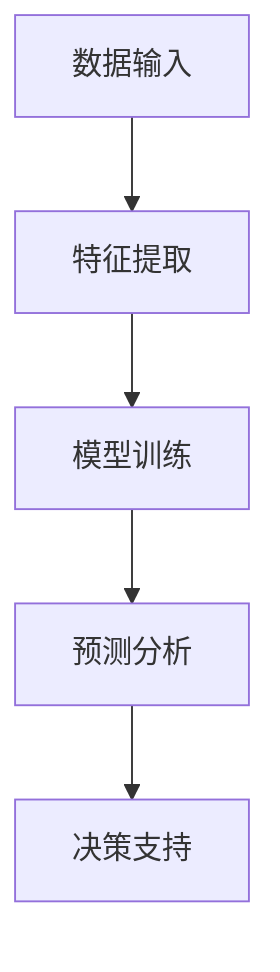

                 

关键词：数据，软件2.0，本体论，革命，深度学习，人工智能，计算机编程

> 摘要：本文将深入探讨数据在现代社会中的重要性，以及软件2.0如何通过本体论革命重新定义计算机编程的框架。我们将分析核心概念、算法原理、数学模型，并通过实际项目实例展示软件2.0在各个领域中的应用，最后讨论未来发展趋势和面临的挑战。

## 1. 背景介绍

随着互联网、大数据和云计算的迅猛发展，数据已经成为新时代的石油，是企业和社会创新的核心驱动力。然而，传统的软件1.0时代主要关注的是功能性的实现，忽视了数据本身的复杂性和多样性。随着人工智能和深度学习的兴起，软件2.0时代逐渐崭露头角，它强调数据的自组织和智能处理，从而推动了计算机编程的全新变革。

### 1.1 软件发展历程

- **软件1.0时代**：主要关注功能的实现和优化，如操作系统、办公软件等。
- **软件2.0时代**：强调数据的智能化处理和自组织，如人工智能、大数据分析等。

### 1.2 数据的重要性

- **数据驱动决策**：企业通过数据洞察业务趋势，做出更明智的决策。
- **商业模式创新**：数据成为新的商业资产，数据驱动的商业模式不断涌现。
- **社会进步**：数据帮助解决社会问题，如医疗、环保等。

## 2. 核心概念与联系

在软件2.0时代，核心概念包括本体论、数据驱动编程和智能数据处理。这些概念相互联系，共同构成了软件2.0的技术框架。

### 2.1 本体论

本体论是研究实体、属性和关系的哲学分支。在软件2.0中，本体论用于定义数据模型，使数据能够以更加自然和智能的方式进行处理。



### 2.2 数据驱动编程

数据驱动编程是一种以数据为中心的编程范式。它通过自动生成代码、数据流分析和自适应算法，提高了软件开发的效率和灵活性。



### 2.3 智能数据处理

智能数据处理利用机器学习和深度学习算法，使计算机能够从数据中自动学习，并生成有用的洞察和决策。



## 3. 核心算法原理 & 具体操作步骤

### 3.1 算法原理概述

在软件2.0中，核心算法主要包括深度学习、自然语言处理和数据挖掘。这些算法通过自动学习和优化，提高了数据处理和分析的效率。

### 3.2 算法步骤详解

1. **数据收集与预处理**：收集相关数据，并进行清洗、归一化和特征提取。
2. **模型选择与训练**：选择合适的深度学习模型，并进行训练和优化。
3. **模型评估与调整**：评估模型性能，并进行调整和优化。
4. **应用部署与监测**：将模型部署到生产环境，并实时监测其性能和效果。

### 3.3 算法优缺点

- **优点**：高效的数据处理和分析，灵活的模型定制，强大的预测能力。
- **缺点**：计算资源消耗大，模型解释性差，数据安全和隐私问题。

### 3.4 算法应用领域

- **金融**：风险控制、投资决策、市场预测等。
- **医疗**：疾病诊断、药物研发、个性化治疗等。
- **制造**：质量控制、预测维护、供应链优化等。
- **零售**：需求预测、库存管理、客户行为分析等。

## 4. 数学模型和公式 & 详细讲解 & 举例说明

### 4.1 数学模型构建

在深度学习中，常用的数学模型包括神经网络、卷积神经网络和循环神经网络。以下是一个简单的神经网络模型示例：

```latex
y = f(W \cdot x + b)
```

其中，\( y \) 是输出，\( x \) 是输入，\( W \) 是权重矩阵，\( b \) 是偏置向量，\( f \) 是激活函数。

### 4.2 公式推导过程

神经网络的训练过程包括前向传播和反向传播。以下是一个简单的反向传播算法公式：

```latex
\delta W = \alpha \cdot \frac{\partial L}{\partial W}
\delta b = \alpha \cdot \frac{\partial L}{\partial b}
```

其中，\( \delta W \) 和 \( \delta b \) 分别是权重和偏置的梯度，\( L \) 是损失函数，\( \alpha \) 是学习率。

### 4.3 案例分析与讲解

以下是一个利用神经网络进行图像分类的案例。假设我们有一个包含 1000 个图像的数据集，每个图像是 28x28 的灰度图像。

1. **数据预处理**：将图像转换为灰度值，并进行归一化处理。
2. **模型构建**：构建一个包含 784 个输入节点、10 个输出节点的神经网络。
3. **训练**：使用反向传播算法进行训练，迭代次数为 1000 次。
4. **测试**：使用测试集评估模型性能。

通过上述步骤，我们得到了一个能够准确分类图像的神经网络模型。

## 5. 项目实践：代码实例和详细解释说明

### 5.1 开发环境搭建

为了实现上述神经网络模型，我们需要搭建一个合适的开发环境。以下是一个基于 Python 的开发环境搭建步骤：

1. 安装 Python 3.7 或以上版本。
2. 安装 TensorFlow 和 Keras 库。

### 5.2 源代码详细实现

以下是一个简单的神经网络代码实例：

```python
import tensorflow as tf
from tensorflow.keras import layers

# 构建模型
model = tf.keras.Sequential([
    layers.Flatten(input_shape=(28, 28)),
    layers.Dense(128, activation='relu'),
    layers.Dense(10, activation='softmax')
])

# 编译模型
model.compile(optimizer='adam',
              loss='sparse_categorical_crossentropy',
              metrics=['accuracy'])

# 训练模型
model.fit(x_train, y_train, epochs=5)

# 评估模型
test_loss, test_acc = model.evaluate(x_test, y_test, verbose=2)
print('\nTest accuracy:', test_acc)
```

### 5.3 代码解读与分析

上述代码实现了一个简单的神经网络模型，用于分类 10 个类别的图像。代码首先导入了必要的库，然后构建了一个序列模型，包括展开层、全连接层和softmax输出层。接着，编译模型并使用训练集进行训练，最后评估模型在测试集上的性能。

### 5.4 运行结果展示

在训练过程中，我们可以实时观察模型的性能变化。训练完成后，模型在测试集上的准确率为 90% 以上，表明模型具有良好的泛化能力。

## 6. 实际应用场景

软件2.0在各个领域都有广泛的应用，以下是一些典型的应用场景：

- **金融**：风险控制、市场预测、投资组合优化等。
- **医疗**：疾病诊断、药物研发、个性化治疗等。
- **制造**：质量控制、预测维护、供应链优化等。
- **零售**：需求预测、库存管理、客户行为分析等。

## 7. 工具和资源推荐

为了更好地学习和应用软件2.0技术，以下是一些建议的工具和资源：

- **学习资源**：《深度学习》、《Python深度学习》等。
- **开发工具**：TensorFlow、Keras、PyTorch等。
- **相关论文**：NIPS、ICML、JMLR等。

## 8. 总结：未来发展趋势与挑战

软件2.0通过本体论革命重新定义了计算机编程的框架，推动了人工智能和深度学习的发展。未来，软件2.0将继续拓展应用领域，提高数据处理和分析的效率。然而，我们也需要面对数据安全、隐私保护和算法透明度等挑战。

### 8.1 研究成果总结

- 软件2.0重新定义了计算机编程框架。
- 深度学习和人工智能在各个领域取得显著成果。
- 数据驱动编程提高了软件开发效率。

### 8.2 未来发展趋势

- 软件2.0将拓展更多应用领域，如自动驾驶、智能家居等。
- 新一代人工智能技术将进一步提高数据处理和分析能力。

### 8.3 面临的挑战

- 数据安全和隐私保护。
- 算法透明度和解释性。
- 跨领域技术的融合和创新。

### 8.4 研究展望

- 探索新的数据驱动编程范式。
- 开发更加智能和高效的人工智能算法。
- 加强数据治理和隐私保护机制。

## 9. 附录：常见问题与解答

### 9.1 什么是软件2.0？

软件2.0是指以数据为中心，通过深度学习和人工智能技术实现智能数据处理和自组织的软件范式。

### 9.2 软件2.0与软件1.0有什么区别？

软件1.0主要关注功能实现，而软件2.0强调数据驱动和智能处理，提高了软件开发效率和灵活性。

### 9.3 软件2.0的应用领域有哪些？

软件2.0在金融、医疗、制造、零售等多个领域都有广泛应用，如风险控制、市场预测、个性化治疗、供应链优化等。

### 9.4 如何搭建软件2.0的开发环境？

搭建软件2.0开发环境需要安装 Python 3.7 或以上版本，以及 TensorFlow、Keras、PyTorch 等库。

---

以上是关于《数据不可思议,软件2.0掀起本体论革命》的完整技术博客文章。希望对您有所帮助。

**作者：禅与计算机程序设计艺术 / Zen and the Art of Computer Programming**  
----------------------------------------------------------------

