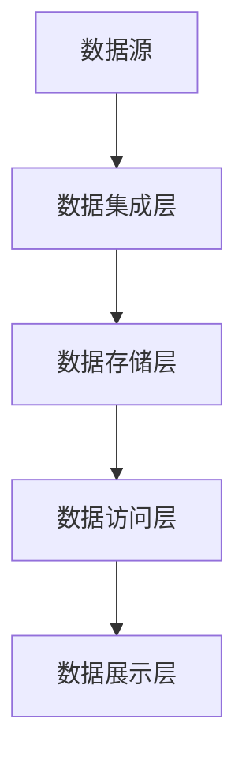
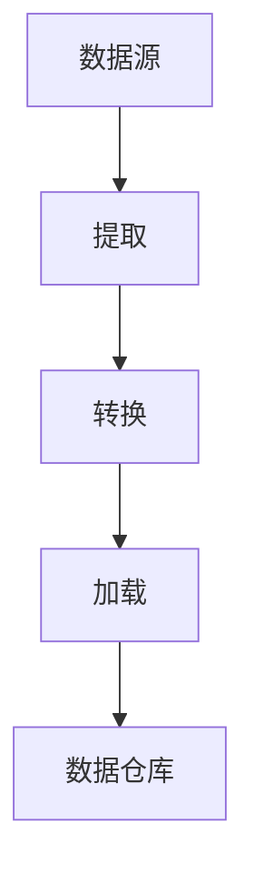
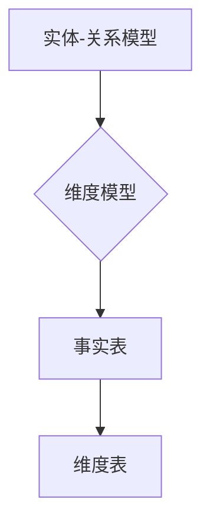

                 

在当今信息时代，数据仓库作为大数据处理与分析的核心基础设施，已经成为企业决策和战略规划的重要工具。本文旨在全面介绍数据仓库的原理，并通过具体代码实例讲解其构建和操作方法，帮助读者深入理解数据仓库的实际应用。

## 关键词

- 数据仓库
- 数据建模
- 数据集成
- 数据分析
- 数据挖掘

## 摘要

本文将首先介绍数据仓库的定义、历史和发展趋势，随后详细探讨数据仓库的核心概念，如数据仓库架构、ETL（提取、转换、加载）流程、数据建模技术。通过数学模型和公式的讲解，我们将理解数据仓库中常用的算法和数据处理方法。最后，本文将通过一个完整的代码实例，展示数据仓库的构建和操作过程，并提供实用的工具和资源推荐，为读者提供全方位的学习和实践指导。

## 1. 背景介绍

### 数据仓库的定义

数据仓库（Data Warehouse）是一个面向主题的、集成的、相对稳定的、反映历史变化的数据集合，用于支持管理决策。它不同于传统的数据库，主要目标是从多个数据源提取信息，构建一个统一的数据视图，以便进行数据分析。

### 数据仓库的发展历史

数据仓库的概念起源于1970年代末，由比尔·英格威尔兹（Bill Inmon）提出。自那时起，随着信息技术的发展，数据仓库技术逐渐成熟，并成为大数据处理的核心。

### 数据仓库的重要性

数据仓库在现代企业中的作用日益凸显，它能够提供全面、准确的数据支持，帮助企业进行战略规划和决策。以下是数据仓库的几个重要应用场景：

1. **商业智能**：通过数据仓库，企业可以实时获取关键业务指标，进行数据分析和趋势预测。
2. **客户关系管理**：数据仓库帮助企业深入了解客户行为，优化营销策略。
3. **供应链管理**：数据仓库提供准确的库存和物流数据，优化供应链运营。

## 2. 核心概念与联系

### 数据仓库架构

数据仓库的架构通常包括数据源、数据集成层、数据存储层、数据访问层和数据展示层。


**Mermaid 流程图：**



### ETL 流程

数据仓库的构建离不开 ETL（Extract, Transform, Load）流程。ETL 是将数据从源系统提取出来，进行清洗、转换，然后加载到数据仓库中的过程。


**Mermaid 流程图：**



### 数据建模技术

数据建模是数据仓库构建的核心步骤，包括实体-关系模型（ER Model）和维度模型（Dimensional Model）。


**Mermaid 流程图：**



## 3. 核心算法原理 & 具体操作步骤

### 3.1 算法原理概述

数据仓库中的核心算法包括数据清洗、数据聚合、数据挖掘等。

- **数据清洗**：去除数据中的错误、冗余和不一致信息。
- **数据聚合**：对大量数据进行汇总、分组和计算。
- **数据挖掘**：从数据中提取有价值的信息和知识。

### 3.2 算法步骤详解

#### 数据清洗

1. **数据抽取**：从源系统中获取数据。
2. **数据清洗**：去除错误、冗余和不一致数据。
3. **数据转换**：格式转换、缺失值填充、异常值处理。

#### 数据聚合

1. **分组**：按照特定条件对数据进行分组。
2. **计算**：对每个分组的数据进行汇总、计算。
3. **去重**：去除重复数据。

#### 数据挖掘

1. **数据预处理**：清洗、转换和聚合数据。
2. **特征选择**：选择对挖掘任务有重要影响的数据特征。
3. **模型训练**：使用机器学习算法训练模型。
4. **模型评估**：评估模型性能和准确性。

### 3.3 算法优缺点

#### 数据清洗

- **优点**：提高数据质量，为后续分析提供可靠数据。
- **缺点**：清洗过程复杂，耗时较长。

#### 数据聚合

- **优点**：简化数据结构，便于数据分析。
- **缺点**：可能导致数据丢失或信息缩减。

#### 数据挖掘

- **优点**：发现数据中的潜在模式和关系。
- **缺点**：算法复杂度高，对计算资源要求较高。

### 3.4 算法应用领域

数据清洗、数据聚合和数据挖掘在多个领域都有广泛应用：

- **商业智能**：帮助企业分析业务数据，优化运营策略。
- **金融**：监控金融市场，预测投资风险。
- **医疗**：分析患者数据，优化医疗服务。

## 4. 数学模型和公式 & 详细讲解 & 举例说明

### 4.1 数学模型构建

数据仓库中的数学模型主要包括线性回归模型、决策树模型和聚类模型。

#### 线性回归模型

线性回归模型用于预测一个连续值变量。其公式如下：

$$
y = \beta_0 + \beta_1 \cdot x
$$

其中，$y$ 是预测值，$x$ 是自变量，$\beta_0$ 和 $\beta_1$ 是模型的参数。

#### 决策树模型

决策树模型用于分类和回归分析。其基本结构如下：


#### 聚类模型

聚类模型用于将数据分为多个群组。其公式如下：

$$
C = \{C_1, C_2, ..., C_k\}
$$

其中，$C$ 是聚类结果，$C_i$ 是第 $i$ 个群组。

### 4.2 公式推导过程

#### 线性回归模型

假设我们有 $n$ 个数据点 $(x_i, y_i)$，线性回归模型的参数可以通过最小二乘法计算：

$$
\beta_0 = \frac{\sum_{i=1}^{n} y_i - \beta_1 \cdot \sum_{i=1}^{n} x_i}{n}
$$

$$
\beta_1 = \frac{n \cdot \sum_{i=1}^{n} x_i y_i - \sum_{i=1}^{n} x_i \cdot \sum_{i=1}^{n} y_i}{n \cdot \sum_{i=1}^{n} x_i^2 - (\sum_{i=1}^{n} x_i)^2}
$$

#### 决策树模型

决策树模型通过递归划分数据集，找到最佳分割点。其基本推导过程如下：

1. **信息增益**：衡量分割数据的纯度。公式如下：

$$
I(G) = -\sum_{i=1}^{k} p_i \cdot \log_2 p_i
$$

其中，$p_i$ 是第 $i$ 个类别的概率。

2. **增益率**：结合信息增益和类别数量。公式如下：

$$
G(R) = \frac{I(G) - \frac{\sum_{i=1}^{k} |C_i| \cdot \log_2 |C_i|}{|S|}}{|S|}
$$

其中，$|C_i|$ 是第 $i$ 个类的样本数量，$|S|$ 是总样本数量。

3. **最优分割点**：选择使增益率最大的分割点。

### 4.3 案例分析与讲解

假设我们有一组客户数据，包含年龄、收入和购买历史等信息。我们希望使用线性回归模型预测客户的购买概率。

#### 数据预处理

1. **数据抽取**：从数据库中提取客户数据。
2. **数据清洗**：去除缺失值和异常值。
3. **数据转换**：将类别数据转换为数值数据。

#### 模型训练

1. **特征选择**：选择与购买概率相关的特征，如年龄和收入。
2. **模型训练**：使用最小二乘法计算线性回归模型的参数。

#### 模型评估

1. **预测**：使用训练好的模型预测新客户的购买概率。
2. **评估**：计算预测准确率和召回率等指标。

## 5. 项目实践：代码实例和详细解释说明

### 5.1 开发环境搭建

在开始项目实践之前，我们需要搭建一个合适的数据仓库开发环境。以下是推荐的工具和库：

- **编程语言**：Python
- **数据仓库引擎**：Apache Hadoop 和 Apache Hive
- **数据库**：MySQL 或 PostgreSQL
- **数据集成工具**：Apache NiFi 或 Talend

### 5.2 源代码详细实现

以下是一个简单的数据仓库构建实例，包括数据抽取、清洗、转换和加载。

```python
import pandas as pd
from niFi import NiFi

# 数据抽取
nifi = NiFi()
data = nifi.extract_data(source='database', table='customers')

# 数据清洗
cleaned_data = data.dropna()
cleaned_data = cleaned_data[cleaned_data['income'] > 0]

# 数据转换
cleaned_data['age_group'] = cleaned_data['age'].apply(lambda x: '18-25' if x <= 25 else '26-35' if x <= 35 else '36-45' if x <= 45 else '46-55' if x <= 55 else '56+')

# 数据加载
nifi.load_data(data=cleaned_data, target='data_warehouse', table='cleaned_customers')
```

### 5.3 代码解读与分析

上述代码实现了以下功能：

1. **数据抽取**：使用 NiFi 从数据库中提取客户数据。
2. **数据清洗**：去除缺失值和异常值。
3. **数据转换**：将类别数据转换为数值数据。
4. **数据加载**：将清洗和转换后的数据加载到数据仓库中。

### 5.4 运行结果展示

运行上述代码后，数据仓库中将生成一个包含清洗和转换后的客户数据的表。您可以使用 SQL 查询该表，进行进一步的数据分析和挖掘。

```sql
SELECT * FROM cleaned_customers;
```

## 6. 实际应用场景

### 6.1 商业智能

商业智能是数据仓库最典型的应用场景之一。企业可以使用数据仓库中的数据，分析销售趋势、客户行为和市场动态，制定相应的营销策略和决策。

### 6.2 人力资源

人力资源部门可以利用数据仓库中的员工数据，分析员工绩效、薪酬水平和培训需求，优化人力资源管理。

### 6.3 医疗保健

医疗保健行业可以通过数据仓库中的患者数据，进行疾病预测、药物效果分析和医疗服务优化。

### 6.4 物流与供应链

物流与供应链领域可以通过数据仓库中的运输数据、库存数据和客户数据，进行运输路线优化、库存管理和客户关系管理。

## 7. 工具和资源推荐

### 7.1 学习资源推荐

- **书籍**：《数据仓库：概念与架构》、《数据仓库设计与实现》
- **在线课程**：Coursera 上的《数据仓库与数据挖掘》
- **博客**：Kaggle、DataCamp

### 7.2 开发工具推荐

- **编程语言**：Python、SQL
- **数据仓库引擎**：Apache Hadoop、Apache Hive
- **数据库**：MySQL、PostgreSQL
- **数据集成工具**：Apache NiFi、Talend

### 7.3 相关论文推荐

- **论文**：《数据仓库中的 ETL 流程设计》、《基于数据仓库的客户关系管理》

## 8. 总结：未来发展趋势与挑战

### 8.1 研究成果总结

数据仓库技术在过去几十年中取得了显著进展，包括数据处理速度、存储容量和算法优化等方面的突破。然而，随着数据规模的不断扩大和数据处理需求的日益复杂，数据仓库技术仍然面临着诸多挑战。

### 8.2 未来发展趋势

- **云计算**：云计算为数据仓库提供了更强大的计算和存储能力，有望推动数据仓库技术的进一步发展。
- **实时数据处理**：实时数据处理技术使得数据仓库能够更快速地响应用户需求，提供实时决策支持。
- **自动化**：自动化技术将提高数据仓库的运维效率和数据处理精度，降低人工干预。

### 8.3 面临的挑战

- **数据隐私**：随着数据隐私保护法规的日益严格，数据仓库在数据收集、存储和处理过程中需要遵守相关法规。
- **数据质量**：数据质量是数据仓库成功的关键，企业需要投入更多资源确保数据质量。
- **数据复杂性**：随着数据来源和类型的增加，数据仓库的构建和维护变得越来越复杂。

### 8.4 研究展望

未来数据仓库研究将继续关注以下几个方面：

- **数据隐私保护**：研究如何有效保护用户隐私，同时保持数据可用性。
- **大数据处理**：研究如何处理大规模、多样化的数据集。
- **智能数据仓库**：结合人工智能技术，实现数据仓库的自动化和智能化。

## 9. 附录：常见问题与解答

### 9.1 什么是数据仓库？

数据仓库是一个面向主题的、集成的、相对稳定的、反映历史变化的数据集合，用于支持管理决策。

### 9.2 数据仓库与数据库有什么区别？

数据仓库主要用于数据分析，而数据库主要用于日常事务处理。数据仓库的数据通常是历史数据，而数据库的数据通常是实时数据。

### 9.3 如何保证数据仓库中的数据质量？

确保数据仓库中的数据质量需要从数据源、数据抽取、数据清洗、数据转换和数据加载等各个环节进行控制。

### 9.4 数据仓库中的 ETL 流程是什么？

ETL（提取、转换、加载）是数据仓库构建过程中的重要步骤，用于将数据从源系统提取出来，进行清洗、转换，然后加载到数据仓库中。

### 9.5 数据仓库中常用的算法有哪些？

数据仓库中常用的算法包括线性回归、决策树、聚类、关联规则挖掘等。

## 结语

数据仓库作为大数据处理与分析的核心基础设施，在当今信息时代发挥着越来越重要的作用。本文通过对数据仓库原理的全面介绍和具体代码实例的讲解，帮助读者深入理解数据仓库的实际应用。希望本文能为读者在数据仓库领域的研究和实践提供有益的参考。

### 作者署名

**作者：禅与计算机程序设计艺术 / Zen and the Art of Computer Programming**

本文由禅与计算机程序设计艺术撰写，全面介绍了数据仓库的原理和应用。希望通过本文，读者能够更好地理解数据仓库技术，并在实际项目中发挥其价值。感谢读者的阅读和支持！

