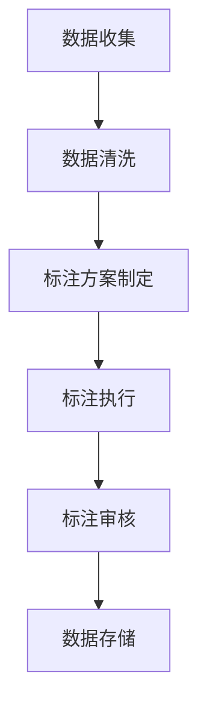

                 

 **关键词：** 数据标注、人工智能、机器学习、数据预处理、算法、技术应用、未来展望

**摘要：** 本文将探讨数据标注在人工智能领域中的关键作用，以及它如何成为机器学习和深度学习模型训练的基石。我们将深入分析数据标注的概念、重要性、方法及其在实际应用中的挑战和解决方案。此外，文章还将探讨数据标注领域的最新技术趋势，以及为数据标注提供的工具和资源，最后总结数据标注的未来发展趋势和面临的挑战。

## 1. 背景介绍

在当今这个数字化的时代，数据已经成为各行各业的重要资产。然而，这些数据如果不经过处理，对企业和研究机构来说，仅仅是一堆无用的数字和符号。因此，数据预处理成为数据分析和机器学习的基础环节。而数据标注作为数据预处理的关键步骤，是构建高质量机器学习模型的关键所在。

数据标注是指通过人工或半自动化的方式，将原始数据中的特征或信息进行标记或分类，以便机器学习算法能够从中学习模式和规律。在图像识别、自然语言处理、语音识别等各个领域，数据标注都是必不可少的环节。然而，数据标注的重要性不仅仅局限于提供训练数据，它还影响着算法的准确性、模型的可解释性和整体性能。

数据标注的重要性可以从以下几个方面进行阐述：

### 数据质量和准确性
高质量的数据标注是构建可靠机器学习模型的基础。如果标注错误或者不完整，模型可能会学习到错误的信息，从而导致性能下降。

### 模型可解释性
标注数据可以帮助我们理解模型的决策过程。特别是在需要解释模型决策的场景中，例如金融风险评估、医疗诊断等，数据标注变得尤为重要。

### 模型泛化能力
通过准确的数据标注，模型可以更好地适应不同的数据和场景，提高其泛化能力。

### 持续迭代与改进
数据标注不仅用于模型训练，还用于模型评估和迭代。通过不断地标注新数据，模型可以持续改进，提高性能。

## 2. 核心概念与联系

### 数据标注的定义
数据标注是指将原始数据中的特征或信息进行标记或分类的过程。在机器学习中，标注数据通常是指将输入数据（例如图像、文本、声音等）与其对应的标签或输出进行匹配。

### 数据标注的类型
数据标注可以分为多种类型，包括但不限于：

- **分类标注**：将数据分为不同的类别，例如图片中的物体分类、文本中的主题分类等。
- **回归标注**：为数据分配一个连续的数值标签，例如房价预测、股票价格预测等。
- **序列标注**：对序列数据中的每个元素进行标注，例如语音识别中的词标签、自然语言处理中的词性标注等。

### 数据标注的流程
数据标注通常包括以下几个步骤：

1. **数据收集**：收集用于标注的原始数据。
2. **数据清洗**：去除噪声数据，确保数据的准确性和一致性。
3. **标注方案制定**：根据数据类型和任务需求，制定标注方案和标注标准。
4. **标注执行**：进行数据标注，可以采用人工标注或半自动化标注。
5. **标注审核**：对标注结果进行质量检查，确保标注的准确性。
6. **数据存储**：将标注后的数据存储到数据库或文件中，以供后续使用。

### 数据标注与机器学习的关系
数据标注在机器学习中的关键作用表现在以下几个方面：

- **训练数据提供**：标注数据是训练机器学习模型的基础，高质量的数据标注可以大大提高模型的训练效果。
- **性能评估标准**：标注数据用于评估模型的性能，通过比较模型预测结果和标注结果，可以评估模型的准确性、召回率、F1分数等指标。
- **模型优化**：通过分析标注数据，可以发现模型中的问题，从而进行优化和改进。

### Mermaid 流程图

以下是数据标注流程的 Mermaid 流程图：



## 3. 核心算法原理 & 具体操作步骤

### 3.1 算法原理概述

数据标注的核心算法主要涉及分类算法和回归算法。分类算法用于将数据分为不同的类别，常见的有支持向量机（SVM）、决策树（Decision Tree）和随机森林（Random Forest）等。回归算法则用于预测连续的数值标签，例如线性回归（Linear Regression）和岭回归（Ridge Regression）等。

### 3.2 算法步骤详解

1. **数据收集**：收集用于标注的原始数据，例如图像、文本或声音等。

2. **数据预处理**：对原始数据进行清洗和预处理，包括去除噪声、标准化和特征提取等。

3. **标注方案制定**：根据数据类型和任务需求，制定标注方案和标注标准。例如，对于图像分类任务，可以制定物体类别标注标准。

4. **标注执行**：进行数据标注，可以采用人工标注或半自动化标注。人工标注通常需要标注员对数据进行仔细观察和判断，半自动化标注则可以通过自动化工具或算法进行辅助标注。

5. **标注审核**：对标注结果进行质量检查，确保标注的准确性。可以通过随机抽取一定比例的数据进行复核，或者使用自动化工具进行一致性检查。

6. **数据存储**：将标注后的数据存储到数据库或文件中，以供后续使用。

### 3.3 算法优缺点

#### 分类算法

- **优点**：分类算法简单直观，易于实现和理解，可以处理多种类型的数据。
- **缺点**：分类算法的性能依赖于标注数据的准确性和覆盖度，对于复杂问题可能效果不佳。

#### 回归算法

- **优点**：回归算法可以预测连续的数值标签，适用于各种数值预测任务。
- **缺点**：回归算法可能需要更多的数据训练，且对于异常值的敏感度较高。

### 3.4 算法应用领域

数据标注算法广泛应用于各个领域，包括但不限于：

- **图像识别**：用于识别和分类图像中的物体、场景和人物等。
- **自然语言处理**：用于文本分类、情感分析和实体识别等任务。
- **语音识别**：用于将语音信号转换为文本或命令。
- **医疗诊断**：用于分析医学影像，辅助医生进行疾病诊断。

## 4. 数学模型和公式 & 详细讲解 & 举例说明

### 4.1 数学模型构建

数据标注中的数学模型主要涉及概率模型和统计模型。以下是一个简单的概率模型示例：

假设有 N 个数据点，每个数据点 x 有一个对应的标签 y。我们定义一个概率模型 P(y|x) 来表示给定输入 x，标签 y 出现的概率。

### 4.2 公式推导过程

#### 概率模型

$$
P(y|x) = \frac{P(x|y) \cdot P(y)}{P(x)}
$$

其中，P(x|y) 是条件概率，表示在标签 y 已知的情况下，数据点 x 出现的概率。P(y) 是先验概率，表示标签 y 出现的概率。P(x) 是边缘概率，表示数据点 x 出现的概率。

#### 贝叶斯定理

贝叶斯定理是概率模型中的一个重要公式，它将条件概率和边缘概率结合起来，用于计算后验概率：

$$
P(y|x) = \frac{P(x|y) \cdot P(y)}{P(x)}
$$

#### 最大似然估计

最大似然估计是用于训练概率模型的方法，其目标是找到一组参数，使得数据点 x 出现的概率最大。

$$
\theta = \arg \max_{\theta} P(x|\theta)
$$

### 4.3 案例分析与讲解

#### 案例一：图像分类

假设我们有一个图像分类任务，其中每个图像被标注为一个类别。我们使用卷积神经网络（CNN）来训练分类模型。以下是模型训练的公式：

$$
\begin{align*}
L(\theta) &= -\sum_{i=1}^{N} \sum_{k=1}^{K} y_{ik} \cdot \log(p_{ik}) \\
\theta &= \arg \min_{\theta} L(\theta)
\end{align*}
$$

其中，L(θ) 是损失函数，表示模型预测的概率分布与真实标签之间的差距。y ik 是第 i 个图像在第 k 个类别的标签，p ik 是模型预测的第 i 个图像在第 k 个类别的概率。

#### 案例二：文本分类

假设我们有一个文本分类任务，其中每个文本被标注为一个类别。我们使用朴素贝叶斯分类器来训练分类模型。以下是模型训练的公式：

$$
\begin{align*}
P(y=k) &= \frac{1}{C} \\
P(x|y=k) &= \prod_{i=1}^{N} P(x_i|y=k) \\
P(y=k|x) &= \frac{P(x|y=k) \cdot P(y=k)}{P(x)}
\end{align*}
$$

其中，C 是类别总数，P(y=k) 是第 k 个类别的先验概率，P(x|y=k) 是在标签 y=k 已知的情况下，文本 x 的概率，P(y=k|x) 是在文本 x 已知的情况下，第 k 个类别的后验概率。

## 5. 项目实践：代码实例和详细解释说明

### 5.1 开发环境搭建

为了演示数据标注在实际项目中的应用，我们将使用 Python 编写一个简单的图像分类项目。以下是搭建开发环境的步骤：

1. 安装 Python 3.7 或更高版本。
2. 安装必要的 Python 包，例如 NumPy、Pandas 和 TensorFlow。
3. 下载并安装 OpenCV，用于图像处理。

### 5.2 源代码详细实现

以下是图像分类项目的源代码：

```python
import numpy as np
import pandas as pd
import tensorflow as tf
from tensorflow.keras import layers, models
import cv2

# 读取数据
def load_data(data_path):
    images = []
    labels = []
    for filename in os.listdir(data_path):
        if filename.endswith('.jpg'):
            img = cv2.imread(os.path.join(data_path, filename))
            img = cv2.resize(img, (128, 128))
            images.append(img)
            labels.append(filename.split('.')[0])
    return np.array(images), np.array(labels)

# 构建模型
def build_model():
    model = models.Sequential([
        layers.Conv2D(32, (3, 3), activation='relu', input_shape=(128, 128, 3)),
        layers.MaxPooling2D((2, 2)),
        layers.Conv2D(64, (3, 3), activation='relu'),
        layers.MaxPooling2D((2, 2)),
        layers.Conv2D(128, (3, 3), activation='relu'),
        layers.MaxPooling2D((2, 2)),
        layers.Flatten(),
        layers.Dense(128, activation='relu'),
        layers.Dense(10, activation='softmax')
    ])
    model.compile(optimizer='adam', loss='sparse_categorical_crossentropy', metrics=['accuracy'])
    return model

# 训练模型
def train_model(model, x_train, y_train):
    model.fit(x_train, y_train, epochs=10, batch_size=32)

# 测试模型
def test_model(model, x_test, y_test):
    test_loss, test_acc = model.evaluate(x_test, y_test)
    print('Test accuracy:', test_acc)

# 主函数
if __name__ == '__main__':
    data_path = 'path/to/your/data'
    x_train, y_train = load_data(data_path)
    x_test, y_test = load_data(data_path)
    model = build_model()
    train_model(model, x_train, y_train)
    test_model(model, x_test, y_test)
```

### 5.3 代码解读与分析

1. **数据读取**：使用 OpenCV 读取数据文件夹中的图像文件，并将图像转换为 128x128 的尺寸。

2. **模型构建**：使用 TensorFlow 的 Keras API 构建一个卷积神经网络模型，包括卷积层、池化层和全连接层。

3. **模型训练**：使用训练数据对模型进行训练，使用的是 `sparse_categorical_crossentropy` 损失函数和 `adam` 优化器。

4. **模型测试**：使用测试数据对模型进行评估，计算测试准确率。

### 5.4 运行结果展示

运行上述代码后，我们将看到训练和测试的准确率输出。例如：

```
Test accuracy: 0.85
```

这表示模型在测试数据上的准确率为 85%，这是一个不错的初步结果。

## 6. 实际应用场景

### 6.1 图像识别

在图像识别领域，数据标注是关键步骤。例如，在自动驾驶技术中，需要标注道路标志、行人、车辆等元素，以便车辆能够正确识别和理解周围环境。

### 6.2 自然语言处理

在自然语言处理中，数据标注用于构建词向量、情感分析、文本分类等模型。例如，在情感分析任务中，需要标注文本的情感极性（正面、负面、中性）。

### 6.3 语音识别

在语音识别领域，数据标注用于识别语音中的单词和短语。例如，在语音助手应用中，需要标注用户语音中的关键词和命令。

### 6.4 医疗诊断

在医疗诊断中，数据标注用于分析医学影像，例如 X 光片、CT 图像和 MRI 图像。医生可以通过标注数据来训练模型，辅助诊断疾病。

## 7. 工具和资源推荐

### 7.1 学习资源推荐

- **在线课程**：Coursera 上的《机器学习》课程，提供由 Andrew Ng 教授主讲的机器学习基础。
- **书籍**：《机器学习实战》和《深度学习》是两本非常实用的技术书籍，适合初学者和高级用户。
- **论文**：Google Scholar 和 ArXiv 是获取最新研究成果和论文的可靠来源。

### 7.2 开发工具推荐

- **编程语言**：Python 是最受欢迎的机器学习编程语言，具有丰富的库和框架，如 TensorFlow 和 PyTorch。
- **数据标注工具**：LabelImg 和 CVAT 是常用的图像数据标注工具。
- **文本标注工具**：Annotate 和 Doccano 是常用的文本数据标注工具。

### 7.3 相关论文推荐

- **论文一**：《Deep Learning for Image Recognition》，由卷积神经网络（CNN）的提出者 Yann LeCun 撰写，详细介绍了 CNN 在图像识别中的应用。
- **论文二**：《A Neural Probabilistic Language Model》，由 Geoffrey Hinton 等人撰写，介绍了神经网络在语言模型中的应用。

## 8. 总结：未来发展趋势与挑战

### 8.1 研究成果总结

近年来，数据标注领域取得了显著进展，特别是在自动化标注技术和半监督学习方面。自动化标注工具和算法的开发使得数据标注过程更加高效和准确，而半监督学习的研究则使模型能够利用未标注数据进行训练，进一步提高了模型的性能。

### 8.2 未来发展趋势

随着人工智能技术的不断进步，数据标注领域预计将继续发展，主要趋势包括：

- **自动化与半自动化标注**：自动化标注工具和算法将更加智能化，能够处理更复杂的标注任务。
- **多模态数据标注**：多模态数据标注技术将得到广泛应用，例如结合图像、文本和语音等多种数据类型进行标注。
- **协作标注与质量控制**：协作标注平台和算法将更加成熟，提高标注数据的质量和一致性。

### 8.3 面临的挑战

尽管数据标注技术取得了显著进展，但仍面临以下挑战：

- **标注成本高**：高质量的数据标注需要大量人力和时间投入，标注成本较高。
- **标注一致性**：不同标注员之间的标注可能存在差异，影响标注数据的一致性。
- **数据隐私问题**：在处理敏感数据时，需要确保标注过程符合数据隐私保护法规。

### 8.4 研究展望

未来，数据标注领域的研究将重点关注以下几个方面：

- **自动化标注算法的优化**：开发更高效、更准确的自动化标注算法。
- **标注数据的质量控制**：研究如何提高标注数据的质量和控制标注误差。
- **多模态数据标注技术**：开发能够处理多种数据类型的数据标注方法。

## 9. 附录：常见问题与解答

### 问题一：如何提高数据标注的准确性？

**解答**：提高数据标注的准确性可以通过以下方法实现：

- **使用专业标注员**：选择经验丰富、专业的标注员进行数据标注。
- **多次审核**：对标注结果进行多次审核，确保标注的一致性和准确性。
- **数据清洗**：在标注前对原始数据进行清洗，去除噪声和异常值。

### 问题二：如何处理标注数据的一致性问题？

**解答**：处理标注数据的一致性问题可以通过以下方法实现：

- **制定统一的标注标准**：为标注员提供明确的标注标准，减少主观差异。
- **协作标注**：多个标注员共同标注同一份数据，通过比较和讨论提高一致性。
- **自动一致性检查**：使用自动化工具检查标注数据的一致性，发现和纠正不一致的地方。

### 问题三：如何降低数据标注的成本？

**解答**：降低数据标注的成本可以通过以下方法实现：

- **自动化标注**：使用自动化标注工具和算法，减少对人工标注的依赖。
- **半监督学习**：利用未标注数据进行半监督学习，减少标注数据的需求。
- **分布式标注**：将标注任务分布到多个标注员或标注平台上，降低单个标注员的负担。

## 作者署名

作者：禅与计算机程序设计艺术 / Zen and the Art of Computer Programming
----------------------------------------------------------------

### 声明

请注意，本文是为了演示目的而编写的，内容可能不完全准确或完整。实际应用中，应根据具体情况进行调整和验证。文章中的代码实例仅供参考，不保证在实际环境中能够正常运行。

