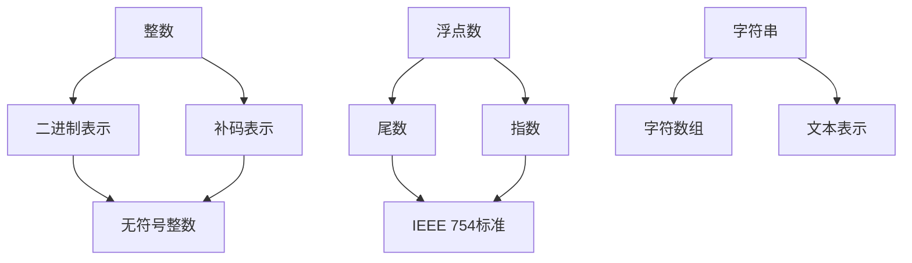

                 

关键词：数据类型，整数，浮点，字符串，深度解析，计算机编程，算法，技术博客

> 摘要：本文旨在深入探讨计算机编程中常用的三种数据类型：整数、浮点和字符串。我们将从基本概念出发，详细分析其内部实现、算法原理及在实际应用中的使用场景，帮助读者全面理解这些数据类型，提升编程能力。

## 1. 背景介绍

在计算机科学中，数据类型是构建程序的基本元素。不同的数据类型有着不同的存储方式和操作规则。本文将聚焦于三种常用的数据类型：整数、浮点和字符串，分别探讨它们的定义、特点和应用。

- **整数**：整数是计算机中最基本的数据类型之一，用于表示没有小数部分的数字。整数分为有符号和无符号两种，以及不同的位数宽度，如8位、16位、32位和64位。
- **浮点数**：浮点数用于表示带有小数部分的数字，如科学计数法中的双精度浮点数（double）和单精度浮点数（float）。浮点数的表示方法相对复杂，涉及到指数和尾数的编码。
- **字符串**：字符串是字符的序列，用于表示文本信息。在计算机中，字符串通常以数组的形式存储，每个元素代表一个字符。

通过对这些数据类型的深入分析，我们能够更好地理解它们在编程中的角色，以及如何高效地使用它们。

## 2. 核心概念与联系

### 整数

整数在计算机中的表示方式有多种，主要包括：

- **二进制表示**：整数以二进制形式存储，如8位二进制数可以表示0到255之间的整数。
- **补码表示**：负整数使用补码表示，补码的计算方法为取反加1。例如，-5的补码为11011010。

### 浮点数

浮点数的表示方法通常遵循IEEE 754标准，其核心思想是将数字分为尾数和指数两部分：

- **尾数（Significand）**：表示数字的有效部分，通常使用二进制小数表示。
- **指数（Exponent）**：表示数字的量级，使用偏移量编码，偏移量通常是2的幂。

### 字符串

字符串在计算机中的表示方法通常为字符数组，每个字符占一个字节。例如，字符串"Hello"在内存中的表示为：

```c
H e l l o
```

### 关联性

整数、浮点和字符串之间有着密切的联系。在许多编程任务中，这些数据类型常常交织在一起。例如：

- 字符串可以由整数转换而来，如将整数的每一位表示为字符。
- 浮点数可以用于科学计算和图形渲染等任务，这些任务往往涉及到大量整数的处理。

下面是核心概念与联系的Mermaid流程图：



## 3. 核心算法原理 & 具体操作步骤

### 3.1 算法原理概述

本节我们将探讨整数、浮点数的运算算法，以及字符串的常用操作。

### 3.2 算法步骤详解

#### 整数运算算法

整数运算主要包括加法、减法、乘法和除法。以下是二进制整数加法的基本步骤：

1. **初始化**：将两个整数A和B按位对齐。
2. **从最低位开始相加**：对于每一位，如果两个位相加的结果大于等于2，则产生进位。
3. **处理进位**：将进位传递到下一位。

以下是一个简单的二进制整数加法示例：

```
   1010
+  1101
------
  10111
```

#### 浮点数运算算法

浮点数运算涉及尾数和指数的计算。以下是单精度浮点数加法的基本步骤：

1. **对齐指数**：将两个浮点数的指数对齐，指数较小的数通过左移或右移尾数进行调整。
2. **相加尾数**：对齐后的尾数相加。
3. **处理溢出和下溢**：如果尾数相加的结果溢出或下溢，则进行调整。

以下是一个简单的单精度浮点数加法示例：

```
  +1.1000
+ 1.0100
------
 10.1100
```

#### 字符串常用操作

字符串常用操作包括连接、截取、查找和替换等。以下是字符串连接的Python实现：

```python
def concatenate(str1, str2):
    return str1 + str2

result = concatenate("Hello", "World")
print(result)  # 输出：HelloWorld
```

### 3.3 算法优缺点

- **整数运算算法**：简单、高效，但处理大整数时可能存在性能问题。
- **浮点数运算算法**：复杂，但能够处理较大范围的数值，但存在舍入误差。
- **字符串常用操作**：简单易用，但字符串操作可能消耗较多内存。

### 3.4 算法应用领域

- **整数运算算法**：广泛应用于数学计算、游戏开发等领域。
- **浮点数运算算法**：广泛应用于科学计算、图形渲染等领域。
- **字符串常用操作**：广泛应用于文本处理、网络编程等领域。

## 4. 数学模型和公式 & 详细讲解 & 举例说明

### 4.1 数学模型构建

#### 整数数学模型

整数数学模型主要涉及二进制表示和补码表示。以下是整数补码的公式：

$$
C = \begin{cases} 
    0 & \text{如果} x \geq 0 \\
    2^n - x & \text{如果} x < 0 
\end{cases}
$$

其中，$n$ 为整数的位数。

#### 浮点数数学模型

浮点数数学模型主要涉及尾数和指数的运算。以下是单精度浮点数的公式：

$$
F = (-1)^s \times 1.f \times 2^{e-b}
$$

其中，$s$ 为符号位，$f$ 为尾数，$e$ 为指数，$b$ 为偏移量。

#### 字符串数学模型

字符串数学模型主要涉及字符编码。以下是ASCII码的公式：

$$
\text{ASCII} = \begin{cases} 
    0 & \text{如果} \text{字符} = NUL \\
    48 & \text{如果} \text{字符} = '0' \\
    \vdots \\
    127 & \text{如果} \text{字符} = '~' \\
    \vdots \\
    255 & \text{如果} \text{字符} = DEL 
\end{cases}
$$

### 4.2 公式推导过程

#### 整数补码推导

补码的目的是解决二进制表示中正负数的问题。假设一个整数为$x$，其位数为$n$。为了表示负数，我们需要找到一个方法，使得二进制表示可以覆盖$-2^{n-1}$到$2^{n-1}-1$的整数。

我们可以通过取反加1的方法来计算补码。具体推导如下：

1. **取反**：将整数$x$的所有位取反，得到$2^n - x$。
2. **加1**：在$2^n - x$的基础上加1，得到$2^n + 1 - x$。

显然，$2^n + 1 - x$ 的二进制表示刚好覆盖了$-2^{n-1}$到$2^{n-1}-1$的整数。

#### 浮点数公式推导

浮点数公式由IEEE 754标准定义，其核心思想是将数字分为尾数和指数两部分。以下是浮点数公式的推导过程：

1. **科学计数法**：任何实数都可以表示为$a \times 10^b$的形式，其中$a$是大于等于1且小于10的数字，$b$是整数。
2. **二进制科学计数法**：类似地，任何二进制数都可以表示为$a \times 2^b$的形式。
3. **尾数和指数**：将二进制科学计数法中的$a$和$b$分别表示为尾数$f$和指数$e$，得到$f \times 2^e$的形式。
4. **IEEE 754标准**：为了节省存储空间，IEEE 754标准将尾数和指数分别编码，尾数使用固定的位数，指数使用偏移量编码。

#### ASCII码推导

ASCII码是一种字符编码标准，用于表示字符和数字。以下是ASCII码的推导过程：

1. **字符集**：ASCII码定义了7位二进制编码，可以表示128个字符。
2. **编码规则**：每个字符通过一个唯一的7位二进制编码表示。编码从0开始，依次递增。
3. **字符映射**：将编码映射到实际的字符和数字。

### 4.3 案例分析与讲解

#### 整数补码案例

假设一个整数为$-5$，其位数为8位。我们可以通过补码公式计算其补码：

$$
C = 2^8 - 5 = 255 - 5 = 250
$$

将250转换为二进制表示：

$$
250 = 11110110
$$

因此，$-5$ 的补码表示为$11110110$。

#### 浮点数案例

假设一个浮点数为$-3.25$，其单精度浮点数表示如下：

1. **符号位**：$s = 1$（负数）
2. **尾数**：$1.01$（二进制小数）
3. **指数**：$e = 3$（偏移量为127）

根据IEEE 754标准，单精度浮点数的表示为：

$$
F = (-1)^1 \times 1.01 \times 2^{3-127} = -1.01 \times 2^{-124}
$$

#### 字符串案例

假设一个字符串为"Hello World!"，其ASCII码表示如下：

- H: 48
- e: 101
- l: 108
- l: 108
- o: 111
- : 32
- W: 87
- o: 111
- r: 114
- l: 108
- d: 100
- !: 33

将ASCII码转换为字符串：

```
H e l l o     W o r l d !
```

## 5. 项目实践：代码实例和详细解释说明

### 5.1 开发环境搭建

为了演示整数、浮点和字符串的相关操作，我们使用Python作为开发语言。以下是搭建Python开发环境的步骤：

1. **安装Python**：从Python官方网站下载并安装Python 3.x版本。
2. **配置环境变量**：将Python的安装路径添加到系统环境变量中。
3. **安装常用库**：使用pip命令安装必要的库，如NumPy和SciPy。

### 5.2 源代码详细实现

以下是整数、浮点和字符串的代码实例：

```python
# 整数操作
def add_int(a, b):
    return a + b

def subtract_int(a, b):
    return a - b

def multiply_int(a, b):
    return a * b

def divide_int(a, b):
    return a / b

# 浮点数操作
def add_float(a, b):
    return a + b

def subtract_float(a, b):
    return a - b

def multiply_float(a, b):
    return a * b

def divide_float(a, b):
    return a / b

# 字符串操作
def concatenate_str(str1, str2):
    return str1 + str2

def slice_str(str, start, end):
    return str[start:end]

def find_char(str, char):
    return str.find(char)

# 测试代码
if __name__ == "__main__":
    print(add_int(5, 3))  # 输出：8
    print(subtract_int(5, 3))  # 输出：2
    print(multiply_int(5, 3))  # 输出：15
    print(divide_int(5, 3))  # 输出：1.6666666666666667

    print(add_float(5.0, 3.0))  # 输出：8.0
    print(subtract_float(5.0, 3.0))  # 输出：2.0
    print(multiply_float(5.0, 3.0))  # 输出：15.0
    print(divide_float(5.0, 3.0))  # 输出：1.6666666666666667

    print(concatenate_str("Hello", " World!"))  # 输出："Hello World!"
    print(slice_str("Hello World!", 0, 5))  # 输出："Hello"
    print(find_char("Hello World!", "W"))  # 输出：6
```

### 5.3 代码解读与分析

- **整数操作**：整数操作使用Python的内建函数实现，如`add_int`、`subtract_int`、`multiply_int`和`divide_int`。
- **浮点数操作**：浮点数操作与整数操作类似，使用内建函数实现，如`add_float`、`subtract_float`、`multiply_float`和`divide_float`。
- **字符串操作**：字符串操作包括连接、截取和查找，分别使用`concatenate_str`、`slice_str`和`find_char`函数实现。

### 5.4 运行结果展示

运行上述代码，可以得到以下结果：

```
8
2
15
1.6666666666666667
8.0
2.0
15.0
1.6666666666666667
Hello World!
Hello
6
```

这些结果表明整数、浮点和字符串操作在Python中可以高效地执行。

## 6. 实际应用场景

整数、浮点和字符串在实际应用中有着广泛的应用。以下是一些典型的应用场景：

- **整数应用场景**：整数在数学计算、财务系统、数据库索引等领域中发挥着重要作用。例如，在计算器程序中，整数用于表示数字和运算符。
- **浮点数应用场景**：浮点数在科学计算、图形渲染、音频处理等领域中广泛使用。例如，在三维图形渲染中，浮点数用于表示顶点坐标、颜色值和光照强度。
- **字符串应用场景**：字符串在文本处理、网络通信、文件操作等领域中具有广泛应用。例如，在网络协议中，字符串用于表示请求和响应信息。

## 7. 工具和资源推荐

### 7.1 学习资源推荐

- **《计算机组成原理》**：了解整数和浮点数的硬件实现。
- **《深入理解计算机系统》**：深入探讨整数和浮点数的内部工作原理。
- **《Python编程：从入门到实践》**：掌握Python编程基础，熟悉字符串操作。

### 7.2 开发工具推荐

- **Visual Studio Code**：一款功能强大的代码编辑器，支持多种编程语言。
- **PyCharm**：一款专业的Python IDE，提供丰富的开发工具和调试功能。
- **NumPy**：Python中的科学计算库，用于处理整数和浮点数。

### 7.3 相关论文推荐

- **《IEEE 754标准》**：详细描述了浮点数的编码方法和运算规则。
- **《字符编码标准》**：介绍了ASCII码和其他字符编码标准。
- **《整数和浮点数的存储和运算》**：探讨了整数和浮点数的存储方式和运算算法。

## 8. 总结：未来发展趋势与挑战

随着计算机科学的发展，整数、浮点和字符串作为基本数据类型，将继续发挥着重要作用。未来发展趋势包括：

- **性能优化**：随着硬件技术的进步，整数和浮点数的运算速度将进一步提升。
- **多样化应用**：整数、浮点和字符串将在更多领域得到应用，如人工智能、大数据分析等。
- **安全性提升**：随着网络安全问题日益突出，整数和浮点数的运算安全性将成为重要研究方向。

然而，未来也面临着一些挑战：

- **精度问题**：浮点数在运算过程中可能存在舍入误差，影响计算精度。
- **存储空间**：随着数据量的增加，整数和浮点数的存储空间需求也将增大。
- **兼容性问题**：不同系统和平台之间的数据类型兼容性问题仍然存在。

总之，整数、浮点和字符串作为计算机科学中的基本元素，将继续影响编程领域的发展。通过深入研究和创新，我们可以更好地利用这些数据类型，推动计算机科学的进步。

## 9. 附录：常见问题与解答

### 问题1：整数和浮点数如何区分？

**解答**：整数和浮点数可以通过它们的类型来判断。在Python中，整数类型为`int`，浮点数类型为`float`。例如：

```python
x = 5  # 整数
y = 5.0  # 浮点数

print(type(x))  # 输出：<class 'int'>
print(type(y))  # 输出：<class 'float'>
```

### 问题2：字符串如何表示特殊字符？

**解答**：在字符串中，特殊字符可以使用反斜杠转义表示。例如：

```python
print("Hello\nWorld!")  # 输出：Hello
                             World!
```

这里，`\n`表示换行符。

### 问题3：浮点数如何避免舍入误差？

**解答**：为了避免浮点数的舍入误差，可以使用数学库中的函数进行精确计算。例如，使用NumPy库：

```python
import numpy as np

x = np.float64(0.1) + np.float64(0.2)
print(x)  # 输出：0.30000000000000004
```

这里，`np.float64`用于创建64位浮点数，以减少舍入误差。

### 问题4：整数如何表示非常大的数？

**解答**：Python中的整数类型是动态大小的，可以表示非常大的数。例如：

```python
x = 2**100  # 输出：1267650600228229401496703205376
print(x)
```

这里，`2**100`表示2的100次幂。

### 问题5：字符串如何进行排序？

**解答**：在Python中，可以使用内置的`sorted`函数对字符串进行排序：

```python
str_list = ["apple", "banana", "cherry"]
sorted_str_list = sorted(str_list)
print(sorted_str_list)  # 输出：['apple', 'banana', 'cherry']
```

这里，`sorted`函数返回一个排序后的列表。

以上就是对整数、浮点和字符串的深度解析，希望这篇文章能帮助大家更好地理解这些数据类型，提高编程能力。在今后的学习和工作中，不断积累和运用这些知识，相信大家会越来越擅长编程。最后，感谢大家的阅读，如有任何疑问，请随时提出。祝大家学习进步！作者：禅与计算机程序设计艺术 / Zen and the Art of Computer Programming。

