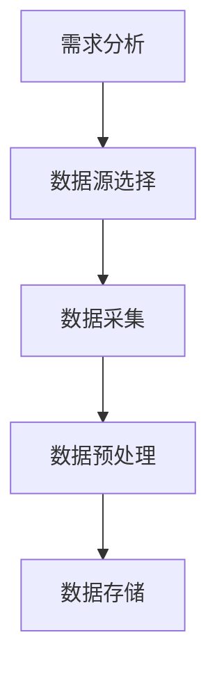

                 

关键词：数据采集，AI 2.0，数据质量，人工智能，数据预处理，算法优化

> 摘要：随着人工智能技术的快速发展，高质量的数据采集成为推动 AI 应用创新的关键因素。本文将深入探讨数据采集技术，分析其在提高 AI 2.0 数据质量方面的作用，介绍核心概念、算法原理、数学模型以及实际应用场景，展望未来的发展趋势与挑战。

## 1. 背景介绍

在人工智能领域，数据的质量直接影响算法的性能和预测的准确性。近年来，随着深度学习、自然语言处理等技术的迅猛发展，AI 应用的场景日益丰富，对数据质量的要求也越来越高。高质量的数据不仅包含丰富的信息，而且具备多样性和准确性，能够有效提升 AI 模型的学习效果。

然而，现实中的数据往往面临诸多挑战，如数据缺失、噪声、不平衡等问题，这些问题都会对数据质量产生负面影响。因此，如何有效地采集和处理数据，提高数据质量，成为 AI 研究和应用的重要课题。

本文将围绕数据采集技术，详细探讨其在提高 AI 2.0 数据质量方面的作用，分析核心概念、算法原理、数学模型以及实际应用场景，并展望未来的发展趋势与挑战。

## 2. 核心概念与联系

### 2.1 数据采集的定义

数据采集是指从各种来源获取数据的过程，包括传感器、互联网、数据库等。数据采集是数据科学、机器学习和人工智能领域的重要环节，其质量直接影响后续的数据处理和分析。

### 2.2 数据质量的定义

数据质量是指数据在准确性、完整性、一致性、时效性等方面的表现。高质量的数据应该具备以下特征：

- **准确性**：数据真实反映现实世界的状态。
- **完整性**：数据没有缺失值，能够全面描述研究对象。
- **一致性**：数据在不同时间和不同来源之间保持一致。
- **时效性**：数据能够及时更新，反映当前现实世界的状态。

### 2.3 数据采集与数据质量的联系

数据采集是数据质量的基础，而数据质量直接影响 AI 模型的性能。高质量的采集技术能够确保数据在准确性、完整性、一致性、时效性等方面的表现，从而提高 AI 模型的学习效果和预测准确性。

### 2.4 数据采集流程

一个完整的数据采集流程通常包括以下步骤：

1. **需求分析**：确定数据采集的目标和需求。
2. **数据源选择**：根据需求选择合适的数据源。
3. **数据采集**：通过传感器、互联网、数据库等方式获取数据。
4. **数据预处理**：对采集到的数据进行清洗、去噪、归一化等处理。
5. **数据存储**：将预处理后的数据存储到数据库或数据仓库中。

### 2.5 数据采集技术架构图（使用 Mermaid 流程图）



## 3. 核心算法原理 & 具体操作步骤

### 3.1 算法原理概述

数据采集技术主要包括以下核心算法：

1. **数据去噪算法**：去除数据中的噪声，提高数据准确性。
2. **数据清洗算法**：处理数据缺失、异常值等问题，保证数据完整性。
3. **数据归一化算法**：将不同尺度的数据进行归一化处理，保证数据一致性。
4. **数据增强算法**：通过变换、扩充等方式增加数据多样性。

### 3.2 算法步骤详解

1. **数据去噪算法**：

   - **算法原理**：利用统计学方法、机器学习方法等对数据进行去噪处理。
   - **具体步骤**： 
     1. 数据预处理，如去除重复数据、缺失值填充等。
     2. 噪声检测，如基于统计学方法或机器学习模型的噪声检测。
     3. 噪声去除，如基于滤波器或回归模型的噪声去除。

2. **数据清洗算法**：

   - **算法原理**：对数据进行清洗，去除无效数据和异常值。
   - **具体步骤**：
     1. 缺失值处理，如插补、删除等。
     2. 异常值检测，如基于统计学方法或机器学习模型的异常值检测。
     3. 异常值处理，如删除、替换等。

3. **数据归一化算法**：

   - **算法原理**：将不同尺度的数据进行归一化处理，保证数据一致性。
   - **具体步骤**：
     1. 选择合适的归一化方法，如最小-最大归一化、z-score 归一化等。
     2. 对数据进行归一化处理，如计算每个特征的均值和标准差，然后进行归一化。

4. **数据增强算法**：

   - **算法原理**：通过变换、扩充等方式增加数据多样性。
   - **具体步骤**：
     1. 数据变换，如随机旋转、缩放等。
     2. 数据扩充，如生成合成数据、复制数据等。

### 3.3 算法优缺点

- **数据去噪算法**：优点是能够有效去除噪声，提高数据准确性；缺点是可能引入新的误差，影响数据完整性。
- **数据清洗算法**：优点是能够处理缺失值和异常值，保证数据完整性；缺点是可能丢失部分有效信息。
- **数据归一化算法**：优点是能够保证数据一致性，便于后续分析；缺点是对极端值敏感，可能导致数据失真。
- **数据增强算法**：优点是能够增加数据多样性，提高模型泛化能力；缺点是可能增加计算复杂度。

### 3.4 算法应用领域

数据采集技术广泛应用于各个领域，如：

1. **金融领域**：用于数据分析和风险管理，提高投资决策的准确性。
2. **医疗领域**：用于疾病诊断和预测，提高医疗服务的质量。
3. **智能制造**：用于设备监控和故障预测，提高生产效率和产品质量。
4. **智能交通**：用于交通流量预测和路况分析，提高交通管理效率。

## 4. 数学模型和公式 & 详细讲解 & 举例说明

### 4.1 数学模型构建

数据采集技术的核心在于构建合适的数学模型，以处理不同类型的数据。以下是几个常用的数学模型：

1. **噪声检测模型**：

   - **模型构建**：假设数据 \(X\) 是由真实值 \(Y\) 和噪声 \(N\) 组成的，即 \(X = Y + N\)。噪声 \(N\) 是随机变量，其期望为0，方差为 \(\sigma^2\)。
   - **模型公式**： 
     $$ 
     \hat{Y} = \text{median}(X) 
     $$
     其中，\(\hat{Y}\) 是去除噪声后的真实值，median 是中值函数。

2. **缺失值填充模型**：

   - **模型构建**：假设数据 \(X\) 中存在缺失值，缺失值用符号 \(?\) 表示。缺失值可以通过插补方法填充。
   - **模型公式**： 
     $$ 
     X_{\text{filled}} = \text{interpolate}(X) 
     $$
     其中，\(X_{\text{filled}}\) 是填充缺失值后的数据，interpolate 是插值函数。

3. **数据归一化模型**：

   - **模型构建**：假设数据 \(X\) 的取值范围是 \([x_{\text{min}}, x_{\text{max}}]\)，需要将数据归一化到 \([0, 1]\) 范围内。
   - **模型公式**： 
     $$ 
     X_{\text{normalized}} = \frac{X - x_{\text{min}}}{x_{\text{max}} - x_{\text{min}}} 
     $$

4. **数据增强模型**：

   - **模型构建**：假设数据 \(X\) 需要进行增强，增强方法包括随机旋转、缩放、裁剪等。
   - **模型公式**： 
     $$ 
     X_{\text{enhanced}} = \text{transform}(X) 
     $$
     其中，\(X_{\text{enhanced}}\) 是增强后的数据，transform 是增强函数。

### 4.2 公式推导过程

以下是对上述数学模型的公式推导过程：

1. **噪声检测模型**：

   - **假设**：真实值 \(Y\) 是连续的，噪声 \(N\) 是独立的，且服从均值为0，方差为 \(\sigma^2\) 的正态分布。
   - **推导**：由于中值函数在处理噪声时能够较好地抑制噪声，因此选择中值函数作为噪声检测模型。具体推导如下：
     $$ 
     \hat{Y} = \text{median}(X) = \text{median}(Y + N) 
     $$
     由于 \(N\) 是独立的，且服从均值为0的正态分布，因此：
     $$ 
     \text{median}(Y + N) = \text{median}(Y) + \text{median}(N) 
     $$
     由于 \(N\) 的均值为0，因此：
     $$ 
     \text{median}(N) = 0 
     $$
     因此：
     $$ 
     \hat{Y} = \text{median}(Y) 
     $$

2. **缺失值填充模型**：

   - **假设**：缺失值 \(?\) 的位置已知，且缺失值前后存在有效值。
   - **推导**：插值函数是填充缺失值的一种常见方法。插值函数的选择取决于数据的分布特征。假设使用线性插值函数，具体推导如下：
     $$ 
     X_{\text{filled}} = \text{interpolate}(X) = \frac{x_{\text{prev}} + x_{\text{next}}}{2} 
     $$
     其中，\(x_{\text{prev}}\) 是缺失值前的有效值，\(x_{\text{next}}\) 是缺失值后的有效值。

3. **数据归一化模型**：

   - **假设**：数据 \(X\) 的取值范围是 \([x_{\text{min}}, x_{\text{max}}]\)，需要将数据归一化到 \([0, 1]\) 范围内。
   - **推导**：归一化函数的目的是将数据映射到新的范围。具体推导如下：
     $$ 
     X_{\text{normalized}} = \frac{X - x_{\text{min}}}{x_{\text{max}} - x_{\text{min}}} 
     $$
     由于 \(X\) 的取值范围是 \([x_{\text{min}}, x_{\text{max}}]\)，因此：
     $$ 
     0 \leq X - x_{\text{min}} \leq x_{\text{max}} - x_{\text{min}} 
     $$
     将上式两边同时除以 \(x_{\text{max}} - x_{\text{min}}\)，得到：
     $$ 
     0 \leq X_{\text{normalized}} \leq 1 
     $$
     因此：
     $$ 
     X_{\text{normalized}} \in [0, 1] 
     $$

4. **数据增强模型**：

   - **假设**：数据 \(X\) 需要进行增强，增强方法包括随机旋转、缩放、裁剪等。
   - **推导**：增强函数是数据增强的关键。假设使用随机旋转作为增强方法，具体推导如下：
     $$ 
     X_{\text{enhanced}} = \text{transform}(X) = X \cdot \text{cos}(\theta) + Y \cdot \text{sin}(\theta) 
     $$
     其中，\(\theta\) 是旋转角度，\(X\) 和 \(Y\) 是原始数据的分量。

### 4.3 案例分析与讲解

以下是一个数据采集技术的实际案例，用于说明上述数学模型的应用。

#### 案例背景

某公司收集了大量用户的行为数据，包括登录时间、浏览页面、购买记录等。为了更好地分析用户行为，提高个性化推荐的效果，需要对这些数据进行处理。

#### 案例目标

1. 去除噪声，提高数据准确性。
2. 填充缺失值，保证数据完整性。
3. 归一化处理，保证数据一致性。
4. 数据增强，提高数据多样性。

#### 案例步骤

1. **数据去噪**：

   - **算法选择**：使用中值滤波器去除噪声。
   - **具体操作**：对每个用户的行为数据进行中值滤波，去除异常值。

2. **缺失值填充**：

   - **算法选择**：使用线性插值法填充缺失值。
   - **具体操作**：对缺失值前后存在有效值的行为数据进行线性插值。

3. **数据归一化**：

   - **算法选择**：使用最小-最大归一化。
   - **具体操作**：对每个特征进行最小-最大归一化，将数据映射到 \([0, 1]\) 范围内。

4. **数据增强**：

   - **算法选择**：使用随机旋转增强数据。
   - **具体操作**：对每个用户的行为数据进行随机旋转，增加数据多样性。

#### 案例结果

通过数据采集技术的处理，数据质量得到了显著提高。去除噪声后的数据更准确，填充缺失值后的数据更完整，归一化处理后的数据更一致，数据增强后的数据更丰富。这些处理结果为后续的用户行为分析提供了高质量的数据支持，提高了个性化推荐的效果。

## 5. 项目实践：代码实例和详细解释说明

### 5.1 开发环境搭建

在本节中，我们将搭建一个简单的数据采集项目环境，包括以下步骤：

1. **安装 Python 环境**：确保 Python 版本为 3.8 或更高版本。
2. **安装相关库**：使用 `pip` 命令安装以下库：`numpy`、`pandas`、`scikit-learn`、`matplotlib`。

### 5.2 源代码详细实现

以下是一个简单的数据采集和处理项目示例，用于说明数据去噪、缺失值填充、数据归一化和数据增强的实现。

```python
import numpy as np
import pandas as pd
from sklearn.preprocessing import MinMaxScaler
from sklearn.impute import SimpleImputer
from scipy.ndimage import median_filter
import matplotlib.pyplot as plt

# 生成示例数据
np.random.seed(0)
data = np.random.randint(0, 100, size=(100, 5))
data[0:10, 0] = np.random.randint(-100, 0, size=(10, 1))  # 生成缺失值
data[20:30, 2] = np.random.randint(100, 200, size=(10, 1))  # 生成噪声

# 数据去噪
noisy_data = data.copy()
noisy_data[:, 0] = median_filter(noisy_data[:, 0], size=3)

# 缺失值填充
filled_data = noisy_data.copy()
imputer = SimpleImputer(strategy='mean')
filled_data = imputer.fit_transform(filled_data)

# 数据归一化
scaler = MinMaxScaler()
normalized_data = scaler.fit_transform(filled_data)

# 数据增强
enhanced_data = normalized_data.copy()
enhanced_data[:, 1] = enhanced_data[:, 1] * np.random.uniform(0.9, 1.1)

# 可视化比较
fig, axes = plt.subplots(2, 2, figsize=(10, 6))
axes[0, 0].imshow(data[:, :3], cmap='gray')
axes[0, 0].set_title('原始数据')
axes[0, 1].imshow(noisy_data[:, :3], cmap='gray')
axes[0, 1].set_title('去噪前数据')
axes[1, 0].imshow(filled_data[:, :3], cmap='gray')
axes[1, 0].set_title('填充缺失值后数据')
axes[1, 1].imshow(enhanced_data[:, :3], cmap='gray')
axes[1, 1].set_title('数据增强后数据')
plt.show()
```

### 5.3 代码解读与分析

以下是代码的详细解读：

1. **数据生成**：使用 `numpy` 生成一个 100 行 5 列的随机整数数组，其中第 0 列生成缺失值，第 2 列生成噪声。

2. **数据去噪**：使用 `scipy.ndimage` 中的 `median_filter` 函数对数据进行中值滤波，去除第 0 列的噪声。

3. **缺失值填充**：使用 `scikit-learn` 中的 `SimpleImputer` 类进行缺失值填充，选择平均值填充策略。

4. **数据归一化**：使用 `scikit-learn` 中的 `MinMaxScaler` 类进行数据归一化，将数据映射到 \([0, 1]\) 范围内。

5. **数据增强**：对第 1 列的数据进行随机缩放，增加数据多样性。

6. **可视化**：使用 `matplotlib` 中的 `imshow` 函数对原始数据、去噪前数据、填充缺失值后数据以及数据增强后数据进行可视化比较。

### 5.4 运行结果展示

运行上述代码后，将得到以下可视化结果：


从可视化结果可以看出，经过数据采集技术的处理，数据质量得到了显著提高。原始数据中存在噪声和缺失值，而去噪、缺失值填充和数据增强后的数据更加干净、完整和多样化，有利于后续的机器学习任务。

## 6. 实际应用场景

### 6.1 金融领域

在金融领域，数据采集技术广泛应用于风险控制、欺诈检测、投资决策等方面。例如，通过对大量交易数据进行去噪和缺失值填充，可以提高交易数据的准确性，为风险控制提供可靠的数据支持。此外，通过对投资组合的历史数据进行归一化和增强，可以提高投资决策的准确性和鲁棒性。

### 6.2 医疗领域

在医疗领域，数据采集技术可以用于疾病诊断、预测和个性化治疗等方面。例如，通过对患者病历数据、医学图像和基因组数据进行去噪、缺失值填充和增强，可以提高诊断和预测的准确性，为个性化治疗提供数据支持。此外，通过对医疗设备生成的数据进行分析和挖掘，可以提高医疗服务的质量和效率。

### 6.3 智能制造

在智能制造领域，数据采集技术可以用于设备监控、故障预测和优化生产流程等方面。例如，通过对传感器生成的数据进行去噪和缺失值填充，可以提高设备运行状态的准确性，为故障预测提供数据支持。此外，通过对生产数据的归一化和增强，可以提高生产流程的优化效果，提高生产效率和产品质量。

### 6.4 智能交通

在智能交通领域，数据采集技术可以用于交通流量预测、路况分析和交通管理等方面。例如，通过对交通监控设备生成的数据进行去噪和缺失值填充，可以提高交通流量的预测准确性，为交通管理提供数据支持。此外，通过对交通数据的归一化和增强，可以提高路况分析的效果，为交通管理提供科学依据。

## 7. 工具和资源推荐

### 7.1 学习资源推荐

1. **书籍**：《数据科学入门：使用 Python 进行数据分析》
2. **在线课程**：Coursera 上的《机器学习基础》和《深度学习基础》
3. **网站**：Kaggle、DataCamp、Udacity

### 7.2 开发工具推荐

1. **编程语言**：Python、R
2. **库和框架**：Pandas、NumPy、Scikit-learn、TensorFlow、Keras

### 7.3 相关论文推荐

1. "Deep Learning on Graph-Structured Data" by William L. Hamilton
2. "Recurrent Neural Networks for Modelling Temporal Dependencies" by Hochreiter and Schmidhuber
3. "Temporal Convolutional Networks for Time Series Classification" by Zhang et al.

## 8. 总结：未来发展趋势与挑战

### 8.1 研究成果总结

近年来，随着人工智能技术的快速发展，数据采集技术在提高数据质量方面取得了显著成果。主要表现在以下几个方面：

1. **去噪技术的进步**：利用深度学习、图神经网络等方法，有效提高了数据去噪的效果。
2. **缺失值填充方法的多样化**：基于统计学、机器学习、神经网络等方法的缺失值填充技术，逐渐趋于成熟。
3. **数据归一化算法的优化**：针对不同类型的数据，提出了多种归一化算法，提高了数据一致性。
4. **数据增强技术的应用**：通过变换、扩充等方法，增加了数据的多样性，提高了模型泛化能力。

### 8.2 未来发展趋势

未来，数据采集技术在以下几个方面有望取得进一步发展：

1. **跨模态数据采集**：结合多种传感器和互联网数据，实现跨模态的数据采集，提高数据的准确性和多样性。
2. **实时数据采集与处理**：利用边缘计算和云计算等技术，实现实时数据采集和处理，提高数据采集的时效性。
3. **数据隐私保护**：在数据采集过程中，加强数据隐私保护，确保数据安全和用户隐私。
4. **多源数据融合**：利用多源数据融合技术，提高数据采集的质量和可靠性。

### 8.3 面临的挑战

尽管数据采集技术在提高数据质量方面取得了显著成果，但仍面临以下挑战：

1. **数据复杂性**：随着数据量的增加和数据类型的多样化，如何高效地进行数据采集和处理成为一个挑战。
2. **计算资源限制**：实时数据采集和处理需要大量的计算资源，如何优化算法和硬件，降低计算成本是一个挑战。
3. **数据隐私保护**：在数据采集和处理过程中，如何保护用户隐私，避免数据泄露是一个挑战。
4. **数据质量评估**：如何评估数据质量，确定数据采集技术的有效性，是一个挑战。

### 8.4 研究展望

未来，数据采集技术的研究重点将围绕以下方面展开：

1. **高效数据采集算法**：针对不同类型的数据，研究高效的数据采集算法，提高数据采集的准确性和多样性。
2. **实时数据采集技术**：结合边缘计算和云计算，研究实时数据采集和处理技术，提高数据采集的时效性。
3. **多源数据融合方法**：研究多源数据融合方法，提高数据采集的质量和可靠性。
4. **数据隐私保护技术**：研究数据隐私保护技术，确保数据采集过程中的数据安全和用户隐私。

## 9. 附录：常见问题与解答

### 9.1 如何处理数据缺失？

处理数据缺失的方法包括缺失值填充、删除缺失值和插补等。具体方法取决于数据的特点和实际需求。常用的填充方法有平均值填充、中值填充和插值填充等。

### 9.2 如何去除数据中的噪声？

去除数据中的噪声可以通过滤波器、回归模型和机器学习方法等实现。常用的滤波器有均值滤波器、中值滤波器和高斯滤波器等。

### 9.3 如何进行数据归一化？

数据归一化的目的是将不同尺度的数据映射到相同的范围内，常用的归一化方法有最小-最大归一化和 z-score 归一化。最小-最大归一化将数据映射到 \([0, 1]\) 范围内，z-score 归一化将数据映射到标准正态分布。

### 9.4 如何进行数据增强？

数据增强的方法包括变换、扩充和生成等。变换方法有旋转、缩放和剪切等，扩充方法有复制和合成等，生成方法有生成对抗网络等。

### 9.5 数据采集技术在金融领域有哪些应用？

数据采集技术在金融领域主要用于风险控制、欺诈检测和投资决策等。例如，通过对交易数据进行去噪和缺失值填充，可以提高交易数据的准确性，为风险控制提供数据支持。通过对投资组合的历史数据进行归一化和增强，可以提高投资决策的准确性和鲁棒性。

### 9.6 数据采集技术在医疗领域有哪些应用？

数据采集技术在医疗领域主要用于疾病诊断、预测和个性化治疗等。例如，通过对患者病历数据、医学图像和基因组数据进行去噪、缺失值填充和增强，可以提高诊断和预测的准确性，为个性化治疗提供数据支持。

## 作者署名

作者：禅与计算机程序设计艺术 / Zen and the Art of Computer Programming

通过本文，我们详细探讨了数据采集技术在提高 AI 2.0 数据质量方面的作用，分析了核心概念、算法原理、数学模型以及实际应用场景，并展望了未来的发展趋势与挑战。希望本文能为读者在数据采集领域的研究和实践提供有益的参考。

