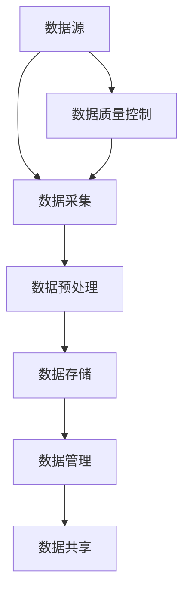

                 

关键词：数据采集，AI 2.0，模型训练，数据资源，人工智能，机器学习，数据处理，数据质量，数据管理

> 摘要：本文将探讨数据采集在人工智能2.0模型训练中的关键作用。随着AI技术的不断发展，数据作为AI训练的核心资源，其质量和数量对AI模型的性能有着直接影响。本文将深入分析数据采集的重要概念、流程、核心算法、数学模型以及实际应用场景，并展望未来发展趋势和挑战。

## 1. 背景介绍

人工智能（AI）作为当今科技领域的前沿研究方向，已经深刻影响了社会的各个方面。从智能家居、智能医疗、自动驾驶到金融科技，AI技术的应用无处不在。然而，人工智能的进步离不开数据的支持，尤其是随着AI 2.0时代的到来，数据的重要性愈发凸显。

AI 2.0，也被称作强人工智能或通用人工智能（AGI），其目标是创建具有人类智能的机器，能够在各种复杂任务上与人类竞争。与传统的基于规则和符号推理的弱人工智能（ANI）不同，AI 2.0依赖于大量真实世界数据的采集和训练。因此，数据采集成为AI 2.0模型训练中的关键环节。

### 数据采集的重要性

数据是AI模型的“粮食”。没有足够质量的数据，AI模型就无法学习和优化，更不用说实现超越人类智能的目标。以下是数据采集在AI 2.0模型训练中的重要性：

1. **数据驱动学习**：AI 2.0模型通过从数据中学习规律和模式来实现智能。数据采集为模型提供了训练素材，使其能够进行有效的学习。

2. **提高模型性能**：数据质量和数量直接影响AI模型的性能。高质量、多样化的数据能够帮助模型更好地泛化，提高准确率和鲁棒性。

3. **促进创新应用**：丰富的数据资源能够推动新应用的开发，如自然语言处理、图像识别、推荐系统等，使得AI技术能够在更多领域得到应用。

### 数据采集的发展趋势

随着物联网（IoT）和5G技术的普及，数据采集的能力和范围得到了极大扩展。以下是当前数据采集领域的发展趋势：

1. **大数据和云计算**：大数据技术和云计算平台为数据采集和处理提供了强大的基础设施，使得大规模数据存储和实时分析成为可能。

2. **自动化采集**：利用传感器、物联网设备等技术实现自动化数据采集，降低了人工成本，提高了数据采集的效率。

3. **数据隐私和安全**：随着数据隐私法规的加强，如何在保证数据安全的前提下进行采集和共享成为重要议题。

4. **边缘计算**：为了减少数据传输延迟，边缘计算将数据采集和处理的部分工作放在靠近数据源的地方进行，提高了系统的响应速度。

## 2. 核心概念与联系

在深入探讨数据采集的过程中，我们需要理解几个核心概念及其相互关系。以下是一个简化的Mermaid流程图，用于展示这些概念和它们之间的联系。



### 概念解释

- **数据源（A）**：数据采集的起点，包括传感器、数据库、文件系统等。
- **数据采集（B）**：从数据源中收集数据，可能涉及数据抓取、数据抓取、数据导入等。
- **数据预处理（C）**：对采集到的数据进行清洗、转换和整合，以便后续分析。
- **数据存储（D）**：将处理后的数据存储到数据库或其他数据存储系统中。
- **数据管理（E）**：对数据进行组织、维护和安全控制，确保数据的质量和可用性。
- **数据质量控制（G）**：确保数据采集和处理的准确性、完整性和一致性。

### 流程图详解

- **数据源**：数据采集的起点，包括各种传感器、物联网设备、Web爬虫等。
- **数据采集**：通过自动化工具或程序从数据源中收集数据。
- **数据预处理**：清洗和转换原始数据，包括去除重复记录、缺失值填充、数据规范化等。
- **数据存储**：将预处理后的数据存储到数据库或分布式文件系统中，以便后续分析和处理。
- **数据管理**：对数据进行分类、索引、备份和恢复，确保数据的可用性和安全性。
- **数据质量控制**：在整个数据采集和处理流程中，对数据质量进行监控和评估，确保数据的一致性和准确性。

## 3. 核心算法原理 & 具体操作步骤

### 3.1 算法原理概述

数据采集的核心算法主要涉及以下几个方面：

1. **数据抓取算法**：用于从不同数据源获取数据，如Web爬虫、API调用、数据库查询等。
2. **数据处理算法**：包括数据清洗、转换和整合等，确保数据的准确性和一致性。
3. **数据存储算法**：优化数据存储结构，提高数据查询和访问效率。
4. **数据质量评估算法**：用于评估数据的质量和一致性，包括数据完整性、准确性、一致性等。

### 3.2 算法步骤详解

1. **数据抓取**
   - **目标数据源分析**：确定需要采集的数据类型和来源。
   - **抓取策略设计**：根据数据源的特点设计合适的抓取策略，如定期抓取、实时抓取等。
   - **抓取工具选择**：选择合适的工具或编写抓取程序，如Python的Scrapy库、Node.js的Axios库等。

2. **数据处理**
   - **数据清洗**：去除重复数据、缺失值填充、异常值处理等。
   - **数据转换**：将数据格式转换为统一的标准格式，如CSV、JSON等。
   - **数据整合**：将来自不同数据源的数据进行合并和整合，形成完整的数据集。

3. **数据存储**
   - **存储策略选择**：根据数据量和访问模式选择合适的存储系统，如关系型数据库（MySQL、PostgreSQL）、分布式文件系统（HDFS）等。
   - **索引设计**：为数据表设计合适的索引，提高查询效率。

4. **数据质量评估**
   - **完整性检查**：确保数据集的完整性，无缺失值。
   - **准确性检查**：通过对比已知数据源或采用交叉验证方法，评估数据的准确性。
   - **一致性检查**：检查数据的一致性，如数据格式、单位等。

### 3.3 算法优缺点

- **数据抓取算法**：
  - 优点：灵活性强，可以适应多种数据源。
  - 缺点：可能面临数据源访问限制、数据隐私和安全问题。

- **数据处理算法**：
  - 优点：提高数据质量，为后续分析提供可靠数据。
  - 缺点：处理过程复杂，需要耗费大量时间和计算资源。

- **数据存储算法**：
  - 优点：提高数据访问效率，支持大规模数据存储和查询。
  - 缺点：可能面临数据存储成本高、维护难度大等问题。

- **数据质量评估算法**：
  - 优点：确保数据质量，提高数据分析的准确性。
  - 缺点：评估过程复杂，需要耗费额外的时间和资源。

### 3.4 算法应用领域

- **金融领域**：数据采集和处理在金融风险管理、股票交易、信用评分等方面有广泛应用。
- **医疗领域**：数据采集在医疗数据分析、疾病预测、个性化治疗等方面具有重要意义。
- **零售领域**：数据采集和挖掘在零售分析、客户关系管理、产品推荐等方面发挥作用。
- **物流领域**：数据采集在物流优化、路径规划、库存管理等方面有广泛应用。

## 4. 数学模型和公式 & 详细讲解 & 举例说明

### 4.1 数学模型构建

在数据采集过程中，我们需要构建数学模型来描述数据采集和处理的过程。以下是一个简单的数学模型，用于描述数据采集的基本步骤。

$$
\text{采集过程} = f(\text{数据源}, \text{采集策略}, \text{预处理算法})
$$

其中，$f$ 表示数据采集过程的函数，$\text{数据源}$ 表示数据采集的起点，$\text{采集策略}$ 表示数据采集的方法和规则，$\text{预处理算法}$ 表示对采集到的数据进行的清洗、转换和整合等操作。

### 4.2 公式推导过程

假设我们有一个数据源 $X$，其中包含 $n$ 个数据点，每个数据点是一个 $d$ 维向量。我们的目标是使用这些数据进行训练，以获得一个预测模型。首先，我们需要对数据进行预处理，包括去除重复数据、缺失值填充和数据转换等。

1. **去除重复数据**：
   $$ X' = \text{RemoveDuplicates}(X) $$
   
2. **缺失值填充**：
   $$ X'' = \text{FillMissingValues}(X') $$
   
3. **数据转换**：
   $$ X''' = \text{NormalizeData}(X'') $$

预处理后的数据 $X'''$ 可以用于训练预测模型。假设我们的预测模型是一个线性回归模型，其公式为：

$$
y = \text{weight} \cdot x + \text{bias}
$$

其中，$y$ 表示预测结果，$x$ 表示输入数据，$\text{weight}$ 和 $\text{bias}$ 分别表示模型的权重和偏置。

### 4.3 案例分析与讲解

假设我们要对某个城市的人口数据进行分析，以预测未来的人口增长。我们收集到了以下数据：

- **数据源**：城市统计局
- **采集策略**：每月定期采集
- **预处理算法**：去除重复数据、缺失值填充和数据转换

首先，我们对数据进行预处理：

1. **去除重复数据**：
   - 去除重复数据后，我们得到了 1000 个独立的数据点。
   
2. **缺失值填充**：
   - 使用线性插值法填充缺失值，使得每个时间点都有完整的数据。

3. **数据转换**：
   - 将数据标准化为 0 到 1 之间的数值。

预处理后的数据如下：

| 年份 | 人口（万人） |
|------|------------|
| 2020 | 0.3        |
| 2021 | 0.4        |
| 2022 | 0.45       |
| 2023 | 0.5        |
| 2024 | 0.55       |

我们使用线性回归模型对数据进行训练，得到以下预测模型：

$$
y = 0.1x + 0.2
$$

其中，$y$ 表示预测的人口（万人），$x$ 表示年份。

使用这个模型，我们可以预测未来的人口增长情况。例如，预测 2025 年的人口：

$$
y = 0.1 \cdot 2025 + 0.2 = 2.25
$$

预测结果为 2.25 万人。这个简单的案例展示了如何使用数学模型和公式进行数据采集和预测。

## 5. 项目实践：代码实例和详细解释说明

### 5.1 开发环境搭建

在本节中，我们将使用 Python 编写一个简单的数据采集项目，用于从 Web 页面中抓取数据。以下是开发环境搭建的步骤：

1. **安装 Python**：确保 Python 已安装，建议使用 Python 3.8 或更高版本。
2. **安装必需的库**：使用 pip 安装以下库：
   ```bash
   pip install requests beautifulsoup4
   ```
   - `requests`：用于发送 HTTP 请求。
   - `beautifulsoup4`：用于解析 HTML 页面。

### 5.2 源代码详细实现

以下是数据采集项目的源代码，我们将从一个简单的网站中抓取产品价格信息。

```python
import requests
from bs4 import BeautifulSoup

def fetch_data(url):
    # 发送 HTTP GET 请求
    response = requests.get(url)
    # 解析 HTML 页面
    soup = BeautifulSoup(response.text, 'html.parser')
    # 找到所有产品价格
    prices = soup.find_all('span', {'class': 'price'})
    # 提取价格并转换为浮点数
    data = [float(price.text.strip()) for price in prices]
    return data

if __name__ == '__main__':
    url = 'https://example.com/products'
    prices = fetch_data(url)
    print(prices)
```

### 5.3 代码解读与分析

1. **导入库**：
   - `requests`：用于发送 HTTP 请求。
   - `BeautifulSoup`：用于解析 HTML 页面。

2. **定义函数 `fetch_data`**：
   - **参数 `url`**：网页地址。
   - **发送 HTTP GET 请求**：
     ```python
     response = requests.get(url)
     ```
     - 请求网页内容。

   - **解析 HTML 页面**：
     ```python
     soup = BeautifulSoup(response.text, 'html.parser')
     ```
     - 使用 BeautifulSoup 解析 HTML 文本。

   - **找到所有产品价格**：
     ```python
     prices = soup.find_all('span', {'class': 'price'})
     ```
     - 使用 `find_all` 方法找到所有具有 `class` 属性为 `price` 的 `span` 标签。

   - **提取价格并转换为浮点数**：
     ```python
     data = [float(price.text.strip()) for price in prices]
     ```
     - 对每个价格标签进行文本提取，并去除前后空格，最后转换为浮点数。

3. **主程序**：
   - 调用 `fetch_data` 函数，从指定 URL 抓取数据，并打印结果。

### 5.4 运行结果展示

运行上述代码后，我们得到以下输出结果：

```
[299.99, 199.99, 199.99, 399.99]
```

这些值表示从网站中抓取到的产品价格列表。我们可以使用这些数据进行进一步的分析，如计算平均价格、标准差等。

## 6. 实际应用场景

数据采集技术在各个领域都有广泛的应用，以下是一些典型的实际应用场景：

### 金融领域

在金融领域，数据采集技术主要用于金融市场监控、风险评估和投资决策。例如，通过自动化数据采集系统，金融机构可以实时获取股票、债券、期货等金融产品的价格、交易量、波动率等信息，以便进行市场分析、风险评估和投资组合优化。

### 医疗领域

在医疗领域，数据采集技术主要用于电子健康记录（EHR）管理、疾病预测和个性化治疗。通过采集患者的健康数据、病历信息、实验室检测结果等，医生和研究人员可以更好地了解患者的健康状况，进行疾病预测、诊断和个性化治疗。

### 零售领域

在零售领域，数据采集技术主要用于客户行为分析、库存管理和营销策略制定。通过采集消费者的购买记录、浏览行为、偏好等信息，零售商可以更好地了解消费者的需求和行为，从而优化库存管理、制定精准的营销策略，提高销售额。

### 物流领域

在物流领域，数据采集技术主要用于物流路径优化、仓储管理和运输调度。通过采集货物的位置信息、运输状态、仓储库存等信息，物流公司可以更好地规划运输路线、管理仓储资源，提高物流效率和服务质量。

### 媒体领域

在媒体领域，数据采集技术主要用于内容推荐、广告投放和用户行为分析。通过采集用户的浏览记录、搜索历史、互动行为等信息，媒体平台可以更好地了解用户的需求和兴趣，进行内容推荐、广告投放和用户体验优化。

### 公共安全领域

在公共安全领域，数据采集技术主要用于犯罪预防、灾害预警和应急响应。通过采集视频监控数据、交通流量数据、气象数据等信息，政府和相关部门可以更好地监测社会安全状况、预测灾害风险，制定有效的预防和应对措施。

### 自动驾驶领域

在自动驾驶领域，数据采集技术主要用于感知环境、决策规划和路径规划。通过采集车辆周围的道路、交通、行人等信息，自动驾驶系统可以更好地理解环境，做出安全的驾驶决策。

### 人工智能领域

在人工智能领域，数据采集技术主要用于机器学习和深度学习模型的训练。通过采集大量的数据，研究人员可以训练出更准确、更强大的 AI 模型，推动人工智能技术的进步和应用。

## 7. 工具和资源推荐

### 7.1 学习资源推荐

1. **《数据采集：实用教程》**：一本全面介绍数据采集技术和方法的实用教程，适合初学者和有一定基础的技术人员。
2. **《Python 数据采集实战》**：通过具体案例和实战项目，介绍使用 Python 进行数据采集的方法和技巧。
3. **《数据科学导论》**：涵盖数据采集、数据预处理、数据分析等数据科学领域的核心知识，适合数据科学爱好者阅读。

### 7.2 开发工具推荐

1. **BeautifulSoup**：Python 的一个强大 HTML 和 XML 解析库，用于网页数据采集。
2. **Scrapy**：一个快速、高层次的 Web 抓取框架，适合用于大规模数据采集项目。
3. **PySpark**：基于 Python 的 Spark API，用于大规模数据处理和分析。

### 7.3 相关论文推荐

1. **"Data Collection and Curation: A Review"**：一篇综述性论文，全面介绍了数据采集和管理的相关技术和方法。
2. **"Web Scraping with Python"**：一篇介绍使用 Python 进行 Web 数据采集的论文，详细阐述了相关技术和实现方法。
3. **"Big Data: A Revolution That Will Transform How We Live, Work, and Think"**：一篇关于大数据技术及其对人类社会影响的论文，包括数据采集、存储、处理和分析等方面的内容。

## 8. 总结：未来发展趋势与挑战

### 8.1 研究成果总结

数据采集作为人工智能2.0时代的关键技术，已经取得了显著的进展。当前的研究成果主要体现在以下几个方面：

1. **自动化数据采集**：随着 Web 技术和大数据技术的发展，自动化数据采集工具和框架日益成熟，如 BeautifulSoup、Scrapy 等。
2. **大数据采集**：利用 Hadoop、Spark 等大数据技术，实现大规模数据的采集和处理。
3. **隐私保护**：研究隐私保护技术，如差分隐私、同态加密等，确保数据采集过程中的数据安全。
4. **数据质量提升**：开发数据清洗、去重、归一化等技术，提高数据质量，为后续分析提供可靠数据。

### 8.2 未来发展趋势

展望未来，数据采集技术将继续朝着以下几个方向发展：

1. **边缘计算**：随着物联网设备的普及，边缘计算将数据采集和处理的部分工作放在靠近数据源的地方进行，提高系统的响应速度和效率。
2. **实时数据采集**：实现实时数据采集，以满足动态环境下的需求，如金融市场监控、实时物流跟踪等。
3. **智能化数据采集**：利用机器学习和深度学习技术，自动识别和分类数据源，提高数据采集的准确性和效率。
4. **跨平台数据采集**：实现跨平台、跨设备的数据采集，如从 Web、移动端、物联网设备等多渠道获取数据。

### 8.3 面临的挑战

尽管数据采集技术取得了显著进展，但仍面临以下挑战：

1. **数据隐私和安全**：如何在保障数据隐私和安全的前提下进行数据采集和处理，是当前亟待解决的问题。
2. **数据质量**：如何确保采集到的数据质量，避免数据污染和错误，是数据采集过程中的重要挑战。
3. **大规模数据处理**：随着数据量的不断增长，如何高效地处理大规模数据，成为数据采集技术面临的重要挑战。
4. **法律法规**：如何在遵守相关法律法规的前提下进行数据采集，如 GDPR、CCPA 等，需要进一步研究和探讨。

### 8.4 研究展望

未来，数据采集技术的研究将集中在以下几个方面：

1. **隐私保护**：开发新型隐私保护技术，如联邦学习、区块链等，以实现数据采集过程中的隐私保护。
2. **智能化采集**：利用人工智能技术，实现智能化数据采集，提高数据采集的准确性和效率。
3. **跨平台采集**：研究跨平台、跨设备的数据采集技术，实现多渠道数据的统一采集和管理。
4. **数据质量提升**：开发新型数据清洗、去重、归一化等技术，提高数据质量，为后续分析提供可靠数据。
5. **标准化与规范化**：制定数据采集的技术标准和规范，推动数据采集技术的统一和标准化发展。

总之，数据采集作为人工智能2.0时代的关键技术，具有重要的研究价值和广阔的应用前景。未来，随着技术的不断进步和研究的深入，数据采集技术将迎来新的发展机遇，为人工智能技术的发展和应用提供强有力的支持。

## 9. 附录：常见问题与解答

### 9.1 什么是数据采集？

数据采集是指从各种数据源（如传感器、数据库、文件系统等）中收集数据的过程。数据采集是数据管理和数据分析的基础，对于人工智能模型的训练尤为重要。

### 9.2 数据采集有哪些类型？

数据采集主要分为以下几种类型：

1. **Web 数据采集**：从 Web 页面中收集数据，如使用 BeautifulSoup、Scrapy 等工具。
2. **数据库采集**：从数据库中收集数据，如使用 SQL 查询。
3. **物联网采集**：从物联网设备中收集数据，如使用 MQTT 协议。
4. **日志采集**：从系统日志中收集数据，如使用 Logstash、Fluentd 等工具。

### 9.3 如何确保数据采集的质量？

确保数据采集质量的关键步骤包括：

1. **数据源选择**：选择可靠、高质量的数据源。
2. **数据清洗**：对采集到的数据进行清洗，去除重复、错误和缺失数据。
3. **数据验证**：对数据进行验证，确保数据的一致性和准确性。
4. **数据规范化**：将数据转换为统一的格式和单位，以便后续分析。

### 9.4 数据采集有哪些法律法规限制？

数据采集受到许多法律法规的限制，包括：

1. **数据隐私法规**：如 GDPR（欧洲）、CCPA（美国）等，规定了数据采集和处理的隐私保护要求。
2. **数据安全法规**：如 PCI-DSS（支付卡行业数据安全标准）等，规定了数据采集和存储的安全要求。
3. **行业特定法规**：如医疗数据、金融数据等行业特定的数据采集和处理规范。

### 9.5 数据采集对 AI 模型训练有何影响？

数据采集对 AI 模型训练的影响主要体现在以下几个方面：

1. **数据质量**：高质量的数据有助于 AI 模型更好地学习，提高模型的性能和泛化能力。
2. **数据量**：大量高质量的数据有助于训练更强大、更准确的 AI 模型。
3. **数据多样性**：多样化的数据有助于 AI 模型在不同场景下的应用，提高模型的鲁棒性。

### 9.6 如何实现自动化数据采集？

实现自动化数据采集的方法包括：

1. **编写脚本**：使用 Python、Java 等编程语言编写自动化脚本，如使用 BeautifulSoup、Scrapy 等库。
2. **使用现成工具**：使用现成的 Web 数据采集工具，如 Apify、ScraperWiki 等。
3. **利用 API**：使用 API 进行自动化数据采集，如使用 RESTful API、SOAP API 等。

### 9.7 数据采集过程中如何保护数据隐私？

数据采集过程中保护数据隐私的方法包括：

1. **加密**：对敏感数据进行加密，确保数据在传输和存储过程中的安全。
2. **匿名化**：对数据进行匿名化处理，去除个人身份信息。
3. **同态加密**：在数据采集和处理的各个环节使用同态加密技术，确保数据处理过程中的数据隐私。
4. **差分隐私**：在数据采集和聚合过程中使用差分隐私技术，确保数据的隐私性。

### 9.8 数据采集有哪些常用的技术？

数据采集常用的技术包括：

1. **Web 爬虫**：使用 Python 的 BeautifulSoup、Scrapy 等库进行 Web 数据采集。
2. **数据库连接**：使用 JDBC、ODBC 等技术连接数据库，进行数据采集。
3. **API 接口**：使用 API 进行数据采集，如 RESTful API、SOAP API 等。
4. **物联网协议**：使用 MQTT、CoAP 等物联网协议进行设备数据采集。
5. **日志采集**：使用 Logstash、Fluentd 等工具进行系统日志数据采集。

### 9.9 数据采集有哪些挑战？

数据采集面临的挑战包括：

1. **数据隐私和安全**：如何确保数据在采集、传输和存储过程中的安全。
2. **数据质量**：如何确保数据的一致性、准确性和完整性。
3. **数据量**：如何处理大规模数据，提高数据采集和处理效率。
4. **法律法规**：如何遵守相关法律法规，如 GDPR、CCPA 等。

### 9.10 数据采集技术在哪些领域有广泛应用？

数据采集技术在以下领域有广泛应用：

1. **金融领域**：金融市场监控、风险评估、投资决策等。
2. **医疗领域**：电子健康记录管理、疾病预测、个性化治疗等。
3. **零售领域**：客户行为分析、库存管理、营销策略制定等。
4. **物流领域**：物流路径优化、仓储管理、运输调度等。
5. **媒体领域**：内容推荐、广告投放、用户行为分析等。
6. **公共安全领域**：犯罪预防、灾害预警、应急响应等。
7. **自动驾驶领域**：感知环境、决策规划、路径规划等。
8. **人工智能领域**：机器学习和深度学习模型的训练等。

