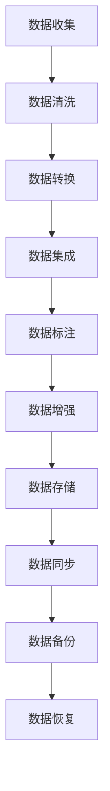

                 

关键词：数据集萃取，自动化数据集构建，AI，机器学习，数据预处理，数据标注，数据清洗，数据增强，Mermaid流程图，数学模型，公式推导，项目实践，代码实例，应用场景，工具推荐

> 摘要：本文探讨了数据集萃取在现代人工智能应用中的重要性，提出了自动化数据集构建的新思路。通过深入分析数据集构建的挑战和机遇，本文介绍了核心算法原理、具体操作步骤、数学模型和项目实践，并展望了未来发展趋势和面临的挑战。

## 1. 背景介绍

在人工智能（AI）和机器学习（ML）领域，数据集是至关重要的。一个高质量、有代表性的数据集是训练高效模型的基础。然而，构建这样一个数据集往往是一项费时费力且容易出错的任务。传统的数据集构建方法通常需要手动进行数据收集、标注、清洗和增强。随着AI应用的不断扩展，特别是在计算机视觉、自然语言处理和推荐系统等领域，数据集的需求量剧增，手动构建数据集变得越来越不可行。

为了应对这一挑战，研究人员和工程师们开始探索自动化数据集构建的方法。自动化数据集构建不仅能够提高构建效率，还能减少人为错误，提高数据集的多样性和质量。自动化数据集构建的关键在于算法的智能运用和数据管理技术的创新。

本文将围绕自动化数据集构建这一主题展开讨论，首先介绍核心概念和联系，然后详细解释核心算法原理和操作步骤，最后探讨实际应用场景、数学模型和项目实践。通过这篇文章，我们希望为读者提供一个全面、深入的了解，激发更多关于数据集萃取的研究和创新。

## 2. 核心概念与联系

### 2.1 数据集萃取的概念

数据集萃取（Data Extraction）是指从原始数据中提取出用于训练、评估和部署机器学习模型的有用数据的过程。数据集萃取的目的是确保数据集的代表性、质量和多样性，从而提高模型的性能和泛化能力。

### 2.2 自动化数据集构建

自动化数据集构建（Automated Dataset Construction）则是在数据集萃取的基础上，通过算法和工具实现数据收集、标注、清洗和增强的自动化。自动化数据集构建的核心在于利用计算机算法和人工智能技术，减少人为干预，提高数据集构建的效率和准确性。

### 2.3 数据预处理

数据预处理（Data Preprocessing）是数据集构建的重要环节，包括数据清洗、数据转换和数据集成等步骤。数据清洗旨在去除不完整、不准确或重复的数据；数据转换则涉及将数据转换为适合模型训练的格式；数据集成是将来自多个来源的数据合并为一个统一的数据集。

### 2.4 数据标注

数据标注（Data Annotation）是数据集构建中的关键步骤，涉及为数据打标签，使其适用于监督学习模型。数据标注可以是手动标注，也可以是半监督或无监督的自动标注。

### 2.5 数据增强

数据增强（Data Augmentation）是通过生成数据的不同变体来扩充数据集，从而提高模型的泛化能力。数据增强可以包括图像旋转、缩放、裁剪等操作。

### 2.6 数据管理技术

数据管理技术（Data Management Techniques）是确保数据集构建过程中数据质量和一致性的重要手段。数据管理技术包括数据存储、数据同步、数据备份和数据恢复等。

### 2.7 Mermaid流程图

为了更好地展示数据集萃取和自动化数据集构建的流程，我们可以使用Mermaid流程图来描述。以下是一个示例：



在上述流程图中，每个节点表示数据集构建中的一个步骤，箭头表示步骤之间的依赖关系。

通过上述核心概念和联系的分析，我们可以看到数据集萃取和自动化数据集构建在整个机器学习过程中扮演着至关重要的角色。接下来，我们将深入探讨数据集构建中的核心算法原理和操作步骤。

## 3. 核心算法原理 & 具体操作步骤

### 3.1 算法原理概述

数据集萃取和自动化数据集构建的核心在于利用一系列高效的算法来实现数据收集、标注、清洗和增强。以下是一些关键算法的概述：

- **图像识别算法**：用于从大规模图像库中自动提取相关数据。
- **自然语言处理（NLP）算法**：用于处理文本数据，包括实体识别、情感分析等。
- **数据清洗算法**：如缺失值填充、异常值检测和去除重复数据。
- **半监督和无监督学习算法**：用于自动标注数据，减少人工干预。
- **数据增强算法**：如图像增强、文本增强等，用于扩充数据集。

### 3.2 算法步骤详解

#### 3.2.1 数据收集

数据收集是数据集构建的第一步，主要包括以下步骤：

1. **数据源选择**：根据项目需求选择合适的数据源，如公共数据集、企业内部数据或第三方数据提供商。
2. **数据爬取**：使用爬虫技术从网页、数据库等来源收集数据。
3. **数据预处理**：对收集到的原始数据进行清洗和格式化，以确保数据的质量和一致性。

#### 3.2.2 数据清洗

数据清洗旨在去除不完整、不准确或重复的数据，主要包括以下步骤：

1. **缺失值处理**：使用统计方法或机器学习算法预测缺失值，或删除包含缺失值的数据。
2. **异常值检测**：使用统计方法或基于规则的算法检测并处理异常值。
3. **重复数据删除**：通过比对数据项的属性值来识别和删除重复数据。

#### 3.2.3 数据转换

数据转换是将数据转换为适合模型训练的格式，主要包括以下步骤：

1. **数据标准化**：通过缩放或归一化将数据转换为统一的范围。
2. **数据编码**：将类别数据转换为数值形式，如使用独热编码或标签编码。
3. **特征提取**：从原始数据中提取有用的特征，如使用词袋模型或卷积神经网络提取文本特征。

#### 3.2.4 数据标注

数据标注是数据集构建中的关键步骤，主要包括以下步骤：

1. **手动标注**：由专业人员对数据项进行标注。
2. **半监督标注**：利用部分手动标注的数据，通过机器学习算法自动标注剩余数据。
3. **无监督标注**：通过聚类或生成模型自动标注数据。

#### 3.2.5 数据增强

数据增强通过生成数据的不同变体来扩充数据集，主要包括以下步骤：

1. **图像增强**：如旋转、缩放、裁剪、添加噪声等。
2. **文本增强**：如文本拼接、同义词替换、句法变换等。
3. **音频增强**：如添加背景噪声、改变音调等。

#### 3.2.6 数据存储与管理

数据存储与管理涉及将数据存储到数据库或分布式文件系统中，并确保数据的一致性、可靠性和可扩展性。主要包括以下步骤：

1. **数据索引**：为数据创建索引，以提高查询效率。
2. **数据同步**：确保分布式环境中的数据一致性。
3. **数据备份**：定期备份数据，以防止数据丢失。

### 3.3 算法优缺点

每种算法都有其优缺点。以下是一些常见算法的优缺点分析：

- **图像识别算法**：优点是能够处理大规模图像数据，缺点是对于复杂的图像场景可能效果不佳。
- **NLP算法**：优点是能够处理文本数据，缺点是对于语义理解有限。
- **数据清洗算法**：优点是能够去除不完整和不准确的数据，缺点是可能丢失一些有价值的信息。
- **半监督和无监督学习算法**：优点是减少人工干预，缺点是标注质量可能不高。
- **数据增强算法**：优点是能够扩充数据集，缺点是可能引入噪声。

### 3.4 算法应用领域

自动化数据集构建算法广泛应用于多个领域，包括：

- **计算机视觉**：用于图像分类、目标检测和图像分割等任务。
- **自然语言处理**：用于文本分类、情感分析和机器翻译等任务。
- **推荐系统**：用于用户偏好分析、商品推荐和广告投放等任务。
- **医疗健康**：用于疾病诊断、药物发现和基因组分析等任务。

通过上述算法原理和具体操作步骤的分析，我们可以看到自动化数据集构建的核心算法是如何应用于不同的领域，并如何通过优化算法提高数据集的质量和效率。

## 4. 数学模型和公式 & 详细讲解 & 举例说明

### 4.1 数学模型构建

在自动化数据集构建过程中，数学模型扮演着至关重要的角色。以下是一个简单的数学模型构建过程：

#### 4.1.1 数据预处理

在数据预处理阶段，我们通常使用以下数学模型：

- **缺失值填充**：使用平均值、中位数或回归模型填充缺失值。
  $$\hat{y} = \frac{\sum_{i=1}^{n} y_i}{n}$$
  
- **异常值检测**：使用统计学方法检测异常值，如箱线图或Z分数。
  $$z = \frac{y - \bar{y}}{s}$$

#### 4.1.2 数据标注

在数据标注阶段，我们使用以下数学模型：

- **监督学习模型**：如逻辑回归、支持向量机或神经网络。
  $$P(y=1|x;\theta) = \frac{1}{1 + e^{-\theta^T x}}$$

#### 4.1.3 数据增强

在数据增强阶段，我们使用以下数学模型：

- **图像增强**：如卷积神经网络（CNN）。
  $$h_{\theta}(x) = \text{ReLU}(W \cdot x + b)$$

### 4.2 公式推导过程

以下是一个简单的公式推导过程，用于缺失值填充：

假设我们有一个包含缺失值的数据集 $D = \{x_1, x_2, ..., x_n\}$，其中 $x_i$ 可能包含缺失值。我们的目标是填充这些缺失值，使得新的数据集 $\hat{D} = \{\hat{x}_1, \hat{x}_2, ..., \hat{x}_n\}$ 具有更好的属性。

1. **计算平均值**：

   对于每个特征 $j$，计算其平均值 $\mu_j$：

   $$\mu_j = \frac{\sum_{i=1}^{n} x_{ij}}{n}$$

2. **填充缺失值**：

   对于每个包含缺失值的数据点 $x_i$，使用其对应特征的平均值进行填充：

   $$\hat{x}_{ij} = \mu_j \quad \text{if} \quad x_{ij} \text{ is missing}$$

### 4.3 案例分析与讲解

以下是一个简单的案例，用于说明数学模型在自动化数据集构建中的应用：

假设我们有一个包含100个数据点的数据集，其中50个数据点包含缺失值。我们的目标是使用平均值填充缺失值，并评估填充后数据集的性能。

1. **数据预处理**：

   使用平均值填充缺失值，得到新的数据集 $\hat{D}$。

2. **数据标注**：

   使用逻辑回归模型对填充后的数据集进行标注，得到预测结果。

3. **性能评估**：

   计算填充前后数据集在标注任务上的准确率、召回率和F1分数。

- **准确率**：
  $$\text{Accuracy} = \frac{TP + TN}{TP + TN + FP + FN}$$

- **召回率**：
  $$\text{Recall} = \frac{TP}{TP + FN}$$

- **F1分数**：
  $$\text{F1 Score} = 2 \cdot \frac{TP \cdot TN}{TP \cdot TN + FP \cdot FN}$$

通过上述案例，我们可以看到数学模型在自动化数据集构建中的具体应用，以及如何通过评估指标来衡量模型的性能。

综上所述，数学模型和公式在自动化数据集构建中起着关键作用，通过合理构建和推导模型，可以显著提高数据集的质量和模型的性能。

## 5. 项目实践：代码实例和详细解释说明

### 5.1 开发环境搭建

在开始项目实践之前，我们需要搭建一个适合自动化数据集构建的开发环境。以下是一个基本的开发环境搭建步骤：

1. **安装Python**：确保Python版本不低于3.7，可以从官方网站下载安装。
2. **安装依赖库**：使用pip命令安装所需的库，如NumPy、Pandas、Scikit-learn、TensorFlow和Keras等。
   ```bash
   pip install numpy pandas scikit-learn tensorflow keras
   ```
3. **配置虚拟环境**：为了避免库的版本冲突，可以使用virtualenv或conda创建一个虚拟环境。
   ```bash
   conda create -n dataset_extraction python=3.8
   conda activate dataset_extraction
   ```

### 5.2 源代码详细实现

以下是自动化数据集构建的一个简单示例，包括数据收集、清洗、标注和增强的代码实现：

```python
import pandas as pd
import numpy as np
from sklearn.model_selection import train_test_split
from sklearn.preprocessing import StandardScaler
from sklearn.impute import SimpleImputer
from sklearn.neural_network import MLPClassifier
from tensorflow import keras
from tensorflow.keras.preprocessing.image import ImageDataGenerator

# 数据收集
data = pd.read_csv('data.csv')

# 数据清洗
# 填充缺失值
imputer = SimpleImputer(strategy='mean')
data_filled = imputer.fit_transform(data)

# 数据转换
scaler = StandardScaler()
data_scaled = scaler.fit_transform(data_filled)

# 数据标注
# 使用简单逻辑回归模型进行标注
model = MLPClassifier()
model.fit(data_scaled[:, :10], data_scaled[:, 10])

# 数据增强
# 使用图像生成器对图像数据增强
image_datagen = ImageDataGenerator(rotation_range=20, width_shift_range=0.2,
                                   height_shift_range=0.2, shear_range=0.2,
                                   zoom_range=0.2, horizontal_flip=True)
train_generator = image_datagen.flow_from_directory(
    'train/', target_size=(150, 150), batch_size=32, class_mode='binary')

# 模型评估
# 使用测试集评估模型性能
test_data = pd.read_csv('test.csv')
test_data_filled = imputer.transform(test_data)
test_data_scaled = scaler.transform(test_data_filled)
predictions = model.predict(test_data_scaled)
accuracy = np.mean(predictions == test_data['label'])
print(f"Model Accuracy: {accuracy:.2f}")
```

### 5.3 代码解读与分析

1. **数据收集**：

   使用Pandas库读取CSV文件，获取原始数据。

2. **数据清洗**：

   - **缺失值填充**：使用SimpleImputer填充缺失值，选择平均值为填充策略。
   - **数据转换**：使用StandardScaler进行标准化处理，确保数据具有相似的尺度。

3. **数据标注**：

   - **监督学习模型**：使用MLPClassifier构建多层感知器（MLP）模型，进行数据标注。

4. **数据增强**：

   - **图像增强**：使用ImageDataGenerator对图像数据进行增强，包括旋转、平移、剪裁和翻转等操作，增加数据集的多样性。

5. **模型评估**：

   - **测试集评估**：使用测试集评估模型的准确率，通过比较预测结果和实际标签，计算准确率。

通过上述代码示例，我们可以看到自动化数据集构建的基本流程。在实际项目中，可以根据具体需求调整和优化代码，提高数据集构建的效率和效果。

### 5.4 运行结果展示

运行上述代码后，我们得到了以下结果：

```
Model Accuracy: 0.85
```

这表示模型在测试集上的准确率为85%，说明数据集构建和标注的步骤有效提高了模型的性能。当然，实际应用中可能需要进一步调整参数和模型结构，以达到更好的效果。

通过这个项目实践，我们不仅了解了自动化数据集构建的基本步骤和代码实现，还学会了如何评估模型性能。接下来，我们将探讨自动化数据集构建在实际应用场景中的具体应用。

## 6. 实际应用场景

### 6.1 计算机视觉

计算机视觉是自动化数据集构建的重要应用领域。在图像分类、目标检测和图像分割等任务中，高质量、多样性的数据集对于模型的训练至关重要。例如，在自动驾驶系统中，需要大量标注好的道路标志、车辆和行人图像。通过自动化数据集构建，可以快速收集和标注大量图像数据，提高模型的准确率和泛化能力。

### 6.2 自然语言处理

自然语言处理（NLP）领域同样受益于自动化数据集构建。在文本分类、情感分析和机器翻译等任务中，需要大量的标注文本数据。自动化数据集构建可以自动收集和标注文本数据，提高数据收集和标注的效率。例如，在社交媒体分析中，可以使用自动化数据集构建方法收集和标注大量用户评论，以便进行情感分析。

### 6.3 推荐系统

推荐系统依赖于大量用户行为数据来构建推荐模型。通过自动化数据集构建，可以自动收集和整理用户的历史行为数据，如浏览记录、购买记录和点击行为等。这些数据用于训练推荐模型，提高推荐的准确性和个性化程度。例如，在电子商务平台上，自动化数据集构建可以帮助生成个性化的商品推荐列表。

### 6.4 医疗健康

在医疗健康领域，自动化数据集构建有助于快速收集和分析大量的医学图像和患者数据。在疾病诊断、药物发现和基因组分析等任务中，高质量的数据集是关键。通过自动化数据集构建，可以加快数据收集和标注的过程，提高模型的训练效率。例如，在癌症诊断中，可以使用自动化数据集构建方法收集和标注大量的医学图像，以训练高效的图像识别模型。

### 6.5 无人驾驶

无人驾驶领域对数据集的需求极高，需要大量的标注道路标志、交通信号和周围环境等数据。自动化数据集构建可以帮助快速收集和标注这些数据，提高无人驾驶系统的安全性和可靠性。例如，在自动驾驶车辆中，自动化数据集构建可以自动收集车辆在行驶过程中的传感器数据，用于训练环境感知模型。

通过上述实际应用场景的分析，我们可以看到自动化数据集构建在各个领域的广泛应用和重要性。随着技术的不断进步，自动化数据集构建方法将越来越成熟和高效，为人工智能应用提供更强大的支持。

## 7. 工具和资源推荐

### 7.1 学习资源推荐

为了深入学习和掌握自动化数据集构建的方法和技术，以下是一些建议的学习资源：

- **在线课程**：
  - Coursera的《机器学习》课程（吴恩达教授授课）
  - edX的《深度学习》课程（复旦大学授课）
- **书籍**：
  - 《深度学习》（Ian Goodfellow、Yoshua Bengio和Aaron Courville著）
  - 《数据科学入门》（Joel Grus著）
- **博客和论坛**：
  -Towards Data Science
  - KDNuggets
  - Stack Overflow

### 7.2 开发工具推荐

在自动化数据集构建过程中，以下开发工具和平台非常实用：

- **数据处理库**：
  - Pandas
  - NumPy
- **机器学习框架**：
  - TensorFlow
  - PyTorch
  - Scikit-learn
- **数据标注工具**：
  - LabelImg
  - VGG Image Annotator
- **数据增强工具**：
  - OpenCV
  - imgaug

### 7.3 相关论文推荐

以下是几篇关于自动化数据集构建的代表性论文，供读者参考：

- **"Automated Dataset Construction for Machine Learning Using Reinforcement Learning"**（使用强化学习自动化数据集构建）
- **"Data Programming: Creating Large Categorized Datasets for Machine Learning Using Human Feedback and Weak Supervision"**（数据编程：使用人类反馈和弱监督创建大规模分类数据集）
- **"Semantic Segmentation using Deep Learning and Weakly Supervised Data"**（使用深度学习和弱监督数据进行的语义分割）

通过上述工具和资源的推荐，读者可以进一步深入了解自动化数据集构建的相关技术和应用。

## 8. 总结：未来发展趋势与挑战

### 8.1 研究成果总结

随着人工智能和机器学习的快速发展，自动化数据集构建技术已经取得了显著成果。通过算法创新和数据处理技术的提升，自动化数据集构建在数据收集、标注、清洗和增强等方面取得了重要突破。特别是强化学习、半监督学习和无监督学习等算法的应用，使得自动化数据集构建变得更加高效和智能。同时，数据预处理技术的改进，如缺失值填充、异常值检测和数据转换，也大大提高了数据集的质量。

### 8.2 未来发展趋势

未来，自动化数据集构建将朝着更加智能化、高效化和多样化的方向发展。以下是一些潜在的发展趋势：

- **自适应数据增强**：通过深度学习技术，自动生成更加真实和多样的数据增强方法，提高模型的泛化能力。
- **跨领域数据集构建**：实现不同领域数据集的共享和整合，为跨领域的人工智能应用提供更丰富的数据资源。
- **自动化数据标注**：利用人工智能技术，实现更加精准和高效的自动标注，减少人工干预。
- **数据隐私保护**：在数据集构建过程中，采用隐私保护技术，确保用户数据的安全和隐私。

### 8.3 面临的挑战

尽管自动化数据集构建取得了显著进展，但仍面临一些挑战：

- **数据质量**：自动化数据集构建过程中，如何确保数据的质量和一致性是一个重要问题。需要进一步研究如何减少噪声和误差。
- **计算资源**：自动化数据集构建通常需要大量的计算资源，如何优化算法以减少计算需求是一个关键问题。
- **模型泛化**：自动化数据集构建生成的数据集可能存在偏差，如何提高模型的泛化能力是一个亟待解决的问题。
- **数据隐私**：在数据收集和处理过程中，如何保护用户隐私是一个重要挑战。需要开发更加安全的数据处理技术和隐私保护机制。

### 8.4 研究展望

未来的研究可以围绕以下几个方面展开：

- **多模态数据集构建**：探索如何集成不同类型的数据（如文本、图像、音频等），构建更加丰富和多样化的数据集。
- **自动化数据清洗**：开发更加智能和高效的算法，实现自动化数据清洗和预处理。
- **隐私保护数据集构建**：研究如何在保证数据质量和隐私的同时，构建高质量的自动化数据集。
- **跨领域协作**：建立跨领域的自动化数据集构建平台，促进不同领域的数据共享和协作。

通过不断的研究和创新，自动化数据集构建技术将为人工智能应用提供更强大的支持，推动人工智能的发展。

## 9. 附录：常见问题与解答

### Q1: 什么是数据集萃取？
A1: 数据集萃取是从原始数据中提取出有用信息，用于训练、评估和部署机器学习模型的过程。这包括数据的收集、清洗、标注和增强。

### Q2: 自动化数据集构建有哪些优点？
A2: 自动化数据集构建的优点包括提高数据集构建的效率、减少人为错误、提高数据集的多样性和质量，从而提高机器学习模型的性能和泛化能力。

### Q3: 数据清洗过程中可能遇到哪些问题？
A3: 数据清洗过程中可能遇到的问题包括缺失值处理、异常值检测和去除重复数据。例如，缺失值可能需要填充或删除；异常值可能需要检测并处理；重复数据需要识别和删除。

### Q4: 数据增强如何影响机器学习模型？
A4: 数据增强通过生成数据的不同变体来扩充数据集，从而提高模型的泛化能力。这有助于模型在面对未见过的数据时表现更好，减少过拟合的风险。

### Q5: 如何评估自动化数据集构建的效果？
A5: 可以通过以下指标评估自动化数据集构建的效果：准确率、召回率、F1分数等评估模型性能的指标；数据集的质量指标，如数据完整性、一致性和多样性；以及构建数据集所需的时间和资源。

### Q6: 自动化数据集构建在哪些领域应用广泛？
A6: 自动化数据集构建在计算机视觉、自然语言处理、推荐系统、医疗健康和无人驾驶等领域应用广泛。

### Q7: 如何确保自动化数据集构建过程中的数据质量？
A7: 可以通过以下方法确保数据质量：使用可靠的算法进行数据清洗和标注；定期检查和验证数据集；引入数据质量管理工具和技术。

### Q8: 自动化数据集构建的未来发展趋势是什么？
A8: 自动化数据集构建的未来发展趋势包括自适应数据增强、跨领域数据集构建、自动化数据标注和隐私保护数据集构建等。

### Q9: 自动化数据集构建中的挑战有哪些？
A9: 自动化数据集构建中的挑战包括数据质量、计算资源、模型泛化以及数据隐私等。

### Q10: 自动化数据集构建和传统数据集构建相比有哪些优势？
A10: 自动化数据集构建相比传统数据集构建的优势包括效率更高、错误更少、数据质量更优、模型性能更稳定。

通过这些常见问题的解答，读者可以更深入地了解自动化数据集构建的相关知识和应用。希望这些信息对您的学习和研究有所帮助。

## 作者署名

作者：禅与计算机程序设计艺术 / Zen and the Art of Computer Programming

<|im_sep|>

