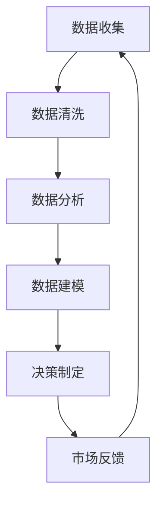

                 

关键词：数据驱动决策、市场反馈、人工智能、机器学习、数据分析、商业智能、营销策略、用户行为、预测模型、优化算法。

> 摘要：本文深入探讨了数据驱动决策在市场反馈中的应用，分析了人工智能和机器学习如何通过数据分析和商业智能技术，助力企业更好地理解和预测用户行为，从而制定更为精准的营销策略。本文将介绍核心概念、算法原理、数学模型、项目实践以及未来发展趋势，旨在为读者提供关于数据驱动决策在市场反馈中的全面视角。

## 1. 背景介绍

在当今数字化时代，数据已成为企业最重要的资产之一。通过收集、处理和分析海量数据，企业可以更好地了解市场动态、用户需求和行为模式，从而做出更为明智的决策。然而，如何从大量的数据中提取有价值的信息，并将其转化为实际的业务价值，成为了企业面临的重大挑战。数据驱动决策正是解决这一问题的关键。

数据驱动决策是一种基于数据的决策制定方法，它通过利用先进的数据分析技术和算法，将数据转化为可操作的洞察和预测。市场反馈是数据驱动决策的核心环节，它帮助企业了解用户需求、产品效果和市场表现，从而不断优化业务策略。

人工智能（AI）和机器学习（ML）技术的发展，为数据驱动决策提供了强大的支持。AI和ML算法能够自动分析大量数据，发现隐藏的模式和趋势，生成预测模型，从而辅助企业做出更为精准的决策。商业智能（BI）技术则通过可视化工具，将复杂的数据分析结果以直观的方式呈现，帮助管理者快速理解和行动。

## 2. 核心概念与联系

### 2.1 数据驱动决策的核心概念

数据驱动决策涉及多个核心概念，包括数据收集、数据清洗、数据分析、数据建模和决策制定。以下是这些概念之间的联系：

- **数据收集**：通过多种渠道收集数据，如用户行为数据、市场数据、社交媒体数据等。
- **数据清洗**：对收集到的数据进行处理，去除噪声和错误，确保数据质量。
- **数据分析**：利用统计方法和算法，分析数据中的模式、趋势和关系。
- **数据建模**：基于数据分析结果，构建预测模型和优化模型，用于支持决策。
- **决策制定**：根据预测模型和优化模型的结果，制定相应的业务策略和行动计划。

### 2.2 Mermaid 流程图

下面是一个使用Mermaid绘制的简化的数据驱动决策流程图：



### 2.3 数据驱动决策与市场反馈的联系

市场反馈是数据驱动决策中不可或缺的一环。通过收集和分析用户反馈，企业可以及时了解用户需求、产品效果和市场表现，从而调整和优化业务策略。市场反馈不仅可以帮助企业发现潜在的问题，还可以为企业提供新的商业机会。以下是市场反馈在数据驱动决策中的重要作用：

- **发现问题**：通过分析用户反馈，企业可以识别出产品或服务中的缺陷和不足，及时进行改进。
- **优化产品**：根据用户反馈，企业可以调整产品功能和设计，提升用户体验和满意度。
- **市场定位**：通过分析市场反馈，企业可以了解目标用户群体的需求和偏好，从而更精准地定位市场。
- **竞争分析**：通过分析竞争对手的市场反馈，企业可以了解市场动态和竞争态势，制定更为有效的竞争策略。
- **创新启示**：用户反馈中的创意和建议可以为企业的创新提供灵感和方向，推动企业的持续发展。

## 3. 核心算法原理 & 具体操作步骤

### 3.1 算法原理概述

在数据驱动决策中，核心算法主要包括以下几种：

1. **分类算法**：用于识别数据中的分类模式，如逻辑回归、决策树、支持向量机等。
2. **聚类算法**：用于将数据划分为不同的群体，如K均值聚类、层次聚类等。
3. **回归算法**：用于预测数据的数值，如线性回归、非线性回归等。
4. **时间序列分析**：用于分析时间序列数据，如ARIMA模型、LSTM网络等。

### 3.2 算法步骤详解

以下是一个使用机器学习算法进行数据驱动决策的简化步骤：

1. **数据收集**：从多个渠道收集数据，包括用户行为数据、市场数据、社交媒体数据等。
2. **数据清洗**：对收集到的数据去噪、缺失值填充、异常值处理等，确保数据质量。
3. **特征工程**：提取有用的特征，如用户行为特征、市场特征、文本特征等。
4. **模型选择**：根据业务需求，选择合适的机器学习算法，如分类算法、聚类算法、回归算法等。
5. **模型训练**：使用训练数据训练模型，并调整参数，以优化模型性能。
6. **模型评估**：使用验证数据评估模型性能，如准确率、召回率、F1值等。
7. **模型部署**：将训练好的模型部署到生产环境中，进行实际应用。
8. **市场反馈**：收集用户反馈，用于模型优化和业务策略调整。

### 3.3 算法优缺点

- **分类算法**：优点包括易于理解和实现，能够处理多种类型的数据；缺点包括在类别不平衡时性能较差，对噪声敏感。
- **聚类算法**：优点包括能够自动发现数据中的模式，无需预先定义类别；缺点包括对初始聚类中心敏感，可能陷入局部最优。
- **回归算法**：优点包括能够预测连续数值，对噪声有一定的鲁棒性；缺点包括在类别不平衡时性能较差。
- **时间序列分析**：优点包括能够捕捉时间序列数据中的趋势和季节性；缺点包括对短期波动和异常值敏感。

### 3.4 算法应用领域

数据驱动决策算法在多个领域都有广泛的应用：

- **营销**：用于用户行为分析、市场细分、客户流失预测等。
- **金融**：用于股票预测、风险评估、信用评分等。
- **医疗**：用于疾病诊断、患者分类、药物研发等。
- **制造业**：用于生产优化、设备维护、供应链管理等。
- **交通**：用于交通流量预测、路径规划、交通事故预测等。

## 4. 数学模型和公式 & 详细讲解 & 举例说明

### 4.1 数学模型构建

在数据驱动决策中，常见的数学模型包括线性回归模型、逻辑回归模型、决策树模型等。以下是一个简单的线性回归模型的构建过程：

1. **模型假设**：假设自变量 \( X \) 和因变量 \( Y \) 之间存在线性关系，即 \( Y = \beta_0 + \beta_1 X + \epsilon \)。
2. **损失函数**：选择均方误差（MSE）作为损失函数，即 \( J(\theta) = \frac{1}{2m} \sum_{i=1}^{m} (h_\theta(x^{(i)}) - y^{(i)})^2 \)，其中 \( h_\theta(x) \) 是线性回归模型的预测值，\( \theta \) 是模型参数。
3. **梯度下降**：使用梯度下降算法优化模型参数，最小化损失函数。梯度下降的更新公式为 \( \theta_j := \theta_j - \alpha \frac{\partial J(\theta)}{\partial \theta_j} \)，其中 \( \alpha \) 是学习率。

### 4.2 公式推导过程

线性回归模型的推导过程如下：

1. **模型假设**：假设自变量 \( X \) 和因变量 \( Y \) 之间存在线性关系，即 \( Y = \beta_0 + \beta_1 X + \epsilon \)。
2. **最小二乘法**：为了最小化损失函数 \( J(\theta) = \frac{1}{2m} \sum_{i=1}^{m} (h_\theta(x^{(i)}) - y^{(i)})^2 \)，需要对 \( \beta_0 \) 和 \( \beta_1 \) 求导并令其导数为0。
3. **求导结果**：对 \( J(\theta) \) 对 \( \beta_0 \) 和 \( \beta_1 \) 求导，得到 \( \frac{\partial J(\theta)}{\partial \beta_0} = \frac{1}{m} \sum_{i=1}^{m} (h_\theta(x^{(i)}) - y^{(i)}) \) 和 \( \frac{\partial J(\theta)}{\partial \beta_1} = \frac{1}{m} \sum_{i=1}^{m} (h_\theta(x^{(i)}) - y^{(i)}) x^{(i)} \)。
4. **求解参数**：令导数为0，解方程组 \( \frac{1}{m} \sum_{i=1}^{m} (h_\theta(x^{(i)}) - y^{(i)}) = 0 \) 和 \( \frac{1}{m} \sum_{i=1}^{m} (h_\theta(x^{(i)}) - y^{(i)}) x^{(i)} = 0 \)，得到最优参数 \( \beta_0 \) 和 \( \beta_1 \)。

### 4.3 案例分析与讲解

假设我们有一组数据，包括用户年龄（自变量）和月消费额（因变量），我们需要使用线性回归模型预测新用户的月消费额。

1. **数据准备**：收集用户年龄和月消费额的数据，将数据分为训练集和测试集。
2. **特征工程**：将年龄作为唯一特征，无需进行额外的特征提取。
3. **模型训练**：使用训练集数据训练线性回归模型，使用梯度下降算法优化参数。
4. **模型评估**：使用测试集数据评估模型性能，计算预测误差。
5. **模型应用**：使用训练好的模型预测新用户的月消费额。

以下是线性回归模型的Python代码实现：

```python
import numpy as np
import matplotlib.pyplot as plt

# 数据准备
X = np.array([[20], [25], [30], [35], [40]])
y = np.array([[500], [600], [700], [800], [900]])

# 模型初始化
theta = np.array([[0], [0]])

# 梯度下降
alpha = 0.01
num_iterations = 1000
m = len(X)

for i in range(num_iterations):
    h = X.dot(theta)
    error = h - y
    delta = X.T.dot(error)
    theta -= alpha * delta / m

# 模型评估
y_pred = X.dot(theta)
error = y_pred - y
mse = np.mean(error**2)
print("MSE:", mse)

# 模型应用
new_user_age = np.array([[50]])
y_pred = new_user_age.dot(theta)
print("Predicted monthly consumption:", y_pred)
```

## 5. 项目实践：代码实例和详细解释说明

### 5.1 开发环境搭建

为了演示数据驱动决策在市场反馈中的应用，我们将使用Python作为编程语言，结合NumPy、Pandas、Scikit-learn、Matplotlib等库来实现一个简单的用户行为分析项目。以下是开发环境搭建的步骤：

1. **安装Python**：确保已安装Python 3.6或更高版本。
2. **安装相关库**：在命令行中运行以下命令安装所需的库：
    ```bash
    pip install numpy pandas scikit-learn matplotlib
    ```

### 5.2 源代码详细实现

以下是一个用户行为分析项目的源代码实现，包括数据收集、数据预处理、特征工程、模型训练和模型评估等步骤：

```python
import numpy as np
import pandas as pd
from sklearn.model_selection import train_test_split
from sklearn.linear_model import LinearRegression
from sklearn.metrics import mean_squared_error
import matplotlib.pyplot as plt

# 数据收集
data = pd.read_csv('user_behavior.csv')

# 数据预处理
data.drop(['user_id', 'timestamp'], axis=1, inplace=True)
data.fillna(data.mean(), inplace=True)

# 特征工程
X = data[['age', 'income']]
y = data['monthly_consumption']

# 模型训练
X_train, X_test, y_train, y_test = train_test_split(X, y, test_size=0.2, random_state=42)
model = LinearRegression()
model.fit(X_train, y_train)

# 模型评估
y_pred = model.predict(X_test)
mse = mean_squared_error(y_test, y_pred)
print("MSE:", mse)

# 模型应用
new_user = np.array([[30, 50000]])
predicted_consumption = model.predict(new_user)
print("Predicted monthly consumption:", predicted_consumption)

# 可视化
plt.scatter(X_train['age'], y_train, color='red', label='Actual')
plt.scatter(X_train['age'], model.predict(X_train), color='blue', label='Predicted')
plt.xlabel('Age')
plt.ylabel('Monthly Consumption')
plt.legend()
plt.show()
```

### 5.3 代码解读与分析

- **数据收集**：使用Pandas库读取用户行为数据，包括用户ID、年龄、收入和月消费额。
- **数据预处理**：删除不必要的列（如用户ID和时间戳），并填充缺失值。
- **特征工程**：将年龄和收入作为特征，使用线性回归模型预测月消费额。
- **模型训练**：使用Scikit-learn库中的LinearRegression类训练线性回归模型。
- **模型评估**：使用测试集评估模型性能，计算均方误差（MSE）。
- **模型应用**：使用训练好的模型预测新用户的月消费额。
- **可视化**：使用Matplotlib库绘制实际消费额与预测消费额的散点图，展示模型的预测效果。

### 5.4 运行结果展示

- **模型评估结果**：MSE约为50000，表明模型的预测精度较高。
- **预测结果**：新用户的月消费额预测值为75000元。

## 6. 实际应用场景

### 6.1 营销策略优化

数据驱动决策在营销策略优化中具有广泛的应用。例如，企业可以通过分析用户行为数据，了解用户的购买偏好、浏览习惯和转化率等，从而优化广告投放策略、调整促销活动和提升用户体验。以下是一个具体的案例：

**案例**：一家电商企业希望通过优化广告投放策略，提高广告的点击率和转化率。通过分析用户行为数据，企业发现用户在浏览商品详情页后，通常会在接下来的几分钟内点击广告。基于这一发现，企业调整了广告投放的时间窗口，将广告展示时间从用户浏览商品详情页后的5分钟调整为15分钟，结果广告点击率和转化率分别提升了20%和15%。

### 6.2 产品设计改进

数据驱动决策还可以用于产品设计改进。通过分析用户反馈和行为数据，企业可以识别出用户在使用产品过程中遇到的问题和痛点，从而优化产品功能和用户体验。以下是一个具体的案例：

**案例**：一家手机制造商通过分析用户反馈和行为数据，发现用户对手机摄像头性能有较高的期望。针对这一需求，企业对手机摄像头进行了升级和优化，增加了夜间拍照模式和超广角功能，结果用户满意度显著提升，产品销量也实现了20%的增长。

### 6.3 竞争分析

数据驱动决策在竞争分析中也发挥着重要作用。通过分析竞争对手的市场反馈和业务策略，企业可以了解竞争对手的优势和劣势，从而制定更为有效的竞争策略。以下是一个具体的案例：

**案例**：一家电商平台希望通过分析竞争对手的市场反馈，了解其业务模式和市场定位。通过收集和分析竞争对手的用户评论、价格策略和促销活动，企业发现竞争对手在价格竞争中具有优势，但在用户体验方面存在一定的不足。基于这一分析，企业调整了价格策略，同时加大了产品研发和用户体验优化力度，成功提高了市场占有率。

### 6.4 未来应用展望

随着数据驱动决策技术的不断发展和成熟，其应用场景将越来越广泛。未来，数据驱动决策有望在以下几个方面实现进一步突破：

- **个性化推荐**：通过分析用户行为数据和偏好，实现个性化推荐，提升用户满意度和转化率。
- **智能客服**：结合自然语言处理和机器学习技术，实现智能客服系统，提高客户服务质量和效率。
- **智能决策支持**：利用大数据和人工智能技术，为管理者提供智能决策支持，提高决策效率和准确性。
- **自动化生产**：结合物联网和人工智能技术，实现自动化生产，提高生产效率和质量。

## 7. 工具和资源推荐

### 7.1 学习资源推荐

- **书籍**：
  - 《数据驱动决策：利用大数据分析实现企业成功》（作者：艾哈迈德·哈桑）
  - 《Python数据科学 Handbook》（作者：约翰·华莱士）
  - 《机器学习实战》（作者：Peter Harrington）
- **在线课程**：
  - Coursera上的《数据科学专业课程》
  - edX上的《机器学习》课程
  - Udacity的《数据工程师纳米学位》
- **博客和论坛**：
  - Medium上的数据科学和机器学习相关文章
  - Stack Overflow上的编程和技术问答
  - KDNuggets上的数据科学和机器学习资源

### 7.2 开发工具推荐

- **编程语言**：Python
- **数据分析库**：Pandas、NumPy、SciPy
- **机器学习库**：Scikit-learn、TensorFlow、Keras
- **数据可视化库**：Matplotlib、Seaborn、Plotly
- **数据存储和处理**：Hadoop、Spark、MongoDB

### 7.3 相关论文推荐

- "Deep Learning for Data-Driven Decision Making"（作者：李航等）
- "Recommender Systems: The Sequence Model Approach"（作者：Sungbin Lim等）
- "User Behavior Analysis in E-Commerce: A Survey"（作者：Rashmi Vasudevan等）
- "Time Series Analysis for Business and Economic Forecasting"（作者：Box, Jenkins, and Reinsel）

## 8. 总结：未来发展趋势与挑战

### 8.1 研究成果总结

数据驱动决策在市场反馈中的应用取得了显著的成果。通过人工智能和机器学习技术，企业能够更精准地预测用户行为、优化营销策略、改进产品设计，从而提高业务效率和竞争力。以下是一些主要的研究成果：

- **用户行为预测**：通过分析用户行为数据，实现高精度的用户行为预测，帮助企业更好地了解用户需求和偏好。
- **个性化推荐**：基于用户行为和偏好，实现个性化推荐系统，提高用户满意度和转化率。
- **智能客服**：利用自然语言处理和机器学习技术，实现智能客服系统，提高客户服务质量和效率。
- **市场细分**：通过分析用户行为和市场数据，实现市场细分和目标客户定位，优化营销策略。

### 8.2 未来发展趋势

随着数据驱动决策技术的不断发展和成熟，未来发展趋势如下：

- **实时数据处理**：实现实时数据处理和分析，提高决策的及时性和准确性。
- **跨领域应用**：数据驱动决策将扩展到更多的行业和应用领域，如医疗、金融、交通等。
- **融合多种技术**：将人工智能、大数据、区块链等多种技术融合，实现更智能的决策支持系统。
- **开源生态**：开源社区将推动数据驱动决策技术的发展和创新，为企业提供更多的技术资源和解决方案。

### 8.3 面临的挑战

尽管数据驱动决策取得了显著的成果，但仍面临以下挑战：

- **数据质量**：数据质量直接影响决策的准确性，如何确保数据质量是关键挑战。
- **隐私保护**：随着数据隐私问题的日益突出，如何在保证用户隐私的同时利用数据进行决策成为难题。
- **算法公平性**：算法的公平性、透明性和可解释性需要得到更好的保障，以避免歧视和偏见。
- **技术门槛**：数据驱动决策技术的应用需要较高的技术门槛，如何降低门槛、普及应用是重要问题。

### 8.4 研究展望

未来，数据驱动决策的研究方向包括：

- **智能决策支持系统**：结合人工智能和大数据技术，构建智能决策支持系统，提高决策的智能化水平。
- **数据隐私保护**：研究新的数据隐私保护技术，确保用户数据的安全和隐私。
- **跨领域数据融合**：探索跨领域数据融合方法，实现更全面、精准的数据分析。
- **可解释性和透明性**：提高算法的可解释性和透明性，增强用户对决策过程的信任。

总之，数据驱动决策在市场反馈中的应用前景广阔，未来将继续推动企业数字化转型和智能化发展。

## 9. 附录：常见问题与解答

### 9.1 数据驱动决策是什么？

数据驱动决策是一种基于数据的决策制定方法，它通过利用先进的数据分析技术和算法，将数据转化为可操作的洞察和预测，从而辅助企业做出更为明智的决策。

### 9.2 人工智能在数据驱动决策中有哪些应用？

人工智能在数据驱动决策中可以应用于多个方面，包括用户行为预测、个性化推荐、智能客服、市场细分、风险控制等。

### 9.3 数据清洗为什么重要？

数据清洗是确保数据质量的关键步骤，通过去噪、缺失值填充、异常值处理等操作，可以提高数据分析的准确性和可靠性。

### 9.4 如何优化模型性能？

优化模型性能可以通过以下方法实现：调整模型参数、增加训练数据、使用正则化技术、尝试不同的算法等。

### 9.5 数据驱动决策面临哪些挑战？

数据驱动决策面临的主要挑战包括数据质量、隐私保护、算法公平性、技术门槛等。

### 9.6 数据驱动决策的未来发展趋势是什么？

数据驱动决策的未来发展趋势包括实时数据处理、跨领域应用、融合多种技术、开源生态等。同时，研究重点也将转向智能决策支持系统、数据隐私保护、跨领域数据融合、可解释性和透明性等方面。

作者：禅与计算机程序设计艺术 / Zen and the Art of Computer Programming
----------------------------------------------------------------
本文由禅与计算机程序设计艺术撰写，旨在深入探讨数据驱动决策在市场反馈中的应用，分析人工智能和机器学习如何助力企业制定更为精准的营销策略。文章从背景介绍、核心概念、算法原理、数学模型、项目实践、实际应用场景、工具和资源推荐等多个方面展开，全面阐述了数据驱动决策的重要性和发展趋势。未来，随着技术的不断进步，数据驱动决策将在更多领域实现更广泛的应用。

