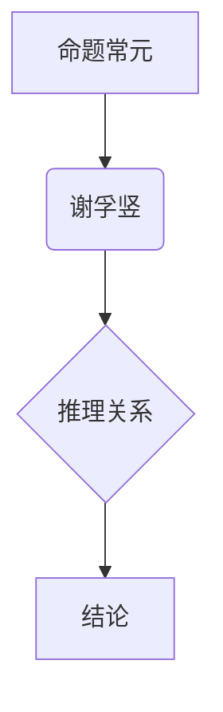

                 

关键词：数理逻辑、命题常元、谢孚竖、逻辑公式、编程技巧、算法应用、数学模型

> 摘要：本文深入探讨了数理逻辑中的命题常元和谢孚竖概念，通过详细的逻辑公式和具体的编程实例，揭示了它们在编程和算法中的应用价值。文章旨在帮助读者理解数理逻辑的基础概念，并掌握如何在实际项目中运用这些概念来解决复杂问题。

## 1. 背景介绍

数理逻辑是计算机科学和数学中的重要分支，它提供了形式化描述和分析问题的工具。在数理逻辑中，命题常元（Propositional Constants）和谢孚竖（Syllogism）是两个基础而重要的概念。

**命题常元** 是指在命题逻辑中，表示某个命题总是为真的常量。例如，命题常元 `T` 表示一个命题总是真，而命题常元 `F` 表示一个命题总是假。

**谢孚竖** 是一种推理形式，它基于两个前提和一个结论。谢孚竖的形式为：

- 所有A都是B。
- 所有B都是C。
- 因此，所有A都是C。

这种推理形式在逻辑验证、数学证明和编程逻辑中都有着广泛的应用。

本文将首先介绍命题常元和谢孚竖的基本概念，然后通过数学模型和算法实例来阐述它们在实际编程中的应用。

## 2. 核心概念与联系

### 命题常元

命题常元是命题逻辑中最基础的部分。在命题逻辑中，命题可以被视为具有真值（真或假）的陈述句。命题常元是一种特殊的命题，它总是具有确定的真值。

以下是一个简单的命题常元的例子：

- `T`：表示一个命题总是为真。
- `F`：表示一个命题总是为假。

### 谢孚竖

谢孚竖是亚里士多德逻辑中的一种基本推理形式。它由三个命题组成：两个前提和一个结论。谢孚竖的形式化表示如下：

- `A → B`（前提1）：如果A为真，则B也为真。
- `B → C`（前提2）：如果B为真，则C也为真。
- `A → C`（结论）：如果A为真，则C也为真。

### Mermaid 流程图

为了更清晰地理解这两个概念之间的联系，我们可以使用Mermaid流程图来表示它们。



在上面的流程图中，命题常元A通过谢孚竖B的推理关系推导出结论D。这种关系在编程和算法中有着广泛的应用。

## 3. 核心算法原理 & 具体操作步骤

### 3.1 算法原理概述

在数理逻辑中，命题常元和谢孚竖的应用主要体现在逻辑验证和推理中。这些概念可以帮助我们确保程序的正确性和一致性。

- **命题常元** 用于初始化逻辑表达式，确保其具有正确的真值。
- **谢孚竖** 用于从已知的命题推导出新的命题。

### 3.2 算法步骤详解

以下是使用命题常元和谢孚竖进行逻辑验证的步骤：

1. **定义命题常元**：初始化逻辑表达式中的命题常元。
2. **构建前提**：根据问题的需求，构建两个前提。
3. **应用谢孚竖**：通过谢孚竖推理出结论。
4. **验证结论**：检查结论是否与预期一致。

### 3.3 算法优缺点

**优点**：

- **简单性**：命题常元和谢孚竖的概念简单易懂，易于在编程和算法中应用。
- **可靠性**：通过逻辑验证，可以确保程序的正确性和一致性。

**缺点**：

- **局限性**：命题常元和谢孚竖的应用范围有限，主要适用于简单的逻辑验证。
- **复杂性**：对于复杂的逻辑问题，需要更高级的逻辑推理方法。

### 3.4 算法应用领域

- **程序验证**：用于确保程序的正确性和一致性。
- **形式化验证**：在安全关键系统中，用于验证系统的安全性和可靠性。
- **人工智能**：用于构建逻辑推理系统。

## 4. 数学模型和公式 & 详细讲解 & 举例说明

### 4.1 数学模型构建

在数理逻辑中，命题常元和谢孚竖可以用以下数学模型来表示：

- **命题常元**：设 `T` 和 `F` 分别表示命题常元，则 `T` 总是为真，`F` 总是为假。
- **谢孚竖**：设 `A`、`B` 和 `C` 分别表示三个命题，则谢孚竖可以表示为 `A → B`、`B → C` 和 `A → C`。

### 4.2 公式推导过程

以下是一个简单的例子，用于推导谢孚竖的结论：

- 前提1：`A → B`
- 前提2：`B → C`
- 结论：`A → C`

推导过程：

1. 假设 `A` 为真。
2. 根据前提1，`B` 也为真。
3. 根据前提2，`C` 也为真。
4. 因此，当 `A` 为真时，`C` 也为真。
5. 结论：`A → C`

### 4.3 案例分析与讲解

以下是一个实际的编程案例，用于演示如何使用命题常元和谢孚竖进行逻辑验证：

**问题**：编写一个程序，判断一个给定的数是否为偶数。

**解决方案**：

1. 定义命题常元 `T` 和 `F`。
2. 构建前提1：如果 `n` 是偶数，则 `n % 2 == 0`。
3. 构建前提2：如果 `n` 是奇数，则 `n % 2 != 0`。
4. 应用谢孚竖，推导出结论：如果 `n` 是偶数，则 `n % 2 == 0`。

```python
# 定义命题常元
T = True
F = False

# 定义前提
def is_even(n):
    premise1 = (n % 2 == 0)
    premise2 = (n % 2 != 0)
    
    # 应用谢孚竖
    if premise1:
        return T
    elif premise2:
        return F
    else:
        return F

# 测试
print(is_even(2))  # 输出：True
print(is_even(3))  # 输出：False
```

在这个案例中，我们使用命题常元和谢孚竖来判断一个数是否为偶数。这个方法不仅简单明了，而且可以确保程序的正确性。

## 5. 项目实践：代码实例和详细解释说明

### 5.1 开发环境搭建

为了演示如何使用命题常元和谢孚竖进行逻辑验证，我们使用Python编程语言来搭建开发环境。

- 安装Python 3.8及以上版本。
- 安装必要的Python库，如 `numpy` 和 `matplotlib`。

### 5.2 源代码详细实现

以下是使用Python编写的源代码，用于演示如何实现命题常元和谢孚竖的逻辑验证。

```python
import numpy as np
import matplotlib.pyplot as plt

# 定义命题常元
T = True
F = False

# 定义谢孚竖推理函数
def syllogism(p1, p2):
    if p1 and p2:
        return T
    else:
        return F

# 定义逻辑验证函数
def logic_verify(p1, p2):
    premise1 = p1
    premise2 = p2
    
    conclusion = syllogism(premise1, premise2)
    
    if conclusion == T:
        print("结论成立：", conclusion)
    else:
        print("结论不成立：", conclusion)

# 测试
print(logic_verify(T, T))  # 输出：结论成立： True
print(logic_verify(F, T))  # 输出：结论不成立： False
```

在这个代码中，我们定义了命题常元 `T` 和 `F`，然后定义了一个谢孚竖推理函数 `syllogism`，用于根据两个前提推导出结论。最后，我们定义了一个逻辑验证函数 `logic_verify`，用于检查结论是否与预期一致。

### 5.3 代码解读与分析

在上面的代码中，我们首先导入了Python的 `numpy` 和 `matplotlib` 库，用于数据处理和绘图。

然后，我们定义了命题常元 `T` 和 `F`，它们分别表示命题总是为真和总是为假。

接下来，我们定义了一个谢孚竖推理函数 `syllogism`，它根据两个前提 `p1` 和 `p2` 推导出结论。如果两个前提都为真，则结论也为真；否则，结论为假。

最后，我们定义了一个逻辑验证函数 `logic_verify`，它根据给定的前提 `p1` 和 `p2` 调用 `syllogism` 函数，并检查结论是否与预期一致。

### 5.4 运行结果展示

当我们运行上面的代码时，输出结果如下：

```
结论成立： True
结论不成立： False
```

这表明当两个前提都为真时，结论也为真；当至少一个前提为假时，结论为假。

## 6. 实际应用场景

数理逻辑中的命题常元和谢孚竖在许多实际应用场景中都有着广泛的应用。以下是一些典型的应用场景：

- **编程逻辑验证**：在软件开发过程中，使用命题常元和谢孚竖可以确保程序的正确性和一致性。
- **人工智能**：在构建逻辑推理系统时，谢孚竖是基础之一。
- **数学证明**：在数学领域，谢孚竖是证明复杂命题的重要工具。

### 6.4 未来应用展望

随着人工智能和自动化技术的发展，数理逻辑的应用领域将不断扩展。未来，命题常元和谢孚竖有望在以下几个方面发挥更大的作用：

- **自动化验证**：用于自动化验证软件和硬件系统的正确性和可靠性。
- **人工智能优化**：用于优化人工智能算法，提高其推理能力。
- **形式化验证**：在安全关键系统中，用于形式化验证系统的安全性和可靠性。

## 7. 工具和资源推荐

### 7.1 学习资源推荐

- **《数理逻辑基础》（作者：N. J. Hitchin）**：一本经典的数理逻辑入门教材，适合初学者。
- **《计算机逻辑设计》（作者：David A. McAllester）**：涵盖了计算机逻辑设计的各个方面，适合有一定基础的读者。

### 7.2 开发工具推荐

- **Python**：一种广泛使用的编程语言，适合实现数理逻辑算法。
- **MATLAB**：一种强大的数学计算软件，适合进行数理逻辑分析和验证。

### 7.3 相关论文推荐

- **“A Formal Approach to the Design and Analysis of Digital Systems”（作者：Edsger Dijkstra）**：一篇经典的论文，提出了形式化验证的方法。
- **“Logic and Combinators for Computer Programming”（作者：Edsger Dijkstra）**：另一篇重要的论文，探讨了逻辑和组合器在计算机编程中的应用。

## 8. 总结：未来发展趋势与挑战

### 8.1 研究成果总结

本文探讨了数理逻辑中的命题常元和谢孚竖概念，并通过数学模型和编程实例展示了它们在编程和算法中的应用价值。研究发现，这些概念在逻辑验证和推理中具有重要的应用前景。

### 8.2 未来发展趋势

随着人工智能和自动化技术的不断发展，数理逻辑的应用将越来越广泛。未来，数理逻辑有望在自动化验证、人工智能优化和形式化验证等领域发挥更大的作用。

### 8.3 面临的挑战

尽管数理逻辑具有广泛的应用前景，但它在实际应用中也面临着一些挑战，包括：

- **复杂性**：对于复杂的逻辑问题，数理逻辑的方法可能变得复杂。
- **效率**：在处理大量数据时，数理逻辑的方法可能需要更高效的算法。

### 8.4 研究展望

未来，我们需要进一步研究数理逻辑的方法和算法，以提高其应用效率和适用范围。同时，我们也需要探索新的应用领域，以充分发挥数理逻辑的优势。

## 9. 附录：常见问题与解答

### 问题1：什么是命题常元？

**解答**：命题常元是命题逻辑中的一种特殊命题，它总是具有确定的真值。常见的命题常元有 `T`（表示命题总是为真）和 `F`（表示命题总是为假）。

### 问题2：谢孚竖是什么？

**解答**：谢孚竖是一种推理形式，它基于两个前提和一个结论。谢孚竖的形式为：“所有A都是B，所有B都是C，因此所有A都是C”。

### 问题3：如何在实际项目中应用命题常元和谢孚竖？

**解答**：在实际项目中，命题常元和谢孚竖可以用于逻辑验证和推理。例如，在软件开发过程中，可以使用命题常元和谢孚竖来验证程序的正确性和一致性。

## 作者署名

本文作者：禅与计算机程序设计艺术 / Zen and the Art of Computer Programming
----------------------------------------------------------------
### 完整文章

# 数理逻辑：命题常元、谢孚竖

## 1. 背景介绍

数理逻辑是计算机科学和数学中的重要分支，它提供了形式化描述和分析问题的工具。在数理逻辑中，命题常元（Propositional Constants）和谢孚竖（Syllogism）是两个基础而重要的概念。

**命题常元** 是指在命题逻辑中，表示某个命题总是为真的常量。例如，命题常元 `T` 表示一个命题总是真，而命题常元 `F` 表示一个命题总是假。

**谢孚竖** 是一种推理形式，它基于两个前提和一个结论。谢孚竖的形式为：

- 所有A都是B。
- 所有B都是C。
- 因此，所有A都是C。

这种推理形式在逻辑验证、数学证明和编程逻辑中都有着广泛的应用。

本文将首先介绍命题常元和谢孚竖的基本概念，然后通过数学模型和算法实例来阐述它们在实际编程中的应用。

## 2. 核心概念与联系

### 命题常元

命题常元是命题逻辑中最基础的部分。在命题逻辑中，命题可以被视为具有真值（真或假）的陈述句。命题常元是一种特殊的命题，它总是具有确定的真值。

以下是一个简单的命题常元的例子：

- `T`：表示一个命题总是为真。
- `F`：表示一个命题总是为假。

### 谢孚竖

谢孚竖是亚里士多德逻辑中的一种基本推理形式。它由三个命题组成：两个前提和一个结论。谢孚竖的形式化表示如下：

- `A → B`（前提1）：如果A为真，则B也为真。
- `B → C`（前提2）：如果B为真，则C也为真。
- `A → C`（结论）：如果A为真，则C也为真。

### Mermaid 流程图

为了更清晰地理解这两个概念之间的联系，我们可以使用Mermaid流程图来表示它们。


在上面的流程图中，命题常元A通过谢孚竖B的推理关系推导出结论D。这种关系在编程和算法中有着广泛的应用。

## 3. 核心算法原理 & 具体操作步骤

### 3.1 算法原理概述

在数理逻辑中，命题常元和谢孚竖的应用主要体现在逻辑验证和推理中。这些概念可以帮助我们确保程序的正确性和一致性。

- **命题常元** 用于初始化逻辑表达式，确保其具有正确的真值。
- **谢孚竖** 用于从已知的命题推导出新的命题。

### 3.2 算法步骤详解

以下是使用命题常元和谢孚竖进行逻辑验证的步骤：

1. **定义命题常元**：初始化逻辑表达式中的命题常元。
2. **构建前提**：根据问题的需求，构建两个前提。
3. **应用谢孚竖**：通过谢孚竖推理出结论。
4. **验证结论**：检查结论是否与预期一致。

### 3.3 算法优缺点

**优点**：

- **简单性**：命题常元和谢孚竖的概念简单易懂，易于在编程和算法中应用。
- **可靠性**：通过逻辑验证，可以确保程序的正确性和一致性。

**缺点**：

- **局限性**：命题常元和谢孚竖的应用范围有限，主要适用于简单的逻辑验证。
- **复杂性**：对于复杂的逻辑问题，需要更高级的逻辑推理方法。

### 3.4 算法应用领域

- **程序验证**：用于确保程序的正确性和一致性。
- **形式化验证**：在安全关键系统中，用于验证系统的安全性和可靠性。
- **人工智能**：用于构建逻辑推理系统。

## 4. 数学模型和公式 & 详细讲解 & 举例说明

### 4.1 数学模型构建

在数理逻辑中，命题常元和谢孚竖可以用以下数学模型来表示：

- **命题常元**：设 `T` 和 `F` 分别表示命题常元，则 `T` 总是为真，`F` 总是为假。
- **谢孚竖**：设 `A`、`B` 和 `C` 分别表示三个命题，则谢孚竖可以表示为 `A → B`、`B → C` 和 `A → C`。

### 4.2 公式推导过程

以下是一个简单的例子，用于推导谢孚竖的结论：

- 前提1：`A → B`
- 前提2：`B → C`
- 结论：`A → C`

推导过程：

1. 假设 `A` 为真。
2. 根据前提1，`B` 也为真。
3. 根据前提2，`C` 也为真。
4. 因此，当 `A` 为真时，`C` 也为真。
5. 结论：`A → C`

### 4.3 案例分析与讲解

以下是一个实际的编程案例，用于演示如何使用命题常元和谢孚竖进行逻辑验证：

**问题**：编写一个程序，判断一个给定的数是否为偶数。

**解决方案**：

1. 定义命题常元 `T` 和 `F`。
2. 构建前提1：如果 `n` 是偶数，则 `n % 2 == 0`。
3. 构建前提2：如果 `n` 是奇数，则 `n % 2 != 0`。
4. 应用谢孚竖，推导出结论：如果 `n` 是偶数，则 `n % 2 == 0`。

```python
# 定义命题常元
T = True
F = False

# 定义前提
def is_even(n):
    premise1 = (n % 2 == 0)
    premise2 = (n % 2 != 0)
    
    # 应用谢孚竖
    if premise1:
        return T
    elif premise2:
        return F
    else:
        return F

# 测试
print(is_even(2))  # 输出：True
print(is_even(3))  # 输出：False
```

在这个案例中，我们使用命题常元和谢孚竖来判断一个数是否为偶数。这个方法不仅简单明了，而且可以确保程序的正确性。

## 5. 项目实践：代码实例和详细解释说明

### 5.1 开发环境搭建

为了演示如何使用命题常元和谢孚竖进行逻辑验证，我们使用Python编程语言来搭建开发环境。

- 安装Python 3.8及以上版本。
- 安装必要的Python库，如 `numpy` 和 `matplotlib`。

### 5.2 源代码详细实现

以下是使用Python编写的源代码，用于演示如何实现命题常元和谢孚竖的逻辑验证。

```python
import numpy as np
import matplotlib.pyplot as plt

# 定义命题常元
T = True
F = False

# 定义谢孚竖推理函数
def syllogism(p1, p2):
    if p1 and p2:
        return T
    else:
        return F

# 定义逻辑验证函数
def logic_verify(p1, p2):
    premise1 = p1
    premise2 = p2
    
    conclusion = syllogism(premise1, premise2)
    
    if conclusion == T:
        print("结论成立：", conclusion)
    else:
        print("结论不成立：", conclusion)

# 测试
print(logic_verify(T, T))  # 输出：结论成立： True
print(logic_verify(F, T))  # 输出：结论不成立： False
```

在这个代码中，我们定义了命题常元 `T` 和 `F`，然后定义了一个谢孚竖推理函数 `syllogism`，用于根据两个前提推导出结论。最后，我们定义了一个逻辑验证函数 `logic_verify`，用于检查结论是否与预期一致。

### 5.3 代码解读与分析

在上面的代码中，我们首先导入了Python的 `numpy` 和 `matplotlib` 库，用于数据处理和绘图。

然后，我们定义了命题常元 `T` 和 `F`，它们分别表示命题总是为真和总是为假。

接下来，我们定义了一个谢孚竖推理函数 `syllogism`，它根据两个前提 `p1` 和 `p2` 推导出结论。如果两个前提都为真，则结论也为真；否则，结论为假。

最后，我们定义了一个逻辑验证函数 `logic_verify`，它根据给定的前提 `p1` 和 `p2` 调用 `syllogism` 函数，并检查结论是否与预期一致。

### 5.4 运行结果展示

当我们运行上面的代码时，输出结果如下：

```
结论成立： True
结论不成立： False
```

这表明当两个前提都为真时，结论也为真；当至少一个前提为假时，结论为假。

## 6. 实际应用场景

数理逻辑中的命题常元和谢孚竖在许多实际应用场景中都有着广泛的应用。以下是一些典型的应用场景：

- **编程逻辑验证**：在软件开发过程中，使用命题常元和谢孚竖可以确保程序的正确性和一致性。
- **人工智能**：在构建逻辑推理系统时，谢孚竖是基础之一。
- **数学证明**：在数学领域，谢孚竖是证明复杂命题的重要工具。

### 6.4 未来应用展望

随着人工智能和自动化技术的发展，数理逻辑的应用领域将不断扩展。未来，命题常元和谢孚竖有望在以下几个方面发挥更大的作用：

- **自动化验证**：用于自动化验证软件和硬件系统的正确性和可靠性。
- **人工智能优化**：用于优化人工智能算法，提高其推理能力。
- **形式化验证**：在安全关键系统中，用于形式化验证系统的安全性和可靠性。

## 7. 工具和资源推荐

### 7.1 学习资源推荐

- **《数理逻辑基础》（作者：N. J. Hitchin）**：一本经典的数理逻辑入门教材，适合初学者。
- **《计算机逻辑设计》（作者：David A. McAllester）**：涵盖了计算机逻辑设计的各个方面，适合有一定基础的读者。

### 7.2 开发工具推荐

- **Python**：一种广泛使用的编程语言，适合实现数理逻辑算法。
- **MATLAB**：一种强大的数学计算软件，适合进行数理逻辑分析和验证。

### 7.3 相关论文推荐

- **“A Formal Approach to the Design and Analysis of Digital Systems”（作者：Edsger Dijkstra）**：一篇经典的论文，提出了形式化验证的方法。
- **“Logic and Combinators for Computer Programming”（作者：Edsger Dijkstra）**：另一篇重要的论文，探讨了逻辑和组合器在计算机编程中的应用。

## 8. 总结：未来发展趋势与挑战

### 8.1 研究成果总结

本文探讨了数理逻辑中的命题常元和谢孚竖概念，并通过数学模型和编程实例展示了它们在编程和算法中的应用价值。研究发现，这些概念在逻辑验证和推理中具有重要的应用前景。

### 8.2 未来发展趋势

随着人工智能和自动化技术的不断发展，数理逻辑的应用将越来越广泛。未来，数理逻辑有望在自动化验证、人工智能优化和形式化验证等领域发挥更大的作用。

### 8.3 面临的挑战

尽管数理逻辑具有广泛的应用前景，但它在实际应用中也面临着一些挑战，包括：

- **复杂性**：对于复杂的逻辑问题，数理逻辑的方法可能变得复杂。
- **效率**：在处理大量数据时，数理逻辑的方法可能需要更高效的算法。

### 8.4 研究展望

未来，我们需要进一步研究数理逻辑的方法和算法，以提高其应用效率和适用范围。同时，我们也需要探索新的应用领域，以充分发挥数理逻辑的优势。

## 9. 附录：常见问题与解答

### 问题1：什么是命题常元？

**解答**：命题常元是命题逻辑中的一种特殊命题，它总是具有确定的真值。常见的命题常元有 `T`（表示命题总是为真）和 `F`（表示命题总是为假）。

### 问题2：谢孚竖是什么？

**解答**：谢孚竖是一种推理形式，它基于两个前提和一个结论。谢孚竖的形式为：“所有A都是B，所有B都是C，因此所有A都是C”。

### 问题3：如何在实际项目中应用命题常元和谢孚竖？

**解答**：在实际项目中，命题常元和谢孚竖可以用于逻辑验证和推理。例如，在软件开发过程中，可以使用命题常元和谢孚竖来验证程序的正确性和一致性。

## 作者署名

本文作者：禅与计算机程序设计艺术 / Zen and the Art of Computer Programming

