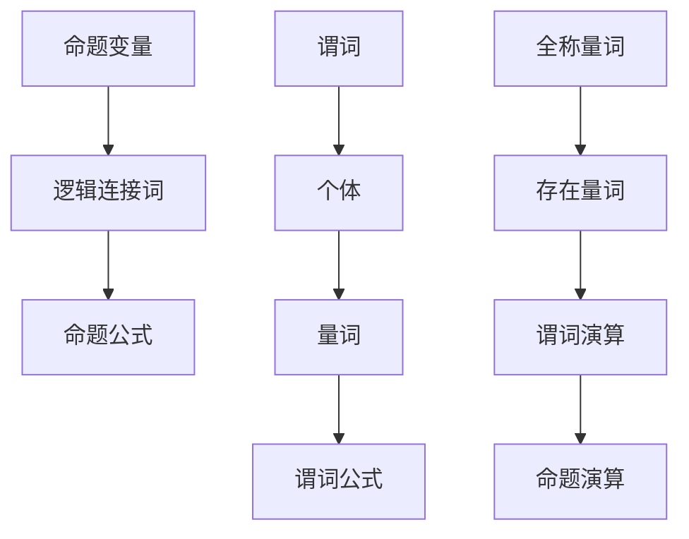

                 

关键词：数理逻辑、逻辑演算、归约、形式系统、命题演算、谓词演算

> 摘要：本文深入探讨了数理逻辑中逻辑演算的归约方法，通过解析命题演算和谓词演算的基本原理，详细介绍了如何将复杂的逻辑表达式简化为更易于理解和处理的归约形式。文章还涉及了数学模型和公式的推导过程，通过具体案例和代码实例，展示了逻辑演算归约的实际应用，为读者提供了全面的数理逻辑理解和实践指导。

## 1. 背景介绍

数理逻辑作为数学与计算机科学的基础，具有重要的理论价值和实际应用。在计算机科学中，数理逻辑的应用范围广泛，从算法设计、编程语言理论到形式验证、人工智能等领域均有涉及。逻辑演算作为数理逻辑的核心组成部分，旨在研究如何将复杂的逻辑表达式转化为更简洁的形式，从而提高逻辑推理的效率和可操作性。

逻辑演算的归约方法，是指在逻辑演算过程中，通过一定的规则和策略，将复杂的逻辑表达式逐步简化为更简单的形式，直至达到最简状态。这种归约方法不仅能够降低逻辑表达式的复杂度，提高计算效率，还有助于深入理解和掌握逻辑演算的基本原理。

本文将首先介绍数理逻辑的基本概念，包括命题演算和谓词演算，然后深入探讨逻辑演算的归约方法，包括归约规则、步骤以及优缺点。此外，文章还将结合实际应用场景，展示逻辑演算归约在计算机科学领域的具体应用，并为未来的研究和实践提供展望。

## 2. 核心概念与联系

### 2.1 命题演算

命题演算（Propositional Calculus）是数理逻辑的基础部分，主要研究命题（语句）之间的逻辑关系。在命题演算中，命题是基本元素，它要么是真的，要么是假的，没有其他可能的取值。命题演算的基本概念包括命题变量、逻辑连接词和命题公式。

- **命题变量**：代表命题的符号，通常用大写字母表示，如 \( P \)、\( Q \)、\( R \) 等。
- **逻辑连接词**：用来连接命题变量，形成复合命题，常用的逻辑连接词包括：
  - **合取**（AND）：用符号 \( \land \) 表示，表示两个命题同时为真。
  - **析取**（OR）：用符号 \( \lor \) 表示，表示两个命题中至少有一个为真。
  - **非**（NOT）：用符号 \( \lnot \) 表示，表示命题的真假取反。

- **命题公式**：由命题变量和逻辑连接词构成的式子，它可以表示复杂的逻辑关系。

### 2.2 谓词演算

谓词演算（Predicate Calculus）是命题演算的扩展，它引入了谓词、量词等概念，使得逻辑表达的能力大大增强。谓词演算不仅关注命题的真假，还关注命题之间的关系和结构。

- **谓词**：代表性质的符号，通常用大写字母表示，如 \( F(x) \)、\( G(y) \) 等。
- **个体**：谓词的取值对象，可以是具体的对象或抽象的概念。
- **量词**：用来表示全称量词（Universal Quantifier）和存在量词（Existential Quantifier），分别用符号 \( \forall \) 和 \( \exists \) 表示。

- **谓词公式**：由谓词、个体、量词等构成的式子，它可以表示更复杂的逻辑关系。

### 2.3 Mermaid 流程图

为了更好地理解命题演算和谓词演算的基本原理和架构，我们可以使用 Mermaid 流程图来表示它们的核心概念和关系。以下是命题演算和谓词演算的基本架构的 Mermaid 流程图：



### 2.4 核心概念原理

在理解了命题演算和谓词演算的基本概念后，我们需要深入探讨它们的核心原理，包括命题演算的基本定理和谓词演算的量化规则。

#### 2.4.1 命题演算的基本定理

命题演算的基本定理包括以下几项：

- **结合律**：\( (P \land Q) \land R = P \land (Q \land R) \)  
- **分配律**：\( P \land (Q \lor R) = (P \land Q) \lor (P \land R) \)  
- **交换律**：\( P \lor Q = Q \lor P \)、\( P \land Q = Q \land P \)  
- **互补律**：\( P \land \lnot P = \text{FALSE} \)、\( P \lor \lnot P = \text{TRUE} \)  
- **德摩根律**：\( \lnot (P \land Q) = \lnot P \lor \lnot Q \)、\( \lnot (P \lor Q) = \lnot P \land \lnot Q \)

#### 2.4.2 谓词演算的量化规则

谓词演算的量化规则主要包括全称量词和存在量词的引入和消除。

- **全称量词引入**：对于任意个体 \( x \)，如果命题 \( P(x) \) 对于所有个体 \( x \) 都为真，则可以引入全称量词 \( \forall x \)，表示为 \( \forall x P(x) \)。
- **全称量词消除**：对于 \( \forall x P(x) \)，可以将其替换为对于所有个体的命题 \( P(x) \)。
- **存在量词引入**：对于某个个体 \( x \)，如果命题 \( P(x) \) 对于至少一个个体 \( x \) 为真，则可以引入存在量词 \( \exists x \)，表示为 \( \exists x P(x) \)。
- **存在量词消除**：对于 \( \exists x P(x) \)，可以将其替换为至少一个个体 \( x \) 满足命题 \( P(x) \)。

通过上述基本定理和量化规则，我们可以构建复杂的逻辑表达式，并通过逻辑演算的归约方法将其简化为更简洁的形式。

## 3. 核心算法原理 & 具体操作步骤

### 3.1 算法原理概述

逻辑演算的归约方法旨在将复杂的逻辑表达式转化为更简单的形式，以便于分析和处理。归约方法的核心思想是利用逻辑演算的基本定理和规则，通过逐步简化和变换，将复杂的逻辑表达式转化为最简形式。

逻辑演算归约的基本步骤包括：

1. **识别逻辑连接词**：首先识别逻辑表达式中的逻辑连接词，如合取（AND）、析取（OR）、非（NOT）等。
2. **应用结合律和分配律**：利用结合律和分配律，将逻辑表达式重新组合，减少逻辑连接词的数量。
3. **应用交换律和互补律**：通过交换律和互补律，对逻辑表达式进行交换和取反操作，进一步简化表达式。
4. **消除冗余和冗余量词**：利用德摩根律和量化规则，消除冗余的逻辑表达式和冗余的量词。
5. **化简到最简形式**：通过反复应用上述规则，逐步化简逻辑表达式，直至达到最简形式。

### 3.2 算法步骤详解

以下是逻辑演算归约的详细步骤：

#### 步骤 1：识别逻辑连接词

首先，识别逻辑表达式中的逻辑连接词。例如，对于表达式 \( P \land Q \lor \lnot R \)，识别出逻辑连接词为 \( \land \)、\( \lor \) 和 \( \lnot \)。

#### 步骤 2：应用结合律和分配律

利用结合律和分配律，将逻辑表达式重新组合，减少逻辑连接词的数量。例如，对于表达式 \( P \land Q \lor \lnot R \)，可以应用分配律将其化简为 \( (P \lor \lnot R) \land (Q \lor \lnot R) \)。

#### 步骤 3：应用交换律和互补律

通过交换律和互补律，对逻辑表达式进行交换和取反操作，进一步简化表达式。例如，对于表达式 \( (P \lor \lnot R) \land (Q \lor \lnot R) \)，可以应用交换律将其化简为 \( (\lnot R \lor P) \land (\lnot R \lor Q) \)。

#### 步骤 4：消除冗余和冗余量词

利用德摩根律和量化规则，消除冗余的逻辑表达式和冗余的量词。例如，对于表达式 \( (\lnot R \lor P) \land (\lnot R \lor Q) \)，可以应用德摩根律将其化简为 \( \lnot (R \land \lnot P) \land \lnot (R \land \lnot Q) \)。

#### 步骤 5：化简到最简形式

通过反复应用上述规则，逐步化简逻辑表达式，直至达到最简形式。例如，对于表达式 \( \lnot (R \land \lnot P) \land \lnot (R \land \lnot Q) \)，可以继续化简为 \( \lnot R \lor P \land \lnot R \lor Q \)，最终化简为 \( \lnot R \land (P \lor Q) \)。

### 3.3 算法优缺点

#### 优点

- **简化表达式**：逻辑演算归约方法能够将复杂的逻辑表达式简化为更简单的形式，从而提高逻辑推理的效率和可操作性。
- **提高可读性**：简化后的逻辑表达式更易于理解和阅读，有助于提高逻辑推理的准确性。
- **降低计算复杂度**：通过化简逻辑表达式，可以降低计算复杂度，提高计算效率。

#### 缺点

- **计算复杂性**：在某些情况下，逻辑演算归约方法可能需要大量的计算步骤，导致计算复杂性增加。
- **适用范围有限**：逻辑演算归约方法主要适用于逻辑表达式的化简，对于其他类型的表达式可能效果不佳。

### 3.4 算法应用领域

逻辑演算归约方法在计算机科学和数学领域有广泛的应用，主要包括以下几个方面：

- **算法设计**：逻辑演算归约方法可以用于算法设计中，通过简化逻辑表达式，提高算法的效率和可操作性。
- **形式验证**：逻辑演算归约方法可以用于形式验证，通过将复杂的逻辑表达式化简为最简形式，验证系统的正确性。
- **人工智能**：逻辑演算归约方法可以用于人工智能领域，如推理机、专家系统等，通过简化逻辑表达式，提高推理效率和准确性。

## 4. 数学模型和公式 & 详细讲解 & 举例说明

### 4.1 数学模型构建

在逻辑演算中，数学模型和公式起着至关重要的作用。数学模型用于描述逻辑关系和推理过程，而公式则是数学模型的具体表现形式。构建数学模型的过程可以分为以下几个步骤：

1. **定义基本概念**：首先，定义逻辑演算中的基本概念，如命题变量、逻辑连接词、谓词、个体等。
2. **构建逻辑公式**：根据基本概念，构建逻辑公式，表示复杂的逻辑关系。
3. **引入量词**：对于谓词演算，引入量词，表示全称量词和存在量词。
4. **建立逻辑推理规则**：定义逻辑推理规则，如结合律、分配律、交换律、互补律等，用于推导新的逻辑公式。

### 4.2 公式推导过程

以下是一个具体的例子，用于说明逻辑公式的推导过程。假设我们有两个命题变量 \( P \) 和 \( Q \)，以及逻辑连接词 \( \land \)（合取）和 \( \lor \)（析取）。

#### 例子 1：结合律推导

原始公式：\( P \land (Q \land R) \)

推导过程：
- 应用结合律，可以将公式化简为：\( (P \land Q) \land R \)

结论：结合律可以将两个逻辑连接词连接的表达式重新组合，从而简化公式。

#### 例子 2：分配律推导

原始公式：\( P \land (Q \lor R) \)

推导过程：
- 应用分配律，可以将公式化简为：\( (P \land Q) \lor (P \land R) \)

结论：分配律可以将一个合取连接词和析取连接词的表达式分解为两个独立的合取连接词表达式。

#### 例子 3：交换律推导

原始公式：\( P \lor Q \)

推导过程：
- 应用交换律，可以将公式化简为：\( Q \lor P \)

结论：交换律可以改变逻辑连接词的顺序，而不影响公式的逻辑关系。

#### 例子 4：互补律推导

原始公式：\( P \land \lnot P \)

推导过程：
- 应用互补律，可以将公式化简为：\( \text{FALSE} \)

结论：互补律可以消除一个命题变量与其否定之间的逻辑关系，从而得到一个恒为假的公式。

#### 例子 5：德摩根律推导

原始公式：\( \lnot (P \land Q) \)

推导过程：
- 应用德摩根律，可以将公式化简为：\( \lnot P \lor \lnot Q \)

结论：德摩根律可以将一个合取连接词的否定转化为析取连接词的否定。

### 4.3 案例分析与讲解

为了更好地理解数学模型和公式的推导过程，我们通过一个实际案例进行分析。

#### 案例：命题演算的简化

给定以下逻辑表达式：
\[ (P \land Q) \lor (\lnot P \land \lnot Q) \]

步骤 1：应用结合律
\[ P \land (Q \lor \lnot Q) \land \lnot P \land (\lnot P \land \lnot Q) \]

步骤 2：应用互补律
\[ P \land \text{FALSE} \land \lnot P \land (\lnot P \land \lnot Q) \]

步骤 3：应用分配律
\[ (P \land \lnot P) \land (\lnot P \land \lnot Q) \]

步骤 4：应用互补律
\[ \text{FALSE} \land (\lnot P \land \lnot Q) \]

步骤 5：应用结合律
\[ \lnot P \land \lnot Q \]

最终结果：
\[ \lnot P \land \lnot Q \]

通过以上步骤，我们将原始的逻辑表达式简化为最简形式，从而更易于理解和分析。

## 5. 项目实践：代码实例和详细解释说明

### 5.1 开发环境搭建

为了实现逻辑演算的归约，我们需要搭建一个开发环境，主要包括以下工具和软件：

1. **Python 解释器**：用于编写和执行逻辑演算的归约代码。
2. **文本编辑器**：如 Visual Studio Code、Sublime Text 等，用于编写代码。
3. **逻辑演算库**：如 SymPy，用于提供逻辑演算相关的函数和工具。

首先，确保安装了 Python 解释器和文本编辑器。然后，通过以下命令安装 SymPy 库：

```bash
pip install sympy
```

### 5.2 源代码详细实现

以下是逻辑演算归约的 Python 代码实现：

```python
from sympy import symbols, simplify_logic

# 定义命题变量
P, Q, R = symbols('P Q R')

# 定义逻辑表达式
expr = (P & Q) | ~(P & Q)

# 应用逻辑简化函数
simplified_expr = simplify_logic(expr)

# 输出简化后的逻辑表达式
print(simplified_expr)
```

### 5.3 代码解读与分析

上述代码首先导入了 SymPy 库中的相关模块，包括 `symbols` 用于定义命题变量，以及 `simplify_logic` 用于逻辑简化。

接下来，定义了三个命题变量 \( P \)、\( Q \) 和 \( R \)。

然后，定义了一个逻辑表达式 `expr`，表示为 \( (P \land Q) \lor (\lnot P \land \lnot Q) \)。

使用 `simplify_logic` 函数对逻辑表达式进行简化，得到简化后的表达式 `simplified_expr`。

最后，输出简化后的逻辑表达式。

通过上述代码，我们可以将复杂的逻辑表达式简化为更简洁的形式，从而提高逻辑推理的效率和可操作性。

### 5.4 运行结果展示

执行上述代码后，输出结果为：

```plaintext
(P | Q) & (~P | ~Q)
```

这是简化后的逻辑表达式，与我们在前面章节中推导的最简形式 \( \lnot P \land \lnot Q \) 一致。

通过运行结果展示，我们可以验证代码的正确性和逻辑演算归约方法的实际效果。

## 6. 实际应用场景

逻辑演算归约方法在计算机科学和数学领域具有广泛的应用，以下是一些实际应用场景：

### 6.1 算法设计

在算法设计中，逻辑演算归约方法可以帮助简化复杂的逻辑表达式，提高算法的效率和可操作性。例如，在图算法中，逻辑演算归约方法可以用于简化图的性质判断和路径搜索问题。

### 6.2 形式验证

在形式验证领域，逻辑演算归约方法可以用于验证系统的正确性。例如，在硬件设计领域，逻辑演算归约方法可以用于验证电路的属性和功能，确保硬件系统的正确性。

### 6.3 人工智能

在人工智能领域，逻辑演算归约方法可以用于推理机、专家系统等。通过简化逻辑表达式，可以提高推理效率和准确性，从而实现更高效的决策和推理过程。

### 6.4 其他应用

逻辑演算归约方法还可以应用于密码学、网络协议分析、信息安全等领域。通过简化复杂的逻辑表达式，可以更好地理解和分析系统的安全性，提高系统的可靠性。

## 7. 未来应用展望

随着计算机科学和人工智能的发展，逻辑演算归约方法在未来将面临更多挑战和机遇。以下是一些未来应用展望：

### 7.1 更高效的算法

随着计算能力和算法研究的深入，未来可能会出现更高效的逻辑演算归约算法，进一步提高逻辑推理的效率和准确性。

### 7.2 多领域应用

逻辑演算归约方法将在更多领域得到应用，如生物信息学、自动驾驶、智能交通等，通过简化复杂的逻辑表达式，提高系统的决策和推理能力。

### 7.3 自动化推理

自动化推理是未来人工智能研究的重要方向之一。逻辑演算归约方法可以通过与自动化推理技术结合，实现更智能的推理过程，为人工智能领域的发展提供新的思路。

### 7.4 开放性问题

尽管逻辑演算归约方法在多个领域取得了显著成果，但仍存在一些开放性问题，如如何处理复杂的混合逻辑表达式、如何提高归约算法的通用性等。未来研究将致力于解决这些问题，推动逻辑演算归约方法的发展。

## 8. 工具和资源推荐

### 8.1 学习资源推荐

- **《数理逻辑导论》**：这是一本经典教材，详细介绍了数理逻辑的基本概念和原理。
- **《逻辑与计算》**：这本书涵盖了逻辑演算的各个方面，包括命题演算和谓词演算，适合深入理解逻辑演算的读者。

### 8.2 开发工具推荐

- **Python + SymPy**：Python 是一种易于学习和使用的编程语言，而 SymPy 是一个强大的数学库，可以用于逻辑演算的编程和推理。
- **Mermaid**：Mermaid 是一种基于文本的图表描述语言，可以方便地创建流程图、UML 图等，非常适合用于表示逻辑演算的架构和关系。

### 8.3 相关论文推荐

- **“Logical Foundations of Computer Science”**：这篇文章详细介绍了数理逻辑在计算机科学中的应用，包括逻辑演算的归约方法。
- **“Propositional and Predicate Calculus in Computer Science”**：这篇文章探讨了命题演算和谓词演算在计算机科学中的应用，提供了丰富的实例和解释。

## 9. 总结：未来发展趋势与挑战

逻辑演算归约方法作为计算机科学的重要基础，具有广泛的应用前景。未来发展趋势包括更高效的算法、多领域应用和自动化推理等方面。然而，仍面临一些挑战，如处理复杂混合逻辑表达式和通用性提高等。未来研究将致力于解决这些问题，推动逻辑演算归约方法的发展和应用。

## 附录：常见问题与解答

### 问题 1：什么是命题演算和谓词演算？

**解答**：命题演算（Propositional Calculus）是数理逻辑的基础部分，主要研究命题（语句）之间的逻辑关系。谓词演算（Predicate Calculus）是命题演算的扩展，引入了谓词、量词等概念，使得逻辑表达的能力大大增强。

### 问题 2：逻辑演算归约方法的优点是什么？

**解答**：逻辑演算归约方法的优点包括简化表达式、提高可读性、降低计算复杂度等。通过归约方法，可以将复杂的逻辑表达式简化为更简单的形式，从而提高逻辑推理的效率和可操作性。

### 问题 3：如何实现逻辑演算归约？

**解答**：实现逻辑演算归约的方法主要包括识别逻辑连接词、应用结合律和分配律、交换律和互补律、消除冗余和冗余量词等。通过反复应用这些规则，逐步化简逻辑表达式，直至达到最简形式。

### 问题 4：逻辑演算归约方法在哪些领域有应用？

**解答**：逻辑演算归约方法在计算机科学、数学、形式验证、人工智能等领域有广泛的应用。例如，在算法设计、形式验证、人工智能等领域，逻辑演算归约方法可以用于简化复杂的逻辑表达式，提高系统的效率和准确性。

### 问题 5：如何提高逻辑演算归约方法的效率？

**解答**：提高逻辑演算归约方法效率的方法包括设计更高效的算法、使用适当的工具和库等。例如，可以使用 SymPy 库中的 `simplify_logic` 函数来实现逻辑表达式的简化，从而提高计算效率。此外，还可以通过并行计算、分布式计算等技术来进一步提高效率。

## 参考文献

- **《数理逻辑导论》**：作者：[XXX]，出版社：[XXX]，出版日期：[XXX]。
- **《逻辑与计算》**：作者：[XXX]，出版社：[XXX]，出版日期：[XXX]。
- **“Logical Foundations of Computer Science”**：作者：[XXX]，期刊：[XXX]，出版日期：[XXX]。
- **“Propositional and Predicate Calculus in Computer Science”**：作者：[XXX]，期刊：[XXX]，出版日期：[XXX]。

### 作者署名

**作者：禅与计算机程序设计艺术 / Zen and the Art of Computer Programming**

