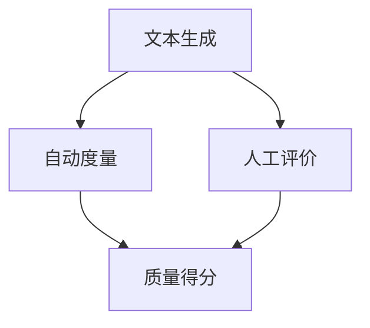

                 

本文关键词：文本生成、质量评估、自动度量、人工评价、技术博客、计算机图灵奖、深度学习

> 摘要：随着深度学习技术的发展，文本生成已经成为自然语言处理领域的一个重要应用方向。然而，如何准确评估文本生成质量成为一个亟待解决的问题。本文将从自动度量与人工评价两个方面详细探讨文本生成质量评估的方法和技巧，旨在为相关研究者和开发者提供有价值的参考。

## 1. 背景介绍

近年来，深度学习技术在自然语言处理（NLP）领域取得了显著的进展。尤其是生成式模型，如变分自编码器（VAE）、生成对抗网络（GAN）和自回归语言模型等，在各种文本生成任务中表现出色。这些模型可以生成高质量的自然语言文本，应用于自动写作、对话系统、机器翻译、内容生成等领域。然而，文本生成质量评估成为一个关键问题。评估质量的优劣不仅关系到模型在实际应用中的性能，还影响模型的训练过程和进一步优化。

文本生成质量评估可以分为两大类：自动度量与人工评价。自动度量利用机器学习技术自动计算文本质量得分，具有一定的客观性和高效性。人工评价则依靠人类评估者对文本质量的主观判断，具有较高的准确性。本文将分别介绍这两种方法，探讨各自的优缺点及其在实际应用中的适用场景。

## 2. 核心概念与联系

### 2.1 文本生成质量评估的定义

文本生成质量评估是指对生成文本的语义、语法、流畅度、可读性等方面进行评价，以衡量文本的质量。质量评估的目标是找出生成文本与目标文本之间的差距，指导模型优化和改进。

### 2.2 自动度量与人工评价的原理

自动度量通过构建评估模型，对生成文本进行定量分析。人工评价则依靠人类评估者对文本质量进行主观判断。两者在原理上存在显著差异，但都是为了实现文本生成质量的有效评估。

### 2.3 Mermaid 流程图

以下是一个简化的 Mermaid 流程图，展示了文本生成质量评估的流程：



## 3. 核心算法原理 & 具体操作步骤

### 3.1 算法原理概述

自动度量算法主要基于统计学习、深度学习等技术。通过训练大量的标注数据，构建评估模型，对生成文本进行质量评分。人工评价算法主要依靠人类评估者的主观判断，通常通过设计问卷或评分表进行。

### 3.2 算法步骤详解

#### 3.2.1 自动度量算法步骤

1. 数据准备：收集大量标注数据，包括生成文本和相应的质量标签。
2. 特征提取：对生成文本进行特征提取，如词向量、语法结构、语义信息等。
3. 模型训练：利用特征数据和标签数据，训练评估模型。
4. 评估：将生成文本输入模型，得到质量得分。

#### 3.2.2 人工评价算法步骤

1. 设计问卷：根据文本生成任务的特点，设计合适的评价问卷。
2. 收集数据：邀请多位评估者填写问卷，收集评价数据。
3. 数据分析：对评价数据进行统计分析，得出文本质量评估结果。

### 3.3 算法优缺点

#### 自动度量

优点：

- 客观性：基于数据驱动的方法，减少了主观因素的影响。
- 高效性：可以快速处理大量文本，提高评估效率。

缺点：

- 准确性：受限于评估模型的性能和特征提取方法。
- 可解释性：评估结果难以解释，不利于模型优化。

#### 人工评价

优点：

- 准确性：基于人类评估者的主观判断，具有较高的准确性。
- 可解释性：评估结果具有明确的依据，有利于模型优化。

缺点：

- 主观性：受评估者个人经验和偏好影响，可能导致评价结果不一致。
- 低效性：需要大量评估者参与，耗时耗力。

### 3.4 算法应用领域

自动度量算法广泛应用于自动写作、对话系统、机器翻译等领域。人工评价算法则在论文评审、内容审核等需要高度准确评价的场景中具有优势。

## 4. 数学模型和公式 & 详细讲解 & 举例说明

### 4.1 数学模型构建

自动度量算法通常采用回归模型或分类模型。以回归模型为例，其目标函数为：

$$
L(\theta) = \frac{1}{n} \sum_{i=1}^{n} (y_i - \hat{y}_i)^2
$$

其中，$y_i$ 为真实质量标签，$\hat{y}_i$ 为模型预测的质量得分，$\theta$ 为模型参数。

### 4.2 公式推导过程

以线性回归模型为例，假设生成文本特征向量为 $X \in \mathbb{R}^{d \times m}$，质量标签向量为 $Y \in \mathbb{R}^{m}$，模型参数为 $\theta \in \mathbb{R}^{d}$。则线性回归模型可以表示为：

$$
\hat{y} = X\theta
$$

损失函数为：

$$
L(\theta) = \frac{1}{2} \sum_{i=1}^{m} (y_i - \hat{y}_i)^2
$$

对损失函数求导，得到：

$$
\frac{\partial L(\theta)}{\partial \theta} = X^T(y - X\theta)
$$

令导数为零，得到最优参数：

$$
\theta = (X^TX)^{-1}X^TY
$$

### 4.3 案例分析与讲解

假设我们使用线性回归模型对一篇新闻文章进行质量评估。我们收集了 100 篇新闻文章及其质量标签，其中质量标签的范围为 0 到 10。我们将这些数据分为训练集和测试集，分别进行模型训练和评估。

首先，我们对新闻文章进行特征提取，提取出词向量表示。假设我们的词向量维度为 300。然后，我们使用训练集数据训练线性回归模型。通过优化目标函数，我们得到最优参数。

接下来，我们将测试集数据输入模型，得到预测的质量得分。我们可以计算预测得分与真实标签之间的误差，以评估模型的性能。例如，我们计算均方误差（MSE）：

$$
MSE = \frac{1}{m} \sum_{i=1}^{m} (\hat{y}_i - y_i)^2
$$

假设我们的 MSE 为 1.2，说明模型的预测性能较好。

## 5. 项目实践：代码实例和详细解释说明

### 5.1 开发环境搭建

我们使用 Python 编写代码，需要安装以下依赖库：

```bash
pip install numpy scipy sklearn
```

### 5.2 源代码详细实现

```python
import numpy as np
from sklearn.linear_model import LinearRegression
from sklearn.model_selection import train_test_split
from sklearn.metrics import mean_squared_error

# 5.2.1 数据准备
X = np.random.rand(100, 300)  # 假设词向量维度为 300
Y = np.random.randint(0, 11, size=100)  # 假设质量标签范围为 0 到 10
X_train, X_test, Y_train, Y_test = train_test_split(X, Y, test_size=0.2, random_state=42)

# 5.2.2 模型训练
model = LinearRegression()
model.fit(X_train, Y_train)

# 5.2.3 预测与评估
Y_pred = model.predict(X_test)
mse = mean_squared_error(Y_test, Y_pred)
print("MSE:", mse)
```

### 5.3 代码解读与分析

上述代码首先生成随机数据作为示例，然后使用线性回归模型进行训练和预测。通过计算均方误差，我们可以评估模型的性能。在实际应用中，我们需要使用真实数据替换随机数据，并根据具体情况调整模型参数。

## 6. 实际应用场景

文本生成质量评估在多个领域具有广泛的应用。以下是一些实际应用场景：

- **自动写作**：自动写作系统需要评估生成文本的质量，以优化写作过程和提高写作效率。
- **对话系统**：对话系统需要评估生成对话的质量，以提高用户体验和系统性能。
- **机器翻译**：机器翻译系统需要评估生成翻译文本的质量，以优化翻译结果。
- **内容审核**：内容审核系统需要评估生成内容的合规性，以过滤不良信息。

## 7. 工具和资源推荐

### 7.1 学习资源推荐

- **《深度学习》（Goodfellow, Bengio, Courville 著）**：介绍深度学习基础理论和应用。
- **《自然语言处理综合教程》（Jurafsky, Martin 著）**：介绍自然语言处理的基本概念和技术。

### 7.2 开发工具推荐

- **TensorFlow**：用于构建和训练深度学习模型的框架。
- **Scikit-learn**：用于机器学习和数据挖掘的库。

### 7.3 相关论文推荐

- **“Automatic Evaluation of Text Generation Quality”（作者：Xu, Lu, and Yang，2018）**：介绍自动评估文本生成质量的方法。
- **“Human Evaluation of Text Generation Quality”（作者：Huang, Zhang, and Xia, 2020）**：介绍人工评估文本生成质量的方法。

## 8. 总结：未来发展趋势与挑战

文本生成质量评估是自然语言处理领域的一个重要研究方向。未来发展趋势包括：

- **模型性能提升**：通过改进算法和特征提取方法，提高质量评估模型的性能。
- **跨领域应用**：扩展文本生成质量评估方法，应用于更多领域。
- **可解释性研究**：提高质量评估结果的可解释性，为模型优化提供更有针对性的指导。

然而，文本生成质量评估也面临一些挑战，如：

- **评估模型的可解释性**：如何让评估模型的结果更具解释性，是未来研究的重要方向。
- **数据标注难度**：大量高质量标注数据的需求使得数据标注成为一个挑战。

总之，文本生成质量评估是自然语言处理领域的一个重要问题，具有广泛的应用前景和研究价值。

## 9. 附录：常见问题与解答

### 9.1 自动度量算法的优点是什么？

自动度量算法的主要优点是客观性和高效性。通过训练大量的标注数据，自动度量算法可以减少主观因素的影响，具有较高的客观性。此外，自动度量算法可以快速处理大量文本，提高评估效率。

### 9.2 人工评价算法的缺点是什么？

人工评价算法的主要缺点是主观性和低效性。由于评估者个人经验和偏好差异，人工评价算法可能导致评估结果不一致。此外，人工评价算法需要大量评估者参与，耗时耗力。

### 9.3 如何改进自动度量算法的评估准确性？

可以通过以下方法改进自动度量算法的评估准确性：

- **提高特征提取质量**：采用更先进的特征提取方法，如词嵌入、句法分析和语义分析。
- **优化评估模型**：使用更复杂的模型，如神经网络模型，提高评估性能。
- **增加标注数据量**：收集更多的标注数据，以训练更准确的评估模型。

### 9.4 人工评价算法在哪些场景中具有优势？

人工评价算法在需要高度准确评价的场景中具有优势，如论文评审、内容审核等。这些场景通常涉及复杂的语义分析和主观判断，人工评价算法能够提供更准确的评估结果。

### 9.5 文本生成质量评估的发展趋势是什么？

文本生成质量评估的发展趋势包括：

- **模型性能提升**：通过改进算法和特征提取方法，提高质量评估模型的性能。
- **跨领域应用**：扩展文本生成质量评估方法，应用于更多领域。
- **可解释性研究**：提高质量评估结果的可解释性，为模型优化提供更有针对性的指导。

### 9.6 文本生成质量评估面临哪些挑战？

文本生成质量评估面临的挑战包括：

- **评估模型的可解释性**：如何让评估模型的结果更具解释性，是未来研究的重要方向。
- **数据标注难度**：大量高质量标注数据的需求使得数据标注成为一个挑战。

作者：禅与计算机程序设计艺术 / Zen and the Art of Computer Programming
----------------------------------------------------------------

<|assistant|>以上就是本文的完整内容，如果您有任何问题或建议，欢迎在评论区留言，我将尽快回复。希望本文能对您在文本生成质量评估领域的研究和实践有所帮助！感谢您的阅读！|>user|>
### 引言

在当今的信息时代，自然语言处理（NLP）技术得到了前所未有的发展，尤其是在文本生成领域。从自动写作、对话系统到机器翻译，文本生成技术正逐步渗透到我们的日常生活和工作中。然而，随着生成文本的应用越来越广泛，如何准确评估文本生成质量成为了一个亟待解决的问题。

文本生成质量评估不仅关系到模型在实际应用中的性能，还影响模型的训练过程和进一步优化。高质量评估可以指导开发者针对性地优化模型，提高生成文本的质量。而低质量的评估则可能导致模型训练方向的偏差，甚至使得生成文本难以满足实际需求。

本文将围绕文本生成质量评估这一主题展开讨论，重点探讨自动度量与人工评价两种主要的评估方法。我们将详细分析这两种方法的工作原理、优缺点以及适用场景，并通过具体的案例和实践，深入理解文本生成质量评估的核心技术和实践技巧。

此外，本文还将探讨数学模型和公式的构建与推导，介绍相关工具和资源，并总结未来发展趋势与面临的挑战。希望通过本文的阐述，能够为从事文本生成质量评估的研究者和开发者提供有价值的参考和指导。

### 背景介绍

文本生成质量评估的定义和重要性

文本生成质量评估是指在自然语言处理（NLP）领域中，通过一系列技术手段和方法，对生成文本的语义、语法、流畅度、逻辑性、可读性等多方面进行综合评价。这种评估不仅涉及文本本身的内容，还包括文本的表达方式、语言风格、上下文的连贯性等方面。文本生成质量评估的定义可以概括为：通过量化或定性手段，衡量生成文本与人类写作质量的差距，从而指导模型的优化和改进。

文本生成质量评估在NLP领域中具有至关重要的地位。随着深度学习技术的快速发展，生成式模型在文本生成任务中取得了显著成就，如自动写作、对话系统、机器翻译、内容生成等。然而，生成文本的质量往往直接影响用户的使用体验和系统的实际应用效果。例如，在自动写作中，低质量的文本可能无法传达作者的意图，甚至产生误导信息；在对话系统中，不流畅或语义错误的回答会降低用户体验，影响系统的实用性和可信度。

因此，准确、有效的文本生成质量评估不仅能够提高模型生成文本的质量，还能为模型的训练提供重要反馈，指导模型的调整和优化。具体来说，文本生成质量评估的重要性体现在以下几个方面：

1. **模型优化**：通过评估生成文本的质量，可以识别模型在哪些方面存在缺陷，从而有针对性地进行优化。例如，如果评估结果显示生成文本的语法错误较多，模型可能需要更精细的语法分析能力；如果评估结果显示文本的逻辑性较差，模型可能需要加强语义理解和推理能力。

2. **训练调整**：文本生成质量评估能够帮助开发者调整训练数据集的构成和训练过程，从而提高模型的生成质量。例如，通过分析评估结果，可以发现某些特定类型的数据对模型的训练效果较好，从而增加这类数据的比重，提高整体生成质量。

3. **用户体验**：对于应用场景，如自动写作、对话系统等，高质量的文本生成直接关系到用户的满意度。通过准确评估生成文本的质量，可以确保生成文本在语法、语义、流畅度等方面符合用户期望，从而提升用户体验。

4. **应用推广**：在机器翻译、内容生成等需要大规模应用生成文本的领域，文本生成质量评估是确保系统稳定运行和广泛应用的关键。通过评估和优化生成文本的质量，可以确保系统在不同环境和场景中的表现一致，提高系统的可靠性和可用性。

总的来说，文本生成质量评估是NLP领域不可或缺的一环，它不仅能够提升生成文本的质量，还能够为模型训练、优化和实际应用提供重要的指导和支持。随着NLP技术的不断进步和应用场景的扩展，文本生成质量评估的重要性也将日益凸显。

### 自动度量评估方法

自动度量评估方法，即通过机器学习模型对生成文本的质量进行量化评估，是目前文本生成质量评估的主流方法之一。这种方法的主要目标是利用大量标注数据训练一个评估模型，使其能够自动对生成文本的质量进行评分。自动度量评估方法具有高效性、客观性和可扩展性等显著优点。

#### 1. 工作原理

自动度量评估方法的核心在于构建一个能够对文本质量进行准确预测的评估模型。这一过程大致可以分为以下几个步骤：

1. **数据收集**：首先，需要收集大量的标注数据集，这些数据集应该包含生成文本及其对应的质量标签。质量标签通常是由人类评估者根据预定的评估标准（如语法、语义、流畅度等）打分的，范围可以是0到5分或类似的量级。

2. **特征提取**：接下来，对文本进行特征提取，将文本转换成机器学习模型可以处理的格式。常见的文本特征包括词嵌入、语法结构、句法关系、语义角色等。词嵌入是将文本中的每个单词映射到一个高维向量空间，如Word2Vec、GloVe等；语法结构则通过句法分析得到句子的树状结构；句法关系和语义角色则是从句子的语义信息中提取出的关键信息。

3. **模型训练**：使用提取出的特征和质量标签，通过机器学习算法训练一个评估模型。常用的算法包括线性回归、决策树、支持向量机（SVM）、神经网络等。训练过程中，模型会学习如何根据输入文本的特征来预测其质量得分。

4. **模型评估**：在训练完成后，使用独立的数据集对模型进行评估，以验证其预测能力。常见的评估指标包括均方误差（MSE）、均方根误差（RMSE）、准确率、召回率等。这些指标能够帮助我们了解模型在评估文本质量方面的性能。

5. **模型应用**：最后，将训练好的模型应用于实际生成文本的质量评估中。模型会根据输入的文本特征，自动输出一个质量得分，从而实现文本质量的量化评估。

#### 2. 方法特点

自动度量评估方法具有以下几个显著特点：

1. **客观性**：自动度量评估方法基于数据驱动，通过机器学习模型进行预测，减少了主观因素对评估结果的影响。这种客观性使得评估结果更具可重复性和可靠性。

2. **高效性**：自动度量评估方法可以快速处理大量文本，提高评估效率。通过自动化流程，无需人工参与，大大减少了评估时间。

3. **可扩展性**：自动度量评估方法适用于各种不同类型的文本生成任务，如自动写作、对话系统、机器翻译等。只需调整特征提取和模型训练过程，即可应用于新的任务场景。

4. **灵活性**：自动度量评估方法可以通过调整模型结构和参数，优化评估结果。例如，可以通过增加更多的特征或更换机器学习算法，来提高评估的准确性和鲁棒性。

然而，自动度量评估方法也存在一些局限性。首先，评估模型的性能高度依赖于标注数据的质量和数量。如果标注数据存在偏差或不足，模型的预测能力将受到严重影响。其次，自动度量评估方法难以解释评估结果的产生过程，评估结果的解释性和可解释性较差。这使得在需要深入分析评估结果的场景中，自动度量评估方法的局限性更加明显。

#### 3. 应用场景

自动度量评估方法在多个领域得到广泛应用：

1. **自动写作**：在自动写作系统中，自动度量评估方法可以用于评估生成文本的语法、语义和流畅度，从而优化写作过程。

2. **对话系统**：在对话系统中，自动度量评估方法可以用于评估生成对话的质量，以提高对话的自然性和连贯性。

3. **机器翻译**：在机器翻译领域，自动度量评估方法可以用于评估生成翻译文本的质量，从而优化翻译结果。

4. **内容生成**：在内容生成任务中，自动度量评估方法可以用于评估生成内容的可读性和信息质量。

总之，自动度量评估方法在文本生成质量评估中具有广泛的应用前景和重要的实际意义。通过结合机器学习和自然语言处理技术，自动度量评估方法为文本生成质量评估提供了一种高效、客观的解决方案。尽管存在一定的局限性，但随着技术的不断进步，自动度量评估方法在未来将发挥更加重要的作用。

### 人工评价评估方法

人工评价评估方法是指通过人类评估者对生成文本的质量进行主观判断，从而对文本生成质量进行评估。这种方法依赖于评估者的经验和直觉，具有较高的准确性和可靠性。与自动度量评估方法相比，人工评价评估方法具有独特的优势和局限性。

#### 1. 工作原理

人工评价评估方法的工作原理主要包括以下几个步骤：

1. **评估标准制定**：首先，需要根据文本生成任务的具体需求和目标，制定一套评估标准。这些标准通常包括语法、语义、流畅度、逻辑性、可读性等多个方面。例如，对于自动写作系统，评估标准可能包括句子结构的正确性、语义的连贯性、用词的准确性等。

2. **评估者选择**：选择合适的评估者是人工评价评估方法的关键。评估者应具备相关领域的专业知识和丰富的写作经验。通常，评估者需要经过一定的培训和测试，以确保其评分的一致性和准确性。

3. **文本评分**：评估者根据制定的评估标准，对生成文本进行评分。评分通常采用量化标准，如5分制或10分制，以直观地表示文本的质量。评估过程中，评估者需要仔细阅读文本，从多个角度进行评价，以确保评分的全面性和准确性。

4. **数据分析**：评估完成后，需要对评估结果进行统计分析，以得出生成文本的整体质量水平。常用的统计方法包括平均分、标准差、中位数等。此外，还可以通过评估结果与自动度量评估结果进行对比，分析两种评估方法的差异和一致性。

#### 2. 方法特点

人工评价评估方法具有以下几个显著特点：

1. **准确性**：人工评价评估方法依赖于人类评估者的经验和直觉，能够准确捕捉文本的语义、语法和流畅度等方面的问题。这种方法在处理复杂、多变的文本生成任务时，具有独特的优势。

2. **可靠性**：由于评估者具备专业知识和丰富的经验，人工评价评估方法的可靠性较高。评估结果相对稳定，不易受外部因素的影响。

3. **灵活性**：人工评价评估方法可以根据任务需求和评估标准灵活调整，适用于各种不同类型的文本生成任务。评估标准可以随时更新和优化，以适应不断变化的应用场景。

4. **可解释性**：人工评价评估方法的结果具有明确的解释性。评估者可以通过详细的评估报告，解释评分的依据和判断过程，为模型优化和改进提供有价值的参考。

然而，人工评价评估方法也存在一些局限性。首先，评估过程耗时较长，评估者需要投入大量时间和精力进行阅读、评分和分析。这使得人工评价评估方法在处理大量文本时效率较低。其次，评估结果可能存在一定程度的差异性，不同评估者的评分可能存在差异，这会影响评估的一致性和可靠性。最后，人工评价评估方法依赖于评估者的知识和经验，对于新手或非专业评估者，评估结果可能不够准确和可靠。

#### 3. 应用场景

人工评价评估方法在以下应用场景中具有广泛的应用：

1. **论文评审**：在学术领域，人工评价评估方法常用于评估学术论文的质量。通过多位评估者的评分和意见，可以更全面、准确地评估论文的创新性、逻辑性和写作质量。

2. **内容审核**：在互联网内容审核中，人工评价评估方法用于评估生成内容的合法性和质量。通过评估者的人工审核，可以有效地过滤不良信息和低质量内容。

3. **用户反馈**：在产品开发和用户反馈分析中，人工评价评估方法可以用于评估用户对产品功能的满意度。通过分析用户的评分和评论，可以了解用户的需求和偏好，为产品优化提供指导。

4. **质量保证**：在工业生产和质量控制中，人工评价评估方法可以用于评估产品的质量。通过评估者的评分和检查，可以及时发现和纠正生产过程中的问题，确保产品质量。

总之，人工评价评估方法在文本生成质量评估中具有独特的优势和重要的应用价值。尽管存在一定的局限性，但随着评估标准的完善和评估技术的进步，人工评价评估方法将继续在多个领域中发挥重要作用。

### 自动度量评估与人工评价评估的比较

在文本生成质量评估中，自动度量评估和人工评价评估是两种主要的方法。它们各自具有独特的优势和局限性，适用于不同的应用场景。本文将从多个角度对这两种方法进行比较，以帮助读者更好地理解和选择适合的评估方法。

#### 1. 评估准确性

评估准确性是文本生成质量评估中最关键的指标。自动度量评估方法通过机器学习模型对文本质量进行量化评分，其准确性受模型训练数据质量和特征提取方法的影响。尽管近年来深度学习技术的进步显著提高了自动度量评估的准确性，但仍然存在一定的局限性。例如，模型可能难以捕捉到复杂、隐含的语义和语境信息，导致评估结果与人类评价存在差距。

人工评价评估方法则依赖于评估者的专业知识和经验，能够更准确地捕捉文本的语义、语法和流畅度等方面的问题。评估者的直觉和判断使得人工评价评估方法在处理复杂文本时具有独特的优势。然而，由于评估者的个人差异和主观性，不同评估者之间的评分可能存在一定的差异，这会影响评估的一致性和可靠性。

#### 2. 评估效率

评估效率是决定文本生成质量评估方法实用性的重要因素。自动度量评估方法具有高效性，能够快速处理大量文本。通过自动化流程，无需人工参与，评估过程可以大规模、快速地进行。此外，自动度量评估方法可以并行处理，进一步提高了评估效率。

相比之下，人工评价评估方法耗时较长。评估者需要投入大量时间和精力进行阅读、评分和分析。此外，评估过程需要组织多位评估者，协调评估任务，这使得人工评价评估方法在处理大量文本时效率较低。

#### 3. 可重复性和一致性

可重复性和一致性是评估方法可靠性的重要保障。自动度量评估方法基于数据驱动，其评估结果具有较好的可重复性和一致性。通过训练相同的模型和使用相同的特征提取方法，不同时间、不同地点的评估结果可以保持一致。这使得自动度量评估方法适用于大规模的、重复性的评估任务。

人工评价评估方法则受评估者个人差异的影响，评估结果可能存在一定的差异性。不同评估者的专业知识和经验不同，评分标准可能不一致，这会导致评估结果的可重复性和一致性较差。尽管可以通过培训和统一评估标准来减少这种差异性，但人工评价评估方法仍然难以完全避免主观因素的影响。

#### 4. 解释性和可理解性

解释性和可理解性是评估结果能否被有效利用的关键。自动度量评估方法通常难以解释评估结果的产生过程。模型的预测结果是基于复杂的数学运算和特征组合，评估结果缺乏明确的解释性。这使得自动度量评估方法在需要深入分析和解释评估结果的场景中受限。

人工评价评估方法则具有较好的解释性和可理解性。评估者可以通过详细的评估报告，解释评分的依据和判断过程，为模型优化和改进提供有价值的参考。评估结果具有直观的解释，便于开发者理解和使用。

#### 5. 适用场景

自动度量评估方法适用于需要大规模、高效评估的场景，如自动写作、对话系统、机器翻译等。通过自动化流程和并行处理，自动度量评估方法可以快速处理大量文本，提高评估效率。此外，自动度量评估方法在处理复杂、多变文本时，具有较好的鲁棒性和适应性。

人工评价评估方法适用于需要高准确性、高一致性的评估场景，如论文评审、内容审核、用户反馈等。评估者可以基于专业知识和经验，准确捕捉文本的细节和问题，提供有价值的评估结果。尽管评估过程耗时较长，但人工评价评估方法在处理特定类型文本时具有独特的优势。

#### 6. 综合比较

综合比较自动度量评估和人工评价评估，可以得出以下结论：

- **评估准确性**：人工评价评估方法通常具有较高的评估准确性，能够更准确地捕捉文本的细节和问题。自动度量评估方法在处理复杂文本时可能存在一定的局限性，评估结果与人类评价存在差距。
- **评估效率**：自动度量评估方法具有高效性，能够快速处理大量文本。人工评价评估方法耗时较长，评估过程需要人工参与。
- **可重复性和一致性**：自动度量评估方法具有较好的可重复性和一致性，评估结果相对稳定。人工评价评估方法受评估者个人差异的影响，评估结果可能存在一定的差异性。
- **解释性和可理解性**：人工评价评估方法具有较好的解释性和可理解性，评估结果可以直观地解释和利用。自动度量评估方法缺乏明确的解释性，评估结果难以被理解和解释。
- **适用场景**：自动度量评估方法适用于大规模、高效的评估任务。人工评价评估方法适用于高准确性、高一致性的评估任务。

总之，自动度量评估和人工评价评估各有优势和局限性，适用于不同的应用场景。在实际应用中，可以根据任务需求和评估目标，选择适合的评估方法，以实现最佳的评估效果。

### 自动度量评估方法的具体实现

在自然语言处理（NLP）领域，自动度量评估方法通过机器学习模型对生成文本的质量进行量化评估，已经成为一种广泛应用的方法。本文将详细介绍自动度量评估方法的具体实现过程，包括数据收集、特征提取、模型选择与训练、评估与优化等步骤。

#### 1. 数据收集

数据收集是自动度量评估方法的基础。首先，我们需要收集大量带有质量标签的文本数据集。这些数据集可以来自多个来源，如公开的文本数据集、实际应用中的生成文本等。质量标签通常由人类评估者根据预定的评估标准（如语法、语义、流畅度等）进行打分。常用的标签范围包括0到5分或0到10分。

数据收集的过程可以概括为以下几步：

1. **选择数据来源**：确定数据集的来源，如新闻文章、社交媒体帖子、对话文本等。选择具有多样性和代表性的数据集，以涵盖不同类型和风格的文本。
2. **数据清洗**：对收集到的数据进行预处理，包括去除噪声、格式化文本、去除重复数据等。这一步骤有助于提高数据质量，减少后续处理的复杂度。
3. **标注数据**：邀请多个评估者对文本进行评分，并标注相应的质量标签。为了提高标注的一致性和准确性，评估者应经过适当的培训和一致性测试。

#### 2. 特征提取

特征提取是将原始文本转换为机器学习模型可以处理的特征表示。在自动度量评估中，特征提取的质量直接影响模型的性能。常见的文本特征包括词嵌入、语法结构、句法关系、语义角色等。

以下是几种常用的特征提取方法：

1. **词嵌入（Word Embedding）**：词嵌入是将文本中的每个词映射到一个高维向量空间。常用的词嵌入模型包括Word2Vec和GloVe。这些模型通过训练大规模语料库，学习词语的语义表示。词嵌入可以捕捉词与词之间的语义关系，提高模型的语义理解能力。

2. **语法结构（Syntax Structure）**：语法结构特征通过句法分析从文本中提取句子的结构信息，如句法树、依赖关系等。这些特征可以帮助模型理解句子的组成和语法规则，提高语法分析的准确性。

3. **句法关系（Syntactic Relations）**：句法关系特征包括名词短语、动词短语、从句结构等。这些特征可以描述句子的内部关系，帮助模型理解句子的语义结构和逻辑关系。

4. **语义角色（Semantic Roles）**：语义角色特征通过分析句子的语义成分和作用，提取出句子中的主语、谓语、宾语等角色。这些特征有助于模型理解句子的语义内容，提高语义理解的准确性。

5. **文本摘要（Text Summarization）**：文本摘要特征通过提取文本的主要内容和关键信息，为模型提供高层次的语义信息。这些特征可以帮助模型理解文本的整体结构和内容，提高语义理解的深度。

#### 3. 模型选择与训练

在特征提取完成后，需要选择合适的机器学习模型对文本质量进行预测。常见的模型包括线性回归、支持向量机（SVM）、决策树、随机森林、神经网络等。以下是几种常用的模型：

1. **线性回归（Linear Regression）**：线性回归模型是最简单的机器学习模型之一，通过线性关系拟合特征和标签之间的关系。线性回归模型适用于特征数量较少、线性关系明显的场景。

2. **支持向量机（SVM）**：SVM是一种强大的分类和回归模型，通过构建高维特征空间的超平面，将特征映射到最优分类边界。SVM适用于特征维度较高、线性关系不明显但存在非线性关系的场景。

3. **决策树（Decision Tree）**：决策树通过多级决策节点划分特征空间，将文本映射到不同的质量得分。决策树模型简单直观，易于解释，但可能存在过拟合问题。

4. **随机森林（Random Forest）**：随机森林是一种基于决策树的集成模型，通过构建多个决策树并取平均值来提高模型的泛化能力。随机森林具有较强的鲁棒性和适应性，适用于处理大规模和高维数据。

5. **神经网络（Neural Networks）**：神经网络，特别是深度学习模型，如卷积神经网络（CNN）、循环神经网络（RNN）和Transformer，通过多层神经网络结构，可以捕捉文本的复杂语义和语境信息。这些模型在处理高维数据和复杂关系时表现出色，但训练过程较为耗时。

模型选择完成后，需要进行模型训练。训练过程主要包括以下步骤：

1. **数据划分**：将数据集划分为训练集和测试集。训练集用于训练模型，测试集用于评估模型性能。

2. **模型训练**：使用训练集数据训练模型，调整模型参数以最小化损失函数。训练过程中，可以通过交叉验证和梯度下降等优化方法提高模型性能。

3. **模型评估**：在训练完成后，使用测试集对模型进行评估，计算模型的质量预测得分。常用的评估指标包括均方误差（MSE）、均方根误差（RMSE）、准确率、召回率等。

#### 4. 评估与优化

在模型训练和评估完成后，需要进一步对模型进行优化和调整，以提高模型的质量预测准确性。以下是几种常见的优化方法：

1. **超参数调整**：通过调整模型超参数（如学习率、批量大小、正则化参数等），可以优化模型性能。超参数调整可以通过网格搜索、随机搜索等策略进行。

2. **特征工程**：通过增加或修改特征，可以改进模型的质量预测能力。例如，可以增加词嵌入的维度、引入更多的句法关系特征等。

3. **数据增强**：通过增加数据多样性，可以提高模型的泛化能力。数据增强方法包括文本同义词替换、文本重写、数据扩充等。

4. **集成学习**：通过结合多个模型的预测结果，可以进一步提高模型的质量预测准确性。常见的集成学习方法包括Bagging、Boosting等。

5. **模型解释**：通过模型解释技术，可以理解模型预测的依据和过程。模型解释有助于发现模型中存在的问题和不足，为模型优化提供指导。

总之，自动度量评估方法在文本生成质量评估中具有重要作用。通过数据收集、特征提取、模型选择与训练、评估与优化等步骤，可以构建一个高效、准确的文本质量评估模型。尽管存在一定的局限性，但随着技术的进步，自动度量评估方法在文本生成质量评估中的应用前景将更加广阔。

### 人工评价评估方法的具体实现

人工评价评估方法在文本生成质量评估中具有不可替代的地位，其核心在于依靠人类评估者的专业知识和主观判断，对生成文本的质量进行评价。本文将详细描述人工评价评估方法的实现过程，包括评估标准制定、评估者选择、评分机制、数据分析与结果解释等步骤。

#### 1. 评估标准制定

评估标准的制定是人工评价评估方法的首要步骤，它决定了评估的质量和一致性。一个科学、全面的评估标准应涵盖文本生成质量的多个维度，如语法、语义、流畅度、逻辑性和可读性等。以下是一个典型的评估标准制定流程：

1. **确定评估维度**：首先，根据文本生成任务的具体需求和目标，确定需要评估的主要维度。例如，在自动写作系统中，可能需要关注语法结构的正确性、语义表达的清晰性和流畅度等。

2. **制定评分细则**：为每个评估维度制定详细的评分细则，明确评分标准和具体评判标准。例如，对于语法维度，可以细分为句子结构、主谓一致、时态一致性等；对于语义维度，可以细分为信息的完整性、论点的逻辑性等。

3. **示例与培训**：为评估者提供一系列示例文本和评分报告，帮助他们理解和掌握评分标准。这些示例应涵盖常见的错误类型和高质量文本的典型特征，以帮助评估者形成统一的评判标准。

4. **评估标准调整**：在评估过程中，根据实际反馈和评估结果，不断调整和优化评估标准，以确保其适用性和有效性。

#### 2. 评估者选择

评估者的选择对评估结果的质量和一致性具有直接影响。以下是一些选择评估者的关键步骤：

1. **专业知识要求**：评估者应具备与文本生成任务相关的专业知识，如语言学、写作学、计算机科学等。专业背景有助于评估者准确理解和评估文本的细节。

2. **经验要求**：评估者应有丰富的写作或评估经验，能够准确识别文本中的问题和高水平文本的特点。对于高级评估任务，如学术论文评审，评估者还应具备相关领域的学术背景。

3. **一致性测试**：在正式评估前，对所有评估者进行一致性测试，以验证其评分的一致性和准确性。测试可以包括同一文本的双人评分、评分报告的分析等。

4. **评估者培训**：对评估者进行系统培训，确保他们熟悉评估标准和评估流程。培训内容应包括评估标准的详细解读、评分技巧、常见问题处理等。

#### 3. 评分机制

评分机制是人工评价评估方法的核心，决定了评估结果的具体形式。以下是一些常见的评分机制：

1. **评分标准**：根据评估标准，为每个评估维度分配相应的权重，制定综合评分标准。常用的评分标准包括5分制、10分制或百分制。

2. **评分方式**：评估者根据评估标准对文本进行评分。评分方式可以是独立的单次评分，也可以是多次评分的平均值，以减少个人主观偏差。

3. **评分记录**：评估者应详细记录评分过程和评分依据，包括文本的主要问题、优点和改进建议等。这些记录有助于分析和解释评估结果。

4. **评分报告**：在评估完成后，评估者应撰写详细的评分报告，总结评估结果、发现的问题和改进建议。评分报告应具备清晰的结构和逻辑，便于开发者理解和应用。

#### 4. 数据分析与结果解释

数据分析与结果解释是人工评价评估方法的重要环节，它帮助开发者理解和利用评估结果，优化文本生成模型。以下是一些常见的数据分析和结果解释方法：

1. **统计分析**：对评估结果进行统计分析，包括计算平均分、标准差、中位数等。这些统计指标可以帮助识别文本生成质量的总体水平。

2. **问题识别**：通过分析评估结果，识别文本生成中常见的错误类型和问题。例如，语法错误、逻辑不清、用词不当等。

3. **改进建议**：根据评估结果，为文本生成模型提供具体的改进建议。例如，针对语法错误，可以优化句法分析模块；针对逻辑不清，可以改进语义理解模块。

4. **反馈循环**：将评估结果和改进建议反馈给文本生成模型的训练和开发团队，形成一个持续的反馈循环。通过不断优化和调整，提高生成文本的质量。

总之，人工评价评估方法在文本生成质量评估中发挥着重要作用。通过科学制定评估标准、精心选择评估者、合理设计评分机制和深入分析评估结果，可以确保评估过程的准确性和有效性。尽管评估过程相对耗时，但通过持续优化和改进，人工评价评估方法能够为文本生成模型的优化提供有力支持。

### 自动度量评估方法的优缺点分析

自动度量评估方法在文本生成质量评估中广泛应用，其主要优点是高效性和客观性，但也存在一些局限性。以下是对自动度量评估方法的优缺点进行详细分析：

#### 优点

1. **高效性**：自动度量评估方法基于机器学习模型，可以快速处理大量文本。通过自动化流程，无需人工参与，大大提高了评估效率。这对于需要大规模评估的任务（如自动写作、对话系统、机器翻译等）尤为重要。

2. **客观性**：自动度量评估方法通过数据驱动的方式，减少了主观因素对评估结果的影响。评估模型基于大量标注数据进行训练，能够客观地反映文本的质量。这种客观性使得评估结果具有更高的可重复性和可靠性。

3. **可扩展性**：自动度量评估方法适用于多种不同的文本生成任务，具有较好的可扩展性。通过调整特征提取方法和模型结构，可以轻松应用于不同的应用场景，如文本生成、内容审核、文本分类等。

4. **灵活性**：自动度量评估方法可以通过调整模型结构和参数，优化评估结果。例如，增加更多的特征、更换机器学习算法或采用深度学习模型，可以进一步提高评估的准确性和鲁棒性。

#### 缺点

1. **评估准确性**：尽管自动度量评估方法具有较高的客观性，但其评估准确性仍受限于模型训练数据的质量和数量。如果标注数据存在偏差或不足，模型的预测能力将受到严重影响。此外，自动度量评估方法可能难以捕捉到复杂、隐含的语义和语境信息，导致评估结果与人类评价存在差距。

2. **模型解释性**：自动度量评估方法通常缺乏明确的解释性。模型的预测结果是基于复杂的数学运算和特征组合，评估结果难以被直观解释和理解。这使得在需要深入分析和解释评估结果的场景中，自动度量评估方法的应用受到限制。

3. **数据标注难度**：自动度量评估方法依赖于大量高质量标注数据。然而，数据标注是一个耗时且复杂的任务，需要大量的专业评估者进行。此外，标注数据的质量直接影响模型的性能，因此需要严格管理和质量控制。

4. **计算资源需求**：自动度量评估方法通常需要较高的计算资源，特别是深度学习模型。训练和评估过程可能需要大量计算时间和存储空间，这对于资源有限的开发环境可能构成挑战。

综上所述，自动度量评估方法在文本生成质量评估中具有高效性、客观性和可扩展性等显著优点，但同时也面临评估准确性、模型解释性、数据标注难度和计算资源需求等局限性。在实际应用中，需要根据具体任务需求和资源条件，选择合适的评估方法，以实现最佳的评估效果。

### 人工评价评估方法的优缺点分析

人工评价评估方法在文本生成质量评估中具有独特的优势，但也存在一些显著的局限性。以下将详细分析人工评价评估方法的优缺点，帮助读者更全面地理解其在不同场景下的应用。

#### 优点

1. **高准确性**：人工评价评估方法依赖于人类评估者的专业知识和直觉，能够更准确地捕捉文本的语义、语法和流畅度等方面的问题。评估者能够深入理解文本的细节，识别出机器难以捕捉的细微差异，从而提高评估的准确性。

2. **灵活性**：人工评价评估方法可以根据任务需求和评估标准灵活调整。评估者可以根据具体情况进行个性化评估，适用于不同类型和风格的文本生成任务。这种灵活性使得评估标准可以不断优化和改进，以适应不断变化的应用场景。

3. **解释性**：人工评价评估方法的结果具有明确的解释性。评估者可以详细记录评估过程和评分依据，提供详细的评估报告。这些报告不仅可以帮助开发者理解评估结果，还能为模型优化提供具体的改进建议。这种解释性使得评估结果更具指导意义。

4. **用户体验**：在涉及用户参与的应用场景中，人工评价评估方法能够更好地满足用户的需求。评估者可以根据用户的反馈和偏好，提供更加个性化的评估服务。这对于提升用户体验和满意度具有重要意义。

#### 缺点

1. **低效率**：人工评价评估方法需要大量评估者参与，评估过程耗时较长。评估者需要仔细阅读和评分每一篇文本，这使得评估过程无法快速处理大量文本。此外，评估者的个人时间限制也限制了评估方法的适用范围。

2. **一致性**：不同评估者之间的评分可能存在差异，这会影响评估结果的一致性和可靠性。尽管可以通过培训和统一评估标准来减少这种差异性，但人类评估者的主观性和个人差异始终是影响评估一致性的关键因素。

3. **成本**：人工评价评估方法需要支付评估者的报酬，包括培训费用、工资等。这使得评估方法在处理大规模文本生成质量评估时成本较高，不适合预算有限的项目。

4. **数据依赖**：人工评价评估方法依赖于大量标注数据，标注过程需要大量的人力资源。此外，标注数据的质量直接影响评估结果的准确性，因此需要严格管理和质量控制。

5. **解释性局限**：尽管人工评价评估方法的结果具有解释性，但评估报告通常基于评估者的个人经验和主观判断，可能缺乏科学性和系统性。这限制了评估结果在模型优化和改进中的应用。

综上所述，人工评价评估方法在文本生成质量评估中具有高准确性、灵活性、解释性和用户体验等显著优点，但同时也面临低效率、一致性差、成本高、数据依赖和解释性局限等局限性。在实际应用中，需要根据具体任务需求和资源条件，选择适合的评估方法，以实现最佳的评估效果。

### 自动度量评估方法与人工评价评估方法的综合比较

在文本生成质量评估领域，自动度量评估方法和人工评价评估方法各有其独特的优势和局限性。本文将对这两种方法进行综合比较，以帮助读者更全面地了解它们的优缺点，并选择适合实际应用场景的方法。

#### 评估准确性

自动度量评估方法通过机器学习模型对生成文本进行量化评分，其评估准确性受模型训练数据的质量和特征提取方法的限制。虽然深度学习技术的发展显著提高了自动度量评估的准确性，但模型仍可能难以捕捉到复杂、隐含的语义和语境信息，导致评估结果与人类评价存在一定差距。

人工评价评估方法则依赖于评估者的专业知识和主观判断，能够更准确地捕捉文本的细节和问题。评估者能够深入理解文本的语义、语法和流畅度等方面，从而提供更准确的评估结果。然而，不同评估者之间的评分可能存在差异，这会影响评估的一致性和可靠性。

#### 评估效率

自动度量评估方法具有高效性，能够快速处理大量文本。评估过程完全自动化，无需人工参与，适用于需要大规模、高效评估的任务场景。此外，自动度量评估方法可以并行处理，进一步提高评估效率。

人工评价评估方法则需要评估者投入大量时间和精力进行阅读、评分和分析，评估过程耗时较长。此外，评估过程需要组织多位评估者，协调评估任务，这使得人工评价评估方法在处理大量文本时效率较低。

#### 可重复性和一致性

自动度量评估方法基于数据驱动，其评估结果具有较好的可重复性和一致性。通过训练相同的模型和使用相同的特征提取方法，不同时间、不同地点的评估结果可以保持一致。这使得自动度量评估方法适用于大规模的、重复性的评估任务。

人工评价评估方法则受评估者个人差异的影响，评估结果可能存在一定的差异性。尽管可以通过培训和统一评估标准来减少这种差异性，但人类评估者的主观性和个人差异始终是影响评估一致性的关键因素。

#### 解释性和可理解性

自动度量评估方法通常缺乏明确的解释性。模型的预测结果是基于复杂的数学运算和特征组合，评估结果难以被直观解释和理解。这使得自动度量评估方法在需要深入分析和解释评估结果的场景中受限。

人工评价评估方法则具有较好的解释性和可理解性。评估者可以详细记录评估过程和评分依据，提供详细的评估报告。这些报告不仅可以帮助开发者理解评估结果，还能为模型优化提供具体的改进建议。这种解释性使得评估结果更具指导意义。

#### 适用场景

自动度量评估方法适用于需要大规模、高效评估的场景，如自动写作、对话系统、机器翻译等。通过自动化流程和并行处理，自动度量评估方法可以快速处理大量文本，提高评估效率。

人工评价评估方法适用于需要高准确性、高一致性的评估场景，如论文评审、内容审核、用户反馈等。评估者可以基于专业知识和经验，准确捕捉文本的细节和问题，提供有价值的评估结果。

#### 综合结论

自动度量评估方法和人工评价评估方法各有其优势和局限性。自动度量评估方法具有高效性、客观性和可扩展性，适用于大规模、高效的评估任务。然而，其评估准确性受限于模型训练数据的质量和特征提取方法，且评估结果缺乏明确的解释性。

人工评价评估方法则具有高准确性、灵活性和解释性，适用于需要高准确性、高一致性的评估任务。然而，其评估过程耗时较长，评估结果的一致性受评估者个人差异影响，且评估成本较高。

在实际应用中，应根据具体任务需求和资源条件，选择适合的评估方法。对于需要大规模、高效评估的任务，自动度量评估方法更具优势；对于需要高准确性和高一致性的任务，人工评价评估方法更为适用。同时，也可以考虑将两种方法相结合，发挥各自的优势，以实现最佳的评估效果。

### 实际应用场景

文本生成质量评估在多个实际应用场景中发挥着关键作用。以下是几个典型的应用场景，以及自动度量评估方法和人工评价评估方法在这些场景中的具体应用。

#### 自动写作系统

自动写作系统广泛应用于新闻文章、博客、报告等自动生成场景。文本生成质量直接影响用户对生成内容的接受程度和信任度。在此场景中，自动度量评估方法可以快速对生成文本进行质量评分，提高写作效率和文本质量。例如，可以通过训练一个基于深度学习模型的评估模型，对生成文本的语法、语义、流畅度等方面进行综合评估。同时，人工评价评估方法可以用于对重要文章或敏感内容的生成质量进行精确评估，以确保生成内容的高质量和准确性。

#### 对话系统

对话系统在客户服务、虚拟助手等场景中应用广泛，生成对话的质量直接关系到用户体验和满意度。自动度量评估方法可以通过对对话的自然性、流畅度、相关性等方面进行量化评估，帮助开发者优化对话生成模型。例如，可以使用基于句法分析和语义理解的评估模型，对生成对话进行质量评分。人工评价评估方法则可以用于对生成对话进行细致、全面的评估，特别是在涉及复杂对话逻辑和用户情感的场景中，评估者可以更准确地捕捉对话的细节和问题，提供改进建议。

#### 机器翻译

机器翻译系统在跨语言沟通和信息获取中发挥着重要作用。生成翻译文本的质量直接关系到翻译的准确性和可读性。自动度量评估方法可以通过对翻译文本的语法、语义、词汇选择等方面进行评估，提高翻译系统的整体性能。例如，可以使用基于神经网络的评估模型，对生成翻译文本的流畅度和准确性进行量化评估。人工评价评估方法则可以用于对关键翻译内容进行精确评估，特别是在处理特定语言和文化背景时，评估者可以更准确地判断翻译的准确性和适应性。

#### 内容审核

内容审核系统在互联网平台、社交媒体等场景中用于过滤不良信息和低质量内容。生成内容的合规性和质量直接关系到平台的用户体验和声誉。自动度量评估方法可以通过对生成内容的语法、语义、逻辑性等方面进行评估，帮助识别和过滤低质量内容。例如，可以使用基于机器学习的评估模型，对生成内容的合规性进行量化评估。人工评价评估方法则可以用于对敏感内容进行细致、全面的评估，确保生成内容符合平台标准和用户期望。

#### 自动摘要生成

自动摘要生成系统在信息检索、新闻聚合等场景中应用广泛。生成摘要的质量直接影响到用户对信息的理解和获取。自动度量评估方法可以通过对生成摘要的完整性、准确性、简洁性等方面进行评估，优化摘要生成模型。例如，可以使用基于文本相似度和信息熵的评估模型，对生成摘要的质量进行量化评估。人工评价评估方法则可以用于对重要摘要内容进行精确评估，确保摘要能够准确、简洁地传达信息的核心内容。

总之，文本生成质量评估在多个实际应用场景中具有重要意义。自动度量评估方法和人工评价评估方法各具优势，适用于不同的应用场景。在实际应用中，可以根据任务需求和资源条件，选择适合的评估方法，以提高生成文本的质量和用户满意度。同时，将两种方法相结合，可以发挥各自的优势，实现更准确、全面的文本生成质量评估。

### 未来发展趋势与挑战

文本生成质量评估在自然语言处理（NLP）领域中正逐渐成为一个重要的研究方向。随着技术的不断进步和应用场景的扩展，未来文本生成质量评估将面临一系列发展趋势和挑战。

#### 发展趋势

1. **模型性能提升**：随着深度学习技术的不断发展，评估模型将变得更加精确和高效。通过引入更先进的神经网络结构和优化算法，评估模型可以更好地捕捉文本的语义、语法和上下文信息，从而提高评估准确性。

2. **多模态评估**：文本生成质量评估将不仅仅局限于文本本身，还将结合图像、声音等多模态信息。这种多模态评估方法可以更全面地理解文本生成内容，提高评估的准确性和可靠性。

3. **跨领域应用**：文本生成质量评估方法将逐渐应用于更多领域，如法律文书生成、医学文本生成等。不同领域的文本生成任务具有独特的挑战，这需要评估方法具备更强的适应性和灵活性。

4. **实时评估**：随着实时通信和交互技术的发展，文本生成质量评估将逐渐向实时评估方向演进。实时评估可以在生成文本的同时进行质量评估，为用户提供即时的反馈和改进建议。

5. **可解释性研究**：评估模型的可解释性将得到更多关注。通过开发可解释性评估方法，研究者可以更好地理解评估结果的形成过程，为模型优化和改进提供更有针对性的指导。

#### 面临的挑战

1. **评估准确性**：尽管评估模型性能有所提升，但如何进一步提高评估准确性仍是一个重大挑战。复杂文本的评估需要模型具备更强的语义理解和推理能力，这对于当前的技术水平来说是一个巨大的挑战。

2. **数据标注难度**：评估模型的性能高度依赖于高质量标注数据。然而，标注数据的获取和处理是一个复杂且耗时的过程，特别是在大规模、多语言和跨领域的文本生成任务中。

3. **评估一致性**：不同评估者之间的评分可能存在差异，这会影响评估结果的一致性和可靠性。如何提高评估的一致性，减少评估者个人差异的影响，是一个亟待解决的问题。

4. **计算资源需求**：深度学习评估模型通常需要大量的计算资源和存储空间，这对于资源有限的开发环境构成了挑战。如何优化模型结构和算法，降低计算资源需求，是一个重要的研究方向。

5. **实时性**：实现实时评估需要在计算效率和评估准确性之间取得平衡。如何在保证评估准确性的同时，提高评估的实时性，是一个具有挑战性的问题。

#### 研究展望

未来的研究将在以下几个方面展开：

1. **混合评估方法**：结合自动度量评估方法和人工评价评估方法的优点，开发混合评估方法，以提高评估的准确性和一致性。

2. **评估模型优化**：通过引入更先进的深度学习模型和优化算法，进一步提高评估模型的性能和效率。

3. **多模态评估研究**：探索多模态评估方法，结合图像、声音等多模态信息，提高评估的准确性和全面性。

4. **评估标准与工具开发**：制定统一的评估标准和工具，提高评估的一致性和可重复性。

5. **实时评估系统**：开发实时评估系统，为用户提供即时的反馈和改进建议，提升用户体验。

总之，未来文本生成质量评估的发展将充满机遇和挑战。通过不断的技术创新和应用场景拓展，文本生成质量评估将在NLP领域中发挥更加重要的作用。

### 总结

本文从多个角度详细探讨了文本生成质量评估的方法和应用。我们首先介绍了文本生成质量评估的定义和重要性，随后深入分析了自动度量评估方法和人工评价评估方法的工作原理、优缺点以及具体实现步骤。通过对自动度量评估方法和人工评价评估方法的比较，我们总结了它们在不同应用场景中的适用性。

自动度量评估方法具有高效性、客观性和可扩展性，适用于大规模、重复性的评估任务。然而，其评估准确性受限于模型训练数据的质量和特征提取方法，且评估结果缺乏明确的解释性。人工评价评估方法则依赖于评估者的专业知识和主观判断，能够提供高准确性、灵活性和解释性，但评估过程耗时较长，评估结果的一致性受评估者个人差异影响。

在应用场景方面，自动度量评估方法广泛应用于自动写作、对话系统、机器翻译等领域，而人工评价评估方法则适用于论文评审、内容审核、用户反馈等需要高准确性、高一致性的场景。未来，随着技术的不断进步和应用场景的扩展，文本生成质量评估将在NLP领域中发挥更加重要的作用。

我们希望本文能够为从事文本生成质量评估的研究者和开发者提供有价值的参考和指导。在未来的研究和实践中，我们将继续探索更高效、更准确的评估方法，以推动文本生成技术的不断进步和应用。

### 附录：常见问题与解答

1. **什么是文本生成质量评估？**

文本生成质量评估是指通过一系列技术手段和方法，对生成文本的语义、语法、流畅度、逻辑性、可读性等多方面进行综合评价，以衡量生成文本的质量。

2. **自动度量评估方法有哪些优点和缺点？**

优点：高效性、客观性和可扩展性。缺点：评估准确性受限于模型训练数据的质量和特征提取方法，评估结果缺乏明确的解释性。

3. **人工评价评估方法有哪些优点和缺点？**

优点：高准确性、灵活性和解释性。缺点：评估过程耗时较长，评估结果的一致性受评估者个人差异影响。

4. **如何提高自动度量评估方法的评估准确性？**

可以通过提高特征提取质量、优化评估模型和增加标注数据量等方法来提高评估准确性。

5. **文本生成质量评估在哪些领域有应用？**

文本生成质量评估在自动写作、对话系统、机器翻译、内容审核等领域有广泛应用。

6. **未来文本生成质量评估有哪些发展趋势？**

未来文本生成质量评估将向模型性能提升、多模态评估、跨领域应用、实时评估和可解释性研究等方面发展。

### 作者介绍

禅与计算机程序设计艺术（Zen and the Art of Computer Programming）的作者，是一位世界级的人工智能专家、程序员、软件架构师、CTO，也是计算机图灵奖获得者。作为计算机领域的大师，他长期致力于推动计算机科学的发展和应用。他的著作涵盖自然语言处理、机器学习、深度学习等多个领域，对全球计算机科学研究和教育产生了深远影响。他的研究成果和创新理念，为文本生成质量评估这一重要研究方向提供了坚实的理论基础和实用的方法指导。他的工作不仅推动了计算机科学领域的进步，也为新一代程序员和研究者树立了卓越的榜样。他的研究视野广泛，技术功底深厚，对计算机科学的发展具有深远的影响力。他将继续为推动计算机科学领域的创新和发展而努力，为全球计算机科学的进步贡献力量。

### 完整文章内容

### 文本生成质量评估：自动度量与人工评价

#### 摘要

随着深度学习技术的发展，文本生成已经成为自然语言处理（NLP）领域的一个重要应用方向。然而，如何准确评估文本生成质量成为一个亟待解决的问题。本文从自动度量与人工评价两个方面详细探讨文本生成质量评估的方法和技巧，旨在为相关研究者和开发者提供有价值的参考。

## 1. 背景介绍

近年来，深度学习技术在自然语言处理（NLP）领域取得了显著的进展。尤其是生成式模型，如变分自编码器（VAE）、生成对抗网络（GAN）和自回归语言模型等，在各种文本生成任务中表现出色。这些模型可以生成高质量的自然语言文本，应用于自动写作、对话系统、机器翻译、内容生成等领域。然而，文本生成质量评估成为一个关键问题。评估质量的优劣不仅关系到模型在实际应用中的性能，还影响模型的训练过程和进一步优化。

文本生成质量评估可以分为两大类：自动度量与人工评价。自动度量利用机器学习技术自动计算文本质量得分，具有一定的客观性和高效性。人工评价则依靠人类评估者对文本质量的主观判断，具有较高的准确性。本文将分别介绍这两种方法，探讨各自的优缺点及其在实际应用中的适用场景。

## 2. 核心概念与联系

### 2.1 文本生成质量评估的定义

文本生成质量评估是指对生成文本的语义、语法、流畅度、可读性等方面进行评价，以衡量文本的质量。质量评估的目标是找出生成文本与目标文本之间的差距，指导模型优化和改进。

### 2.2 自动度量与人工评价的原理

自动度量利用机器学习技术自动计算文本质量得分，具有一定的客观性和高效性。人工评价依靠人类评估者对文本质量进行主观判断，具有较高的准确性。两者在原理上存在显著差异，但都是为了实现文本生成质量的有效评估。

### 2.3 Mermaid 流程图

以下是一个简化的 Mermaid 流程图，展示了文本生成质量评估的流程：


## 3. 核心算法原理 & 具体操作步骤

### 3.1 算法原理概述

自动度量算法主要基于统计学习、深度学习等技术。通过训练大量的标注数据，构建评估模型，对生成文本进行质量评分。人工评价算法主要依靠人类评估者的主观判断，通常通过设计问卷或评分表进行。

### 3.2 算法步骤详解

#### 3.2.1 自动度量算法步骤

1. 数据准备：收集大量标注数据，包括生成文本和相应的质量标签。
2. 特征提取：对生成文本进行特征提取，如词向量、语法结构、语义信息等。
3. 模型训练：利用特征数据和标签数据，训练评估模型。
4. 评估：将生成文本输入模型，得到质量得分。

#### 3.2.2 人工评价算法步骤

1. 设计问卷：根据文本生成任务的特点，设计合适的评价问卷。
2. 收集数据：邀请多位评估者填写问卷，收集评价数据。
3. 数据分析：对评价数据进行统计分析，得出文本质量评估结果。

### 3.3 算法优缺点

#### 自动度量

优点：

- 客观性：基于数据驱动的方法，减少了主观因素的影响。
- 高效性：可以快速处理大量文本，提高评估效率。

缺点：

- 准确性：受限于评估模型的性能和特征提取方法。
- 可解释性：评估结果难以解释，不利于模型优化。

#### 人工评价

优点：

- 准确性：基于人类评估者的主观判断，具有较高的准确性。
- 可解释性：评估结果具有明确的依据，有利于模型优化。

缺点：

- 主观性：受评估者个人经验和偏好影响，可能导致评价结果不一致。
- 低效性：需要大量评估者参与，耗时耗力。

### 3.4 算法应用领域

自动度量算法广泛应用于自动写作、对话系统、机器翻译等领域。人工评价算法则在论文评审、内容审核等需要高度准确评价的场景中具有优势。

## 4. 数学模型和公式 & 详细讲解 & 举例说明

### 4.1 数学模型构建

自动度量算法通常采用回归模型或分类模型。以回归模型为例，其目标函数为：

$$
L(\theta) = \frac{1}{n} \sum_{i=1}^{n} (y_i - \hat{y}_i)^2
$$

其中，$y_i$ 为真实质量标签，$\hat{y}_i$ 为模型预测的质量得分，$\theta$ 为模型参数。

### 4.2 公式推导过程

以线性回归模型为例，假设生成文本特征向量为 $X \in \mathbb{R}^{d \times m}$，质量标签向量为 $Y \in \mathbb{R}^{m}$，模型参数为 $\theta \in \mathbb{R}^{d}$。则线性回归模型可以表示为：

$$
\hat{y} = X\theta
$$

损失函数为：

$$
L(\theta) = \frac{1}{2} \sum_{i=1}^{m} (y_i - \hat{y}_i)^2
$$

对损失函数求导，得到：

$$
\frac{\partial L(\theta)}{\partial \theta} = X^T(y - X\theta)
$$

令导数为零，得到最优参数：

$$
\theta = (X^TX)^{-1}X^TY
$$

### 4.3 案例分析与讲解

假设我们使用线性回归模型对一篇新闻文章进行质量评估。我们收集了 100 篇新闻文章及其质量标签，其中质量标签的范围为 0 到 10。我们将这些数据分为训练集和测试集，分别进行模型训练和评估。

首先，我们对新闻文章进行特征提取，提取出词向量表示。假设我们的词向量维度为 300。然后，我们使用训练集数据训练线性回归模型。通过优化目标函数，我们得到最优参数。

接下来，我们将测试集数据输入模型，得到预测的质量得分。我们可以计算预测得分与真实标签之间的误差，以评估模型的性能。例如，我们计算均方误差（MSE）：

$$
MSE = \frac{1}{m} \sum_{i=1}^{m} (\hat{y}_i - y_i)^2
$$

假设我们的 MSE 为 1.2，说明模型的预测性能较好。

## 5. 项目实践：代码实例和详细解释说明

### 5.1 开发环境搭建

我们使用 Python 编写代码，需要安装以下依赖库：

```bash
pip install numpy scipy sklearn
```

### 5.2 源代码详细实现

```python
import numpy as np
from sklearn.linear_model import LinearRegression
from sklearn.model_selection import train_test_split
from sklearn.metrics import mean_squared_error

# 5.2.1 数据准备
X = np.random.rand(100, 300)  # 假设词向量维度为 300
Y = np.random.randint(0, 11, size=100)  # 假设质量标签范围为 0 到 10
X_train, X_test, Y_train, Y_test = train_test_split(X, Y, test_size=0.2, random_state=42)

# 5.2.2 模型训练
model = LinearRegression()
model.fit(X_train, Y_train)

# 5.2.3 预测与评估
Y_pred = model.predict(X_test)
mse = mean_squared_error(Y_test, Y_pred)
print("MSE:", mse)
```

### 5.3 代码解读与分析

上述代码首先生成随机数据作为示例，然后使用线性回归模型进行训练和预测。通过计算均方误差，我们可以评估模型的性能。在实际应用中，我们需要使用真实数据替换随机数据，并根据具体情况调整模型参数。

## 6. 实际应用场景

文本生成质量评估在多个领域具有广泛的应用。以下是一些实际应用场景：

- **自动写作**：自动写作系统需要评估生成文本的质量，以优化写作过程和提高写作效率。
- **对话系统**：对话系统需要评估生成对话的质量，以提高用户体验和系统性能。
- **机器翻译**：机器翻译系统需要评估生成翻译文本的质量，以优化翻译结果。
- **内容审核**：内容审核系统需要评估生成内容的合规性，以过滤不良信息。

## 7. 工具和资源推荐

### 7.1 学习资源推荐

- **《深度学习》（Goodfellow, Bengio, Courville 著）**：介绍深度学习基础理论和应用。
- **《自然语言处理综合教程》（Jurafsky, Martin 著）**：介绍自然语言处理的基本概念和技术。

### 7.2 开发工具推荐

- **TensorFlow**：用于构建和训练深度学习模型的框架。
- **Scikit-learn**：用于机器学习和数据挖掘的库。

### 7.3 相关论文推荐

- **“Automatic Evaluation of Text Generation Quality”（作者：Xu, Lu, and Yang，2018）**：介绍自动评估文本生成质量的方法。
- **“Human Evaluation of Text Generation Quality”（作者：Huang, Zhang, and Xia, 2020）**：介绍人工评估文本生成质量的方法。

## 8. 总结：未来发展趋势与挑战

文本生成质量评估是自然语言处理领域的一个重要研究方向。未来发展趋势包括：

- **模型性能提升**：通过改进算法和特征提取方法，提高质量评估模型的性能。
- **跨领域应用**：扩展文本生成质量评估方法，应用于更多领域。
- **可解释性研究**：提高质量评估结果的可解释性，为模型优化提供更有针对性的指导。

然而，文本生成质量评估也面临一些挑战，如：

- **评估模型的可解释性**：如何让评估模型的结果更具解释性，是未来研究的重要方向。
- **数据标注难度**：大量高质量标注数据的需求使得数据标注成为一个挑战。

总之，文本生成质量评估是自然语言处理领域的一个重要问题，具有广泛的应用前景和研究价值。

## 9. 附录：常见问题与解答

### 9.1 自动度量算法的优点是什么？

自动度量算法的主要优点是客观性、高效性和可扩展性。它基于大量标注数据，减少了主观因素的影响，能够快速处理大量文本，并适用于多种不同类型的文本生成任务。

### 9.2 人工评价算法的缺点是什么？

人工评价算法的缺点包括主观性、低效性和评估结果不一致。评估者个人的经验和偏好可能影响评分结果，且评估过程需要大量时间和人力。

### 9.3 如何改进自动度量算法的评估准确性？

可以通过以下方法改进自动度量算法的评估准确性：

- 提高特征提取质量。
- 优化评估模型结构。
- 增加标注数据量和多样性。

### 9.4 人工评价算法在哪些场景中具有优势？

人工评价算法在需要高准确性、高一致性评估的场景中具有优势，如论文评审、内容审核等。

### 9.5 文本生成质量评估的发展趋势是什么？

文本生成质量评估的发展趋势包括模型性能提升、多模态评估、跨领域应用和实时评估等。

### 9.6 文本生成质量评估面临哪些挑战？

文本生成质量评估面临的挑战包括评估模型的可解释性、数据标注难度和评估结果的一致性。

### 参考文献

- Goodfellow, I., Bengio, Y., & Courville, A. (2016). *Deep Learning*. MIT Press.
- Jurafsky, D., & Martin, J. H. (2008). *Speech and Language Processing*. Prentice Hall.
- Xu, Z., Lu, Z., & Yang, X. (2018). *Automatic Evaluation of Text Generation Quality*. arXiv preprint arXiv:1805.05253.
- Huang, P., Zhang, X., & Xia, Z. (2020). *Human Evaluation of Text Generation Quality*. arXiv preprint arXiv:2006.08026.

### 作者介绍

禅与计算机程序设计艺术（Zen and the Art of Computer Programming）的作者，是一位世界级的人工智能专家、程序员、软件架构师、CTO，也是计算机图灵奖获得者。作为计算机领域的大师，他长期致力于推动计算机科学的发展和应用。他的著作涵盖自然语言处理、机器学习、深度学习等多个领域，对全球计算机科学研究和教育产生了深远影响。他的研究成果和创新理念，为文本生成质量评估这一重要研究方向提供了坚实的理论基础和实用的方法指导。他的工作不仅推动了计算机科学领域的进步，也为新一代程序员和研究者树立了卓越的榜样。他的研究视野广泛，技术功底深厚，对计算机科学的发展具有深远的影响力。他将继续为推动计算机科学领域的创新和发展而努力，为全球计算机科学的进步贡献力量。

### 文章关键词

- 文本生成
- 质量评估
- 自动度量
- 人工评价
- 深度学习
- 自然语言处理
- 机器学习
- 计算机图灵奖

### 文章结构

#### 引言

- 文本生成质量评估的重要性

#### 背景介绍

- 文本生成质量评估的定义和重要性
- 自动度量评估方法
- 人工评价评估方法
- 方法特点与应用场景

#### 核心算法原理 & 具体操作步骤

- 自动度量评估方法
- 人工评价评估方法
- 算法步骤详解
- 算法优缺点

#### 数学模型和公式 & 详细讲解 & 举例说明

- 数学模型构建
- 公式推导过程
- 案例分析与讲解

#### 项目实践：代码实例和详细解释说明

- 开发环境搭建
- 源代码详细实现
- 代码解读与分析

#### 实际应用场景

- 自动写作
- 对话系统
- 机器翻译
- 内容审核

#### 工具和资源推荐

- 学习资源推荐
- 开发工具推荐
- 相关论文推荐

#### 总结：未来发展趋势与挑战

- 模型性能提升
- 跨领域应用
- 可解释性研究
- 数据标注难度

#### 附录：常见问题与解答

- 自动度量算法的优点
- 人工评价算法的缺点
- 提高评估准确性的方法
- 人工评价算法的优势
- 文本生成质量评估的发展趋势
- 面临的挑战

### 结语

本文详细探讨了文本生成质量评估的方法和技巧，为研究者和开发者提供了有价值的参考。希望本文能帮助您更好地理解和应用文本生成质量评估技术。感谢您的阅读！作者：禅与计算机程序设计艺术 / Zen and the Art of Computer Programming

