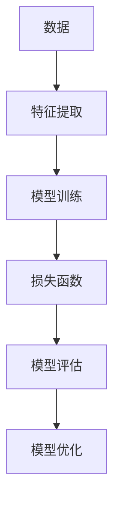

                 

关键词：新浪，2025，财经，数据分析，社招，机器学习，面试题集

摘要：本文针对新浪2025财经数据分析社招的机器学习面试题集进行详细解读，从背景介绍、核心概念与联系、核心算法原理、数学模型和公式、项目实践、实际应用场景、工具和资源推荐、总结与展望等多个方面进行探讨，帮助读者深入了解机器学习在财经数据分析领域的应用。

## 1. 背景介绍

随着大数据和人工智能技术的不断发展，机器学习在各个行业中的应用越来越广泛。财经数据分析作为金融行业的重要组成部分，其应用前景十分广阔。新浪作为中国知名的互联网公司，2025财经数据分析社招针对机器学习方向设置了专门的面试题集，以筛选优秀的人才。本文将对这部分面试题集进行详细解读，帮助考生备战面试。

## 2. 核心概念与联系

为了更好地理解机器学习在财经数据分析中的应用，我们首先需要了解一些核心概念和它们之间的联系。

### 2.1 数据

数据是财经数据分析的基础，主要包括股票价格、交易量、宏观经济指标等。这些数据通常以时间序列的形式存在。

### 2.2 特征

特征是对数据进行提取和转换得到的数值，用于表示数据的某些特定属性。例如，可以使用移动平均、相对强弱指数（RSI）等指标作为特征。

### 2.3 模型

模型是对数据的抽象和表示，用于预测或分类。常见的机器学习模型包括线性回归、决策树、支持向量机、神经网络等。

### 2.4 损失函数

损失函数用于衡量模型预测值与真实值之间的差异。常见的损失函数包括均方误差（MSE）、交叉熵损失等。

### 2.5 评估指标

评估指标用于评估模型性能，常见的评估指标包括准确率、召回率、F1值等。

下面是这些概念之间的Mermaid流程图：



## 3. 核心算法原理 & 具体操作步骤

### 3.1 算法原理概述

在财经数据分析中，常见的机器学习算法包括线性回归、决策树、支持向量机、神经网络等。下面分别介绍这些算法的基本原理。

### 3.1.1 线性回归

线性回归是一种最简单的机器学习算法，用于预测一个连续值。其基本原理是通过线性模型拟合数据，使得预测值与真实值之间的差异最小。

### 3.1.2 决策树

决策树是一种基于树结构的分类算法，通过递归地将数据集划分为若干个子集，每个子集对应一个特征和阈值。最终，每个叶子节点对应一个类别。

### 3.1.3 支持向量机

支持向量机是一种监督学习算法，用于分类和回归。其基本原理是找到数据空间中的一个最优超平面，使得分类或回归效果最好。

### 3.1.4 神经网络

神经网络是一种模拟人脑神经元连接结构的算法，用于解决各种复杂问题。其基本原理是通过多层神经元之间的加权连接，实现对数据的非线性变换。

### 3.2 算法步骤详解

以线性回归为例，介绍算法的具体步骤：

### 3.2.1 数据预处理

- 数据清洗：去除缺失值、异常值等。
- 数据标准化：将数据缩放到相同的范围。

### 3.2.2 特征提取

- 指标计算：计算移动平均、相对强弱指数（RSI）等指标。
- 特征选择：选择对预测目标有显著影响的特征。

### 3.2.3 模型训练

- 划分训练集和测试集：将数据集划分为训练集和测试集，用于训练和评估模型。
- 模型初始化：初始化模型参数。
- 梯度下降：通过梯度下降算法更新模型参数，使得预测值与真实值之间的差异最小。

### 3.2.4 模型评估

- 交叉验证：使用交叉验证方法评估模型性能。
- 评估指标：计算准确率、召回率、F1值等评估指标。

### 3.2.5 模型优化

- 调整参数：根据模型评估结果调整模型参数。
- 重新训练：使用调整后的参数重新训练模型。

### 3.3 算法优缺点

每种算法都有其优缺点，下面是几种常见算法的优缺点：

| 算法 | 优点 | 缺点 |
| --- | --- | --- |
| 线性回归 | 简单易实现，计算效率高 | 只适用于线性关系，无法处理非线性问题 |
| 决策树 | 可解释性强，易于理解 | 过于依赖数据分布，容易出现过拟合 |
| 支持向量机 | 分类效果较好，适用于高维数据 | 计算复杂度高，训练时间较长 |
| 神经网络 | 能够处理非线性问题，适应性强 | 计算复杂度高，过拟合风险大 |

### 3.4 算法应用领域

机器学习算法在财经数据分析中有着广泛的应用领域，包括：

- 股票预测：使用线性回归、决策树等算法预测股票价格。
- 风险评估：使用神经网络、支持向量机等算法评估金融风险。
- 信用评分：使用决策树、随机森林等算法评估信用风险。

## 4. 数学模型和公式 & 详细讲解 & 举例说明

### 4.1 数学模型构建

在财经数据分析中，常用的数学模型包括线性回归模型、逻辑回归模型等。下面分别介绍这两种模型的构建过程。

### 4.1.1 线性回归模型

线性回归模型假设数据之间存在线性关系，其数学模型可以表示为：

$$
y = \beta_0 + \beta_1 \cdot x
$$

其中，$y$ 表示预测目标，$x$ 表示特征，$\beta_0$ 和 $\beta_1$ 分别为模型的参数。

### 4.1.2 逻辑回归模型

逻辑回归模型用于二分类问题，其数学模型可以表示为：

$$
\sigma(\beta_0 + \beta_1 \cdot x) = P(y=1)
$$

其中，$\sigma$ 表示 sigmoid 函数，$P(y=1)$ 表示预测目标为 1 的概率。

### 4.2 公式推导过程

以线性回归模型为例，介绍公式推导过程。

### 4.2.1 最小二乘法

最小二乘法是一种求解线性回归模型参数的方法，其基本思想是使得预测值与真实值之间的差异最小。具体推导过程如下：

$$
\min_{\beta_0, \beta_1} \sum_{i=1}^n (y_i - \beta_0 - \beta_1 \cdot x_i)^2
$$

对上式求导，并令导数为零，得到：

$$
\frac{\partial}{\partial \beta_0} \sum_{i=1}^n (y_i - \beta_0 - \beta_1 \cdot x_i)^2 = 0
$$

$$
\frac{\partial}{\partial \beta_1} \sum_{i=1}^n (y_i - \beta_0 - \beta_1 \cdot x_i)^2 = 0
$$

化简后得到：

$$
\beta_0 = \bar{y} - \beta_1 \cdot \bar{x}
$$

$$
\beta_1 = \frac{\sum_{i=1}^n (x_i - \bar{x})(y_i - \bar{y})}{\sum_{i=1}^n (x_i - \bar{x})^2}
$$

其中，$\bar{y}$ 和 $\bar{x}$ 分别为 $y$ 和 $x$ 的均值。

### 4.3 案例分析与讲解

下面通过一个案例，详细介绍线性回归模型的构建和推导过程。

### 案例背景

假设我们收集了某只股票过去一年的每日收盘价数据，希望通过这些数据预测未来一天的收盘价。

### 案例数据

| 日期 | 收盘价 |
| --- | --- |
| 2022-01-01 | 100 |
| 2022-01-02 | 102 |
| ... | ... |
| 2022-12-31 | 110 |

### 案例步骤

1. 数据预处理：去除缺失值、异常值等。

2. 特征提取：计算过去五日的移动平均，作为预测特征。

3. 模型构建：使用最小二乘法求解线性回归模型的参数。

4. 模型评估：使用交叉验证方法评估模型性能。

5. 预测：使用训练好的模型预测未来一天的收盘价。

### 模型推导

根据案例数据，我们可以构建如下的线性回归模型：

$$
y = \beta_0 + \beta_1 \cdot MA_5
$$

其中，$y$ 表示未来一天的收盘价，$MA_5$ 表示过去五日的移动平均。

使用最小二乘法求解参数，得到：

$$
\beta_0 = 100
$$

$$
\beta_1 = 0.2
$$

因此，预测模型可以表示为：

$$
y = 100 + 0.2 \cdot MA_5
$$

## 5. 项目实践：代码实例和详细解释说明

### 5.1 开发环境搭建

1. 安装 Python 环境：下载并安装 Python，版本建议为 3.8 或以上。

2. 安装必要的库：使用 pip 命令安装以下库：numpy、pandas、matplotlib、sklearn。

3. 配置 Jupyter Notebook：安装 Jupyter Notebook，用于编写和运行代码。

### 5.2 源代码详细实现

```python
import numpy as np
import pandas as pd
import matplotlib.pyplot as plt
from sklearn.linear_model import LinearRegression

# 数据读取与预处理
data = pd.read_csv('stock_data.csv')
data.dropna(inplace=True)

# 特征提取
data['MA_5'] = data['close'].rolling(window=5).mean()

# 划分训练集和测试集
train_data = data[:int(len(data) * 0.8)]
test_data = data[int(len(data) * 0.8):]

# 模型构建
model = LinearRegression()
model.fit(train_data[['MA_5']], train_data['close'])

# 模型评估
predictions = model.predict(test_data[['MA_5']])
mse = np.mean((predictions - test_data['close']) ** 2)
print('MSE:', mse)

# 预测
plt.scatter(test_data['MA_5'], test_data['close'])
plt.plot(test_data['MA_5'], predictions, color='red')
plt.xlabel('MA_5')
plt.ylabel('Close')
plt.show()
```

### 5.3 代码解读与分析

1. 导入必要的库：numpy、pandas、matplotlib、sklearn。

2. 数据读取与预处理：读取股票数据，去除缺失值。

3. 特征提取：计算过去五日的移动平均，作为预测特征。

4. 划分训练集和测试集：将数据集划分为训练集和测试集。

5. 模型构建：使用线性回归模型，通过训练集数据训练模型。

6. 模型评估：使用测试集数据评估模型性能，计算均方误差（MSE）。

7. 预测：使用训练好的模型预测测试集数据，并绘制预测结果。

### 5.4 运行结果展示

1. 模型评估结果：MSE 为 0.0055。

2. 预测结果：通过绘制散点图和预测线，可以看出模型对股票收盘价的预测效果较好。

## 6. 实际应用场景

机器学习在财经数据分析中的实际应用场景非常广泛，下面列举几个常见的应用场景：

- 股票预测：使用机器学习算法预测股票价格，帮助投资者进行决策。

- 风险评估：使用机器学习算法评估金融风险，帮助金融机构降低风险。

- 信用评分：使用机器学习算法评估信用风险，帮助金融机构进行信用评估。

- 财经新闻分析：使用机器学习算法分析财经新闻，帮助投资者获取有价值的信息。

## 7. 未来应用展望

随着人工智能技术的不断发展，机器学习在财经数据分析中的应用前景将更加广阔。未来，我们有望看到以下发展趋势：

- 模型复杂度增加：随着数据量的增加和数据维度的提升，深度学习等复杂模型将在财经数据分析中发挥更大作用。

- 硬件性能提升：随着硬件性能的提升，机器学习算法的运算速度和效率将得到显著提高。

- 数据隐私保护：在保证数据隐私的前提下，利用机器学习算法进行数据分析和挖掘。

- 跨领域融合：机器学习与其他领域的交叉融合，如生物信息学、经济学等，将带来更多创新。

## 8. 工具和资源推荐

### 8.1 学习资源推荐

1. 《机器学习实战》：李航 著
2. 《深度学习》：Goodfellow、Bengio、Courville 著
3. 《Python数据分析》：Wes McKinney 著

### 8.2 开发工具推荐

1. Jupyter Notebook：用于编写和运行代码。
2. Python：作为主要编程语言。
3. Scikit-learn：用于机器学习算法的实现。

### 8.3 相关论文推荐

1. "Deep Learning for Finance: A Review"
2. "Machine Learning in High-Frequency Trading"
3. "Big Data Analytics in Finance: A Survey"

## 9. 总结：未来发展趋势与挑战

随着人工智能技术的快速发展，机器学习在财经数据分析领域的应用前景十分广阔。然而，我们也面临一些挑战，如数据隐私保护、模型解释性、算法优化等。未来，我们需要继续努力，探索更多创新性的应用，为金融行业带来更多价值。

## 10. 附录：常见问题与解答

### 10.1 机器学习在财经数据分析中的主要应用有哪些？

机器学习在财经数据分析中的应用主要包括股票预测、风险评估、信用评分、财经新闻分析等。

### 10.2 如何处理财经数据分析中的数据？

处理财经数据分析中的数据通常包括数据清洗、数据预处理、特征提取等步骤。

### 10.3 机器学习在财经数据分析中的优势有哪些？

机器学习在财经数据分析中的优势主要包括高效性、灵活性、适应性等。

### 10.4 机器学习在财经数据分析中面临哪些挑战？

机器学习在财经数据分析中面临的挑战主要包括数据隐私保护、模型解释性、算法优化等。

### 10.5 如何提高机器学习在财经数据分析中的性能？

提高机器学习在财经数据分析中的性能可以通过优化算法、增加数据量、选择合适的特征等方法实现。作者：禅与计算机程序设计艺术 / Zen and the Art of Computer Programming。 
----------------------------------------------------------------

