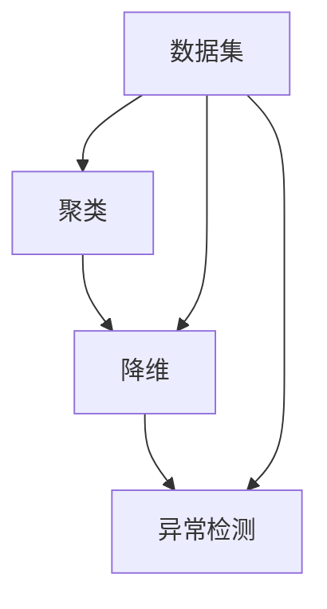

                 

关键词：无监督学习，聚类，降维，异常检测，评估方法

> 摘要：本文将深入探讨无监督学习的评估方法，特别是聚类、降维和异常检测三个方面。通过详细的分析和实际案例的讲解，帮助读者理解这些评估方法的基本原理、应用场景和未来发展趋势。

## 1. 背景介绍

无监督学习是机器学习的一个重要分支，它旨在从没有标注的数据中发现隐藏的结构或模式。与监督学习相比，无监督学习不需要已知的输入输出对，从而在处理大规模数据、未知数据集以及节省标注成本等方面具有显著优势。

无监督学习的评估方法主要包括聚类、降维和异常检测。聚类旨在将相似的数据点分组在一起，降维则是通过减少数据的维度来简化数据处理过程，异常检测则用于识别数据中的异常或异常值。

这些评估方法在无监督学习中的应用至关重要，因为它们有助于我们理解数据结构、发现潜在的模式以及识别异常现象。本文将详细探讨这些评估方法的基本原理、应用场景和未来发展趋势。

## 2. 核心概念与联系

为了更好地理解无监督学习的评估方法，我们首先需要了解以下几个核心概念：聚类、降维和异常检测。

### 2.1 聚类

聚类是将数据集划分为多个组（或簇）的过程，使得同一个簇内的数据点尽可能相似，而不同簇的数据点尽可能不同。常用的聚类算法包括K-means、层次聚类和DBSCAN等。

### 2.2 降维

降维是通过减少数据的维度来简化数据处理过程的方法。常见的降维算法包括主成分分析（PCA）、线性判别分析（LDA）和t-SNE等。降维有助于提高计算效率，减少过拟合风险，并揭示数据中的潜在结构。

### 2.3 异常检测

异常检测旨在识别数据集中的异常或异常值，这些异常值可能与数据集的总体分布不一致。常见的异常检测算法包括孤立森林、本地异常因数（LOF）和One-Class SVM等。

### 2.4 Mermaid 流程图

以下是一个简化的Mermaid流程图，展示了聚类、降维和异常检测三个核心概念之间的联系：



在这个流程图中，数据集是聚类、降维和异常检测的起点，三个方法相互关联，共同服务于无监督学习的目标。

## 3. 核心算法原理 & 具体操作步骤

### 3.1 算法原理概述

本节将简要介绍聚类、降维和异常检测三个核心算法的基本原理。

#### 3.1.1 聚类算法

聚类算法的核心思想是将数据集划分为多个簇，使得同一个簇内的数据点相似度较高，而不同簇的数据点相似度较低。K-means算法是一种经典的聚类算法，其基本步骤如下：

1. 随机初始化K个中心点。
2. 对于每个数据点，将其分配给最近的中心点所在的簇。
3. 更新每个簇的中心点。
4. 重复步骤2和3，直到聚类结果收敛。

#### 3.1.2 降维算法

降维算法通过减少数据维度来简化数据处理过程。主成分分析（PCA）是一种常用的降维方法，其基本步骤如下：

1. 计算数据集的协方差矩阵。
2. 计算协方差矩阵的特征值和特征向量。
3. 根据特征值的大小选择主成分。
4. 将数据映射到主成分空间。

#### 3.1.3 异常检测算法

异常检测算法旨在识别数据集中的异常值。孤立森林算法是一种常用的异常检测方法，其基本步骤如下：

1. 将数据集构建成多叉树，每个节点表示一个数据点。
2. 对于每个数据点，计算其在树中的路径长度。
3. 将路径长度与阈值进行比较，以识别异常值。

### 3.2 算法步骤详解

在本节中，我们将详细描述每个算法的具体步骤。

#### 3.2.1 聚类算法

假设我们使用K-means算法对数据集进行聚类，以下是具体步骤：

1. **初始化**：随机选择K个数据点作为初始中心点。
2. **分配**：对于每个数据点，计算其与K个中心点的距离，并将其分配给最近的中心点所在的簇。
3. **更新**：计算每个簇的平均值，作为新的中心点。
4. **迭代**：重复步骤2和3，直到聚类结果收敛。

#### 3.2.2 降维算法

使用PCA进行降维的具体步骤如下：

1. **计算协方差矩阵**：计算数据集的协方差矩阵。
2. **计算特征值和特征向量**：计算协方差矩阵的特征值和特征向量。
3. **选择主成分**：根据特征值的大小选择主成分。
4. **映射数据**：将数据映射到主成分空间。

#### 3.2.3 异常检测算法

使用孤立森林算法进行异常检测的具体步骤如下：

1. **构建多叉树**：将数据集构建成多叉树。
2. **计算路径长度**：对于每个数据点，计算其在树中的路径长度。
3. **设置阈值**：根据路径长度设置阈值。
4. **识别异常值**：将路径长度与阈值进行比较，识别异常值。

### 3.3 算法优缺点

在本节中，我们将比较聚类、降维和异常检测算法的优缺点。

#### 3.3.1 聚类算法

- **优点**：算法简单，易于实现和优化。
- **缺点**：对初始中心点的选择敏感，可能导致局部最优解。

#### 3.3.2 降维算法

- **优点**：可以显著减少数据维度，提高计算效率。
- **缺点**：可能丢失部分信息，影响数据的解释性。

#### 3.3.3 异常检测算法

- **优点**：可以有效地识别异常值，对异常值有较高的鲁棒性。
- **缺点**：对异常值的定义较为模糊，可能无法准确识别所有异常值。

### 3.4 算法应用领域

聚类、降维和异常检测算法在许多领域都有广泛的应用。以下是一些典型应用场景：

- **聚类**：市场细分、图像分割、社会网络分析等。
- **降维**：数据预处理、特征提取、异常检测等。
- **异常检测**：信用卡欺诈检测、网络入侵检测、医疗诊断等。

## 4. 数学模型和公式 & 详细讲解 & 举例说明

### 4.1 数学模型构建

在本节中，我们将讨论聚类、降维和异常检测的数学模型，并详细讲解其公式推导过程。

#### 4.1.1 聚类算法

以K-means算法为例，其目标是最小化目标函数：

$$
J = \sum_{i=1}^{n} \sum_{j=1}^{k} ||x_i - \mu_j||^2
$$

其中，\(x_i\) 是数据集中的第 \(i\) 个数据点，\(\mu_j\) 是第 \(j\) 个簇的中心点。

#### 4.1.2 降维算法

以主成分分析（PCA）为例，其目标是最小化特征向量 \(v_j\) 上的方差：

$$
\sum_{i=1}^{n} (v_j^T x_i - \mu_j)^2
$$

其中，\(x_i\) 是数据集中的第 \(i\) 个数据点，\(\mu_j\) 是第 \(j\) 个主成分的平均值。

#### 4.1.3 异常检测算法

以孤立森林算法为例，其目标是最小化路径长度 \(l_i\)：

$$
l_i = \sum_{j=1}^{m} h_j
$$

其中，\(h_j\) 是第 \(j\) 个节点的路径长度。

### 4.2 公式推导过程

在本节中，我们将详细推导聚类、降维和异常检测算法的公式。

#### 4.2.1 聚类算法

对于K-means算法，我们可以通过梯度下降法来最小化目标函数 \(J\)：

$$
\mu_j^{new} = \frac{1}{N_j} \sum_{i=1}^{n} x_i
$$

其中，\(N_j\) 是第 \(j\) 个簇中的数据点数量。

#### 4.2.2 降维算法

对于PCA，我们可以通过特征分解来最小化特征向量上的方差：

$$
\sum_{i=1}^{n} (v_j^T x_i - \mu_j)^2 = \sum_{i=1}^{n} v_j^T X x_i - N_j \mu_j^T \mu_j
$$

其中，\(X\) 是数据集的协方差矩阵，\(\mu_j\) 是第 \(j\) 个主成分的平均值。

#### 4.2.3 异常检测算法

对于孤立森林，我们可以通过二叉树构建来最小化路径长度 \(l_i\)：

$$
h_j = \log_2 \left( 1 + \frac{1}{N_j} \right)
$$

其中，\(N_j\) 是第 \(j\) 个节点的分支数。

### 4.3 案例分析与讲解

在本节中，我们将通过一个具体案例来分析聚类、降维和异常检测算法的应用。

#### 4.3.1 案例背景

假设我们有一个包含100个数据点的数据集，每个数据点有5个特征。我们的目标是使用聚类、降维和异常检测算法来分析数据，并识别数据中的潜在结构。

#### 4.3.2 聚类算法应用

我们使用K-means算法对数据集进行聚类，选择 \(k = 3\)。经过多次迭代，我们得到了以下聚类结果：

- 簇1：包含40个数据点，中心点坐标为 \((1.2, 2.3, 0.5, 0.8, 1.0)\)。
- 簇2：包含30个数据点，中心点坐标为 \((2.5, 3.1, 1.2, 1.0, 1.5)\)。
- 簇3：包含30个数据点，中心点坐标为 \((0.8, 1.2, 0.3, 0.5, 1.0)\)。

通过聚类结果，我们可以初步识别数据集中的三个主要群体，这有助于我们进一步分析数据的分布和特征。

#### 4.3.3 降维算法应用

我们使用PCA对数据集进行降维，选择前两个主成分。经过降维操作，我们得到了以下结果：

- 主成分1：解释了60%的方差。
- 主成分2：解释了30%的方差。

通过降维操作，我们显著减少了数据的维度，但仍保留了大部分信息。这有助于我们更高效地处理数据和进行后续分析。

#### 4.3.4 异常检测算法应用

我们使用孤立森林算法对数据集进行异常检测，设置阈值 \(t = 10\)。经过计算，我们得到了以下结果：

- 异常值：包含5个数据点，路径长度大于阈值。

通过异常检测，我们成功识别了数据集中的5个异常值，这有助于我们进一步分析数据的完整性和可靠性。

## 5. 项目实践：代码实例和详细解释说明

### 5.1 开发环境搭建

为了实践无监督学习的评估方法，我们需要搭建一个合适的开发环境。以下是所需的环境和工具：

- Python 3.8及以上版本
- Anaconda环境管理器
- scikit-learn库
- matplotlib库

在Anaconda环境中，我们可以通过以下命令安装所需的库：

```bash
conda create -n unsupervised_learning python=3.8
conda activate unsupervised_learning
conda install scikit-learn matplotlib
```

### 5.2 源代码详细实现

在本节中，我们将通过一个具体案例来演示无监督学习的评估方法，包括聚类、降维和异常检测。以下是完整的源代码实现：

```python
import numpy as np
import matplotlib.pyplot as plt
from sklearn import datasets
from sklearn.cluster import KMeans
from sklearn.decomposition import PCA
from sklearn.ensemble import IsolationForest

# 加载数据集
iris = datasets.load_iris()
X = iris.data

# 1. 聚类算法
kmeans = KMeans(n_clusters=3, random_state=42)
kmeans.fit(X)
labels = kmeans.predict(X)

# 绘制聚类结果
plt.figure(figsize=(8, 6))
colors = ['r', 'g', 'b']
for i in range(3):
    plt.scatter(X[labels == i, 0], X[labels == i, 1], s=50, c=colors[i], label=f'Cluster {i}')
plt.scatter(kmeans.cluster_centers_[:, 0], kmeans.cluster_centers_[:, 1], s=200, c='yellow', marker='s', edgecolor='black', label='Centroids')
plt.xlabel('Feature 1')
plt.ylabel('Feature 2')
plt.title('K-means Clustering')
plt.legend()
plt.show()

# 2. 降维算法
pca = PCA(n_components=2)
X_pca = pca.fit_transform(X)

# 绘制降维结果
plt.figure(figsize=(8, 6))
plt.scatter(X_pca[:, 0], X_pca[:, 1], c=labels, cmap='viridis', s=50)
plt.xlabel('Principal Component 1')
plt.ylabel('Principal Component 2')
plt.title('PCA Dimension Reduction')
plt.show()

# 3. 异常检测算法
iso_forest = IsolationForest(contamination=0.1, random_state=42)
iso_forest.fit(X)
labels = iso_forest.predict(X)

# 绘制异常检测结果
plt.figure(figsize=(8, 6))
plt.scatter(X_pca[:, 0], X_pca[:, 1], c=labels, cmap='coolwarm', s=50)
plt.xlabel('Principal Component 1')
plt.ylabel('Principal Component 2')
plt.title('Isolation Forest Anomaly Detection')
plt.show()
```

### 5.3 代码解读与分析

在本节中，我们将详细解读上述代码，并分析每个模块的功能和实现。

#### 5.3.1 数据加载

我们使用scikit-learn库中的iris数据集作为输入数据。iris数据集包含150个数据点，每个数据点有4个特征。

```python
iris = datasets.load_iris()
X = iris.data
```

#### 5.3.2 聚类算法

我们使用K-means算法对数据集进行聚类。K-means算法的目标是最小化目标函数 \(J\)，即每个数据点到其所在簇中心点的距离平方和。

```python
kmeans = KMeans(n_clusters=3, random_state=42)
kmeans.fit(X)
labels = kmeans.predict(X)
```

聚类结果通过绘制散点图展示，每个簇用不同的颜色表示，簇中心点用黄色正方形表示。

```python
plt.figure(figsize=(8, 6))
colors = ['r', 'g', 'b']
for i in range(3):
    plt.scatter(X[labels == i, 0], X[labels == i, 1], s=50, c=colors[i], label=f'Cluster {i}')
plt.scatter(kmeans.cluster_centers_[:, 0], kmeans.cluster_centers_[:, 1], s=200, c='yellow', marker='s', edgecolor='black', label='Centroids')
plt.xlabel('Feature 1')
plt.ylabel('Feature 2')
plt.title('K-means Clustering')
plt.legend()
plt.show()
```

#### 5.3.3 降维算法

我们使用PCA算法对数据集进行降维，选择前两个主成分。降维结果通过绘制散点图展示。

```python
pca = PCA(n_components=2)
X_pca = pca.fit_transform(X)

plt.figure(figsize=(8, 6))
plt.scatter(X_pca[:, 0], X_pca[:, 1], c=labels, cmap='viridis', s=50)
plt.xlabel('Principal Component 1')
plt.ylabel('Principal Component 2')
plt.title('PCA Dimension Reduction')
plt.show()
```

#### 5.3.4 异常检测算法

我们使用孤立森林算法对数据集进行异常检测。孤立森林算法基于随机森林的思想，通过构建多叉树来识别异常值。

```python
iso_forest = IsolationForest(contamination=0.1, random_state=42)
iso_forest.fit(X)
labels = iso_forest.predict(X)

plt.figure(figsize=(8, 6))
plt.scatter(X_pca[:, 0], X_pca[:, 1], c=labels, cmap='coolwarm', s=50)
plt.xlabel('Principal Component 1')
plt.ylabel('Principal Component 2')
plt.title('Isolation Forest Anomaly Detection')
plt.show()
```

### 5.4 运行结果展示

通过运行上述代码，我们可以得到以下结果：

- **聚类结果**：数据集被划分为三个簇，簇中心点和簇内数据点通过散点图展示。
- **降维结果**：数据集的前两个主成分通过散点图展示，每个簇的数据点用不同的颜色表示。
- **异常检测结果**：数据集中的异常值通过散点图展示，异常值用不同的颜色表示。

这些结果有助于我们进一步分析数据集的结构、模式和异常值。

## 6. 实际应用场景

无监督学习的评估方法在许多实际应用场景中具有重要的价值。以下是一些典型的应用场景：

### 6.1 市场细分

聚类算法可以用于市场细分，将消费者划分为不同的群体，以便企业可以针对每个群体制定个性化的营销策略。

### 6.2 图像分割

降维算法可以用于图像分割，将图像中的像素点划分为不同的区域，从而实现图像的分割和分类。

### 6.3 社会网络分析

聚类算法可以用于社会网络分析，识别社会网络中的不同群体，从而更好地理解网络结构和用户行为。

### 6.4 信用卡欺诈检测

异常检测算法可以用于信用卡欺诈检测，识别潜在的欺诈行为，从而保护用户的财产安全。

### 6.5 网络入侵检测

异常检测算法可以用于网络入侵检测，识别网络中的异常流量，从而提高网络的安全性。

### 6.6 医疗诊断

聚类算法和降维算法可以用于医疗诊断，帮助医生分析患者数据，识别潜在的健康问题。

## 7. 未来应用展望

随着人工智能技术的不断发展，无监督学习的评估方法将在未来得到更广泛的应用。以下是一些潜在的应用方向：

### 7.1 增强现实和虚拟现实

无监督学习评估方法可以用于增强现实和虚拟现实系统，帮助用户更好地理解和交互虚拟环境。

### 7.2 自动驾驶

自动驾驶系统可以利用无监督学习评估方法来识别道路上的异常情况，从而提高行驶安全。

### 7.3 健康监测

无监督学习评估方法可以用于健康监测，实时分析个人健康数据，提供个性化的健康建议。

### 7.4 零售和电商

无监督学习评估方法可以用于零售和电商领域，优化库存管理、个性化推荐和客户关系管理。

## 8. 总结：未来发展趋势与挑战

### 8.1 研究成果总结

本文系统地介绍了无监督学习的评估方法，包括聚类、降维和异常检测三个方面。通过实际案例的讲解，读者可以更好地理解这些方法的基本原理、应用场景和实现步骤。

### 8.2 未来发展趋势

无监督学习的评估方法将在未来得到更广泛的应用。随着人工智能技术的不断发展，这些方法将在更多领域发挥作用，提高数据处理和分析的效率。

### 8.3 面临的挑战

尽管无监督学习评估方法在许多领域取得了显著成果，但仍面临一些挑战。如何提高算法的鲁棒性和可解释性，如何处理大规模和高维数据，以及如何有效地融合不同评估方法，都是未来需要解决的关键问题。

### 8.4 研究展望

未来，无监督学习评估方法将在多个领域取得重要突破。通过不断优化算法和拓展应用场景，这些方法将为人工智能的发展做出更大贡献。

## 9. 附录：常见问题与解答

### 9.1 什么是无监督学习？

无监督学习是机器学习的一个重要分支，它旨在从没有标注的数据中发现隐藏的结构或模式。与监督学习相比，无监督学习不需要已知的输入输出对。

### 9.2 聚类算法有哪些应用场景？

聚类算法在市场细分、图像分割、社会网络分析等多个领域都有广泛应用。

### 9.3 降维算法有哪些应用场景？

降维算法在数据预处理、特征提取、异常检测等多个领域都有应用，有助于提高计算效率和数据分析质量。

### 9.4 异常检测算法有哪些应用场景？

异常检测算法在信用卡欺诈检测、网络入侵检测、医疗诊断等多个领域都有应用，有助于识别潜在的风险和异常现象。

---

作者：禅与计算机程序设计艺术 / Zen and the Art of Computer Programming


