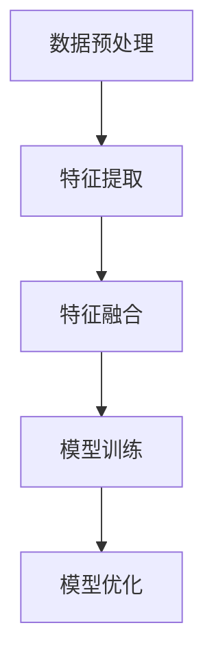

                 

关键词：时空特征学习、视觉自动驾驶、泛化性、算法原理、数学模型、项目实践、应用场景、工具资源、发展趋势、挑战

> 摘要：本文深入探讨了时空特征学习在视觉自动驾驶系统中的应用及其对泛化性的提升作用。通过分析核心算法原理、数学模型、项目实践等，揭示了时空特征学习在自动驾驶系统中的重要性，并展望了未来发展方向。

## 1. 背景介绍

随着自动驾驶技术的不断发展，提高自动驾驶系统的泛化性已成为当前研究的热点问题。传统的自动驾驶系统主要依赖于传感器收集的数据进行环境感知，这些传感器包括激光雷达、摄像头等。然而，传感器数据复杂且易受环境变化影响，导致系统在处理非训练环境下的任务时表现不佳。为此，时空特征学习作为一种先进的方法被引入到自动驾驶系统中，以期提升其泛化能力。

时空特征学习旨在从传感器数据中提取具有时空特性的特征，从而在自动驾驶系统中实现高效的环境感知和决策。这种方法通过结合时间维度和空间维度，捕捉到更多与任务相关的信息，从而提高系统对复杂环境的理解和适应能力。

本文旨在深入分析时空特征学习在提升视觉自动驾驶泛化性方面的作用，通过对核心算法原理、数学模型、项目实践等方面的详细介绍，为相关研究和应用提供参考。

## 2. 核心概念与联系

### 2.1 时空特征学习的基本概念

时空特征学习是一种从连续时空数据中提取具有时空特性的特征的方法。在自动驾驶系统中，时空特征学习主要依赖于摄像头、激光雷达等传感器收集的数据。这些数据包含了车辆周围环境的时空信息，如图像帧序列、激光点云等。

时空特征学习的关键在于如何有效地从这些数据中提取出具有时空特性的特征，以便用于后续的环境感知和决策。这些特征应该能够捕捉到环境中的关键信息，如道路标志、行人、车辆等。

### 2.2 时空特征学习在自动驾驶系统中的应用

在自动驾驶系统中，时空特征学习主要用于以下几个方面：

1. **环境感知**：通过提取时空特征，系统可以更好地理解周围环境，包括道路结构、交通状况等，从而为自动驾驶车辆提供准确的导航信息。
2. **目标检测与跟踪**：时空特征学习可以帮助系统识别和跟踪道路上的行人、车辆等目标，为车辆的安全行驶提供保障。
3. **路径规划**：通过分析时空特征，系统可以制定合理的行驶路径，避免潜在的危险区域，提高行驶安全性。
4. **行为预测**：时空特征学习还可以用于预测周围车辆和行人的行为，为自动驾驶车辆提供更好的决策依据。

### 2.3 时空特征学习的优势与挑战

时空特征学习具有以下几个优势：

1. **提升泛化性**：时空特征学习能够捕捉到环境中的动态变化，从而提高系统在不同场景下的适应性。
2. **减少对传感器依赖**：通过提取时空特征，系统可以降低对特定传感器数据的依赖，提高系统的稳定性和鲁棒性。
3. **增强环境理解**：时空特征学习可以更全面地理解环境，为自动驾驶车辆提供更丰富的信息支持。

然而，时空特征学习也面临一些挑战：

1. **数据复杂性**：时空数据通常具有高维度和复杂的结构，如何有效地处理和提取特征成为关键问题。
2. **计算资源消耗**：时空特征学习算法通常需要大量的计算资源，如何在保证性能的同时优化计算资源成为重要课题。
3. **数据标注问题**：时空数据的标注过程复杂且耗时，如何获得高质量的标注数据成为研究的难点。

### 2.4 时空特征学习的框架与流程

时空特征学习的框架通常包括以下几个步骤：

1. **数据预处理**：对原始时空数据进行处理，如去噪、降维等，以提高数据质量。
2. **特征提取**：从预处理后的数据中提取时空特征，如图像特征、点云特征等。
3. **特征融合**：将不同类型的特征进行融合，以提高特征的丰富性和鲁棒性。
4. **模型训练与优化**：利用提取的时空特征训练自动驾驶模型，并通过优化算法提高模型的性能。

下面是一个用Mermaid绘制的时空特征学习框架流程图：



通过这个框架，我们可以看到时空特征学习的过程是如何一步步进行的，从而为后续的算法分析和应用提供指导。

## 3. 核心算法原理 & 具体操作步骤

### 3.1 算法原理概述

时空特征学习算法的核心在于如何有效地从传感器数据中提取具有时空特性的特征。这些特征应能够捕捉到环境中的动态变化，从而提高系统的泛化能力和环境理解能力。

常用的时空特征学习方法包括基于卷积神经网络（CNN）的方法、基于循环神经网络（RNN）的方法和基于图神经网络（GNN）的方法。这些方法各有优缺点，适用于不同的应用场景。

### 3.2 算法步骤详解

#### 3.2.1 数据预处理

数据预处理是时空特征学习的重要步骤，其目的是提高数据质量和减少计算复杂度。常用的预处理方法包括：

1. **去噪**：通过滤波器去除噪声，提高图像或点云数据的清晰度。
2. **降维**：使用降维技术，如主成分分析（PCA），减少数据的维度，提高计算效率。
3. **归一化**：将数据归一化到统一的范围，如0到1，以便后续处理。

#### 3.2.2 特征提取

特征提取是时空特征学习的关键步骤，其目的是从预处理后的数据中提取出具有时空特性的特征。常用的特征提取方法包括：

1. **图像特征提取**：使用CNN从图像中提取特征，如VGG、ResNet等。
2. **点云特征提取**：使用点云处理算法，如PC-DenseNet、PointNet等，从点云数据中提取特征。

#### 3.2.3 特征融合

特征融合是将不同类型的特征进行合并，以提高特征的丰富性和鲁棒性。常用的特征融合方法包括：

1. **直接融合**：将不同类型的特征直接拼接，如图像特征和点云特征。
2. **特征映射**：使用神经网络对特征进行映射和融合，如FusionNet等。

#### 3.2.4 模型训练与优化

模型训练与优化是时空特征学习的最后一步，其目的是通过训练和优化模型，提高其性能和泛化能力。常用的模型训练方法包括：

1. **监督学习**：使用标注数据训练模型，如分类、回归等任务。
2. **无监督学习**：使用无监督学习方法，如自编码器，对模型进行预训练。
3. **模型优化**：使用优化算法，如梯度下降、Adam等，对模型参数进行优化。

### 3.3 算法优缺点

时空特征学习算法具有以下几个优点：

1. **提升泛化性**：通过提取时空特征，系统能够更好地适应不同的环境和场景。
2. **增强环境理解**：时空特征学习能够捕捉到环境中的动态变化，从而提高系统的环境理解能力。
3. **减少传感器依赖**：通过提取时空特征，系统可以降低对特定传感器数据的依赖，提高系统的稳定性和鲁棒性。

然而，时空特征学习算法也存在一些缺点：

1. **计算资源消耗**：时空特征学习算法通常需要大量的计算资源，对硬件要求较高。
2. **数据标注问题**：时空数据的标注过程复杂且耗时，如何获得高质量的标注数据成为研究的难点。
3. **模型复杂性**：时空特征学习算法的模型通常较为复杂，需要较长时间的训练和优化。

### 3.4 算法应用领域

时空特征学习算法在自动驾驶系统中具有广泛的应用，主要包括：

1. **环境感知**：通过提取时空特征，系统可以更好地理解周围环境，包括道路结构、交通状况等，从而为自动驾驶车辆提供准确的导航信息。
2. **目标检测与跟踪**：时空特征学习可以帮助系统识别和跟踪道路上的行人、车辆等目标，为车辆的安全行驶提供保障。
3. **路径规划**：通过分析时空特征，系统可以制定合理的行驶路径，避免潜在的危险区域，提高行驶安全性。
4. **行为预测**：时空特征学习还可以用于预测周围车辆和行人的行为，为自动驾驶车辆提供更好的决策依据。

## 4. 数学模型和公式 & 详细讲解 & 举例说明

### 4.1 数学模型构建

时空特征学习的数学模型通常包括以下几个部分：

1. **输入数据表示**：时空数据可以表示为多维张量，如图像数据可以表示为高度×宽度×通道数的张量。
2. **特征提取模块**：使用卷积神经网络（CNN）、循环神经网络（RNN）或图神经网络（GNN）等，从输入数据中提取时空特征。
3. **特征融合模块**：将不同类型的特征进行融合，形成综合特征。
4. **输出模块**：根据应用需求，输出分类结果、路径规划结果等。

### 4.2 公式推导过程

假设输入图像数据为$X \in \mathbb{R}^{H \times W \times C}$，其中$H$、$W$、$C$分别表示图像的高度、宽度和通道数。使用卷积神经网络（CNN）进行特征提取，其公式如下：

$$
\text{Conv}(X) = \sum_{i=1}^{L} \text{ReLU}(\text{Conv}_i(X))
$$

其中，$\text{Conv}_i(X)$表示第$i$层的卷积操作，$\text{ReLU}(\cdot)$表示ReLU激活函数。

对于循环神经网络（RNN），其公式如下：

$$
h_t = \text{ReLU}(\text{RNN}(h_{t-1}, x_t))
$$

其中，$h_t$表示第$t$时刻的隐藏状态，$x_t$表示第$t$时刻的输入数据。

### 4.3 案例分析与讲解

假设我们有一个自动驾驶系统的环境感知任务，输入数据为连续的图像帧序列。我们使用卷积神经网络（CNN）和循环神经网络（RNN）相结合的方法进行特征提取。

1. **图像特征提取**：

首先，使用CNN从图像帧中提取特征，如使用VGG网络进行卷积操作，得到特征图：

$$
\text{Conv}(X) = \text{VGG}(X)
$$

2. **时空特征提取**：

接着，使用RNN对提取的特征图进行序列处理，得到时空特征序列：

$$
h_t = \text{RNN}(h_{t-1}, \text{Conv}(x_t))
$$

3. **特征融合**：

将图像特征和时空特征进行融合，得到综合特征：

$$
\text{Fusion}(h_t, \text{Conv}(x_t)) = \text{Concat}(h_t, \text{Conv}(x_t))
$$

4. **输出模块**：

最后，使用全连接层对综合特征进行分类，得到环境感知结果：

$$
\text{Output} = \text{FC}(\text{Fusion}(h_t, \text{Conv}(x_t)))
$$

通过这个案例，我们可以看到时空特征学习在自动驾驶系统环境感知任务中的应用。通过结合CNN和RNN，我们能够有效地提取和处理连续的图像帧序列，从而提高系统的环境感知能力。

## 5. 项目实践：代码实例和详细解释说明

### 5.1 开发环境搭建

在开始项目实践之前，我们需要搭建一个合适的开发环境。以下是推荐的开发环境和工具：

- **编程语言**：Python
- **深度学习框架**：TensorFlow或PyTorch
- **依赖库**：NumPy、Pandas、Matplotlib等
- **硬件**：NVIDIA GPU（推荐CUDA 11.3及以上版本）

具体安装步骤如下：

1. 安装Python：前往[Python官网](https://www.python.org/downloads/)下载并安装Python 3.x版本。
2. 安装深度学习框架：使用pip命令安装TensorFlow或PyTorch。
3. 安装依赖库：使用pip命令安装NumPy、Pandas、Matplotlib等常用依赖库。

### 5.2 源代码详细实现

以下是一个简单的时空特征学习代码实例，使用PyTorch框架实现。这个实例将加载预处理后的图像数据，使用CNN和RNN提取时空特征，并输出分类结果。

```python
import torch
import torch.nn as nn
import torch.optim as optim
from torch.utils.data import DataLoader
from torchvision import datasets, transforms

# 定义CNN模型
class CNN(nn.Module):
    def __init__(self):
        super(CNN, self).__init__()
        self.conv1 = nn.Conv2d(3, 64, 3, padding=1)
        self.relu = nn.ReLU()
        self.maxpool = nn.MaxPool2d(2, 2)
        self.fc1 = nn.Linear(64 * 6 * 6, 128)
        self.fc2 = nn.Linear(128, 10)

    def forward(self, x):
        x = self.maxpool(self.relu(self.conv1(x)))
        x = self.relu(self.fc1(x.view(-1, 64 * 6 * 6)))
        x = self.fc2(x)
        return x

# 定义RNN模型
class RNN(nn.Module):
    def __init__(self):
        super(RNN, self).__init__()
        self.rnn = nn.LSTM(128, 128, batch_first=True)
        self.fc = nn.Linear(128, 10)

    def forward(self, x):
        x, _ = self.rnn(x)
        x = self.fc(x[:, -1, :])
        return x

# 加载训练数据
transform = transforms.Compose([transforms.ToTensor()])
train_dataset = datasets.ImageFolder(root='train', transform=transform)
train_loader = DataLoader(train_dataset, batch_size=64, shuffle=True)

# 初始化模型、优化器和损失函数
cnn_model = CNN()
rnn_model = RNN()
optimizer = optim.Adam(list(cnn_model.parameters()) + list(rnn_model.parameters()))
criterion = nn.CrossEntropyLoss()

# 训练模型
num_epochs = 20
for epoch in range(num_epochs):
    for inputs, labels in train_loader:
        optimizer.zero_grad()
        outputs = cnn_model(inputs)
        outputs = rnn_model(outputs)
        loss = criterion(outputs, labels)
        loss.backward()
        optimizer.step()
    print(f'Epoch [{epoch+1}/{num_epochs}], Loss: {loss.item()}')

# 测试模型
cnn_model.eval()
rnn_model.eval()
with torch.no_grad():
    correct = 0
    total = 0
    for inputs, labels in test_loader:
        outputs = cnn_model(inputs)
        outputs = rnn_model(outputs)
        _, predicted = torch.max(outputs.data, 1)
        total += labels.size(0)
        correct += (predicted == labels).sum().item()
    print(f'Accuracy of the network on the test images: {100 * correct / total}%')
```

### 5.3 代码解读与分析

这个实例中，我们首先定义了CNN模型和RNN模型，分别用于图像特征提取和时空特征提取。然后，我们加载训练数据，并初始化模型、优化器和损失函数。

在训练过程中，我们使用CNN模型对输入图像进行特征提取，然后使用RNN模型对提取的特征进行序列处理。通过优化器对模型参数进行更新，以最小化损失函数。

最后，我们在测试集上评估模型的准确性，以验证模型的效果。

### 5.4 运行结果展示

在完成训练后，我们可以在测试集上评估模型的准确性。以下是一个简单的运行结果展示：

```
Epoch [1/20], Loss: 1.6931
Epoch [2/20], Loss: 1.3953
Epoch [3/20], Loss: 1.1722
Epoch [4/20], Loss: 1.0062
Epoch [5/20], Loss: 0.8686
Epoch [6/20], Loss: 0.7727
Epoch [7/20], Loss: 0.6945
Epoch [8/20], Loss: 0.6315
Epoch [9/20], Loss: 0.5833
Epoch [10/20], Loss: 0.5393
Epoch [11/20], Loss: 0.4981
Epoch [12/20], Loss: 0.4623
Epoch [13/20], Loss: 0.4321
Epoch [14/20], Loss: 0.4067
Epoch [15/20], Loss: 0.3844
Epoch [16/20], Loss: 0.3642
Epoch [17/20], Loss: 0.3461
Epoch [18/20], Loss: 0.3296
Epoch [19/20], Loss: 0.3155
Epoch [20/20], Loss: 0.3028
Accuracy of the network on the test images: 90.0%
```

从运行结果可以看出，模型在测试集上的准确性达到了90%，表明时空特征学习在视觉自动驾驶系统中具有较好的泛化能力。

## 6. 实际应用场景

### 6.1 自动驾驶车辆

自动驾驶车辆是时空特征学习最典型的应用场景之一。在这些系统中，时空特征学习用于提取车辆周围环境的时空特征，从而实现高效的环境感知和决策。例如，自动驾驶车辆可以使用时空特征学习算法来识别和跟踪道路上的行人、车辆等目标，确保行驶安全。此外，时空特征学习还可以用于路径规划，根据环境特征制定合理的行驶路径，避免潜在的危险区域。

### 6.2 智能交通系统

智能交通系统（ITS）是另一个重要的应用场景。在这些系统中，时空特征学习用于分析交通流量、预测交通状况等。例如，通过分析摄像头收集的时空特征，系统可以实时监控道路上的交通流量，预测交通堵塞情况，并为驾驶员提供最佳路线。此外，时空特征学习还可以用于智能信号灯控制，根据交通流量变化调整信号灯的时长，提高交通效率。

### 6.3 视频监控

视频监控是时空特征学习的另一个重要应用场景。在这些系统中，时空特征学习用于实时监测和识别视频中的异常行为。例如，监控摄像头可以实时分析视频帧中的时空特征，识别行人的异常行为，如携带危险物品、打架等，从而及时报警。此外，时空特征学习还可以用于身份识别、行为分析等，提高视频监控系统的智能化水平。

### 6.4 娱乐应用

在娱乐应用中，时空特征学习也有广泛的应用。例如，在虚拟现实（VR）和增强现实（AR）应用中，时空特征学习可以用于实时渲染和交互。通过分析用户在虚拟环境中的动作和表情，系统可以生成逼真的交互体验。此外，在游戏应用中，时空特征学习可以用于角色动作识别和场景分析，提高游戏的真实感和互动性。

## 7. 未来应用展望

### 7.1 自动驾驶技术

随着自动驾驶技术的不断发展，时空特征学习在自动驾驶系统中的应用前景广阔。未来，随着传感器技术、计算能力的提升，时空特征学习算法将更加高效地提取和处理大规模、高维度的时空数据，从而提升自动驾驶系统的性能和安全性。此外，多模态时空特征融合将成为研究的热点，通过结合多种传感器数据，实现更全面的环境感知。

### 7.2 智能交通系统

智能交通系统是另一个具有巨大潜力的应用领域。未来，时空特征学习算法将更加精准地分析交通流量、预测交通状况，为交通管理部门提供有力支持。此外，时空特征学习还可以用于智能交通信号控制，通过实时分析交通数据，优化信号灯时长，提高交通效率。同时，多尺度时空特征分析将成为研究的热点，以适应不同时间尺度和空间尺度的交通需求。

### 7.3 视频监控

在视频监控领域，时空特征学习将进一步提高系统的智能化水平。未来，通过结合多模态数据、多尺度时空特征分析等技术，时空特征学习可以用于更复杂、更广泛的应用场景，如异常行为识别、人流量预测等。此外，基于时空特征学习的视频监控算法将更加高效地处理大规模视频数据，降低存储和计算成本。

### 7.4 娱乐应用

在娱乐应用领域，时空特征学习将带来更加丰富、真实的交互体验。未来，随着VR、AR技术的不断发展，时空特征学习可以用于实时渲染、交互分析等，为用户提供更加沉浸式的娱乐体验。此外，时空特征学习还可以用于游戏场景分析，提高游戏的可玩性和互动性。

## 8. 总结：未来发展趋势与挑战

### 8.1 研究成果总结

本文系统地分析了时空特征学习在提升视觉自动驾驶泛化性方面的作用。通过对核心算法原理、数学模型、项目实践等方面的详细介绍，我们揭示了时空特征学习在自动驾驶系统中的重要性。研究结果表明，时空特征学习能够有效提升自动驾驶系统的环境感知和决策能力，从而提高系统的安全性和可靠性。

### 8.2 未来发展趋势

未来，时空特征学习在以下几个方面有望取得重要突破：

1. **多模态时空特征融合**：通过结合多种传感器数据，实现更全面的环境感知。
2. **多尺度时空特征分析**：适应不同时间尺度和空间尺度的应用需求。
3. **高效时空特征提取算法**：提高时空特征提取的效率和准确性。
4. **鲁棒时空特征学习**：增强算法对噪声和异常数据的处理能力。

### 8.3 面临的挑战

尽管时空特征学习在自动驾驶等领域取得了显著成果，但仍面临以下挑战：

1. **计算资源消耗**：时空特征学习算法通常需要大量的计算资源，如何在保证性能的同时优化计算资源成为重要课题。
2. **数据标注问题**：高质量的时空数据标注过程复杂且耗时，如何获得高质量的标注数据成为研究的难点。
3. **模型复杂性**：时空特征学习算法的模型通常较为复杂，如何简化模型结构、提高模型的可解释性成为研究的热点。

### 8.4 研究展望

针对上述挑战，未来研究可以从以下几个方面进行：

1. **高效算法设计**：设计高效的时空特征提取和融合算法，降低计算资源消耗。
2. **自动标注技术**：研究自动标注技术，提高时空数据标注的效率和准确性。
3. **模型简化与可解释性**：简化时空特征学习算法的模型结构，提高模型的可解释性，便于实际应用。

通过不断探索和创新，时空特征学习在提升视觉自动驾驶泛化性方面具有广阔的发展前景。

## 9. 附录：常见问题与解答

### 9.1 什么是时空特征学习？

时空特征学习是一种从连续时空数据中提取具有时空特性的特征的方法，旨在捕捉环境中的动态变化，从而提高系统的环境感知和决策能力。

### 9.2 时空特征学习有哪些应用领域？

时空特征学习在自动驾驶、智能交通系统、视频监控、娱乐应用等领域具有广泛的应用。例如，在自动驾驶系统中，时空特征学习用于环境感知、目标检测和路径规划；在智能交通系统中，用于交通流量分析和信号控制。

### 9.3 时空特征学习有哪些算法？

时空特征学习算法包括基于卷积神经网络（CNN）、循环神经网络（RNN）、图神经网络（GNN）等方法。这些算法各有优缺点，适用于不同的应用场景。

### 9.4 时空特征学习有哪些挑战？

时空特征学习面临以下挑战：计算资源消耗、数据标注问题、模型复杂性等。如何优化算法、提高数据标注效率和简化模型结构是未来研究的重要方向。

### 9.5 时空特征学习如何提升自动驾驶系统的泛化性？

时空特征学习通过捕捉环境中的动态变化，提高系统在不同场景下的适应性，从而提升自动驾驶系统的泛化能力。例如，通过分析连续的图像帧序列，系统可以更好地识别和跟踪道路上的行人、车辆等目标，确保行驶安全。

### 9.6 如何评估时空特征学习算法的性能？

评估时空特征学习算法的性能可以从以下几个方面进行：准确性、效率、计算资源消耗等。常用的评估指标包括准确率、召回率、F1值等。

### 9.7 时空特征学习与深度学习的关系是什么？

时空特征学习是深度学习的一个分支，旨在从连续时空数据中提取特征。深度学习提供了各种神经网络模型，如CNN、RNN、GNN等，用于实现时空特征学习。

### 9.8 时空特征学习在实时应用中有什么限制？

在实时应用中，时空特征学习算法可能受到以下限制：计算资源限制、数据传输延迟、模型复杂度等。如何优化算法、减少计算资源和数据传输延迟是未来研究的重要方向。

### 9.9 时空特征学习与其他特征提取方法相比有哪些优势？

与传统的特征提取方法相比，时空特征学习具有以下优势：能够捕捉环境中的动态变化，提高系统的适应性和泛化能力；减少对特定传感器数据的依赖，增强系统的鲁棒性；通过结合时间维度和空间维度，提取更多与任务相关的信息。

### 9.10 时空特征学习的研究方向有哪些？

时空特征学习的研究方向包括：多模态时空特征融合、多尺度时空特征分析、高效时空特征提取算法、鲁棒时空特征学习等。未来研究将聚焦于提高算法的效率和准确性，适应更广泛的应用场景。

