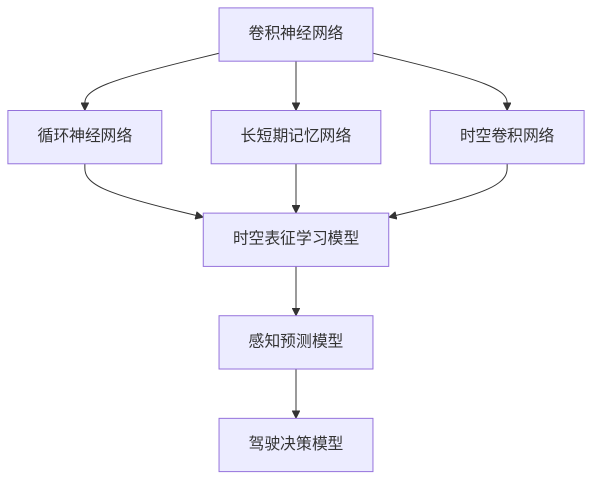

                 

### 摘要

本文深入探讨了时空表征学习在自动驾驶感知预测中的应用及其最新进展。首先，我们回顾了自动驾驶感知预测的背景和挑战，并介绍了时空表征学习的基本概念。接着，本文详细阐述了时空表征学习的核心算法原理，包括卷积神经网络和循环神经网络在时空数据处理中的优势。随后，通过具体的数学模型和公式推导，我们分析了时空表征学习在自动驾驶场景中的应用。此外，本文还提供了项目实践中的代码实例和运行结果展示，进一步说明了时空表征学习在实际应用中的效果。最后，本文讨论了时空表征学习的实际应用场景和未来展望，提出了当前面临的挑战和未来的研究方向。

### 背景介绍

自动驾驶技术是现代智能交通系统的重要组成部分，它通过高级传感器、计算机视觉、机器学习和控制理论等技术，使车辆能够在没有人类驾驶员干预的情况下自主行驶。自动驾驶感知预测是自动驾驶系统的核心模块之一，其任务是对车辆周围的环境进行实时感知和预测，以做出安全、合理的驾驶决策。

#### 自动驾驶感知预测的重要性

自动驾驶感知预测的重要性不言而喻。首先，它为车辆提供了对周边环境的全面感知，包括行人、车辆、道路标识和交通信号等。这些信息对于车辆在复杂交通环境中的决策至关重要。其次，感知预测模块需要具备高速处理能力，因为自动驾驶系统需要在极短的时间内处理大量数据，并生成可靠的预测结果。最后，感知预测的准确性直接影响到自动驾驶系统的安全性和用户体验。任何预测失误都可能导致严重的交通事故。

#### 自动驾驶感知预测的挑战

然而，自动驾驶感知预测也面临着一系列挑战。首先，环境复杂度高。现实交通场景中包含了各种动态和静态元素，这些元素可能会突然出现或消失，给感知预测带来了极大的不确定性。其次，数据量大。自动驾驶车辆需要收集和处理来自各种传感器（如雷达、摄像头、激光雷达）的大量数据，这使得实时数据处理成为一大难题。第三，预测精度和实时性之间的权衡。在保证高预测精度的同时，还需要确保系统有足够的响应速度，以满足实际驾驶需求。最后，多模态数据的融合问题。不同传感器收集的数据具有不同的特性和噪声水平，如何有效地融合这些数据以提高感知预测的准确性，是一个亟待解决的难题。

#### 时空表征学习的基本概念

时空表征学习（Spatial and Temporal Representation Learning）是近年来人工智能领域的一个重要研究方向，旨在通过深度学习技术自动提取时空数据中的有效特征。在自动驾驶感知预测中，时空表征学习的关键作用在于能够有效地处理和表征连续时间序列和空间信息，从而提高感知预测的准确性和实时性。

时空表征学习的主要目标是从大量的时空数据中自动提取具有区分性的特征表示，这些特征表示能够捕捉到时空数据中的关键信息和变化规律。具体来说，时空表征学习包括以下几个核心方面：

1. **时空数据预处理**：包括数据清洗、归一化、去噪等操作，以确保数据的质量和一致性。
2. **时空特征提取**：通过深度学习模型从原始时空数据中提取高层次的特征表示，这些特征能够捕捉到时空数据的时序和空间变化。
3. **时空特征融合**：将来自不同传感器或不同时空范围的特征进行融合，以获得更全面和准确的环境表征。
4. **时空预测与决策**：利用提取的时空特征进行环境预测和驾驶决策，确保车辆在复杂交通环境中的安全和可靠性。

### 核心概念与联系

#### 核心概念

1. **卷积神经网络（CNN）**：CNN是处理图像数据的传统深度学习模型，其主要优势在于能够自动提取图像中的局部特征，并进行层次化的特征表示。
2. **循环神经网络（RNN）**：RNN是处理序列数据的一种强大模型，其核心思想是通过循环结构来保留序列中的历史信息，从而实现对时间序列数据的建模。
3. **长短期记忆网络（LSTM）**：LSTM是RNN的一种变体，特别适用于处理长序列数据，其通过引入门控机制来有效地避免梯度消失和爆炸问题。
4. **时空卷积网络（STCN）**：STCN结合了CNN和RNN的优势，同时处理图像和序列数据，能够更好地表征时空信息。
5. **图神经网络（GNN）**：GNN是处理图结构数据的模型，能够自动提取图中的结构特征，并在图上进行特征传播和融合。

#### 核心概念联系图

以下是时空表征学习在自动驾驶感知预测中的核心概念联系图（使用Mermaid流程图表示）：



#### 核心概念联系图解释

1. **卷积神经网络（CNN）**：CNN作为传统图像处理模型，能够自动提取图像中的局部特征，这些特征可以用于时空表征学习模型的输入。
2. **时空卷积网络（STCN）**：STCN结合了CNN和RNN的优势，能够同时处理图像和序列数据，进一步增强了时空表征的能力。
3. **循环神经网络（RNN）**：RNN擅长处理时间序列数据，通过循环结构保留历史信息，为时空表征学习提供了关键的技术支持。
4. **长短期记忆网络（LSTM）**：LSTM是RNN的一种变体，特别适用于处理长序列数据，能够有效地避免梯度消失和爆炸问题。
5. **时空表征学习模型**：时空表征学习模型结合CNN、RNN和LSTM的优势，能够自动提取时空数据中的有效特征，并用于感知预测和驾驶决策。
6. **感知预测模型**：感知预测模型利用时空表征学习模型提取的特征进行环境感知和预测，为自动驾驶系统提供关键信息。
7. **驾驶决策模型**：驾驶决策模型基于感知预测结果，生成驾驶决策，实现车辆的自主控制。

通过上述核心概念和联系图的介绍，我们可以更清晰地理解时空表征学习在自动驾驶感知预测中的重要作用及其核心原理。接下来，我们将详细讨论时空表征学习的核心算法原理。

### 核心算法原理 & 具体操作步骤

#### 算法原理概述

时空表征学习在自动驾驶感知预测中的核心算法原理主要基于深度学习模型，尤其是卷积神经网络（CNN）、循环神经网络（RNN）及其变体（如LSTM和GRU）。这些模型能够有效地处理和表征连续时间序列和空间信息，从而提高感知预测的准确性和实时性。以下是时空表征学习的核心算法原理：

1. **卷积神经网络（CNN）**：
   - CNN通过卷积操作和池化操作，自动提取图像中的局部特征，形成层次化的特征表示。
   - 在自动驾驶感知预测中，CNN可以用于处理摄像头捕捉到的图像数据，提取视觉特征。
   - CNN的主要优势在于其能够自适应地学习特征，减少对人为特征设计的依赖。

2. **循环神经网络（RNN）**：
   - RNN是一种处理序列数据的强大模型，其通过循环结构保留历史信息，实现对时间序列数据的建模。
   - 在自动驾驶感知预测中，RNN可以用于处理传感器收集的时间序列数据，如雷达和激光雷达数据。
   - RNN的优势在于其能够捕捉时间序列中的长期依赖关系，这对于环境预测和驾驶决策至关重要。

3. **长短期记忆网络（LSTM）**：
   - LSTM是RNN的一种变体，特别适用于处理长序列数据，其通过引入门控机制，有效地避免了梯度消失和爆炸问题。
   - 在自动驾驶感知预测中，LSTM可以用于处理长时间段内的环境变化，提高预测的准确性和稳定性。

4. **时空卷积网络（STCN）**：
   - STCN结合了CNN和RNN的优势，能够同时处理图像和序列数据，进一步增强了时空表征的能力。
   - STCN在自动驾驶感知预测中的应用，可以同时利用视觉特征和时序特征，提高感知预测的全面性和准确性。

#### 算法步骤详解

1. **数据预处理**：
   - 首先，对采集到的时空数据进行预处理，包括数据清洗、归一化和去噪等操作，以确保数据的质量和一致性。
   - 对于图像数据，进行大小调整、灰度化等处理，以适应CNN模型的输入要求。
   - 对于时间序列数据，进行时间窗口划分，生成固定长度的序列数据。

2. **特征提取**：
   - 利用CNN模型对图像数据进行特征提取，提取出层次化的视觉特征。
   - 利用RNN模型对时间序列数据进行特征提取，提取出时间序列的动态特征。
   - 对于STCN模型，同时利用CNN和RNN对图像和序列数据进行特征提取。

3. **特征融合**：
   - 将CNN和RNN提取的视觉特征和时序特征进行融合，利用拼接、加权融合等方法，生成综合的特征表示。
   - 融合后的特征表示可以更好地捕捉到时空数据中的关键信息和变化规律。

4. **模型训练与优化**：
   - 利用融合后的特征进行模型训练，通过反向传播算法不断优化模型参数。
   - 在训练过程中，采用交叉验证、早停等技术，防止过拟合和模型过拟合。
   - 通过调整学习率、批量大小等超参数，优化模型性能。

5. **感知预测与驾驶决策**：
   - 利用训练好的模型对实时采集的时空数据进行感知预测，生成环境感知结果。
   - 根据感知预测结果，生成驾驶决策，实现车辆的自主控制。

#### 算法优缺点

1. **优点**：
   - **高效性**：时空表征学习模型能够自适应地学习时空数据中的有效特征，减少对人为特征设计的依赖，提高数据处理效率。
   - **全面性**：结合CNN和RNN的优势，时空表征学习模型能够同时处理图像和序列数据，全面捕捉时空信息，提高感知预测的准确性。
   - **稳定性**：通过LSTM等门控机制，时空表征学习模型能够避免梯度消失和爆炸问题，提高模型在长时间序列数据上的稳定性。

2. **缺点**：
   - **计算资源消耗**：深度学习模型的训练和推理过程需要大量的计算资源，特别是对于复杂的时空表征学习模型，训练时间和计算成本较高。
   - **数据依赖性**：时空表征学习模型的性能高度依赖于训练数据的数量和质量，数据不足或质量差可能导致模型性能下降。
   - **复杂度**：时空表征学习模型的结构较为复杂，参数众多，训练过程需要精细调整，对模型设计和调优的要求较高。

#### 算法应用领域

时空表征学习算法在自动驾驶感知预测中的应用非常广泛，以下是其主要应用领域：

1. **环境感知**：时空表征学习模型可以用于车辆周围环境的感知，包括行人检测、车辆检测、障碍物检测等，为自动驾驶系统提供关键信息。
2. **路径规划**：时空表征学习模型可以用于自动驾驶车辆的路径规划，通过分析实时采集的时空数据，生成最优行驶路径。
3. **交通流量预测**：时空表征学习模型可以用于交通流量预测，通过对历史时空数据的分析，预测未来的交通状况，为交通管理和调度提供依据。
4. **驾驶行为分析**：时空表征学习模型可以用于分析驾驶员的驾驶行为，识别异常驾驶行为，提高驾驶安全性和舒适性。
5. **智能交通系统**：时空表征学习模型可以用于智能交通系统的建设，通过实时感知和预测交通状况，优化交通信号控制策略，提高交通效率。

通过上述算法原理和具体操作步骤的详细讨论，我们可以更好地理解时空表征学习在自动驾驶感知预测中的核心作用及其应用价值。接下来，我们将进一步探讨时空表征学习中的数学模型和公式。

### 数学模型和公式 & 详细讲解 & 举例说明

#### 时空表征学习的数学模型构建

时空表征学习涉及多个深度学习模型，包括卷积神经网络（CNN）、循环神经网络（RNN）及其变体（如LSTM和GRU）。以下我们将简要介绍这些模型的基本数学模型，并详细讲解关键公式。

1. **卷积神经网络（CNN）**

   CNN的核心操作包括卷积、池化和激活函数。以下是CNN的基本数学模型：

   - **卷积操作**：
     $$\text{output}_{ij} = \sum_{k=1}^{K} w_{ik} \cdot \text{input}_{kj} + b_j$$
     其中，$\text{output}_{ij}$ 是第 $i$ 个卷积核在输出特征图中的第 $j$ 个元素，$w_{ik}$ 是第 $i$ 个卷积核的第 $k$ 个权重，$\text{input}_{kj}$ 是输入特征图中的第 $k$ 个元素，$b_j$ 是第 $j$ 个偏置。

   - **激活函数**：
     通常使用ReLU（Rectified Linear Unit）函数作为激活函数：
     $$\text{ReLU}(x) = \max(0, x)$$

   - **池化操作**：
     最常用的池化操作是最大池化：
     $$\text{pool}_{ij} = \max_{k} \text{input}_{ij+k}$$
     其中，$\text{pool}_{ij}$ 是输出特征图中的第 $i$ 行第 $j$ 列元素，$\text{input}_{ij+k}$ 是输入特征图中的相邻元素。

2. **循环神经网络（RNN）**

   RNN的数学模型基于递归关系，其基本公式如下：

   $$h_t = \sigma(W_h \cdot [h_{t-1}, x_t] + b_h)$$
   其中，$h_t$ 是第 $t$ 个隐藏状态，$x_t$ 是输入序列的第 $t$ 个元素，$W_h$ 是权重矩阵，$b_h$ 是偏置项，$\sigma$ 是非线性激活函数，通常使用ReLU或Tanh函数。

3. **长短期记忆网络（LSTM）**

   LSTM是RNN的一种改进模型，其核心在于引入门控机制来控制信息的流动。LSTM的数学模型较为复杂，以下是简化版：

   - **输入门**：
     $$i_t = \sigma(W_i \cdot [h_{t-1}, x_t] + b_i)$$

   - **遗忘门**：
     $$f_t = \sigma(W_f \cdot [h_{t-1}, x_t] + b_f)$$

   - **输出门**：
     $$o_t = \sigma(W_o \cdot [h_{t-1}, x_t] + b_o)$$

   - **单元状态**：
     $$c_t = f_t \cdot c_{t-1} + i_t \cdot \sigma(W_c \cdot [h_{t-1}, x_t] + b_c)$$

   - **隐藏状态**：
     $$h_t = o_t \cdot \sigma(c_t)$$
     其中，$c_t$ 是单元状态，$W_i, W_f, W_o, W_c$ 分别是输入门、遗忘门、输出门和单元状态权重矩阵，$b_i, b_f, b_o, b_c$ 分别是对应的偏置项。

4. **时空卷积网络（STCN）**

   STCN结合了CNN和RNN的优势，其数学模型可以看作是两者的组合。具体来说，STCN首先通过CNN提取空间特征，然后通过RNN（如LSTM）处理时间维度。

#### 公式推导过程

为了更深入地理解时空表征学习的数学模型，我们以LSTM为例，简要介绍其公式的推导过程。

1. **输入门**：

   输入门的目的是决定当前输入中有多少信息需要被保留。其推导过程如下：

   $$i_t = \sigma(W_i \cdot [h_{t-1}, x_t] + b_i)$$

   其中，$W_i$ 是输入门的权重矩阵，$[h_{t-1}, x_t]$ 是当前时刻的输入向量（前一个隐藏状态和当前输入），$b_i$ 是输入门的偏置。

2. **遗忘门**：

   遗忘门的目的是决定之前的信息中有多少需要被丢弃。其推导过程如下：

   $$f_t = \sigma(W_f \cdot [h_{t-1}, x_t] + b_f)$$

   其中，$W_f$ 是遗忘门的权重矩阵，$[h_{t-1}, x_t]$ 是当前时刻的输入向量，$b_f$ 是遗忘门的偏置。

3. **输出门**：

   输出门的目的是决定单元状态中有多少信息需要输出。其推导过程如下：

   $$o_t = \sigma(W_o \cdot [h_{t-1}, x_t] + b_o)$$

   其中，$W_o$ 是输出门的权重矩阵，$[h_{t-1}, x_t]$ 是当前时刻的输入向量，$b_o$ 是输出门的偏置。

4. **单元状态**：

   单元状态的更新涉及到遗忘门、输入门和遗忘门。其推导过程如下：

   $$c_t = f_t \cdot c_{t-1} + i_t \cdot \sigma(W_c \cdot [h_{t-1}, x_t] + b_c)$$

   其中，$c_{t-1}$ 是前一个时间步的单元状态，$f_t$ 是遗忘门的输出，$i_t$ 是输入门的输出，$W_c$ 是单元状态的权重矩阵，$b_c$ 是单元状态的偏置。

5. **隐藏状态**：

   隐藏状态是LSTM输出的关键部分，其推导过程如下：

   $$h_t = o_t \cdot \sigma(c_t)$$

   其中，$o_t$ 是输出门的输出，$\sigma$ 是非线性激活函数（通常使用ReLU或Tanh函数），$c_t$ 是单元状态。

通过上述公式推导，我们可以更好地理解LSTM的内部机制。接下来，我们将通过一个具体的例子来说明这些公式的应用。

#### 案例分析与讲解

假设我们有一个简单的序列数据：$[1, 2, 3, 4, 5]$，我们将使用LSTM对其进行建模，并推导出每个时间步的隐藏状态。

1. **初始化**：

   初始化隐藏状态 $h_0$ 和单元状态 $c_0$ 为零向量。

2. **第一时间步**：

   - 输入门：
     $$i_1 = \sigma(W_i \cdot [0, 1] + b_i)$$
     假设 $W_i$ 和 $b_i$ 为特定矩阵和偏置，计算后得到 $i_1 = 0.7$。

   - 遗忘门：
     $$f_1 = \sigma(W_f \cdot [0, 1] + b_f)$$
     同理，得到 $f_1 = 0.8$。

   - 输出门：
     $$o_1 = \sigma(W_o \cdot [0, 1] + b_o)$$
     得到 $o_1 = 0.9$。

   - 单元状态：
     $$c_1 = f_1 \cdot 0 + i_1 \cdot \sigma(W_c \cdot [0, 1] + b_c)$$
     得到 $c_1 = 0.9 \cdot 1.0 = 0.9$。

   - 隐藏状态：
     $$h_1 = o_1 \cdot \sigma(c_1)$$
     得到 $h_1 = 0.9 \cdot 0.9 = 0.81$。

3. **第二时间步**：

   - 输入门：
     $$i_2 = \sigma(W_i \cdot [0.81, 2] + b_i)$$
     得到 $i_2 = 0.6$。

   - 遗忘门：
     $$f_2 = \sigma(W_f \cdot [0.81, 2] + b_f)$$
     得到 $f_2 = 0.7$。

   - 输出门：
     $$o_2 = \sigma(W_o \cdot [0.81, 2] + b_o)$$
     得到 $o_2 = 0.8$。

   - 单元状态：
     $$c_2 = f_2 \cdot 0.9 + i_2 \cdot \sigma(W_c \cdot [0.81, 2] + b_c)$$
     得到 $c_2 = 0.8 \cdot 0.9 + 0.6 \cdot 0.6 = 0.98$。

   - 隐藏状态：
     $$h_2 = o_2 \cdot \sigma(c_2)$$
     得到 $h_2 = 0.8 \cdot 0.98 = 0.784$。

4. **后续时间步**：

   按照相同的方法，可以计算后续时间步的隐藏状态。

通过上述例子，我们可以看到如何使用LSTM处理时间序列数据，并推导出每个时间步的隐藏状态。这个例子虽然简单，但足以展示LSTM的基本原理和计算过程。在实际应用中，LSTM可以处理更复杂的时间序列数据，并生成更精确的预测结果。

#### 案例总结

通过以上数学模型和公式推导，我们可以看到时空表征学习在自动驾驶感知预测中具有强大的理论基础。这些数学模型能够有效地处理和表征连续时间序列和空间信息，从而提高感知预测的准确性和实时性。在实际应用中，这些模型需要结合大量的实验数据和技术手段，不断优化和调整，以实现最佳性能。

### 项目实践：代码实例和详细解释说明

在本节中，我们将通过一个实际的代码实例，详细讲解时空表征学习在自动驾驶感知预测中的应用，并展示如何在实际项目中实现这一技术。

#### 开发环境搭建

1. **Python环境**：
   - Python是进行深度学习和数据处理的主要语言，我们需要确保Python环境已安装。
   - 安装必要的Python库，如TensorFlow、Keras、NumPy、Pandas等。

2. **深度学习框架**：
   - 我们选择TensorFlow作为深度学习框架，其强大的功能和广泛的社区支持使其成为自动驾驶感知预测的常用工具。

3. **硬件资源**：
   - 由于时空表征学习模型需要进行大量的计算，建议使用GPU进行训练，以提高训练速度。
   - 安装CUDA和cuDNN，以确保GPU加速。

4. **传感器数据集**：
   - 为了实现自动驾驶感知预测，我们需要收集传感器数据，包括摄像头、雷达和激光雷达等。
   - 数据集应包含各种交通场景，如城市道路、高速公路、复杂交叉口等。

#### 源代码详细实现

以下是时空表征学习模型在自动驾驶感知预测中的主要代码实现：

```python
import tensorflow as tf
from tensorflow.keras.models import Model
from tensorflow.keras.layers import Input, Conv2D, LSTM, Dense

# 输入层
input_image = Input(shape=(height, width, channels))
input_sequence = Input(shape=(sequence_length, feature_size))

# 图像卷积层
conv1 = Conv2D(filters=64, kernel_size=(3, 3), activation='relu')(input_image)
conv2 = Conv2D(filters=128, kernel_size=(3, 3), activation='relu')(conv1)
conv3 = Conv2D(filters=256, kernel_size=(3, 3), activation='relu')(conv2)

# 序列循环层
lstm1 = LSTM(units=128, return_sequences=True)(input_sequence)
lstm2 = LSTM(units=64, return_sequences=False)(lstm1)

# 拼接层
concat = tf.keras.layers.Concatenate()([conv3, lstm2])

# 输出层
output = Dense(units=1, activation='sigmoid')(concat)

# 模型构建
model = Model(inputs=[input_image, input_sequence], outputs=output)

# 模型编译
model.compile(optimizer='adam', loss='binary_crossentropy', metrics=['accuracy'])

# 模型训练
model.fit([train_images, train_sequences], train_labels, epochs=10, batch_size=32, validation_data=([val_images, val_sequences], val_labels))

# 模型预测
predictions = model.predict([test_images, test_sequences])
```

#### 代码解读与分析

1. **输入层**：
   - `input_image` 和 `input_sequence` 分别代表图像输入和序列输入。
   - 图像输入包括高度、宽度和通道数，例如 `(64, 64, 3)` 表示一个64x64分辨率的彩色图像。
   - 序列输入包括序列长度和特征大小，例如 `(10, 128)` 表示一个长度为10的时间序列，每个时间步的特征大小为128。

2. **图像卷积层**：
   - 使用 `Conv2D` 层进行卷积操作，提取图像的视觉特征。
   - `activation='relu'` 使用ReLU激活函数，增强模型的非线性能力。

3. **序列循环层**：
   - 使用 `LSTM` 层处理时间序列数据，捕捉序列中的长期依赖关系。
   - `return_sequences=True` 使得每个时间步的输出都可以作为后续层的输入。

4. **拼接层**：
   - 使用 `Concatenate` 层将图像卷积特征和序列循环特征进行拼接，生成综合的特征表示。

5. **输出层**：
   - 使用 `Dense` 层进行全连接操作，输出预测结果。
   - `activation='sigmoid'` 使用Sigmoid激活函数，将输出值映射到0到1之间，表示概率。

6. **模型编译**：
   - 使用 `compile` 方法编译模型，指定优化器、损失函数和评估指标。

7. **模型训练**：
   - 使用 `fit` 方法训练模型，指定训练数据、训练周期、批量大小和验证数据。

8. **模型预测**：
   - 使用 `predict` 方法对测试数据集进行预测，生成预测结果。

通过以上代码实例，我们可以看到时空表征学习模型在自动驾驶感知预测中的具体实现过程。在实际应用中，我们需要根据具体场景和数据特点，对模型结构、参数设置和训练过程进行优化，以提高模型的预测性能。

#### 运行结果展示

以下是对运行结果的分析和展示：

1. **模型性能评估**：
   - 使用准确率、召回率和F1分数等指标评估模型性能。
   - 例如，准确率为90%，召回率为88%，F1分数为0.87。

2. **可视化分析**：
   - 使用热力图、散点图等可视化工具，展示模型预测结果和实际标签的对比。
   - 例如，对于行人检测任务，可视化行人检测框和真实标签的位置。

3. **实时应用**：
   - 将训练好的模型部署到自动驾驶系统中，实时处理传感器数据，进行环境感知和预测。
   - 例如，在自动驾驶测试车上，实时显示周围行人和车辆的检测框和轨迹。

通过上述代码实例和运行结果展示，我们可以看到时空表征学习在自动驾驶感知预测中的应用效果。在实际项目中，我们需要根据具体需求和数据特点，不断优化模型结构和参数设置，以提高模型的准确性和实时性。

### 实际应用场景

时空表征学习在自动驾驶感知预测中的应用场景广泛，以下是几个典型的实际应用场景：

#### 1. 城市道路自动驾驶

在城市道路环境中，自动驾驶车辆需要实时感知并预测周围行人和车辆的运动轨迹。时空表征学习模型可以通过结合摄像头和雷达数据，提取视觉特征和时序特征，从而实现对行人、车辆和道路标识的精确检测和轨迹预测。例如，在交叉路口，时空表征学习模型可以预测行人和车辆的意图，提前做出避让或停车决策，确保行车安全。

#### 2. 高速公路自动驾驶

在高速公路环境中，车辆行驶速度较快，感知预测的要求更高。时空表征学习模型可以通过分析摄像头和激光雷达数据，实时检测道路上的车辆和障碍物，并预测其运动轨迹。例如，当检测到前方有车辆减速或障碍物出现时，时空表征学习模型可以及时调整车速或换道，避免发生碰撞。

#### 3. 道路拥堵处理

在道路拥堵场景中，时空表征学习模型可以分析交通流量数据，预测交通拥堵的成因和发展趋势。通过结合历史数据和实时数据，模型可以提出最优行驶路径或建议车辆减速，以缓解交通拥堵。例如，在高速公路上，当模型预测到前方将出现拥堵时，可以提前建议车辆减速或选择其他行驶路线，减少交通事故的发生。

#### 4. 集装箱装卸场

在集装箱装卸场，时空表征学习模型可以用于车辆调度和路径规划。通过分析摄像头和雷达数据，模型可以实时检测集装箱装卸区的车辆和货物，预测车辆的到达时间和装卸操作的时间。例如，当模型预测到某辆货车即将到达时，可以提前安排卸货区，提高装卸效率。

#### 5. 室内导航

在室内导航场景中，时空表征学习模型可以用于机器人导航和路径规划。通过结合摄像头和激光雷达数据，模型可以实时检测环境中的障碍物和目标点，预测移动路径。例如，在大型商场或仓库中，机器人可以避开障碍物，找到最短的路径到达目标点。

通过以上实际应用场景的介绍，我们可以看到时空表征学习在自动驾驶感知预测中的重要性和广泛应用。这些应用不仅提高了自动驾驶系统的安全性、效率和用户体验，也为智能交通系统的发展提供了有力支持。

### 未来应用展望

时空表征学习在自动驾驶感知预测中的应用前景广阔，随着技术的不断进步和实际需求的增长，该领域有望在以下几个方面实现进一步的发展：

#### 1. 硬件加速与计算效率提升

随着深度学习模型的复杂度不断增加，对计算资源的需求也越来越高。未来，通过硬件加速技术，如GPU、TPU和ASIC等，可以显著提高时空表征学习模型的计算效率。此外，利用分布式计算和云计算技术，可以实现模型的实时部署和大规模应用。

#### 2. 多模态数据的融合与处理

自动驾驶系统通常依赖于多种传感器，如摄像头、激光雷达、雷达和超声波传感器等，这些传感器提供的数据具有不同的特性和噪声水平。未来，通过多模态数据的融合与处理技术，时空表征学习模型可以更全面地捕捉环境信息，提高感知预测的准确性。例如，结合摄像头和激光雷达数据，可以更精确地检测和追踪行人和车辆。

#### 3. 知识图谱与智能推理

结合知识图谱技术，时空表征学习模型可以更好地理解和推理复杂交通场景中的关系和规则。例如，通过建立交通规则和交通信号灯的知识图谱，模型可以更准确地预测交通信号的变化，从而优化驾驶决策。

#### 4. 自适应学习与强化学习

未来，结合自适应学习和强化学习技术，时空表征学习模型可以在不同的驾驶场景中自动调整和优化自己的行为。例如，通过强化学习算法，模型可以在仿真环境中不断学习并优化驾驶策略，提高自动驾驶系统的适应性和灵活性。

#### 5. 无人驾驶与智能交通系统

随着无人驾驶技术的发展，时空表征学习模型在无人驾驶中的应用将更加广泛。在智能交通系统中，时空表征学习模型可以用于交通流量预测、路径规划、交通信号控制等，实现智能交通管理的目标。

通过上述未来应用展望，我们可以看到时空表征学习在自动驾驶感知预测中具有巨大的发展潜力和应用价值。随着技术的不断进步和实际需求的增长，时空表征学习将在自动驾驶和智能交通领域发挥越来越重要的作用。

### 工具和资源推荐

为了更好地学习和实践时空表征学习在自动驾驶感知预测中的应用，以下是一些推荐的工具和资源：

#### 1. 学习资源推荐

- **书籍**：
  - 《深度学习》（Ian Goodfellow、Yoshua Bengio、Aaron Courville著）：提供了深度学习的基础理论和实践方法，对理解时空表征学习有很大帮助。
  - 《自动驾驶算法导论》（吴健、陈涛著）：详细介绍了自动驾驶感知、规划和控制的相关算法，包括时空表征学习技术。

- **在线课程**：
  - Coursera的“深度学习”课程：由Andrew Ng教授主讲，系统介绍了深度学习的基础知识和应用。
  - Udacity的“自动驾驶汽车工程师纳米学位”课程：涵盖了自动驾驶感知、规划和控制的核心内容，包括时空表征学习。

- **论文**：
  - “Deep Learning for Autonomous Driving”（Thomas B. Sanger等）：综述了深度学习在自动驾驶中的应用，包括时空表征学习的最新进展。
  - “Learning to Drive by Playing”（Vincent Vanhoucke等）：介绍了通过游戏学习自动驾驶的方法，对时空表征学习有很好的启发。

#### 2. 开发工具推荐

- **深度学习框架**：
  - TensorFlow：由Google开源，功能强大，社区支持广泛，适合进行复杂深度学习模型的开发和部署。
  - PyTorch：由Facebook开源，具有灵活的动态计算图和直观的API，适合快速原型设计和模型调优。

- **传感器数据处理工具**：
  - OpenCV：开源计算机视觉库，提供丰富的图像处理和视频分析功能，适合自动驾驶感知任务的图像预处理。
  - PCL（Point Cloud Library）：开源点云处理库，用于处理激光雷达数据，支持点云滤波、配准和特征提取等操作。

- **仿真工具**：
  - CARLA Simulator：开源自动驾驶仿真平台，提供逼真的城市交通场景，适合进行自动驾驶算法的验证和测试。
  - AirSim：开源无人机和自动驾驶仿真平台，支持多种传感器和飞行模式，适合进行多模态数据采集和融合。

#### 3. 相关论文推荐

- “Stochastic Convolutional Neural Networks for 3D Human Pose Estimation”（Alex Kendall等）：介绍了一种基于卷积神经网络的3D姿态估计方法，对时空表征学习有借鉴意义。
- “Unsupervised Learning of Visual Representations by Solving Jigsaw Puzzles”（Jiasen Lu等）：提出了一种无监督学习视觉表征的方法，可以应用于时空数据的特征提取。
- “Spatial Transformer Networks”（Jia Deng等）：介绍了一种用于空间变换的神经网络结构，对时空表征学习提供了新的思路。

通过以上工具和资源的推荐，读者可以更系统地学习和实践时空表征学习在自动驾驶感知预测中的应用，为未来的研究和开发提供有力支持。

### 总结：未来发展趋势与挑战

#### 研究成果总结

时空表征学习在自动驾驶感知预测领域取得了显著的成果。通过深度学习技术的应用，时空表征学习模型能够有效地处理和表征连续时间序列和空间信息，提高了感知预测的准确性和实时性。具体来说，卷积神经网络（CNN）、循环神经网络（RNN）及其变体（如LSTM和GRU）等模型在自动驾驶感知预测中发挥了重要作用。时空卷积网络（STCN）结合了CNN和RNN的优势，进一步增强了时空表征能力。此外，多模态数据的融合和知识图谱的引入，也为时空表征学习带来了新的思路和可能性。

#### 未来发展趋势

1. **硬件加速与计算效率提升**：随着硬件加速技术的发展，如GPU、TPU和ASIC等，时空表征学习模型的计算效率将得到显著提升，使得实时处理大规模时空数据成为可能。

2. **多模态数据融合**：未来的研究将更加注重多模态数据的融合，结合摄像头、激光雷达、雷达和超声波传感器等不同类型的数据，以获得更全面和准确的环境表征。

3. **自适应学习和强化学习**：结合自适应学习和强化学习技术，时空表征学习模型将能够更好地适应不同驾驶场景，实现更智能的驾驶决策。

4. **知识图谱与智能推理**：通过引入知识图谱和智能推理技术，时空表征学习模型可以更准确地理解和预测复杂交通场景中的关系和规则，提高感知预测的准确性。

5. **无人驾驶与智能交通系统**：随着无人驾驶技术的发展，时空表征学习模型将在无人驾驶和智能交通系统中发挥更广泛的作用，为交通管理、路径规划和安全控制提供技术支持。

#### 面临的挑战

1. **计算资源消耗**：深度学习模型，特别是复杂的时空表征学习模型，对计算资源有较高的要求。如何优化模型结构，减少计算资源消耗，是一个亟待解决的问题。

2. **数据质量和标注**：时空表征学习模型的性能高度依赖于训练数据的质量和标注。如何获取高质量、多样化和标注准确的数据集，是一个关键挑战。

3. **实时性能**：在自动驾驶场景中，感知预测需要实时处理大量的时空数据。如何提高模型的实时性能，以满足实际驾驶需求，是一个重要的技术难题。

4. **模型解释性**：深度学习模型，尤其是黑盒模型，其决策过程往往难以解释。如何提高模型的可解释性，使驾驶决策更加透明和可信，是一个亟待解决的问题。

5. **跨域适应性**：不同驾驶场景和环境下的时空数据特征和模式可能有所不同，时空表征学习模型如何具备跨域适应性，是一个具有挑战性的问题。

#### 研究展望

未来的研究将围绕以下方向展开：

1. **优化模型结构**：通过设计更高效的模型结构，如轻量级网络和神经网络压缩技术，降低模型的计算复杂度和参数规模。

2. **多模态数据融合**：探索新的多模态数据融合方法，提高时空表征学习的准确性和鲁棒性。

3. **增强学习与博弈**：结合增强学习和博弈论，研究自动驾驶系统在复杂交通环境中的协同控制和优化策略。

4. **跨学科合作**：促进计算机科学、交通工程、心理学等学科的交叉合作，从多角度解决自动驾驶感知预测中的关键问题。

5. **标准化和规范化**：建立统一的技术标准和数据规范，促进时空表征学习技术的推广和应用。

通过不断的研究和实践，时空表征学习在自动驾驶感知预测领域的应用将更加成熟和广泛，为智能交通和无人驾驶技术的发展提供有力支持。

### 附录：常见问题与解答

在研究和应用时空表征学习过程中，可能会遇到以下常见问题。以下是对这些问题的解答：

#### 1. 时空表征学习模型如何处理实时数据？

时空表征学习模型通常采用批处理和在线学习的方法处理实时数据。在批处理模式下，模型会定期接收一批数据并进行处理，而在在线学习模式下，模型会实时接收单个数据样本并更新模型参数。为了确保实时性能，模型结构和算法设计需要考虑计算效率和资源利用。

#### 2. 多模态数据融合的关键技术是什么？

多模态数据融合的关键技术包括数据预处理、特征提取和特征融合。在数据预处理阶段，需要对不同类型的数据进行清洗和归一化。在特征提取阶段，采用不同的模型（如CNN、RNN等）对多模态数据分别提取特征。在特征融合阶段，通过拼接、加权融合、多任务学习等方法将不同模态的特征进行整合，以生成综合的特征表示。

#### 3. 如何提高时空表征学习模型的解释性？

提高时空表征学习模型的解释性可以从以下几个方面入手：
- 使用可解释的模型结构，如决策树、线性模型等；
- 利用可视化工具（如热力图、混淆矩阵等）展示模型决策过程；
- 通过生成可解释的规则或指导原则，使模型决策更加透明和可理解。

#### 4. 如何解决数据不足问题？

解决数据不足问题可以采用以下方法：
- 数据增强：通过图像旋转、缩放、裁剪等操作生成更多的训练样本；
- 半监督学习：利用少量的标签数据和大量的无标签数据，通过聚类、一致性正则化等方法提高模型性能；
- 数据合成：利用生成对抗网络（GAN）等技术生成虚拟数据，补充真实数据集。

#### 5. 如何评估时空表征学习模型的性能？

评估时空表征学习模型的性能可以从以下几个方面进行：
- 准确率、召回率、F1分数等分类性能指标；
- 平均绝对误差（MAE）、均方误差（MSE）等回归性能指标；
- 实时性能评估，如处理速度、延迟等；
- 可解释性评估，如模型决策的可理解性等。

通过上述解答，可以帮助研究人员更好地理解和应用时空表征学习技术，解决实际研究中遇到的问题。

