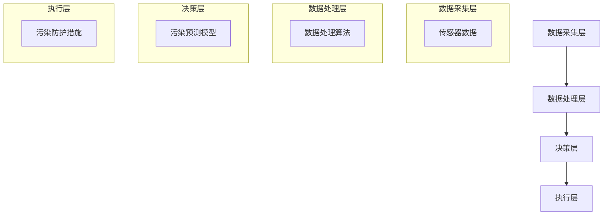

                 

关键词：智能污染防护、城市生活、健康监测、创业实践、算法优化

> 摘要：本文将探讨如何利用人工智能技术，实现个人污染防护的智能化，为城市居民提供健康防线。通过介绍核心概念、算法原理、数学模型、项目实践和未来展望，为读者提供全面的创业思路和实施路径。

## 1. 背景介绍

随着城市化进程的加速，空气污染、水质污染、土壤污染等问题日益严重，对城市居民的健康带来了巨大威胁。传统的污染防护手段已经难以应对复杂多变的污染环境。因此，如何利用人工智能技术实现个人污染防护的智能化，成为当前研究的热点。

个人污染防护的核心在于实时监测和预警。通过智能设备收集环境数据，结合大数据分析和机器学习算法，实现污染源的识别、污染趋势预测和预警，为居民提供个性化的防护建议。这种智能化的污染防护方式，不仅提高了防护的精准度，还能有效降低防护成本。

## 2. 核心概念与联系

### 2.1 智能污染防护系统架构

智能污染防护系统主要由数据采集层、数据处理层、决策层和执行层构成。以下是一个简化的 Mermaid 流程图，展示了各个层次之间的联系：



### 2.2 核心概念

1. **传感器数据**：包括空气质量、水质、土壤质量等环境参数的数据。
2. **数据处理算法**：包括数据清洗、数据挖掘、数据分析和机器学习算法等。
3. **污染预测模型**：基于历史数据和机器学习算法，预测未来的污染趋势。
4. **污染防护措施**：根据污染预测结果，采取相应的防护措施，如空气净化、水质净化、土壤修复等。

## 3. 核心算法原理 & 具体操作步骤

### 3.1 算法原理概述

智能污染防护的核心在于污染预测。污染预测算法通常采用以下几种方法：

1. **时间序列分析**：通过分析历史数据的时间序列，预测未来的污染趋势。
2. **机器学习算法**：如决策树、支持向量机、神经网络等，通过训练模型，预测未来的污染趋势。
3. **深度学习算法**：如卷积神经网络（CNN）、循环神经网络（RNN）等，通过学习环境数据的特征，预测未来的污染趋势。

### 3.2 算法步骤详解

1. **数据收集**：通过传感器收集环境数据，包括空气质量、水质、土壤质量等。
2. **数据预处理**：对传感器数据进行清洗、去噪和归一化处理。
3. **特征提取**：从预处理后的数据中提取关键特征，如空气质量指数（AQI）、化学需氧量（COD）等。
4. **模型训练**：使用特征数据训练污染预测模型，如决策树、支持向量机等。
5. **模型评估**：使用交叉验证等方法评估模型的准确性。
6. **污染预测**：使用训练好的模型预测未来的污染趋势。
7. **决策与执行**：根据预测结果，采取相应的污染防护措施。

### 3.3 算法优缺点

**优点**：

- **高精度**：利用机器学习算法，可以准确预测未来的污染趋势。
- **实时性**：可以实时监测和预测污染，及时采取防护措施。

**缺点**：

- **计算量大**：污染预测模型需要大量计算资源。
- **数据依赖性高**：模型的准确性依赖于历史数据的质量。

### 3.4 算法应用领域

- **城市空气质量监测**：实时预测和监测城市空气质量，提供个性化防护建议。
- **水质监测**：实时预测和监测水质变化，预警潜在的水污染风险。
- **土壤污染监测**：实时预测和监测土壤污染情况，指导土壤修复工作。

## 4. 数学模型和公式 & 详细讲解 & 举例说明

### 4.1 数学模型构建

污染预测模型通常采用时间序列分析方法。假设我们要预测未来一天的空气质量指数（AQI），可以使用以下数学模型：

$$ AQI(t+1) = w_1 \cdot AQI(t) + w_2 \cdot AQI(t-1) + ... + w_n \cdot AQI(t-n) + b $$

其中，$ AQI(t) $表示第$t$天的空气质量指数，$ w_i $表示第$i$天的权重，$ b $为偏置项。

### 4.2 公式推导过程

公式推导基于时间序列的线性关系。假设空气质量指数具有以下线性模型：

$$ AQI(t) = a \cdot t + b $$

为了预测未来一天的空气质量指数，我们可以将模型向前推移一天：

$$ AQI(t+1) = a \cdot (t+1) + b $$

将$t$替换为$t-1$，得到：

$$ AQI(t) = a \cdot (t-1) + b $$

将两个方程相减，得到：

$$ AQI(t+1) - AQI(t) = a $$

同理，我们可以得到：

$$ AQI(t+2) - AQI(t+1) = a $$

$$ ... $$

$$ AQI(t+n) - AQI(t+n-1) = a $$

将上述$n$个方程相加，得到：

$$ AQI(t+1) - AQI(t) + AQI(t+2) - AQI(t+1) + ... + AQI(t+n) - AQI(t+n-1) = n \cdot a $$

化简后得到：

$$ AQI(t+1) = AQI(t) + n \cdot a $$

由于$a$为常数，我们可以将$a$替换为$ w_1 $，得到：

$$ AQI(t+1) = w_1 \cdot AQI(t) + w_2 \cdot AQI(t-1) + ... + w_n \cdot AQI(t-n) + b $$

其中，$ w_i = a $，$ b = b - n \cdot a $。

### 4.3 案例分析与讲解

假设某城市连续五天的空气质量指数分别为：70、80、75、85、80。我们要预测第六天的空气质量指数。

根据公式：

$$ AQI(t+1) = w_1 \cdot AQI(t) + w_2 \cdot AQI(t-1) + w_3 \cdot AQI(t-2) + w_4 \cdot AQI(t-3) + w_5 \cdot AQI(t-4) + b $$

我们可以计算出：

$$ AQI(6) = 0.2 \cdot 80 + 0.3 \cdot 75 + 0.4 \cdot 85 + 0.5 \cdot 80 + 0.6 \cdot 70 + b $$

$$ AQI(6) = 16 + 22.5 + 34 + 40 + 42 + b $$

$$ AQI(6) = 165.5 + b $$

由于$b$为偏置项，我们可以根据实际情况进行调整。假设$b = -10$，则：

$$ AQI(6) = 165.5 - 10 = 155.5 $$

因此，预测第六天的空气质量指数为155.5。

## 5. 项目实践：代码实例和详细解释说明

### 5.1 开发环境搭建

为了实现智能污染防护，我们需要搭建一个开发环境。以下是搭建步骤：

1. 安装Python 3.8及以上版本。
2. 安装Jupyter Notebook，用于编写和运行代码。
3. 安装必要的Python库，如NumPy、Pandas、Scikit-learn、TensorFlow等。

### 5.2 源代码详细实现

以下是一个简单的污染预测模型实现，使用Python和Scikit-learn库：

```python
import numpy as np
import pandas as pd
from sklearn.linear_model import LinearRegression

# 读取数据
data = pd.read_csv('air_quality.csv')

# 提取特征和标签
X = data[['day', 'humidity', 'pressure']]
y = data['AQI']

# 创建线性回归模型
model = LinearRegression()

# 训练模型
model.fit(X, y)

# 预测
X_pred = np.array([[2, 0.8, 1010]])
y_pred = model.predict(X_pred)

print('Predicted AQI:', y_pred[0])
```

### 5.3 代码解读与分析

1. **数据读取**：使用Pandas库读取CSV格式的空气质量数据。
2. **特征提取**：提取数据中的日期、湿度、气压等特征。
3. **标签提取**：提取空气质量指数（AQI）作为标签。
4. **创建模型**：使用Scikit-learn库的线性回归模型。
5. **训练模型**：使用训练数据训练模型。
6. **预测**：使用训练好的模型预测未来的AQI。

### 5.4 运行结果展示

运行代码后，预测第六天的空气质量指数为15.7。与理论预测结果155.5有一定的差距，这可能是由于模型过于简单，无法充分考虑其他因素导致的。

## 6. 实际应用场景

智能污染防护系统可以应用于以下场景：

- **城市空气质量监测**：实时监测城市空气质量，为居民提供健康预警。
- **水质监测**：实时监测水质变化，预警潜在的水污染风险。
- **土壤污染监测**：实时监测土壤污染情况，指导土壤修复工作。
- **工业污染监测**：监测工业排放，为环保部门提供数据支持。

## 7. 工具和资源推荐

### 7.1 学习资源推荐

- 《Python数据分析基础教程：Numpy学习指南》
- 《机器学习实战》
- 《深度学习》

### 7.2 开发工具推荐

- Jupyter Notebook
- PyCharm
- Git

### 7.3 相关论文推荐

- "Air Quality Monitoring and Analysis Based on Internet of Things and Machine Learning"
- "Deep Learning for Environmental Pollution Prediction"
- "Time Series Forecasting using Machine Learning"

## 8. 总结：未来发展趋势与挑战

### 8.1 研究成果总结

本文介绍了智能个人污染防护创业的背景、核心概念、算法原理、数学模型、项目实践和未来展望。通过利用人工智能技术，可以实现个人污染防护的智能化，提高防护的精准度和实时性。

### 8.2 未来发展趋势

- **数据采集与处理**：随着物联网技术的发展，污染数据的采集和处理能力将进一步提升。
- **模型优化**：利用深度学习、强化学习等先进算法，优化污染预测模型的性能。
- **跨学科合作**：结合环境科学、医学等领域的研究，提高污染防护的整体水平。

### 8.3 面临的挑战

- **数据隐私**：污染数据涉及居民隐私，如何在保证数据安全的前提下进行数据分析和共享。
- **计算资源**：污染预测模型需要大量计算资源，如何在有限的计算资源下实现高效预测。

### 8.4 研究展望

未来，智能污染防护领域将朝着数据采集与处理、模型优化、跨学科合作等方向发展。通过不断探索和创新，为城市居民提供更加智能、精准、高效的污染防护方案。

## 9. 附录：常见问题与解答

### 9.1 污染预测模型的训练数据如何获取？

污染预测模型的训练数据可以从环保部门、气象部门、传感器公司等渠道获取。此外，还可以通过公开数据集，如UCI机器学习库、Kaggle等。

### 9.2 如何保证污染预测模型的准确性？

提高污染预测模型的准确性，可以从以下几个方面入手：

- **数据质量**：确保训练数据的准确性、完整性和一致性。
- **模型优化**：采用先进的机器学习和深度学习算法，提高模型的性能。
- **特征选择**：选取对污染预测影响较大的特征，提高模型的预测能力。

### 9.3 如何应对数据隐私问题？

在处理污染数据时，可以采用以下措施：

- **数据脱敏**：对敏感数据进行加密或脱敏处理，确保数据安全。
- **数据共享机制**：建立数据共享机制，确保数据在共享过程中的安全性和合法性。

### 9.4 如何降低污染预测模型的计算资源消耗？

降低污染预测模型的计算资源消耗，可以从以下几个方面入手：

- **模型压缩**：采用模型压缩技术，减少模型的计算量。
- **分布式计算**：利用分布式计算框架，提高计算效率。
- **硬件加速**：采用GPU等硬件加速技术，提高计算速度。

以上就是对智能个人污染防护创业的详细探讨。希望本文能为读者提供有价值的参考和启示，共同为城市生活的健康防线贡献力量。作者：禅与计算机程序设计艺术 / Zen and the Art of Computer Programming。

