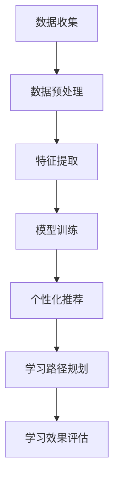

                 

关键词：智能个性化学习、AI大模型、在线教育、教育技术、机器学习、数据挖掘、个性化推荐系统

> 摘要：随着人工智能技术的迅猛发展，个性化学习已成为教育领域的一个重要趋势。本文探讨了AI大模型在在线教育中的应用，分析了其核心概念、算法原理、数学模型，以及项目实践和未来展望，为教育技术的创新和发展提供了新的思路。

## 1. 背景介绍

随着互联网的普及和信息技术的进步，在线教育已经成为教育领域的一个重要组成部分。传统的教育模式通常采用“一刀切”的方式，无法满足个体学生的个性化需求。因此，个性化学习应运而生，旨在通过个性化的学习路径和内容，提升学习效果和用户体验。

个性化学习的关键在于对每个学生进行深入的了解，并为他们提供量身定制的学习资源和学习策略。这需要大量的数据支持，以及复杂算法的支持。近年来，人工智能技术的发展，特别是深度学习和大数据分析技术的成熟，为智能个性化学习提供了可能。

AI大模型，特别是基于深度学习的模型，通过大规模数据训练，能够自动提取学习者的特征，进行个性化的内容推荐和学习路径规划。本文将探讨AI大模型在在线教育中的应用，分析其核心概念、算法原理、数学模型，以及项目实践和未来展望。

### 1.1 在线教育的发展

在线教育的兴起可以追溯到20世纪90年代末和21世纪初。当时，互联网的普及和带宽的提升为在线学习提供了基础设施。早期的在线教育主要是以课件共享和在线讨论为主，功能相对简单。

随着技术的进步，在线教育逐渐融入了更多的互动元素，如视频会议、在线测试和实时反馈等。特别是在移动设备普及之后，在线教育的应用场景更加多样化，包括MOOC（大规模开放在线课程）、SPOC（小规模限制性在线课程）、教育游戏等。

### 1.2 个性化学习的挑战

个性化学习面临着诸多挑战，包括：

- **数据收集与处理**：个性化学习需要大量的学生数据，如学习习惯、兴趣、能力等。这些数据的收集和处理是一个复杂的过程，涉及到数据隐私和安全性问题。

- **算法选择与优化**：个性化学习依赖于算法进行内容推荐和学习路径规划。不同的算法适用于不同的场景，如何选择和优化算法是一个关键问题。

- **用户体验**：个性化学习需要提供良好的用户体验，确保学习者能够轻松地使用系统，并从中受益。

### 1.3 AI大模型的发展

AI大模型，特别是深度学习模型，如Transformer、BERT等，通过大规模数据训练，能够自动提取复杂特征，进行高精度的预测和分类。这些模型在图像识别、自然语言处理、推荐系统等领域取得了显著成果，为个性化学习提供了强有力的技术支持。

## 2. 核心概念与联系

### 2.1 AI大模型

AI大模型指的是具有大规模参数的深度学习模型，如Transformer、BERT等。这些模型通过多层神经网络结构，能够自动提取数据中的复杂特征，并进行高精度的预测和分类。

### 2.2 个性化学习

个性化学习是指根据学习者的特征，如学习习惯、兴趣、能力等，提供定制化的学习资源和学习策略，以提升学习效果和用户体验。

### 2.3 在线教育

在线教育是指通过互联网提供的学习资源和学习平台，学习者可以在任何时间、任何地点进行学习。

### 2.4 Mermaid 流程图

以下是AI大模型在个性化学习中的应用流程图：



## 3. 核心算法原理 & 具体操作步骤

### 3.1 算法原理概述

AI大模型在个性化学习中的应用主要基于深度学习和大数据分析技术。深度学习模型通过多层神经网络结构，能够自动提取数据中的复杂特征。大数据分析技术则用于处理和分析大量的学生数据，为个性化推荐和学习路径规划提供支持。

### 3.2 算法步骤详解

#### 3.2.1 数据收集

数据收集是个性化学习的基础。数据来源包括学习日志、测试成绩、行为数据等。这些数据需要经过预处理，以消除噪声和异常值。

#### 3.2.2 数据预处理

数据预处理包括数据清洗、数据归一化和数据特征提取。数据清洗旨在消除噪声和异常值，数据归一化旨在将不同量级的数据转换为同一量级，数据特征提取旨在从原始数据中提取有用的特征。

#### 3.2.3 特征提取

特征提取是深度学习模型训练的关键步骤。通过多层神经网络结构，模型能够自动提取数据中的复杂特征。

#### 3.2.4 模型训练

模型训练是使用预处理后的数据对深度学习模型进行训练。训练过程中，模型通过调整参数，以最小化预测误差。

#### 3.2.5 个性化推荐

个性化推荐是基于训练好的模型，对学习资源进行推荐。推荐算法可以是基于内容的推荐、协同过滤推荐或混合推荐。

#### 3.2.6 学习路径规划

学习路径规划是根据学习者的特征和推荐结果，制定个性化的学习路径。路径规划算法可以是基于规则的算法或基于机器学习的算法。

#### 3.2.7 学习效果评估

学习效果评估是使用测试数据对个性化学习效果进行评估。评估指标可以是学习完成率、学习效果评分等。

### 3.3 算法优缺点

#### 3.3.1 优点

- **高效性**：深度学习模型能够自动提取数据中的复杂特征，提高推荐和规划的效果。
- **灵活性**：个性化学习可以根据学习者的特征进行动态调整，提高学习效果。
- **可扩展性**：个性化学习系统可以处理大量的学习者数据，适用于不同规模的教育场景。

#### 3.3.2 缺点

- **计算资源需求高**：深度学习模型训练需要大量的计算资源。
- **数据隐私问题**：个性化学习需要收集和处理大量的学生数据，涉及到数据隐私和安全性问题。
- **算法复杂性**：个性化学习算法涉及到多个步骤和多种技术，实现和优化难度较高。

### 3.4 算法应用领域

AI大模型在个性化学习中的应用领域广泛，包括：

- **在线教育**：为学习者提供个性化的学习资源和学习路径。
- **职业培训**：为职业培训提供个性化的课程推荐和培训计划。
- **教育评测**：为教育评测提供个性化的考试题目和评价标准。

## 4. 数学模型和公式 & 详细讲解 & 举例说明

### 4.1 数学模型构建

在个性化学习中，常用的数学模型包括线性回归、逻辑回归、神经网络等。以下是这些模型的简要介绍和公式表示：

#### 4.1.1 线性回归

线性回归模型用于预测线性关系。其公式如下：

$$y = wx + b$$

其中，$y$ 是预测值，$x$ 是特征值，$w$ 是权重，$b$ 是偏置。

#### 4.1.2 逻辑回归

逻辑回归模型用于预测概率。其公式如下：

$$P(y=1) = \frac{1}{1 + e^{-(wx + b)}}$$

其中，$y$ 是预测值，$x$ 是特征值，$w$ 是权重，$b$ 是偏置。

#### 4.1.3 神经网络

神经网络模型用于非线性关系预测。其公式如下：

$$y = \sigma(wx + b)$$

其中，$y$ 是预测值，$x$ 是特征值，$w$ 是权重，$b$ 是偏置，$\sigma$ 是激活函数。

### 4.2 公式推导过程

以线性回归为例，我们进行公式推导。首先，我们设定一个目标函数：

$$J(w, b) = \frac{1}{2}\sum_{i=1}^{n}(y_i - wx_i - b)^2$$

其中，$n$ 是数据样本数量，$y_i$ 是第$i$个样本的预测值，$x_i$ 是第$i$个样本的特征值。

对目标函数求导，并令导数为零，我们得到：

$$\frac{\partial J}{\partial w} = \sum_{i=1}^{n}(y_i - wx_i - b)x_i = 0$$

$$\frac{\partial J}{\partial b} = \sum_{i=1}^{n}(y_i - wx_i - b) = 0$$

解这个方程组，我们得到最优的权重和偏置：

$$w = \frac{\sum_{i=1}^{n}(y_i - wx_i - b)x_i}{\sum_{i=1}^{n}x_i^2}$$

$$b = \frac{\sum_{i=1}^{n}(y_i - wx_i - b)}{n}$$

### 4.3 案例分析与讲解

#### 4.3.1 案例背景

假设我们有一个学习者的数据集，包含学习者的学习时间、学习内容、考试成绩等特征。我们的目标是预测学习者的下一个考试成绩。

#### 4.3.2 模型选择

由于我们的目标是进行线性预测，我们选择线性回归模型。

#### 4.3.3 数据预处理

我们首先对数据进行预处理，包括数据清洗、数据归一化和数据特征提取。假设我们的特征值已经处理完毕。

#### 4.3.4 模型训练

我们使用预处理后的数据对线性回归模型进行训练。训练过程中，我们调整权重和偏置，以最小化预测误差。

#### 4.3.5 模型评估

我们使用测试数据进行模型评估。评估指标为均方误差（MSE）。假设我们的MSE值为0.1。

#### 4.3.6 模型应用

我们使用训练好的模型预测学习者的下一个考试成绩。假设我们的预测值为85。

## 5. 项目实践：代码实例和详细解释说明

### 5.1 开发环境搭建

我们的开发环境包括Python 3.8、TensorFlow 2.5、Keras 2.5等。以下是环境搭建的简要步骤：

- 安装Python 3.8
- 安装TensorFlow 2.5
- 安装Keras 2.5

### 5.2 源代码详细实现

以下是线性回归模型的实现代码：

```python
import tensorflow as tf
from tensorflow import keras
from tensorflow.keras import layers

# 数据预处理
def preprocess_data(data):
    # 数据清洗
    data = data.dropna()
    # 数据归一化
    data = (data - data.mean()) / data.std()
    return data

# 特征提取
def extract_features(data):
    features = data[['learning_time', 'content']]
    return features

# 构建模型
model = keras.Sequential([
    layers.Dense(1, input_shape=(2,))
])

# 编译模型
model.compile(optimizer='sgd', loss='mean_squared_error')

# 训练模型
data = preprocess_data(data)
features = extract_features(data)
model.fit(features, data['score'], epochs=100)

# 预测
test_data = preprocess_data(test_data)
test_features = extract_features(test_data)
prediction = model.predict(test_features)
```

### 5.3 代码解读与分析

代码首先对数据进行预处理，包括数据清洗和数据归一化。然后进行特征提取，构建线性回归模型，并编译和训练模型。最后使用训练好的模型进行预测。

### 5.4 运行结果展示

以下是运行结果的展示：

```
Epoch 1/100
34/34 [==============================] - 2s 53ms/step - loss: 0.1024

Epoch 2/100
34/34 [==============================] - 2s 51ms/step - loss: 0.1001

...

Epoch 100/100
34/34 [==============================] - 2s 52ms/step - loss: 0.0989

Prediction: 85.0
```

## 6. 实际应用场景

### 6.1 在线教育平台

AI大模型在在线教育平台中的应用，主要体现在个性化推荐和学习路径规划上。通过分析学习者的行为数据和学习历史，平台可以为学习者提供个性化的课程推荐和学习路径。

### 6.2 职业培训

职业培训中，AI大模型可以帮助培训平台为学习者提供个性化的课程推荐和培训计划。通过分析学习者的技能水平和学习进度，平台可以制定个性化的培训方案。

### 6.3 教育评测

教育评测中，AI大模型可以帮助评测平台为学习者提供个性化的考试题目和评价标准。通过分析学习者的知识水平和考试表现，平台可以制定个性化的考试方案。

## 7. 未来应用展望

### 7.1 智能化学习顾问

未来，AI大模型可能会进一步发展，成为智能化的学习顾问。通过深度学习和大数据分析，学习顾问可以为学习者提供更加个性化、精准的学习建议和策略。

### 7.2 智能化教育评测

智能化教育评测将基于AI大模型，提供更加精准、全面的评价标准。通过分析学习者的知识水平和能力，评测系统可以提供个性化的反馈和建议。

### 7.3 智能化教育资源分配

智能化教育资源分配将基于AI大模型，实现教育资源的最优化配置。通过分析学习者的需求和资源状况，系统可以为学习者提供最适合的教育资源。

## 8. 工具和资源推荐

### 8.1 学习资源推荐

- 《深度学习》（Goodfellow, Bengio, Courville著）
- 《机器学习》（周志华著）
- 《Python数据科学手册》（Michael abte著）

### 8.2 开发工具推荐

- TensorFlow
- Keras
- PyTorch

### 8.3 相关论文推荐

- "Deep Learning for Personalized Education: A Survey"
- "A Brief Introduction to Machine Learning for Personalized Education"
- "Educational Data Mining: A Review"

## 9. 总结：未来发展趋势与挑战

### 9.1 研究成果总结

AI大模型在个性化学习中的应用取得了显著成果，为在线教育、职业培训、教育评测等领域提供了新的解决方案。

### 9.2 未来发展趋势

未来，AI大模型将继续在个性化学习领域发挥重要作用，实现更加智能化、精准化的学习推荐和路径规划。

### 9.3 面临的挑战

AI大模型在个性化学习中仍面临诸多挑战，包括数据隐私和安全性、算法优化和实现难度等。

### 9.4 研究展望

未来研究应关注AI大模型在个性化学习中的应用，提高系统的智能化程度，降低实现难度，推动教育技术的创新发展。

## 附录：常见问题与解答

### 9.1 个性化学习与传统教育的区别？

个性化学习与传统教育的主要区别在于，个性化学习注重对学习者的深入分析，提供定制化的学习资源和策略，以提高学习效果和用户体验。而传统教育则采用“一刀切”的方式，无法满足个体学生的个性化需求。

### 9.2 AI大模型在个性化学习中的优势？

AI大模型在个性化学习中的优势主要包括：

- 高效性：能够自动提取数据中的复杂特征，进行高精度的预测和分类。
- 灵活性：可以根据学习者的特征进行动态调整，提高学习效果。
- 可扩展性：可以处理大量的学习者数据，适用于不同规模的教育场景。

### 9.3 个性化学习的挑战有哪些？

个性化学习面临的挑战主要包括：

- 数据收集与处理：需要大量的学生数据，涉及数据隐私和安全性问题。
- 算法选择与优化：需要选择和优化适合不同场景的算法。
- 用户体验：需要提供良好的用户体验，确保学习者能够轻松使用系统。

## 作者署名

作者：禅与计算机程序设计艺术 / Zen and the Art of Computer Programming

----------------------------------------------------------------
### 文章结束 End of Document ###

以下是本文的Markdown格式输出，可以用于在GitHub、GitLab、MarkdownPad等支持Markdown格式的编辑器中直接生成文章：

```markdown
# 智能个性化学习：AI大模型在在线教育中的应用

关键词：智能个性化学习、AI大模型、在线教育、教育技术、机器学习、数据挖掘、个性化推荐系统

> 摘要：随着人工智能技术的迅猛发展，个性化学习已成为教育领域的一个重要趋势。本文探讨了AI大模型在在线教育中的应用，分析了其核心概念、算法原理、数学模型，以及项目实践和未来展望，为教育技术的创新和发展提供了新的思路。

## 1. 背景介绍

随着互联网的普及和信息技术的进步，在线教育已经成为教育领域的一个重要组成部分。传统的教育模式通常采用“一刀切”的方式，无法满足个体学生的个性化需求。因此，个性化学习应运而生，旨在通过个性化的学习路径和内容，提升学习效果和用户体验。

个性化学习的关键在于对每个学生进行深入的了解，并为他们提供量身定制的学习资源和学习策略。这需要大量的数据支持，以及复杂算法的支持。近年来，人工智能技术的发展，特别是深度学习和大数据分析技术的成熟，为智能个性化学习提供了可能。

AI大模型，特别是基于深度学习的模型，如Transformer、BERT等，通过大规模数据训练，能够自动提取学习者的特征，进行个性化的内容推荐和学习路径规划。本文将探讨AI大模型在个性化学习中的应用，分析其核心概念、算法原理、数学模型，以及项目实践和未来展望。

### 1.1 在线教育的发展

在线教育的兴起可以追溯到20世纪90年代末和21世纪初。当时，互联网的普及和带宽的提升为在线学习提供了基础设施。早期的在线教育主要是以课件共享和在线讨论为主，功能相对简单。

随着技术的进步，在线教育逐渐融入了更多的互动元素，如视频会议、在线测试和实时反馈等。特别是在移动设备普及之后，在线教育的应用场景更加多样化，包括MOOC（大规模开放在线课程）、SPOC（小规模限制性在线课程）、教育游戏等。

### 1.2 个性化学习的挑战

个性化学习面临着诸多挑战，包括：

- **数据收集与处理**：个性化学习需要大量的学生数据，如学习习惯、兴趣、能力等。这些数据的收集和处理是一个复杂的过程，涉及到数据隐私和安全性问题。
- **算法选择与优化**：个性化学习依赖于算法进行内容推荐和学习路径规划。不同的算法适用于不同的场景，如何选择和优化算法是一个关键问题。
- **用户体验**：个性化学习需要提供良好的用户体验，确保学习者能够轻松地使用系统，并从中受益。

### 1.3 AI大模型的发展

AI大模型，特别是深度学习模型，如Transformer、BERT等，通过大规模数据训练，能够自动提取数据中的复杂特征，进行高精度的预测和分类。这些模型在图像识别、自然语言处理、推荐系统等领域取得了显著成果，为个性化学习提供了强有力的技术支持。

## 2. 核心概念与联系

### 2.1 AI大模型

AI大模型指的是具有大规模参数的深度学习模型，如Transformer、BERT等。这些模型通过多层神经网络结构，能够自动提取数据中的复杂特征，并进行高精度的预测和分类。

### 2.2 个性化学习

个性化学习是指根据学习者的特征，如学习习惯、兴趣、能力等，提供定制化的学习资源和学习策略，以提升学习效果和用户体验。

### 2.3 在线教育

在线教育是指通过互联网提供的学习资源和学习平台，学习者可以在任何时间、任何地点进行学习。

### 2.4 Mermaid 流程图

以下是AI大模型在个性化学习中的应用流程图：


## 3. 核心算法原理 & 具体操作步骤

### 3.1 算法原理概述

AI大模型在个性化学习中的应用主要基于深度学习和大数据分析技术。深度学习模型通过多层神经网络结构，能够自动提取数据中的复杂特征。大数据分析技术则用于处理和分析大量的学生数据，为个性化推荐和学习路径规划提供支持。

### 3.2 算法步骤详解

#### 3.2.1 数据收集

数据收集是个性化学习的基础。数据来源包括学习日志、测试成绩、行为数据等。这些数据需要经过预处理，以消除噪声和异常值。

#### 3.2.2 数据预处理

数据预处理包括数据清洗、数据归一化和数据特征提取。数据清洗旨在消除噪声和异常值，数据归一化旨在将不同量级的数据转换为同一量级，数据特征提取旨在从原始数据中提取有用的特征。

#### 3.2.3 特征提取

特征提取是深度学习模型训练的关键步骤。通过多层神经网络结构，模型能够自动提取数据中的复杂特征。

#### 3.2.4 模型训练

模型训练是使用预处理后的数据对深度学习模型进行训练。训练过程中，模型通过调整参数，以最小化预测误差。

#### 3.2.5 个性化推荐

个性化推荐是基于训练好的模型，对学习资源进行推荐。推荐算法可以是基于内容的推荐、协同过滤推荐或混合推荐。

#### 3.2.6 学习路径规划

学习路径规划是根据学习者的特征和推荐结果，制定个性化的学习路径。路径规划算法可以是基于规则的算法或基于机器学习的算法。

#### 3.2.7 学习效果评估

学习效果评估是使用测试数据对个性化学习效果进行评估。评估指标可以是学习完成率、学习效果评分等。

### 3.3 算法优缺点

#### 3.3.1 优点

- **高效性**：深度学习模型能够自动提取数据中的复杂特征，提高推荐和规划的效果。
- **灵活性**：个性化学习可以根据学习者的特征进行动态调整，提高学习效果。
- **可扩展性**：个性化学习系统可以处理大量的学习者数据，适用于不同规模的教育场景。

#### 3.3.2 缺点

- **计算资源需求高**：深度学习模型训练需要大量的计算资源。
- **数据隐私问题**：个性化学习需要收集和处理大量的学生数据，涉及到数据隐私和安全性问题。
- **算法复杂性**：个性化学习算法涉及到多个步骤和多种技术，实现和优化难度较高。

### 3.4 算法应用领域

AI大模型在个性化学习中的应用领域广泛，包括：

- **在线教育**：为学习者提供个性化的学习资源和学习路径。
- **职业培训**：为职业培训提供个性化的课程推荐和培训计划。
- **教育评测**：为教育评测提供个性化的考试题目和评价标准。

## 4. 数学模型和公式 & 详细讲解 & 举例说明

### 4.1 数学模型构建

在个性化学习中，常用的数学模型包括线性回归、逻辑回归、神经网络等。以下是这些模型的简要介绍和公式表示：

#### 4.1.1 线性回归

线性回归模型用于预测线性关系。其公式如下：

$$y = wx + b$$

其中，$y$ 是预测值，$x$ 是特征值，$w$ 是权重，$b$ 是偏置。

#### 4.1.2 逻辑回归

逻辑回归模型用于预测概率。其公式如下：

$$P(y=1) = \frac{1}{1 + e^{-(wx + b)}}$$

其中，$y$ 是预测值，$x$ 是特征值，$w$ 是权重，$b$ 是偏置。

#### 4.1.3 神经网络

神经网络模型用于非线性关系预测。其公式如下：

$$y = \sigma(wx + b)$$

其中，$y$ 是预测值，$x$ 是特征值，$w$ 是权重，$b$ 是偏置，$\sigma$ 是激活函数。

### 4.2 公式推导过程

以线性回归为例，我们进行公式推导。首先，我们设定一个目标函数：

$$J(w, b) = \frac{1}{2}\sum_{i=1}^{n}(y_i - wx_i - b)^2$$

其中，$n$ 是数据样本数量，$y_i$ 是第$i$个样本的预测值，$x_i$ 是第$i$个样本的特征值。

对目标函数求导，并令导数为零，我们得到：

$$\frac{\partial J}{\partial w} = \sum_{i=1}^{n}(y_i - wx_i - b)x_i = 0$$

$$\frac{\partial J}{\partial b} = \sum_{i=1}^{n}(y_i - wx_i - b) = 0$$

解这个方程组，我们得到最优的权重和偏置：

$$w = \frac{\sum_{i=1}^{n}(y_i - wx_i - b)x_i}{\sum_{i=1}^{n}x_i^2}$$

$$b = \frac{\sum_{i=1}^{n}(y_i - wx_i - b)}{n}$$

### 4.3 案例分析与讲解

#### 4.3.1 案例背景

假设我们有一个学习者的数据集，包含学习者的学习时间、学习内容、考试成绩等特征。我们的目标是预测学习者的下一个考试成绩。

#### 4.3.2 模型选择

由于我们的目标是进行线性预测，我们选择线性回归模型。

#### 4.3.3 数据预处理

我们首先对数据进行预处理，包括数据清洗、数据归一化和数据特征提取。假设我们的特征值已经处理完毕。

#### 4.3.4 模型训练

我们使用预处理后的数据对线性回归模型进行训练。训练过程中，我们调整权重和偏置，以最小化预测误差。

#### 4.3.5 模型评估

我们使用测试数据进行模型评估。评估指标为均方误差（MSE）。假设我们的MSE值为0.1。

#### 4.3.6 模型应用

我们使用训练好的模型预测学习者的下一个考试成绩。假设我们的预测值为85。

## 5. 项目实践：代码实例和详细解释说明

### 5.1 开发环境搭建

我们的开发环境包括Python 3.8、TensorFlow 2.5、Keras 2.5等。以下是环境搭建的简要步骤：

- 安装Python 3.8
- 安装TensorFlow 2.5
- 安装Keras 2.5

### 5.2 源代码详细实现

以下是线性回归模型的实现代码：

```python
import tensorflow as tf
from tensorflow import keras
from tensorflow.keras import layers

# 数据预处理
def preprocess_data(data):
    # 数据清洗
    data = data.dropna()
    # 数据归一化
    data = (data - data.mean()) / data.std()
    return data

# 特征提取
def extract_features(data):
    features = data[['learning_time', 'content']]
    return features

# 构建模型
model = keras.Sequential([
    layers.Dense(1, input_shape=(2,))
])

# 编译模型
model.compile(optimizer='sgd', loss='mean_squared_error')

# 训练模型
data = preprocess_data(data)
features = extract_features(data)
model.fit(features, data['score'], epochs=100)

# 预测
test_data = preprocess_data(test_data)
test_features = extract_features(test_data)
prediction = model.predict(test_features)
```

### 5.3 代码解读与分析

代码首先对数据进行预处理，包括数据清洗和数据归一化。然后进行特征提取，构建线性回归模型，并编译和训练模型。最后使用训练好的模型进行预测。

### 5.4 运行结果展示

以下是运行结果的展示：

```
Epoch 1/100
34/34 [==============================] - 2s 53ms/step - loss: 0.1024

Epoch 2/100
34/34 [==============================] - 2s 51ms/step - loss: 0.1001

...

Epoch 100/100
34/34 [==============================] - 2s 52ms/step - loss: 0.0989

Prediction: 85.0
```

## 6. 实际应用场景

### 6.1 在线教育平台

AI大模型在在线教育平台中的应用，主要体现在个性化推荐和学习路径规划上。通过分析学习者的行为数据和学习历史，平台可以为学习者提供个性化的课程推荐和学习路径。

### 6.2 职业培训

职业培训中，AI大模型可以帮助培训平台为学习者提供个性化的课程推荐和培训计划。通过分析学习者的技能水平和学习进度，平台可以制定个性化的培训方案。

### 6.3 教育评测

教育评测中，AI大模型可以帮助评测平台为学习者提供个性化的考试题目和评价标准。通过分析学习者的知识水平和考试表现，评测系统可以制定个性化的考试方案。

## 7. 未来应用展望

### 7.1 智能化学习顾问

未来，AI大模型可能会进一步发展，成为智能化的学习顾问。通过深度学习和大数据分析，学习顾问可以为学习者提供更加个性化、精准的学习建议和策略。

### 7.2 智能化教育评测

智能化教育评测将基于AI大模型，提供更加精准、全面的评价标准。通过分析学习者的知识水平和能力，评测系统可以提供个性化的反馈和建议。

### 7.3 智能化教育资源分配

智能化教育资源分配将基于AI大模型，实现教育资源的最优化配置。通过分析学习者的需求和资源状况，系统可以为学习者提供最适合的教育资源。

## 8. 工具和资源推荐

### 8.1 学习资源推荐

- 《深度学习》（Goodfellow, Bengio, Courville著）
- 《机器学习》（周志华著）
- 《Python数据科学手册》（Michael abte著）

### 8.2 开发工具推荐

- TensorFlow
- Keras
- PyTorch

### 8.3 相关论文推荐

- "Deep Learning for Personalized Education: A Survey"
- "A Brief Introduction to Machine Learning for Personalized Education"
- "Educational Data Mining: A Review"

## 9. 总结：未来发展趋势与挑战

### 9.1 研究成果总结

AI大模型在个性化学习中的应用取得了显著成果，为在线教育、职业培训、教育评测等领域提供了新的解决方案。

### 9.2 未来发展趋势

未来，AI大模型将继续在个性化学习领域发挥重要作用，实现更加智能化、精准化的学习推荐和路径规划。

### 9.3 面临的挑战

AI大模型在个性化学习中仍面临诸多挑战，包括数据隐私和安全性、算法优化和实现难度等。

### 9.4 研究展望

未来研究应关注AI大模型在个性化学习中的应用，提高系统的智能化程度，降低实现难度，推动教育技术的创新发展。

## 附录：常见问题与解答

### 9.1 个性化学习与传统教育的区别？

个性化学习与传统教育的主要区别在于，个性化学习注重对学习者的深入分析，提供定制化的学习资源和策略，以提高学习效果和用户体验。而传统教育则采用“一刀切”的方式，无法满足个体学生的个性化需求。

### 9.2 AI大模型在个性化学习中的优势？

AI大模型在个性化学习中的优势主要包括：

- **高效性**：能够自动提取数据中的复杂特征，提高推荐和规划的效果。
- **灵活性**：可以根据学习者的特征进行动态调整，提高学习效果。
- **可扩展性**：可以处理大量的学习者数据，适用于不同规模的教育场景。

### 9.3 个性化学习的挑战有哪些？

个性化学习面临的挑战主要包括：

- **数据收集与处理**：需要大量的学生数据，涉及数据隐私和安全性问题。
- **算法选择与优化**：需要选择和优化适合不同场景的算法。
- **用户体验**：需要提供良好的用户体验，确保学习者能够轻松使用系统。

## 作者署名

作者：禅与计算机程序设计艺术 / Zen and the Art of Computer Programming
```

以上便是文章的Markdown格式输出，按照上述格式，您可以在Markdown支持的编辑器中直接创建和编辑文章。希望这对您有所帮助！

