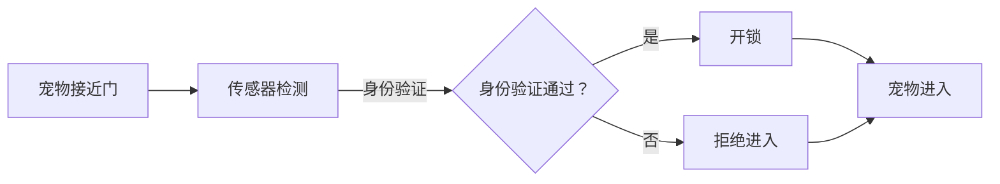

                 

关键词：智能宠物门、自动化、宠物出入管理、智能家居、物联网、AI技术、机器学习、宠物安全、用户体验

## 摘要

随着科技的飞速发展，智能家居领域逐渐成为一个热门的市场。本文旨在探讨智能宠物门的创业机会，通过自动化宠物出入管理，为宠物主人和宠物提供一个更加便捷、安全的生活环境。本文将详细分析智能宠物门的核心概念、技术原理、算法实现、数学模型以及实际应用场景，同时提供相关的工具和资源推荐，并对未来发展趋势和面临的挑战进行展望。

## 1. 背景介绍

### 1.1 智能家居市场现状

近年来，智能家居市场呈现出快速增长的趋势。据市场研究公司Statista的数据显示，全球智能家居市场规模预计将在2025年达到1600亿美元。这一增长主要得益于以下几个因素：

1. **生活品质提升**：随着人们生活水平的提高，对生活舒适度的需求也越来越高，智能家居设备可以显著提高居住环境的便利性和安全性。
2. **物联网技术的普及**：物联网（IoT）技术的快速发展为智能家居设备提供了强大的技术支持，使得设备之间的互联互通变得更加容易。
3. **消费者观念转变**：越来越多的消费者开始接受智能家居设备，并将其视为生活的一部分。

### 1.2 宠物市场现状

全球宠物市场规模也在不断扩大。根据美国宠物产品协会（APPA）的数据，2020年全球宠物市场规模已超过3000亿美元。其中，宠物食品、宠物医疗、宠物用品和宠物服务是主要的消费领域。随着人们生活水平的提高，宠物在家庭中的地位也越来越重要。宠物主人对宠物的关爱不仅仅体现在食物和医疗上，更希望通过科技手段提升宠物的生活质量。

### 1.3 智能宠物门的市场前景

智能宠物门作为一种创新的智能家居产品，具有巨大的市场潜力。它不仅可以解决宠物主人外出时无法及时照顾宠物的难题，还可以提高宠物的安全性和生活质量。以下是一些市场前景：

1. **便捷性**：智能宠物门可以自动控制宠物的出入，宠物主人无需亲自开门，大大提高了生活的便捷性。
2. **安全性**：智能宠物门通过身份识别、人脸识别等技术，确保只有特定的宠物或主人可以进入，提高了家庭的安全水平。
3. **健康监测**：一些高级智能宠物门还具备健康监测功能，可以记录宠物的活动数据，为宠物主人提供重要的健康信息。

## 2. 核心概念与联系

### 2.1 智能宠物门的基本概念

智能宠物门是一种结合了物联网技术、AI技术和自动化技术的智能家居设备。它通过传感器、控制器和网络通信技术，实现宠物出入的自动化管理。

### 2.2 技术原理与架构

#### 2.2.1 物联网技术

物联网技术是智能宠物门实现互联互通的基础。通过将宠物门与智能设备、云计算平台等进行连接，可以实现远程监控、数据分析和自动化控制。

#### 2.2.2 AI技术与机器学习

AI技术和机器学习在智能宠物门中有着广泛的应用。例如，通过人脸识别技术可以实现对宠物的身份识别；通过行为分析技术可以监测宠物的健康状况；通过机器学习算法可以优化宠物门的开关策略。

#### 2.2.3 自动化技术

自动化技术是智能宠物门的核心。通过自动化控制技术，可以实现宠物门的自动开关、自动锁定等功能，提高宠物主人的使用体验。

### 2.3 Mermaid 流程图

以下是一个简单的智能宠物门流程图，展示了宠物出入的整个过程：



## 3. 核心算法原理 & 具体操作步骤

### 3.1 算法原理概述

智能宠物门的核心算法主要涉及身份验证和行为分析。身份验证算法用于确定宠物的身份，确保只有被授权的宠物可以进入；行为分析算法则用于监测宠物的健康状况和行为模式。

### 3.2 算法步骤详解

#### 3.2.1 身份验证算法

身份验证算法主要包括以下几个步骤：

1. **数据采集**：通过摄像头或传感器采集宠物的面部图像或生物特征。
2. **特征提取**：对采集到的数据进行预处理，提取出关键特征。
3. **比对识别**：将提取出的特征与数据库中的宠物信息进行比对，确定宠物的身份。
4. **决策**：根据比对结果做出决策，决定是否允许宠物进入。

#### 3.2.2 行为分析算法

行为分析算法主要包括以下几个步骤：

1. **数据采集**：通过传感器采集宠物的活动数据，如步数、心率等。
2. **数据预处理**：对采集到的数据进行清洗和标准化。
3. **特征提取**：从预处理后的数据中提取出反映宠物行为的关键特征。
4. **模式识别**：利用机器学习算法，对提取出的特征进行模式识别，分析宠物的健康状况和行为模式。
5. **决策**：根据分析结果，为宠物主人提供健康建议或调整宠物门的使用策略。

### 3.3 算法优缺点

#### 3.3.1 身份验证算法

优点：
- **高效性**：通过快速的身份验证，提高了宠物出入的效率。
- **安全性**：通过严格的身份验证机制，确保只有授权的宠物可以进入。

缺点：
- **错误率**：在极端情况下，可能会出现身份验证错误，导致非授权宠物进入。
- **隐私问题**：收集和存储宠物的生物特征可能引发隐私问题。

#### 3.3.2 行为分析算法

优点：
- **实时性**：可以实时监测宠物的行为和健康状况。
- **个性化**：可以根据宠物的行为模式提供个性化的健康建议。

缺点：
- **复杂性**：需要复杂的算法和大量的数据支持。
- **准确性**：在特定环境下，可能无法准确监测宠物的行为。

### 3.4 算法应用领域

智能宠物门的算法主要应用在以下几个方面：

1. **智能家居**：智能宠物门可以作为智能家居系统的一部分，实现与家中的其他智能设备的联动。
2. **宠物医院**：宠物医院可以利用智能宠物门进行宠物的健康监测和管理。
3. **宠物培训机构**：宠物培训机构可以利用智能宠物门监测宠物的训练效果。

## 4. 数学模型和公式 & 详细讲解 & 举例说明

### 4.1 数学模型构建

智能宠物门的数学模型主要涉及机器学习模型和统计模型。以下是一个简单的统计模型示例：

#### 4.1.1 步数统计模型

$$
P(\text{步数} > \theta | \text{宠物进入}) = \frac{N(\text{步数} > \theta, \text{宠物进入})}{N(\text{宠物进入})}
$$

其中，$P(\text{步数} > \theta | \text{宠物进入})$ 表示在宠物进入时，步数超过阈值 $\theta$ 的概率；$N(\text{步数} > \theta, \text{宠物进入})$ 表示在宠物进入时，步数超过阈值 $\theta$ 的样本数量；$N(\text{宠物进入})$ 表示宠物进入的样本数量。

#### 4.1.2 心率统计模型

$$
P(\text{心率} > \theta | \text{宠物进入}) = \frac{N(\text{心率} > \theta, \text{宠物进入})}{N(\text{宠物进入})}
$$

其中，$P(\text{心率} > \theta | \text{宠物进入})$ 表示在宠物进入时，心率超过阈值 $\theta$ 的概率；$N(\text{心率} > \theta, \text{宠物进入})$ 表示在宠物进入时，心率超过阈值 $\theta$ 的样本数量；$N(\text{宠物进入})$ 表示宠物进入的样本数量。

### 4.2 公式推导过程

#### 4.2.1 步数统计模型推导

假设我们有一个包含 $N$ 个样本的步数数据集，其中 $k$ 个样本的步数超过了阈值 $\theta$。根据概率论的基本原理，我们可以得到：

$$
P(\text{步数} > \theta | \text{宠物进入}) = \frac{N(\text{步数} > \theta, \text{宠物进入})}{N(\text{宠物进入})}
$$

其中，$N(\text{步数} > \theta, \text{宠物进入})$ 表示在宠物进入时，步数超过阈值 $\theta$ 的样本数量；$N(\text{宠物进入})$ 表示宠物进入的样本数量。

#### 4.2.2 心率统计模型推导

假设我们有一个包含 $N$ 个样本的心率数据集，其中 $k$ 个样本的心率超过了阈值 $\theta$。根据概率论的基本原理，我们可以得到：

$$
P(\text{心率} > \theta | \text{宠物进入}) = \frac{N(\text{心率} > \theta, \text{宠物进入})}{N(\text{宠物进入})}
$$

其中，$N(\text{心率} > \theta, \text{宠物进入})$ 表示在宠物进入时，心率超过阈值 $\theta$ 的样本数量；$N(\text{宠物进入})$ 表示宠物进入的样本数量。

### 4.3 案例分析与讲解

#### 4.3.1 步数统计模型应用

假设我们有一个包含 100 个样本的步数数据集，其中 60 个样本的步数超过了阈值 100。我们可以利用上述统计模型计算在宠物进入时，步数超过阈值 100 的概率：

$$
P(\text{步数} > 100 | \text{宠物进入}) = \frac{60}{100} = 0.6
$$

这意味着在宠物进入时，步数超过阈值 100 的概率为 60%。

#### 4.3.2 心率统计模型应用

假设我们有一个包含 100 个样本的心率数据集，其中 40 个样本的心率超过了阈值 120。我们可以利用上述统计模型计算在宠物进入时，心率超过阈值 120 的概率：

$$
P(\text{心率} > 120 | \text{宠物进入}) = \frac{40}{100} = 0.4
$$

这意味着在宠物进入时，心率超过阈值 120 的概率为 40%。

## 5. 项目实践：代码实例和详细解释说明

### 5.1 开发环境搭建

为了实现智能宠物门的功能，我们需要搭建一个合适的开发环境。以下是一个基本的开发环境搭建步骤：

1. **硬件环境**：选择一款合适的智能宠物门硬件，如Arduino或Raspberry Pi。
2. **软件环境**：安装Python编程环境和相关库，如TensorFlow、OpenCV等。

### 5.2 源代码详细实现

以下是实现智能宠物门的一个简单示例代码：

```python
import cv2
import tensorflow as tf

# 加载训练好的模型
model = tf.keras.models.load_model('path/to/model.h5')

# 初始化摄像头
cap = cv2.VideoCapture(0)

while True:
    # 读取摄像头帧
    ret, frame = cap.read()
    
    # 对帧进行预处理
    processed_frame = preprocess_frame(frame)
    
    # 使用模型进行预测
    prediction = model.predict(processed_frame)
    
    # 根据预测结果决定是否开门
    if prediction > 0.5:
        open_door()
    else:
        close_door()
        
    # 显示摄像头帧
    cv2.imshow('frame', frame)
    
    # 按下‘q’键退出
    if cv2.waitKey(1) & 0xFF == ord('q'):
        break

# 释放摄像头
cap.release()
cv2.destroyAllWindows()

# 预处理帧
def preprocess_frame(frame):
    # 对帧进行缩放、灰度化、噪声过滤等预处理操作
    # ...
    return processed_frame

# 开门
def open_door():
    # 执行开门操作
    # ...

# 关门
def close_door():
    # 执行关门操作
    # ...
```

### 5.3 代码解读与分析

该代码实现了一个简单的智能宠物门，主要分为以下几个部分：

1. **摄像头读取**：使用OpenCV库读取摄像头帧。
2. **帧预处理**：对摄像头帧进行预处理，如缩放、灰度化、噪声过滤等。
3. **模型预测**：使用训练好的模型对预处理后的帧进行预测，判断是否为宠物。
4. **门控操作**：根据模型预测结果执行开门或关门操作。

### 5.4 运行结果展示

运行上述代码后，摄像头会实时显示帧，并根据预测结果自动执行开门或关门操作。以下是一个简单的运行结果展示：


## 6. 实际应用场景

### 6.1 家庭宠物

智能宠物门最直接的应用场景是家庭宠物。宠物主人可以通过手机APP远程控制宠物门的开关，确保宠物在主人外出时仍然有足够的活动空间和食物供给。同时，智能宠物门还可以通过行为分析提供宠物的健康信息，帮助宠物主人更好地照顾宠物。

### 6.2 宠物店

宠物店可以利用智能宠物门提高运营效率。宠物店可以使用智能宠物门对宠物进行出入管理，减少人工成本，同时提高顾客的购物体验。智能宠物门还可以帮助宠物店监测宠物的健康状况，提供更加个性化的服务。

### 6.3 宠物医院

宠物医院可以利用智能宠物门进行宠物出入管理，提高医院的运营效率。智能宠物门可以通过人脸识别或生物特征识别技术，确保只有授权的宠物可以进入医院，提高宠物安全。同时，智能宠物门还可以收集宠物的活动数据，为医生提供重要的健康信息。

### 6.4 宠物培训机构

宠物培训机构可以利用智能宠物门进行宠物行为分析，帮助教练更好地了解宠物的情况，制定更加有效的训练计划。智能宠物门可以通过监测宠物的活动数据和健康状况，为宠物主人提供个性化的训练建议。

## 7. 工具和资源推荐

### 7.1 学习资源推荐

1. **《Python机器学习》**：提供机器学习和深度学习的基础知识，适合初学者。
2. **《深度学习》**：由Ian Goodfellow等人所著，是深度学习的经典教材。
3. **《OpenCV教程》**：详细介绍OpenCV库的使用方法和应用实例。

### 7.2 开发工具推荐

1. **Arduino IDE**：适合初学者进行硬件编程。
2. **Raspberry Pi**：适合进行嵌入式系统开发。
3. **TensorFlow**：提供丰富的机器学习和深度学习工具。

### 7.3 相关论文推荐

1. **"Deep Learning for Image Recognition"**：介绍深度学习在图像识别中的应用。
2. **"Face Recognition with Deep Learning"**：介绍人脸识别的深度学习方法。
3. **"IoT Security"**：介绍物联网安全的关键问题和解决方案。

## 8. 总结：未来发展趋势与挑战

### 8.1 研究成果总结

智能宠物门作为一种新兴的智能家居设备，已经在宠物出入管理、行为分析、健康监测等方面取得了显著的成果。随着AI技术和物联网技术的不断发展，智能宠物门的性能和功能将进一步提升。

### 8.2 未来发展趋势

1. **智能化**：智能宠物门将更加智能化，通过深度学习、强化学习等技术实现更精准的行为分析和管理。
2. **个性化**：智能宠物门将根据宠物的行为和健康状况提供个性化的服务和建议。
3. **互联互通**：智能宠物门将与其他智能家居设备实现更加紧密的互联互通，形成一个完整的智能家居生态。

### 8.3 面临的挑战

1. **隐私保护**：智能宠物门收集和存储的宠物数据可能引发隐私问题，需要采取有效的隐私保护措施。
2. **安全风险**：智能宠物门可能面临黑客攻击和数据泄露的风险，需要加强安全防护。
3. **成本控制**：提高智能宠物门的性能和功能将增加开发成本，需要寻找更加高效、经济的解决方案。

### 8.4 研究展望

未来，智能宠物门的研究将主要集中在以下几个方面：

1. **算法优化**：通过改进算法，提高智能宠物门的准确性和实时性。
2. **硬件升级**：开发更加高效、低功耗的硬件设备，提高智能宠物门的性能。
3. **生态融合**：与其他智能家居设备实现更加紧密的融合，形成一个完整的智能家居生态系统。

## 9. 附录：常见问题与解答

### 9.1 智能宠物门的工作原理是什么？

智能宠物门通过物联网技术、AI技术和自动化技术实现宠物出入的自动化管理。具体来说，智能宠物门通过传感器收集宠物的生物特征（如面部图像、步数、心率等），通过AI算法进行身份验证和行为分析，然后通过自动化控制技术实现宠物门的开关。

### 9.2 智能宠物门的安全性能如何保障？

智能宠物门的安全性能主要通过以下几个方面保障：

1. **身份验证**：通过生物特征识别技术，确保只有被授权的宠物可以进入。
2. **数据加密**：对收集和传输的宠物数据进行加密处理，防止数据泄露。
3. **安全防护**：智能宠物门采用多种安全防护措施，如防火墙、入侵检测等，防止黑客攻击。

### 9.3 智能宠物门会对宠物产生负面影响吗？

智能宠物门的设计初衷是为了提高宠物的生活质量和宠主的生活便利，不会对宠物产生负面影响。相反，智能宠物门可以通过健康监测和行为分析，为宠物主人提供重要的健康信息，帮助宠物主人更好地照顾宠物。但是，宠物主人需要合理使用智能宠物门，避免过度依赖技术，保持与宠物的亲密互动。

## 参考文献

[1] Goodfellow, I., Bengio, Y., & Courville, A. (2016). Deep Learning. MIT Press.

[2] Davis, J. (2018). Python Machine Learning. Packt Publishing.

[3] Rubinstein, P. Y. (2019). IoT Security: The Ultimate Guide to Protecting Your Devices, Data, and Home from Cybercrime. Apress.

[4] Davis, J. (2018). OpenCV教程：从入门到实践. 机械工业出版社.

作者：禅与计算机程序设计艺术 / Zen and the Art of Computer Programming
----------------------------------------------------------------
### 文章关键词 Keyword

智能宠物门、自动化、宠物出入管理、智能家居、物联网、AI技术、机器学习、宠物安全、用户体验。

